# ML {#sec-alg-ml}

## Discriminant Analysis {#sec-alg-ml-discrim .unnumbered}

-   Not really a ML algorithm, but I don't really have a good place to put it.
-   Misc
    -   Packages
        -   [{]{style="color: #990000"}[candisc](https://friendly.github.io/candisc/){style="color: #990000"}[}]{style="color: #990000"} - Includes functions for computing and visualizing generalized canonical discriminant analyses and canonical correlation analysis for a multivariate linear model (MLM).
            -   The goal is to provide ways of visualizing such models in a low-dimensional space corresponding to dimensions (linear combinations of the response variables) of maximal relationship to the predictor variables.
        -   [{]{style="color: #990000"}[gipsDA](https://cran.r-project.org/web/packages/gipsDA/index.html){style="color: #990000"}[}]{style="color: #990000"} - Extends classical linear and quadratic discriminant analysis by incorporating permutation group symmetries into covariance matrix estimation.
            -   The 'gips' framework identifies and imposes permutation structures that act as a form of regularization, improving stability and interpretability in settings with symmetric or exchangeable features.
            -   Includes pooled and class-specific covariance models, as well as multi-class extensions with shared or independent symmetry structures.
        -   [{MASS::lda}]{style="color: #990000"}
        -   [{]{style="color: #990000"}[msda](https://cran.r-project.org/web/packages/msda/index.html){style="color: #990000"}[}]{style="color: #990000"} - Multi-Class Sparse Discriminant Analysis
        -   [{]{style="color: #990000"}[PLNmodels](https://cran.r-project.org/web/packages/PLNmodels/index.html){style="color: #990000"}[}]{style="color: #990000"} - Poisson Lognormal Models
            -   Supervized classification of multivariate count table with the Poisson discriminant Analysis
    -   Resources
        -   [Little Book of R for Multivariate Analysis](https://little-book-of-r-for-multivariate-analysis.readthedocs.io/en/latest/src/multivariateanalysis.html#linear-discriminant-analysis)
    -   Assumes Multivariate Normality of features
        -   [{]{style="color: #990000"}[MVN](https://cran.r-project.org/web/packages/MVN/index.html){style="color: #990000"}[}]{style="color: #990000"} ([Vignette](https://journal.r-project.org/articles/RJ-2014-031/)) - Tests for multivariate normality
            -   Contains the three most widely used multivariate normality: Mardia’s, Henze-Zirkler’s and Royston’s
            -   Graphical approaches, including chi-square Q-Q, perspective and contour plots.
            -   Two multivariate outlier detection methods, which are based on robust Mahalanobis distances
    -   Comparison with other statistical models
        -   Sort of a backwards MANOVA, i.e. categorical \~ continuous instead of continuous \~ categorical
        -   Interpretation similar to PCA
        -   Assumptions similar to both MANOVA and PCA
    -   Very fast even on a 1M row dataset
-   [Linear Discriminant Analysis (LDA)]{.underline}
    -   Notes from StatQuest: Linear Discriminant Analysis (LDA) clearly explained [video](https://www.youtube.com/watch?v=azXCzI57Yfc&list=PLblh5JKOoLUICTaGLRoHQDuF_7q2GfuJF&index=37)

    -   Goal is find an axis (2 dim) for a binary outcome or plane (3 dim) for a 3-category outcome, etc. that separates the predictor data which is grouped by the outcome categories.

    -   How well the groups are separated is determined by projecting the points on this lower dim object (e.g. axis, plane, etc.) and looking at these criteria:

        -   **Distance** **(d)** between the means of covariates (by outcome group) should be maximized
        -   **Scatter** (**s2)** ,i.e. variation, of data points per covariate (by outcome group) should be minimized

    -   Maximizing the ratio of Distance to Scatter determines the GoF of the separator\
        .png){.lightbox width="450"}

        -   Figure shows a example of a 2 dim predictor dataset that been projected onto a 1 dim axis. Dots are colored according to a binary outcome (green/red)
        -   In the binary case, the difference between the means is the distance, d.

    -   For multinomial outcomes, there are a couple differences:

        -   A centroid between all the predictor data is chosen, and centroids within each category of the grouped predictor data are chosen. For each category, d is the distance between the group centroid and the overall centroid\
            .png){.lightbox width="400"}
            -   The chosen group predictor centroids are determined by maximizing the distance-scatter ratio
        -   Using the coordinates of the chosen group predictor centroids, a plane is determined.\
            .png){.lightbox width="400"}
            -   For a 3 category outcome, 2 axes (i.e. a plane) are determined which will optimally separate the outcome categories

    -   By looking at which predictors are most correlated with the separator(s), you can determine which predictors are most important in the discrimination between the outcome categories.

    -   The separation can be visualized by using charting the data according to the separators\
        .png){.lightbox width="450"}

        -   Example shows the data is less overlap between black and blue dots and therefore grouped better using LDA than PCA.

    -   [Example]{.ribbon-highlight}: Site classification given the morphological measurements of california pitcher plants ([source](https://uw.pressbooks.pub/appliedmultivariatestatistics/chapter/discriminant-analysis/))

        ::: panel-tabset
        ## Data and Model

        Automatic Leave-One-Out cross-validation is available using [cv = TRUE]{.arg-text}

        You can specify a training set with a row index vector in the [subset]{.arg-text} argument

        ``` r
        library(dplyr)
        url <- "https://raw.githubusercontent.com/jon-bakker/appliedmultivariatestatistics/main/Darlingtonia_GE_Table12.1.csv"
        darl_dat_raw <- readr::read_csv(url, col_select = -plant)
        darl_dat_proc <- darl_dat_raw |> 
          mutate(across(where(is.numeric), scale))
        da_mod <- MASS::lda(site ~ ., data = darl_dat)
        da_mod
        #> Prior probabilities of groups:
        #>        DG        HD       LEH       TJH 
        #> 0.2873563 0.1379310 0.2873563 0.2873563 
        #> 
        #> Group means:
        #>          height  mouth.diam   tube.diam  keel.diam wing1.length wing2.length  wingsprea hoodmass.g  tubemass.g  wingmass.g
        #> DG   0.03228317  0.34960765 -0.64245369 -0.3566764    0.3998415    0.2997874 -0.2093847  0.4424329  0.30195655  0.03566704
        #> HD  -0.41879232 -1.37334175  0.93634832  1.3476695   -0.8102232   -0.3184490 -0.1996899 -1.1498678 -1.05297022 -0.28283531
        #> LEH  0.22432324  0.25108333  0.23567347 -0.4189580    0.5053448    0.3853959  0.6919511 -0.1754338  0.07558687  0.23585050
        #> TJH -0.05558610  0.05851306 -0.04266698  0.1287530   -0.5162792   -0.5323277 -0.3867152  0.2849374  0.12788229 -0.13575660
        #> 
        #> Coefficients of linear discriminants:
        #>                      LD1        LD2         LD3
        #> height        1.40966787  0.2250927 -0.03191844
        #> mouth.diam   -0.76395010  0.6050286  0.45844178
        #> tube.diam     0.82241013  0.1477133  0.43550979
        #> keel.diam    -0.17750124 -0.7506384 -0.35928102
        #> wing1.length  0.34256319  1.3641048 -0.62743017
        #> wing2.length -0.05359159 -0.5310177 -1.25761674
        #> wingsprea     0.38527171  0.2508244  1.06471559
        #> hoodmass.g   -0.20249906 -1.4065062  0.40370294
        #> tubemass.g   -1.58283705  0.1424601 -0.06520404
        #> wingmass.g    0.01278684  0.0834041  0.25153893
        #> 
        #> Proportion of trace:
        #>    LD1    LD2    LD3 
        #> 0.5264 0.3790 0.0946 
        ```

        -   [Prior probabilities of groups]{.arg-text}: By default, they're set the proportions of the observed data, but they can be specified within the model function
            -   These probabilities are weights in the calculations of a DA: the higher the probability, the more weight a group is given
        -   [Group means]{.arg-text}: The mean value of each variable in each group (note whether standardized or unstandardized
        -   [Coefficients of linear discriminants]{.arg-text}: Roughly analogous to the loadings produced in a PCA.
            -   Standardizing during preprocessing allows you to compare the LD coefficients directly among variables.
            -   Larger coefficients (either positive or negative) indicate variables that carry more weight with respect to that LD.
            -   The coefficients of linear discriminants – an eigenvector – would be multiplied by the corresponding variables to produce a score an individual observation on a particular LD.
        -   [Proportion of trace]{.arg-text}: The proportion of variation explained by each LD function (eigenvalue). Note that these always sum to 1, and are always in descending order (i.e., the first always explains the most variation).

        ## Prediction

        ``` r
        da_mod_preds <- predict(da_mod)
        head(round(da_mod_preds$posterior, 2))
        #>     DG   HD  LEH  TJH
        #> 1 0.77 0.00 0.00 0.23
        #> 2 0.21 0.00 0.04 0.75
        #> 3 0.15 0.03 0.55 0.27
        #> 4 0.46 0.00 0.02 0.53
        #> 5 0.67 0.00 0.06 0.27
        #> 6 0.42 0.00 0.01 0.57

        (da_mod_conf <- table(darl_dat_proc$site, da_mod_preds$class))
        #>      DG HD LEH TJH
        #>  DG  18  0   2   5
        #>  HD   0 11   1   0
        #>  LEH  3  0  21   1
        #>  TJH  2  0   3  20

        sum(diag(da_mod_conf))/sum(da_mod_conf) * 100
        #> [1] 80.45977
        ```

        -   [darl_preds\$posterior]{.arg-text} are the predicted probabilities for each class
        -   Using the values from the confusion matrix, we can calculate the accuracy which is 80%
        :::

## Support Vector Machines {#sec-alg-ml-svm .unnumbered}

{.lightbox width="532"}

-   [Misc]{.underline}
    -   Packages:
        -   [{]{style="color: #990000"}[e1071](https://cran.r-project.org/web/packages/e1071/index.html){style="color: #990000"}[}]{style="color: #990000"}, [{]{style="color: #990000"}[kernlab](https://cran.r-project.org/web/packages/kernlab/index.html){style="color: #990000"}[}]{style="color: #990000"}, [{]{style="color: #990000"}[LiblineaR](https://cran.r-project.org/web/packages/LiblineaR/index.html){style="color: #990000"}[}]{style="color: #990000"}, [{{sklearn}}]{style="color: goldenrod"}
        -   [{]{style="color: #990000"}[maize](https://github.com/frankiethull/maize){style="color: #990000"}[}]{style="color: #990000"} - An extension library for support vector machines in tidymodels that consists of additional kernel bindings listed in [{kernlab}]{style="color: #990000"} that are not available in the [{parsnip}]{style="color: #990000"} package
            -   [{parnsip}]{style="color: #990000"} has three kernels available: linear, radial basis function, & polynomial. [{maize}]{style="color: #990000"} currently adds five more kernels: laplace, bessel, anova rbf, spline, & hyperbolic tangent.
        -   [{]{style="color: #990000"}[dcsvm](https://cran.r-project.org/web/packages/dcsvm/index.html){style="color: #990000"}[}]{style="color: #990000"} - Efficient algorithm for solving sparse-penalized support vector machines with kernel density convolution.
            -   Designed for high-dimensional classification tasks, supporting lasso (L1) and elastic-net penalties for sparse feature selection and providing options for tuning kernel bandwidth and penalty weights.
        -   [{]{style="color: #990000"}[hdsvm](https://cran.r-project.org/web/packages/hdsvm/index.html){style="color: #990000"}[}]{style="color: #990000"} - Implements an efficient algorithm to fit and tune penalized Support Vector Machine models using the generalized coordinate descent algorithm.
            -   Designed to handle high-dimensional datasets effectively, with emphasis on precision and computational efficiency.
    -   Also see
        -   [Model Building, tidymodels \>\> Model Specification](model-building-tidymodels.qmd#sec-modbld-tidymod-modspec){style="color: green"} \>\> Support Vector Machines
        -   [Model Building, sklearn \>\> Misc](model-building-sklearn.qmd#sec-modbld-sklearn-misc){style="color: green"} \>\> Tuning
-   [Process]{.underline}
    -   Works on the principle that you can linearly separate a set of points from another set of point simply by transforming the dataset from dimension n to dimension n + 1.
        -   The transformation is made by a feature transformation function, φ(x). For two dimensions, a particular φ(x) might transform the vector, x = {x₁, x₂}, which is in 2 dimensions, to {x²₁, √(2x₁x₂), x²₂}, which is 3 dimensions
    -   Transforming a set of vectors into a higher dimension, performing a mathematical operation (e.g. dot product), and transforming the vectors back to lower dimension is involves many steps and therefore is computationally expensive.
        -   The problem can become computationally intractable fairly quickly. Kernels are able perform these operations in much fewer steps.
    -   Creates a hyperplane at a threshold that is equidistant between classes of the target variable
    -   Edge observations are called Support Vectors and the distance between them and the threshold is called the Maximum Margin
-   [Kernels]{.underline}
    -   Gaussian Kernel aka Radial Basis Function (RBF) Kernel

        $$
        K(x,y) = e^{-\gamma \lVert x - y \rVert^2}
        $$

        -   $K(x,y)$ performs the dot product in the higher dimensional space without having to first transform the vectors

        -   Advantages

            -   Can model complex, non-linear relationships
            -   Works well when there's no prior knowledge about data relationships
            -   Effective in high-dimensional spaces

        -   Challenges

            -   Choosing an appropriate $\gamma$ value (often done through cross-validation)
            -   Can be computationally expensive for large datasets

    -   Polynomial Kernel

        $$
        K(x,y) = (\alpha \cdot x^Ty + c )^d
        $$

        -   $x^T y$ is the dot product of $x$ and $y$
        -   $\alpha$ is a scaling parameter (often set to 1)
        -   $c$ is a constant term that trades off the influence of higher-order versus lower-order terms
            -   When $c \gt 0$, it allows the model to account for interactions of all orders up to $d$
            -   When $c = 0$, it's called a homogeneous polynomial kernel
        -   $d$ is the degree of the polynomial
            -   Controls the flexibility of the decision boundary
            -   Higher $d$ allows modeling of more complex relationships
        -   Advantages
            -   Can model feature interactions explicitly
            -   Works well when all training data is normalized
            -   Computationally less expensive than RBF kernel for low degrees
        -   Challenges
            -   Choosing appropriate values for $d$ and $c$
            -   Can lead to numerical instability for large $d$
            -   May overfit for high degrees, especially with small datasets
-   [Hyperparameters]{.underline}
    1.  *gamma --* All the kernels except the linear one require the gamma parameter. ({e1071} default: 1/(data dimension)
    2.  *coef0 --* Parameter needed for kernels of type polynomial and sigmoid ({e1071} default: 0).
    3.  *cost --* The cost of constraints violation ({e1071} default: 1)---it is the '**C**'-constant of the regularization term in the Lagrange formulation.
        -   C = 1/λ (R) or 1/α (sklearn)
        -   When C is small, the regularization is strong, so the slope will be small
    4.  *degree -* Degree of the polynomial kernel function ({e1071} default: 3)
    5.  *epsilon* - Needed for insensitive loss function (see Regression below) ({e1071} default: 0.1)
        -   When the value of epsilon is small, the model is robust to the outliers.
        -   When the value of epsilon is large, it will take outliers into account.
    6.  *nu* - For {e1071}, needed for *types*: nu-classification, nu-regression, and one-classification
-   [Regression]{.underline}\
    {.lightbox width="542"}
    -   *Stochastic* Gradient Descent is used in order minimize MAE loss
        -   Also see
            -   [Model building, sklearn](model-building-sklearn.qmd#sec-modbld-sklearn-algs){style="color: green"} \>\> Stochaistic Gradient Descent (SGD)
            -   [Loss Functions \>\> Misc](loss-functions.qmd#sec-lossfun-misc){style="color: green"} \>\> Mean Absolute Error (MAE)
    -   **Epsilon Insensitive Loss** - The idea is to use an "insensitive tube" where errors less than epsilon are ignored. For errors \> epsilon, the function is linear.
        -   Epsilon defines the "width" of the tube.
        -   See [Loss Functions \>\> Huber loss](loss-functions.qmd#sec-lossfun-hubloss){style="color: green"} for something similar
        -   Squared Epsilon Insensitive loss is the same but becomes squared loss past a tolerance of epsilon
    -   L2 typically used the penalty
    -   In SVM for classification, "margin maximization" is the focus which is equivalent to the coefficient minimization with a L2 norm. For SVR, usually the focus is on "epsilon insensitive."
-   Visualization
    -   Decision Boundary
        -   [Example]{.ribbon-highlight}

            {.lightbox width="432"}

            ``` r
            # Create a grid of points for prediction
            x1_grid <- seq(min(data$x1), max(data$x1), length.out = 100)
            x2_grid <- seq(min(data$x2), max(data$x2), length.out = 100)
            grid <- expand.grid(x1 = x1_grid, x2 = x2_grid)

            predicted_labels <- predict(svm_model, newdata = grid)

            plot(data$x1, data$x2, col = factor(data$label), pch = 19, main = "SVM Decision Boundary")
            points(grid$x1, grid$x2, col = factor(predicted_labels), pch = ".", cex = 1.5)
            legend("topright", legend = levels(data$label), col = c("red", "blue"), pch = 19)
            ```

            -   (Legend colors in the wrong order)
            -   [x1_grid]{.var-text} and [x2_grid]{.var-text} provide equally spaced points within the range of sample data.
            -   [grid]{.var-text} is a df of all combinations of these points
            -   The predicted labels from \[grid\] are colored and visualize the decision boundary.
            -   [{e1071}]{style="color: #990000"} provides a plot function that also does this: `plot(svm_model, data = data, color.palette = heat.colors)`

## K Nearest Neighbors (kNN) {#sec-alg-ml-knn .unnumbered}

### Misc {#sec-alg-ml-knn-misc .unnumbered}

-   Packages
    -   [{]{style="color: #990000"}[kknn](https://cran.r-project.org/web/packages/kknn/index.html){style="color: #990000"}[}]{style="color: #990000"} - Weighted k-Nearest Neighbors for Classification, Regression and Clustering.
    -   [{]{style="color: #990000"}[LCCkNN](https://cran.r-project.org/web/packages/LCCkNN/index.html){style="color: #990000"}[}]{style="color: #990000"} - Adaptive k-Nearest Neighbor Classifier Based on Local Curvature Estimation
        -   Implements the kK-NN algorithm, an adaptive k-nearest neighbor classifier that adjusts the neighborhood size based on local data curvature
        -   Aims to improve classification performance, particularly in datasets with limited samples

### Approximate Nearest Neighbor (ANN) {#sec-alg-ml-knn-ann .unnumbered}

-   kNN runs at O(N\*K), where N is the number of items and K is the size of each embedding. Approximate nearest neighbor (ANN) algorithms typically drop the complexity of a lookup to O(log(n)).
-   Misc
    -   Also see [Maximum inner product search using nearest neighbor search algorithms](https://towardsdatascience.com/maximum-inner-product-search-using-nearest-neighbor-search-algorithms-c125d24777ef)
        -   It shows a preprocessing transformation that is performed before kNN to make it more efficient
        -   It might already be implemented in ANN algorithms
    -   Packages
        -   [{]{style="color: goldenrod"}[faiss-gpu, cpu](https://faiss.ai/){style="color: goldenrod"}[}]{style="color: goldenrod"} - Efficient similarity search and clustering of dense vectors.
            -   Contains algorithms that search in sets of vectors of any size, up to ones that possibly do not fit in RAM.
            -   Contains supporting code for evaluation and parameter tuning.
        -   [{]{style="color: #990000"}[RANN](https://github.com/jefferislab/RANN){style="color: #990000"}[}]{style="color: #990000"} - Wraps Mount's and Arya's ANN library (2010) that's written in C++. Finds the k nearest neighbours for every point in a given dataset in O(N log N) time.
            -   Support for approximate as well as exact searches, fixed radius searches and bd as well as kd trees.
            -   Euclidean (L2) and Manhattan (L1)
        -   [{]{style="color: #990000"}[RcppAnnoy](https://dirk.eddelbuettel.com/code/rcpp.annoy.html){style="color: #990000"}[}]{style="color: #990000"} - [Annoy](https://github.com/spotify/annoy) is a small, fast and lightweight library for Approximate Nearest Neighbours with a particular focus on efficient memory use and the ability to load a pre-saved index. Used at Spotify.
        -   [{]{style="color: #990000"}[dbscan](https://github.com/mhahsler/dbscan){style="color: #990000"}[}]{style="color: #990000"} - Besides dbscan clustering, it has Fast Nearest-Neighbor Search (using kd-trees)
            -   kNN search
            -   Fixed-radius NN search
            -   The implementations use the kd-tree data structure (from library ANN) for faster k-nearest neighbor search, and are for Euclidean distance typically faster than the native R implementations (e.g., dbscan in package `fpc`), or the implementations in [WEKA](#0), [ELKI](#0) and Python’s scikit-learn.
        -   [{]{style="color: #990000"}[usearchlite](https://cran.r-project.org/web/packages/usearchlite/index.html){style="color: #990000"}[}]{style="color: #990000"} - Local Vector Search with 'USearch'
            -   A lightweight local vector index for approximate nearest neighbor (ANN) search using the vendored 'USearch' library
-   Used mostly in Similarity Search: Quickly identify items most similar to a given item or user profile.
    -   Commonly used in Recommendation algs to find similar user-item embeddings at the end. Also, any NLP task where you need to do a similarity search of one character embedding to other character embeddings.
-   Generally uses one of two main categories of hashing methods: either data-independent methods, such as locality-sensitive hashing (LSH); or data-dependent methods, such as Locality-preserving hashing (LPH)
-   [Locality-Sensitive Hashing (LSH)]{.underline}
    -   Hashes similar input items into the same "buckets" with high probability.
    -   The number of buckets is much smaller than the universe of possible input items
    -   Hash collisions are maximized, not minimized, where a **collision** is where two distinct data points have the same hash.
-   [Spotify's Annoy]{.underline}
    -   Uses a type of LSH, Random Projections Method (RPM) (article didn't explain this well)
    -   L RPM hashing functions are chosen. Each data point, p, gets hashed into buckets in each of the L hashing tables. When a new data point, q, is "queried," it gets hash into buckets like p did. All the hashes in the same buckets of p are pulled and the hashes within a certain threshold, c\*R, are considered nearest neighbors.
        -   Wiki [article](https://en.wikipedia.org/wiki/Locality-sensitive_hashing#LSH_algorithm_for_nearest_neighbor_search) on LSH and RPM clears it up a little, but I'd probably have to go to Spotify's paper to totally make sense of this.
    -   Also the Spotify alg might bring trees/forests into this somehow
-   [Facebook AI Similarity Search (FAISS)]{.underline}
    -   Hierarchical Navigable Small World Graphs (HNSW)
    -   HNSW has a polylogarithmic time complexity (O(logN))
    -   Two approximations available Embeddings are clustered and centroids are calculated. The k nearest centroids are returned.
        -   Embeddings are clustered into veroni cells. The k nearest embeddings in a veroni cell or a region of veroni cells is returned.
    -   Both types of approximations have tuning parameters.
-   [Inverted File Index + Product Quantization (IVFPQ)]{.underline}([article](https://towardsdatascience.com/similarity-search-with-ivfpq-9c6348fd4db3))

## Multivariate Adaptive Regression Splines (MARS) {#sec-alg-ml-mars .unnumbered}

-   [Misc]{.underline}

    -   Packages
        -   [{]{style="color: #990000"}[earth](https://cran.r-project.org/web/packages/earth/index.html){style="color: #990000"}[}]{style="color: #990000"} - The primary R package for MARS; "earth" stands for **E**nhanced **A**daptive **R**egression **T**hrough **H**inges.
            -   Supports regression, classification (binomial, multinomial, Poisson via the [glm]{.arg-text} argument), and multiple simultaneous responses
            -   Includes built-in variable importance via the `evimp()` function
            -   Supports variance models for heteroscedastic data via the [varmod.method]{.arg-text} argument (see [Variance Models]{.underline} below)
            -   Compatible with [{tidymodels}]{style="color: #990000"} workflows via the `"earth"` engine
    -   Resources
        -   [Multivariate Adaptive Regression Splines](https://www.jstor.org/stable/2241837) - Original Friedman (1991) paper introducing MARS
        -   [The Elements of Statistical Learning, Ch. 9.4](https://hastie.su.domains/ElemStatLearn/) - Hastie, Tibshirani & Friedman; accessible introduction to MARS
        -   [Applied Predictive Modeling, Ch. 7](https://link.springer.com/book/10.1007/978-1-4614-6849-3) - Kuhn & Johnson cover MARS in the context of nonlinear regression
    -   Notes from
        -   [Notes on the earth package](http://www.milbo.org/doc/earth-notes.pdf) - [{earth}]{style="color: #990000"} vignette ; comprehensive reference for arguments, internals, cross-validation, and FAQs
        -   [Variance models in earth](http://www.milbo.org/doc/earth-varmod.pdf) - [{earth}]{style="color: #990000"} vignette on prediction intervals and variance models
    -   Kuhn recommends bagging these models ([source](https://topepo.github.io/caret/miscellaneous-model-functions.html#bagged-mars-and-fda))
    -   Comparison with Related Methods
        -   MARS vs. GAM: MARS automatically selects knots and interactions; GAM uses smooth splines per predictor and requires manual interaction specification
            -   MARS is better when the relationship involves abrupt changes or threshold effects better captured by piecewise linearity and in a higher-dimensional settings where manual interaction specification is impractical.
            -   The smoother fit and lack of regression terms reduces variance when compared to MARS, but ignoring variable interactions can worsen the bias.
        -   MARS vs. Decision Trees: Both are piecewise and perform implicit variable selection, but MARS produces continuous, linear-between-knots fits rather than step functions, and is generally smoother

-   [Process]{.underline}

    -   MARS builds a model by searching for breakpoints (knots) in the predictor space and fitting piecewise linear segments defined by **hinge functions** (also called *reflected pairs*):\
        {.lightbox width="632"}

        $$
        h(x - t) = \max(0,\, x - t), \quad h(t - x) = \max(0,\, t - x)
        $$

        where $t$ is a knot location. The model is a weighted sum of these basis functions:

        $$
        \hat{y} = \beta_0 + \sum_{m=1}^{M} \beta_m B_m(\mathbf{x})
        $$

        -   $B_m(\mathbf{x})$ is the $m$-th basis function, which may be a single hinge or a product of hinges (for interactions)
        -   $\beta_m$ are coefficients estimated by ordinary least squares after the pruning process

    -   The algorithm proceeds in two phases:\
        {.lightbox width="632"}

        1.  **Forward pass** — Greedily adds pairs of reflected hinge functions (and their products) to the model, choosing the predictor and knot location that most reduces the residual sum of squares at each step. The model is deliberately over-fit.
            -   MARS nests linear regression as a special case when no knots are placed; it reduces to OLS if the forward pass finds no useful breakpoints
            -   The forward pass stops when any of the following conditions is met:
                -   The maximum number of terms [nk]{.arg-text} is reached
                -   Adding a term changes R² by less than [0.001]{.arg-text} (controlled by [thresh]{.arg-text})
                -   R² reaches [0.999]{.arg-text} or higher
                -   GRSq drops below [−10]{.arg-text} (a pathologically poor penalized fit)
                -   No new term can increase R² (numerical accuracy limit)
        2.  **Backward pruning (GCV)** — More precisely called the *pruning* pass; [backward]{.arg-text} stepwise deletion is the default but other methods are available via [pmethod]{.arg-text} (e.g., [cv]{.arg-text} for cross-validation-based selection).
            -   Algorithm

                -   Basis functions are removed one at a time, saving the RSS, GCV, and term set for every submodel down to the intercept alone.
                -   The submodel with the best GCV is selected as the final model.
                -   Coefficients are then estimated by OLS on the final basis matrix.

            -   Generalized Cross-Validation

                $$
                \begin{align}
                &\text{GCV} = \frac{\text{RSS}}{N \cdot \left(\frac{1 - \tilde M)}{N}\right)^2} \\
                &\text{where} \;\; \tilde M = \frac{(M + \text{penalty})(M-1)}{2}
                \end{align}
                $$

                -   $\tilde{M}$ is the effective number of parameters and $M$ is the number of parameters
                    -   $(M-1) /2$ is the number of hinge function knots
                -   The penalty discourages the model from keeping too many knots even if RSS decreases
                -   GCVs are used during the forward pass only as a stopping condition; changing [penalty]{.arg-text} does not affect knot positions, only the pruning pass

    -   Model bias — Bias is most visible at sharp corners in the response surface; loosening the algorithm to fit those corners more tightly increases the risk of overfitting elsewhere. This bias cannot be reliably estimated, which also limits prediction interval accuracy

    -   Auto-linear terms — During the forward pass, if the best knot for a predictor is at its minimum value, [{earth}]{style="color: #990000"} automatically enters that predictor linearly (no hinge) rather than placing a hinge at the edge.

        -   This is the default behavior ([Auto.linpreds = TRUE]{.arg-text}) and means the basis matrix can contain negative values, unlike the classic MARS formulation. Set [Auto.linpreds = FALSE]{.arg-text} to revert to classic behavior

-   [Interactions]{.underline}

    -   Interactions are modeled by multiplying two or more hinge functions together, e.g.:

        $$
        B_m(\mathbf{x}) = h(x_1 - t_1) \cdot h(x_2 - t_2)
        $$

    -   The maximum interaction degree is controlled by the [degree]{.arg-text} argument in [{earth}]{style="color: #990000"} ([degree = 1]{.arg-text} forces an additive model, [degree = 2]{.arg-text} allows pairwise interactions, etc.)

    -   At [degree = 1]{.arg-text}, MARS is roughly equivalent to a piecewise-linear GAM with automatically placed knots

    -   Higher degrees can capture complex response surfaces but increase the risk of over-fitting

    -   Use the [allowed]{.arg-text} argument to fine-tune which predictors are permitted to appear in interaction terms (e.g., prevent a specific variable from interacting with another)

-   [Hyperparameters]{.underline}

    1.  [nk]{.arg-text}: Maximum number of terms in the forward pass (default: `min(200, max(20, 2 * ncol(x))) + 1)`
        -   if the termination condition printed by [{earth}]{style="color: #990000"} reads [Reached maximum number of terms]{.arg-text}, consider increasing [nk]{.arg-text} — the forward pass may have stopped too early.
        -   Note: it is generally better to use a large [nk]{.arg-text} and control model size with [nprune]{.arg-text} than to use a small [nk]{.arg-text} directly, because the pruning pass can pick from any generated term while the forward pass is greedy
    2.  [degree]{.arg-text}: Maximum degree of interaction among hinge functions (default: [1]{.arg-text});
        -   [degree = 2]{.arg-text} is a common choice for allowing pairwise interactions
    3.  [thresh]{.arg-text}: Forward-pass stopping threshold; a term is added only if it reduces R² by more than this fraction (default: [0.001]{.arg-text})
        -   Set to [0]{.arg-text} to disable most stopping conditions except [nk]{.arg-text} and numerical limits.
    4.  [nprune]{.arg-text} — *Maximum* number of terms (including the intercept) retained after pruning
    5.  [penalty]{.arg-text} — GCV penalty per knot (default: [2]{.arg-text} for [degree = 1]{.arg-text}, [3]{.arg-text} for [degree \> 1]{.arg-text}); higher values encourage sparser models
        -   The forward pass also stops if GRSq drops below [−10]{.arg-text}; set [penalty = -1]{.arg-text} to disable this GRSq floor
        -   Default is equivalent to selection by AIC
    6.  [pmethod]{.arg-text} — Pruning method (default: [backward]{.arg-text}); [cv]{.arg-text} selects the number of terms by cross-validation rather than GCV; requires [nfold]{.arg-text} to be set
    7.  [nfold]{.arg-text} / [ncross]{.arg-text} — Number of cross-validation folds and repetitions; used when [pmethod = "cv"]{.arg-text} or when building variance models.
        -   Use [ncross]{.arg-text} ≥ 30 for stable variance model estimates.
        -   Use [keepxy = TRUE]{.arg-text} to enable cross-validation plots via `plot.earth`
    8.  [linpreds]{.arg-text} — Names or indices of predictors to force into the model linearly (no hinge)
        -   Useful when a predictor is known or suspected to have a linear relationship with the response

-   [Variable Importance]{.underline}

    -   `evimp` reports importance based on three criteria:
        -   [nsubsets]{.arg-text}: The number of model subsets (during backward pruning) in which a predictor appears; this is the criterion used by `summary.earth` to rank predictors; higher = more consistently retained
        -   [gcv]{.arg-text}: The net reduction in GCV attributable to the predictor across all subsets it appears in; scaled so the largest value = 100. Can be negative if adding the variable worsened the GCV-penalized fit more often than it helped
        -   [rss]{.arg-text}: Same as [gcv]{.arg-text} but using RSS instead; generally more stable than [gcv]{.arg-text}
    -   A [\>]{.arg-text} printed next to a [gcv]{.arg-text} or [rss]{.arg-text} value means the criterion *increased* (worsened) when that variable was added, i.e., the [gcv]{.arg-text}/[rss]{.arg-text} ranking disagrees with the [nsubsets]{.arg-text} ranking
    -   Predictors listed as [-unused]{.arg-text} appeared in the forward pass but were dropped during pruning; pass [trim = FALSE]{.arg-text} to `evimp` to show them
    -   Issues
        -   Variables involved in interaction terms get credit for the full interaction term — this means interaction predictors are weighted more heavily than additive ones, which may overstate their individual importance
        -   Collinear predictors can mask each other (MARS will somewhat arbitrarily pick one);
        -   Importance estimates can have high variance across different training samples
        -   P-values are not available or meaningful for MARS models

-   [Uncertainty Quantification]{.underline}

    -   By default, [{earth}]{style="color: #990000"} does not produce prediction intervals. The [varmod.method]{.arg-text} argument tells `earth` to fit a secondary **variance model** on the residuals of the main MARS model, enabling heteroscedastic prediction intervals.

        -   Cross-validation is required to estimate model variance for prediction intervals; specify [nfold]{.arg-text} and [ncross]{.arg-text} (recommended: [ncross]{.arg-text} ≥ 30) when using [varmod.method]{.arg-text}

    -   The variance model works by regressing the absolute residuals of the main model on the fitted values: (e.g. linear model). (This is technically the Residual Model, see below)

        ``` r
        lm(abs(residuals) ~ predict(earth.model))
        ```

        -   Absolute residuals are preferred over squared residuals because squaring amplifies outliers, making the residual model less stable
        -   The fit uses **Iteratively Reweighted Least Squares (IRLS)**, since the residuals of the residual model are themselves heteroscedastic; iteration stops when coefficients change by less than 1%

    -   Getting CIs/PIs

        -   Confidence intervals: The uncertainty in the mean predicted response due to model variance alone; use [interval = "cint"]{.arg-text}
        -   Prediction intervals: The uncertainty for a single future observation; adds irreducible error on top of model variance, so they are always wider than confidence intervals; use [interval = "pint"]{.arg-text}

    -   [varmod.method]{.arg-text} options (i.e. regression model used in residual model)

        -   ["lm"]{.arg-text}: Linear regression on absolute residuals vs. fitted values
            -   Assumes standard deviation increases linearly with the response; good default choice
        -   ["rlm"]{.arg-text}: Robust linear regression; produces narrower intervals by down-weighting outlying residuals, but can underestimate error variance when errors are mostly Gaussian
        -   ["gam"]{.arg-text}: Allows non-linear variance trends; more flexible but more prone to overfitting on the residuals
        -   ["earth"]{.arg-text}: Uses a MARS model for the residual model; no IRLS iteration
        -   ["power"]{.arg-text}: Estimates a power-of-the-mean model: $\sigma = \text{intercept} + \text{coef} \cdot \hat{y}^{\,\text{exponent}}$
            -   Useful when the response is strictly positive and variance scales with the mean (e.g., Poisson: exponent ≈ 0.5, Gamma: exponent ≈ 1)
            -   The exponent can also be fixed manually via [varmod.exponent]{.arg-text} if known
        -   ["const"]{.arg-text}: Assumes homoscedastic errors; no IRLS needed
        -   General Rules:
            -   Prefer non-[x.]{.arg-text} methods (e.g., ["lm"]{.arg-text}) which model variance as a function of the fitted response $\hat{y}$.
            -   Use [x.]{.arg-text} variants (e.g., ["x.lm"]{.arg-text}) only when the response is non-monotonic and variance has a many-to-one (multimapped) relationship with $\hat{y}$ that cannot be captured by modeling variance as a function of the fitted values alone\
                {width="232"}

    -   Extracting the Residual Model and Variance Model

        -   The Residual Submodel is the regression of the absolute residuals on the fitted value
            -   `summary(earth.mod$varmod$residmod)` will the display the residual model directly
        -   The Variance Model is a wrapper for the residual submodel. It provides summary and plot methods, and takes care of rescaling absolute residuals to standard deviations and clamping to [min.sd]{.arg-text}
            -   Where `min.sd <- 0.1 * mean(sd(residuals))` and [0.1]{.arg-text} can be changed via [varmod.clamp]{.arg-text}

            -   `summary(earth.mod$varmod)` will display the variance model directly

    -   Checking the variance model

        -   In the residuals plot, the lowess line should stay approximately on the center axis and residuals should be dispersed roughly symmetrically — asymmetric spread suggests the assumption of symmetric errors may be violated
            -   [which = 3]{.arg-text} plots a loess red line

            -   [which = 5]{.arg-text} or [9]{.arg-text} plots a robust linear regression line

                -   Slope included with [info = TRUE]{.arg-text}

            -   [versus = ""]{.arg-text} plots Residuals vs Predictors

                -   Heteroskedacity may not show in the overall Residuals vs Fitted but show up in Residuals vs Predictor

            -   [versus="b:"]{.arg-text} plots Residuals against the MARS basis functions

            -   [Example]{.ribbon-highlight}:\
                {.lightbox width="582"}

                ``` r
                # residuals vs fitted
                plot(earth.mod, which = 3, level = .95)
                # standardized residuals vs fitted
                plot(earth.mod, which = 3, standardize = TRUE)
                ```

                -   Left: Absolute Residuals vs. Fitted
                    -   The darker grayish band shows the confidence limits; the wider pink band shows the prediction limits
                    -   The pale blue line is the mean of the out-of-fold predictions ([oof.meanfit]{.arg-text}) from the cross-validation. In this example the line is close to the center line, indicating that the mean out-of-fold predictions generated by the fold models approximately match those of the final model on all the data
                    -   If we used [info=TRUE]{.arg-text} (see below), the displayed Spearman correlation would be 0.38, confirming that there is correlation between the absolute residuals and the fitted values, i.e., the raw residuals are heteroscedastic.
                -   Right: Standardized Residuals vs. Fitted
                    -   The red line remains close to the center line, so indicates that the model is a good fit to the training data. (The center line corresponds to the predicted fit.)
                    -   Set [info = TRUE]{.arg-text} to get the Spearman Rank Correlation of absolute residuals with fitted values.
                        -   This is a measure of heteroscedasticity: the correlation will be positive if the residuals tend to increase as the fitted values increase. Similarly, a negative correlation would indicate decreasing variance (much less common). Remember that this correlation is subject to sampling variation.
                        -   In this example, the spearman correlation is 0.05 which is small. It indicates virtually no heteroscedasticity of the residuals after standardization.
        -   `summary` of a variance model reports [iter.rsq]{.arg-text} — the R² of the weighted residual model.
            -   Low values are normal and expected due to noisy residuals; this does not mean the variance model is useless
        -   The [response values in prediction interval]{.arg-text} table in `summary` is a sanity check of interval coverage on training data
            -   It is highly recommended to also check this on held-out data via [summary(earth.mod, newdata = ...)]{.arg-text}
        -   A [\<]{.arg-text} symbol next to a coverage percentage in the summary table (e.g., [88\<]{.arg-text} for the 90% interval) flags undercoverage and hints at possible overfitting in the variance model

    -   [Example]{.ribbon-highlight}: Prediction Intervales

        ``` r
        set.seed(1)
        data(ozone1)

        earth.mod <- earth(O3 ~ temp, data = ozone1,
                           nfold = 10, ncross = 30,
                           varmod.method = "lm")

        predict(earth.mod, 
                newdata = ozone1[1:3, ], 
                interval = "pint", 
                level = .95)
        #>    fit    lwr    upr
        #> 1 4.75 -0.748  10.24
        #> 2 5.53 -0.365  11.43
        #> 3 6.95  0.325  13.57

        # response vs predictor
        plotmo(earth.mod, 
               pt.col = 1, 
               level = .95)

        # or manually
        predict <- predict(
          earth.mod, 
          newdata = ozone1, 
          interval = "pint", 
          level = .95
        )
        # x values have to be ordered to plot lines correctly
        order <- order(ozone1$temp)
        temp <- ozone1$temp[order]
        O3 <- ozone1$O3[order]
        predict <- predict[order,]
        in.interval <- O3 >= predict$lwr & O3 <= predict$upr
        plot(temp, O3, 
             pch=20, 
             col=ifelse(in.interval, "black", "red"),
             main=sprintf(
               "Prediction intervals\n%.0f%% of the training points are in the estimated 95%% band",
               100 * sum(in.interval) / length(O3)
             )
         )
        lines(temp, predict$fit) # regression curve
        lines(temp, predict$lwr, lty=2) # lower prediction intervals
        lines(temp, predict$upr, lty=2) # upper prediction intervals
        ```

        -   The [stddev of predictions]{.arg-text} table in `summary` gives the estimated standard deviation formula (e.g., [1.562 + 0.262 \* O3]{.arg-text}); the [iter.stderr%]{.arg-text} column shows coefficient uncertainty as a percentage of the coefficient — formal t-tests are not justified here due to the iterative estimation
        -   Prediction intervals can be negative for responses that are strictly non-negative (e.g., ozone concentration cannot be below zero); interpret the lower bound sensibly in such cases

-   [Example]{.ribbon-highlight}: Predicting fuel efficiency ([mpg]{.var-text}) from car attributes using the [mtcars]{.var-text} dataset

    ::: panel-tabset
    ## Data and Model

    ``` r
    library(earth)
    library(dplyr)

    data(mtcars)

    mars_mod <- earth(
      mpg ~ .,
      data    = mtcars,
      degree  = 2,      # allow pairwise interactions
      nprune  = 10      # retain at most 10 terms after pruning
    )

    summary(mars_mod)
    #> Call: earth(formula=mpg~., data=mtcars, degree=2, nprune=10)
    #> 
    #>                    coefficients
    #> (Intercept)          20.0650535
    #> h(145-disp)           0.1569626
    #> h(disp-145) * carb   -0.0063346
    #> 
    #> Selected 3 of 12 terms, and 2 of 10 predictors (nprune=10)
    #> Termination condition: GRSq -10 at 12 terms
    #> Importance: disp, carb, cyl-unused, hp-unused, drat-unused, wt-unused, qsec-unused, vs-unused, am-unused, ...
    #> Number of terms at each degree of interaction: 1 1 1
    #> GCV 6.436613    RSS 135.9734    GRSq 0.828338    RSq 0.8792471
    ```

    -   The printed model shows *each* retained hinge function and its coefficient
    -   The pruned model retained just 3 of 12 candidate terms, using only 2 of 10 predictors — [disp]{.var-text} (displacement) and [carb]{.var-text} (carburetors) — well below the [nprune = 10]{.arg-text} cap, suggesting the signal in [mtcars]{.var-text} is concentrated in very few variables.
    -   The termination condition [GRSq -10 at 12 terms]{.arg-text} means the forward pass hit [{earth}]{style="color: #990000"}'s built-in GRSq floor — additional terms were actively degrading the penalized fit. This applies to the forward pass only and is distinct from the final pruned model's GRSq of 0.828
    -   The knot at [disp = 145]{.arg-text} divides the displacement effect into two regimes:
        -   Below the knot ([h(145-disp)]{.arg-text}): As displacement decreases below 145, [mpg]{.var-text} increases by about 0.157 per unit — smaller engines get meaningfully better mileage in this range.

        -   Above the knot ([h(disp-145) \* carb]{.arg-text}): An interaction term kicks in where higher displacement *combined* with more carburetors is associated with lower [mpg]{.var-text} (−0.006 per unit of the product). The penalty is modest per unit but compounds across both dimensions.
    -   GRSq is the GCV-penalized analogue of R²
        -   Formula: [1 - gcv / gcv.null]{.arg-text}
            -   [gcv.null]{.arg-text} is the GCV of an intercept-only model
        -   Unlike R², GRSq is not bounded at 0 and can go negative when the complexity penalty outweighs any reduction in RSS; after the pruning pass the final model will always have a non-negative GRSq

    ## Variable Importance

    ``` r
    evimp(mars_mod)
    #>      nsubsets   gcv    rss
    #> disp        2 100.0  100.0
    #> carb        1  45.2   43.6
    ```

    -   [nsubsets]{.arg-text}: Number of pruning-stage model subsets in which the variable appeared — higher indicates the predictor was consistently retained
    -   [gcv]{.arg-text} / [rss]{.arg-text}: Percentage of total GCV/RSS reduction attributable to each variable (scaled so the top variable = 100)
    -   [disp]{.var-text} dominates, appearing in both retained subsets and accounting for 100% of the scaled GCV reduction; [carb]{.var-text} contributes only through the interaction term and is correspondingly less important

    ## Tidymodels Workflow

    ``` r
    library(tidymodels)

    mars_spec <- mars(
      num_terms    = tune(),
      prod_degree  = tune(),
      prune_method = "backward"
    ) |>
      set_engine("earth") |>
      set_mode("regression")

    mars_wf <- workflow() |>
      add_formula(mpg ~ .) |>
      add_model(mars_spec)

    mars_grid <- grid_regular(
      num_terms(range = c(3, 15)),
      prod_degree(range = c(1, 2)),
      levels = 5
    )

    mars_res <- tune_grid(
      mars_wf,
      resamples = vfold_cv(mtcars, v = 5),
      grid      = mars_grid,
      metrics   = metric_set(rmse, rsq)
    )

    show_best(mars_res, metric = "rmse")
    ```

    -   [num_terms]{.arg-text} corresponds to [nprune]{.arg-text} in [{earth}]{style="color: #990000"}
    -   [prod_degree]{.arg-text} corresponds to [degree]{.arg-text} (max interaction order)
    -   [prune_method = "backward"]{.arg-text} uses the default GCV-based backward pruning
    :::

## Trees {#sec-alg-ml-trees}

-   Algorithmic models that recursively split the data into smaller and more homogeneous subgroups. Predictions are the same for every member of the subgroup (aka piece-wise constant). Forests smooth out the piecewise predictions by averaging over groups of trees.

-   How Tree models get probabilities

    -   Method 1: Each tree predicts the class of x according to the leaf node x falls within. The leaf node output is the majority class of the training points it contains. The predictions of all trees are considered as votes, and the class with the most votes is taken as the output of the forest. This is the original formulation of random forests proposed by Breiman (2001).
    -   Method 2: Each tree outputs a vector \[p1,...,pk\], where k is the number of classes, representing the predicted probability of each class given x. This may be estimated as the relative class frequencies of training points in the leaf node x falls within. The forest output is the average of these vectors across trees, representing a conditional distribution over classes given x.
    -   [Example]{.ribbon-highlight}: Data point falls into a tree's leaf where yellow is the predicted class (2nd child split) 
        -   For this tree in the ensemble, there are 3 yellow and 1 green in the terminal leaf (2nd child split). Therefore the probability of Yellow is 75%.
        -   For each class, the trees that predict that class have their probabilites averaged to produced the predicted probability for that class.

### Decision Trees {#sec-alg-ml-trees-dt}

::: {.callout-tip collapse="true"}
## Packages

-   [{]{style="color: #990000"}[AddiVortes](https://johnpaulgosling.github.io/AddiVortes/){style="color: #990000"}[}]{style="color: #990000"} ([Paper](https://www.tandfonline.com/doi/full/10.1080/10618600.2024.2414104#d1e6260)) - Bayesian Additive Voronoi Tessellation model for machine learning regression and non-parametric statistical modeling.
    -   **Flexible alternative to BART** (Bayesian Additive Regression Trees)
    -   Currently only for regression tasks
    -   Computationally expensive and currently not optimized. So check and see if this has changed before using with any large, high dimensional datasets.
    -   Tessellations partition the covariate space and output values are based on the cell the sample falls in.
        -   Applies a probabilistic approach to which cell a sample falls into based on the distance to the center of its cell and the others then this would further smooth the output function of the algorithm (similar to SoftBART).
-   [{]{style="color: #990000"}[bonsai](https://bonsai.tidymodels.org/){style="color: #990000"}[}]{style="color: #990000"} - **tidymodels** extension fits [{partykit::ctree}]{style="color: #990000"}
-   [{]{style="color: #990000"}[dtGAP](https://github.com/hanmingwu1103/dtGAP){style="color: #990000"}[}]{style="color: #990000"} - Supervised Generalized Association **Plots** Based on Decision Trees (See paper at bottom of readme)
    -   Illustrate complex associations by embedding supervised correlation and distance measures into GAP for enriched decision-tree visualization
    -   Includes confusion matrix maps, decision-tree matrix maps, predicted class membership maps, and evaluation panels.
-   [{]{style="color: #990000"}[glmertree](https://cran.r-project.org/web/packages/glmertree/index.html){style="color: #990000"}[}]{style="color: #990000"} - **Generalized Linear Mixed Model** Trees
    -   Combines `lmer`/`glmer` from [{lme4}]{style="color: #990000"} and `lmtree`/`glmtree` from [{partykit}]{style="color: #990000"}
-   [{]{style="color: #990000"}[LDATree](https://iamwangsiyu.com/LDATree/){style="color: #990000"}[}]{style="color: #990000"} ([Paper](https://arxiv.org/abs/2410.23147)) - Integrates Uncorrelated **Linear Discriminant Analysis** (ULDA) and Forward ULDA into a decision tree structure
    -   Superior to traditional decision trees and other implementations (see paper) of oblique trees.
    -   Effectively generates oblique splits, handles missing values, performs feature selection, and outputs predicted class labels and class probabilities.
    -   Peforms extremely well when the dataset contains many noise variables, and when significant high-order interactions are present alongside non-significant low-order interactions. In these scenarios, the proposed method outperforms other methods, including the random forest.
-   [{]{style="color: #990000"}[parttree](https://grantmcdermott.com/parttree/){style="color: #990000"}[}]{style="color: #990000"} - **Visualize** simple 2-D decision tree partitions
-   [{]{style="color: #990000"}[partykit](https://cran.r-project.org/web/packages/partykit/index.html){style="color: #990000"}[}]{style="color: #990000"} - **model-based trees**
-   [{]{style="color: #990000"}[PPtreeExt](https://natydasilva.github.io/PPtreeExt/){style="color: #990000"}[}]{style="color: #990000"} - Extends to the **Projection Pursuit Tree** (PPtree) algorithm to improve its performance in multi-class settings and under nonlinear separations
    -   The PPtree classifier finds separations between classes based on linear combinations of variables by optimizing a projection pursuit index.
-   [BART]{.underline}
    -   [{]{style="color: #990000"}[bartMan](https://alaninglis.github.io/bartMan/){style="color: #990000"}[}]{style="color: #990000"} - **Investigating and visualizing** Bayesian Additive Regression Tree (BART) model fits.
        -   Currently supports [{]{style="color: #990000"}[BART](https://cran.r-project.org/web/packages/BART/index.html){style="color: #990000"}[}]{style="color: #990000"}, [{]{style="color: #990000"}[dbarts](https://cran.r-project.org/web/packages/dbarts/index.html){style="color: #990000"}[}]{style="color: #990000"}, and [{bartMachine}]{style="color: #990000"}
    -   [{]{style="color: #990000"}[bartMachine](https://cran.r-project.org/web//packages//bartMachine/index.html){style="color: #990000"}[}]{style="color: #990000"} ([Vignette](https://www.jstatsoft.org/article/view/v070i04)) - **R-Java** Bayesian Additive Regression Trees implementation
        -   See [github](https://github.com/kapelner/bartMachine) for info on setting an option. Must be done before even loading the library or you'll get out of memory errors.
        -   Since this is Java, see [Misc \>\> R](misc.qmd#sec-misc-r){style="color: green"} \>\> [{rJavaEnv}]{style="color: #990000"}
        -   Variable selection, interaction detection, model diagnostic plots, incorporation of missing data and the ability to save trees for future prediction
        -   Significantly faster than the current R implementation, parallelized, and capable of handling both large sample sizes and high-dimensional data
    -   [{]{style="color: #990000"}[bartXViz](https://cran.r-project.org/web/packages/bartXViz/index.html){style="color: #990000"}[}]{style="color: #990000"} - **Visualization** of BART and BARP (BART with Post-Stratification) using SHAP
    -   [{]{style="color: #990000"}[EBcoBART](https://github.com/JeroenGoedhart/EBcoBART){style="color: #990000"}[}]{style="color: #990000"} - **Finds variable weights** via empirical bayes which can be used as spliitting probabilities in BART models
    -   [{]{style="color: #990000"}[flexBART](https://cran.r-project.org/web/packages/flexBART/index.html){style="color: #990000"}[}]{style="color: #990000"} - Implements a faster and more expressive version of Bayesian Additive Regression Trees that, at a high level, **approximates unknown functions as a weighted sum of binary regression tree ensembles**.
        -   Supports fitting **(generalized) linear varying coefficient** models and **heteroscedastic** models
    -   [{]{style="color: #990000"}[ridgeBART](https://github.com/ryanyee3/ridgeBART){style="color: #990000"}[}]{style="color: #990000"} ([Paper](https://arxiv.org/abs/2411.07984)) - Uses trees that output linear combinations of ridge functions, which compose affine transformations of the inputs with a non-linearity, i.e. a **Bayesian ensemble of localized neural networks with a single hidden layer.**
        -   Whereas the original BART model approximates functions with piecewise constant step functions, ridgeBART approximates functions with piecewise continuous functions
        -   Outperformed the original BART model and GP-based extensions in terms of predictive accuracy and computation time on both targeted smoothing and general regression problems.
        -   No variable selection
    -   [{]{style="color: #990000"}[SoftBart](https://cran.r-project.org/web/packages/SoftBart/index.html){style="color: #990000"}[}]{style="color: #990000"} - Sparsity inducing soft decision trees. **Overcomes smoothness and curse of dimensionality limitations** of tree methods (including the original BART, forest, and boosting algorithms).
        -   Modified BART such that the function was smoothed by **adding a probabilistic aspect to each tree**.
    -   [{]{style="color: #990000"}[stan4bart](https://cran.r-project.org/web/packages/stan4bart/index.html){style="color: #990000"}[}]{style="color: #990000"} - Fits **semiparametric linear and multilevel models** with non-parametric additive Bayesian additive regression tree (BART)
    -   [{]{style="color: #990000"}[stochtree](https://stochtree.ai/R_docs/pkgdown/){style="color: #990000"}[}]{style="color: #990000"} - **Stochastic tree ensembles** (i.e. BART, XBART) for supervised learning and causal inference.\
        {.lightbox width="382"}
    -   [{]{style="color: #990000"}[VCBART](https://cran.r-project.org/web/packages/VCBART/index.html){style="color: #990000"}[}]{style="color: #990000"} - Fit **Varying Coefficient Models** with Bayesian Additive Regression Tree
:::

-   [Misc]{.underline}
    -   PCA improves DT predictive performance in two important ways (py [example](https://towardsdatascience.com/one-step-to-make-decision-trees-produce-better-results-b0ccd6738200)):
        1.  Orients key features together (that explain the most variance)
            -   DTs create orthogonal decision boundaries and PCs are orthogonal to each other.
        2.  Reduces the feature space
-   [Classification]{.underline}
    -   Showing entropy but misclassification error or the gini index can be used.

    -   Calculate *Shannon Entropy* of dependent variable (Y):\
        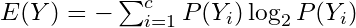 where P(Y) is the marginal probability

        -   For a binary variable, this would be\
            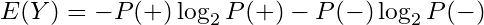

        -   In general the Shannon Entropy equation is\
            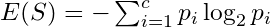 where p is a probability and c is the number of classes for the variable and S = subset of data or the node.

        -   Probabilities are between (0,1) and taking a log of numbers in this interval produces a negative value. Hence, the negative at the beginning of the expression.

        -   If the natural log, ln, is used then it's called deviance

    -   Calculate the entropy of the target, Y, with respect to each independent variable, x. For variable,\
        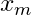

        -   , with number of classes, c :\
            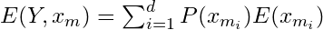

        -   I do NOT like the way the equation is written above. In videos, this type of entropy isn't given a name, but I think it matches conditional entropy in its description and calculation.

            -   *Conditional Entropy (for a particular x),*\
                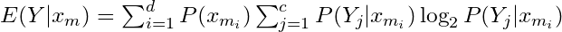
                -   This definition uses\
                    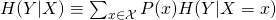
                    -   Where H is used to as the symbol for entropy.

        -   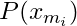

            -   The marginal probability for that class of that variable, i.e. ratio of instances of that class in the entire dataset.

        -   [Example]{.ribbon-highlight}: 

            -   Not explicitly shown above, but for the entropy calculations, it uses the sum of the rows as the denominator in probability calculations. This fits with a "conditional" type of entropy.

    -   Calculate information gain for variable  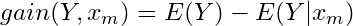

        -   Repeat for all independent variables

    -   Select the independent variable with the largest gain for first split (

        -   First split, i.e. root node, is the most influential variable

    -   If categorical variable chosen, leaves are all levels of that variable

        -   Subset dataset by var == level (for each branch
        -   Repeat entropy and information gain calculations on the subsetted data set
            -   Branches with entropy \> 1 are split unless some other stopping criteria is reached
        -   Choose variable with largest information gain and split by that variable
        -   Keeping repeating until maxdepth reached or minimum node size (number of rows in subset) reached

    -   Numerical vars are binned and treated like categorical vars

    -   Predicted class is the mode of the classes in the appropriate terminal node
-   [Regression]{.underline}
    -   For each predictor var, choose a separator value, s
        -   e.g var1 \> 5 and var1 \<= 5 where s = 5
    -   Calculate the mean y value for both regions then calculate the MSE ((obs - mean)\^2) of both regions. Sum of both MSEs. The optimal separator produces the lowest sum MSE.
    -   Whichever predictor has lowest sum MSE is chosen as the split variable.
    -   Recursively repeat. For example, repeat on region where var1 \>5 and repeat on region where var1 \<= 5.
    -   Continue until max.depth, max splits reached or data points in created region is less than a minimum or MSEs being calculated are all greater than a chosen amount, or... etc. (Hyperparameters)
    -   Prediction is the mean in the appropriate terminal node

### Random Forest {#sec-alg-ml-trees-rf}

{.lightbox width="532"}

-   Several independent decision trees are fit. Each tree uses sampled-with-replacement (bootstrapped) data. At each node within the tree, the outcome space is split according to a random subset of features (mtry) in $X$. Predictions are averaged or chosen by majority vote.
-   When we ''drop down'' a new point $x$, it will end up in a leaf for each tree. A leaf is a set with observations $i$ and taking the average over all $y_i$ in that leaf gives the prediction for one tree. These predictions are then averaged to give the final result. Thus, for a given $x$ if you want to predict the conditional mean of $Y$ given that $x$, you:
    -   "Drop down" the $x$ each tree (this is indicated in red in the above figure). Since the splitting rules were made on $X$, your new point $x$ will safely land somewhere in a leaf node.
    -   For each tree you average the responses $y_i$ in that leaf to get an estimate of the conditional mean of each tree.
    -   You average each conditional mean over the trees to get the final prediction.
-   Averaging the prediction of all trees leads to a marked reduction in variance.
-   Packages
    -   [{]{style="color: #990000"}[CDF](https://cran.r-project.org/web/packages/CDF/index.html){style="color: #990000"}[}]{style="color: #990000"} - Centroid Decision Forest for High-Dimensional Classification
        -   Selects discriminative features via a multi-class class separability score (CSS), splits by nearest class centroid, and aggregates tree votes to produce predictions and class probabilities.
    -   [{]{style="color: #990000"}[corrRF](https://cran.r-project.org/web/packages/corrRF/index.html){style="color: #990000"}[}]{style="color: #990000"} ([Paper](https://arxiv.org/abs/2503.12634)) - A clustered random forest algorithm for fitting random forests for data of independent clusters, that exhibit within cluster dependence
        -   Possibly can be used on repeated measures data
    -   [{]{style="color: #990000"}[RandomForestsGLS](https://cran.r-project.org/web/packages/RandomForestsGLS/index.html){style="color: #990000"}[}]{style="color: #990000"} - Generalizaed Least Squares RF
        -   Takes into account the correlation structure of the data. Has functions for spatial RFs and time series RFs
    -   [{]{style="color: #990000"}[randomForestSRC](https://www.randomforestsrc.org/){style="color: #990000"}[}]{style="color: #990000"} - Fast Unified Random Forests for Survival, Regression, and Classification (RF-SRC)
        -   Regression, classification, survival analysis, competing risks, multivariate, unsupervised, quantile regression, and class imbalanced q-classification
        -   Extremely random forests and randomized splitting
        -   Suite of imputation methods for missing data
        -   Fast random forests using subsampling
        -   Confidence regions and standard errors for variable importance. New improved holdout importance. Case-specific importance. Minimal depth variable importance
        -   Anonymous random forests for data privacy
        -   New Mahalanobis splitting rule for correlated real-valued outcomes in multivariate regression settings
    -   [{]{style="color: #990000"}[ShrinkageTrees](https://cran.r-project.org/web/packages/ShrinkageTrees/index.html){style="color: #990000"}[}]{style="color: #990000"} ([Paper](https://arxiv.org/abs/2507.22004)) - Bayesian regression tree models with shrinkage priors on step height
    -   [{]{style="color: #990000"}[sirus](https://cran.r-project.org/web/packages/sirus/index.html){style="color: #990000"}[}]{style="color: #990000"}: [S]{.underline}table and [I]{.underline}nterpretable [Ru]{.underline}le [S]{.underline}et
        -   Combines the simplicity of decision trees with a predictivity close to random forests
        -   Instead of aggregating predictions, SIRUS aggregates the forest structure: the most frequent nodes of the forest are selected to form a stable rule ensemble model
        -   Me: The interpretability of a Decision Tree with similar predictive accuracy of a RF. Seems like it would be good to fit both and use this model for additional interpretability.
        -   There's also a Spatial SIRUS ([github](https://github.com/LucaPate/Spatial_SIRUS), [paper](https://arxiv.org/abs/2408.05537)) which uses a spatial [{RandomForestsGLS}]{style="color: #990000"} model in a SIRUS algorithm
    -   [{]{style="color: #990000"}[stochtree](https://stochtree.ai/R_docs/pkgdown/){style="color: #990000"}[}]{style="color: #990000"} - Stochastic tree ensembles (i.e. BART, XBART) for supervised learning and causal inference.
    -   [{]{style="color: #990000"}[unityForest](https://cran.r-project.org/web/packages/unityForest/index.html){style="color: #990000"}[}]{style="color: #990000"} - Improving Interaction Modeling and Interpretability in Random Forests
        -   Currently, only classification is supported
        -   A random forest variant designed to better take covariates with purely interaction-based effects into account, including interactions for which none of the involved covariates exhibits a marginal effect.
        -   Facilitates the identification and interpretation of (marginal or interactive) effects
        -   Includes unity variable importance and covariate-representative tree roots (CRTRs) that provide interpretable visualizations of these conditions

### Isolation Forests {#sec-alg-ml-trees-isof}

-   Used for anomaly detection. Algorithm related to binary search.
-   Notes from paper: <https://cs.nju.edu.cn/zhouzh/zhouzh.files/publication/icdm08b.pdf>
-   Also see [Anomaly Detection \>\> Isolation Forests](anomaly-detection.qmd#sec-anomdet-isofor){style="color: green"}
-   The tree algorithm chooses a predictor at random for the root node. Then randomly chooses either the minimum or the maximum of that variable as the splitting value. The algorithm recursively subsamples like normal trees (choosing variables and split points in the same manner) until each terminal node has one data point or replicates of the same data point or preset maximum tree height is reached. Across the trees of a forest, anomalies with have a shorter average path length from root to terminal node.
    -   The algorithm is basically looking for observations with combinations of variables that have extreme values. The process of continually splitting subsamples of data will run out data points and be reduced to a single observation more quickly for an anomalous observation than a common observation.
    -   Makes sense. Picturing a tree structure, there shouldn't be too many observations with more that a few minimums/maximums of variable values. The algorithm weeds out these observations as it moves down the tree structure.
        -   Any or all of these wouldn't necessarily be global minimum/maximums since we're dealing with subsamples of variable values as we move down the tree.
    -   Paper has some nice text boxes with pseudocode that goes through the steps of the algorithm.
-   Anomaly scores range from 0 to 1. Observations with a shorter average path length will have a larger score.
    -   Anomaly score,\
        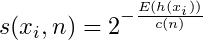
        -   Where E(h(xi)) is the average path length across the isolation forest for that observation
    -   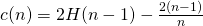
        -   Where H(i) is the Harmonic number,\
            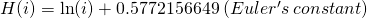
    -   Guidelines
        -   The closer an observation's score is to 1 the more likely that it is an anomaly
        -   The closer to zero, the more likely the observation isn't an anomaly.
        -   Observations with scores around 0.5 means that the algorithm can't find a distinction.

### Distributional Trees/Forests {#sec-alg-ml-trees-distree}

{.lightbox width="632"}

-   Blends the distributional modeling of gamlss (additive, nonlinear,  location, scale, shape) and the abrupt-change detection, additive + multiplicative effects capability, inclusion of interaction effects of decision trees / random forests. For regression trees, estimating all the distributional parameters instead of just the mean makes calculating the uncertainty easier.
    -   CART trees don't have a concept of statistical significance, and so cannot distinguish between a significant and an insignificant improvement in the information measure.
    -   CART tree predictions are piecewise-constant (every observation in the node has the same prediction), it will not be accurate unless the tree is large. But a large tree is harder to interpret than a small one.
    -   Linear trends are difficult for trees with piecewise-constant predictions
-   Algorithm splits based on changes in the mean and higher moments. So able to capture things like changes in variance.
-   Conditional distributions allow for the computation of prediction intervals.
-   This framework embeds recursive partitioning into statistical model estimation and variable selection
-   The statistical formulation of the algorithm ensures the validity of interpretations drawn from the resulting model
-   [{[partykit](https://cran.r-project.org/web/packages/partykit/index.html)}]{style="color: #990000"}
    -   Notes from: <https://arxiv.org/pdf/1804.02921.pdf>
    -   **tl;dr procedure**
        -   For each distributional parameter (e.g. mean, sd), a "score" matrix is computed using the target values and the distribution's likelihood function
        -   The score matrix is used to create a test statistic for each predictor
        -   The predictor with the lowest p-value associated with its test statistic is the splitting variable
        -   The split point is determined by the point that produces the lowest p-value in one of the split regions
        -   Process continues for each leaf until no variables produce a p-value below a certain threshold (e.g. α = 0.05)
        -   The distributional parameters associated with the leaf that a new observation falls into is used as the prediction for a tree.
    -   Tree procedure
        1.  For each distributional parameter (e.g. mean, std.dev), calculate the value of the maximum likelihood estimator (MLE)
        2.  Take the derivative of the log-likelihood function. Plug in the value(s) of the MLE parameter(s) and a yi value to get a "score" for every value of the response variable. Repeat for each distributional parameter. (The score should fluctuate around zero.)
            -   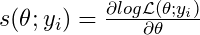
            -   and
            -   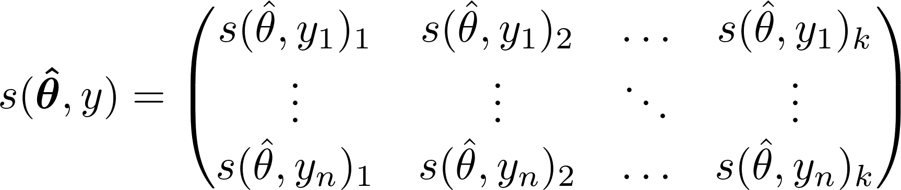
                -   Where k is the number of distributional parameters and n is the number of training observations
            -   Gaussian example with\
                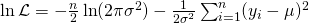 :
                1.  Solve for the MLE of the mean and calculate the value:\
                    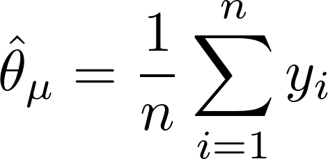{.lightbox width="171"}

                2.  Solve for the MLE of the variance and calculate the value:\
                    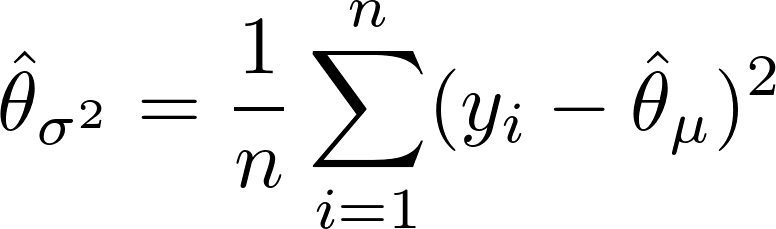{.lightbox width="176"}

                3.  We're calculating a score for each value of the outcome variable so we can remove the summation symbol from the derivative of the log-likelihood function w.r.t. the mean. This leaves us with the mean score function:\
                    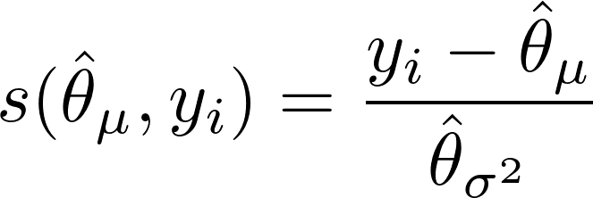{.lightbox width="163"}

                4.  Same thing but with the derivative of the log-likelihood function w.r.t. the variance:\
                    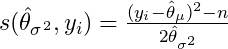
        3.  Null Hypothesis test each predictor variable vs the parameter score matrix where H0 = independence --- Two methods: CTree and MOB
            1.  CTree is permutation test based
                1.  Each test statistic vector, T, for 1,...,l predictors and n observations is calculated by:\
                    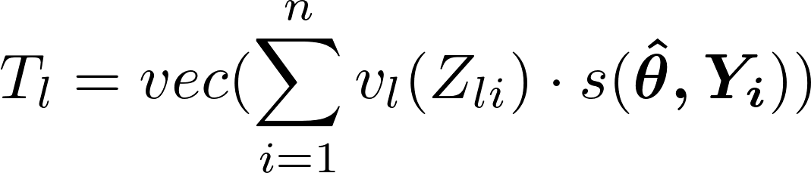{.lightbox width="169"}

                    -   where\
                        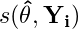
                        -   is the 1xk row of the score matrix and v is a transformation function that depends on whether the predictor variable, Z, is a numeric or character type.

                    1.  If the predictor variable, Z, is a numeric:
                        1.  v is an identity function, so Z remains unchanged.
                        2.  Corresponding to the first observation, the first row of the score matrix is multiplied by the first value of the predictor variable resulting in a 1xk row vector.
                        3.  n 1xk row vectors are added together
                        4.  The summed 1xk vector is transposed by the *vec* function into the k-vector, T.
                    2.  If the predictor variable, Z, is a character variable with H categories:
                        1.  v creates an indicator variable where the hth value is 1 indicates that Zi's value is the hth category.
                        2.  Corresponding to the first observation, we multiply this Hx1 vector times the 1xk, first row of the score matrix which results in a sparse Hxk matrix.
                        3.  n Hxk matrices are added together
                        4.  *vec* then stacks each column of the summed Hxk matrix to create a column vector, T, with H\*k rows.

                2.  T is standardized by maximum or quadratic method.

                    -   t just represents a statistic that's calculated from a permutation of the scores. T is handled in the same way.
                    -   partykit::ctree.pdf shows the calculations for μ and Σ
                    -   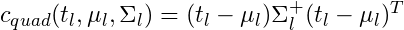
                        -   where Σ+ is the pseudo-inverse of the covariance matrix
                            -   Calculating the pseudo-inverse makes this method more computationally intensive
                        -   Using this quadratic method, c is Chi-Square test statistic.
                    -   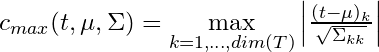{.lightbox width="179" height="25"}
                        -   For the maximum method, c is Normal test statistic (partykit::ctree.pdf)
                        -   no idea why the numerator has one "k" and the bottom has "kk." Maybe it's a typo.

                3.  Find the p-value associated with each predictor's c statistic

                    -   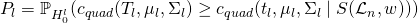{.lightbox width="118" height="6"}
                        -   This says the p-value, P, is the probability,\
                            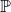
                            -   , (associated with the null hypothesis for this particular variable) that the standardized T stat is as or more extreme than the group of standardized t stats of the permuted scores.
                        -   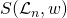
                            -   is the symmetric group of permutations and weights. Weights being either 0 or 1 depending on whether the observation is present in that node's data subset.
            2.  MOB stands for model based method
                -   Uses a M-Fluctuation test to test for an "instability" by calculating a supLM test statistic. An instability is what's interpreted from a p-value \< 0.05
                -   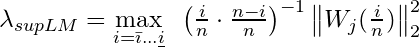{.lightbox width="119" height="13"}
                    -   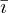
                        -   is a minimum amount of scores that you choose, then\
                            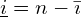
                        -   No guidelines for\
                            
                            -   In addition to choosing a minimum, the paper does mention also trimming node data points at each end by 10%.
                        -   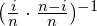
                            -   is called "its variance function."
                    -   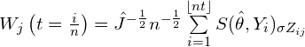{.lightbox width="144" height="23"}
                        -   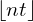
                            -   means floor of nt, which means round down to the integer.
                        -   The subscript\
                            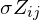
                            -   says the scores are ordered from highest to lowest (aka anti-rank) according to the predictor variable, Zj, values
                        -   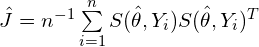{.lightbox width="159"}
                        -   covariance matrix
                -   The distribution from which the p-value is calculated has something to do with a Bessel process and stuff converging to a Brownian Bridge, so I decided to shut it down here.
                    -   See <https://eeecon.uibk.ac.at/~zeileis/papers/Zeileis%2BHothorn%2BHornik-2008.pdf> for details
        4.  Bonferonni adjust the p-value according the number of variables, m
            -   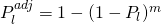
        5.  Select predictor variables with adjusted p-values lower than the threshold
        6.  From that selection, the predictor with the lowest p-value is chosen as the splitting variable.
            -   If no p-values are lower than the threshold, splitting is halted and the terminal node is reached for that branch (aka pre-pruning).
            -   Pre-pruning not usually done in distributional forests (mincriterion = 0).
        7.  Choose the optimal split point for the chosen variable where the lowest p-value is produced in one of the two created sub-regions (i.e the maximum test statistic).
        8.  Procedure is repeated (like traditional trees) in the created leaves and continues until stopping criteria reached (e.g. no p-values lower than threshold, number of observations in node is below minimum, etc)
        9.  In practice, predicting, using just a tree, involves finding the node with the criterion that fits the new observation and using the estimated distributional parameters of the subsample belonging to that node as the model prediction.
            -   The paper says this can be thought of as a weighted maximum likelihood estimation. The mathematical notation is similar to what I show below for forests.
    -   Forest procedure
        -   The idea of random forests is to train an ensemble of trees, each on different training data obtained through resampling or subsampling. In each node only a random subset of the covariates is considered for splitting to reduce the correlation among the trees and to stabilize the variance of the model
        -   Notes from: <https://arxiv.org/pdf/1701.02110.pdf>
        -   Pretty good explainer of the weight system used below to calculate predicted means across all leaves in the forest (from [{drf}]{style="color: #990000"} explainer)
            -   Instead of directly calculating the mean in a leaf node, one calculates the weights that are implicitly used when doing the mean calculation. The weight wi(x) is a function of (1) the test point x and (2) an observation i. That is, if we drop x down a tree, we observe in which leaf it ends up. All observations that are in that leaf get a 1, all others 0.
                -   So if we end up in a leaf with observations (1,3,10), then the weight of observations 1,3,10 for that tree is 1, while all other observations get 0.
            -   We then further divide that weight by the number of elements in the leaf node.
                -   In the example before, we had 3 observations in the leaf node, so the weights for observations 1,3, 10 are 1/3 each, while all other observations still get a weight of 0 in this tree. Averaging these weights over all trees gives the final weight wi(x).
            -   Calculating the mean as we do in a traditional Random Forest, is the same as summing up wi(x)\*yi
        -   For predictions:
            1.  For a training observation and a tree, determine whether a new observation z belongs in the same node as the training observation, zi.
            2.  Calculate a weight according to whether the new observation and the training observation are in the same node.
                -   If they are in the same node
                    -   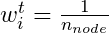 where i denotes the training observation and n is the number of observations in that node of that particular tree, t.
                -   If zi, the training observation, and the new observation, z, aren't in the same node
                    -   wit = 0
            3.  Calculate wit for each tree the training observation belongs to.
                -   Resampling or subsampling may exclude a training observation from some of the trees
            4.  Sum all tree weights, wit, for that training observation and divide by the number of trees to get the forest-weight for that training observation.
                -   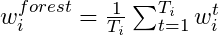{.lightbox width="119"}
                    -   Where Ti is the total trees that use that training observation in its learning sample.
                    -   So the forest weight is the average weight per tree for that training observation
                -   In the paper, this process is described by a more compact notation:
                    -   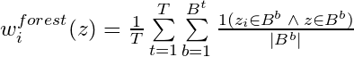{.lightbox width="194" height="32"}
                    -   The numerator in the end part of this equation indicates whether the bth terminal node, Bb, contains the training observation, zi, and the new observation, z, for tree, t.
                    -   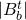 is the number of observations in that terminal node
            5.  The paper describes predictions being calculated by a weighted MLE as it did for a single tree, but for forests it didn't explicitly give an "in practice" description of process.
                -   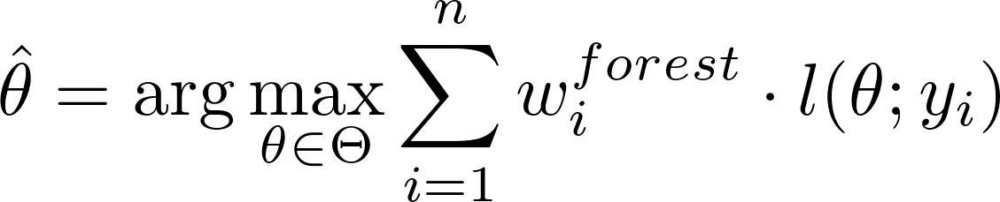{.lightbox width="129"}
                    -   Each parameter that has been calculated for each terminal node of each tree has a subset of the learning data associated with it. The forest weight-likelihood products of each observation are summed over this subset. The parameter with the largest sum is chosen as the prediction.
                        -   Repeat for each distributional parameter.
-   [{[drf](https://github.com/lorismichel/drf)}]{style="color: #990000"} ([Paper](https://cran.r-project.org/web/packages/drf/index.html))\
    {.lightbox width="332"}
    -   Notes from [DRF: A Random Forest for (almost) everything](https://towardsdatascience.com/drf-a-random-forest-for-almost-everything-625fa5c3bcb8)
    -   Papers
        -   [Causal-DRF: Conditional Kernel Treatment Effect Estimation using Distributional Random Forest](https://arxiv.org/abs/2411.08778)
            -   Obtains a consistent and asymptotically normal estimator of the conditional kernel treatment effect (CKTE), as well as an approximation of its sampling distribution
                -   CKTE captures effects of treatments beyond differences in conditional expectations
                -   CATE is limited in that a treatment might affect the outcome beyond just its conditional expectation.
                    -   For example, giving a drug to several new patients with the same covariates x could decrease blood pressure on average, but also lead to an undesirable increase in variance.
            -   Which enables the construction of a conditional kernel-based test for distributional effects with provably valid type-I error
            -   I think all this amounts to a more accurate CI (including for smaller sample sizes) for the CATE in the equivalent form of CKTE
    -   Ultimately when a RF finishes splitting data, each leaf should ideallly contain a homogeneous set of points in terms of approximating a the conditional distribution, P(Y\|X=xi), but this only applies to the conditional mean of that leaf. As seen in the pic, the mean doesn't fully describe that leaf's conditional distribution.
        -   Every distribution except x2 has a similar means, but sets (x1,x4,x6) and (x3, x5, x7) have different variances.
    -   drf is able to fit a RF with these more homogeneous leaves by transforming the leaf's yi subsamples into a *Reproducing Kernel Hilbert Space* with a kernel.
        -   In this infinite-dimensional space, conditional means are able to fully represent conditional distributions and the Maximum Mean Discrepancy (MMD) is (efficiently) calculated.
        -   The MMD measures the similarity between distributions
        -   Thus if the conditional distribution of Y given xi and xj are similar, they will be grouped in the same leaf.
    -   drf uses the same weighting system for its forest as [{partykit}]{style="color: #990000"} in order to produce predictions.

## Boosting {#sec-alg-ml-boost}

-   From <https://www.economist.com/graphic-detail/2021/03/11/how-we-built-our-covid-19-risk-estimator>
    -   In order to capture such complexity, we needed to allow for the possibility that comorbidities do not have constant effects that can simply be added together, but instead interact with each other, producing overall risk levels that are either higher or lower than the sum of their parts.
        -   Says main effects weren't good enough and needed to use interactions
    -   Gradient-boosted trees make predictions by constructing a series of "decision trees", one after the other. The first tree might begin by checking if a patient has hypertension, and then if they are older or younger than 65. It might find that people over 65 with hypertension often have a fatal outcome. If so, then whenever those conditions are met, it will move predictions in this direction. The next tree then seeks to improve on the prediction produced by the previous one. Relationships between variables are discovered or refined with each tree.
-   Difference between XGBoost and LightGBM (Raschka)
    -   XGBoost's trees are based on breadth-first search, comparing different features at each node.
    -   LightGBM performs depth-first search, focusing on a single feature & growing the tree from there.
-   XGBoost (and probably all boosting and maybe all tree algorithms) are robust against multicollinearity. ([source](https://medium.com/the-data-entrepreneurs/i-spent-2-995-on-nassim-talebs-risk-taking-course-here-s-what-i-learned-c442a55a2c64?source=explore---------11-98--------------------b62d22f2_8988_44be_a6e8_c3d7499333f4-------15))

### Gradient boosted machines (GBM) {#sec-alg-ml-boost-gbm}

1.  Choose a differentiable loss function, ρ, such as 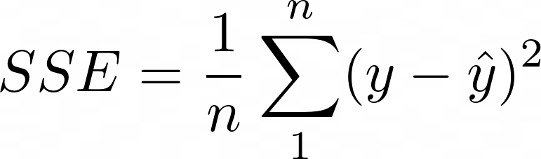{.lightbox width="171"}

    -   In gradient boosting, 1/n is exchanged for 1/2, to make it differentiable. The mean of the loss function, SSE in this case, calculated over all observations for a model is called the "empirical risk" which is what boosting is trying to minimize.

2.  Calculate the negative gradient, aka first derivative. For regression trees, this turns out to be\
    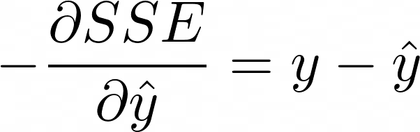{.lightbox width="102"}

    -   which is just the residuals. Pg 360 of The Elements of Statistical Learning has other loss functions and their negative gradients. Classification uses a multinomial deviance loss function.

3.  Initialize using the optimal constant model, which is just a single terminal node tree. Think this means the initial predictions are just mean of the target,\
    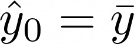{.lightbox width="128"}

4.  Calculate the negative gradient vector (residuals), r, by plugging in the predicted values.

5.  Fit a regression tree with the residuals, r, as the target variable. The mean of the residuals for that region (terminal node) is the *prediction*,\
    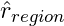 .

6.  Add the predicted residuals vector to the initial predictions vector,\
    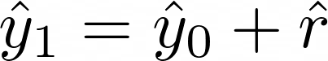{.lightbox width="103"}

    -   to get the next set of predictions to feed into the negative gradient equation.

7.  Repeat steps 4 - 6 until some stopping criteria is met.

### LightGBM {#sec-alg-ml-boost-lgbm}

-   Find optimal split points using a histogram based algorithm
    -   GOSS (Gradient Based One Side Sampling)
        -   retains instances with large gradients while performing random sampling on instances with small gradients.
            -   Example: Gaussian Regression - observations with small residuals are downsampled by random selection while those observations with large residuals remain
-   EFB (Exclusive Feature Bundling)
    -   Reduce feature space by bundling features together that are "mutually exclusive" (i.e. varA doesn't take a value of 0 in the same observation as varB).
        -   i.e. Bundles sparse features together
    -   Create bundles and assign features
        1.  Construct a graph with weighted (measure of conflict between features) edges. Conflict is measure of the fraction of exclusive features which have overlapping non zero values.
        2.  Sort the features by count of non zero instances in descending order.
        3.  Loop over the ordered list of features and assign the feature to an existing bundle (if conflict \< threshold) or create a new bundle (if conflict \> threshold).
    -   Merging
        -   Article wasn't coherent on this precedure

### XGBoost {#sec-alg-ml-boost-xgb}

-   Misc
    -   [Mathematics, Linear Algebra \>\> Misc](mathematics-linear-algebra.qmd#sec-math-linalg-misc){style="color: green"} \>\> Packages \>\> [{sparsevctrs}]{style="color: #990000"}
        -   Can create a sparse matrix for xgboost
-   FYI has various gradient function families: binomial, poisson, tweedie, softmax (multi-category classification)
-   Utilizes histogram-based algorithm for finding optimal split points.
    -   Buckets continuous features into discrete bins to construct feature histograms during training. It costs O(#data \* #feature) for histogram building and O(#bin \* #feature) for split point finding.
-   Regularization: It penalizes more complex models through both LASSO (L1) and Ridge (L2) regularization to prevent overfitting.
    -   Regularization function\
        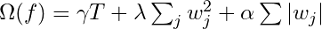{.lightbox width="162" height="15"}
        -   This function gets minimized during training
        -   T is the total number of trees
        -   w is a leaf weight
        -   Tuning parameters
            -   α controls how much we want to penalize the sum of the absolute value of leaf weights (L1 regularization)
            -   λ controls how much we want to penalize the sum of squared leaf weights  (L2 regularization)
            -   γ is used to control how the number of trees in the model is penalized
-   Sparsity Awareness: XGBoost naturally admits sparse features for inputs by automatically 'learning' best missing value depending on training loss and handles different types of sparsity patterns in the data more efficiently.
-   Weighted Quantile Sketch: XGBoost employs the distributed weighted Quantile Sketch algorithm to effectively find the optimal split points among weighted datasets.
-   Multinomial: all the trees are constructed at the same time, using a vector objective function instead of a scalar one, i.e. there is an objective for each class. (i.e. Classifying n classes generate trees n times more complex)
    -   The objective name is multi:softprob when using the integrated objective in XGBoost. Although, the aim is not really the softprob , but the log loss of the softmax. But softmax is not the gradient of softmax , but the gradient of its log loss

        $$
        \begin {align}
        \mbox{soft}_\mbox{max}(x_i) &= \frac{e^{x_i}}{\sum_j e^{x_j}}\\
        \mbox{log}_\mbox{loss}(x_i) &= -\ln(\mbox{soft}_\mbox{max}(x_i)) = -ln(e^{x_i}) + \ln\left(\sum_j e^{x_j}\right) = -x_i + \ln\left(\sum_j e^{x_j}\right) \\
        \frac{\partial\mbox{log}_\mbox{loss}(x_i)}{\partial x_i} &= \frac{\partial (-x_i + \ln\left(\sum_j e^{x_j}\right)}{\partial x_i} = -1 + \frac{e^{x_i}}{\sum_j e^{x_j}} = \mbox{soft}_\mbox{max}(x_i)
        \end {align}
        $$

        -   i.e. the objective optimized is not softmax or softprob, but their log loss.
-   Cross-validation: The algorithm comes with built-in cross-validation method at each iteration, taking away the need to explicitly program this search and to specify the exact number of boosting iterations required in a single run.
-   Component-wise Boosting (From mboost_PKG tutorial docs)
    -   tl;dr - Same as GBM except instead of fitting a tree model to the residuals, you're fitting many types of small models (few predictors). Best small model updates the predictions after each iteration.
    -   The goal is to minimize empirical risk\
        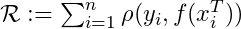{.lightbox width="141"}
        -   where\
            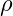
            -   is the loss function and\
                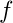\
            -   the predictor function
        -   The loss function is usually the negative log-likelihood function for the distribution of the outcome variable. For a Gaussian distribution, this is equivalent to the least squares objective function
    -   Steps
        1.  Compute the negative gradient of the loss function which is the negative first derivative with respect to the predictor function,\
            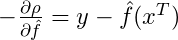 .

        2.  

            -   can be thought of as the vector of predictions at the mth iteration of the algorithm. So to begin, we create an initial vector,\
                
                -   with "offset values."
            -   For glmboost, the offset is the mean of the outcome variable. I'd guess it's probably the same for gamboost.

        3.  Compute the negative gradient vector:\
            {.lightbox width="160" height="25"}

            -   For the first iteration, m = 1 and\
                {.lightbox width="120"}

        4.  Fit each baselearner to the negative gradient vector.

            -   A baselearner is like a subset statistical model of the overall statistical model. They can be linear regressors, penalized linear regressors, shallow trees, penalized splines, etc. Each one using one or more predictors with or without interaction terms.

        5.  For each baselearner, calculate the residual sum of squares,\
            

            -   from it's predictions.

        6.  Whichever baselearner has the smallest RSS, scale it's predictions with a learning rate factor and combine them with the previous iteration's predictions

            -   \
            -   where\
                
                -   is the *learning rate*.
                -   Optimization of ν isn't critical. Only required to be low enough as to not overshoot the minimum empirical risk, e.g. ν = 0.1.

        7.  After the predictions are updated, steps 3-6 are repeated until the number of iterations, set by the value of the *mstop,* is reached.

            -   mstop is a hyperparameter that you optimize to prevent overfitting. The value can be chosen by cv or AIC
    -   Each baselearner's contribution to the final prediction vector is\
        
        -   over all iterations where that baselearner was selected
        -   I think this is the value of the\
            
            -   on the y-axis of the partial dependence plots (pdp).
            -   If the variables have been centered (maybe need to be completely standardized), then the magnitude of the y-axis (and the variable range within it) can be used as a signifier of variable importance and variables can be compared that way.
            -   If a variable has multiple baselearners selected, you can combine all the contributions and plot the combined effect pdp by predict(which = "variable"), row summing the values, and plotting. See the end of mboost.pdf for details.
    -   Component-wise boosting performs variable selection unlike some other boosting algorithms
