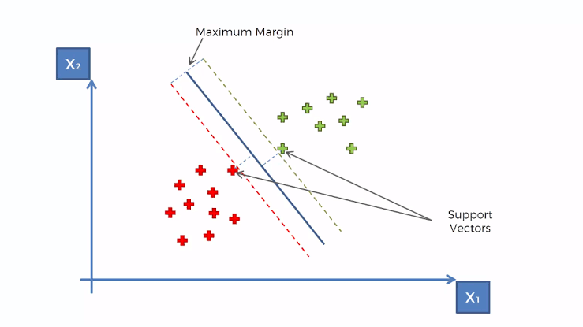
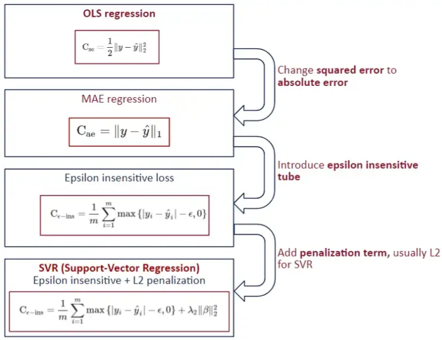
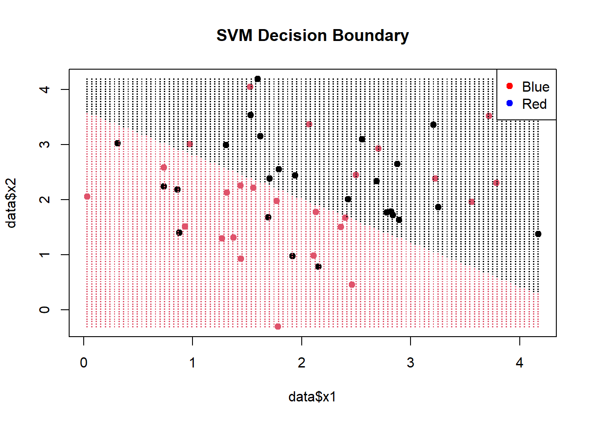
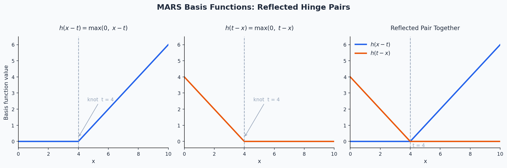
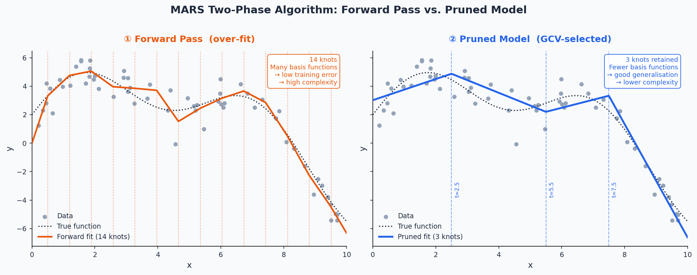
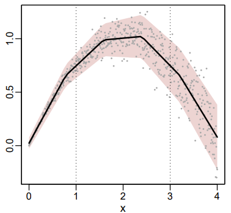
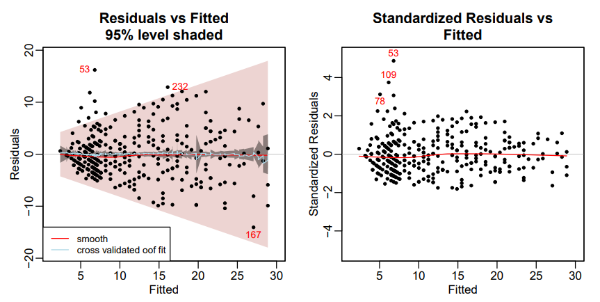

# ML {#sec-alg-ml .unnumbered}

## Discriminant Analysis {#sec-alg-ml-discrim .unnumbered}

-   Not really a ML algorithm, but I don't really have a good place to put it.
-   Misc
    -   Packages
        -   [{]{style="color: #990000"}[candisc](https://friendly.github.io/candisc/){style="color: #990000"}[}]{style="color: #990000"} - Includes functions for computing and visualizing generalized canonical discriminant analyses and canonical correlation analysis for a multivariate linear model (MLM).
            -   The goal is to provide ways of visualizing such models in a low-dimensional space corresponding to dimensions (linear combinations of the response variables) of maximal relationship to the predictor variables.
        -   [{]{style="color: #990000"}[gipsDA](https://cran.r-project.org/web/packages/gipsDA/index.html){style="color: #990000"}[}]{style="color: #990000"} - Extends classical linear and quadratic discriminant analysis by incorporating permutation group symmetries into covariance matrix estimation.
            -   The 'gips' framework identifies and imposes permutation structures that act as a form of regularization, improving stability and interpretability in settings with symmetric or exchangeable features.
            -   Includes pooled and class-specific covariance models, as well as multi-class extensions with shared or independent symmetry structures.
        -   [{MASS::lda}]{style="color: #990000"}
        -   [{]{style="color: #990000"}[msda](https://cran.r-project.org/web/packages/msda/index.html){style="color: #990000"}[}]{style="color: #990000"} - Multi-Class Sparse Discriminant Analysis
        -   [{]{style="color: #990000"}[PLNmodels](https://cran.r-project.org/web/packages/PLNmodels/index.html){style="color: #990000"}[}]{style="color: #990000"} - Poisson Lognormal Models
            -   Supervized classification of multivariate count table with the Poisson discriminant Analysis
    -   Resources
        -   [Little Book of R for Multivariate Analysis](https://little-book-of-r-for-multivariate-analysis.readthedocs.io/en/latest/src/multivariateanalysis.html#linear-discriminant-analysis)
    -   Assumes Multivariate Normality of features
        -   [{]{style="color: #990000"}[MVN](https://cran.r-project.org/web/packages/MVN/index.html){style="color: #990000"}[}]{style="color: #990000"} ([Vignette](https://journal.r-project.org/articles/RJ-2014-031/)) - Tests for multivariate normality
            -   Contains the three most widely used multivariate normality: Mardia’s, Henze-Zirkler’s and Royston’s
            -   Graphical approaches, including chi-square Q-Q, perspective and contour plots.
            -   Two multivariate outlier detection methods, which are based on robust Mahalanobis distances
    -   Comparison with other statistical models
        -   Sort of a backwards MANOVA, i.e. categorical \~ continuous instead of continuous \~ categorical
        -   Interpretation similar to PCA
        -   Assumptions similar to both MANOVA and PCA
    -   Very fast even on a 1M row dataset
-   [Linear Discriminant Analysis (LDA)]{.underline}
    -   Notes from StatQuest: Linear Discriminant Analysis (LDA) clearly explained [video](https://www.youtube.com/watch?v=azXCzI57Yfc&list=PLblh5JKOoLUICTaGLRoHQDuF_7q2GfuJF&index=37)

    -   Goal is find an axis (2 dim) for a binary outcome or plane (3 dim) for a 3-category outcome, etc. that separates the predictor data which is grouped by the outcome categories.

    -   How well the groups are separated is determined by projecting the points on this lower dim object (e.g. axis, plane, etc.) and looking at these criteria:

        -   **Distance** **(d)** between the means of covariates (by outcome group) should be maximized
        -   **Scatter** (**s2)** ,i.e. variation, of data points per covariate (by outcome group) should be minimized

    -   Maximizing the ratio of Distance to Scatter determines the GoF of the separator\
        .png){.lightbox width="450"}

        -   Figure shows a example of a 2 dim predictor dataset that been projected onto a 1 dim axis. Dots are colored according to a binary outcome (green/red)
        -   In the binary case, the difference between the means is the distance, d.

    -   For multinomial outcomes, there are a couple differences:

        -   A centroid between all the predictor data is chosen, and centroids within each category of the grouped predictor data are chosen. For each category, d is the distance between the group centroid and the overall centroid\
            .png){.lightbox width="400"}
            -   The chosen group predictor centroids are determined by maximizing the distance-scatter ratio
        -   Using the coordinates of the chosen group predictor centroids, a plane is determined.\
            .png){.lightbox width="400"}
            -   For a 3 category outcome, 2 axes (i.e. a plane) are determined which will optimally separate the outcome categories

    -   By looking at which predictors are most correlated with the separator(s), you can determine which predictors are most important in the discrimination between the outcome categories.

    -   The separation can be visualized by using charting the data according to the separators\
        .png){.lightbox width="450"}

        -   Example shows the data is less overlap between black and blue dots and therefore grouped better using LDA than PCA.

    -   [Example]{.ribbon-highlight}: Site classification given the morphological measurements of california pitcher plants ([source](https://uw.pressbooks.pub/appliedmultivariatestatistics/chapter/discriminant-analysis/))

        ::: panel-tabset
        ## Data and Model

        Automatic Leave-One-Out cross-validation is available using [cv = TRUE]{.arg-text}

        You can specify a training set with a row index vector in the [subset]{.arg-text} argument

        ``` r
        library(dplyr)
        url <- "https://raw.githubusercontent.com/jon-bakker/appliedmultivariatestatistics/main/Darlingtonia_GE_Table12.1.csv"
        darl_dat_raw <- readr::read_csv(url, col_select = -plant)
        darl_dat_proc <- darl_dat_raw |> 
          mutate(across(where(is.numeric), scale))
        da_mod <- MASS::lda(site ~ ., data = darl_dat)
        da_mod
        #> Prior probabilities of groups:
        #>        DG        HD       LEH       TJH 
        #> 0.2873563 0.1379310 0.2873563 0.2873563 
        #> 
        #> Group means:
        #>          height  mouth.diam   tube.diam  keel.diam wing1.length wing2.length  wingsprea hoodmass.g  tubemass.g  wingmass.g
        #> DG   0.03228317  0.34960765 -0.64245369 -0.3566764    0.3998415    0.2997874 -0.2093847  0.4424329  0.30195655  0.03566704
        #> HD  -0.41879232 -1.37334175  0.93634832  1.3476695   -0.8102232   -0.3184490 -0.1996899 -1.1498678 -1.05297022 -0.28283531
        #> LEH  0.22432324  0.25108333  0.23567347 -0.4189580    0.5053448    0.3853959  0.6919511 -0.1754338  0.07558687  0.23585050
        #> TJH -0.05558610  0.05851306 -0.04266698  0.1287530   -0.5162792   -0.5323277 -0.3867152  0.2849374  0.12788229 -0.13575660
        #> 
        #> Coefficients of linear discriminants:
        #>                      LD1        LD2         LD3
        #> height        1.40966787  0.2250927 -0.03191844
        #> mouth.diam   -0.76395010  0.6050286  0.45844178
        #> tube.diam     0.82241013  0.1477133  0.43550979
        #> keel.diam    -0.17750124 -0.7506384 -0.35928102
        #> wing1.length  0.34256319  1.3641048 -0.62743017
        #> wing2.length -0.05359159 -0.5310177 -1.25761674
        #> wingsprea     0.38527171  0.2508244  1.06471559
        #> hoodmass.g   -0.20249906 -1.4065062  0.40370294
        #> tubemass.g   -1.58283705  0.1424601 -0.06520404
        #> wingmass.g    0.01278684  0.0834041  0.25153893
        #> 
        #> Proportion of trace:
        #>    LD1    LD2    LD3 
        #> 0.5264 0.3790 0.0946 
        ```

        -   [Prior probabilities of groups]{.arg-text}: By default, they're set the proportions of the observed data, but they can be specified within the model function
            -   These probabilities are weights in the calculations of a DA: the higher the probability, the more weight a group is given
        -   [Group means]{.arg-text}: The mean value of each variable in each group (note whether standardized or unstandardized
        -   [Coefficients of linear discriminants]{.arg-text}: Roughly analogous to the loadings produced in a PCA.
            -   Standardizing during preprocessing allows you to compare the LD coefficients directly among variables.
            -   Larger coefficients (either positive or negative) indicate variables that carry more weight with respect to that LD.
            -   The coefficients of linear discriminants – an eigenvector – would be multiplied by the corresponding variables to produce a score an individual observation on a particular LD.
        -   [Proportion of trace]{.arg-text}: The proportion of variation explained by each LD function (eigenvalue). Note that these always sum to 1, and are always in descending order (i.e., the first always explains the most variation).

        ## Prediction

        ``` r
        da_mod_preds <- predict(da_mod)
        head(round(da_mod_preds$posterior, 2))
        #>     DG   HD  LEH  TJH
        #> 1 0.77 0.00 0.00 0.23
        #> 2 0.21 0.00 0.04 0.75
        #> 3 0.15 0.03 0.55 0.27
        #> 4 0.46 0.00 0.02 0.53
        #> 5 0.67 0.00 0.06 0.27
        #> 6 0.42 0.00 0.01 0.57

        (da_mod_conf <- table(darl_dat_proc$site, da_mod_preds$class))
        #>      DG HD LEH TJH
        #>  DG  18  0   2   5
        #>  HD   0 11   1   0
        #>  LEH  3  0  21   1
        #>  TJH  2  0   3  20

        sum(diag(da_mod_conf))/sum(da_mod_conf) * 100
        #> [1] 80.45977
        ```

        -   [darl_preds\$posterior]{.arg-text} are the predicted probabilities for each class
        -   Using the values from the confusion matrix, we can calculate the accuracy which is 80%
        :::

## Support Vector Machines {#sec-alg-ml-svm .unnumbered}

{.lightbox width="532"}

-   [Misc]{.underline}
    -   Packages:
        -   [{]{style="color: #990000"}[e1071](https://cran.r-project.org/web/packages/e1071/index.html){style="color: #990000"}[}]{style="color: #990000"}, [{]{style="color: #990000"}[kernlab](https://cran.r-project.org/web/packages/kernlab/index.html){style="color: #990000"}[}]{style="color: #990000"}, [{]{style="color: #990000"}[LiblineaR](https://cran.r-project.org/web/packages/LiblineaR/index.html){style="color: #990000"}[}]{style="color: #990000"}, [{{sklearn}}]{style="color: goldenrod"}
        -   [{]{style="color: #990000"}[maize](https://github.com/frankiethull/maize){style="color: #990000"}[}]{style="color: #990000"} - An extension library for support vector machines in tidymodels that consists of additional kernel bindings listed in [{kernlab}]{style="color: #990000"} that are not available in the [{parsnip}]{style="color: #990000"} package
            -   [{parnsip}]{style="color: #990000"} has three kernels available: linear, radial basis function, & polynomial. [{maize}]{style="color: #990000"} currently adds five more kernels: laplace, bessel, anova rbf, spline, & hyperbolic tangent.
        -   [{]{style="color: #990000"}[dcsvm](https://cran.r-project.org/web/packages/dcsvm/index.html){style="color: #990000"}[}]{style="color: #990000"} - Efficient algorithm for solving sparse-penalized support vector machines with kernel density convolution.
            -   Designed for high-dimensional classification tasks, supporting lasso (L1) and elastic-net penalties for sparse feature selection and providing options for tuning kernel bandwidth and penalty weights.
        -   [{]{style="color: #990000"}[hdsvm](https://cran.r-project.org/web/packages/hdsvm/index.html){style="color: #990000"}[}]{style="color: #990000"} - Implements an efficient algorithm to fit and tune penalized Support Vector Machine models using the generalized coordinate descent algorithm.
            -   Designed to handle high-dimensional datasets effectively, with emphasis on precision and computational efficiency.
    -   Also see
        -   [Model Building, tidymodels \>\> Model Specification](model-building-tidymodels.qmd#sec-modbld-tidymod-modspec){style="color: green"} \>\> Support Vector Machines
        -   [Model Building, sklearn \>\> Misc](model-building-sklearn.qmd#sec-modbld-sklearn-misc){style="color: green"} \>\> Tuning
-   [Process]{.underline}
    -   Works on the principle that you can linearly separate a set of points from another set of point simply by transforming the dataset from dimension n to dimension n + 1.
        -   The transformation is made by a feature transformation function, φ(x). For two dimensions, a particular φ(x) might transform the vector, x = {x₁, x₂}, which is in 2 dimensions, to {x²₁, √(2x₁x₂), x²₂}, which is 3 dimensions
    -   Transforming a set of vectors into a higher dimension, performing a mathematical operation (e.g. dot product), and transforming the vectors back to lower dimension is involves many steps and therefore is computationally expensive.
        -   The problem can become computationally intractable fairly quickly. Kernels are able perform these operations in much fewer steps.
    -   Creates a hyperplane at a threshold that is equidistant between classes of the target variable
    -   Edge observations are called Support Vectors and the distance between them and the threshold is called the Maximum Margin
-   [Kernels]{.underline}
    -   Gaussian Kernel aka Radial Basis Function (RBF) Kernel

        $$
        K(x,y) = e^{-\gamma \lVert x - y \rVert^2}
        $$

        -   $K(x,y)$ performs the dot product in the higher dimensional space without having to first transform the vectors

        -   Advantages

            -   Can model complex, non-linear relationships
            -   Works well when there's no prior knowledge about data relationships
            -   Effective in high-dimensional spaces

        -   Challenges

            -   Choosing an appropriate $\gamma$ value (often done through cross-validation)
            -   Can be computationally expensive for large datasets

    -   Polynomial Kernel

        $$
        K(x,y) = (\alpha \cdot x^Ty + c )^d
        $$

        -   $x^T y$ is the dot product of $x$ and $y$
        -   $\alpha$ is a scaling parameter (often set to 1)
        -   $c$ is a constant term that trades off the influence of higher-order versus lower-order terms
            -   When $c \gt 0$, it allows the model to account for interactions of all orders up to $d$
            -   When $c = 0$, it's called a homogeneous polynomial kernel
        -   $d$ is the degree of the polynomial
            -   Controls the flexibility of the decision boundary
            -   Higher $d$ allows modeling of more complex relationships
        -   Advantages
            -   Can model feature interactions explicitly
            -   Works well when all training data is normalized
            -   Computationally less expensive than RBF kernel for low degrees
        -   Challenges
            -   Choosing appropriate values for $d$ and $c$
            -   Can lead to numerical instability for large $d$
            -   May overfit for high degrees, especially with small datasets
-   [Hyperparameters]{.underline}
    1.  *gamma --* All the kernels except the linear one require the gamma parameter. ({e1071} default: 1/(data dimension)
    2.  *coef0 --* Parameter needed for kernels of type polynomial and sigmoid ({e1071} default: 0).
    3.  *cost --* The cost of constraints violation ({e1071} default: 1)---it is the '**C**'-constant of the regularization term in the Lagrange formulation.
        -   C = 1/λ (R) or 1/α (sklearn)
        -   When C is small, the regularization is strong, so the slope will be small
    4.  *degree -* Degree of the polynomial kernel function ({e1071} default: 3)
    5.  *epsilon* - Needed for insensitive loss function (see Regression below) ({e1071} default: 0.1)
        -   When the value of epsilon is small, the model is robust to the outliers.
        -   When the value of epsilon is large, it will take outliers into account.
    6.  *nu* - For {e1071}, needed for *types*: nu-classification, nu-regression, and one-classification
-   [Regression]{.underline}\
    {.lightbox width="542"}
    -   *Stochastic* Gradient Descent is used in order minimize MAE loss
        -   Also see
            -   [Model building, sklearn](model-building-sklearn.qmd#sec-modbld-sklearn-algs){style="color: green"} \>\> Stochaistic Gradient Descent (SGD)
            -   [Loss Functions \>\> Misc](loss-functions.qmd#sec-lossfun-misc){style="color: green"} \>\> Mean Absolute Error (MAE)
    -   **Epsilon Insensitive Loss** - The idea is to use an "insensitive tube" where errors less than epsilon are ignored. For errors \> epsilon, the function is linear.
        -   Epsilon defines the "width" of the tube.
        -   See [Loss Functions \>\> Huber loss](loss-functions.qmd#sec-lossfun-hubloss){style="color: green"} for something similar
        -   Squared Epsilon Insensitive loss is the same but becomes squared loss past a tolerance of epsilon
    -   L2 typically used the penalty
    -   In SVM for classification, "margin maximization" is the focus which is equivalent to the coefficient minimization with a L2 norm. For SVR, usually the focus is on "epsilon insensitive."
-   Visualization
    -   Decision Boundary
        -   [Example]{.ribbon-highlight}

            {.lightbox width="432"}

            ``` r
            # Create a grid of points for prediction
            x1_grid <- seq(min(data$x1), max(data$x1), length.out = 100)
            x2_grid <- seq(min(data$x2), max(data$x2), length.out = 100)
            grid <- expand.grid(x1 = x1_grid, x2 = x2_grid)

            predicted_labels <- predict(svm_model, newdata = grid)

            plot(data$x1, data$x2, col = factor(data$label), pch = 19, main = "SVM Decision Boundary")
            points(grid$x1, grid$x2, col = factor(predicted_labels), pch = ".", cex = 1.5)
            legend("topright", legend = levels(data$label), col = c("red", "blue"), pch = 19)
            ```

            -   (Legend colors in the wrong order)
            -   [x1_grid]{.var-text} and [x2_grid]{.var-text} provide equally spaced points within the range of sample data.
            -   [grid]{.var-text} is a df of all combinations of these points
            -   The predicted labels from \[grid\] are colored and visualize the decision boundary.
            -   [{e1071}]{style="color: #990000"} provides a plot function that also does this: `plot(svm_model, data = data, color.palette = heat.colors)`

## K Nearest Neighbors (kNN) {#sec-alg-ml-knn .unnumbered}

### Misc {#sec-alg-ml-knn-misc .unnumbered}

-   Packages
    -   [{]{style="color: #990000"}[kknn](https://cran.r-project.org/web/packages/kknn/index.html){style="color: #990000"}[}]{style="color: #990000"} - Weighted k-Nearest Neighbors for Classification, Regression and Clustering.
    -   [{]{style="color: #990000"}[LCCkNN](https://cran.r-project.org/web/packages/LCCkNN/index.html){style="color: #990000"}[}]{style="color: #990000"} - Adaptive k-Nearest Neighbor Classifier Based on Local Curvature Estimation
        -   Implements the kK-NN algorithm, an adaptive k-nearest neighbor classifier that adjusts the neighborhood size based on local data curvature
        -   Aims to improve classification performance, particularly in datasets with limited samples

### Approximate Nearest Neighbor (ANN) {#sec-alg-ml-knn-ann .unnumbered}

-   kNN runs at O(N\*K), where N is the number of items and K is the size of each embedding. Approximate nearest neighbor (ANN) algorithms typically drop the complexity of a lookup to O(log(n)).
-   Misc
    -   Also see [Maximum inner product search using nearest neighbor search algorithms](https://towardsdatascience.com/maximum-inner-product-search-using-nearest-neighbor-search-algorithms-c125d24777ef)
        -   It shows a preprocessing transformation that is performed before kNN to make it more efficient
        -   It might already be implemented in ANN algorithms
    -   Packages
        -   [{]{style="color: goldenrod"}[faiss-gpu, cpu](https://faiss.ai/){style="color: goldenrod"}[}]{style="color: goldenrod"} - Efficient similarity search and clustering of dense vectors.
            -   Contains algorithms that search in sets of vectors of any size, up to ones that possibly do not fit in RAM.
            -   Contains supporting code for evaluation and parameter tuning.
        -   [{]{style="color: #990000"}[RANN](https://github.com/jefferislab/RANN){style="color: #990000"}[}]{style="color: #990000"} - Wraps Mount's and Arya's ANN library (2010) that's written in C++ (substantially faster than [{KNN}]{style="color: #990000"}). Finds the k nearest neighbours for every point in a given dataset in O(N log N) time.
            -   Support for approximate as well as exact searches, fixed radius searches and bd as well as kd trees.
            -   Euclidean (L2) and Manhattan (L1)
        -   [{]{style="color: #990000"}[RcppAnnoy](https://dirk.eddelbuettel.com/code/rcpp.annoy.html){style="color: #990000"}[}]{style="color: #990000"} - [Annoy](https://github.com/spotify/annoy) is a small, fast and lightweight library for Approximate Nearest Neighbours with a particular focus on efficient memory use and the ability to load a pre-saved index. Used at Spotify.
        -   [{]{style="color: #990000"}[dbscan](https://github.com/mhahsler/dbscan){style="color: #990000"}[}]{style="color: #990000"} - Besides dbscan clustering, it has Fast Nearest-Neighbor Search (using kd-trees)
            -   kNN search
            -   Fixed-radius NN search
            -   The implementations use the kd-tree data structure (from library ANN) for faster k-nearest neighbor search, and are for Euclidean distance typically faster than the native R implementations (e.g., dbscan in package `fpc`), or the implementations in [WEKA](#0), [ELKI](#0) and Python’s scikit-learn.
        -   [{]{style="color: #990000"}[usearchlite](https://cran.r-project.org/web/packages/usearchlite/index.html){style="color: #990000"}[}]{style="color: #990000"} - Local Vector Search with 'USearch'
            -   A lightweight local vector index for approximate nearest neighbor (ANN) search using the vendored 'USearch' library
-   Used mostly in Similarity Search: Quickly identify items most similar to a given item or user profile.
    -   Commonly used in Recommendation algs to find similar user-item embeddings at the end. Also, any NLP task where you need to do a similarity search of one character embedding to other character embeddings.
-   Generally uses one of two main categories of hashing methods: either data-independent methods, such as locality-sensitive hashing (LSH); or data-dependent methods, such as Locality-preserving hashing (LPH)
-   [Locality-Sensitive Hashing (LSH)]{.underline}
    -   Hashes similar input items into the same "buckets" with high probability.
    -   The number of buckets is much smaller than the universe of possible input items
    -   Hash collisions are maximized, not minimized, where a **collision** is where two distinct data points have the same hash.
-   [Spotify's Annoy]{.underline}
    -   Uses a type of LSH, Random Projections Method (RPM) (article didn't explain this well)
    -   L RPM hashing functions are chosen. Each data point, p, gets hashed into buckets in each of the L hashing tables. When a new data point, q, is "queried," it gets hash into buckets like p did. All the hashes in the same buckets of p are pulled and the hashes within a certain threshold, c\*R, are considered nearest neighbors.
        -   Wiki [article](https://en.wikipedia.org/wiki/Locality-sensitive_hashing#LSH_algorithm_for_nearest_neighbor_search) on LSH and RPM clears it up a little, but I'd probably have to go to Spotify's paper to totally make sense of this.
    -   Also the Spotify alg might bring trees/forests into this somehow
-   [Facebook AI Similarity Search (FAISS)]{.underline}
    -   Hierarchical Navigable Small World Graphs (HNSW)
    -   HNSW has a polylogarithmic time complexity (O(logN))
    -   Two approximations available Embeddings are clustered and centroids are calculated. The k nearest centroids are returned.
        -   Embeddings are clustered into veroni cells. The k nearest embeddings in a veroni cell or a region of veroni cells is returned.
    -   Both types of approximations have tuning parameters.
-   [Inverted File Index + Product Quantization (IVFPQ)]{.underline}([article](https://towardsdatascience.com/similarity-search-with-ivfpq-9c6348fd4db3))

## Multivariate Adaptive Regression Splines (MARS) {#sec-alg-ml-mars .unnumbered}

### Misc {#sec-alg-ml-mars-misc .unnumbered}

-   Packages
    -   [{]{style="color: #990000"}[earth](https://cran.r-project.org/web/packages/earth/index.html){style="color: #990000"}[}]{style="color: #990000"} - The primary R package for MARS; "earth" stands for **E**nhanced **A**daptive **R**egression **T**hrough **H**inges.
        -   Supports regression, classification (binomial, multinomial, Poisson via the [glm]{.arg-text} argument), and multiple simultaneous responses
        -   Includes built-in variable importance via the `evimp()` function
        -   Supports variance models for heteroscedastic data via the [varmod.method]{.arg-text} argument (see [Variance Models]{.underline} below)
        -   Compatible with [{tidymodels}]{style="color: #990000"} workflows via the `"earth"` engine
    -   [{]{style="color: #990000"}[earthUI](https://cran.r-project.org/web/packages/earthUI/index.html){style="color: #990000"}[}]{style="color: #990000"} - Provides a 'shiny'-based graphical user interface for the 'earth' package, enabling interactive building and exploration of Multivariate Adaptive Regression Splines (MARS) models.
-   Resources
    -   [Multivariate Adaptive Regression Splines](https://www.jstor.org/stable/2241837) - Original Friedman (1991) paper introducing MARS
    -   [The Elements of Statistical Learning, Ch. 9.4](https://hastie.su.domains/ElemStatLearn/) - Hastie, Tibshirani & Friedman; accessible introduction to MARS
    -   [Applied Predictive Modeling, Ch. 7](https://link.springer.com/book/10.1007/978-1-4614-6849-3) - Kuhn & Johnson cover MARS in the context of nonlinear regression
-   Notes from
    -   [Notes on the earth package](http://www.milbo.org/doc/earth-notes.pdf) - [{earth}]{style="color: #990000"} vignette ; comprehensive reference for arguments, internals, cross-validation, and FAQs
    -   [Variance models in earth](http://www.milbo.org/doc/earth-varmod.pdf) - [{earth}]{style="color: #990000"} vignette on prediction intervals and variance models
-   Kuhn recommends bagging these models ([source](https://topepo.github.io/caret/miscellaneous-model-functions.html#bagged-mars-and-fda))
-   Comparison with Related Methods
    -   MARS vs. GAM: MARS automatically selects knots and interactions; GAM uses smooth splines per predictor and requires manual interaction specification
        -   MARS is better when the relationship involves abrupt changes or threshold effects better captured by piecewise linearity and in a higher-dimensional settings where manual interaction specification is impractical.
        -   The smoother fit and lack of regression terms reduces variance when compared to MARS, but ignoring variable interactions can worsen the bias.
    -   MARS vs. Decision Trees: Both are piecewise and perform implicit variable selection, but MARS produces continuous, linear-between-knots fits rather than step functions, and is generally smoother

### Description {#sec-alg-ml-mars-desc .unnumbered}

-   [Process]{.underline}

    -   MARS builds a model by searching for breakpoints (knots) in the predictor space and fitting piecewise linear segments defined by **hinge functions** (also called *reflected pairs*):\
        {.lightbox width="632"}

        $$
        h(x - t) = \max(0,\, x - t), \quad h(t - x) = \max(0,\, t - x)
        $$

        where $t$ is a knot location. The model is a weighted sum of these basis functions:

        $$
        \hat{y} = \beta_0 + \sum_{m=1}^{M} \beta_m B_m(\mathbf{x})
        $$

        -   $B_m(\mathbf{x})$ is the $m$-th basis function, which may be a single hinge or a product of hinges (for interactions)
        -   $\beta_m$ are coefficients estimated by ordinary least squares after the pruning process

    -   The algorithm proceeds in two phases:\
        {.lightbox width="632"}

        1.  **Forward pass** — Greedily adds pairs of reflected hinge functions (and their products) to the model, choosing the predictor and knot location that most reduces the residual sum of squares at each step. The model is deliberately over-fit.
            -   MARS nests linear regression as a special case when no knots are placed; it reduces to OLS if the forward pass finds no useful breakpoints
            -   The forward pass stops when any of the following conditions is met:
                -   The maximum number of terms [nk]{.arg-text} is reached
                -   Adding a term changes R² by less than [0.001]{.arg-text} (controlled by [thresh]{.arg-text})
                -   R² reaches [0.999]{.arg-text} or higher
                -   GRSq drops below [−10]{.arg-text} (a pathologically poor penalized fit)
                -   No new term can increase R² (numerical accuracy limit)
        2.  **Backward pruning (GCV)** — More precisely called the *pruning* pass; [backward]{.arg-text} stepwise deletion is the default but other methods are available via [pmethod]{.arg-text} (e.g., [cv]{.arg-text} for cross-validation-based selection).
            -   Algorithm

                -   Basis functions are removed one at a time, saving the RSS, GCV, and term set for every submodel down to the intercept alone.
                -   The submodel with the best GCV is selected as the final model.
                -   Coefficients are then estimated by OLS on the final basis matrix.

            -   Generalized Cross-Validation

                $$
                \begin{align}
                &\text{GCV} = \frac{\text{RSS}}{N \cdot \left(\frac{1 - \tilde M)}{N}\right)^2} \\
                &\text{where} \;\; \tilde M = \frac{(M + \text{penalty})(M-1)}{2}
                \end{align}
                $$

                -   $\tilde{M}$ is the effective number of parameters and $M$ is the number of parameters
                    -   $(M-1) /2$ is the number of hinge function knots
                -   The penalty discourages the model from keeping too many knots even if RSS decreases
                -   GCVs are used during the forward pass only as a stopping condition; changing [penalty]{.arg-text} does not affect knot positions, only the pruning pass

    -   Model bias — Bias is most visible at sharp corners in the response surface; loosening the algorithm to fit those corners more tightly increases the risk of overfitting elsewhere. This bias cannot be reliably estimated, which also limits prediction interval accuracy

    -   Auto-linear terms — During the forward pass, if the best knot for a predictor is at its minimum value, [{earth}]{style="color: #990000"} automatically enters that predictor linearly (no hinge) rather than placing a hinge at the edge.

        -   This is the default behavior ([Auto.linpreds = TRUE]{.arg-text}) and means the basis matrix can contain negative values, unlike the classic MARS formulation. Set [Auto.linpreds = FALSE]{.arg-text} to revert to classic behavior

-   [Interactions]{.underline}

    -   Interactions are modeled by multiplying two or more hinge functions together, e.g.:

        $$
        B_m(\mathbf{x}) = h(x_1 - t_1) \cdot h(x_2 - t_2)
        $$

    -   The maximum interaction degree is controlled by the [degree]{.arg-text} argument in [{earth}]{style="color: #990000"} ([degree = 1]{.arg-text} forces an additive model, [degree = 2]{.arg-text} allows pairwise interactions, etc.)

    -   At [degree = 1]{.arg-text}, MARS is roughly equivalent to a piecewise-linear GAM with automatically placed knots

    -   Higher degrees can capture complex response surfaces but increase the risk of over-fitting

    -   Use the [allowed]{.arg-text} argument to fine-tune which predictors are permitted to appear in interaction terms (e.g., prevent a specific variable from interacting with another)

### Model Fitting {#sec-alg-ml-mars-modfit .unnumbered}

-   [Hyperparameters]{.underline}

    1.  [nk]{.arg-text}: Maximum number of terms in the forward pass (default: `min(200, max(20, 2 * ncol(x))) + 1)`
        -   if the termination condition printed by [{earth}]{style="color: #990000"} reads [Reached maximum number of terms]{.arg-text}, consider increasing [nk]{.arg-text} — the forward pass may have stopped too early.
        -   Note: it is generally better to use a large [nk]{.arg-text} and control model size with [nprune]{.arg-text} than to use a small [nk]{.arg-text} directly, because the pruning pass can pick from any generated term while the forward pass is greedy
    2.  [degree]{.arg-text}: Maximum degree of interaction among hinge functions (default: [1]{.arg-text});
        -   [degree = 2]{.arg-text} is a common choice for allowing pairwise interactions
    3.  [thresh]{.arg-text}: Forward-pass stopping threshold; a term is added only if it reduces R² by more than this fraction (default: [0.001]{.arg-text})
        -   Set to [0]{.arg-text} to disable most stopping conditions except [nk]{.arg-text} and numerical limits.
    4.  [nprune]{.arg-text} — *Maximum* number of terms (including the intercept) retained after pruning
    5.  [penalty]{.arg-text} — GCV penalty per knot (default: [2]{.arg-text} for [degree = 1]{.arg-text}, [3]{.arg-text} for [degree \> 1]{.arg-text}); higher values encourage sparser models
        -   The forward pass also stops if GRSq drops below [−10]{.arg-text}; set [penalty = -1]{.arg-text} to disable this GRSq floor
        -   Default is equivalent to selection by AIC
    6.  [pmethod]{.arg-text} — Pruning method (default: [backward]{.arg-text}); [cv]{.arg-text} selects the number of terms by cross-validation rather than GCV; requires [nfold]{.arg-text} to be set
    7.  [nfold]{.arg-text} / [ncross]{.arg-text} — Number of cross-validation folds and repetitions; used when [pmethod = "cv"]{.arg-text} or when building variance models.
        -   Use [ncross]{.arg-text} ≥ 30 for stable variance model estimates.
        -   Use [keepxy = TRUE]{.arg-text} to enable cross-validation plots via `plot.earth`
    8.  [linpreds]{.arg-text} — Names or indices of predictors to force into the model linearly (no hinge)
        -   Useful when a predictor is known or suspected to have a linear relationship with the response

-   [Variable Importance]{.underline}

    -   `evimp` reports importance based on three criteria:
        -   [nsubsets]{.arg-text}: The number of model subsets (during backward pruning) in which a predictor appears; this is the criterion used by `summary.earth` to rank predictors; higher = more consistently retained
        -   [gcv]{.arg-text}: The net reduction in GCV attributable to the predictor across all subsets it appears in; scaled so the largest value = 100. Can be negative if adding the variable worsened the GCV-penalized fit more often than it helped
        -   [rss]{.arg-text}: Same as [gcv]{.arg-text} but using RSS instead; generally more stable than [gcv]{.arg-text}
    -   A [\>]{.arg-text} printed next to a [gcv]{.arg-text} or [rss]{.arg-text} value means the criterion *increased* (worsened) when that variable was added, i.e., the [gcv]{.arg-text}/[rss]{.arg-text} ranking disagrees with the [nsubsets]{.arg-text} ranking
    -   Predictors listed as [-unused]{.arg-text} appeared in the forward pass but were dropped during pruning; pass [trim = FALSE]{.arg-text} to `evimp` to show them
    -   Issues
        -   Variables involved in interaction terms get credit for the full interaction term — this means interaction predictors are weighted more heavily than additive ones, which may overstate their individual importance
        -   Collinear predictors can mask each other (MARS will somewhat arbitrarily pick one);
        -   Importance estimates can have high variance across different training samples
        -   P-values are not available or meaningful for MARS models

### Uncertainty Quantification {#sec-alg-ml-mars-uncert .unnumbered}

-   By default, [{earth}]{style="color: #990000"} does not produce prediction intervals. The [varmod.method]{.arg-text} argument tells `earth` to fit a secondary **variance model** on the residuals of the main MARS model, enabling heteroskedastic prediction intervals.

    -   Cross-validation is required to estimate model variance for prediction intervals; specify [nfold]{.arg-text} and [ncross]{.arg-text} (recommended: [ncross]{.arg-text} ≥ 30) when using [varmod.method]{.arg-text}

-   The variance model works by regressing the absolute residuals of the main model on the fitted values: (e.g. linear model). (This is technically the Residual Model, see below)

    ``` r
    lm(abs(residuals) ~ predict(earth.model))
    ```

    -   Absolute residuals are preferred over squared residuals because squaring amplifies outliers, making the residual model less stable
    -   The fit uses **Iteratively Reweighted Least Squares (IRLS)**, since the residuals of the residual model are themselves heteroscedastic; iteration stops when coefficients change by less than 1%

-   [varmod.method]{.arg-text} options (i.e. regression model used in residual model)

    -   [Two variations]{.underline}
        -   "model" (non-x; shown below): The variance is modeled as function of the mean response
        -   "x.model" (x.; not shown below; e.g. "x.lm"): The variance is modeled as a function of x (predictor)
            -   Use only when the response is non-monotonic and variance has a many-to-one (multimapped) relationship
            -   The same fitted value (say, $\hat{y} = 0.5$) gets produced at two different locations in predictor space — once on the way up and once on the way down. If variance is actually different at those two locations in x-space, modeling variance as a function of $\hat{y}$ conflates them and gives a bad estimate.
            -   [Example]{.ribbon-highlight}:\
                {width="232"}
                -   The average rainfall at a certain location is the same for the months of March and November, but the amount of rain from year to year varies less in March (small spread) than in November (large spread).
                -   "x" would be the month of the year in this case with average rainfall on the y-axis and the MARS fit as the black line. (Numbers don't match month number. Figure just an illustration of a similar dgp)
    -   [Workflow]{.underline}
        1.  In EDA, look at response vs predictor charts and keep an eye out for non-monotonic behavior and different spreads at potential duplicate reponse values
        2.  Fit your model with the "model" variation of [varmod.method]{.arg-text}
        3.  Run the two-plot diagnostic (residuals vs. fitted, then residuals vs. predictor) (See Check the Variance Model section)
        4.  if the residuals vs. predictor reveals structure that the residuals vs. fitted hides, you have multimapping and should switch to an x. method.
    -   [Models]{.underline}
        -   ["lm"]{.arg-text}: Linear regression on absolute residuals vs. fitted values
            -   Assumes standard deviation increases linearly with the response; good default choice
        -   ["rlm"]{.arg-text}: Robust linear regression; produces narrower intervals by down-weighting outlying residuals, but can underestimate error variance when errors are mostly Gaussian
        -   ["gam"]{.arg-text}: Allows non-linear variance trends; more flexible but more prone to overfitting on the residuals
        -   ["earth"]{.arg-text}: Uses a MARS model for the residual model; no IRLS iteration
        -   ["power"]{.arg-text}: Estimates a power-of-the-mean model: $\sigma = \text{intercept} + \text{coef} \cdot \hat{y}^{\,\text{exponent}}$
            -   Useful when the response is strictly positive and variance scales with the mean (e.g., Poisson: exponent ≈ 0.5, Gamma: exponent ≈ 1)
            -   The exponent can also be fixed manually via [varmod.exponent]{.arg-text} if known
        -   ["const"]{.arg-text}: Assumes homoscedastic errors; no IRLS needed

-   Extracting the Residual Model and Variance Model

    -   The Residual Submodel is the regression of the absolute residuals on the fitted value
        -   `summary(earth.mod$varmod$residmod)` will the display the residual model directly
    -   The Variance Model is a wrapper for the residual submodel. It provides summary and plot methods, and takes care of rescaling absolute residuals to standard deviations and clamping to [min.sd]{.arg-text}
        -   Where `min.sd <- 0.1 * mean(sd(residuals))` and [0.1]{.arg-text} can be changed via [varmod.clamp]{.arg-text}

        -   `summary(earth.mod$varmod)` will display the variance model directly

-   Checking the Variance Model

    -   In the residuals plot, the lowess line should stay approximately on the center axis and residuals should be dispersed roughly symmetrically — asymmetric spread suggests the assumption of symmetric errors may be violated
        -   [which = 3]{.arg-text} plots a loess red line

        -   [which = 5]{.arg-text} or [9]{.arg-text} plots a robust linear regression line

            -   Slope included with [info = TRUE]{.arg-text}

        -   [versus = ""]{.arg-text} plots Residuals vs Predictors

            -   Heteroskedacity may not show in the overall Residuals vs Fitted but show up in Residuals vs Predictor

        -   [versus="b:"]{.arg-text} plots Residuals against the MARS basis functions

        -   Checklist

            -   Heteroskedasticity disappears after standardization + lowess stays flat → variance model is well-specified, you're done
            -   Heteroskedasticity persists after standardization → the variance model isn't capturing the spread pattern, try a different `varmod.method`
            -   Heteroskedasticity disappears but lowess curves → the variance model is fine but the *main* model has a bias problem

        -   [Example]{.ribbon-highlight}:\
            {.lightbox width="582"}

            ``` r
            # residuals vs fitted
            plot(earth.mod, which = 3, level = .95)
            # standardized residuals vs fitted
            plot(earth.mod, which = 3, standardize = TRUE)
            ```

            -   Left: Absolute Residuals vs. Fitted
                -   The darker grayish band shows the confidence limits; the wider pink band shows the prediction limits
                -   The pale blue line is the mean of the out-of-fold predictions ([oof.meanfit]{.arg-text}) from the cross-validation. In this example the line is close to the center line, indicating that the mean out-of-fold predictions generated by the fold models approximately match those of the final model on all the data
                -   If we used [info=TRUE]{.arg-text} (see below), the displayed Spearman correlation would be 0.38, confirming that there is correlation between the absolute residuals and the fitted values, i.e., the raw residuals are heteroscedastic.
            -   Right: Standardized Residuals vs. Fitted
                -   The red line remains close to the center line, so indicates that the model is a good fit to the training data. (The center line corresponds to the predicted fit.)
                -   Set [info = TRUE]{.arg-text} to get the Spearman Rank Correlation of absolute residuals with fitted values.
                    -   This is a measure of heteroscedasticity: the correlation will be positive if the residuals tend to increase as the fitted values increase. Similarly, a negative correlation would indicate decreasing variance (much less common). Remember that this correlation is subject to sampling variation.
                    -   In this example, the spearman correlation is 0.05 which is small. It indicates virtually no heteroscedasticity of the residuals after standardization.
            -   Heteroskedasticity almost disappears in the standardized plot which means the variance model is working
            -   We have flat red (and blue) lines which means the model is doing its job (low bias)
    -   `summary` of a variance model reports [iter.rsq]{.arg-text} — the R² of the weighted residual model.
        -   Low values are normal and expected due to noisy residuals; this does not mean the variance model is useless
    -   The [response values in prediction interval]{.arg-text} table in `summary` is a sanity check of interval coverage on training data
        -   It is highly recommended to also check this on held-out data via [summary(earth.mod, newdata = ...)]{.arg-text}
    -   A [\<]{.arg-text} symbol next to a coverage percentage in the summary table (e.g., [88\<]{.arg-text} for the 90% interval) flags undercoverage and hints at possible overfitting in the variance model

-   Getting CIs/PIs using `predict`

    -   Confidence intervals: The uncertainty in the mean predicted response due to model variance alone; use [interval = "cint"]{.arg-text}
    -   Prediction intervals: The uncertainty for a single future observation; adds irreducible error on top of model variance, so they are always wider than confidence intervals; use [interval = "pint"]{.arg-text}

-   [Example]{.ribbon-highlight}: Prediction Intervals

    ``` r
    set.seed(1)
    data(ozone1)

    earth.mod <- earth(O3 ~ temp, data = ozone1,
                       nfold = 10, ncross = 30,
                       varmod.method = "lm")

    predict(earth.mod, 
            newdata = ozone1[1:3, ], 
            interval = "pint", 
            level = .95)
    #>    fit    lwr    upr
    #> 1 4.75 -0.748  10.24
    #> 2 5.53 -0.365  11.43
    #> 3 6.95  0.325  13.57

    # response vs predictor
    plotmo(earth.mod, 
           pt.col = 1, 
           level = .95)

    # or manually
    predict <- predict(
      earth.mod, 
      newdata = ozone1, 
      interval = "pint", 
      level = .95
    )
    # x values have to be ordered to plot lines correctly
    order <- order(ozone1$temp)
    temp <- ozone1$temp[order]
    O3 <- ozone1$O3[order]
    predict <- predict[order,]
    in.interval <- O3 >= predict$lwr & O3 <= predict$upr
    plot(temp, O3, 
         pch=20, 
         col=ifelse(in.interval, "black", "red"),
         main=sprintf(
           "Prediction intervals\n%.0f%% of the training points are in the estimated 95%% band",
           100 * sum(in.interval) / length(O3)
         )
     )
    lines(temp, predict$fit) # regression curve
    lines(temp, predict$lwr, lty=2) # lower prediction intervals
    lines(temp, predict$upr, lty=2) # upper prediction intervals
    ```

    -   The [stddev of predictions]{.arg-text} table in `summary` gives the estimated standard deviation formula (e.g., [1.562 + 0.262 \* O3]{.arg-text}); the [iter.stderr%]{.arg-text} column shows coefficient uncertainty as a percentage of the coefficient — formal t-tests are not justified here due to the iterative estimation
    -   Prediction intervals can be negative for responses that are strictly non-negative (e.g., ozone concentration cannot be below zero); interpret the lower bound sensibly in such cases

### Examples {#sec-alg-ml-mars-exs .unnumbered}

-   [Example 1]{.ribbon-highlight}: Predicting fuel efficiency ([mpg]{.var-text}) from car attributes using the [mtcars]{.var-text} dataset

    ::: panel-tabset
    ## Data and Model

    ``` r
    library(earth)

    data(mtcars)

    mars_mod <- earth(
      mpg ~ .,
      data    = mtcars,
      degree  = 2,      # allow pairwise interactions
      nprune  = 10      # retain at most 10 terms after pruning
    )

    summary(mars_mod)
    #> Call: earth(formula=mpg~., data=mtcars, degree=2, nprune=10)
    #> 
    #>                    coefficients
    #> (Intercept)          20.0650535
    #> h(145-disp)           0.1569626
    #> h(disp-145) * carb   -0.0063346
    #> 
    #> Selected 3 of 12 terms, and 2 of 10 predictors (nprune=10)
    #> Termination condition: GRSq -10 at 12 terms
    #> Importance: disp, carb, cyl-unused, hp-unused, drat-unused, wt-unused, qsec-unused, vs-unused, am-unused, ...
    #> Number of terms at each degree of interaction: 1 1 1
    #> GCV 6.436613    RSS 135.9734    GRSq 0.828338    RSq 0.8792471
    ```

    -   The printed model shows *each* retained hinge function and its coefficient
    -   The pruned model retained just 3 of 12 candidate terms, using only 2 of 10 predictors — [disp]{.var-text} (displacement) and [carb]{.var-text} (carburetors) — well below the [nprune = 10]{.arg-text} cap, suggesting the signal in [mtcars]{.var-text} is concentrated in very few variables.
    -   The termination condition [GRSq -10 at 12 terms]{.arg-text} means the forward pass hit [{earth}]{style="color: #990000"}'s built-in GRSq floor — additional terms were actively degrading the penalized fit. This applies to the forward pass only and is distinct from the final pruned model's GRSq of 0.828
    -   The knot at [disp = 145]{.arg-text} divides the displacement effect into two regimes:
        -   Below the knot ([h(145-disp)]{.arg-text}): As displacement decreases below 145, [mpg]{.var-text} increases by about 0.157 per unit — smaller engines get meaningfully better mileage in this range.

        -   Above the knot ([h(disp-145) \* carb]{.arg-text}): An interaction term kicks in where higher displacement *combined* with more carburetors is associated with lower [mpg]{.var-text} (−0.006 per unit of the product). The penalty is modest per unit but compounds across both dimensions.
    -   GRSq is the GCV-penalized analogue of R²
        -   Formula: [1 - gcv / gcv.null]{.arg-text}
            -   [gcv.null]{.arg-text} is the GCV of an intercept-only model
        -   Unlike R², GRSq is not bounded at 0 and can go negative when the complexity penalty outweighs any reduction in RSS; after the pruning pass the final model will always have a non-negative GRSq

    ## Variable Importance

    ``` r
    evimp(mars_mod)
    #>      nsubsets   gcv    rss
    #> disp        2 100.0  100.0
    #> carb        1  45.2   43.6
    ```

    -   [nsubsets]{.arg-text}: Number of pruning-stage model subsets in which the variable appeared — higher indicates the predictor was consistently retained
    -   [gcv]{.arg-text} / [rss]{.arg-text}: Percentage of total GCV/RSS reduction attributable to each variable (scaled so the top variable = 100)
    -   [disp]{.var-text} dominates, appearing in both retained subsets and accounting for 100% of the scaled GCV reduction; [carb]{.var-text} contributes only through the interaction term and is correspondingly less important

    ## tidymodels

    ``` r
    library(tidymodels)

    mars_spec <- mars(
      num_terms    = tune(),
      prod_degree  = tune(),
      prune_method = "backward"
    ) |>
      set_engine("earth") |>
      set_mode("regression")

    mars_wf <- workflow() |>
      add_formula(mpg ~ .) |>
      add_model(mars_spec)

    mars_grid <- grid_regular(
      num_terms(range = c(3, 15)),
      prod_degree(range = c(1, 2)),
      levels = 5
    )

    mars_res <- tune_grid(
      mars_wf,
      resamples = vfold_cv(mtcars, v = 5),
      grid      = mars_grid,
      metrics   = metric_set(rmse, rsq)
    )

    show_best(mars_res, metric = "rmse")
    #> # A tibble: 5 × 8
    #>   num_terms prod_degree .metric .estimator  mean     n std_err .config         
    #>       <int>       <int> <chr>   <chr>      <dbl> <int>   <dbl> <chr>           
    #> 1         3           2 rmse    standard    2.97     5   0.185 pre0_mod02_post0
    #> 2         6           2 rmse    standard    2.97     5   0.184 pre0_mod04_post0
    #> 3         9           2 rmse    standard    2.97     5   0.184 pre0_mod06_post0
    #> 4        12           2 rmse    standard    2.97     5   0.184 pre0_mod08_post0
    #> 5        15           2 rmse    standard    2.97     5   0.184 pre0_mod10_post0
    ```

    -   [num_terms]{.arg-text} corresponds to [nprune]{.arg-text} in [{earth}]{style="color: #990000"}
    -   [prod_degree]{.arg-text} corresponds to [degree]{.arg-text} (max interaction order)
    -   [prune_method = "backward"]{.arg-text} uses the default GCV-based backward pruning

    ## mlr3

    ``` r
    library(mlr3)
    library(mlr3extralearners)
    library(mlr3tuning)

    task <- tsk("mtcars")

    learner <- lrn("regr.earth",
      degree  = 2,
      nprune  = to_tune(3, 15),
      penalty = 2
    )

    at <- auto_tuner(
      tuner      = tnr("grid_search", resolution = 5),
      learner    = learner,
      resampling = rsmp("cv", folds = 5),
      measure    = msr("regr.rmse")
    )

    at$train(task)

    at$tuning_result
    #>    nprune learner_param_vals  x_domain regr.rmse
    #>     <int>             <list>    <list>     <num>
    #> 1:      3          <list[3]> <list[1]>  2.471102
    ```

    -   The learner is provided by [{mlr3extralearners}]{style="color: #990000"} as [regr.earth]{.arg-text}, which wraps `earth::earth` directly — all [{earth}]{style="color: #990000"} hyperparameters are available via `learner$param_set$ids`
    -   `to_tune(3, 15)` marks [nprune]{.arg-text} as a tuning parameter with integer range 3–15; `auto_tuner` wraps the learner and resampling into a single trainable object
    -   `at$tuning_result` returns the best hyperparameter configuration found; the trained model on the full task is accessible via `at$learner$model`
    :::

-   [Example 2]{.ribbon-highlight}: Forecasting

    ``` r
    library(tidymodels)
    library(modeltime)
    library(tidyverse)
    library(timetk)

    # 1. Prepare Data
    # Let's assume your data has 'date' and 'value' columns
    splits <- initial_time_split(your_data, prop = 0.8)

    # 2. Define the MARS Model (using parsnip/earth)
    model_spec_mars <- mars(mode = "regression") %>%
        set_engine("earth")

    # 3. Create a Recipe (The "convenient" feature engineering)
    # This replaces the need for manual lag loops
    recipe_spec <- recipe(value ~ date, data = training(splits)) %>%
        step_timeseries_signature(date) %>% # Generates month, year, day, etc.
        step_rm(date) # Remove original date so MARS only sees numeric features

    # 4. Create a Workflow & Fit
    workflow_fit_mars <- workflow() %>%
        add_recipe(recipe_spec) %>%
        add_model(model_spec_mars) %>%
        fit(training(splits))

    # 5. Forecast h-steps ahead
    # This is the function you were looking for! 
    # h = "12 months" or h = 12 (numeric)
    forecast_tbl <- modeltime_table(workflow_fit_mars) %>%
        modeltime_forecast(
            h           = "12 months", 
            actual_data = your_data
        )

    # 6. Visualize
    forecast_tbl %>% plot_modeltime_forecast()
    ```
