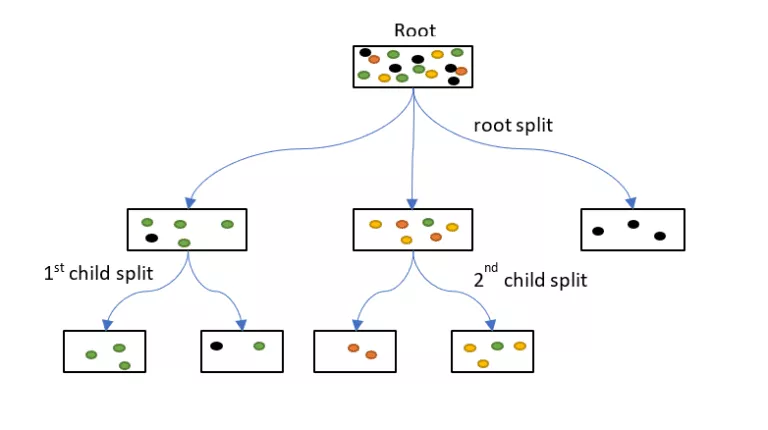
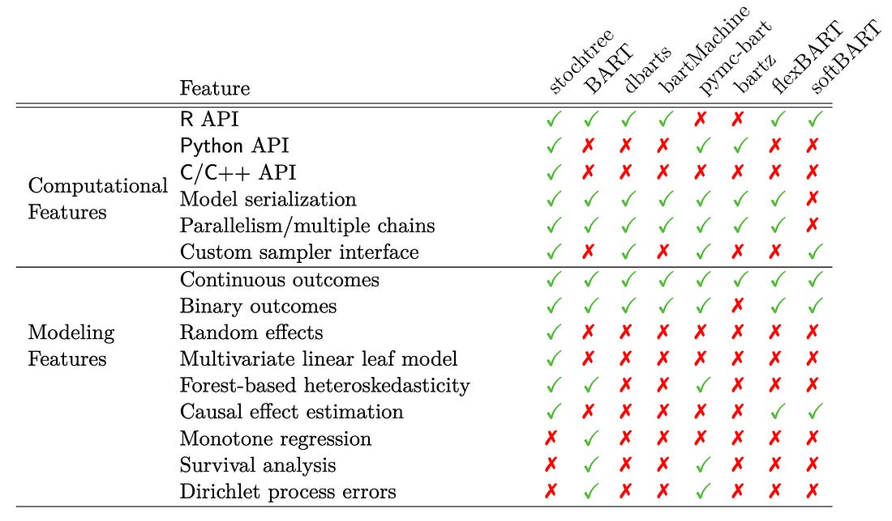
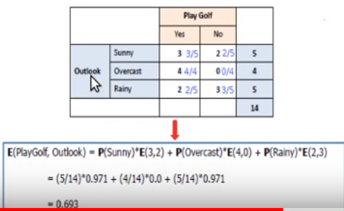
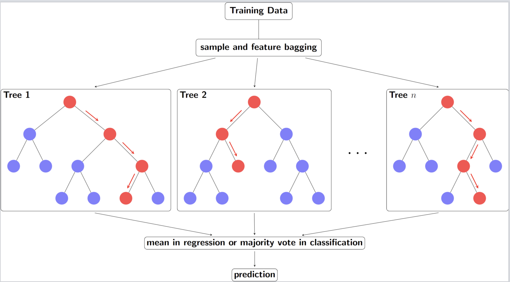
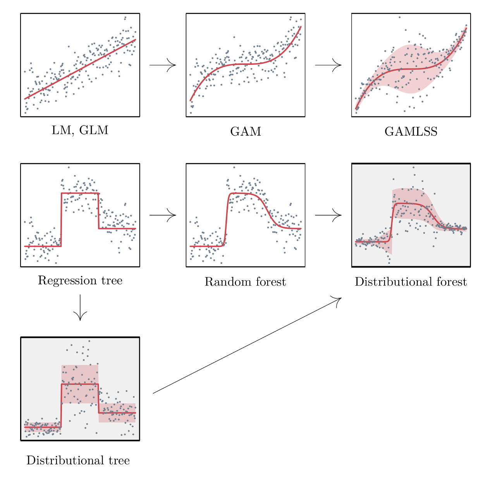
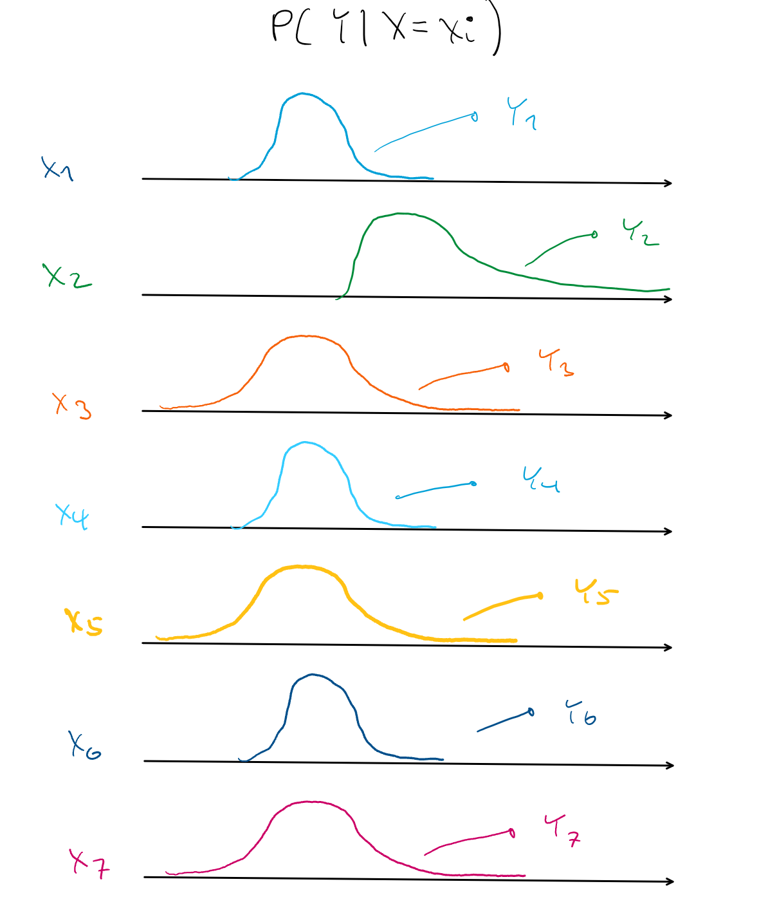

# Trees {#sec-alg-trees .unnumbered}

## Misc {#sec-alg-trees-misc .unnumbered}

-   Algorithmic models that recursively split the data into smaller and more homogeneous subgroups. Predictions are the same for every member of the subgroup (aka piece-wise constant). Forests smooth out the piecewise predictions by averaging over groups of trees.
-   How Tree models get probabilities
    -   Method 1: Each tree predicts the class of x according to the leaf node x falls within. The leaf node output is the majority class of the training points it contains. The predictions of all trees are considered as votes, and the class with the most votes is taken as the output of the forest. This is the original formulation of random forests proposed by Breiman (2001).
    -   Method 2: Each tree outputs a vector \[p1,...,pk\], where k is the number of classes, representing the predicted probability of each class given x. This may be estimated as the relative class frequencies of training points in the leaf node x falls within. The forest output is the average of these vectors across trees, representing a conditional distribution over classes given x.
    -   [Example]{.ribbon-highlight}: Data point falls into a tree's leaf where yellow is the predicted class (2nd child split)\
        
        -   For this tree in the ensemble, there are 3 yellow and 1 green in the terminal leaf (2nd child split). Therefore the probability of Yellow is 75%.
        -   For each class, the trees that predict that class have their probabilites averaged to produced the predicted probability for that class.

## Decision Trees {#sec-alg-trees-dt .unnumbered}

::: {.callout-tip collapse="true"}
## Packages

-   [{]{style="color: #990000"}[AddiVortes](https://johnpaulgosling.github.io/AddiVortes/){style="color: #990000"}[}]{style="color: #990000"} ([Paper](https://www.tandfonline.com/doi/full/10.1080/10618600.2024.2414104#d1e6260)) - Bayesian Additive Voronoi Tessellation model for machine learning regression and non-parametric statistical modeling.
    -   **Flexible alternative to BART** (Bayesian Additive Regression Trees)
    -   Currently only for regression tasks
    -   Computationally expensive and currently not optimized. So check and see if this has changed before using with any large, high dimensional datasets.
    -   Tessellations partition the covariate space and output values are based on the cell the sample falls in.
        -   Applies a probabilistic approach to which cell a sample falls into based on the distance to the center of its cell and the others then this would further smooth the output function of the algorithm (similar to SoftBART).
-   [{]{style="color: #990000"}[bonsai](https://bonsai.tidymodels.org/){style="color: #990000"}[}]{style="color: #990000"} - **tidymodels** extension fits [{partykit::ctree}]{style="color: #990000"}
-   [{]{style="color: #990000"}[dtGAP](https://github.com/hanmingwu1103/dtGAP){style="color: #990000"}[}]{style="color: #990000"} - Supervised Generalized Association **Plots** Based on Decision Trees (See paper at bottom of readme)
    -   Illustrate complex associations by embedding supervised correlation and distance measures into GAP for enriched decision-tree visualization
    -   Includes confusion matrix maps, decision-tree matrix maps, predicted class membership maps, and evaluation panels.
-   [{]{style="color: #990000"}[glmertree](https://cran.r-project.org/web/packages/glmertree/index.html){style="color: #990000"}[}]{style="color: #990000"} - **Generalized Linear Mixed Model** Trees
    -   Combines `lmer`/`glmer` from [{lme4}]{style="color: #990000"} and `lmtree`/`glmtree` from [{partykit}]{style="color: #990000"}
-   [{]{style="color: #990000"}[LDATree](https://iamwangsiyu.com/LDATree/){style="color: #990000"}[}]{style="color: #990000"} ([Paper](https://arxiv.org/abs/2410.23147)) - Integrates Uncorrelated **Linear Discriminant Analysis** (ULDA) and Forward ULDA into a decision tree structure
    -   Superior to traditional decision trees and other implementations (see paper) of oblique trees.
    -   Effectively generates oblique splits, handles missing values, performs feature selection, and outputs predicted class labels and class probabilities.
    -   Peforms extremely well when the dataset contains many noise variables, and when significant high-order interactions are present alongside non-significant low-order interactions. In these scenarios, the proposed method outperforms other methods, including the random forest.
-   [{]{style="color: #990000"}[parttree](https://grantmcdermott.com/parttree/){style="color: #990000"}[}]{style="color: #990000"} - **Visualize** simple 2-D decision tree partitions
-   [{]{style="color: #990000"}[partykit](https://cran.r-project.org/web/packages/partykit/index.html){style="color: #990000"}[}]{style="color: #990000"} - **model-based trees**
-   [{]{style="color: #990000"}[PPtreeExt](https://natydasilva.github.io/PPtreeExt/){style="color: #990000"}[}]{style="color: #990000"} - Extends to the **Projection Pursuit Tree** (PPtree) algorithm to improve its performance in multi-class settings and under nonlinear separations
    -   The PPtree classifier finds separations between classes based on linear combinations of variables by optimizing a projection pursuit index.
-   [BART]{.underline}
    -   [{]{style="color: #990000"}[bartMan](https://alaninglis.github.io/bartMan/){style="color: #990000"}[}]{style="color: #990000"} - **Investigating and visualizing** Bayesian Additive Regression Tree (BART) model fits.
        -   Currently supports [{]{style="color: #990000"}[BART](https://cran.r-project.org/web/packages/BART/index.html){style="color: #990000"}[}]{style="color: #990000"}, [{]{style="color: #990000"}[dbarts](https://cran.r-project.org/web/packages/dbarts/index.html){style="color: #990000"}[}]{style="color: #990000"}, and [{bartMachine}]{style="color: #990000"}
    -   [{]{style="color: #990000"}[bartMachine](https://cran.r-project.org/web//packages//bartMachine/index.html){style="color: #990000"}[}]{style="color: #990000"} ([Vignette](https://www.jstatsoft.org/article/view/v070i04)) - **R-Java** Bayesian Additive Regression Trees implementation
        -   See [github](https://github.com/kapelner/bartMachine) for info on setting an option. Must be done before even loading the library or you'll get out of memory errors.
        -   Since this is Java, see [Misc \>\> R](misc.qmd#sec-misc-r){style="color: green"} \>\> [{rJavaEnv}]{style="color: #990000"}
        -   Variable selection, interaction detection, model diagnostic plots, incorporation of missing data and the ability to save trees for future prediction
        -   Significantly faster than the current R implementation, parallelized, and capable of handling both large sample sizes and high-dimensional data
    -   [{]{style="color: #990000"}[bartXViz](https://cran.r-project.org/web/packages/bartXViz/index.html){style="color: #990000"}[}]{style="color: #990000"} - **Visualization** of BART and BARP (BART with Post-Stratification) using SHAP
    -   [{]{style="color: #990000"}[EBcoBART](https://github.com/JeroenGoedhart/EBcoBART){style="color: #990000"}[}]{style="color: #990000"} - **Finds variable weights** via empirical bayes which can be used as spliitting probabilities in BART models
    -   [{]{style="color: #990000"}[flexBART](https://cran.r-project.org/web/packages/flexBART/index.html){style="color: #990000"}[}]{style="color: #990000"} - Implements a faster and more expressive version of Bayesian Additive Regression Trees that, at a high level, **approximates unknown functions as a weighted sum of binary regression tree ensembles**.
        -   Supports fitting **(generalized) linear varying coefficient** models and **heteroscedastic** models
    -   [{]{style="color: #990000"}[ridgeBART](https://github.com/ryanyee3/ridgeBART){style="color: #990000"}[}]{style="color: #990000"} ([Paper](https://arxiv.org/abs/2411.07984)) - Uses trees that output linear combinations of ridge functions, which compose affine transformations of the inputs with a non-linearity, i.e. a **Bayesian ensemble of localized neural networks with a single hidden layer.**
        -   Whereas the original BART model approximates functions with piecewise constant step functions, ridgeBART approximates functions with piecewise continuous functions
        -   Outperformed the original BART model and GP-based extensions in terms of predictive accuracy and computation time on both targeted smoothing and general regression problems.
        -   No variable selection
    -   [{]{style="color: #990000"}[SoftBart](https://cran.r-project.org/web/packages/SoftBart/index.html){style="color: #990000"}[}]{style="color: #990000"} - Sparsity inducing soft decision trees. **Overcomes smoothness and curse of dimensionality limitations** of tree methods (including the original BART, forest, and boosting algorithms).
        -   Modified BART such that the function was smoothed by **adding a probabilistic aspect to each tree**.
    -   [{]{style="color: #990000"}[stan4bart](https://cran.r-project.org/web/packages/stan4bart/index.html){style="color: #990000"}[}]{style="color: #990000"} - Fits **semiparametric linear and multilevel models** with non-parametric additive Bayesian additive regression tree (BART)
    -   [{]{style="color: #990000"}[stochtree](https://stochtree.ai/R_docs/pkgdown/){style="color: #990000"}[}]{style="color: #990000"} - **Stochastic tree ensembles** (i.e. BART, XBART) for supervised learning and causal inference.\
        {.lightbox width="382"}
    -   [{]{style="color: #990000"}[VCBART](https://cran.r-project.org/web/packages/VCBART/index.html){style="color: #990000"}[}]{style="color: #990000"} - Fit **Varying Coefficient Models** with Bayesian Additive Regression Tree
:::

-   [Misc]{.underline}
    -   PCA improves DT predictive performance in two important ways (py [example](https://towardsdatascience.com/one-step-to-make-decision-trees-produce-better-results-b0ccd6738200)):
        1.  Orients key features together (that explain the most variance)
            -   DTs create orthogonal decision boundaries and PCs are orthogonal to each other.
        2.  Reduces the feature space
-   [Classification Procedure]{.underline}
    1.  Calculate *Shannon Entropy* of dependent variable ($Y$):\
        $E(Y) = -\sum_{i=1}^{c} P(Y_i)\log_2 P(Y_i)$ where $P(Y)$ is the marginal probability

        -   For a binary variable, this would be\
            $$
            E(Y) = -P(+)\log_2 P(+) - P(-)\log_2 P(-)
            $$
        -   In general the Shannon Entropy equation is\
            $$
            E(S) = -\sum_{i=1}^{c} p_i \log_2 p_i
            $$ where $p$ is a probability and $c$ is the number of classes for the variable and $S$ = subset of data or the node.
        -   Probabilities are between $(0,1)$ and taking a log of numbers in this interval produces a negative value. Hence, the negative at the beginning of the expression.
        -   If the natural log, ln, is used then it's called deviance
        -   Misclassification error or the gini index can be used instead of Shannon Entropy

    2.  Calculate the entropy of the target, $Y$, with respect to each independent variable, x. For variable, $x_m$ with number of classes, $c$ :\
        $$
        E(Y,x_m) = \sum_{i=1}^{d} P(x_{m_i}) E(x_{m_i})
        $$

        -   $P(x_{m_i})$ is the marginal probability for that class of that variable, i.e. ratio of instances of that class in the entire dataset.
        -   I don't like the way the equation is written above. In videos, this type of entropy isn't given a name, but I think it matches conditional entropy in its description and calculation.
            -   Conditional Entropy (for a particular $x$)\
                $$
                E(Y|x_m) = \sum_{i=1}^{d} P(x_{mi}) \sum_{j=1}^{c} P(Y_j|x_{mi}) \log_2 P(Y_j|x_{mi})
                $$
                -   This definition uses $H(Y|X) = \sum_{x \in X} P(x) H(Y|X=x)$ where $H$ is used to as the symbol for entropy.
        -   [Example]{.ribbon-highlight}:\
            {.lightbox}
            -   Not explicitly shown above, but for the entropy calculations, it uses the sum of the rows as the denominator in probability calculations. This fits with a "conditional" type of entropy.

    3.  Calculate information gain for variable $x_m$

        $$
        \text{gain}(Y,x_m) = E(Y) - E(Y|x_m)
        $$

        -   Repeat for all independent variables

    4.  Select the independent variable with the largest gain for first split

        -   First split, i.e. root node, is the most influential variable

    5.  If categorical variable chosen, leaves are all levels of that variable

        -   Subset dataset by var == level (for each branch)
        -   Repeat entropy and information gain calculations on the subsetted data set
            -   Branches with entropy \> 1 are split unless some other stopping criteria is reached
        -   Choose variable with largest information gain and split by that variable
        -   Keeping repeating until maxdepth reached or minimum node size (number of rows in subset) reached

    6.  Numerical vars are binned and treated like categorical vars

    7.  Predicted class is the mode of the classes in the appropriate terminal node
-   [Regression Procedure]{.underline}
    1.  For each predictor var, choose a separator value, s
        -   e.g var1 \> 5 and var1 \<= 5 where s = 5
    2.  Calculate the mean y value for both regions then calculate the MSE ((obs - mean)\^2) of both regions. Sum of both MSEs. The optimal separator produces the lowest sum MSE.
    3.  Whichever predictor has lowest sum MSE is chosen as the split variable.
    4.  Recursively repeat. For example, repeat on region where var1 \>5 and repeat on region where var1 \<= 5.
    5.  Continue until max.depth, max splits reached or data points in created region is less than a minimum or MSEs being calculated are all greater than a chosen amount, or... etc. (Hyperparameters)
    6.  Prediction is the mean in the appropriate terminal node

## Random Forest {#sec-alg-trees-rf .unnumbered}

{.lightbox width="532"}

-   Several independent decision trees are fit. Each tree uses sampled-with-replacement (bootstrapped) data. At each node within the tree, the outcome space is split according to a random subset of features (mtry) in $X$. Predictions are averaged or chosen by majority vote.
-   When we ''drop down'' a new point $x$, it will end up in a leaf for each tree. A leaf is a set with observations $i$ and taking the average over all $y_i$ in that leaf gives the prediction for one tree. These predictions are then averaged to give the final result. Thus, for a given $x$ if you want to predict the conditional mean of $Y$ given that $x$, you:
    -   "Drop down" the $x$ each tree (this is indicated in red in the above figure). Since the splitting rules were made on $X$, your new point $x$ will safely land somewhere in a leaf node.
    -   For each tree you average the responses $y_i$ in that leaf to get an estimate of the conditional mean of each tree.
    -   You average each conditional mean over the trees to get the final prediction.
-   Averaging the prediction of all trees leads to a marked reduction in variance.
-   Packages
    -   [{]{style="color: #990000"}[CDF](https://cran.r-project.org/web/packages/CDF/index.html){style="color: #990000"}[}]{style="color: #990000"} - Centroid Decision Forest for High-Dimensional Classification
        -   Selects discriminative features via a multi-class class separability score (CSS), splits by nearest class centroid, and aggregates tree votes to produce predictions and class probabilities.
    -   [{]{style="color: #990000"}[corrRF](https://cran.r-project.org/web/packages/corrRF/index.html){style="color: #990000"}[}]{style="color: #990000"} ([Paper](https://arxiv.org/abs/2503.12634)) - A clustered random forest algorithm for fitting random forests for data of independent clusters, that exhibit within cluster dependence
        -   Possibly can be used on repeated measures data
    -   [{]{style="color: #990000"}[RandomForestsGLS](https://cran.r-project.org/web/packages/RandomForestsGLS/index.html){style="color: #990000"}[}]{style="color: #990000"} - Generalizaed Least Squares RF
        -   Takes into account the correlation structure of the data. Has functions for spatial RFs and time series RFs
    -   [{]{style="color: #990000"}[randomForestSRC](https://www.randomforestsrc.org/){style="color: #990000"}[}]{style="color: #990000"} - Fast Unified Random Forests for Survival, Regression, and Classification (RF-SRC)
        -   Regression, classification, survival analysis, competing risks, multivariate, unsupervised, quantile regression, and class imbalanced q-classification
        -   Extremely random forests and randomized splitting
        -   Suite of imputation methods for missing data
        -   Fast random forests using subsampling
        -   Confidence regions and standard errors for variable importance. New improved holdout importance. Case-specific importance. Minimal depth variable importance
        -   Anonymous random forests for data privacy
        -   New Mahalanobis splitting rule for correlated real-valued outcomes in multivariate regression settings
    -   [{]{style="color: #990000"}[ShrinkageTrees](https://cran.r-project.org/web/packages/ShrinkageTrees/index.html){style="color: #990000"}[}]{style="color: #990000"} ([Paper](https://arxiv.org/abs/2507.22004)) - Bayesian regression tree models with shrinkage priors on step height
    -   [{]{style="color: #990000"}[sirus](https://cran.r-project.org/web/packages/sirus/index.html){style="color: #990000"}[}]{style="color: #990000"}: [S]{.underline}table and [I]{.underline}nterpretable [Ru]{.underline}le [S]{.underline}et
        -   Combines the simplicity of decision trees with a predictivity close to random forests
        -   Instead of aggregating predictions, SIRUS aggregates the forest structure: the most frequent nodes of the forest are selected to form a stable rule ensemble model
        -   Me: The interpretability of a Decision Tree with similar predictive accuracy of a RF. Seems like it would be good to fit both and use this model for additional interpretability.
        -   There's also a Spatial SIRUS ([github](https://github.com/LucaPate/Spatial_SIRUS), [paper](https://arxiv.org/abs/2408.05537)) which uses a spatial [{RandomForestsGLS}]{style="color: #990000"} model in a SIRUS algorithm
    -   [{]{style="color: #990000"}[stochtree](https://stochtree.ai/R_docs/pkgdown/){style="color: #990000"}[}]{style="color: #990000"} - Stochastic tree ensembles (i.e. BART, XBART) for supervised learning and causal inference.
    -   [{]{style="color: #990000"}[unityForest](https://cran.r-project.org/web/packages/unityForest/index.html){style="color: #990000"}[}]{style="color: #990000"} - Improving Interaction Modeling and Interpretability in Random Forests
        -   Currently, only classification is supported
        -   A random forest variant designed to better take covariates with purely interaction-based effects into account, including interactions for which none of the involved covariates exhibits a marginal effect.
        -   Facilitates the identification and interpretation of (marginal or interactive) effects
        -   Includes unity variable importance and covariate-representative tree roots (CRTRs) that provide interpretable visualizations of these conditions

## Isolation Forests {#sec-alg-trees-isof .unnumbered}

-   Used for anomaly detection. Algorithm related to binary search.
-   Notes from paper: <https://cs.nju.edu.cn/zhouzh/zhouzh.files/publication/icdm08b.pdf>
-   Also see [Anomaly Detection \>\> Isolation Forests](anomaly-detection.qmd#sec-anomdet-isofor){style="color: green"}
-   The tree algorithm chooses a predictor at random for the root node. Then randomly chooses either the minimum or the maximum of that variable as the splitting value. The algorithm recursively subsamples like normal trees (choosing variables and split points in the same manner) until each terminal node has one data point or replicates of the same data point or preset maximum tree height is reached. Across the trees of a forest, anomalies with have a shorter average path length from root to terminal node.
    -   The algorithm is basically looking for observations with combinations of variables that have extreme values. The process of continually splitting subsamples of data will run out data points and be reduced to a single observation more quickly for an anomalous observation than a common observation.
    -   Makes sense. Picturing a tree structure, there shouldn't be too many observations with more that a few minimums/maximums of variable values. The algorithm weeds out these observations as it moves down the tree structure.
        -   Any or all of these wouldn't necessarily be global minimum/maximums since we're dealing with subsamples of variable values as we move down the tree.
    -   Paper has some nice text boxes with pseudocode that goes through the steps of the algorithm.
-   Anomaly scores range from 0 to 1. Observations with a shorter average path length will have a larger score.
    -   Anomaly score\
        $$s(x_i, n) = 2^{-\frac{E(h(x_i))}{c(n)}}$$
        -   $E(h(xi))$ is the average path length across the isolation forest for that observation
        -   $c(n) = 2H(n-1) - \frac{2(n-1)}{n}$
            -   Where $H(i)$ is the Harmonic number, $H(i) = \ln(i) + 0.5773156649$ (Euler's Constant)
    -   Guidelines
        -   The closer an observation's score is to 1 the more likely that it is an anomaly
        -   The closer to zero, the more likely the observation isn't an anomaly.
        -   Observations with scores around 0.5 means that the algorithm can't find a distinction.

## Distributional Trees/Forests {#sec-alg-trees-distree .unnumbered}

{.lightbox width="632"}

### Misc {#sec-alg-trees-distree-misc .unnumbered}

-   Blends the distributional modeling of gamlss (additive, nonlinear, location, scale, shape) and the abrupt-change detection, additive + multiplicative effects capability, inclusion of interaction effects of decision trees / random forests. For regression trees, estimating all the distributional parameters instead of just the mean makes calculating the uncertainty easier.
    -   CART trees don't have a concept of statistical significance, and so cannot distinguish between a significant and an insignificant improvement in the information measure.
    -   CART tree predictions are piecewise-constant (every observation in the node has the same prediction), it will not be accurate unless the tree is large. But a large tree is harder to interpret than a small one.
    -   Linear trends are difficult for trees with piecewise-constant predictions
-   Algorithm splits based on changes in the mean and higher moments. So able to capture things like changes in variance.
-   Conditional distributions allow for the computation of prediction intervals.
-   This framework embeds recursive partitioning into statistical model estimation and variable selection
-   The statistical formulation of the algorithm ensures the validity of interpretations drawn from the resulting model

### [{partykit}]{style="color: #990000"} {#sec-alg-trees-distree-party .unnumbered}

#### Misc {#sec-alg-trees-distree-party-misc .unnumbered}

-   [{[partykit](https://cran.r-project.org/web/packages/partykit/index.html)}]{style="color: #990000"}
-   Notes from: <https://arxiv.org/pdf/1804.02921.pdf>
-   This algorithm is ridiculously complex, so unless you're psychotic like evidently I am, stick to the tl;dr.
-   **tl;dr Procedure**
    -   For each distributional parameter (e.g. mean, sd), a "score" matrix is computed using the target values and the distribution's likelihood function
    -   The score matrix is used to create a test statistic for each predictor
    -   The predictor with the lowest p-value associated with its test statistic is the splitting variable
    -   The split point is determined by the point that produces the lowest p-value in one of the split regions
    -   Process continues for each leaf until no variables produce a p-value below a certain threshold (e.g. $\alpha = 0.05$)
    -   The distributional parameters associated with the leaf that a new observation falls into is used as the prediction for a tree.

#### Tree Procedure {#sec-alg-trees-distree-party-treeproc .unnumbered}

1.  For each distributional parameter (e.g. mean, std.dev), calculate the value of the maximum likelihood estimator (MLE)
2.  Take the derivative of the log-likelihood function. Plug in the value(s) of the MLE parameter(s) and a yi value to get a "score" for every value of the response variable. Repeat for each distributional parameter. (The score should fluctuate around zero.)\
    $$
    \begin{align}
    s(\theta; y_i) &= \frac{\partial \log \mathcal{L}(\theta;y_i)}{\partial \theta} \;\; \text{and}\\ \\
    s(\hat{\theta}, y) &=
    \begin{pmatrix}
    s(\hat{\theta}, y_1)_1 & s(\hat{\theta}, y_1)_2 & \cdots & s(\hat{\theta}, y_1)_k \\\\
    \vdots & \vdots & \ddots & \vdots \\\\
    s(\hat{\theta}, y_n)_1 & s(\hat{\theta}, y_n)_2 & \cdots & s(\hat{\theta}, y_n)_k
    \end{pmatrix}
    \end{align}
    $$
    -   Where $k$ is the number of distributional parameters and $n$ is the number of training observations
    -   [Example]{.ribbon-highlight}: Gaussian where\
        $$
        \ln \mathcal{L} = -\frac{n}{2} \ln(2\pi\sigma^2)-\frac{1}{2\sigma^2} \sum_{i=1}^n (y_i-\mu)^2
        $$
        1.  Solve for the MLE of the mean and calculate the value:\
            $$
            \hat{\theta}_{\mu} = \frac{1}{n}\sum_{i=1}^{n} y_i
            $$
        2.  Solve for the MLE of the variance and calculate the value:\
            $$
            \hat{\theta}_{\sigma^2} =
            \frac{1}{n}\sum_{i=1}^{n}(y_i - \hat{\theta}_{\mu})^2
            $$
        3.  We're calculating a score for each value of the outcome variable so we can remove the summation symbol from the derivative of the log-likelihood function w.r.t. the mean. This leaves us with the mean score function:\
            $$
            s(\hat{\theta}_{\mu}, y_i) =
            \frac{y_i - \hat{\theta}_{\mu}}{\hat{\theta}_{\sigma^2}}
            $$
        4.  Same thing but with the derivative of the log-likelihood function w.r.t. the variance:\
            $$
            s(\hat{\theta}_{\sigma^2}, y_i) =
            \frac{(y_i - \hat{\theta}_{\mu})^2 - n}{2\hat{\theta}_{\sigma^2}}
            $$
3.  Null Hypothesis test each predictor variable vs the parameter score matrix where $H_0$ = independence — two methods: *CTree* and *MOB*
    1.  CTree is permutation test based
        1.  Each test statistic vector, $T$, for $1,\ldots,l$ predictors and $n$ observations is calculated by:\
            $$
            T_l = \mathrm{vec}\!\left(\sum_{i=1}^{n} v_l(Z_{li}) \cdot s(\hat{\theta}, Y_i)\right)
            $$
            -   Where $s(\hat\theta, \boldsymbol{Y_i})$ is the $1 \times k$ row of the score matrix and $v$ is a transformation function that depends on whether the predictor variable, $Z$, is a numeric or character type.
            -   If the predictor variable, $Z$, is a numeric:
                1.  $v$ is an identity function, so $Z$ remains unchanged.
                2.  Corresponding to the first observation, the first row of the score matrix is multiplied by the first value of the predictor variable resulting in a $1\times k$ row vector.
                3.  Then $n \cdot (1\times k)$ row vectors are added together
                4.  The summed $1\times k$ vector is transposed by the *vec* function into the $k$-vector, $T$.
            -   If the predictor variable, $Z$, is a character variable with $H$ categories:
                1.  $v$ creates an indicator variable where the h^th^ value is 1 indicates that $Z_i$'s value is the h^th^ category.
                2.  Corresponding to the first observation, we multiply this $H\times1$ vector times the $1\times k$, first row of the score matrix which results in a sparse $H\times k$ matrix.
                3.  Then $n \cdot H\times k$ matrices are added together
                4.  *vec* then stacks each column of the summed $H \times k$ matrix to create a column vector, $T$, with $H\cdot k$ rows.
        2.  $T$ is standardized by quadratic or maximum or method.
            -   Quadratic\
                $$
                c_{\text{quad}}(t_l, \mu_l, \Sigma_l) = (t_l-\mu_l)\Sigma_l^+(t_l-\mu_l)^T
                $$
                -   Using this quadratic method, $c$ is a Chi-Square test statistic.
                -   $t$ just represents a statistic that's calculated from a permutation of the scores. $T$ is handled in the same way.
                -   $\mu_l$ is the conditional expectation and $\Sigma^+_l$ is the Moore-Penrose inverse of the covariance of $T_l$
                -   The partykit ctree vignette shows the calculations for $\mu$ and $\Sigma^+$
            -   Maximum\
                $$
                c_\text{max}(t,\mu,\Sigma) = \max_{k=1,\ldots , \dim(T)} \left|\frac{(t-\mu)_k}{\sqrt{\sum_{kk}}}\right|
                $$
                -   For the maximum method, $c$ is Normal test statistic (partykit::ctree.pdf)
                -   I have the k's as subscript but I'm not sure
        3.  Find the p-value associated with each predictor's $c$ statistic\
            $$
            P_l = \mathbb{P}_{H^l_0}(c_{\text{quad}}(T_l,\mu_l,\Sigma_l) \ge c_{\text{quad}}(t_l,\mu_l,\Sigma_l \;|\;S(\mathcal{L}_n,w))
            $$
            -   This says the p-value is the probability, $\mathbb{P}$, which is associated with the null hypothesis for this particular variable, that the standardized $T$ stat is as or more extreme than the group of standardized $t$ stats of the permuted scores.
            -   $S(\mathbb{L},w)$ is the symmetric group of permutations and weights.
                -   Weights being either 0 or 1 depending on whether the observation is present in that node's data subset.
    2.  MOB stands for Model-based Method
        -   Uses a M-Fluctuation test to test for an "instability" by calculating a supLM test statistic. An instability is what's interpreted from a p-value \< 0.05
        -   Test Statistic\
            $$
            \lambda_{\text{supLM}} = \max_{i=\bar i,\ldots,\underline{i}}\left(\frac{i}{n} \cdot \frac{n-i}{n}\right)^{-1} \lVert W_j(\frac{i}{n})\rVert_2^2
            $$
            -   The maximum limits 🥴
                -   $\underline i = n - \bar i$ where $\bar i$ is a minimum amount of scores that you choose
                -   No guidelines for $\bar i$
                -   In addition to choosing a minimum, the paper mentions trimming the node data points at each end by 10%.
            -   $\left(\frac{i}{n} \cdot \frac{n-i}{n}\right)^{-1}$ is called "its variance function."
            -   $W_j(t = \frac{i}{n}) = \hat J^{-1/2}n^{-1/2}\sum_{i=1}^{\lfloor nt \rfloor} S(\hat \theta,Y_i)_{\sigma Z_{ij}}$
                -   $\lfloor nt \rfloor$ means floor of $nt$
                -   The subscript $\sigma Z_{ij}$ says the scores are ordered from highest to lowest (aka anti-rank) according to the predictor variable, $Z_j$, values
                -   $\hat J = n^{-1}\sum_{i=1}^n S(\hat\theta,Y_i)\;S(\hat\theta,Y_i)^T$ is the covariance matrix
            -   The distribution from which the p-value is calculated has something to do with a Bessel process and stuff converging to a Brownian Bridge, so I decided to shut it down here. My psychosis has limits.
                -   See <https://eeecon.uibk.ac.at/~zeileis/papers/Zeileis%2BHothorn%2BHornik-2008.pdf> for details
4.  Bonferonni adjust the p-value according the number of variables, $m$: $P_t^{\text{adj}} = 1-(1-P_l)^m$
5.  Select predictor variables with adjusted p-values lower than the threshold
6.  From that selection, the predictor with the lowest p-value is chosen as the splitting variable.
    -   If no p-values are lower than the threshold, splitting is halted and the terminal node is reached for that branch (aka pre-pruning).
    -   Pre-pruning not usually done in distributional forests (mincriterion = 0).
7.  Choose the optimal split point for the chosen variable where the lowest p-value is produced in one of the two created sub-regions (i.e the maximum test statistic).
8.  Procedure is repeated (like traditional trees) in the created leaves and continues until stopping criteria reached (e.g. no p-values lower than threshold, number of observations in node is below minimum, etc)
9.  In practice, predicting, using just a tree, involves finding the node with the criterion that fits the new observation and using the estimated distributional parameters of the subsample belonging to that node as the model prediction.
    -   The paper says this can be thought of as a weighted maximum likelihood estimation. The mathematical notation is similar to what I show below for forests.

#### Forest Procedure {#sec-alg-trees-distree-party-forestproc .unnumbered}

-   The idea of random forests is to train an ensemble of trees, each on different training data obtained through resampling or subsampling. In each node only a random subset of the covariates is considered for splitting to reduce the correlation among the trees and to stabilize the variance of the model
-   Notes from: <https://arxiv.org/pdf/1701.02110.pdf>

##### Weights {#sec-alg-trees-distree-party-forestproc-wgts .unnumbered}

-   The weight system used below to calculate predicted means across all leaves in the forest (from [{drf}]{style="color: #990000"} explainer)
-   Instead of directly calculating the mean in a leaf node, one calculates the weights that are implicitly used when doing the mean calculation. The weight $w_i(x)$ is a function of the test point $x$ and an observation $i$.
-   That is, if we drop $x$ down a tree, we observe in which leaf it ends up. All observations that are in that leaf get a 1, all others 0.
    -   [Example]{.ribbon-highlight}: if we end up in a leaf with observations (1,3,10), then the weight of observations 1,3,10 for that tree is 1, while all other observations get 0.
-   We then further divide that weight by the number of elements in the leaf node.
    -   [Example]{.ribbon-highlight}: From before, we had 3 observations in the leaf node, so the weights for observations 1,3, 10 are 1/3 each, while all other observations still get a weight of 0 in this tree. Averaging these weights over all trees gives the final weight $w_i(x)$.
-   Calculating the mean as we do in a traditional Random Forest, is the same as summing up $w_i(x)\cdot y_i$

##### Predictions {#sec-alg-trees-distree-party-forestproc-preds .unnumbered}

1.  For a training observation and a tree, determine whether a new observation $z$ belongs in the same node as the training observation, zi.
2.  Calculate a weight according to whether the new observation and the training observation are in the same node.
    -   If they are in the same node: $w_i^t = 1 / n_{\text{node}}$
        -   $i$ is the training observation
        -   $n$ is the number of observations in that node of that particular tree, $t$.
    -   If $z_i$, the training observation, and the new observation, $z$, aren't in the same node, then $w_{it} = 0$
3.  Calculate $w_{it}$ for each tree the training observation belongs to.
    -   Resampling or subsampling may exclude a training observation from some of the trees
4.  Sum all tree weights, $w_{it}$, for that training observation and divide by the number of trees to get the forest-weight for that training observation.\
    $$
    w_i^{\text{forest}} = \frac{1}{T_i} \sum_{t=1}^{T_i} w_i^t
    $$
    -   $T_i$ is the total trees that use that training observation in its learning sample.
        -   So the forest weight is the average weight per tree for that training observation
    -   In the paper, this process is described by a more compact notation: $$
        w_i^{\text{forest}}(z) =
        -\frac{1}{T}\sum_{t=1}^T \sum_{b=1}^{B^t} \frac{\mathbb{1}(z_i \in B^b \land z \in B^b)}{|B^b|}
        $$
        -   The numerator in the end part of this equation indicates whether the b^th^ terminal node, $B^b$, contains the training observation, $z_i$, and the new observation, $z$, for tree, $t$.
        -   $|B_b^t|$ is the number of observations in that terminal node
5.  The paper describes predictions being calculated by a weighted MLE as it did for a single tree, but for forests it didn't explicitly give an "in practice" description of process.\
    $$
    \hat \theta = \operatorname{arg}\max_{\theta \in \Theta} \sum_{i=1}^n w_i^{\text{forest}} \cdot l(\theta;y_i)
    $$
    -   Each parameter that has been calculated for each terminal node of each tree has a subset of the learning data associated with it. The forest weight-likelihood products of each observation are summed over this subset. The parameter with the largest sum is chosen as the prediction.
    -   Repeat for each distributional parameter.

### [{drf}]{style="color: #990000"} {#sec-alg-trees-distree-drf .unnumbered}

{.lightbox width="332"}

-   [{[drf](https://github.com/lorismichel/drf)}]{style="color: #990000"} ([Paper](https://cran.r-project.org/web/packages/drf/index.html))
-   Notes from [DRF: A Random Forest for (almost) everything](https://towardsdatascience.com/drf-a-random-forest-for-almost-everything-625fa5c3bcb8)
-   Papers
    -   [Causal-DRF: Conditional Kernel Treatment Effect Estimation using Distributional Random Forest](https://arxiv.org/abs/2411.08778)
        -   Obtains a consistent and asymptotically normal estimator of the conditional kernel treatment effect (CKTE), as well as an approximation of its sampling distribution
            -   CKTE captures effects of treatments beyond differences in conditional expectations
            -   CATE is limited in that a treatment might affect the outcome beyond just its conditional expectation.
                -   For example, giving a drug to several new patients with the same covariates x could decrease blood pressure on average, but also lead to an undesirable increase in variance.
        -   Which enables the construction of a conditional kernel-based test for distributional effects with provably valid type-I error
        -   I think all this amounts to a more accurate CI (including for smaller sample sizes) for the CATE in the equivalent form of CKTE
-   Ultimately when a RF finishes splitting data, each leaf should ideallly contain a homogeneous set of points in terms of approximating a the conditional distribution, $P(Y|X=x_i)$, but this only applies to the conditional mean of that leaf. As seen in the pic, the mean doesn't fully describe that leaf's conditional distribution.
    -   Every distribution except $x_2$ has a similar means, but sets $(x_1,x_4,x_6)$ and $(x_3, x_5, x_7)$ have different variances.
-   [{drf}]{style="color: #990000"} is able to fit a RF with these more homogeneous leaves by transforming the leaf's $y_i$ subsamples into a *Reproducing Kernel Hilbert Space* with a kernel.
    -   In this infinite-dimensional space, conditional means are able to fully represent conditional distributions and the Maximum Mean Discrepancy (MMD) is (efficiently) calculated.
    -   The MMD measures the similarity between distributions
    -   Thus, if the conditional distribution of $Y$ given $x_i$ and $x_j$ are similar, they will be grouped in the same leaf.
-   [{drf}]{style="color: #990000"} uses the same weighting system for its forest as [{partykit}]{style="color: #990000"} in order to produce predictions.

## Boosting {#sec-alg-trees-boost .unnumbered}

-   From <https://www.economist.com/graphic-detail/2021/03/11/how-we-built-our-covid-19-risk-estimator>
    -   In order to capture such complexity, we needed to allow for the possibility that comorbidities do not have constant effects that can simply be added together, but instead interact with each other, producing overall risk levels that are either higher or lower than the sum of their parts.
        -   Says main effects weren't good enough and needed to use interactions
    -   Gradient-boosted trees make predictions by constructing a series of "decision trees", one after the other. The first tree might begin by checking if a patient has hypertension, and then if they are older or younger than 65. It might find that people over 65 with hypertension often have a fatal outcome. If so, then whenever those conditions are met, it will move predictions in this direction. The next tree then seeks to improve on the prediction produced by the previous one. Relationships between variables are discovered or refined with each tree.
-   Difference between XGBoost and LightGBM (Raschka)
    -   XGBoost's trees are based on breadth-first search, comparing different features at each node.
    -   LightGBM performs depth-first search, focusing on a single feature & growing the tree from there.
-   XGBoost (and probably all boosting and maybe all tree algorithms) are robust against multicollinearity. ([source](https://medium.com/the-data-entrepreneurs/i-spent-2-995-on-nassim-talebs-risk-taking-course-here-s-what-i-learned-c442a55a2c64?source=explore---------11-98--------------------b62d22f2_8988_44be_a6e8_c3d7499333f4-------15))

### Gradient boosted machines (GBM) {#sec-alg-trees-boost-gbm .unnumbered}

1.  Choose a differentiable loss function, $\rho$, such as $\text{SSE} =
    \frac{1}{n}\sum (y - \hat{y})^2$
    -   In gradient boosting, 1/n is exchanged for 1/2, to make it differentiable. The mean of the loss function, SSE in this case, calculated over all observations for a model is called the "empirical risk" which is what boosting is trying to minimize.
2.  Calculate the negative gradient, aka first derivative. For regression trees, this turns out to be $-\frac{\partial \text{SSE}}{\partial \hat y} = y - \hat{y}$
    -   Which is just the residuals. Pg 360 of The Elements of Statistical Learning has other loss functions and their negative gradients. Classification uses a multinomial deviance loss function.
3.  Initialize using the optimal constant model, which is just a single terminal node tree. Think this means the initial predictions are just mean of the target, $\hat{y}_0 = \bar y$
4.  Calculate the negative gradient vector (residuals), r, by plugging in the predicted values.
5.  Fit a regression tree with the residuals, r, as the target variable. The mean of the residuals for that region (terminal node) is the *prediction*, $\hat{r}_{\text{region}}$ .
6.  Add the predicted residuals vector to the initial predictions vector, $\hat y_1 = \hat y_0 + \hat r$
    -   To get the next set of predictions to feed into the negative gradient equation.
7.  Repeat steps 4 - 6 until some stopping criteria is met.

### LightGBM {#sec-alg-trees-boost-lgbm .unnumbered}

-   Find optimal split points using a histogram based algorithm
    -   GOSS (Gradient Based One Side Sampling)
        -   Retains instances with large gradients while performing random sampling on instances with small gradients.
        -   [Example]{.ribbon-highlight}: Gaussian Regression
            -   Observations with small residuals are downsampled by random selection while those observations with large residuals remain
-   EFB (Exclusive Feature Bundling)
    -   Reduce feature space by bundling features together that are "mutually exclusive" (i.e. varA doesn't take a value of 0 in the same observation as varB).
        -   i.e. Bundles sparse features together
    -   Create bundles and assign features
        1.  Construct a graph with weighted (measure of conflict between features) edges. Conflict is measure of the fraction of exclusive features which have overlapping non zero values.
        2.  Sort the features by count of non zero instances in descending order.
        3.  Loop over the ordered list of features and assign the feature to an existing bundle (if conflict \< threshold) or create a new bundle (if conflict \> threshold).
    -   Merging
        -   Article wasn't coherent on this precedure

### XGBoost {#sec-alg-trees-boost-xgb .unnumbered}

-   Misc
    -   [Mathematics, Linear Algebra \>\> Misc](mathematics-linear-algebra.qmd#sec-math-linalg-misc){style="color: green"} \>\> Packages \>\> [{sparsevctrs}]{style="color: #990000"}
        -   Can create a sparse matrix for xgboost
-   FYI has various gradient function families: binomial, poisson, tweedie, softmax (multi-category classification)
-   Utilizes histogram-based algorithm for finding optimal split points.
    -   Buckets continuous features into discrete bins to construct feature histograms during training. It costs O(#data \* #feature) for histogram building and O(#bin \* #feature) for split point finding.
-   Regularization: It penalizes more complex models through both LASSO (L1) and Ridge (L2) regularization to prevent overfitting.
    -   Regularization function\
        $$
        \Omega(f) = \gamma T + \lambda \sum_j w_j^2 + \alpha \sum |w_j|
        $$
        -   This function gets minimized during training
        -   $T$ is the total number of trees
        -   $w$ is a leaf weight
    -   Tuning parameters
        -   $\alpha$ controls how much we want to penalize the sum of the absolute value of leaf weights (L1 regularization)
        -   $\lambda$ controls how much we want to penalize the sum of squared leaf weights  (L2 regularization)
        -   $\gamma$ is used to control how the number of trees in the model is penalized
-   Sparsity Awareness: XGBoost naturally admits sparse features for inputs by automatically 'learning' best missing value depending on training loss and handles different types of sparsity patterns in the data more efficiently.
-   Weighted Quantile Sketch: XGBoost employs the distributed weighted Quantile Sketch algorithm to effectively find the optimal split points among weighted datasets.
-   Multinomial: all the trees are constructed at the same time, using a vector objective function instead of a scalar one, i.e. there is an objective for each class. (i.e. Classifying n classes generate trees n times more complex)
    -   The objective name is multi:softprob when using the integrated objective in XGBoost. Although, the aim is not really the softprob , but the log loss of the softmax. And softmax is not the gradient of softmax , but the gradient of its log loss.

        $$
        \begin {align}
        \mbox{softmax}(x_i) &= \frac{e^{x_i}}{\sum_j e^{x_j}}\\
        \mbox{logloss}(x_i) &= -\ln(\mbox{softmax}(x_i)) = -ln(e^{x_i}) + \ln\left(\sum_j e^{x_j}\right) = -x_i + \ln\left(\sum_j e^{x_j}\right) \\
        \frac{\partial\mbox{logloss}(x_i)}{\partial x_i} &= \frac{\partial (-x_i + \ln\left(\sum_j e^{x_j}\right)}{\partial x_i} = -1 + \frac{e^{x_i}}{\sum_j e^{x_j}} = \mbox{softmax}(x_i)
        \end {align}
        $$

        -   i.e. the objective optimized is not softmax or softprob, but their log losss.
-   Cross-validation: The algorithm comes with built-in cross-validation method at each iteration, taking away the need to explicitly program this search and to specify the exact number of boosting iterations required in a single run.

#### Component-wise Boosting {#sec-alg-trees-boost-xgb-compwise .unnumbered}

-   Notes from {mboost} tutorial docs
-   tl;dr - Same as GBM except instead of fitting a tree model to the residuals, you're fitting many types of small models (few predictors). Best small model updates the predictions after each iteration.
-   The goal is to minimize empirical risk\
    $$
    \mathcal{R} := \sum_{i=1}^{n} \rho(y_i, f(x_i^T))
    $$
    -   $\rho$ is the loss function and $f$ is the predictor function
    -   The loss function is usually the negative log-likelihood function for the distribution of the outcome variable. For a Gaussian distribution, this is equivalent to the least squares objective function
-   Each baselearner's contribution to the final prediction vector is $\sum \nu \hat u^{[m]}$ (over all iterations where that baselearner was selected).
    -   I think this is the value of the \$f\_{\text{partial}} on the y-axis of the partial dependence plots (pdp).
        -   If the variables have been centered (maybe need to be completely standardized), then the magnitude of the y-axis (and the variable range within it) can be used as a signifier of variable importance and variables can be compared that way.
        -   If a variable has multiple baselearners selected, you can combine all the contributions and plot the combined effect pdp by `predict(which = "variable")`, row summing the values, and plotting. See the end of mboost.pdf for details.
-   Component-wise boosting performs variable selection unlike some other boosting algorithms

##### Steps {#sec-alg-trees-boost-xgb-compwise-steps .unnumbered}

1.  Compute the negative gradient of the loss function which is the negative first derivative with respect to the predictor function, $-\frac{\partial \rho}{\partial f} = y - \hat f(x^T)$.
2.  $\hat{f}^{[m]}$ can be thought of as the vector of predictions at the m^th^ iteration of the algorithm. So to begin, we create an initial vector,$\hat{f}^{[0]}$ with "offset values."
    -   For glmboost, the offset is the mean of the outcome variable. I'd guess it's probably the same for gamboost.
3.  Compute the negative gradient vector:\
    $$
    u^{[m]} =
    -\frac{\partial \rho}{\partial \hat f}
    =
    y - \hat{f}^{m-1}
    $$
    -   For the first iteration, m = 1:\
        $$
        u^{[1]} =
        -\frac{\partial \rho}{\partial f}
        =
        y - \hat{f}^{[0]}
        $$
4.  Fit each baselearner to the negative gradient vector.
    -   A baselearner is like a subset statistical model of the overall statistical model. They can be linear regressors, penalized linear regressors, shallow trees, penalized splines, etc. Each one using one or more predictors with or without interaction terms.
5.  For each baselearner, calculate the residual sum of squares from the predicitons, $\text{RSS} = \sum_{i=1}^n (u^{[m]}-\hat u^{[m]})^2$
6.  Whichever baselearner has the smallest RSS, scale it's predictions with a learning rate factor and combine them with the previous iteration's predictions\
    $$
    f^{[m]} = f^{[m-1]} + \nu \hat u^{[m]} \;\; \text{and} \; 0 \lt \nu \le 1
    $$
    -   $\nu$ is the *learning rate*.
    -   Optimization of $\nu$ isn't critical. Only required to be low enough as to not overshoot the minimum empirical risk, e.g. $\nu = 0.1$.
7.  After the predictions are updated, steps 3-6 are repeated until the number of iterations, set by the value of the [mstop]{.arg-text}, is reached.
    -   \[mstop\]{arg-text} is a hyperparameter that you optimize to prevent overfitting. The value can be chosen by CV or AIC
