# Spatial {#sec-assoc-spat .unnumbered}

## Misc {#sec-assoc-spat-misc .unnumbered}

- Also see
  - [Geospatial, Point Patterns \>\> Spatial Dependence \>\> Spatial Correlation](geospatial-point-patterns.qmd#sec-geo-ptpat-depfun-spcor){style="color: green"}
- Packages
  - [{]{style="color: goldenrod"}[pysal](https://pysal.org/pysal/){style="color: goldenrod"}[}]{style="color: goldenrod"} - Geospatial data science with an emphasis on geospatial vector data
    - Detection of spatial clusters, hot-spots, and outliers
  - [{]{style="color: #990000"}[rgeoda](https://geodacenter.github.io/rgeoda/){style="color: #990000"}[}]{style="color: #990000"} - Spatial data analysis based on libgeoda and GeoDa. It provides spatial data analysis functionalities including Exploratory Spatial Data Analysis, Spatial Cluster Detection and Clustering Analysis
    - Fast, but uses compiled code for all operations which makes it less flexible when modifications or enhancements are desired
    - [SDS, Ch.15.3, rgeoda](https://r-spatial.org/book/15-Measures.html#the-rgeoda-package) also has an example
  - [{]{style="color: #990000"}[spdep](https://r-spatial.github.io/spdep/){style="color: #990000"}[}]{style="color: #990000"}
- Resources
  - [An Introduction to Spatial Data Science with GeoDa Vol1 Exploring Spatial Data (Anselin 2023)](https://lanselin.github.io/introbook_vol1/)
  - [An Introduction to Spatial Data Science with GeoDa Vol2 Clustering Spatial Data (Anselin 2023)](https://lanselin.github.io/introbook_vol2/)
- Notes from
  - [Spatial Data Science, Ch.15](https://r-spatial.org/book/15-Measures.html)
  - [Comparing Implementations of Global and Local Indicators of Spatial Association (Bivand, Wong 2018)](https://scispace.com/pdf/comparing-implementations-of-global-and-local-indicators-of-17w0ryxrr4.pdf) (Also in R \>\> Documents \>\> Geospatial)
    - The concern about conditional permutations in Local Moran's I was later shown to be because the comparison by Bivand and Wong was between statistics that used different types of nulls. Both types of nulls are now available in [{spdep}]{style="color: #990000"} ([source](https://r-spatial.org/book/15-Measures.html#local-morans-i_i))
- A lot of these statistics have permutation versions. Examples in papers or books usually have some form of 999, 99999, etc for the number of permutations performed. This is so the pseudo p-value calculations produce "clean" numbers.
  - The convention is actually to count the observed statistic as one of the reference values, so the total number of reference values is permutations + 1
  - The pseudo p-value is calculated as the proportion of permuted statistics that are as extreme or more extreme than the observed statistic. With 999 permutations the smallest possible non-zero pseudo p-value is 1/(999 + 1) = 0.001, with 9,999 it's 1/(9999 + 1) = 0.0001, and with 99,999 it's 1/(99999 + 1) = 0.00001.
  - In determining a "explicable" cluster center pattern, you often test the sensitivity of various p-value thresholds and p-value correction methods on those patterns. Therefore, you want to make sure the lower limit of the pseudo p-value is below your threshold.

## Causes of Spurious Spatial Autocorrelation {#sec-assoc-spat-cossa .unnumbered}

- [Omitted Variables]{.underline}
  - A variable you haven't included in your model has its own spatial pattern injects apparent spatial structure into your results.
  - By including mulitple (relevant) predictors, testing the residuals is testing whether the unexplained variation is spatially clustered, not just whether the raw (response) variable has any spatial structure at all.
    - The fix for true spatial autocorrelation — where nearby observations *genuinely influence each other* (diffusion, spillovers, contagion), is a spatial lag or spatial error model.
  - [Example]{.ribbon-highlight}: You're mapping crime rates and notice strong spatial clustering, but you haven't controlled for poverty, which is itself spatially clustered .
    - The crime autocorrelation may largely disappear once poverty is accounted for.
    - The spatial pattern was real, but its cause wasn't proximity per se — it was a third variable you left out.
- [Model Misspecification]{.underline}
  - Modeling a nonlinear relationship as linear (or vice versa) can produce spurious spatial residuals.
- [Entitation]{.underline}
  - Choosing the wrong geographic units can manufacture or mask spatial autocorrelation
  - If your units are too large, you average out variation within them and neighboring units end up looking artificially similar
  - Certain causal effects may be present only at particular scales and missing this scale can lead to spurious autocorrelation
  - See
    - [Regression, Spatial \>\> Econometrics \>\> Examples](regression-spatial.qmd#sec-reg-spat-econ-ex){style="color: green"} \>\> Example 1
    - [Geospatial, General \>\> Terms](geospatial-general.qmd#sec-geo-gen-terms){style="color: green"} \>\> Copying Out
  - [Examples]{.ribbon-highlight}:
    - Counties were drawn for governance, not for studying disease spread or economic activity
    - Census tracts were drawn to have roughly equal populations, not to reflect neighborhood identity
    - Grid cells impose a rigid geometry that real phenomena don't respect
    - Your units cut across a real spatial boundary (e.g., a river that divides two distinct communities), you mask genuine dissimilarity

## Global Measures {#sec-assoc-spat-global .unnumbered}

### Misc {#sec-assoc-spat-global-misc .unnumbered}

- A single value of autocorrelation for the total study area. These measures consider the average autocorrelation level across all observations
  - Can be biased by edge effects where important spatial process components fall outside the study area.

### Join Count Test {#sec-assoc-spat-global-jct .unnumbered}

- Categorical, discrete, or group-wise test of spatial autorcorrelation
- Answers the question: given the spatial arrangement, do same-type or cross-type neighbors occur more or less often than you'd expect by chance?
- The observed counts are of neighbors with the same factor levels, known as same-color joins.
- Process
  1.  The observed same-color join-counts are tabulated with their expectations based on the counts of levels of the input factor
      - Example: Few joins would be expected between Warsaw boroughs, because there are very few (18) of them.
  2.  The variance calculation uses the underlying constants of the chosen [listw]{.arg-text} object and the counts of levels of the input factor.
  3.  The z-value is obtained by dividing the difference between the observed and expected join-counts by the square root of the variance.
- `joincount.multi`
  - [sampling]{.arg-text} - The basis for the construction of the variance of the measure, where the default "nonfree" choice corresponds to analytical permutation
  - [Jtot]{.var-text} is the count of all different-color joins. It tests whether cross-type joins are more or less than expected
- Interpretation
  - Positive z-score → More joins and more clustering than expected (i.e. positive spatial autocorrelation)
  - Negative z-score → Fewer joins and more dispersion than expected (i.e. negative spatial autocorrelation)
- Adjust p-values
  - Multiple tests on the same dataset and neighbor graph, so a p-value adjustment should be done.
    - Do same color (category) joins represent a different testing family than cross-color joins (therefore different numbers of comparisions?) or are these all together considered part of the same research question?
    - If you have a lot of categories and the adjustment flips some interpretations when you assume these should all be treated as the same family, then this becomes an important question.
  - Use the Holm (FWER) or Benjamini-Yekutieli (FDR) correction since there's likely negative correlations among test statistics
    - Structural Dependence: The join counts are computed from the same spatial weights matrix (i.e. same neighborhood graph) and the same set of polygons. Their z-values are correlated.
    - Compositionally Constrained: If same type joins are high, then cross-joins are lower since there is fixed number of joins. This induces *negative correlations*.
    - Cross-type pairs sharing a category could induce positive coorelations
      - e.g. Urban:Rural and Urban/rural:Rural both involve Rural polygons. If Rural polygons are more clustered than expected, both join counts might track together — suggesting *positive correlation* between some cross-type pairs

### Moran's I {#sec-assoc-spat-global-moran .unnumbered}

- [Misc]{.underline}

  - A measure of global spatial autocorrelation or overall clustering of the data
    - If there is no global autocorrelation or no clustering, there can still be clusters at a local level (See Local Moran's I)
    - A significant global test is often better read as a motivation for local analysis or spatial modeling rather than a finding in itself.
  - Assumes homegeneity (i.e. only one statistic is needed to summarize the whole study area)

- [Equations]{.underline}

  $$\begin{align}
  &I = \frac{N}{S_0} \frac{\sum_i \sum_j w_{ij}(x_i - \bar{x})(x_j - \bar{x})}{\sum_i (x_i - \bar{x})^2} \\
  & \text{where} \;\; S_0 = \sum w_{ij}\\
  &\mathbb{E} (I) = - \frac{1}{n-1}\\
  &\text{Var}(I) = \mathbb{E}(I^2) - [\mathbb{E}(I)]^2 \\
  &Z(I) = \frac{I - \mathbb{E}(I)}{\sqrt{\text{Var}(I)}}
  \end{align}$$

  - $I$ is the observed statistic
  - $N$ is the number of spatial units (e.g. counties)
  - $w_{ij}$ is an element of the spatial weights matrix
  - $\mathbb{E}(I)$ is the Expected I value under the null hypothesis
  - $\text{Var}(I)$ is the theoretical variance of I under the null hypothesis
  - $Z(I)$ is the Standard Deviate
    - Functions like a z-score in the NHST
  - The components of the analytical variance ($\text{Var}(I)$) equation (under normalization and randomization) aren't shown because it's long. It's computed from the weights and number of neighbors with observations.

- [Interpretation]{.underline}

  - H~0~: Spatial Randomness
  - Range: $w_{\text{min}}\frac{N}{W} \lt I \lt w_{\text{max}}\frac{N}{W}$
    - For a row normalized weight matrix, $\frac{N}{W} = 1$ (Wiki)
      - In [{spdep}]{style="color: #990000"}, this would be [style = "W"]{.arg-text}
      - I don't get this. W = 1, but why would N also equal 1? Not sure if this right.
  - I statistics significantly *below* the expected value are *negatively* correlated
  - I statistics significantly *above* the exected value are *positively* correlated

- `moran.test`

  - [randomisation]{.arg-text} - boolean; [TRUE]{.arg-text} (default) says calculate the variance of I under the assumption of randomization, if [FALSE]{.arg-text} assume normality
    - The only difference between tests under normality and randomization is that an extra term is added if the kurtosis of the variable of interest indicates a flatter or more peaked distribution, where the measure used is the classical measure of kurtosis
  - [drop.EI2]{.arg-text} - Used to reproduce results where the final component of the variance term is omitted as found in some legacy software implementations (CrimeStat \<= 4.02)
  - Output
    - Standared Deviate
    - p.value
    - Moran's I statistic - The observed I
    - Expectation - Expected I value under the null hypothesis
    - Variance - The theoretical variance under the null hypothesis given the method.

- [Other Flavors]{.underline}

  - `EBImoran.mc`
    - [Docs](https://r-spatial.github.io/spdep/reference/EBImoran.mc.html), ([Vignette](https://r-spatial.github.io/spdep/articles/sids.html#probability-mapping))
    - Uses empirical bayes to shrink counts/rates that have high variance or small populations towards a global average rate. Then tests (via permutation) for spatial autocorrelation.
    - Useful for count data with outliers or overdispersion

- [Moran Plot]{.underline}

  - Finds observations that have strong influence on (global) Moran's I
  - Plots the values of the variable of interest against their spatially lagged values, typically using row-standardized weights ([W]{.arg-text}) to make the axes more directly comparable
  - Returns an influence measures object that's used to label observations exerting more than proportional influence on the slope of the line which represents Global Moran’s I.
  - Uses the spatial weights list object to get spatial lag values of the variable. The regresses the variable against the spatial lag variable (e.g. `lm(lags ~ x)`). The `lm` object is then used to get the influential observations (via `influence.measures`).
  - Quadrants are formed by lines located at the means of the variable and lagged variable
  - Since the local Moran is a cross-product statistic, it naturally aligns with a linear fit (regression line) of points (unlike Geary's C) (i.e. linear association)

### Geary's C {#sec-assoc-spat-global-geary .unnumbered}

- A measure of global spatial autocorrelation or overall clustering of the data

- Equations

  $$\begin{align}
  &C = \frac{(N-1) \sum_i \sum_j w_{ij}(x_i-x_j)^2}{2S_0 \sum_i (x_i - \bar x)^2} \\
  &\mathbb{E}(C) = 1 \\
  &Z(C) = \frac{\mathbb{E}(C) - C}{\sqrt{\text{Var}(C)}}
  \end{align}$$

  - See Moran's I for variable descriptions
  - The analytical variance ($\text{Var}(C)$) equation and its components (under normalization and randomization) aren't shown because it's long. It's computed from the weights and number of neighbors with observations.

- Interpretation

  - H~0~: Spatial Randomness
  - Range: 0 to 2
  - $C \lt 1$ (and significant): Positive spatial autocorrelation
  - $C \gt 1$ (and significant): Negative spatial autocorrelation

- More computationally demanding than Moran's I, especially when the spatial weights are dense

- Uses squared difference so it's more likely to pick up nonlinear relationships and is more sensitive to the presence of local clustering than the Moran's I or Getis-Ord

- [Example]{.ribbon-highlight}:

  ``` r
  iturnout |> 
    geary.test(listw = lw_b_poly_pol)
  #>    Geary C test under randomisation
  #> 
  #> data:  iturnout 
  #> weights: lw_b_poly_pol   
  #> 
  #> Geary C statistic standard deviate = 47.59, p-value < 2.2e-16
  #> alternative hypothesis: Expectation greater than statistic
  #> sample estimates:
  #> Geary C statistic       Expectation          Variance 
  #>      0.3039130391      1.0000000000      0.0002139454 
  ```

  - See [Local Measures \>\> Examples](association-spatial.qmd#sec-assoc-spat-local-ex){style="color: green"} \>\> Example 1 for details on data and spatial weights list

### Getis-Ord G {#sec-assoc-spat-global-getord .unnumbered}

- Notes from [How High/Low Clustering (Getis-Ord General G) works](https://doc.esri.com/en/arcgis-pro/latest/tool-reference/spatial-statistics/h-how-high-low-clustering-getis-ord-general-g-spat.html)

- Intended as a supplement to Moran's I. Tests for concentration of high or low values.

  - Blind to negative spatial autocorrelation and cannot detect checkerboard patterns.
  - Competing clusters of highs and lows could cancel each other out

- Requires that all values be non-negative. Most appropriate when you have a fairly even distribution of values and are looking for unexpected spatial spikes of high values.

- A binary weighting scheme is recommended for this statistic.

- Equations\

  $$\begin{align}
  &G = \frac{\sum_i \sum_j w_{ij} x_i x_j}{\sum_i \sum_j x_i x_j} \\
  &\mathbb{E}(G) = \frac{S_0}{n(n-1)} \\
  &\text{Var}(G) = \mathbb{E}(G^2) - [\mathbb{E}(G)]^2 \\
  &Z(G) = \frac{G - \mathbb{E}(G)}{\sqrt{\text{Var}(G)}}
  \end{align}$$

  - The analytical variance ($\text{Var}(G)$) equation and its components aren't shown because it's long. It's computed from the weights and number of neighbors with observations.

- Interpretation

  - H~0~: Spatial Randomness
  - If your weights are binary (0/1) or are always less than 1, the range for G will be between 0 and 1.
  - $G \gt \mathbb{E}(G)$ (and significant): High values are spatially concentrated
  - $G \gt \mathbb{E}(G)$ (and significant): Low values are spatially concentrated

### Examples {#sec-assoc-spat-global-ex .unnumbered}

- [Example 1]{.ribbon-highlight}: Join Count Tests

  ::: panel-tabset
  ## Data

  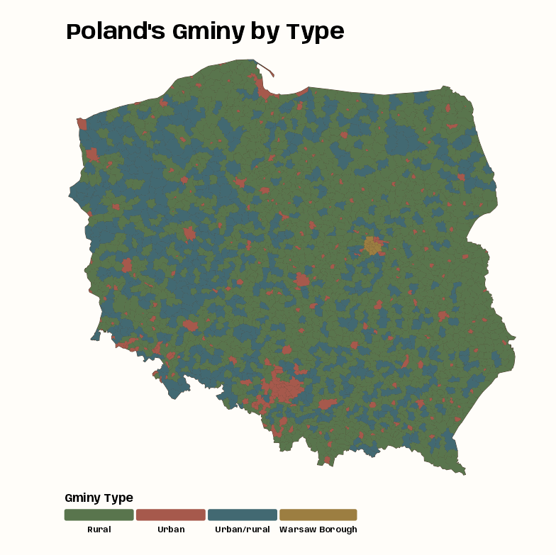{.lightbox width="532"}

  Polish county (gminy) types from Polish Presidential election 2015 data\
  The goal is to test whether gminy type neighbor combinations happen more often than one would expect by chance alone.

  ``` r
  library(dplyr); library(spdep); library(tmap)

  data(pol_pres15, package = "spDataLarge")

  pol_pres15 |> 
    count(types)
  #> Simple feature collection with 4 features and 2 fields
  #> Geometry type: GEOMETRY
  #> Dimension:     XY
  #> Bounding box:  xmin: 171677.6 ymin: 133223.7 xmax: 861882.2 ymax: 774774
  #> Projected CRS: ETRF2000-PL / CS92
  #>            types    n                       geometry
  #> 1          Rural 1563 MULTIPOLYGON (((282864 3248...
  #> 2          Urban  303 MULTIPOLYGON (((315888.7 27...
  #> 3    Urban/rural  611 MULTIPOLYGON (((244371.6 33...
  #> 4 Warsaw Borough   18 POLYGON ((631202.9 480068, ...

  tmap_options_reset()
  tmap_theme_notebook()

  notebook_colors <- unname(swatches::read_ase(here::here("palettes/Forest Floor.ase")))

  tm_shape(pol_pres15 |> select(types)) +
    tm_polygons(col = "#4A3728") +
    tm_fill(
      "types",
      fill.scale = tm_scale(values = notebook_colors[4:7]),
      fill.legend = tm_legend(
        title = "Gminy Type",
        orientation = "landscape",
        position = tm_pos_out("center", "bottom")
      )
    ) +
    tm_title(
      "Poland's Gminy by Type",
      size = 2, fontface = "bold"
    )
  ```

  - There are 4 types of gminy and they are imbalanced.
  - Warsaw is in the central east and most of rural areas seem to be in the northeast.
  - I think the large urban area in the south is Katowice which is between Wroclaw and Krakow. Interestingly, according to Wiki, Katowice has about 400K fewer people than Krakow or Wroclaw which are second and third in population respectively. Evidently the Katowice area is more urbanized though. ¯\\\_(ツ)\_/¯

  ## Spatial Weights

  ``` r
  nb_poly_pol <- pol_pres15 |> poly2nb(queen = TRUE)
  lw_b_poly_pol <- nb_poly_pol |> nb2listw(style = "B")


  # polygon centroids
  coords_pol <- pol_pres15 |> 
    st_geometry() |> 
    st_centroid(of_largest_polygon = TRUE)

  # 18300 determined the distance for a connected graph
  nb_d183_pol <- coords_pol |> 
    dnearneigh(0, 18300) 

  wgts_idw_d183 <- nb_d183_pol|> 
    nbdists(coords_pol) |> 
    lapply(function(x) 1/(x/1000))  # in km

  lw_d183_idw_b_pol <- nb_d183_pol |> 
    nb2listw(glist = wgts_idw_d183, style = "B")
  ```

  - [nb_poly_pol]{.var-text} is the contiguity neighbors list with the queen specification. All pretty standard for polygon units. That neighbor list is used to create a binary (neighbor / not neighbor) spatial weights object ([lw_b_poly_pol]{.var-text}) which says that all neighbors of a gminy have equal weight.
  - [nb_d183_pol]{.var-text} is a distance-band neighbor list with a radius of 18,300 meters. So all gminy within that distance can be a potential neighbor.
    - See [Geospatial, Spatial Weights \>\> Neighbor Algorithms](geospatial-spatial-weights.qmd#sec-geo-swgt-nbalg){style="color: green"} \>\> Distance Neighbors for details on the method and how 18300 was chosen (or in the SDS book)
    - Inverse distance weights are constructed by taking the lengths of edges, changing units to avoid most weights being too large or small (here from meter to kilometer), and taking the inverse. ([source](https://r-spatial.org/book/14-Areal.html#weights-specification))
      - I think this can also be done with `nb2listwdist` which has the option to specify IDW style weights (See [Geospatial, Spatial Weights \>\> Spatial Weights](geospatial-spatial-weights.qmd#sec-geo-swgt-swts){style="color: green"})
    - Binary weights are created, but then I guess for the neighbors (1s), their weights are tranformed to IDW weights.

  ## Join Count Tests

  ``` r
  joincount.multi(pol_pres15$types, listw = lw_b_poly_pol) |>
    as.data.frame() |>
    tibble::rownames_to_column("type") |>
    mutate(
      p_value = 2 * pnorm(abs(`z-value`), lower.tail = FALSE),
      p_value_adj = p.adjust(p_value, method = "BY")
    ) |>
    arrange(desc(p_value_adj)) |> 
    ebtools::fmt_hl(c(p_value, p_value_adj), emphatic = TRUE)
  #>                               type Joincount     Expected     Variance     z-value   p_value p_value_adj
  #> 1                      Urban:Urban       110  104.7185351   93.2993687   0.5467831    0.5845           1
  #> 2             Warsaw Borough:Urban         9   12.4830042   11.7580036  -1.0157509    0.3097           1
  #> 3       Warsaw Borough:Urban/rural         8   25.1719985   22.3538161  -3.6319930 0.0002812    0.001038
  #> 4                Urban/rural:Rural      2359 2185.7685388 1267.1313345   4.8664913  1.14e-06    4.72e-06
  #> 5             Warsaw Borough:Rural        12   64.3925265   46.4599085  -7.6865272  1.51e-14    7.17e-14
  #> 6                      Rural:Rural      3087 2793.9201781 1126.5342033   8.7320000  2.50e-18    1.39e-17
  #> 7          Urban/rural:Urban/rural       656  426.5255306  331.7590322  12.5986206  2.15e-36    1.43e-35
  #> 8                Urban/rural:Urban       171  423.7286419  352.1895385 -13.4668567  2.45e-41    2.04e-40
  #> 9                             Jtot      3227 3795.4855729 1496.3984180 -14.6958878  6.85e-49    7.58e-48
  #> 10                     Urban:Rural       668 1083.9408630  708.2086432 -15.6297121  4.57e-55    7.59e-54
  #> 11   Warsaw Borough:Warsaw Borough        41    0.3501833    0.3474277  68.9646203         0           0


  joincount.multi(pol_pres15$types, listw = lw_d183_idw_b_pol) |> 
    as.data.frame() |>
    tibble::rownames_to_column("type") |>
    mutate(
      p_value = 2 * pnorm(abs(`z-value`), lower.tail = FALSE),
      p_value_adj = p.adjust(p_value, method = "BY")
    ) |>
    arrange(desc(p_value_adj)) |> 
    ebtools::fmt_hl(c(p_value, p_value_adj), emphatic = TRUE)
  #>                               type  Joincount     Expected     Variance      z-value  p_value p_value_adj
  #> 1       Warsaw Borough:Urban/rural   3.267639   3.25448276  0.551796957   0.01771153   0.9859           1
  #> 2                             Jtot 481.832119 490.71758713 41.570110157  -1.37812859   0.1682      0.5586
  #> 3             Warsaw Borough:Rural   5.650239   8.32529715  1.725992663  -2.03616849  0.04173       0.154
  #> 4                      Rural:Rural 346.476174 361.22539320 49.314210235  -2.10030797   0.0357      0.1482
  #> 5          Urban/rural:Urban/rural  46.497610  55.14540240  9.613381390  -2.78911983 0.005285     0.02508
  #> 6                Urban/rural:Urban  36.498919  54.78379321  8.858649324  -6.14339187 8.08e-10    4.47e-09
  #> 7                Urban/rural:Rural 225.173194 282.59758674 35.891709966  -9.58515926 9.23e-22    6.13e-21
  #> 8                      Urban:Urban  29.044510  13.53903891  2.228091144  10.38767831 2.82e-25    2.34e-24
  #> 9                      Urban:Rural 202.062080 140.14250210 23.644875577  12.73384239 3.83e-37    4.25e-36
  #> 10            Warsaw Borough:Urban   9.180046   1.61392517  0.253919428  15.01499993 5.86e-51    9.73e-50
  #> 11   Warsaw Borough:Warsaw Borough  16.822284   0.04527513  0.006608328 206.38053024        0           0
  ```

  - Not going to go through each significant z-value and interpret (see [Join Count Test](association-spatial.qmd#sec-assoc-spat-global-jct){style="color: green"} section), but I'll note that there are substantial z-value changes when using an inverse distance weights, (closer centroids are up-weighted relatively strongly)
  - [Rural:Rural]{.var-text} and [Warsaw Borough:Rural]{.var-text} go to insignificant w/the p-value adjustment
  - [Jtot]{.var-text} goes from highly significant to very not significant
  - [Urban:Urban]{.var-text} goes from very not significant to very significant
  - [Warsaw Borough:Urban]{.var-text} goes from not significant to very significant
  :::

- [Example 2]{.ribbon-highlight}: Moran's I

  ::: panel-tabset
  ## Data and Set-Up

  Polish Presidential election 2015 data by gminy and Warsaw borough areal units The goal is to test whether spatial autocorrelation across the whole study area due to voter turnout proportion can be detected or not.

  <Details>

  <Summary>Code</Summary>

  ``` r
  library(dplyr); library(spdep); library(tmap)

  data(pol_pres15, package = "spDataLarge")
  pol_pres15 <- pol_pres15 |> 
    janitor::clean_names()

  glimpse(pol_pres15)
  #> Rows: 2,495
  #> Columns: 65
  #> $ teryt                                                 <chr> "020101", "020102", "020103", "020104"…
  #> $ teryt0                                                <chr> "020101", "020102", "020103", "020104"…
  #> $ name0                                                 <chr> "Miasto Bolesławiec", "Bolesławiec - g…
  #> $ name                                                  <chr> "BOLESŁAWIEC", "BOLESŁAWIEC", "GROMADK…
  #> $ gm0                                                   <chr> "020101", "020102", "020103", "020104"…
  #> $ types                                                 <fct> Urban, Rural, Rural, Urban/rural, Rura…
  #> $ i_entitled_to_vote                                    <int> 31535, 10951, 4539, 11934, 5467, 6700,…
  #> $ i_voting_papers_received                              <int> 27140, 9390, 3907, 10283, 4710, 5706, …
  #> $ i_unused_voting_papers                                <int> 11991, 4614, 1943, 5779, 2473, 3080, 1…
  #> $ i_voting_papers_issued_to_voters                      <int> 15149, 4776, 1964, 4504, 2237, 2626, 1…
  #> $ i_voters_voting_by_proxy                              <int> 8, 0, 0, 0, 0, 2, 7, 5, 5, 8, 0, 0, 3,…
  #> $ i_voters_voting_by_declaration                        <int> 79, 17, 8, 7, 26, 7, 35, 38, 19, 16, 1…
  #> $ i_voters_sent_postal_voting_package                   <int> 7, 1, 1, 0, 0, 2, 5, 3, 0, 0, 2, 0, 0,…
  #> $ i_postal_voting_envelopes_received                    <int> 7, 1, 1, 0, 0, 2, 5, 3, 0, 0, 2, 0, 0,…
  #> $ i_pve_of_which_no_declaration                         <int> 0, 0, 0, 0, 0, 0, 0, 0, 0, 0, 2, 0, 0,…
  #> $ i_pve_of_which_no_signature                           <int> 0, 0, 0, 0, 0, 0, 0, 0, 0, 0, 0, 0, 0,…
  #> $ i_pve_of_which_no_voting_envelope                     <int> 0, 0, 0, 0, 0, 0, 0, 0, 0, 0, 0, 0, 0,…
  #> $ i_pve_of_which_voting_envelope_open                   <int> 0, 0, 0, 0, 0, 0, 0, 0, 0, 0, 0, 0, 0,…
  #> $ i_voting_envelopes_placed_in_ballot_box               <int> 7, 1, 1, 0, 0, 2, 5, 3, 0, 0, 0, 0, 0,…
  #> $ i_voting_papers_taken_from_ballot_box                 <int> 15152, 4777, 1965, 4504, 2237, 2628, 1…
  #> $ i_of_which_voting_papers_taken_from_voting_envelopes  <int> 7, 1, 1, 0, 0, 2, 5, 3, 0, 0, 0, 0, 0,…
  #> $ i_invalid_voting_papers                               <int> 3, 0, 0, 0, 0, 0, 3, 0, 0, 0, 0, 0, 0,…
  #> $ i_valid_voting_papers                                 <int> 15149, 4777, 1965, 4504, 2237, 2628, 1…
  #> $ i_invalid_votes                                       <int> 110, 26, 22, 41, 14, 46, 79, 128, 27, …
  #> $ i_valid_votes                                         <int> 15039, 4751, 1943, 4463, 2223, 2582, 1…
  #> $ i_candidates_total                                    <int> 15039, 4751, 1943, 4463, 2223, 2582, 1…
  #> $ i_grzegorz_michal_braun                               <int> 152, 53, 13, 41, 17, 19, 57, 69, 27, 6…
  #> $ i_andrzej_sebastian_duda                              <int> 4018, 1489, 776, 1680, 570, 916, 3266,…
  #> $ i_adam_sebastian_jarubas                              <int> 114, 59, 16, 50, 28, 29, 77, 97, 31, 2…
  #> $ i_bronislaw_maria_komorowski                          <int> 6059, 1678, 669, 1289, 803, 881, 4264,…
  #> $ i_janusz_ryszard_korwin_mikke                         <int> 576, 180, 50, 152, 85, 88, 341, 372, 1…
  #> $ i_marian_janusz_kowalski                              <int> 68, 21, 4, 39, 14, 5, 48, 72, 15, 15, …
  #> $ i_pawel_piotr_kukiz                                   <int> 3336, 1076, 338, 1074, 580, 538, 2530,…
  #> $ i_magdalena_agnieszka_ogorek                          <int> 405, 121, 45, 80, 76, 59, 253, 390, 63…
  #> $ i_janusz_marian_palikot                               <int> 224, 50, 19, 38, 38, 40, 173, 197, 49,…
  #> $ i_pawel_jan_tanajno                                   <int> 19, 11, 1, 5, 2, 1, 10, 17, 7, 4, 11, …
  #> $ i_jacek_wilk                                          <int> 68, 13, 12, 15, 10, 6, 38, 40, 11, 9, …
  #> $ ii_entitled_to_vote                                   <int> 31458, 10950, 4514, 11930, 5445, 6691,…
  #> $ ii_voting_papers_received                             <int> 27237, 9399, 3900, 10270, 4700, 5698, …
  #> $ ii_unused_voting_papers                               <int> 10700, 3947, 1655, 5220, 2239, 2760, 9…
  #> $ ii_voting_papers_issued_to_voters                     <int> 16537, 5452, 2245, 5050, 2461, 2938, 1…
  #> $ ii_voters_voting_by_proxy                             <int> 9, 0, 2, 1, 1, 3, 9, 9, 5, 8, 0, 0, 5,…
  #> $ ii_voters_voting_by_declaration                       <int> 172, 65, 18, 30, 28, 38, 101, 86, 39, …
  #> $ ii_voters_sent_postal_voting_package                  <int> 12, 1, 1, 1, 0, 0, 6, 1, 0, 2, 3, 0, 0…
  #> $ ii_postal_voting_envelopes_received                   <int> 10, 1, 1, 0, 0, 0, 5, 1, 0, 2, 3, 0, 0…
  #> $ ii_pve_of_which_no_declaration                        <int> 0, 0, 0, 0, 0, 0, 1, 0, 0, 0, 0, 0, 0,…
  #> $ ii_pve_of_which_no_signature                          <int> 0, 0, 0, 0, 0, 0, 0, 0, 0, 0, 0, 0, 0,…
  #> $ ii_pve_of_which_no_voting_envelope                    <int> 0, 0, 0, 0, 0, 0, 0, 0, 0, 0, 0, 0, 0,…
  #> $ ii_pve_of_which_voting_envelope_open                  <int> 0, 0, 0, 0, 0, 0, 0, 0, 0, 0, 0, 0, 0,…
  #> $ ii_voting_envelopes_placed_in_ballot_box              <int> 10, 1, 1, 0, 0, 0, 4, 1, 0, 2, 3, 0, 0…
  #> $ ii_voting_papers_taken_from_ballot_box                <int> 16544, 5453, 2246, 5050, 2461, 2938, 1…
  #> $ ii_of_which_voting_papers_taken_from_voting_envelopes <int> 10, 1, 1, 0, 0, 0, 4, 1, 0, 2, 3, 0, 0…
  #> $ ii_invalid_voting_papers                              <int> 0, 0, 0, 0, 0, 0, 1, 0, 0, 0, 0, 0, 0,…
  #> $ ii_valid_voting_papers                                <int> 16544, 5453, 2246, 5050, 2461, 2938, 1…
  #> $ ii_invalid_votes                                      <int> 264, 67, 25, 75, 35, 47, 160, 178, 48,…
  #> $ ii_valid_votes                                        <int> 16280, 5386, 2221, 4975, 2426, 2891, 1…
  #> $ ii_andrzej_sebastian_duda                             <int> 6780, 2669, 1285, 2775, 1063, 1478, 52…
  #> $ ii_bronislaw_maria_komorowski                         <int> 9500, 2717, 936, 2200, 1363, 1413, 678…
  #> $ geometry                                              <MULTIPOLYGON [m]> MULTIPOLYGON (((261089.5 …
  #> $ i_turnout                                             <dbl> 0.4768987, 0.4338417, 0.4280679, 0.373…
  #> $ ii_turnout                                            <dbl> 0.5175154, 0.4918721, 0.4920248, 0.417…
  #> $ i_duda_share                                          <dbl> 0.2671720, 0.3134077, 0.3993824, 0.376…
  #> $ ii_duda_share                                         <dbl> 0.4164619, 0.4955440, 0.5785682, 0.557…
  #> $ i_komorowski_share                                    <dbl> 0.4028858, 0.3531888, 0.3443129, 0.288…
  #> $ II_Komorowski_share                                   <dbl> 0.5835381, 0.5044560, 0.4214318, 0.442…

  # first-round turnout proportions
  iturnout <- pol_pres15 |> 
    st_drop_geometry() |> 
    pull(i_turnout)

  # neighbor list and spatial weights
  nb_poly_pol <- pol_pres15 |> poly2nb(queen = TRUE)
  lw_b_poly_pol <- nb_poly_pol |> nb2listw(style = "B")
  ```

  </Details>

  - [iturnout]{.var-text} is the proportions (voters/total eligible-to-vote) of first-round turnout
  - Binary spatial weights are used which means the test will treat each neighbor of a gminy equally.

  ## Moran's I

  ``` r

  moran_lookup <- c(
    morans_i = "estimate1",
    expectation = "estimate2",
    variance = "estimate3",
    std.deviate = "statistic"
  )

  iturnout |> 
    moran.test(listw = lw_b_poly_pol) |>
    broom::tidy() |> 
    rename(any_of(moran_lookup)) |> 
    relocate(method, alternative, everything())
  #> # A tibble: 1 × 7
  #>   method                           alternative morans_i expectation variance std.deviate p.value
  #>   <chr>                            <chr>          <dbl>       <dbl>    <dbl>       <dbl>   <dbl>
  #> 1 Moran I test under randomisation greater        0.691   -0.000401 0.000140        58.5       0

  moran_mc_lookup <- c(
    morans_i = "statistic",
    observed_rank = "parameter"
  )

  set.seed(2026)
  iturnout |> 
    moran.mc(listw = lw_b_poly_pol, nsim = 999) |> 
    broom::tidy() |> 
    rename(any_of(moran_mc_lookup)) |> 
    relocate(method, alternative, everything())  
  #> # A tibble: 1 × 5
  #>   method                            alternative morans_i p.value observed_rank
  #>   <chr>                             <chr>          <dbl>   <dbl>         <dbl>
  #> 1 Monte-Carlo simulation of Moran I greater        0.691   0.001          1000
  ```

  - The p-value for the analytical test is 0 and for the bootstrap, it's 0.001. So global spatial autocorrelation is detected.
  - The I is about the expected value, so it's positive spatial autocorrelation

  ## Moran Plot

  ###### Moran Plot

  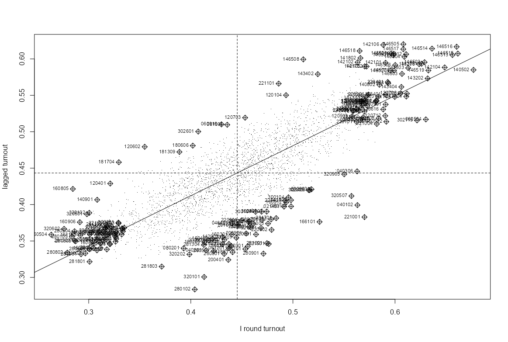{.lightbox width="532"}

  ``` r
  infl_turnout_pol <- moran.plot(
    iturnout,
    listw = lw_w_pol, 
    labels = pol_pres15$TERYT,
    cex = 1, 
    pch = ".", 
    xlab = "I round turnout",
    ylab = "lagged turnout"
  )
  ```

  - Relatively fewer influential observations in the high-low (lagged vs orig) and low-high quadrants.

  ###### Influential Locations

  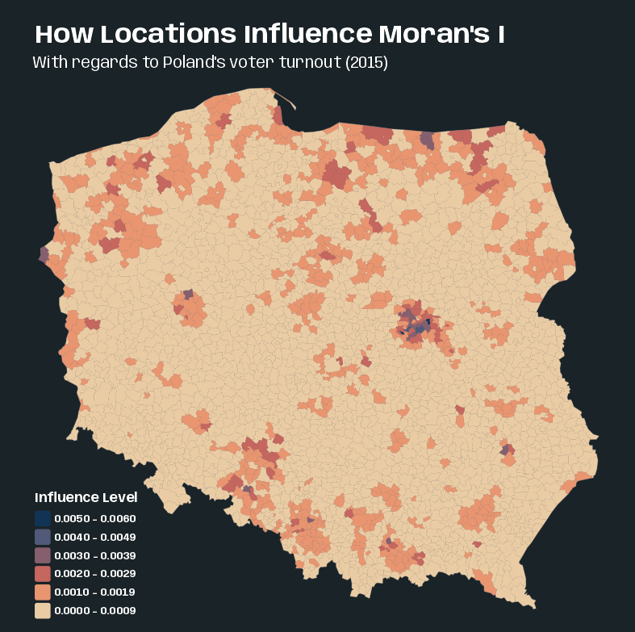{width="532"}

  <Details>

  <Summary>Code</Summary>

  ``` r
  pol_pres15$hat_value <- infl_turnout_pol$hat

  tmap_options_reset()
  tmap_theme_slate()

  tm_shape(pol_pres15) +
    tm_polygons(col = "grey40") +
    tm_fill(
      "hat_value",
      fill.scale = tm_scale(values = "-scico.lipari"),
      fill.legend = tm_legend(
        title = "Influence Level",
        position = tm_pos_in(0.05, 0.27),
        reverse = TRUE
      )
    ) +
    tm_title(
      "How Locations Influence Moran's I",
      size = 2, fontface = "bold"
    ) +
    tm_title("With regards to Poland's voter turnout (2015)", size = 1.25)
  ```

  </Details>

  - Suggests that some edge entities exert more than proportional influence (perhaps because of row standardization), as do entities in or near larger urban areas.
  :::

## Local Measures {#sec-assoc-spat-local .unnumbered}

### Misc {#sec-assoc-spat-local-misc .unnumbered}

- Values of autocorrelation for each areal unit
  - Local metrics can suffer from multiple testing issues when the number of group units is large.
  - Local measures are likely to mislead users in the presence of global autocorrelation, and where the mean model is mis-specified in other ways.
- `LOSH.cs` and `LOSH.mc` perform Chi-square and Bootstrapping-based tests respectively for local spatial heteroscedasticity. Values of the measure greater than 1 indicate heightened local spatial heteroscedasticity ([Paper](https://www.researchgate.net/publication/227581869_Local_spatial_heteroscedasticity_LOSH))
  - The statistic may be used to identify boundaries of clusters and to describe the nature of heteroscedasticity within clusters, i.e. trends of homogeneity or heterogeneity in the neighborhood of a given observation
    - i.e. If heteroskedacity (p-value \< 0.05) is detected around an observation near a cluster/in a cluster $\rightarrow$ the local neighborhood is heterogeneous $\rightarrow$ that location is on the boundary of the cluster.
  - Results demonstrate that the bootstrap method can provide a more accurate approximation than the chi-square method
    - THE BOOTSTRAP METHOD (`LOSH.mc`) IS SLOW. (e.g. [nsim = 99]{.arg-text} took 17 min)
- "While the rejection of the null suggests the *absence* of (local) spatial randomness, *it cannot suggest the presence of a particular form of association*. Hence, the main purpose of these statistics is in a data exploration sense (see also the argument in Sokal, Oden, and Thompson 1998b)." (Anselin 2018, local geary c paper)
- These statistics only identify the *core or center* of a cluster. The cluster itself also includes the neighboring locations (as defined by the spatial weights)
- Standard approaches (`localmoran`, `localmoran_perm`) to the calculation of the standard deviates of local Moran’s I should be supplemented by numerical estimates such as the saddlepoint approximation (Tiefelsdorf 2002)
- Both the Local Moran $I_i$ and the Local $G_i$ statistic are heavily influenced by the weighted average of the neighbors, whereas the Local Geary $C_i$ measures squared difference. So, Local Moran and Local G identify the same clusters.
- All local permutation methods should be parallelizable (look for the [iseed]{.arg-text} argument) via [{parallel}]{style="color: #990000"}
  - Example:

    ``` r
    library(parallel)
    invisible(spdep::set.coresOption(max(detectCores()-1L, 1L)))
    ```

### Local Moran's I~i~ {#sec-assoc-spat-local-moran .unnumbered}

$$\begin{align}
&I_i = \frac{x_i - \bar x}{m_2} \sum_{j=1}^N w_{ij} (x_j - \bar x) \\
&\text{where} \;\; m_2 = \frac{\sum_{i=1}^N (x_i - \bar x)^2}{N}
\end{align}$$

- Moran's I is the sum of all $I_i s$ divided by sum of weights, $I = \frac{1}{S_0} \sum_{i=1}^N I_i$
- Notes from [The Importance of Null Hypotheses: Understanding Differences in Local Moran’s I~i~ under Heteroskedasticity (Sauer 2021)](https://onlinelibrary.wiley.com/doi/abs/10.1111/gean.12304)
- The false discovery rate (FDR) adjustment of p-values (e.g. BY) gives a better picture of *interesting* (used by Anselin instead of significant) clusters than no adjustment
- The type of null you choose will determine the type of spatial randomness and number of clusters you'll potentially detect
  - The **Conditional Null** asks: what if this site's value were fixed and everything around it were reshuffled?
    - Given that *this* location has *this* particular value, are its neighbors more similar to it than we'd expect by chance? e.g. a location has high degree of permanence like a natural feature (e.g. mountain) or a city center.
    - Fits naturally in disease surveillance or crime analysis, where a particular neighborhood's characteristics are somewhat fixed and you're asking whether clustering around it is unusual
    - Tends to find more significant clusters, which matters in public health contexts where missing a real cluster has serious consequences
  - The **Total Randomization Null** asks: what if all values were randomly reshuffled across the map?
    - Seems more in line with how point patterns are assessed. All locations are treated as equally to change coordinates.
    - Also more likely to detect fewer clusters which may be useful if False Discovery is a primary concern.
- $Z(I_i)$ estimates are inflated in the presence of heteroskedasticity (see $\text{LOSH} (H_i)$ in [Misc](association-spatial.qmd#sec-assoc-spat-local-misc){style="color: green"}) for either choice of null
  - This is like getting inflated z-scores, so it'll result in more false positives.
- `localmoran` and `localmoran_perm`
  - [conditional]{.arg-text}: [TRUE]{.arg-text} (default) says the expectation and variance are calculated using the Conditional Randomization Null
    - [FALSE]{.arg-text} says expectation and variance are calculated using the Total Randomization Null
  - [iseed]{.arg-text}: Permits the setting of a seed for the random number generator across the compute nodes.
    - i.e. if you run `localmoran_perm` in parallel (see example), then as long as you use the same number of workers, setting this will make the results reproducible
  - [mlvar]{.arg-text} (default [TRUE]{.arg-text}) and [adjust.x]{.arg-text} (default [FALSE]{.arg-text}) permit matching with other implementations
    - These were necessary for their comparison paper. I doubt I'll need these, but the doc description didn't have this information. So, I'm including it here.
  - `localmoran_perm` p-values:
    - [Pr(z != E(Ii))]{.var-text}: Calculated from the standard deviate using permutation sample means and standard deviations
    - [Pr(z != E(Ii)) Sim]{.var-text}: Calculated by finding the rank of the observed $I_i$. Then among the rank-based simulated values, the probability value is looked-up for the uniform distribution taking the alternative choice into account.
      - Useful when the variable under analysis may not be normally distributed.
    - [Pr(Folded) Sim]{.var-text}: It's a two-sided ranked p-value which is calculated by "folding" the distribution at 0.5.
      - Often the approach for a two-sided p-value is to double the one-sided p-value, but that can produce p-values greater than 1 when the observed statistic is near the center of the distribution.
      - This method is equivalent to taking `min(upper tail, lower tail)` and computing the p-value from that, which is a standard way to construct a two-sided permutation p-value without doubling.
- Other flavors
  - `localmoran.exact` - Exact method for Local Moran's I~i~
    - [Example]{.ribbon-highlight}: ([source](https://r-spatial.org/book/15-Measures.html#local-morans-i_i) at the end)

      ``` r
      library(spdep)
      data(pol_pres15, package = "spDataLarge")

      nb_q <- pol_pres15 |> poly2nb(queen = TRUE)

      lm_types |> localmoran.exact(
        nb = nb_q, 
        style = "W",
        alternative = "two.sided", 
        useTP = TRUE, 
        truncErr = 1e-8
      )
      ```
  - `localmoran.sad` - Saddlepoint Approximation ([Paper](https://onlinelibrary.wiley.com/doi/10.1111/j.1538-4632.2002.tb01084.x))
    - It's an approximation of an exact method, but its roughly one hundred times faster than the numerical integration of the classic exact method.
    - The conventional approach to estimating Moran's I is either to assume the statistic follows an approximate normal distribution (using its expectation and variance), or to rely on simulation experiments that randomize residual locations or assume a specific error structure.
    - The saddlepoint approximation outperforms other approximation methods with respect to its accuracy and computational costs. In addition, only the saddlepoint approximation is capable of handling, in analytical terms, reference distributions of Moran's I that are subject to significant underlying spatial processes.
    - Local Moran's $I_i$ is *not* asymptotically normally distributed but instead deviates more and more from the normal distribution as the number of spatial objects increases, because the kurtosis increases rather than shrinks.
    - if the regression residuals are heteroskedastic, the numerator and denominator of Moran's I are no longer independent, causing the regular moment expressions to break down
    - The chief advantage of the saddlepoint approximation is that it takes a fitted linear model rather than simply a numerical variable, so the residuals are analyzed. Using linear models allows for richer mean models.
    - Adding weights to the linear model can down-weight small units of observation
    - Can take either a [lm]{.arg-text} or [sarlm]{.arg-text} object as input
      - If the model object is of class [lm]{.arg-text}, global independence is assumed
      - If the model object is of class [sarlm]{.arg-text}, global dependence is assumed to be represented by the spatial parameter of that model.
        - [sarlm]{.arg-text} is likely an econometric spatial regression model from [{spatialreg}]{style="color: #990000"} (see [Regression, Spatial \>\> Econometric](regression-spatial.qmd#sec-reg-spat-econ){style="color: green"})

### Local Geary's C~i~ {#sec-assoc-spat-local-geary .unnumbered}

- Notes from A Local Indicator of Multivariate Spatial Association: Extending Geary’s c (Anselin 2018) (R \>\> Documents \>\> Geospatial)

  - Also shows how (no code) to use PCA with these statistics to handle multivariate data. Multivariate analysis can bring out patterns that are not obvious in its univariate counterparts.

- For using for the multivariate case, see

  - Anselin examines the multivariate case in his 2018 paper that's referenced above
  - [SDS, Ch.15.3, Local Geary's C](https://r-spatial.org/book/15-Measures.html#local-gearys-c_i)

- Equation

  $$\begin{align}
  &C_i = \frac{1}{m_2} \sum_j w_{ij}(x_i - xj)^2\\
  &\text{where} \;\; m_2 = \frac{\sum_i (x_i - \bar x)^2}{N-1}
  \end{align}$$

  - Geary's C is $C=\sum_i C_i/2W$

- Guidelines

  - $C \lt \mathbb{E}(C)$ $\rightarrow$ A small difference between an observation and its neighbors $\rightarrow$ Positive spatial autocorrelation.
    - Could be a cluster of low values or a cluster of high values
    - Could also be the result from two data points that span the mean (e.g., one above the mean and one below), but that are very close together in value
  - $C \gt \mathbb{E}(C)$ $\rightarrow$ A large differences between an observation and its neighbors $\rightarrow$ Negative spatial autocorrelation

- `localC` and `localC_perm`

  - [x]{.arg-text}: A numeric vector for the univariate case; list or matrix for the multivariate case
    - For lists, each element must be a numeric vector of the same length and of the same length as the neighbors in [listw]{.arg-text}
    - For matrices, the number of rows must be the same as the length of the neighbors in [listw]{.arg-text}
  - The conditional permutation approach consists of holding the tuple of values observed at $i$ fixed, and computing the statistic for $m$ permutations ([nsim]{.arg-text}) of the remaining tuples over the other locations.

### Local Getis-Ord G~i~ {#sec-assoc-spat-local-ordg .unnumbered}

- Typically, results for the Local Moran $I_i$ and the Local $G_i$ statistics will match quite closely, except for some outliers.
- `localG` and `localG.perm`
  - [include.self]{.arg-text}: Says insert self-neighbors into the neighbor object (This statistic is symbolized as $G_i^*$ in the literature)
    - Guessing this is useful if you don't have a connected graph or maybe pair(s) of nodes with just each other as neighbors
    - Print the neighbor list to see if any “disjoint connected subgraphs” exist or use `n.comp.nb`
  - [return_internals = TRUE]{.arg-text}: Says return the observed and expected values of local G with their analytical variances
  - Both flavors shown to produce similar results ([source](https://r-spatial.org/book/15-Measures.html#local-getis-ord-g_i))

### Hotspot Classifications {#sec-assoc-spat-local-hotspot .unnumbered}

- Unfortunately all three methods have different sets of hotspot classifciations 😒.
- For some, the classification category is determined by the value of an observation's statistic and where that observation falls in the Moran Plot quadrants. They're different, because sometimes the interpretations of the statistic values don't always map neatly onto the Moran
- Along with these classification rules, the statistic must have an adjusted p-value lower than a specified cutoff (e.g. 0.005)
- $G_i^*$ refers to the statistic allowing itself to used as it's neighbor.
- [Local Moran's $I_i$]{.underline}

| Classification | Definition | Moran Plot Quadrant | $I_i$ vs $\mathbb{E}[I_i]$ |
|------------------|------------------|------------------|------------------|
| High-High | Polygon and its neighbors have similarly high values; cluster of high values | High-High (above mean, spatial lag above mean) | $I_i > \mathbb{E}[I_i]$; positive spatial autocorrelation |
| Low-Low | Polygon and its neighbors have similarly low values; cluster of low values | Low-Low (below mean, spatial lag below mean) | $I_i > \mathbb{E}[I_i]$; positive spatial autocorrelation |
| High-Low | Polygon has a high value surrounded primarily by low-value neighbors; spatial outlier | High-Low (above mean, spatial lag below mean) | $I_i < \mathbb{E}[I_i]$; negative spatial autocorrelation |
| Low-High | Polygon has a low value surrounded primarily by high-value neighbors; spatial outlier | Low-High (below mean, spatial lag above mean) | $I_i < \mathbb{E}[I_i]$; negative spatial autocorrelation |

- [Local Geary's $c_i$]{.underline}

| Classification | Definition | Moran Plot Quadrant | $c_i$ vs $\mathbb{E}[c_i]$ |
|------------------|------------------|------------------|------------------|
| High-High | Polygon and its neighbors have similarly high values; cluster of high values | High-High (above mean, spatial lag above mean) | $c_i < \mathbb{E}[c_i]$; positive spatial autocorrelation |
| Low-Low | Polygon and its neighbors have similarly low values; cluster of low values | Low-Low (below mean, spatial lag below mean) | $c_i < \mathbb{E}[c_i]$; positive spatial autocorrelation |
| Other Positive | Polygon is similar to its neighbors but its and its neighborhood values are indeterminate | Falls into High-Low or Low-High, but doesn't fit with being interpreted as such | $c_i < \mathbb{E}[c_i]$; positive spatial autocorrelation |
| Negative | Polygon is dissimilar from its neighbors but its and its neighborhood values are indeterminate | Should be a High-Low or Low-High situation but this is not possible to determine with the Moran Plot | $c_i > \mathbb{E}[c_i]$; negative spatial autocorrelation |

- [Local Getis-Ord $G_i^*$]{.underline}

| Classification | Definition | Moran Plot Quadrant | $G_i^*$ vs $\mathbb{E}[G_i^*]$ |
|------------------|------------------|------------------|------------------|
| High | Polygon and its neighbors have high values; cluster of high values | Doesn't use the Moran plot; Higher than mean of input variable | $G_i^* > \mathbb{E}[G_i^*]$; positive spatial autocorrelation |
| Low | Polygon and its neighbors have low values; cluster of low values | Doesn't use the Moran plot; Lower than mean of input variable | $G_i^* < \mathbb{E}[G_i^*]$; positive spatial autocorrelation |

### Examples {#sec-assoc-spat-local-ex .unnumbered}

- [Example 1]{.ribbon-highlight}: Local Moran's I~i~ (Analytical and Permutation-based)

  ::: panel-tabset
  ## Data and Set-Up

  Polish Presidential election 2015 data by gminy and Warsaw borough areal units

  The goal is to find likely spatial cluster centers of similar voter turnout.

  <Details>

  <Summary>Code</Summary>

  ``` r
  library(dplyr); library(spdep); library(tmap)

  data(pol_pres15, package = "spDataLarge")
  pol_pres15 <- pol_pres15 |> 
    janitor::clean_names()

  glimpse(pol_pres15)
  #> Rows: 2,495
  #> Columns: 65
  #> $ teryt                                                 <chr> "020101", "020102", "020103", "020104"…
  #> $ teryt0                                                <chr> "020101", "020102", "020103", "020104"…
  #> $ name0                                                 <chr> "Miasto Bolesławiec", "Bolesławiec - g…
  #> $ name                                                  <chr> "BOLESŁAWIEC", "BOLESŁAWIEC", "GROMADK…
  #> $ gm0                                                   <chr> "020101", "020102", "020103", "020104"…
  #> $ types                                                 <fct> Urban, Rural, Rural, Urban/rural, Rura…
  #> $ i_entitled_to_vote                                    <int> 31535, 10951, 4539, 11934, 5467, 6700,…
  #> $ i_voting_papers_received                              <int> 27140, 9390, 3907, 10283, 4710, 5706, …
  #> $ i_unused_voting_papers                                <int> 11991, 4614, 1943, 5779, 2473, 3080, 1…
  #> $ i_voting_papers_issued_to_voters                      <int> 15149, 4776, 1964, 4504, 2237, 2626, 1…
  #> $ i_voters_voting_by_proxy                              <int> 8, 0, 0, 0, 0, 2, 7, 5, 5, 8, 0, 0, 3,…
  #> $ i_voters_voting_by_declaration                        <int> 79, 17, 8, 7, 26, 7, 35, 38, 19, 16, 1…
  #> $ i_voters_sent_postal_voting_package                   <int> 7, 1, 1, 0, 0, 2, 5, 3, 0, 0, 2, 0, 0,…
  #> $ i_postal_voting_envelopes_received                    <int> 7, 1, 1, 0, 0, 2, 5, 3, 0, 0, 2, 0, 0,…
  #> $ i_pve_of_which_no_declaration                         <int> 0, 0, 0, 0, 0, 0, 0, 0, 0, 0, 2, 0, 0,…
  #> $ i_pve_of_which_no_signature                           <int> 0, 0, 0, 0, 0, 0, 0, 0, 0, 0, 0, 0, 0,…
  #> $ i_pve_of_which_no_voting_envelope                     <int> 0, 0, 0, 0, 0, 0, 0, 0, 0, 0, 0, 0, 0,…
  #> $ i_pve_of_which_voting_envelope_open                   <int> 0, 0, 0, 0, 0, 0, 0, 0, 0, 0, 0, 0, 0,…
  #> $ i_voting_envelopes_placed_in_ballot_box               <int> 7, 1, 1, 0, 0, 2, 5, 3, 0, 0, 0, 0, 0,…
  #> $ i_voting_papers_taken_from_ballot_box                 <int> 15152, 4777, 1965, 4504, 2237, 2628, 1…
  #> $ i_of_which_voting_papers_taken_from_voting_envelopes  <int> 7, 1, 1, 0, 0, 2, 5, 3, 0, 0, 0, 0, 0,…
  #> $ i_invalid_voting_papers                               <int> 3, 0, 0, 0, 0, 0, 3, 0, 0, 0, 0, 0, 0,…
  #> $ i_valid_voting_papers                                 <int> 15149, 4777, 1965, 4504, 2237, 2628, 1…
  #> $ i_invalid_votes                                       <int> 110, 26, 22, 41, 14, 46, 79, 128, 27, …
  #> $ i_valid_votes                                         <int> 15039, 4751, 1943, 4463, 2223, 2582, 1…
  #> $ i_candidates_total                                    <int> 15039, 4751, 1943, 4463, 2223, 2582, 1…
  #> $ i_grzegorz_michal_braun                               <int> 152, 53, 13, 41, 17, 19, 57, 69, 27, 6…
  #> $ i_andrzej_sebastian_duda                              <int> 4018, 1489, 776, 1680, 570, 916, 3266,…
  #> $ i_adam_sebastian_jarubas                              <int> 114, 59, 16, 50, 28, 29, 77, 97, 31, 2…
  #> $ i_bronislaw_maria_komorowski                          <int> 6059, 1678, 669, 1289, 803, 881, 4264,…
  #> $ i_janusz_ryszard_korwin_mikke                         <int> 576, 180, 50, 152, 85, 88, 341, 372, 1…
  #> $ i_marian_janusz_kowalski                              <int> 68, 21, 4, 39, 14, 5, 48, 72, 15, 15, …
  #> $ i_pawel_piotr_kukiz                                   <int> 3336, 1076, 338, 1074, 580, 538, 2530,…
  #> $ i_magdalena_agnieszka_ogorek                          <int> 405, 121, 45, 80, 76, 59, 253, 390, 63…
  #> $ i_janusz_marian_palikot                               <int> 224, 50, 19, 38, 38, 40, 173, 197, 49,…
  #> $ i_pawel_jan_tanajno                                   <int> 19, 11, 1, 5, 2, 1, 10, 17, 7, 4, 11, …
  #> $ i_jacek_wilk                                          <int> 68, 13, 12, 15, 10, 6, 38, 40, 11, 9, …
  #> $ ii_entitled_to_vote                                   <int> 31458, 10950, 4514, 11930, 5445, 6691,…
  #> $ ii_voting_papers_received                             <int> 27237, 9399, 3900, 10270, 4700, 5698, …
  #> $ ii_unused_voting_papers                               <int> 10700, 3947, 1655, 5220, 2239, 2760, 9…
  #> $ ii_voting_papers_issued_to_voters                     <int> 16537, 5452, 2245, 5050, 2461, 2938, 1…
  #> $ ii_voters_voting_by_proxy                             <int> 9, 0, 2, 1, 1, 3, 9, 9, 5, 8, 0, 0, 5,…
  #> $ ii_voters_voting_by_declaration                       <int> 172, 65, 18, 30, 28, 38, 101, 86, 39, …
  #> $ ii_voters_sent_postal_voting_package                  <int> 12, 1, 1, 1, 0, 0, 6, 1, 0, 2, 3, 0, 0…
  #> $ ii_postal_voting_envelopes_received                   <int> 10, 1, 1, 0, 0, 0, 5, 1, 0, 2, 3, 0, 0…
  #> $ ii_pve_of_which_no_declaration                        <int> 0, 0, 0, 0, 0, 0, 1, 0, 0, 0, 0, 0, 0,…
  #> $ ii_pve_of_which_no_signature                          <int> 0, 0, 0, 0, 0, 0, 0, 0, 0, 0, 0, 0, 0,…
  #> $ ii_pve_of_which_no_voting_envelope                    <int> 0, 0, 0, 0, 0, 0, 0, 0, 0, 0, 0, 0, 0,…
  #> $ ii_pve_of_which_voting_envelope_open                  <int> 0, 0, 0, 0, 0, 0, 0, 0, 0, 0, 0, 0, 0,…
  #> $ ii_voting_envelopes_placed_in_ballot_box              <int> 10, 1, 1, 0, 0, 0, 4, 1, 0, 2, 3, 0, 0…
  #> $ ii_voting_papers_taken_from_ballot_box                <int> 16544, 5453, 2246, 5050, 2461, 2938, 1…
  #> $ ii_of_which_voting_papers_taken_from_voting_envelopes <int> 10, 1, 1, 0, 0, 0, 4, 1, 0, 2, 3, 0, 0…
  #> $ ii_invalid_voting_papers                              <int> 0, 0, 0, 0, 0, 0, 1, 0, 0, 0, 0, 0, 0,…
  #> $ ii_valid_voting_papers                                <int> 16544, 5453, 2246, 5050, 2461, 2938, 1…
  #> $ ii_invalid_votes                                      <int> 264, 67, 25, 75, 35, 47, 160, 178, 48,…
  #> $ ii_valid_votes                                        <int> 16280, 5386, 2221, 4975, 2426, 2891, 1…
  #> $ ii_andrzej_sebastian_duda                             <int> 6780, 2669, 1285, 2775, 1063, 1478, 52…
  #> $ ii_bronislaw_maria_komorowski                         <int> 9500, 2717, 936, 2200, 1363, 1413, 678…
  #> $ geometry                                              <MULTIPOLYGON [m]> MULTIPOLYGON (((261089.5 …
  #> $ i_turnout                                             <dbl> 0.4768987, 0.4338417, 0.4280679, 0.373…
  #> $ ii_turnout                                            <dbl> 0.5175154, 0.4918721, 0.4920248, 0.417…
  #> $ i_duda_share                                          <dbl> 0.2671720, 0.3134077, 0.3993824, 0.376…
  #> $ ii_duda_share                                         <dbl> 0.4164619, 0.4955440, 0.5785682, 0.557…
  #> $ i_komorowski_share                                    <dbl> 0.4028858, 0.3531888, 0.3443129, 0.288…
  #> $ II_Komorowski_share                                   <dbl> 0.5835381, 0.5044560, 0.4214318, 0.442…

  iturnout <- pol_pres15 |> 
    st_drop_geometry() |> 
    pull(i_turnout)

  nb_poly_pol <- pol_pres15 |> poly2nb(queen = TRUE)
  lw_w_pol <- nb_poly_pol |>  
    nb2listw(style = "W")
  ```

  </Details>

  - [iturnout]{.var-text} is the proportions (voters/total eligible-to-vote) of first-round turnout
  - Row-standardized ([W]{.arg-text}) spatial weights are used. I see the queen condition specificed much more often than the rook. Not sure if there's a data-centric for either to be used in this case.

  ## Analytical Local Moran's I~i~

  Comparing p-value thresholds and adjustment methods on cluster counts.

  ``` r
  lmoran_iturn <- iturnout |> 
    localmoran(listw = lw_w_pol) 

  lmoran_lookup <- c(
    lmorans_i = "Ii",
    expectation = "E.Ii",
    variance = "Var.Ii",
    std.deviate = "Z.Ii",
    p_value = "Pr(z != E(Ii))"
  )

  # adjust p-values; add hotspot categories
  lmoran_iturn_adj <- lmoran_iturn |> 
    as.data.frame() |> 
    rename(any_of(lmoran_lookup)) |> 
    mutate(
      p_value = as.numeric(p_value),
      p_value_bh = p.adjust(p_value, "BH"),
      p_value_by = p.adjust(p_value, "BY"),
      p_value_bon = p.adjust(p_value, "bonferroni")
    ) |> 
    bind_cols(attr(lmoran_iturn, "quadr")) |> 
    rename_with(
      .fn =  ~ paste0(.x, "_quadr"),
      .cols = c("mean", "median", "pysal")
    )

  # Cluster Counts
  lmoran_iturn_adj |> 
    tidyr::pivot_longer(
      cols = starts_with("p_value"),
      names_to = "pval_type",
      values_to = "p_value"
    ) |> 
    filter(p_value < 0.05) |> 
    count(pval_type, sort = TRUE)
  #> # A tibble: 4 × 2
  #>   pval_type       n
  #>   <chr>       <int>
  #> 1 p_value       789
  #> 2 p_value_bh    468
  #> 3 p_value_by    156
  #> 4 p_value_bon    69

  lmoran_iturn_adj |> 
    tidyr::pivot_longer(
      cols = starts_with("p_value"),
      names_to = "pval_type",
      values_to = "p_value"
    ) |> 
    filter(p_value < 0.005) |> 
    count(pval_type, sort = TRUE)
  #> # A tibble: 4 × 2
  #>   pval_type       n
  #>   <chr>       <int>
  #> 1 p_value       385
  #> 2 p_value_bh    149
  #> 3 p_value_by     64
  #> 4 p_value_bon    38
  ```

  - Benjamini-Hochberg (BH) detects twice as many cluster members as Benjamini-Yekutieli (BY). BH is supposedly the common correction fos LISA (Local Indicators of Spatial Association).
  - Using a threshold of 0.005 cuts BH by 3 times which is pretty to close to BY when using 0.05 as a threshold. Wonder if picks the same clusters (didn't check).

  ## Permutation-based Local Moran's I~i~

  Comparing p-value thresholds and adjustment methods on cluster counts for the permutation method now.

  ``` r
  lmoran_perm_iturn <- iturnout |> 
    localmoran_perm(
      listw = lw_w_pol, 
      nsim = 9999,
      iseed = 1
    )

  lmoran_perm_lookup <- c(
    lmorans_i = "Ii",
    expectation = "E.Ii",
    variance = "Var.Ii",
    std.deviate = "Z.Ii",
    p_value_anlyt = "Pr(z != E(Ii))",
    p_value_sim = "Pr(z != E(Ii)) Sim",
    p_value_2side = "Pr(folded) Sim",
    skewness = "Skewness",
    kurtosis = "Kurtosis"
  )

  # adjust p-values; add hotspot categories
  lmoran_perm_iturn_adj <- lmoran_perm_iturn |> 
    as.data.frame() |> 
    rename(any_of(lmoran_perm_lookup)) |> 
    mutate(across(
      .cols = starts_with("p_value"),
      .fns = as.numeric
    )) |> 
    mutate(across(
      .cols = starts_with("p_value"),
      .fns = list(
        bh = ~ p.adjust(.x, "BH"),
        by = ~ p.adjust(.x, "BY"),
        bon = ~ p.adjust(.x, "bonferroni")
      ),
      .names = "{.col}_{.fn}"
    )) |> 
    bind_cols(attr(lmoran_perm_iturn, "quadr")) |> 
    rename_with(
      .fn =  ~ paste0(.x, "_quadr"),
      .cols = c("mean", "median", "pysal")
    )

  lmoran_perm_iturn_adj |> 
    tidyr::pivot_longer(
      cols = starts_with("p_value"),
      names_to = "pval_type",
      values_to = "p_value"
    ) |> 
    mutate(pval_type = factor(pval_type)) |> 
    filter(p_value < 0.005) |> 
    count(pval_type, .drop = FALSE) |> 
    arrange(pval_type, n)
  #> # A tibble: 12 × 2
  #>    pval_type             n
  #>    <fct>             <int>
  #>  1 p_value_2side       492
  #>  2 p_value_2side_bh    210
  #>  3 p_value_2side_bon     0
  #>  4 p_value_2side_by      0
  #>  5 p_value_anlyt       380
  #>  6 p_value_anlyt_bh    149
  #>  7 p_value_anlyt_bon    38
  #>  8 p_value_anlyt_by     65
  #>  9 p_value_sim         389
  #> 10 p_value_sim_bh      133
  #> 11 p_value_sim_bon       0
  #> 12 p_value_sim_by        0
  ```

  - The standard deviate based p-values have very similar cluster center counts as the p-values from the `localmoran`

  ## Visualize

  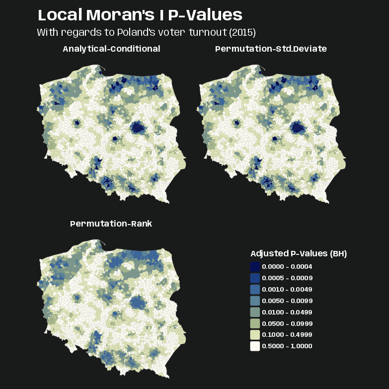{.lightbox width="632"}

  <Details>

  <Summary>Code</Summary>

  ``` r
  pv_iturn_pres15 <- pol_pres15 |> 
    select(geometry) |> 
    bind_cols(lmoran_iturn_adj |> select(p_value_bh)) |> 
    bind_cols(lmoran_perm_iturn_adj |> select(p_value_anlyt_bh, p_value_sim_bh)) |> 
    tidyr::pivot_longer(
      cols = starts_with("p_value"),
      names_to = "pval_type",
      values_to = "p_value"
    )

  pv_brks <- c(0, 0.0005, 0.001, 0.005, 0.01, 0.05, 0.1, 0.5, 1)

  tmap_options_reset()
  tmap_theme_charcoal()

  # tm_pos_on_top needed to get legend in correct cell. others wouldn't work.
  # the approach using the ranks of observed values among permutation samples all yield similar maps, as the distribution of the input variable is quite close to normal. P-values for the rank-based map are noticably smaller though.
  tm_shape(pv_iturn_pres15) + 
    tm_polygons(col = "gray40") + 
    tm_fill(
      fill = "p_value",
      fill.scale = tm_scale(breaks = pv_brks, values = "scico.davos"),    
      fill.legend = tm_legend(
        "Adjusted P-Values (BH)",
        frame = FALSE,
        position = tm_pos_on_top(
          pos.v = 0.4,
          pos.h = 0.66
        )
      )
    ) +
    tm_facets_wrap("pval_type", ncol = 2) +
    tm_title(
      "Local Moran's I P-Values", 
      size = 2, 
      fontface = "bold"
    ) + 
    tm_title("With regards to Poland's voter turnout (2015)", size = 1.25) +
    tm_layout(
      panel.labels = c(
        "Analytical-Conditional",
        "Permutation-Std.Deviate",
        "Permutation-Rank"
      )
    )
  ```

  </Details>

  - If we use the 0.005 threshold, the darker blues are the mostly likely cluster centers.
  - The rank-based p-value produces a similar map to other two methods that make normal distribution assumptions. So, the distribution of the input variable is probably close to normal.
  :::

- [Example 2]{.ribbon-highlight}: Hotspot Analysis with Local Moran's I~i~

  ::: panel-tabset
  ## Cluster Counts

  This is a continuation from Example 1, so it uses the analytical and permation-based Local Moran's I~i~. See Example 1 for details on data.

  The goal is to classify likely cluster centers of voter turnout (e.g. high turnout, low turnout clusters)

  ``` r
  lmoran_iturn_adj |> 
    filter(p_value_bh < 0.005) |> 
    count(
      mean_quadr, 
      .drop = FALSE, 
      sort = TRUE
    )
  #>   mean_quadr  n
  #> 1  High-High 96
  #> 2    Low-Low 53
  #> 3   High-Low  0
  #> 4   Low-High  0

  lmoran_perm_iturn_adj |> 
    filter(p_value_anlyt_bh < 0.005) |> 
    count(
      mean_quadr, 
      .drop = FALSE, 
      sort = TRUE
    )
  #>   mean_quadr  n
  #> 1  High-High 95
  #> 2    Low-Low 54
  #> 3   High-Low  0
  #> 4   Low-High  0

  lmoran_perm_iturn_adj |> 
    filter(p_value_sim_bh < 0.005) |> 
    count(
      mean_quadr, 
      .drop = FALSE, 
      sort = TRUE
    )
  #>   mean_quadr  n
  #> 1  High-High 74
  #> 2    Low-Low 59
  #> 3   High-Low  0
  #> 4   Low-High  0
  ```

  - [lmoran_iturn_adj]{.var-text} is from the Analytical Local Moran's I~i~ tab in Example 1
  - [lmoran_perm_iturn_adj]{.var-text} is from the Permutation-based Local Moran's I~i~ tab in Example 1

  ## Visualize

  ###### Preprocess

  <Details>

  <Summary>Code</Summary>

  ``` r
  quadr_anlyt <- lmoran_iturn_adj |> 
    mutate(
      mean_quadr = as.character(mean_quadr),
      mean_quadr = case_when(
        mean_quadr == "High-High" ~ "High Turnout",
        mean_quadr == "Low-Low" ~ "Low Turnout",
        .default = mean_quadr
      ),
      mean_quadr = ifelse(
        p_value_bh >= 0.005,
        NA_character_,
        mean_quadr
      )
    ) |>   
    rename(quadr_anlyt = mean_quadr) |> 
    select(quadr_anlyt)

  quadr_perm_stddev <- lmoran_perm_iturn_adj |> 
    mutate(
      mean_quadr = as.character(mean_quadr),
      mean_quadr = case_when(
        mean_quadr == "High-High" ~ "High Turnout",
        mean_quadr == "Low-Low" ~ "Low Turnout",
        .default = mean_quadr
      ),
      mean_quadr = ifelse(
        p_value_anlyt_bh >= 0.005,
        NA_character_,
        mean_quadr
      )
    ) |>   
    rename(quadr_perm_stddev = mean_quadr) |> 
    select(quadr_perm_stddev)

  quadr_perm_rank <- lmoran_perm_iturn_adj |> 
    mutate(
      mean_quadr = as.character(mean_quadr),
      mean_quadr = case_when(
        mean_quadr == "High-High" ~ "High Turnout",
        mean_quadr == "Low-Low" ~ "Low Turnout",
        .default = mean_quadr
      ),
      mean_quadr = ifelse(
        p_value_sim_bh >= 0.005,
        NA_character_,
        mean_quadr
      )
    ) |>  
    rename(quadr_perm_rank = mean_quadr) |> 
    select(quadr_perm_rank)

  # plot data object
  clust_iturn_pres15 <- pol_pres15 |> 
    select(geometry) |> 
    bind_cols(quadr_anlyt, quadr_perm_stddev, quadr_perm_rank) |> 
    tidyr::pivot_longer(
      cols = starts_with("quadr"),
      names_to = "moran_type",
      values_to = "clust_type"
    ) |> 
    mutate(
      clust_type = factor(clust_type),
      moran_type = factor(moran_type)
    )
  ```

  - Code recodes the hotspot classification into some more informative categories and filters the data to p-values below the 0.005 threshold
  - This uses a lot of repeated code so forgive me. I should've wrote a function, but I was lazy. There's a better way of doing this using the `hotspot` function which I use in Example 3 \>\> Visualize \>\> Process

  </Details>

  ###### Visualize

  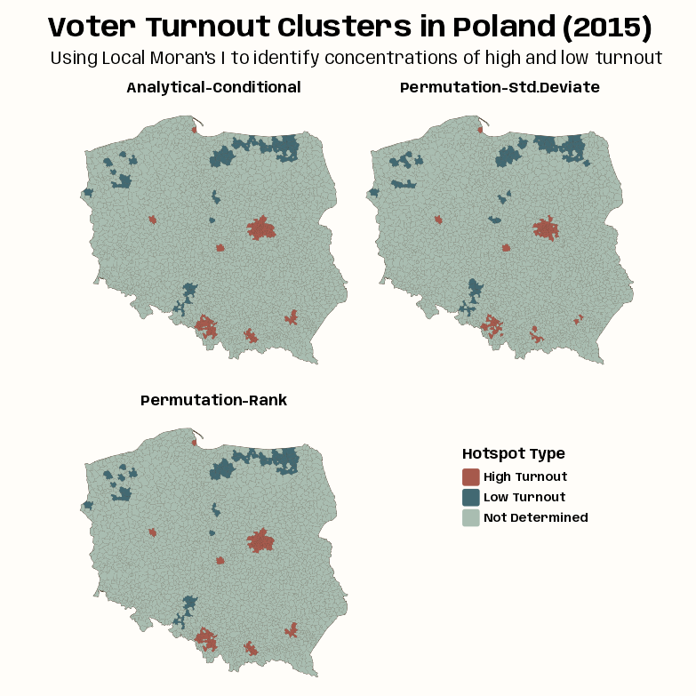{.lightbox width="632"}

  <Details>

  <Summary>Code</Summary>

  ``` r
  tmap_options_reset()
  tmap_theme_notebook()

  notebook_colors <- unname(swatches::read_ase(here::here("palettes/Forest Floor.ase")))

  tm_shape(clust_iturn_pres15) + 
    tm_polygons(col = "#4A3728") + 
    tm_fill(
      fill = "clust_type",
      fill.scale = tm_scale(
        values = c(notebook_colors[[5]], notebook_colors[[6]]), 
        value.na = notebook_colors[[2]],
        label.na = "Not Determined"
      ),    
      fill.legend = tm_legend(
        "Hotspot Type",
        frame = FALSE,
        position = tm_pos_on_top(
          pos.v = 0.4,
          pos.h = 0.66
        )
      )
    ) +
    tm_facets_wrap("moran_type", ncol = 2) +
    tm_title(
      "Voter Turnout Clusters in Poland (2015)", 
      size = 2, 
      fontface = "bold",
      # get title flush with left side to line up with subtitle
      # every number except 0.05 is default
      padding = c(0.25, 0.05, 0.25, 0.25)
    ) + 
    tm_title(
      "Using Local Moran's I to identify concentrations of high and low turnout", 
      size = 1.25
    ) +
    tm_layout(
      panel.labels = c(
        "Analytical-Conditional",
        "Permutation-Std.Deviate",
        "Permutation-Rank"
      )
    )
  ```

  </Details>

  - As the p-value maps were similar for these different methods, so are the hotspot classifications.
  - In most cases, the "High Turnout" cluster cores are in urban areas, and "Low Turnout" cluster cores are in sparsely populated rural areas in the North, in addition to the German national minority areas close to the southern border.
  :::

- [Example 3]{.ribbon-highlight}: Saddlepoint Local Moran's I~i~ and Hotspot Analysis

  ::::: panel-tabset
  ## Data and Set-Up

  Polish Presidential election 2015 data by gminy and Warsaw borough areal units

  The goal is to find likely spatial cluster centers of similar voter turnout using the saddlepoint approximation of Local Moran's I~i~. Then to classify likely cluster centers of voter turnout (e.g. high turnout, low turnout cluster centers).

  ``` r
  pacman::p_load(
    dplyr,
    ggplot2,
    spdep,
    tmap
  )

  notebook_colors <- unname(swatches::read_ase(here::here("palettes/Forest Floor.ase")))
  ```

  - Uses the same data ([pol_pres15]{.var-text} and neighbors list ([nb_poly_pol]{.var-text}) as Example 1 \>\> Data and Set-Up

  ## lm: Intercept-only

  ::: {layout-ncol="2"}
  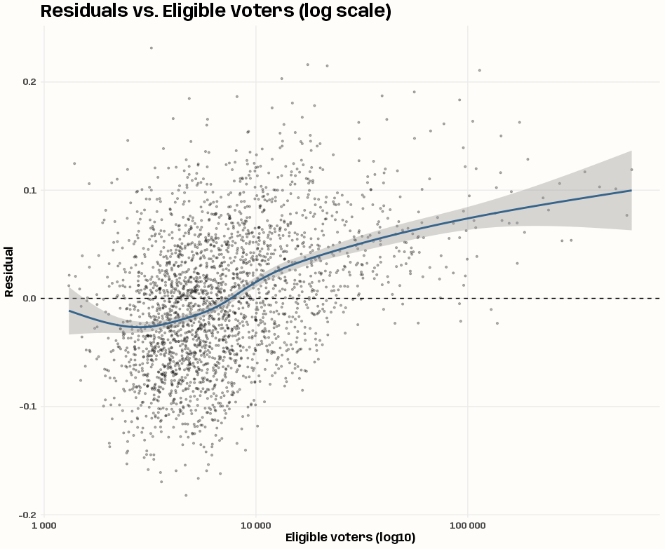{.lightbox group="local-ex3" width="432"}

  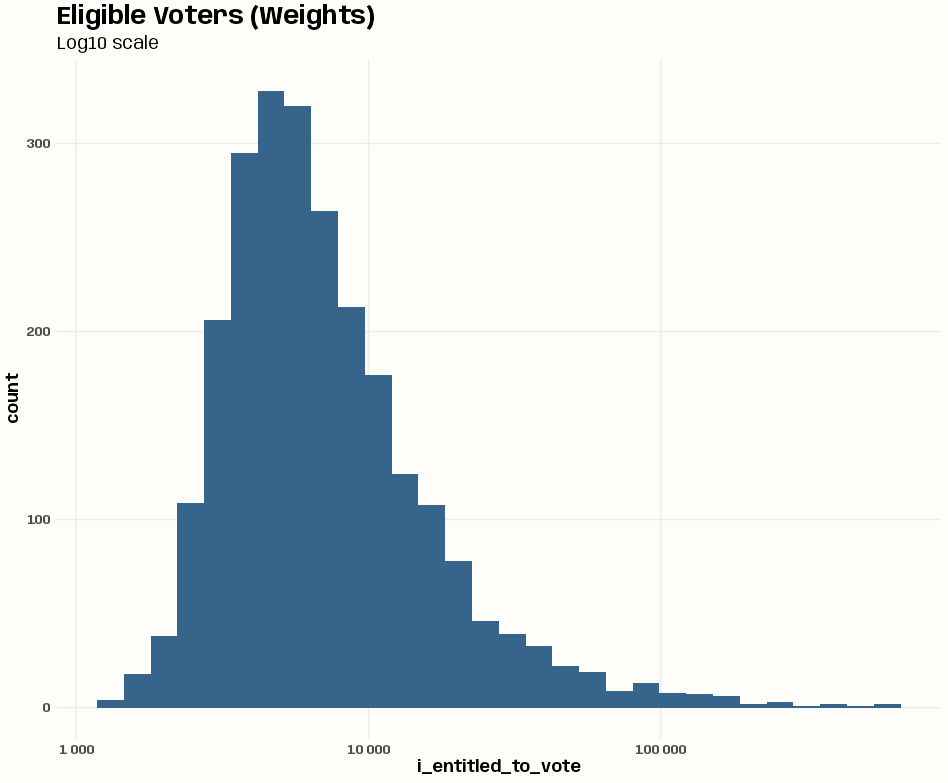{.lightbox group="local-ex3" width="432"}
  :::

  ``` r
  lm_null <- lm(i_turnout ~ 1, data = pol_pres15)

  pol_pres15 <- pol_pres15 |> 
    mutate(resid_lm_null = resid(lm_null))

  # residuals vs. weights variable (heteroskedasticity check)
  pol_pres15 |> 
    ggplot(aes(x = i_entitled_to_vote, y = resid_lm_null)) +
    geom_point(alpha = 0.3, size = 0.8) +
    geom_hline(yintercept = 0, linetype = "dashed") +
    geom_smooth(color = "steelblue4") +
    scale_x_log10(labels = scales::label_number()) +
    labs(
      title = "Residuals vs. Eligible Voters (log scale)",
      x = "Eligible voters (log10)", 
      y = "Residual"
    ) +
    theme_notebook()

  # 17 min!!
  losh_iturnout <- LOSH.mc(iturnout, lw_w_pol, nsim = 99)
  tibble(p_values = losh_iturnout[, 4]) |> 
    filter(p_values < 0.05) |> 
    count(p_values)
  #> # A tibble: 4 × 2
  #>   p_values     n
  #>      <dbl> <int>
  #> 1     0.01    56
  #> 2     0.02    25
  #> 3     0.03    16
  #> 4     0.04    18

  # weights variable distribution (uniform check)
  pol_pres15 |> 
    ggplot(aes(x = i_entitled_to_vote)) +
    geom_histogram(fill = "steelblue4") +
    scale_x_log10(labels = scales::label_number()) +
    labs(title = "Eligible Voters (Weights)", subtitle = "Log10 scale") +
    theme_notebook()

  # case-weighted, intercept-only lm model
  lm_null_wgt <- lm(
    i_turnout ~ 1, 
    weights = i_entitled_to_vote,
    data = pol_pres15
  )
  ```

  - There looks like there's a little more variance for smaller values of entitled voters than higher values of entitled voters. There does seem to be fewer gminies with large numbers of entitled votes given how the ribbon of the smooth widens. If there's heteroskedasticity, it's not obvious to me here.
  - The LOSH calculation does show there are around 100 gminies that indicate local spatial heteroskedasticity. So this could justify using weighted least squares.
  - The weights variable (entitled voters) is heavily right-skewed (many small gminy, and few very large ones) even with the log10 transformation of the x-axis — definitely is not uniform.
    - This shows the unweighted mean is being disproportionately pulled by the numerically dominant small units that have the noisiest turnout proportions. Therefore, adding this as a weights variable would be beneficial.
    - Since the numbers entitled to vote vary greatly between observations, using it as a case weights variable will down-weight small, high-variance units and up-weight large, low-variance ones — giving us a more efficient estimator

  ## lm: Multivariable

  ::: {layout-ncol="2"}
  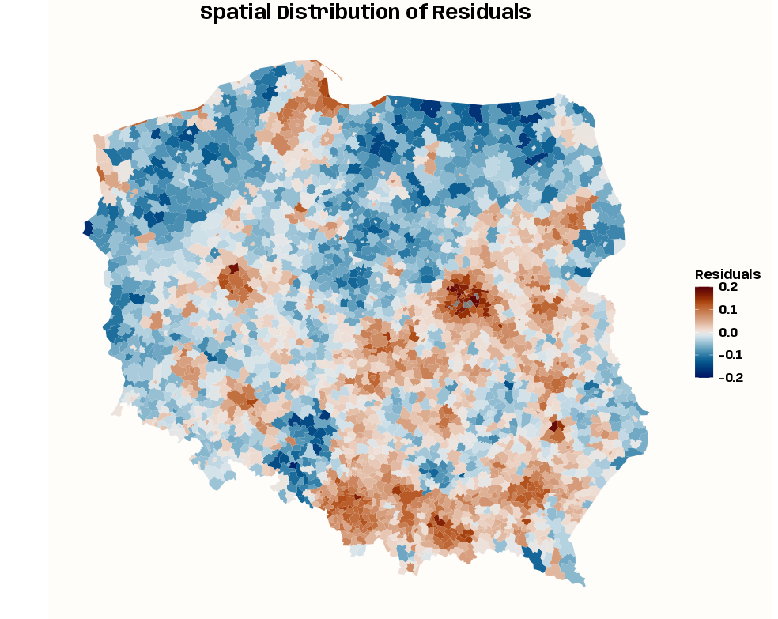{.lightbox group="local-ex3" width="432"}

  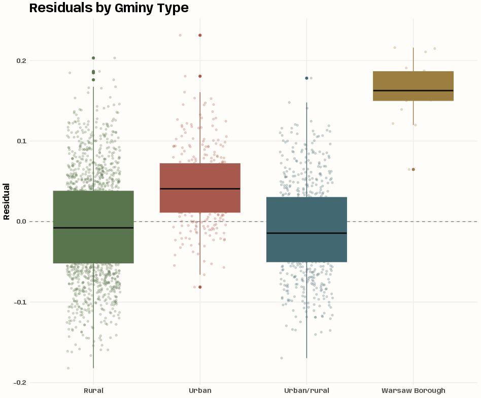{.lightbox group="local-ex3" width="432"}
  :::

  ``` r
  # spatial distribution of residuals
  ggplot(pol_pres15) +
    geom_sf(aes(fill = resid_lm_null), color = NA) +
    scico::scale_fill_scico(
      palette = "vik",
      limits = c(-0.2, 0.2),
      name = "Residuals"
    ) +
    labs(title = "Spatial Distribution of Residuals") +
    theme_notebook_map() + 
    theme(plot.title = element_text(hjust = 0.5))

  # residuals by gminy type
  ggplot(pol_pres15, 
         aes(x = types, 
             y = resid_lm_null, 
             fill = types,
             color = types)) +
    geom_hline(
      yintercept = 0, 
      linetype = "dashed", 
      color = "grey50", 
      linewidth = 0.5) +
    geom_jitter(
      width = 0.25, 
      alpha = 0.25, 
      size = 1.2
    ) +
    geom_boxplot(show.legend = FALSE, median.color = "gray6") +
    scale_fill_manual(values = notebook_colors[4:7]) +
    scale_color_manual(values = notebook_colors[4:7]) +
    guides(fill = "none", color = "none") +
    labs(title = "Residuals by Gminy Type", x = NULL, y = "Residual") + 
    theme_notebook()


  lm_mult_wgt <- lm(
    i_turnout ~ types, 
    weights = i_entitled_to_vote,
    data = pol_pres15
  )
  ```

  - The spatial distribution of the residuals of the intercept-only model show heterogeneity, so adding a spatial proxy variable should help account for autocorrelation not due to the turnout response.
  - The boxplot shows variation in median turnout by gminy type (especially the Warsaw boroughs), so [types]{.var-text} is probably a good variable to add to the model.

  ## Local Moran's I~i~

  ``` r
  lmoran_sad_null <-  localmoran.sad(
    lm_null,
    nb = nb_poly_pol, 
    style = "W",
    alternative = "two.sided"
  ) |>
    summary()

  names(lmoran_sad_null)
  #> [1] "Local Morans I"  "Stand. dev. (N)" "Pr. (N)"         "Saddlepoint"     "Pr. (Sad)"       "Expectation"    
  #> [7] "Variance"        "Skewness"        "Kurtosis"        "Minimum"         "Maximum"         "omega"          
  #> [13] "sad.r"           "sad.u" 

  lmoran_sad_null_wgt <- localmoran.sad(
    lm_null_wgt,
    nb = nb_poly_pol, 
    style = "W",
    alternative = "two.sided"
  ) |>
    summary()

  lmoran_sad_mult_wgt <- localmoran.sad(
    lm_mult_wgt,
    nb = nb_poly_pol, 
    style = "W",
    alternative = "two.sided"
  ) |>
    summary()
  ```

  - The saddlepoint approximation is made using all three `lm` models
  - `localmoran.sad` requires the `summary` function to produce the type of output of the other `localmoran` flavored functions
    - No idea what a lot of those columns mean. They aren't all defined in the function docs.

  ## Visualize

  ###### Process

  <Details>

  <Summary>Code</Summary>

  ``` r
  clust_sad_iturn_pres15 <- pol_pres15 |> 
    select(geometry) |> 
    mutate(
      quadr_sad_null = hotspot(
        lmoran_sad_null,
        Prname = "Pr. (Sad)",
        cutoff = 0.005
      ),
      quadr_sad_null_wgt = hotspot(
        lmoran_sad_null_wgt,
        Prname = "Pr. (Sad)",
        cutoff = 0.005
      ),
      quadr_sad_mult_wgt = hotspot(
        lmoran_sad_mult_wgt,
        Prname = "Pr. (Sad)",
        cutoff = 0.005
      ),
      quadr_perm_rank = quadr_perm_rank |>
        st_drop_geometry() |> 
        pull(quadr_perm_rank) |> 
        factor()
    ) |> 
    tidyr::pivot_longer(
      cols = starts_with("quadr"),
      names_to = "moran_type",
      values_to = "clust_type"
    ) |> 
    mutate(
      clust_type = as.character(clust_type),
      clust_type = case_when(
        clust_type == "High-High" ~ "High Turnout",
        clust_type == "Low-Low" ~ "Low Turnout",
        .default = clust_type
      ),
      moran_type = factor(
        moran_type, 
        levels = c(
          "quadr_perm_rank",
          "quadr_sad_null",
          "quadr_sad_null_wgt",
          "quadr_sad_mult_wgt"
        )
      )
    )
  ```

  - Adds hotspot categories and transforms them into more informative names.
    - Unlike the repeated code in Example 2, this way uses `hotspot` and is cleaner.
  - [quadr_perm_rank]{.var-text} is the hotspot categories variable for `localmoran_perm` which from Example 2 \>\> Visualize \>\> Process

  </Details>

  ###### Map

  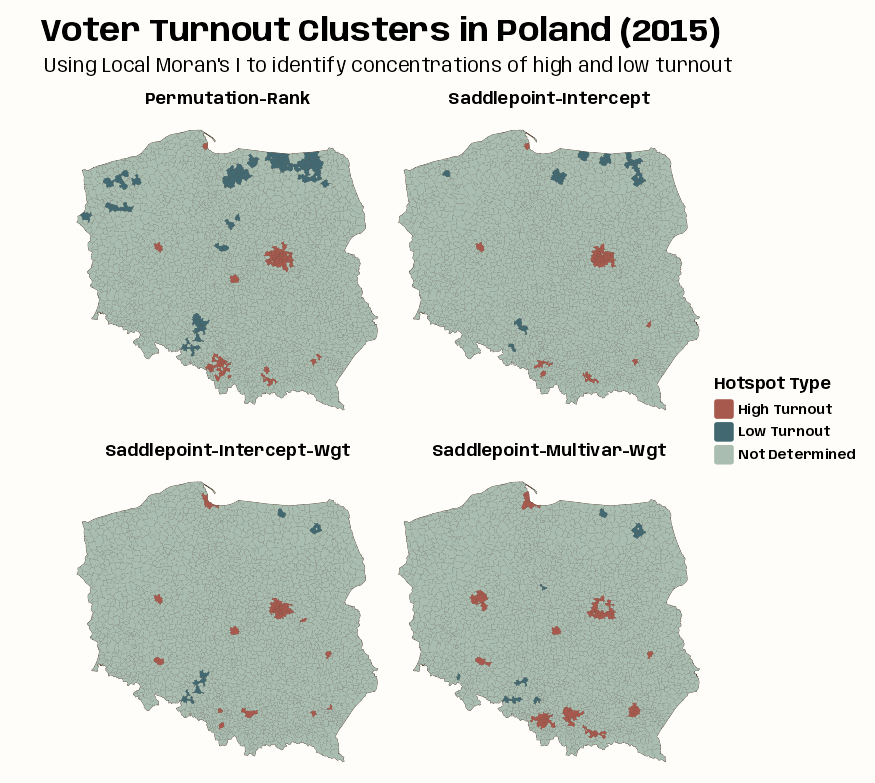{.lightbox group="local-ex3" width="632"}

  <Details>

  <Summary>Code</Summary>

  ``` r
  tmap_options_reset()
  tmap_theme_notebook()

  tm_shape(clust_sad_iturn_pres15) + 
    tm_polygons(col = "#4A3728") + 
    tm_fill(
      fill = "clust_type",
      fill.scale = tm_scale(
        values = c(notebook_colors[[5]], notebook_colors[[6]]), 
        value.na = notebook_colors[[2]],
        label.na = "Not Determined"
      ),    
      fill.legend = tm_legend(
        "Hotspot Type",
        frame = FALSE,
        position = tm_pos_out(
          pos.v = "center",
          pos.h = "center"
        )
      )
    ) +
    tm_facets_wrap("moran_type", ncol = 2) +
    tm_title(
      "Voter Turnout Clusters in Poland (2015)", 
      size = 2, 
      fontface = "bold",
      # get title flush with left side to line up with subtitle
      # every number except 0.05 is default
      padding = c(0.25, 0.05, 0.25, 0.25)
    ) + 
    tm_title(
      "Using Local Moran's I to identify concentrations of high and low turnout", 
      size = 1.25
    ) +
    tm_layout(
      panel.labels = c(
        "Permutation-Rank",
        "Saddlepoint-Intercept",
        "Saddlepoint-Intercept-Wgt",
        "Saddlepoint-Multivar-Wgt"
      )
    )
  ```

  </Details>

  - The intercept-only (null) model is fairly similar to standard local Moran’s, but weighting by counts of eligible voters removes most of the "Low Turnout" cluster cores.
  - Adding the type categorical variable strengthens the urban "High Turnout" cluster cores but removes some of the central Warsaw boroughs as detected cluster cores.
    - The central boroughs are surrounded by other boroughs, all classified as "High Turnout," not driven by (turnout response variable) autocorrelation but by being metropolitan boroughs.
  :::::

- [Example 4]{.ribbon-highlight}: Comparing Local Moran's I~i~, Local Geary's C~i~, and Local Getis-Ord G~i~ in Hotspot Analysis

  ::: panel-tabset
  ## Compute C~i~ and G~i~

  Polish Presidential election 2015 data by gminy and Warsaw borough areal units

  The goal is to find likely spatial cluster centers of similar voter turnout using the permutation method of Local Moran's Ii, Getis-Ord G, and Geary's C. Then to classify likely cluster centers by level of voter turnout (e.g. high turnout, low turnout cluster centers), and compare the patterns between the statistics.

  ``` r
  library(dplyr); library(spdep); library(tmap)

  lord_perm_iturn <- iturnout |> 
    localG_perm(
      lw_w_pol, 
      nsim = 9999, 
      iseed = 1
    )

  lgeary_perm_iturn <- iturnout |> 
    localC_perm(
      lw_w_pol, 
      nsim = 9999, 
      iseed= 1 
    )
  ```

  - [iturnout]{.var-text} (first round voter turnout proportion) and [lw_w_pol]{.var-text} (row-standardized spatial weights) from Example 1 \>\> Data and Set-Up
  - Also including (next tab) the permutation flavor of local moran's I~i~ ([quadr_perm_rank]{.var-text}) from Example 2 \>\> Visualize \>\> Process

  ## Visualize

  ###### Process

  <Details>

  <Summary>Code</Summary>

  ``` r
  clust_mcg_iturn_pres15 <- pol_pres15 |> 
    select(geometry) |> 
    mutate(
      quadr_geary_perm = hotspot(
        lgeary_perm_iturn,
        Prname = "Pr(z != E(Ci)) Sim",
        cutoff = 0.005
      ),
      quadr_lord_perm = hotspot(
        lord_perm_iturn,
        Prname = "Pr(z != E(Gi)) Sim",
        cutoff = 0.005
      ),
      quadr_perm_rank = quadr_perm_rank |>
        st_drop_geometry() |> 
        pull(quadr_perm_rank) |> 
        factor()
    ) |> 
    tidyr::pivot_longer(
      cols = starts_with("quadr"),
      names_to = "method_type",
      values_to = "clust_type"
    ) |> 
    mutate(
      clust_type = as.character(clust_type),
      clust_type = case_when(
        clust_type == "High-High" | clust_type == "High" ~ "High Turnout",
        clust_type == "Low-Low" | clust_type == "Low" ~ "Low Turnout",
        clust_type == "Negative" ~ "Outlier-Neg Autocorr",
        clust_type == "Other Positive" ~ "Outlier-Pos Autocorr",
        .default = clust_type
      ),
      method_type = factor(
        method_type, 
        levels = c(
          "quadr_perm_rank",
          "quadr_lord_perm",
          "quadr_geary_perm"
        )
      )
    )
  ```

  - Adds hotspot categories and transforms them into more informative names.
    - Unlike the repeated code in Example 2, this way uses `hotspot` and is cleaner.

  </Details>

  ###### Map

  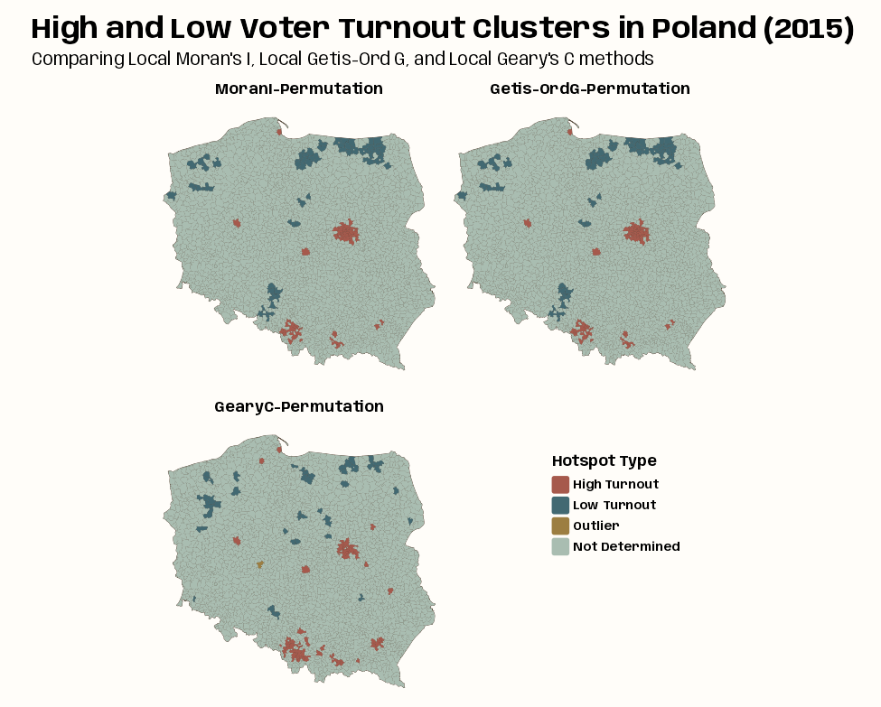{.lightbox width="632"}

  <Details>

  <Summary>Code</Summary>

  ``` r
  tmap_options_reset()
  tmap_theme_notebook()

  notebook_colors <- unname(swatches::read_ase(here::here("palettes/Forest Floor.ase")))

  tm_shape(clust_mcg_iturn_pres15) + 
    tm_polygons(col = "#4A3728") + 
    tm_fill(
      fill = "clust_type",
      fill.scale = tm_scale(
        values = c(notebook_colors[[5]], notebook_colors[[6]], notebook_colors[[7]]), 
        value.na = notebook_colors[[2]],
        label.na = "Not Determined"
      ),    
      fill.legend = tm_legend(
        "Hotspot Type",
        frame = FALSE,
        position = tm_pos_on_top(
          pos.v = 0.4,
          pos.h = 0.66
        )
      )
    ) +
    tm_facets_wrap("method_type", ncol = 2) +
    tm_title(
      "High and Low Voter Turnout Clusters in Poland (2015)", 
      size = 2, 
      fontface = "bold",
      # get title flush with left side to line up with subtitle
      # every number except 0.05 is default
      padding = c(0.25, 0.15, 0.25, 0.25)
    ) + 
    tm_title(
      "Comparing Local Moran's I, Local Getis-Ord G, and Local Geary's C methods", 
      size = 1.25
    ) +
    tm_layout(
      panel.labels = c(
        "MoranI-Permutation",
        "Getis-OrdG-Permutation",
        "GearyC-Permutation"
      )
    )
  ```

  </Details>

  - The Local Moran's Ii and Getis-Ord G maps look identical which is expected. The Geary's C is substantially different but the regions and classifications of flagged gminy are similar.
  - It's hard to see but there's one group of outlier cluster centers and it's in the Local Geary's C map They're 1 to 3 small gminies in western Poland. They have significant negative spatial autocorrelation, so their neighbors are dissimilar from themselves.
    - The centers could be high turnout or low turnout. Neither do we know about whether their neighbors are high or low turnout.
    - I mean I guess we could just look at the data and suss this out.
  :::
