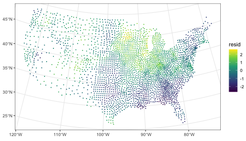

# Geospatial {#sec-diag-geo .unnumbered}

## Misc {#sec-diag-geo-misc .unnumbered}

- Also see [Geospatial, Spatial Weights](geospatial-spatial-weights.qmd#sec-geo-swgt){style="color: green"}
- Packages
  - [{]{style="color: #990000"}[waywiser](https://docs.ropensci.org/waywiser/){style="color: #990000"}[}]{style="color: #990000"} - Measures the performance of models fit to 2D spatial data by implementing a number of well-established assessment methods in a consistent, ergonomic toolbox
    - Features include new yardstick metrics for measuring agreement and spatial autocorrelation, functions to assess model predictions across multiple scales, and methods to calculate the area of applicability of a model.
  - [{]{style="color: #990000"}[geospt](https://cran.r-project.org/web/packages/geospt/index.html){style="color: #990000"}[}]{style="color: #990000"} - Estimation of the variogram through trimmed mean, radial basis functions (optimization, prediction and cross-validation), summary statistics from cross-validation, pocket plot, and design of optimal sampling networks through sequential and simultaneous points methods.
  - [{]{style="color: #990000"}[geosptdb](https://cran.r-project.org/web/packages/geosptdb/index.html){style="color: #990000"}[}]{style="color: #990000"} - Spatio-Temporal Radial Basis Functions with Distance-Based Methods (Optimization, Prediction and Cross Validation)
  - [{]{style="color: #990000"}[sperrorest](https://giscience-fsu.github.io/sperrorest/){style="color: #990000"}[}]{style="color: #990000"} - Implements spatial error estimation and permutation-based spatial variable importance using different spatial cross-validation and spatial block bootstrap methods, used by [{mlr3spatiotempcv}]{style="color: #990000"}.
- Papers
  - [Measuring Nonlinear Relationships and Spatial Heterogeneity of Influencing Factors on Traffic Crash Density Using GeoXAI](https://arxiv.org/abs/2512.14985)

## Spatial Autocorrelation {#sec-diag-geo-sauto .unnumbered}

- [Misc]{.underline}
  - Also see [Association, Spatial](association-spatial.qmd#sec-assoc-spat){style="color: green"}
  - Testing the residuals of intercept-only or other simple (few or irrelevant covariates) models will erroneously detect patterns as (global) spatial autocorrelation.
    - i.e. a significant Moran's I doesn't necessarily mean you need spatial econometrics (lags, modelled errors) — it might just mean your model is missing a *spatially-patterned* covariate.
    - See Misc \>\> Causes of Spurious Spatial Autocorrelation \>\> Omitted Variables for more details
- [Visual Assessment]{.underline}
  - [Example]{.ribbon-highlight}: ([source](https://cran.r-project.org/web/packages/SpatialInference/vignettes/spatial_HAC.html))\
    {.lightbox}

    ``` r
    libary(ggplot2)

    data("US_counties_centroids", package = "SpatialInference")

    spuriouslm <- fixest::feols(
      noise1 ~ noise2, 
      data = US_counties_centroids, 
      vcov = "HC1" # robust SEs
    )
    spuriouslm
    #> OLS estimation, Dep. Var.: noise1
    #> Observations: 3,108
    #> Standard-errors: Heteroskedasticity-robust 
    #>                 Estimate Std. Error      t value   Pr(>|t|)    
    #> (Intercept) 6.890000e-16   0.017872 3.860000e-14 1.0000e+00    
    #> noise2      8.738022e-02   0.015535 5.624836e+00 2.0216e-08 ***
    #> ---
    #> Signif. codes:  0 '***' 0.001 '**' 0.01 '*' 0.05 '.' 0.1 ' ' 1
    #> RMSE: 0.996015   Adj. R2: 0.007316

    US_counties_centroids$resid <- spuriouslm$residuals

    ggplot(US_counties_centroids) +
      geom_sf(aes(col = resid), size = .1) + 
      theme_bw() + 
      scale_color_viridis_c()
    ```

    - [noise1]{.var-text} and [noise2]{.var-text} are independent of each other but spatially coorelated. This leads to an inflated t-value and low p-value.
    - Clustering of high residuals in the Midwest
- [Moran's I]{.underline}
  - `lm.morantest.exact`
  - `lm.morantest.sad` - Saddlepoint Approximation ([Paper](https://onlinelibrary.wiley.com/doi/10.1111/j.1538-4632.2002.tb01084.x))
    - The conventional approach to estimating Moran's I is either to assume the statistic follows an approximate normal distribution (using its expectation and variance), or to rely on simulation experiments that randomize residual locations or assume a specific error structure.
    - The saddlepoint approximation outperforms other approximation methods with respect to its accuracy and computational costs. In addition, only the saddlepoint approximation is capable of handling, in analytical terms, reference distributions of Moran's I that are subject to significant underlying spatial processes.
    - Local Moran's $I_i$ is *not* asymptotically normally distributed but instead deviates more and more from the normal distribution as the number of spatial objects increases, because the kurtosis increases rather than shrinks.
    - if the regression residuals are heteroskedastic, the numerator and denominator of Moran's I are no longer independent, causing the regular moment expressions to break down
    - It's an approximation of an exact method, but its roughly one hundred times faster than the numerical integration of the classic exact method.
