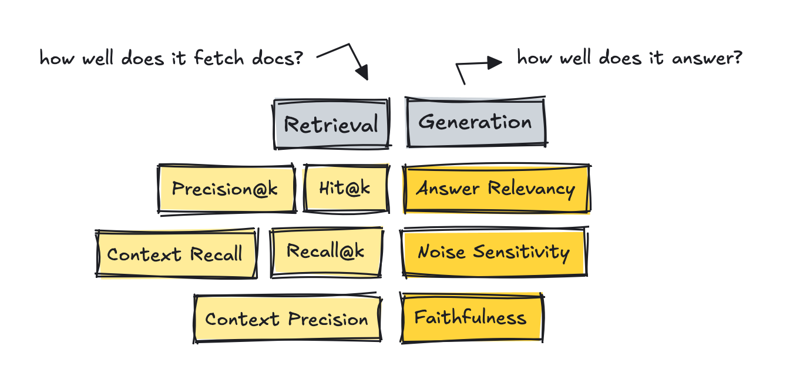

# LLM {#sec-diag-llm .unnumbered}

## Frameworks {#sec-diag-llm-fram .unnumbered}

-   Notes from
    -   [Agentic AI: On Evaluations](https://towardsdatascience.com/agentic-ai-evaluation-playbook/)
-   Resources
    -   [Up-to-date list](https://github.com/ilsilfverskiold/Awesome-LLM-Resources-List/blob/main/README.md#evaluation-frameworks-and-add-ons)
-   All offer the ability to run evals on your own dataset, work for multi-turn, RAG, and agents in some way or another, support LLM-as-a-judge, allow setting up custom metrics, and are CI-friendly.
-   Frameworks uses different names for essentially the same thing
    -   e.g. faithfulness in one may mean the same as groundedness in another. Answer relevancy may be the same as response relevance, and so on.
-   Custom metrics are what developers set up the most, so don’t get stuck on who offers what metric. Your use case will be unique, and so will how you evaluate it.
-   RAGAS
    -   Primarily built as a metric library for evaluating RAG applications (although they offer other metrics as well).
    -   Integrates with LangChain
-   DeepEval
    -   Possibly the most comprehensive evaluation library with over 40 metrics available and the most complete, out-of-the-box suite of tools.
    -   Offers a framework called G-Eval, which helps you set up custom metrics quickly making it the fastest way from idea to a runnable metric.
    -   Provides red teaming via their DeepTeam framework, which automates adversarial testing of LLM systems. There are other frameworks out there that do this too, although perhaps not as extensively.
-   OpenAI
    -   A very lightweight solution that expects you to set up your own metrics, although they provide an example library to help you get started.
    -   Better suited when you want bespoke logic, not when you just need a quick judge.
-   MLFlow’s Evals
    -   Primarily built to evaluate traditional ML pipelines, so the number of metrics they offer is lower for LLM-based apps.

## Agents {#sec-diag-llm-ag .unnumbered}

-   [General]{.underline}
    -   Task Completion - Does it pick the correct tool at the correct time?
        -   Use some kind of gold script with ground truth built in to test each run. Author that once and then use it each time you make changes.
    -   Tool Correctness - Does it move through the process and finish the goal?
        -   Read the entire trace and the goal, and return a number between 0 and 1 with a rationale. This should measure how effective the agent is at accomplishing the task.
    -   Application-specific
        -   Generic metrics are probably not enough though. You need a few custom ones for your use case. So the evals differ by application.
        -   For a coding copilot, you could track what percent of completions a developer accepts (acceptance rate) and whether the full chat reached the goal (completeness).
        -   For commerce agents, you might measure whether the agent picked the right products and whether answers are grounded in the store’s data.
        -   Security and safety related metrics, such as bias, toxicity, and how easy it is to break the system (jailbreaks, data leaks).
-   [Reliability]{.underline}
    -   Notes from [The Math That’s Killing Your AI Agent](https://towardsdatascience.com/the-math-thats-killing-your-ai-agent/)
    -   Run the Compound Error Calculation
        -   Formula: $P(\text{success}) = \text{per-step accuracy}^n$, where $n$ is the number of steps in the longest realistic workflow.
        -   Process:
            1.  Count the steps in your agent’s most complex workflow.
            2.  Estimate per-step accuracy — if you have no production data, start with a conservative 80% for an unvalidated LLM-based agent.
            3.  Plug in the formula. If $P(\text{success})$ falls below whatever rate stakeholders deem acceptable (e.g. 50%), the agent should not be deployed on irreversible tasks without human checkpoints at each stage boundary.
        -   [Example]{.ribbon-highlight}: A customer service agent handling returns
            -   The agent completes 8 steps: read request, verify order, check policy, calculate refund, update record, send confirmation, log action, close ticket.
            -   At $85\%$ per-step accuracy: $0.858 = 27\%$ overall success. Three out of four interactions will contain at least one error.
            -   Using $50\%$ as a benchmark, this agent needs mid-task human review, a narrower scope (i.e. fewer steps), or both.
    -   Test for Error Recovery, Not Just Task Completion
        -   Agents that fail silently are dangerous
        -   Does the agent recognize when it has made an error?
        -   Does it escalate or log a clear failure signal?
        -   Does it stop rather than compound the error across subsequent steps?
    -   If the agent scores poorly on any of the previous tests, try to increase reliability
        -   Narrow the task scope first.
            -   A 10-step agent fails 80% of the time at 85% accuracy. A 3-step agent at identical accuracy fails only 39% of the time.
            -   Reducing scope is the fastest reliability improvement available without changing the underlying model.
        -   Add human checkpoints at irreversibility boundaries.
            -   The most reliable agentic systems in production today are not fully autonomous. They’re “human-in-the-loop” on any action that cannot be undone.
            -   The economic value of automation is preserved across all the routine, reversible steps. The catastrophic failure modes are contained at the boundaries that matter.

## RAG {#sec-diag-llm-rag .unnumbered}

{.lightbox width="432"}

-   Metrics
    -   Reference-free methods that use a LLM as a judge
        -   These count how many of the truly relevant chunks made it into the top K list based on the query, using an LLM to judge.
        -   RAGAS and DeepEval introduces metrics like Context Recall and Context Precision.
        -   Companies sample-audit with humans every few weeks to stay real.
    -   Precision\@k measures the amount of relevant documents in results
    -   Recall\@k measures how many relevant documents were retrieved based on the gold reference answers
    -   Hit\@k measures whether at least one relevant document made it into the results
-   Low scores $\rightarrow$ tune the system by setting up better chunking strategies, changing the embedding model, adding techniques such as hybrid search and re-ranking, filtering with metadata, and similar approaches.
-   Evaluation Datasets
    -   Mine questions from real logs and then use a human to curate them.
    -   Use dataset generators with the help of a LLM, which exist in most frameworks or as standalone tools like YourBench.
