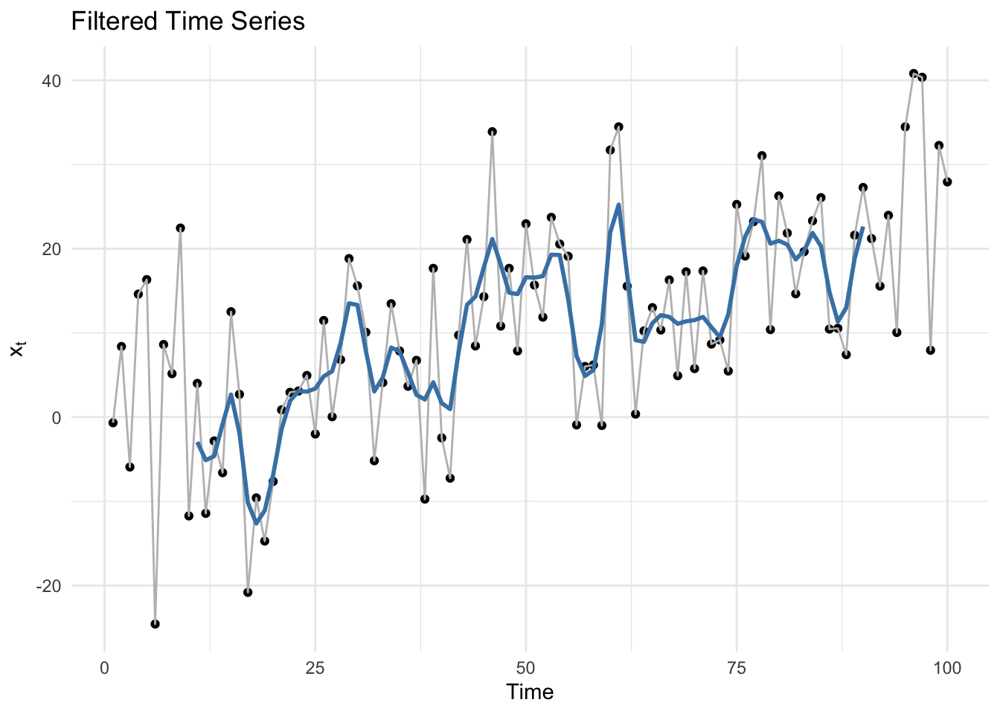
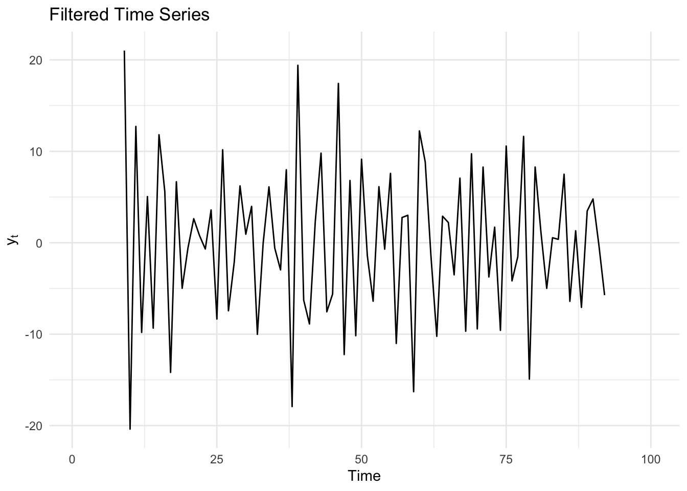
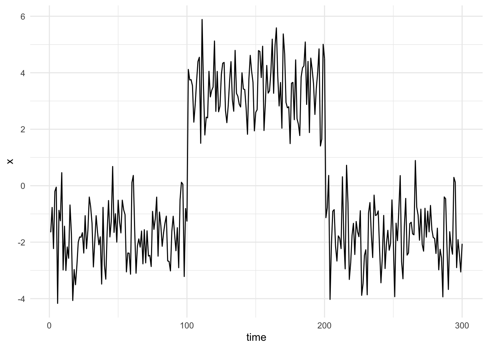
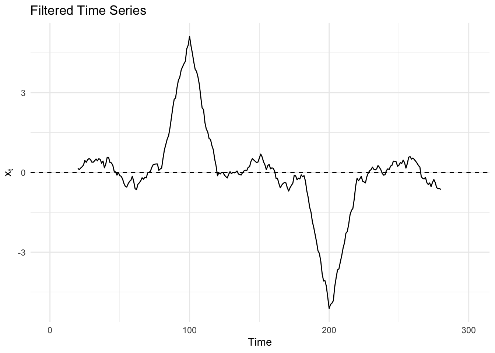
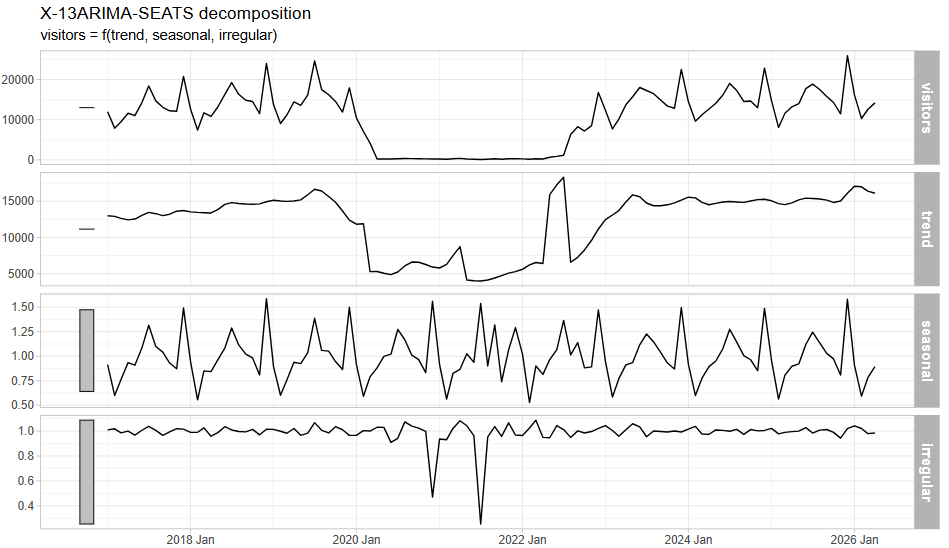
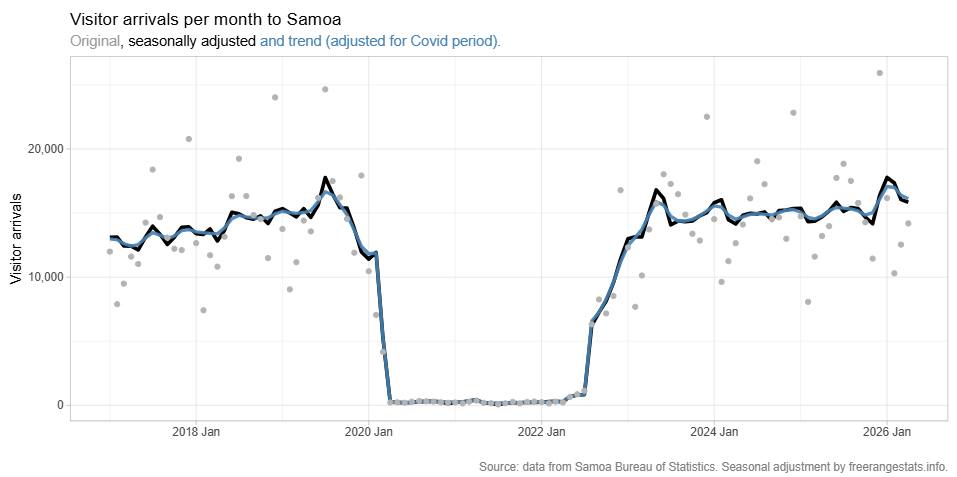

# Decomposition {#sec-decomp .unnumbered}

## Misc {#sec-decomp-misc .unnumbered}

- Also see [EDA, Time Series \>\> Seasonality](eda-time-series.qmd#sec-eda-ts-seas){style="color: green"}
  - Presents details about Daily Seasonal Adjustment (DSA)
- Packages
  - [{]{style="color: #990000"}[dsp](https://github.com/drkowal/dsp/tree/master){style="color: #990000"}[}]{style="color: #990000"} ([paper](https://academic.oup.com/jrsssb/article/81/4/781/7048377?login=false#396338018)) - MCMC implementation for Bayesian trend filtering (BTF) with dynamic horseshoe processes as the prior (penalty)
    - Dynamic Shrinkage Processes (DSPs) extend popular global-local shrinkage priors, such as the horseshoe prior for sparse signals, to the time series setting by allowing the shrinkage behavior to depend on the history of the shrinkage process.
    - DSPs are used as the prior on the 1st/2nd differences, which produces curve estimates and credible bands that are highly adaptive to both rapidly- and slowly-changing features
    - Implementations for the (static) horseshoe (HS) prior and a Normal-Inverse-Gamma (NIG) prior
  - [{]{style="color: #990000"}[genlasso](https://cran.r-project.org/web/packages/genlasso/index.html){style="color: #990000"}[}]{style="color: #990000"} - Trend filtering of any given polynomial order
  - [{]{style="color: #990000"}[jumps](https://cran.r-project.org/web/packages/jumps/index.html){style="color: #990000"}[}]{style="color: #990000"} - Hodrick-Prescott Filter with Jumps
    - The original HP filter extracts a smooth trend from a time series, and our version allows for a small number of automatically identified jumps (i.e. changepoints).
  - [{]{style="color: #990000"}[MatchingPursuit](https://cran.r-project.org/web/packages/MatchingPursuit/index.html){style="color: #990000"}[}]{style="color: #990000"} - Provides tools for analysing and decomposing time series data using the Matching Pursuit (MP) algorithm, a greedy signal decomposition technique that represents complex signals as a linear combination of simpler functions (called atoms) selected from a redundant dictionary.
  - [{]{style="color: #990000"}[rjd3tramoseats](https://rjdverse.github.io/rjd3tramoseats/){style="color: #990000"}[}]{style="color: #990000"} - Seasonal Adjustment with TRAMO-SEATS in 'JDemetra+' 3.x
    - Part of [rjdverse](https://github.com/rjdverse) which includes all kinds of stuff (e.g. graphing, filtering, reporting, etc.)
    - TRAMO-SEATS' (Time series Regression with ARIMA noise, Missing values and Outliers - Signal Extraction in ARIMA Time Series)
    - Includes 'TRAMO' modelling (ARIMA model with outlier detection and trading days adjustment)
    - JDemetra+ is the seasonal adjustment software officially recommended to the members of the European Statistical System (ESS) and the European System of Central Banks.
  - [{]{style="color: #990000"}[rjd3x13](https://rjdverse.github.io/rjd3x13/){style="color: #990000"}[}]{style="color: #990000"} - Offers full access to options and outputs of X-13, including RegARIMA modeling and X-11 decomposition
  - [{]{style="color: #990000"}[SSAforecast](https://cran.r-project.org/web/packages/SSAforecast/index.html){style="color: #990000"}[}]{style="color: #990000"} - Singular spectrum analysis (SSA) decomposes a time series into interpretable components like trends, oscillations, and noise without strict distributional and structural assumptions.
  - [{]{style="color: #990000"}[TrendLSW](https://cran.r-project.org/web/packages/TrendLSW/index.html){style="color: #990000"}[}]{style="color: #990000"} ([Vignette](https://arxiv.org/abs/2406.05012)) - Wavelet Methods for Analyzing Nonstationary Time Series
    - Allows users to simulate time series with first and second order nonstationarity, as well as estimate relevant quantities of interest, such as the trend and wavelet spectrum associated to time series. (i.e. smoothing for trends and spectral estimation)
    - Notes from on the vignette and wavelets, in general, are in `scrapsheet.qmd` in the repo.
- There are two approaches to noise reduction: filtering algorithms and smoothing algorithms. In filtering algorithms, signal points are fed sequentially, therefore only the current and the previous points are used to get rid of noise at the current point. Smoothing algorithms assume that the entire signal has been received, and all signal points, both previous and subsequent, are used to get rid of noise at the current point.
- Low Pass FIlter
  - Dampens higher frequencies in the data and allows lower frequencies to "pass" through.

    {.lightbox width="432"}

    - A smoother version of the original data
- High Pass FIlter
  - Dampens low frequencies and allows high frequencies to pass

    {.lightbox width="432"}

    - Looks like a series of residuals with the trend removed
- Matching Filter
  - Original series with extreme changepoints

    {.lightbox width="432"}

  - Matching filter indicates the changepoints with peaks in the filtered series

    {.lightbox width="432"}

## Seasonal Adjusted Forecasting {#sec-decomp-saf .unnumbered}

- The seasonality is extracted from the time series using STL. The extracted seasonal time series and the seasonally adjusted time series are forecast separately. Both forecasts are then added back together to produce the final forecast.

  - A seasonal naive method is commonly used to forecast the seasonal component.
  - Not sure how you would combine the uncertainty (i.e PIs)

- Packages

  - [{]{style="color: #990000"}[seasonal](https://github.com/christophsax/seasonal){style="color: #990000"}[}]{style="color: #990000"} - Full-featured R-interface to X-13ARIMA-SEATS, the newest seasonal adjustment software developed by the United States Census Bureau.
  - [{]{style="color: #990000"}[feasts::X_13ARIMA_SEAT](https://feasts.tidyverts.org/reference/X_13ARIMA_SEATS.html){style="color: #990000"}[}]{style="color: #990000"}

- Examples

  - [Example 1]{.ribbon-highlight}: Tourism in Samoa with [{seasonal}]{style="color: #990000"} ([source](https://freerangestats.info/blog/2026/06/14/samoa-seasonal-adjustment))

    ``` r
    # Covid time series indicator to use as a regressor
    covid_reg <- ts(
      as.numeric(seq(as.Date("2017-01-01"), as.Date("2029-04-01"), by = "month") %in%
                   seq(as.Date("2020-04-01"), as.Date("2022-07-01"), by = "month")),
      start     = c(2017, 1),
      frequency = 12
    )

    # Iran war time series indicator
    war_reg <- ts(
      as.numeric(seq(as.Date("2017-01-01"), as.Date("2029-04-01"), by = "month") %in%
                   seq(as.Date("2026-03-01"), as.Date("2026-07-01"), by = "month")),
      start     = c(2017, 1),
      frequency = 12
    )

    sa_ts <- ts(samoa_visitors$visitors, frequency = 12, start = c(2017, 1))

    fit_ts_war <- seas(sa_ts, xreg = cbind(covid_reg, war_reg))
    summary(fit_ts_war)
    #> Coefficients:
    #>                   Estimate Std. Error z value Pr(>|z|)    
    #> xreg1             -3.10069    0.14567 -21.286  < 2e-16 ***
    #> xreg2             -0.15937    0.13098  -1.217    0.224    
    #> LS2020.Mar        -0.85036    0.14567  -5.838 5.29e-09 ***
    #> AO2020.Dec        -0.75529    0.12350  -6.115 9.63e-10 ***
    #> LS2021.May        -0.79012    0.13233  -5.971 2.36e-09 ***
    #> AO2021.Jul        -1.36973    0.12378 -11.066  < 2e-16 ***
    #> LS2022.May         0.89068    0.13233   6.731 1.68e-11 ***
    #> LS2022.Aug        -1.07689    0.19608  -5.492 3.97e-08 ***
    #> AR-Nonseasonal-01 -0.59006    0.07041  -8.380  < 2e-16 ***
    #> MA-Seasonal-12     0.99961    0.08044  12.427  < 2e-16 ***
    #> ---
    #> Signif. codes:  0 ‘***’ 0.001 ‘**’ 0.01 ‘*’ 0.05 ‘.’ 0.1 ‘ ’ 1
    #> 
    #> SEATS adj.  ARIMA: (1 1 0)(0 1 1)  Obs.: 112  Transform: log
    #> AICc:  1608, BIC:  1634  QS (no seasonality in final):3.295  
    #> Box-Ljung (no autocorr.): 26.42   Shapiro (normality): 0.9721 *
    ```

    - [Transform: log]{.arg-text} says the series was non-stationary, i.e. visitor arrivals variance increases as its mean does
    - [ARIMA (1 1 0)(0 1 1)]{.arg-text} says there's a general trend (differencing in the main part), a tendency for the values in one month to be related one way or another to those in the month before (lag 1) and an annual seasonality effect (differencing in the seasonality part).
      - This is common for tourism data.
    - [AR-Nonseasonal-01 = -0.59006]{.arg-text} says a large count in one period tends to be followed by a pullback, and small count in one period tends to be followed by a rally.
    - [MA-Seasonal-12 = 0.99961]{.arg-text} says the annual seasonality effect is very strong
      - 0.9996 is right on the unit root boundary for the MA polynomial. When the seasonal MA coefficient is this close to 1, it can indicate over-differencing (the D=1 seasonal difference may already be more than the data need)
    - The [COVID]{.var-text} indicator is very significant while the [Iran War]{.var-text} indicator is not (so no fuel prices impact yet).
    - [COVID = -3.10069]{.arg-text} says that during the Covid period the actual arrivals were on average `exp(-3.1) = 0.045` (i.e. 4.5% or down 95.5%) of during the non-Covid periods.
      - Remember the response was logged so even though 0.045 is positive after backtransformation, it's a multiplicative effect. Therefore multiplying by 0.045 is a decrease in visitors.
    - [LS2020.Mar : LS2022.Aug]{.arg-text} says these six months (during COVID) from 2020 to 2022 were flagged as outliers and controlled for.
    - Other effects like [Easter]{.var-text} and [Weekday]{.var-text} are checked by X-13 SEATS, but don't show up here, so either there is no significant effect or there's not enough data to detect them.

  - [Example 2]{.ribbon-highlight}: Tourism in Samoa with [{fable}]{style="color: #990000"} ([source](https://freerangestats.info/blog/2026/06/14/samoa-seasonal-adjustment))\
    {.lightbox width="532"}\
    {.lightbox width="532"}

    ``` r
    fit_fb <- samoa_visitors |> 
      model(X_13ARIMA_SEATS(
        visitors ~ xreg(covid_reg)
      ))

    fit_fb |> 
      components() |> 
      autoplot()

    comp_data <- fit_fb |> 
      components() |> 
      mutate(covid = as.numeric(covid_reg)[1:nrow(samoa_visitors)], # <1>
             trend_adj = trend * exp(covid * coef(fit_ts)[1])) 

    comp_data|> 
      ggplot(aes(x = date_month, y = season_adjust)) +
      geom_line(linewidth = 1.3) +
      geom_line(aes(y = trend_adj), colour = "steelblue", alpha = 0.9, linewidth = 1.2) + 
      geom_point(aes(y = visitors), colour = "grey70") +
      scale_y_continuous(label = comma) +
      labs(x = "",
           y ="Visitor arrivals",
           title = "Visitor arrivals per month to Samoa",
           subtitle = "<span style='color:grey60'>Original</span>, seasonally adjusted <span style='color:steelblue'>and trend (adjusted for Covid period).</span>",
           caption = "Source: data from Samoa Bureau of Statistics. Seasonal adjustment by freerangestats.info.") +
      theme(plot.subtitle = element_markdown())
    ```

    1.  The [trend]{.var-text} that comes straight from the decomposition does not adjust for the Covid coefficient. It is more intuitive to present it after adjustment for Covid, so you need to multiply (because of the log transform that SEATS used autoamtically) the [trend]{.var-text} by the [covid]{.var-text} indicator and its coefficient.

## Seasonal Trend Decomposition using LOESS (STL) {#sec-decomp-stl .unnumbered}

- Packages

  - [{]{style="color: #990000"}[feasts::STL](https://feasts.tidyverts.org/reference/STL.html){style="color: #990000"}[}]{style="color: #990000"}

- Time series get decomposed into trend-cycle (T), seasonal (S), and remainder (R) components

  - Yt = Tt + St + Rt, where t = 1,2,...,N

- LOESS smoothes a time series by:

  - Weights are applied to the neighborhood of each point which depend on the distance from the point
  - A polynomial regression is fit at each data point with points in the neighborhood as explanatory variables

- Components are additive

- Entails two recursive procedures: inner loop and outer loop

  - Each iteration updates the trend-cycle and seasonal components
  - Inner Loop is iterated until there's a robust estimate of the trend and seasonal component
  - The outer loop is only iterated if outliers exist among the data points
  - Inner Loop Procedure
    1.  Detrending
        - Initially occurs by subtracting an initial trend component (?) from the original series
    2.  Subseries smoothing
        - 12 monthly subseries are separated and collected
        - Each is smoothed with LOESS
        - Re-combined to create the initial seasonal component
    3.  Low-Pass filtering of smoothed seasonal component
        - Seasonal component passed through a 3x12x12 moving average.
        - Result is again smoothed by LOESS (length = 13) in order to detect any trend-cycle in it.
    4.  Detrending of smoothed subseries
        - Result of low-pass filtering is subtracted from seasonal component in step 2 to get the final seasonal component
    5.  De-seasonalization
        - Final seasonal component is subtracted from the original series
    6.  Trend smoothing
        - LOESS is applied to deseasonalized series to get the final trend component
  - Outer Loop procedure
    - Final trend and seasonal components are subtracted from the original series to get the remainder/residual series
    - The final trend and seasonal components are tested for outlier points
    - A weight is calculated and used in the next iteration of the Inner Loop to down-weight the outlier points.

- [Example]{.ribbon-highlight}

  ``` python
  from statsmodels.tsa.api import STL
  from sktime.forecasting.naive import NaiveForecaster

  # fitting the seasonal decomposition method
  series_decomp = STL(yt, period=period).fit()

  # adjusting the data
  seas_adj = yt - series_decomp.seasonal

  # forecasting the non-seasonal part
  forecaster = make_reduction(estimator=RidgeCV(),
                              strategy='recursive',
                              window_length=3)

  forecaster.fit(seas_adj)

  seas_adj_pred = forecaster.predict(fh=list(range(1, 13)))

  # forecasting the seasonal part
  seas_forecaster = NaiveForecaster(strategy='last', sp=12)
  seas_forecaster.fit(series_decomp.seasonal)
  seas_preds = seas_forecaster.predict(fh=list(range(1, 13)))

  # combining the forecasts
  preds = seas_adj_pred + seas_preds
  ```
