---
lightbox:
  loop: true
---

# Spatio-Temporal {#sec-geo-sptemp .unnumbered}

## Misc {#sec-geo-sptemp-misc .unnumbered}

- Packages
  - [CRAN Task View](https://cran.r-project.org/web/views/SpatioTemporal.html)
  - [{]{style="color: #990000"}[cubble](https://huizezhang-sherry.github.io/cubble/){style="color: #990000"}[}]{style="color: #990000"} ([Vignette](https://www.jstatsoft.org/article/view/v110i07)) - **Organizing** and **wrangling** space-time data. Addresses data collected at unique fixed locations with irregularity in the temporal dimension
    - Handles **sparse grids** by nesting the time series features in a tibble or tsibble.
  - [{]{style="color: #990000"}[glmSTARMA](https://cran.r-project.org/web/packages/glmSTARMA/index.html){style="color: #990000"}[}]{style="color: #990000"} - (Double) **Generalized Linear Models** for Spatio-Temporal Data
  - [{]{style="color: #990000"}[magclass](https://cran.r-project.org/web/packages/magclass/index.html){style="color: #990000"}[}]{style="color: #990000"} - Data Class and Tools for Handling Spatial-Temporal Data
    - Has **datatable** under the hood, so it should be pretty fast for larger data
    - **Conversions, basic calculations and basic data manipulation**
  - [{]{style="color: #990000"}[mlr3spatiotempcv](https://mlr3spatiotempcv.mlr-org.com/){style="color: #990000"}[}]{style="color: #990000"} - Extends the **mlr3** machine learning framework with spatio-temporal **resampling methods** to account for the presence of spatiotemporal autocorrelation (STAC) in predictor variables
    - Use `lgr::get_logger("mlr3")$set_threshold("warn")` to reduce verbosity of running models ([source](https://r.geocompx.org/spatial-cv#spatial-cv-with-mlr3))
  - [{]{style="color: #990000"}[rasterVis](https://oscarperpinan.github.io/rastervis/){style="color: #990000"}[}]{style="color: #990000"} - Provides three methods to **visualize** spatiotemporal rasters:
    - `hovmoller` produces Hovmöller diagrams
    - `horizonplot` creates horizon graphs, with many time series displayed in parallel
    - `xyplot` displays conventional time series plots extracted from a multilayer raster.
  - [{]{style="color: #990000"}[SemiparMF](https://cran.r-project.org/web/packages/SemiparMF/index.html){style="color: #990000"}[}]{style="color: #990000"} - Fits a **semiparametric** spatiotemporal (**regression?**) model for data with **mixed frequencies**, specifically where the response variable is observed at a lower frequency than some covariates.
    - Combines a non-parametric smoothing spline for high-frequency data, parametric estimation for low-frequency and spatial neighborhood effects, and an autoregressive error structure
  - [{]{style="color: #990000"}[sdmTMB](https://sdmtmb.github.io/sdmTMB/){style="color: #990000"}[}]{style="color: #990000"} - Implements spatial and spatiotemporal **GLMMs** (Generalized Linear Mixed Effect Models)
  - [{]{style="color: #990000"}[sftime](https://r-spatial.github.io/sftime/){style="color: #990000"}[}]{style="color: #990000"} - A complement to [{stars}]{style="color: #990000"}; provides a generic data format which can also handle **irregular (grid)** spatiotemporal data
  - [{]{style="color: #990000"}[spStack](https://span-18.github.io/spStack-dev/){style="color: #990000"}[}]{style="color: #990000"} - Bayesian inference for point-referenced spatial data by assimilating posterior inference over a collection of candidate models using stacking of predictive densities.
    - Currently, it supports point-referenced Gaussian, Poisson, binomial and binary outcomes.
    - Highly parallelizable and hence, much faster than traditional Markov chain Monte Carlo algorithms while delivering competitive predictive performance
    - Fits **Bayesian spatially-temporally varying coefficients (STVC) generalized linear models** without MCMC
  - [{]{style="color: #990000"}[stdbscan](https://cran.r-project.org/web/packages/stdbscan/index.html){style="color: #990000"}[}]{style="color: #990000"} - Spatio-Temporal **DBSCAN Clustering**
  - [{]{style="color: #990000"}[spacetime](https://cran.r-project.org/web/packages/spacetime/index.html){style="color: #990000"}[}]{style="color: #990000"} - Superceded by [{stars}]{style="color: #990000"}. Extends the shared classes defined in [{sp}]{style="color: #990000"} for spatio-temporal data.
    - [{stars}]{style="color: #990000"} uses PROJ and GDAL through [{sf}]{style="color: #990000"}.
  - [{]{style="color: #990000"}[spTimer](https://cran.r-project.org/web/packages/spTimer/index.html){style="color: #990000"}[}]{style="color: #990000"} ([Vignette](https://www.jstatsoft.org/article/view/v063i15)) - Spatio-Temporal **Bayesian Modelling**
    - Models: Bayesian Gaussian Process (GP) Models, Bayesian Auto-Regressive (AR) Models, and Bayesian Gaussian Predictive Processes (GPP) based AR Models for spatio-temporal big-n problems
    - Depends on [{spacetime}]{style="color: #990000"} and [{sp}]{style="color: #990000"}
  - [{]{style="color: #990000"}[stars](https://r-spatial.github.io/stars/){style="color: #990000"}[}]{style="color: #990000"} - **Reading, manipulating, writing and plotting** spatiotemporal arrays (raster and vector data cubes) in 'R', using 'GDAL' bindings provided by 'sf', and 'NetCDF' bindings by 'ncmeta' and 'RNetCDF'
    - Only handles **full lattice/grid** data
    - It supercedes [{spacetime}]{style="color: #990000"}, which extended the shared classes defined in [{sp}]{style="color: #990000"} for spatio-temporal data. [{stars}]{style="color: #990000"} uses PROJ and GDAL through [{sf}]{style="color: #990000"}.
      - Easily convert spacetime objects to stars object with `st_as_stars(spacetime_obj)`
    - `st_as_stars` has methods for these classes (and others): ([docs](https://r-spatial.github.io/stars/reference/st_as_stars.html))
      - [data.frame]{.arg-text}
      - [list]{.arg-text}
        - This is the one used for matrices and arrays.
        - [Data Formats \>\> Time-wide](geospatial-spat-temp.qmd#sec-geo-sptemp-datform-timew){style="color: green"} \>\> Example 2 (matrix)
        - [Data Formats \>\> Long](geospatial-spat-temp.qmd#sec-geo-sptemp-datform-long){style="color: green"} \>\> Example 4 (array)
        - [Kriging \>\> Examples](geospatial-spat-temp.qmd#sec-geo-sptemp-krig-ex){style="color: green"} \>\> Example 3 \>\> Catboost \>\> Process Predictions
      - [sf]{.arg-text}
        - This seems to only allow you to convert the variables of a sf dataframe to attributes with the only dimension being the geometry column.\
          After the stars object is created, I haven't found a way to add dimensions to it either. It's probably because the attributes are 1-D (i.e. not matrices or arrays)
        - Maybe something involving stars' `merge` can be done to fix this.
      - [bbox]{.arg-text}
      - [xts]{.arg-text}
      - [cubble_df]{.arg-text}
      - [OpenStreetMap]{.arg-text}
      - [Raster]{.arg-text}
      - [SpatRaster]{.arg-text}
    - Has [dplyr verb methods](https://r-spatial.github.io/stars/reference/dplyr.html)
  - [{]{style="color: #990000"}[WaveST](https://cran.r-project.org/web/packages/WaveST/index.html){style="color: #990000"}[}]{style="color: #990000"} - An integrated **wavelet-based spatial time series modeling** framework designed to enhance predictive accuracy under noisy and nonstationary conditions by jointly exploiting multi-resolution (wavelet) information and spatial dependence
- Resources
  - [Spatial Data Science With Applications in R](https://r-spatial.org/book/)
  - [Geocomputation with R, Ch.12](https://r.geocompx.org/spatial-cv#spatial-cv)
    - Only spatial applications but the workflows for ML prediction with [{mlr3}]{style="color: #990000"} will be similar in the spatio-temporal case
  - [Geodata and Spatial Regression, Ch. 14](https://ruettenauer.github.io/Geodata_Spatial_Regression/09_spatiotemporal.html)
  - [Spatial Modelling for Data Scientists, Ch. 10](https://gdsl-ul.github.io/san/10-st_analysis.html)
  - Spatio-Temporal Statistics in R (See R \>\> Documents \>\> Geospatial)
  - [Spatial and Temporal Statistics](https://darrenjw.github.io/spatio-temporal/)
    - It's kind of a brief overview of spatial and temporal modeling *separately*. The spatio-temporal section at the end is also brief and pretty basic.
    - There are things such as HMMs and GPs that I'm not yet familar with which could be interesting.
- Papers
  - [INLA-RF: A Hybrid Modeling Strategy for Spatio-Temporal Environmental Data](https://arxiv.org/abs/2507.18488)
    - Integrates a statistical spatio-temporal model with RF in an iterative two-stage framework.
    - The first algorithm (INLA-RF1) incorporates RF predictions as an offset in the INLA-SPDE model, while the second (INLA-RF2) uses RF to directly correct selected latent field nodes. Both hybrid strategies enable uncertainty propagation between modeling stages, an aspect often overlooked in existing hybrid approaches.
    - A Kullback-Leibler divergence-based stopping criterion.
  - [Effective Bayesian Modeling of Large Spatiotemporal Count Data Using Autoregressive Gamma Processes](https://arxiv.org/abs/2507.19915)
    - Introduces spatempBayesCounts package but evidently it hasn't been publicly released yet
  - [Amortized Bayesian Inference for Spatio-Temporal Extremes: A Copula Factor Model with Autoregression](https://arxiv.org/abs/2510.02618)
- Notes from
  - [spacetime: Spatio-Temporal Data in R](https://cran.r-project.org/web/packages/spacetime/vignettes/jss816.pdf) - It's been superseded by [{stars}]{style="color: #990000"}, but there didn't seem to be much about working with vector data in [{stars}]{style="color: #990000"} vignettes. So, it seemed like a better place to start for a beginner, and I think the concepts might transfer since the packages were created by the same people. Some packages still use sp and spacetime, so it could be useful in using with those packages
  - SDS Chapters [6](https://r-spatial.org/book/06-Cubes.html), [7](https://r-spatial.org/book/07-Introsf.html), [13](https://r-spatial.org/book/13-Geostatistics.html)
  - [Spatio-Temporal Interpolation using gstat](https://cran.r-project.org/web/packages/gstat/vignettes/spatio-temporal-kriging.pdf)
  - [Introduction to Spatio-Temporal Variography](https://cran.r-project.org/web/packages/gstat/vignettes/st.pdf) ([{gstat}]{style="color: #990000"} vignette)
  - [Spatio-Temporal Kriging in R](https://www.r-bloggers.com/2015/08/spatio-temporal-kriging-in-r/)
    - Also shows how to create a prediction grid of roads
- Use Cases
  - Interpolating air quality measurements to values on a regular grid
  - Estimating density maps from points or lines, for instance estimating the number of flights passing by per week within a range of 1 km
  - Aggregating climate model predictions to summary indicators for administrative regions
  - Combining Earth observation data from different sensors, such as MODIS (250\~m pixels, every 16 days) with Sentinel-2 (10\~m pixels, every 5 days)

## Terms {#sec-geo-sptemp-terms .unnumbered}

- [**Anisotropy**]{style="color: #009499"}
  - *Spatial Anisotropy* means that spatial correlation depends not only on distance between locations but also direction.\
    {.lightbox width="332"}

    - The size and color of circle represent rainfall values
    - The figure ([source](https://www.mate.polimi.it/biblioteca/add/qmox/45-2018.pdf)) demonstrates spatial anisotropy with alternating stripes of large and small circles from left to right, southwest to northeast.
    - Standard Kriging assumes **isotropy** (uniform in all directions) and uses an omnidirectional variogram that averages spatial correlation across all directions. Violation of isotropy can bias predictions; overestimate uncertainty in "stronger" directions (and vice versa); and the predictions will fail to capture patterns.

  - *Spatio-Temporal Anisotropy* refers to directional dependence in correlation that varies across both space and time dimensions

    - [Example]{.ribbon-highlight}: If you are mapping a pollution plume moving North at 10 km/h, the correlation structure is not just "longer in the North-South direction."\
      {.lightbox width="332"}
      - It is tilted in the space-time cube where time is the vertical in the 3d representation.
        - A vertical correlation (no anisotropy) would start at the bottom of the line and be parallel to the z-axis (time)
      - If you are measuring something that doesn't move—like soil quality at a specific GPS coordinate—the time correlation is vertical
      - With a pollution plume, the time correlation will "tilt" because pollution values will be more similar in different locations as time increases.
- [**Non-Spatial Microscale Effects**]{style="color: #009499"} - Sources of variability that do not necessarily decay with spatial distance over your sampling resolution, but appear as excess semivariance at short lags (i.e. possible explanations for a nugget effect)
  - Measurement Error
    - Instrument noise
    - Calibration differences across monitors
    - Local siting effects (height, enclosure, nearby obstructions
  - Sub-Grid Physical Variability
    - Street-level pollution vs background air
    - Near-road vs off-road effects
    - Local point sources (traffic lights, factories, heating units)
  - Omitted Covariates
    - Elevation
    - Land use
    - Urban/rural classification
    - Meteorology (boundary layer height, wind exposure)
  - Regime Mixing in Time
    - Seasonal transitions
    - Weather regimes
    - Policy or emissions changes
- [**UNIX Time**]{style="color: #009499"} - The number of seconds between a particular time and the UNIX epoch, which is January the 1st 1970 GMT.
  - Should have 10 digits. If it has 13, then milliseconds are also included.

  - Convert to POSIXlt

    ``` r
    data$TIME <- 
      as.POSIXlt(as.numeric(substr(
        paste(data$generation_time), start = 1, stope = 10)), 
        origin = "1970-01-01")
    ```

    - `substr` is subsetting the 1st 10 digits
    - `paste` is converting the numeric to a string. I'd try `as.charater`.

## Grid Layouts {#sec-geo-sptemp-grlay .unnumbered}

### Types {#sec-geo-sptemp-grlay-type .unnumbered}

- [{spacetime}]{style="color: #990000"} Classes\
  {.lightbox width="401"}
- [Full-Grids]{.underline}\
  {.lightbox width="232"}
  - Each coordinate (spatial feature vs. time) for each time point has a value (which can be NA) — i.e. a fixed set of spatial entities and a fixed set of time points.
  - `STFDF(sp, time, data)`
    - [sp]{.arg-text}: A [SpatialPoints]{.arg-text} or maybe a [SpatialPointsDataFrame]{.arg-text} class object
      - Requires **only unique pairs (lat, lon) of coordinates** that are present in the [data]{.arg-text}, e.g. if there are 53 locations, then there should be 53 pairs (lat, long) of coordinates.
      - This object's coordinates has to be **ordered the same way as the data** (first by time, then by space).
    - [time]{.arg-text}: An *ordered* vector of dates (can be [Date]{.arg-text} or [POSIXct]{.arg-text})
      - Requires **only a unique set of dates**
    - [data]{.arg-text}: A dataframe with the variable(s) of interest.
    - `nrows(data) == nrows(coords) * length(time)` where [coords]{.var-text} is the coordinates matrix in the [SpatialPoints]{.arg-text} object. If this logical isn't true, you'll get an error.
      - It will be true if all the bold instructions above are followed.
  - Examples
    - Regular (e.g., hourly) measurements of air quality at a spatially irregular set of points (measurement stations)
    - Yearly disease counts for a set of administrative regions
    - A sequence of rainfall images (e.g., monthly sums), interpolated to a spatially regular grid. In this example, the spatial feature (images) are grids themselves.
- [Sparse Grids]{.underline}\
  {.lightbox width="232"}
  - Only coordinates (spatial feature vs. time) that have a value are included (no NA values)
  - Use Cases
    - Space-time lattices where there are many missing or trivial values
      - e.g. grids where points represent observed fires, and points where no fires are recorded are discarded.
    - Each spatial feature has a different set of time points
      - e.g. where spatial feaatures are regions and a point indicates when and where a crime takes place. Some regions may have frequent crimes while others hardly any.
    - When spatial features vary with time
      - Scenarios
        - Some locations only exist during certain periods.
        - Measurement stations move or appear/disappear.
        - Remote sensing scenes shift or have different extents.
        - Administrative boundaries change (e.g., counties/tracts splitting or merging).
      - [Example]{.ribbon-highlight}: Suppose you have monthly satellite images of vegetation over a region for three months
        - January: the satellite covers tiles A, B, and C
        - February: cloud cover obscures tile B; only A and C are available
        - March: a different orbital path covers B and D (a new area)
      - [Example]{.ribbon-highlight}: Crime locations over time for a city
        - In 2018, you have GPS points for all recorded crimes that year (randomly scattered).
        - In 2019, you have a completely different set of GPS points (different crimes, different places).
        - The number of points per year also varies.
- [Irregular Grids]{.underline}\
  {.lightbox width="232"}
  - Time and space points of measured values have no apparent organization: for each measured value the spatial feature and time point is stored, as in the long format.
  - No underlying lattice structure or indexes. Each observation is a standalone (space, time) pair. Repeated values are possible.
  - Essentially just a dataframe with a geometry column, datetime column, and value column.
  - `STIDF(sp, time, data)`
    - Arguments [**sp**]{.arg-text}**, [time]{.arg-text} and [data]{.arg-text} need to have the same number of records**, and regardless of the class of time (xts or POSIXct) have to be in correspoinding order: the triple [sp\[i\]]{.arg-text}, [time\[i\]]{.arg-text} and [data\[i, \]]{.arg-text} refer to the same observation
    - I haven't had any luck with this class in my limited usage (hanging `StVariogram`). You can just create a [STFDF]{.arg-text} class object with your data with [NA]{.arg-text}s for your variable(s) at the filled-in time instances (`StVariogram` worked for me. See [Interpolate](geospatial-spat-temp.qmd#sec-geo-sptemp-krig-inter){style="color: green"} \>\> Example 2).
  - Use Cases
    - Mobile sensors or moving animals: each record has its own location and timestamp — no fixed grid or station network.
    - Lightning strikes: purely random events in continuous space-time.
- [Trajectory Grids]{.underline}\
  {.lightbox width="232"}
  - Trajectories cover the case where sets of (irregular) space-time points form sequences, and depict a trajectory.
  - Their grouping may be *simple* (e.g., the trajectories of two persons on different days), *nested* (for several objects, a set of trajectories representing different trips) or *more complex* (e.g., with objects that split, merge, or disappear).
  - Examples
    - Human trajectories
    - Mobile sensor measurements (where the sequence is kept, e.g., to derive the speed and direction of the sensor)
    - Trajectories of tornados where the tornado extent of each time stamp can be reflected by a different polygon

### Subsetting {#sec-geo-sptemp-grlay-sub .unnumbered}

#### [{spacetime}]{style="color: #990000"} {#sec-geo-sptemp-grlay-sub-spacetime .unnumbered}

- Notes from [Subsetting of Spatio-Temporal Objects](https://cran.r-project.org/web/packages/spacetime/vignettes/stsubs.pdf)

- **Don't subset STSDF (or probably STIDF objects too)** as it's not intuitive. You're subsetting the index inside the object and not spatial locations. After index is subsetted, the resulting structure makes no sense to me. Best to do your subsetting before creating these objects.

- Example data

  ``` r
  spObj
  #> SpatialPoints:
  #>   x y
  #> A 0 2
  #> B 2 2
  #> C 1 1
  #> D 0 0
  #> E 2 0
  #> Coordinate Reference System (CRS) arguments: NA 

  timeObj
  #> [1] "2010-08-05 EDT" "2010-08-06 EDT"

  mydata
  #>        smpl1     smpl2
  #> 1   8.798207  8.658649
  #> 2         NA        NA
  #> 3  29.764684 28.761798
  #> 4         NA        NA
  #> 5  49.808253 49.931965
  #> 6         NA        NA
  #> 7         NA        NA
  #> 8  28.308468 29.619051
  #> 9  39.334547 40.642147
  #> 10 49.174389 51.285906

  # the indexing for the STFDF object
  # 1  (A, t1)
  # 2  (A, t2)
  # 3  (B, t1)
  # 4  (B, t2)
  # 5  (C, t1)
  # 6  (C, t2)
  # 7  (D, t1)
  # 8  (D, t2)
  # 9  (E, t1)
  # 10 (E, t2)
  ```

  - Data used to create the various grid type objects
  - When creating one of these objects, `nrow(object@data) == length(object@sp) * nrow(object@time)`
    - In this example, 10 = 5 \* 2
  - When a STSDF (sparse) is constructed, rows with NA are dropped.

- Spatially

  - Only first 3 locations

    ``` r
    STFobj[1:3, ]
    #> An object of class "STF"
    #> Slot "sp":
    #> SpatialPoints:
    #>   x y
    #> A 0 2
    #> B 2 2
    #> C 1 1
    #> Coordinate Reference System (CRS) arguments: NA 
    #> 
    #> Slot "time":
    #>            timeIndex
    #> 2010-08-05         1
    #> 2010-08-06         2
    #> 
    #> Slot "endTime":
    #> [1] "2010-08-06 EDT" "2010-08-07 EDT"
    ```

  - Only first 3 locations in reverse order

    ``` r
    # in reverse order
    STFobj[3:1, ]
    #> An object of class "STF"
    #> Slot "sp":
    #> SpatialPoints:
    #>   x y
    #> C 1 1
    #> B 2 2
    #> A 0 2
    #> Coordinate Reference System (CRS) arguments: NA 
    #> 
    #> Slot "time":
    #>            timeIndex
    #> 2010-08-05         1
    #> 2010-08-06         2
    #> 
    #> Slot "endTime":
    #> [1] "2010-08-06 EDT" "2010-08-07 EDT"
    ```

  - Using a logical vector

    ``` r
    STFobj[c(TRUE,TRUE,FALSE,FALSE,TRUE), ]
    #> An object of class "STF"
    #> Slot "sp":
    #> SpatialPoints:
    #>   x y
    #> A 0 2
    #> B 2 2
    #> E 2 0
    #> Coordinate Reference System (CRS) arguments: NA 
    #> 
    #> Slot "time":
    #>            timeIndex
    #> 2010-08-05         1
    #> 2010-08-06         2
    #> 
    #> Slot "endTime":
    #> [1] "2010-08-06 EDT" "2010-08-07 EDT"
    ```

  - Using a location names

    ``` r
    STFobj[c("A","B"), ]
    #> An object of class "STF"
    #> Slot "sp":
    #> SpatialPoints:
    #>   x y
    #> A 0 2
    #> B 2 2
    #> Coordinate Reference System (CRS) arguments: NA 
    #> 
    #> Slot "time":
    #>            timeIndex
    #> 2010-08-05         1
    #> 2010-08-06         2
    #> 
    #> Slot "endTime":
    #> [1] "2010-08-06 EDT" "2010-08-07 EDT"
    ```

- Temporally

  - Uses [{]{style="color: #990000"}[xts](https://joshuaulrich.github.io/xts/){style="color: #990000"}[}]{style="color: #990000"} for the time series component, so use their syntax to subset different time intervals

  - By years

    ``` r
    STFDFobj[, "2023::2024"]
    ```

    - All data from 2023-01-01 to 2024-12-01
    - Was in the [{spacetime}]{style="color: #990000"} vignette but not in xts docs ¯\\\_(ツ)\_/¯

  - 1 month

    ``` r
    STFDFobj[,'2023-03'] # ❌ doesn't work
    STFDFobj[,'2023-03-01'] # ❌ doesn't work
    STFDFobj[, '2023-03/2023-03'] # works
    ```

  - Everything before August 2023 (includes August)

    ``` r
    STFDFobj[,'/2023-08']
    ```

  - Everything after August 2023 (doesn't include August

    ``` r
    STFDFobj[,'2023-08/']
    ```

  - Subsetting by index is a pain and should be avoided. When you do it, you have to convert the resulting object back to a spacetime object.

#### [{stars}]{style="color: #990000"} {#sec-geo-sptemp-grlay-sub-stars .unnumbered}

- Used for [STFDF]{.arg-text} layouts

- The example data is only a spatial raster, but all the concepts should translate. Time would just be an extra dimension I think.

- See

  - [EDA \>\> General](geospatial-spat-temp.qmd#sec-geo-sptemp-eda-gen){style="color: green"} \>\> Example 5 (subsets a dimension index)
  - [Kriging \>\> Examples](geospatial-spat-temp.qmd#sec-geo-sptemp-krig-ex){style="color: green"} \>\> Example 3 \>\> krigeST, Catboost (transforms attribute)

- Basic stars object inspection\
  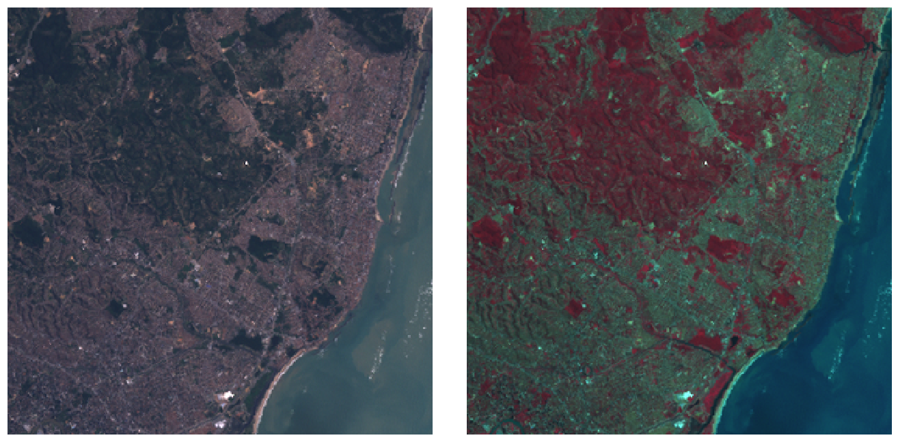{.lightbox width="582"}

  ``` r
  tif <- system.file("tif/L7_ETMs.tif", package = "stars")
  library(stars)
  # Loading required package: abind
  (r <- read_stars(tif))
  # stars object with 3 dimensions and 1 attribute
  # attribute(s):
  #              Min. 1st Qu. Median Mean 3rd Qu. Max.
  # L7_ETMs.tif     1      54     69 68.9      86  255
  # dimension(s):
  #      from  to  offset delta            refsys point x/y
  # x       1 349  288776  28.5 SIRGAS 2000 / ... FALSE [x]
  # y       1 352 9120761 -28.5 SIRGAS 2000 / ... FALSE [y]
  # band    1   6      NA    NA                NA    NA

  length(r)
  # [1] 1
  class(r[[1]])
  # [1] "array"
  dim(r[[1]])
  #    x    y band 
  #  349  352    6

  st_bbox(r)
  #    xmin    ymin    xmax    ymax 
  #  288776 9110729  298723 9120761

  plot(r)

  par(mfrow = c(1, 2))
  plot(r, rgb = c(3,2,1), reset = FALSE, main = "RGB")    # rgb
  plot(r, rgb = c(4,3,2), main = "False colour (NIR-R-G)") # false colour
  ```

  - Components
    - `from`: starting index
    - `to`: ending index
    - `offset`: dimension value at the start (edge) of the first pixel
    - `delta`: cell size; negative `delta` values indicate that pixel index increases with decreasing dimension values
    - `refsys`: reference system
    - `point`: logical, indicates whether cell values have point support or cell support
    - `x/y`: indicates whether a dimension is associated with a spatial raster x- or y-axis
  - For regular, rotated, or sheared grids or other regularly discretised dimensions (such as time), `offset` and `delta` are not `NA`
  - Irregular cases, `offset` and `delta` are `NA` and the `values` property contains one of:
    - In case of a rectilinear spatial raster or irregular time dimension, the sequence of values or intervals
    - In case of a vector data cube, geometries associated with the spatial dimension
    - In case of a curvilinear raster, the matrix with coordinate values for each raster cell
    - In case of a discrete dimension, the band names or labels associated with the dimension values

- By bracket

  - Attributes first (by name, index, or logical vector)
  - Followed by each dimension.
  - Selecting discontinuous ranges is supported only when it is a regular sequence
  - By default, `drop` is FALSE, when set to `TRUE` dimensions with a single value are dropped

- [Example]{.ribbon-highlight}: bracket and dplyr

  ``` r
  r[1:2, 101:200, , 5:10]

  # selecting particular ranges of dimension values
  filter(r, x > 289000, x < 290000)
  # stars object with 3 dimensions and 1 attribute
  # attribute(s):
  #              Min. 1st Qu. Median Mean 3rd Qu. Max.
  # L7_ETMs.tif     5      51     63 64.3      75  242
  # dimension(s):
  #      from  to  offset delta            refsys point x/y
  # x       1  35  289004  28.5 SIRGAS 2000 / ... FALSE [x]
  # y       1 352 9120761 -28.5 SIRGAS 2000 / ... FALSE [y]
  # band    1   6       1     1                NA    NA

  slice(r, band, 3)
  # stars object with 2 dimensions and 1 attribute
  # attribute(s):
  #              Min. 1st Qu. Median Mean 3rd Qu. Max.
  # L7_ETMs.tif    21      49     63 64.4      77  255
  # dimension(s):
  #   from  to  offset delta            refsys point x/y
  # x    1 349  288776  28.5 SIRGAS 2000 / ... FALSE [x]
  # y    1 352 9120761 -28.5 SIRGAS 2000 / ... FALSE [y]
  ```

  - Selects from r attributes 1-2, index 101-200 for dimension 1, and index 5-10 for dimension 3; omitting dimension 2 means that no subsetting takes place.
  - Note in components example, xmin of the bounding box was x's offset and ymax was y's offset. Now x's offset is 289004 after filtering.
    - x's to index has changed
  - `slice` selects the 3rd band and in the summary the band dimension is dropped since there's only 1 now
    - Neither to index has changed
  - `mutate` can be used on `stars` objects to add new arrays as functions of existing ones, `transmute` drops existing ones

- By buffer zone

  ``` r
  b <- st_bbox(r) |>
      st_as_sfc() |>
      st_centroid() |>
      st_buffer(units::set_units(500, m))
  r[b]
  # stars object with 3 dimensions and 1 attribute
  # attribute(s):
  #              Min. 1st Qu. Median Mean 3rd Qu. Max. NA's
  # L7_ETMs.tif    22      54     66 67.7    78.2  174 2184
  # dimension(s):
  #      from  to  offset delta            refsys point x/y
  # x     157 193  288776  28.5 SIRGAS 2000 / ... FALSE [x]
  # y     159 194 9120761 -28.5 SIRGAS 2000 / ... FALSE [y]
  # band    1   6      NA    NA                NA    NA

  r[b] |> st_normalize() |> st_dimensions()
  #      from to  offset delta            refsys point x/y
  # x       1 37  293222  28.5 SIRGAS 2000 / ... FALSE [x]
  # y       1 36 9116258 -28.5 SIRGAS 2000 / ... FALSE [y]
  # band    1  6      NA    NA                NA    NA

  # alternatively
  st_crop(r, b)
  ```

  - This object still has dimension indexes *relative to* the offset and delta values of r
  - `st_normalize` and `st_dimensions` set the object with the new offset
    - i.e. the indexes are reset so this r\[b\] is it's own independent stars object (if it was assigned to a variable). It's now been cropped

- Sample and Extract

  ``` r
  set.seed(115517)
  pts <- st_bbox(r) |> st_as_sfc() |> st_sample(20)
  (e <- st_extract(r, pts))
  # stars object with 2 dimensions and 1 attribute
  # attribute(s):
  #              Min. 1st Qu. Median Mean 3rd Qu. Max.
  # L7_ETMs.tif    12    41.8     63   61    80.5  145
  # dimension(s):
  #          from to            refsys point
  # geometry    1 20 SIRGAS 2000 / ...  TRUE
  # band        1  6                NA    NA
  #                                           values
  # geometry POINT (293002 ...,...,POINT (290941 ...
  # band                                        NULL
  ```

  - The output is a **vector data cube**

## Data Formats {#sec-geo-sptemp-datform .unnumbered}

### Misc {#sec-geo-sptemp-datform-misc .unnumbered}

- [{spacetime}]{style="color: #990000"} supported Time Classes: Date, POSIXt, timeDate ([{timeDate}]{style="color: #990000"}), yearmon ([{zoo}]{style="color: #990000"}), and yearqtr ([{zoo}]{style="color: #990000"})
- Data and Spatial Classes:
  - Points: Data having points support should use the SpatialPoints class for the spatial feature
  - Polygons: Values reflect aggregates (e.g., sums, or averages) over the polygon (SpatialPolygonsDataFrame, SpatialPolygons)
  - Grids: Values can be point data or aggregates over the cell.
- `stConstruct` creates "a [STFDF]{.arg-text} (full lattice/full grid) object if all space and time combinations occur only once, or else an object of class [STIDF]{.arg-text} (irregular grid), which might be coerced into other representations."
- [STFDF]{.arg-text} and [{stars}]{style="color: #990000"} objects require dimension elements to have the same order as the columns or rows in the attribute matrix or array.
  - Order the space dimension to be the same as the attribute object ([Long](geospatial-spat-temp.qmd#sec-geo-sptemp-datform-long){style="color: green"} \>\> Example 4)

    ``` r
    bristol_longer <- bristol_od |> 
        select(-all) |> 
        pivot_longer(3:6, names_to = "mode", values_to = "n")
    # unique origin locations
    od <- bristol_tidy |> pull("o") |> unique()

    # order of the rows of the eventual attribute
    order <- match(od, bristol_zones$geo_code)
    # reorders eventual space dimension to match attribute order
    zones <- st_geometry(bristol_zones)[order]
    ```
- Latitude and Longitude to using [{sp}]{style="color: #990000"}
  - [Example]{.ribbon-highlight}: ([source](https://www.r-bloggers.com/2015/08/spatio-temporal-kriging-in-r/))

    ``` r
    # Create a SpatialPointsDataFrame
    coordinates(df) <- ~ LON + LAT
    projection(df) <- CRS("+init=epsg:4326")

    # Transform into Mercator Projection
    # SpatialPointsDataFrame with coordinates in meters.
    ozone.UTM <- spTransform(df, CRS("+init=epsg:3395"))
    # SpatialPoints
    ozoneSP <- SpatialPoints(ozone.UTM@coords, CRS("+init=epsg:3395")) 
    ```

### Long {#sec-geo-sptemp-datform-long .unnumbered}

- The full spatio-temporal information (i.e. response value) is held in a single column, and location and time are also single columns.

- [Example 1]{.ribbon-highlight}: Private capital stock (?)

  ``` r
  #>     state year region     pcap     hwy   water    util       pc   gsp
  #> 1 ALABAMA 1970      6 15032.67 7325.80 1655.68 6051.20 35793.80 28418
  #> 2 ALABAMA 1971      6 15501.94 7525.94 1721.02 6254.98 37299.91 29375
  #> 3 ALABAMA 1972      6 15972.41 7765.42 1764.75 6442.23 38670.30 31303
  #> 4 ALABAMA 1973      6 16406.26 7907.66 1742.41 6756.19 40084.01 33430
  #> 5 ALABAMA 1974      6 16762.67 8025.52 1734.85 7002.29 42057.31 33749
  ```

  - Each row is a single time unit and space unit combination.
  - This is likely not the row order you want though. I think these spatio-temporal object creation functions want ordered by time, then by space. (See Example)

- [Example 2]{.ribbon-highlight}: Create full grid spacetime object from a long table (7.2 Panel Data in [{spacetime}]{style="color: #990000"} vignette)

  ::: panel-tabset
  ## Input Data

  ``` r
  head(df_data); tail(df_data)
  #>          state year region      pcap      hwy    water     util        pc    gsp    emp unemp
  #> 1      ALABAMA 1970      6  15032.67  7325.80  1655.68  6051.20  35793.80  28418 1010.5   4.7
  #> 18     ARIZONA 1970      8  10148.42  4556.81  1627.87  3963.75  23585.99  19288  547.4   4.4
  #> 35    ARKANSAS 1970      7   7613.26  3647.73   644.99  3320.54  19749.63  15392  536.2   5.0
  #> 52  CALIFORNIA 1970      9 128545.36 42961.31 17837.26 67746.79 172791.92 263933 6946.2   7.2
  #> 69    COLORADO 1970      8  11402.52  4403.21  2165.03  4834.28  23709.75  25689  750.2   4.4
  #> 86 CONNECTICUT 1970      1  15865.66  7237.14  2208.10  6420.42  24082.38  38880 1197.5   5.6
  #>             state year region     pcap      hwy   water     util       pc   gsp    emp unemp
  #> 731       VERMONT 1986      1  2936.44  1830.16  335.51   770.78  6939.39  7585  234.4   4.7
  #> 748      VIRGINIA 1986      5 28000.68 14253.92 4786.93  8959.83 71355.78 88171 2557.7   5.0
  #> 765    WASHINGTON 1986      9 41136.36 11738.08 5042.96 24355.32 66033.81 67158 1769.9   8.2
  #> 782 WEST_VIRGINIA 1986      5 10984.38  7544.99  834.01  2605.38 35781.74 21705  597.5  12.0
  #> 799     WISCONSIN 1986      3 26400.60 10848.68 5292.62 10259.30 60241.65 70171 2023.9   7.0
  #> 816       WYOMING 1986      8  5700.41  3400.96  565.58  1733.88 27110.51 10870  196.3   9.0

  yrs <- 1970:1986
  vec_time <- 
    as.POSIXct(paste(yrs, "-01-01", sep=""), tz = "GMT")
  head(vec_time)
  #> [1] "1970-01-01 GMT" "1971-01-01 GMT" "1972-01-01 GMT" "1973-01-01 GMT" "1974-01-01 GMT" "1975-01-01 GMT"

  head(spatial_geom_ids)
  #> [1] "alabama"     "arizona"     "arkansas"    "california"  "colorado"    "connecticut"
  class(geom_states)
  #> [1] "SpatialPolygons"
  #> attr(,"package")
  #> [1] "sp"
  ```

  - The names of the objects above don't the match the ones in the example, but I wanted names that were more informative about what types of objects were needed. The package documentation and vignette are spotty with their descriptions and explanations.
  - **The row order of the spatial geometry object should match the row order of the spatial feature column (in each time section) of the dataframe.**
  - The [data_df]{.var-text} only has the state name (all caps) and the year as space and time features.
  - [spatial_geom_ids]{.var-text} shows the order of the spatial geometry object (state polygons) which are state names in alphabetical order.
    - At least in this example, the geometry object ([geom_states]{.var-text}) didn't store the actual state names. It just used a id index (e.g. [ID1]{.var-text}, [ID2]{.var-text}, etc.)

  ## STFDF Object

  ``` r
  st_data <- 
    STFDF(sp = geom_states, 
          time = vec_time, 
          data = df_data)

  length(st_data)
  #> [1] 816
  nrow(df_data)
  #> [1] 816
  class(st_data)
  #> [1] "STFDF"
  #> attr(,"package")
  #> [1] "spacetime"

  df_st_data <- as.data.frame(st_data)
  head(df_st_data[1:6]); tail(df_st_data[1:6])
  #>           V1       V2 sp.ID       time    endTime timeIndex
  #> 1  -86.83042 32.80316   ID1 1970-01-01 1971-01-01         1
  #> 2 -111.66786 34.30060   ID2 1970-01-01 1971-01-01         1
  #> 3  -92.44013 34.90418   ID3 1970-01-01 1971-01-01         1
  #> 4 -119.60154 37.26901   ID4 1970-01-01 1971-01-01         1
  #> 5 -105.55251 38.99797   ID5 1970-01-01 1971-01-01         1
  #> 6  -72.72598 41.62566   ID6 1970-01-01 1971-01-01         1
  #>             V1       V2 sp.ID       time    endTime timeIndex
  #> 811  -72.66686 44.07759  ID44 1986-01-01 1987-01-01        17
  #> 812  -78.89655 37.51580  ID45 1986-01-01 1987-01-01        17
  #> 813 -120.39569 47.37073  ID46 1986-01-01 1987-01-01        17
  #> 814  -80.62365 38.64619  ID47 1986-01-01 1987-01-01        17
  #> 815  -90.01171 44.63285  ID48 1986-01-01 1987-01-01        17
  #> 816 -107.55736 43.00390  ID49 1986-01-01 1987-01-01        17
  ```

  - So combining of these objects into a spacetime object doesn't seemed be based any names (e.g. a joining variable) of the elements of these separate objects.
  - STFDF arguments:
    - [sp]{.arg-text}: An object of class [Spatial]{.arg-text}, having n elements
    - [time]{.arg-text}: An object holding time information, of length m;
    - [data]{.arg-text}: A data frame with n\*m rows corresponding to the observations
  - Converting back to a dataframe adds 6 new columns to [df_data]{.var-text}:
    - [V1]{.var-text}, [V2]{.var-text}: Latitude, Longitude
    - [sp.ID]{.var-text}: IDs within the spatial geomtry object (geom_states)
    - [time]{.var-text}: Time object values
    - [endTime]{.var-text}: Used for intervals
    - [timeIndex]{.var-text}: An index of time "sections" in the data dataframe. (e.g. 1:17 for 17 unique year values)
  :::

- [Example 3]{.ribbon-highlight}: Convert a STFDF to Long Format [{sf}]{style="color: #990000"} dataframe ([source](geospatial-spat-temp.qmd#sec-geo-sptemp-krig-ex){style="color: green"} \>\> Example 1)

  ``` r
  library(dplyr)

  data(air, package = "spacetime")

  # get rural location time series from 2005 to 2010
  rural <- spacetime::STFDF(
    sp = stations, 
    time = dates, 
    data = data.frame(PM10 = as.vector(air))
  )
  rr <- rural[,"2005::2010"]

  # remove station ts w/all NAs
  unsel <- which(apply(
    as(rr, "xts"), 
    2, 
    function(x) all(is.na(x)))
  )
  r5to10 <- rr[-unsel,]


  # Convert to Long Format
  crs_r5 <- sp::proj4string(r5to10@sp)
  sf_r5 <- as.data.frame(r5to10) |> 
    sf::st_as_sf(coords = c("coords.x1", "coords.x2"), crs = crs_r5) |>
    sf::st_transform(crs = 25832) |> # projected, UTM zone 32N
    filter(!is.na(PM10)) |> 
    rename(
      date = time, 
      pm10 = PM10,
      station_id = sp.ID
    ) |> 
    select(-endTime, -timeIndex)

  tib_pm10 <- sf_r5 |> 
    mutate(
      date_feat = date, # extra for feat eng
      X = sf::st_coordinates(geometry)[, 1],
      Y = sf::st_coordinates(geometry)[, 2]
    ) |> 
    sf::st_drop_geometry()
  ```

  - The essential elements here are pulling the CRS using [{sp}]{style="color: #990000"} `proj4string` and converting to a dataframe using the [{spacetime}]{style="color: #990000"}`as.data.frame` method

- [Example 4]{.ribbon-highlight}: Origin-Destination (no time) Table to [{stars}]{style="color: #990000"}

  ::: panel-tabset
  ## Data and Set-Up

  A table which counts trips from different origins to destinations using various modes of transportation gets converted to a [{stars}]{style="color: #990000"} object

  Also see [Time-wide](geospatial-spat-temp.qmd#sec-geo-sptemp-datform-timew){style="color: green"} \>\> Example 2 for an example of space-time matrix being converted to a [{stars}]{style="color: #990000"} object

  ``` r
  library(dplyr); library(stars)

  data("bristol_zones", package = "spDataLarge")
  data("bristol_od", package = "spDataLarge")

  head(bristol_od)
  #> # A tibble: 6 × 7
  #>   o         d           all bicycle  foot car_driver train
  #>   <chr>     <chr>     <dbl>   <dbl> <dbl>      <dbl> <dbl>
  #> 1 E02002985 E02002985   209       5   127         59     0
  #> 2 E02002985 E02002987   121       7    35         62     0
  #> 3 E02002985 E02003036    32       2     1         10     1
  #> 4 E02002985 E02003043   141       1     2         56    17
  #> 5 E02002985 E02003049    56       2     4         36     0
  #> 6 E02002985 E02003054    42       4     0         21     0

  class(bristol_zones)
  #> [1] "sf"         "data.frame"
  head(bristol_zones)
  #> Simple feature collection with 6 features and 2 fields
  #> Geometry type: MULTIPOLYGON
  #> Dimension:     XY
  #> Bounding box:  xmin: -2.707892 ymin: 51.28248 xmax: -2.460934 ymax: 51.54443
  #> Geodetic CRS:  WGS 84
  #>       geo_code                             name                       geometry
  #> 2905 E02002985 Bath and North East Somerset 001 MULTIPOLYGON (((-2.510462 5...
  #> 2907 E02002987 Bath and North East Somerset 003 MULTIPOLYGON (((-2.476122 5...
  #> 2925 E02003005 Bath and North East Somerset 021 MULTIPOLYGON (((-2.55073 51...
  #> 2932 E02003012                      Bristol 001 MULTIPOLYGON (((-2.595763 5...
  #> 2933 E02003013                      Bristol 002 MULTIPOLYGON (((-2.593783 5...
  #> 2934 E02003014                      Bristol 003 MULTIPOLYGON (((-2.639581 5...

  nrow(bristol_zones)
  #> [1] 102
  # number origin-destination pairs not present in the data
  nrow(bristol_zones)^2 - nrow(bristol_od) 
  #> [1] 7494
  ```

  - This doesn't have a time column, but I thought it was a good example of creating a [{stars}]{style="color: #990000"} object with multiple space dimensions and a categorical dimension
    - To see how to do this with coordinates and a time dimension, see [Kriging \>\> Examples](geospatial-spat-temp.qmd#sec-geo-sptemp-krig-ex){style="color: green"} \>\> Example 3 \>\> Catboost \>\> Process Predictions

  ## Create Array

  ``` r
  # index used to fill the array
  bristol_longer <- bristol_od |> 
    select(-all) |> 
    tidyr::pivot_longer(3:6, names_to = "mode", values_to = "n")
  head(bristol_tidy)
  #> # A tibble: 6 × 4
  #>   o         d         mode           n
  #>   <chr>     <chr>     <chr>      <dbl>
  #> 1 E02002985 E02002985 bicycle        5
  #> 2 E02002985 E02002985 foot         127
  #> 3 E02002985 E02002985 car_driver    59
  #> 4 E02002985 E02002985 train          0
  #> 5 E02002985 E02002987 bicycle        7
  #> 6 E02002985 E02002987 foot          35

  bris_trans_modes <- bristol_longer |> pull("mode") |> unique()

  # create zero-array with appropriate dims and dimnames
  arr_bris = array(
    0L,  
    dim = c(
      length(bristol_zones$geo_code), 
      length(bristol_zones$geo_code),
      length(bris_trans_modes)
    ),
    dimnames = list(
      origin = bristol_zones$geo_code, 
      dest = bristol_zones$geo_code, 
      trans_mode = bris_trans_modes)
  )
  dim(arr_bris)
  #> [1] 102 102   4


  arr_bris_idx <- as.matrix(bristol_longer[c("o", "d", "mode")])
  # fill in counts at these array indexes.
  arr_bris[arr_bris_idx] <- bristol_longer$n
  ```

  - A three dimensional [array]{.arg-text} is created with the origin, destination, and mode of transportation as dimensions.
  - I feel like [bristol_zones]{.var-text} is a sort of look-up table. So, I'm using it to create dim sizes and dim names in [arr_bris]{.var-text}, because [bristol_od]{.var-text} could be a monthly table that may not include one of the zones as an origin or destination in the future.
    - In this case, [bristol_od]{.var-text} does happen to have all zones in [o]{.var-text} and [d]{.var-text}.
    - This could also be the case with [mode]{.var-text}, but there is nothing that looks like a mode of transportation look-up table in [{spDataLarge}]{style="color: #990000"}. So, I'm just trusting all possible [modes]{.var-text} are included in [bristol_od]{.var-text}.
  - The [array]{.arg-text} is filled with counts ([n]{.var-text}) according to the index ([bristol_longer]{.var-text}).
    - The order of the columns in the [bristol_longer]{.var-text} are the same as the order of the dims and dimnames specified in the zero-array.
    - If it were the case that [bristol_od]{.var-text} didn't have one of the possible zones, this filling procedure would still be fine. The zone-to-zone combination in the zero-array that didn't get filled with a [n]{.var-text} value would just remain 0.

  ## Create stars Object

  ``` r
  (star_dims_bris <- st_dimensions(
    origin = st_geometry(bristol_zones), 
    dest = st_geometry(bristol_zones), 
    trans_mode = bris_trans_modes
  ))
  #>            from  to refsys point                                                        values
  #> origin        1 102 WGS 84 FALSE MULTIPOLYGON (((-2.510462...,...,MULTIPOLYGON (((-2.55007 ...
  #> dest          1 102 WGS 84 FALSE MULTIPOLYGON (((-2.510462...,...,MULTIPOLYGON (((-2.55007 ...
  #> trans_mode    1   4     NA FALSE                                             bicycle,...,train

  (star_bris_od <- st_as_stars(
    list(n_trips = arr_bris), 
    dimensions = star_dims_bris
  ))
  #> stars object with 3 dimensions and 1 attribute
  #> attribute(s):
  #>          Min. 1st Qu. Median     Mean 3rd Qu. Max.
  #> n_trips     0       0      0 4.801591       0 1296
  #> dimension(s):
  #>            from  to refsys point                                                        values
  #> origin        1 102 WGS 84 FALSE MULTIPOLYGON (((-2.510462...,...,MULTIPOLYGON (((-2.55007 ...
  #> dest          1 102 WGS 84 FALSE MULTIPOLYGON (((-2.510462...,...,MULTIPOLYGON (((-2.55007 ...
  #> trans_mode    1   4     NA FALSE                                             bicycle,...,train
  ```

  - The method of `st_as_stars` used for an [array]{.arg-text} is the same as for matrix which is [list]{.arg-text}.
  - The two space dimensions have geometries which is what we expect for space variables, but a grouping variable (3rd array dimension) is also included
  - As with creating [STFDF]{.arg-text} objects, all space (and time if it were here) dimensions are unique vectors.
  :::

### Space-wide {#sec-geo-sptemp-datform-spacew .unnumbered}

- Each space unit is a column

- [Example 1]{.ribbon-highlight}: Wind speeds

  ``` r
  #>   year month day   RPT   VAL   ROS   KIL   SHA  BIR   DUB   CLA   MUL
  #> 1   61     1   1 15.04 14.96 13.17  9.29 13.96 9.87 13.67 10.25 10.83
  #> 2   61     1   2 14.71 16.88 10.83  6.50 12.62 7.67 11.50 10.04  9.79
  #> 3   61     1   3 18.50 16.88 12.33 10.13 11.17 6.17 11.25  8.04  8.50
  #> 4   61     1   4 10.58  6.63 11.75  4.58  4.54 2.88  8.63  1.79  5.83
  #> 5   61     1   5 13.33 13.25 11.42  6.17 10.71 8.21 11.92  6.54 10.92
  #> 6   61     1   6 13.21  8.12  9.96  6.67  5.37 4.50 10.67  4.42  7.17
  ```

  - Each row is a unique time unit

- [Example 2]{.ribbon-highlight}: Create full grid spacetime object from a space-wide table (7.3 Interpolating Irish Wind in [{spacetime}]{style="color: #990000"} vignette)

  ::: panel-tabset
  ## Input Data

  ``` r
  class(mat_wind_velos)
  #> [1] "matrix" "array" 
  dim(mat_wind_velos)
  #> [1] 6574   12
  mat_wind_velos[1:6, 1:6]
  #>             RPT        VAL         ROS         KIL         SHA        BIR
  #> [1,] 0.47349183  0.4660816  0.29476767 -0.12216857  0.37172544 -0.0549353
  #> [2,] 0.43828072  0.6342761  0.04762928 -0.48431251  0.23530275 -0.3264873
  #> [3,] 0.76797566  0.6297610  0.20133157 -0.03446898  0.07989186 -0.5358676
  #> [4,] 0.01118683 -0.4751407  0.13684623 -0.78709720 -0.79381717 -1.1049744
  #> [5,] 0.29298091  0.2851083  0.09805298 -0.54439303  0.02147079 -0.2707680
  #> [6,] 0.27715281 -0.2860777 -0.06624749 -0.47759668 -0.66795421 -0.8085874

  class(wind$time)
  #> [1] "POSIXct" "POSIXt" 
  wind$time[1:5]
  #> [1] "1961-01-01 12:00:00 GMT" "1961-01-02 12:00:00 GMT" "1961-01-03 12:00:00 GMT" "1961-01-04 12:00:00 GMT" "1961-01-05 12:00:00 GMT"

  class(geom_stations)
  #> [1] "SpatialPoints"
  #> attr(,"package")
  #> [1] "sp"
  ```

  - See Long \>\> Example \>\> Create full grid spacetime object for a more detailed breakdown of creating these objects
  - **The order of station geometries in [geom_stations]{.var-text} should match the order of the columns in [mat_wind_velos]{.var-text}**
    - In the vignette, the data used to create the geometry object is ordered according to the matrix using `match`. See [R, Base R \>\> Functions](r-base-r.qmd#sec-r-baser-funs){style="color: green"} \>\> `match` for the code.

  ## STFDF Object

  ``` r
  st_wind = 
    stConstruct(
      # space-wide matrix
      x = mat_wind_velos, 
      # index for spatial feature/spatial geometries
      space = list(values = 1:ncol(mat_wind_velos)),
      # datetime column from original data
      time = wind$time, 
      # spatial geometry
      SpatialObj = geom_stations, 
      interval = TRUE
    )
  class(st_wind)
  #> [1] "STFDF"
  #> attr(,"package")
  #> [1] "spacetime"

  df_st_wind <- as.data.frame(st_wind)
  dim(df_st_wind)
  #> [1] 78888     7
  head(df_st_wind); tail(df_st_wind)
  #>   coords.x1 coords.x2 sp.ID                time             endTime timeIndex     values
  #> 1  551716.7   5739060     1 1961-01-01 12:00:00 1961-01-02 12:00:00         1  0.4734918
  #> 2  414061.0   5754361     2 1961-01-01 12:00:00 1961-01-02 12:00:00         1  0.4660816
  #> 3  680286.0   5795743     3 1961-01-01 12:00:00 1961-01-02 12:00:00         1  0.2947677
  #> 4  617213.8   5836601     4 1961-01-01 12:00:00 1961-01-02 12:00:00         1 -0.1221686
  #> 5  505631.2   5838902     5 1961-01-01 12:00:00 1961-01-02 12:00:00         1  0.3717254
  #> 6  574794.2   5882123     6 1961-01-01 12:00:00 1961-01-02 12:00:00         1 -0.0549353
  #>       coords.x1 coords.x2 sp.ID                time             endTime timeIndex    values
  #> 78883  682680.1   5923999     7 1978-12-31 12:00:00 1979-01-01 12:00:00      6574 0.8600970
  #> 78884  501099.9   5951999     8 1978-12-31 12:00:00 1979-01-01 12:00:00      6574 0.1589576
  #> 78885  608253.8   5932843     9 1978-12-31 12:00:00 1979-01-01 12:00:00      6574 0.1536922
  #> 78886  615289.0   6005361    10 1978-12-31 12:00:00 1979-01-01 12:00:00      6574 0.1325158
  #> 78887  434818.6   6009945    11 1978-12-31 12:00:00 1979-01-01 12:00:00      6574 0.2058466
  #> 78888  605634.5   6136859    12 1978-12-31 12:00:00 1979-01-01 12:00:00      6574 1.0835638
  ```

  - [space]{.arg-text} has a confusing description. Here it's just a numerical index for the number of columns of [mat_wind_velos]{.var-text} which would match an index/order for the geometries in [geom_stations]{.var-text}.
  - [interval = TRUE]{.arg-text}, since the values are daily mean wind speed (aggregation)
    - See Time and Movement section
  - [df_st_wind]{.var-text} is in long format
  :::

### Time-wide {#sec-geo-sptemp-datform-timew .unnumbered}

- Each time unit is a column

- [Example 1]{.ribbon-highlight}: Counts of SIDS

  ``` r
  #>          NAME BIR74 SID74 NWBIR74 BIR79 SID79 NWBIR79
  #> 1        Ashe  1091     1      10  1364     0      19
  #> 2   Alleghany   487     0      10   542     3      12
  #> 3       Surry  3188     5     208  3616     6     260
  #> 4   Currituck   508     1     123   830     2     145
  #> 5 Northampton  1421     9    1066  1606     3    1197
  ```

  - [SID74]{.var-text} contains to the infant death syndrome cases for each county at a particular time period (1974-1984). [SID79]{.var-text} are SIDS deaths from 1979-84.
    - [NWB]{.var-text} is non-white births, [BIR]{.var-text} is births.
  - Each row is a spatial unit and unique

- [Example 2]{.ribbon-highlight}: Space × Time Matrix to [{stars}]{style="color: #990000"} Object (i.e. [STFDF]{.arg-text})

  ::: panel-tabset
  ## Convert Matrix to stars

  A table with German PM10 air polution meausrements at different stations over multiple year period gets converted to a [{stars}]{style="color: #990000"} object\
  \
  Also see [Long](geospatial-spat-temp.qmd#sec-geo-sptemp-datform-long){style="color: green"} \>\> Example 4 for an example of creating a [{stars}]{style="color: #990000"} object with three dimensions (array)

  ``` r
  library(stars)

  data(air, package = "spacetime")
  # where space is the dimname for stations (rows)
  # and time is the dimname for dates (columns)
  dim(air) 
  #> space  time 
  #>    70  4383 
  air[1:10, 1000:1010]
  #>           [,1]   [,2]   [,3]   [,4]   [,5]   [,6]   [,7]   [,8]   [,9]  [,10]  [,11]
  #> DESH001 25.521 34.833 25.854 36.021 52.562 59.833 29.458 26.146 22.312 32.789 15.729
  #> DENI063 30.083 45.795 35.979 36.087 73.167 79.792 34.354 37.104 33.000 36.625 14.417
  #> DEUB038     NA     NA     NA     NA     NA     NA     NA     NA     NA     NA     NA
  #> DEBE056     NA     NA     NA     NA     NA     NA     NA     NA     NA     NA     NA
  #> DEBE062     NA     NA     NA     NA     NA     NA     NA     NA     NA     NA     NA
  #> DEBE032     NA     NA     NA     NA     NA     NA     NA     NA     NA     NA     NA
  #> DEHE046 24.562 21.479 25.771 29.646 48.688 24.542 13.479  9.958 14.333 17.625 13.333
  #> DEUB007     NA     NA     NA     NA     NA     NA     NA     NA     NA     NA     NA
  #> DENW081     NA     NA     NA     NA     NA     NA     NA     NA     NA     NA     NA
  #> DESH008 30.875 35.542 32.042 36.417 54.625 60.000 41.583 24.292 22.542 34.250 16.750

  class(stations)
  #> [1] "SpatialPoints"
  #> attr(,"package")
  #> [1] "sp"
  head(stations)
  #> SpatialPoints:
  #>         coords.x1 coords.x2
  #> DESH001  9.585911  53.67057
  #> DENI063  9.685030  53.52418
  #> DEUB038  9.791584  54.07312
  #> DEBE056 13.647013  52.44775
  #> DEBE062 13.296353  52.65315
  #> DEBE032 13.225856  52.47309
  #> Coordinate Reference System (CRS) arguments: +proj=longlat +datum=WGS84 +no_defs 

  sfc_stations <- stations |>
    sf::st_as_sf(coords = c("coords.x1", "coords.x2"), crs = 4326) |>
    sf::st_geometry()
  class(sfc_stations)
  #> [1] "sfc_POINT" "sfc" 
  head(sfc_stations)
  #> Geometry set for 6 features 
  #> Geometry type: POINT
  #> Dimension:     XY
  #> Bounding box:  xmin: 9.585911 ymin: 52.44775 xmax: 13.64701 ymax: 54.07312
  #> Geodetic CRS:  +proj=longlat +datum=WGS84 +no_defs
  #> First 5 geometries:
  #> POINT (9.585911 53.67057)
  #> POINT (9.68503 53.52418)
  #> POINT (9.791584 54.07312)
  #> POINT (13.64701 52.44775)
  #> POINT (13.29635 52.65315)

  class(dates)
  #> [1] "Date"
  summary(dates)
  #>         Min.      1st Qu.       Median         Mean      3rd Qu.         Max. 
  #> "1998-01-01" "2000-12-31" "2004-01-01" "2004-01-01" "2006-12-31" "2009-12-31"

  star_dims <- st_dimensions(
    station = sfc_stations, 
    time = dates
  )

  star_air <- st_as_stars(
    .x = list(pm10 = air), 
    dimensions = star_dims
  )
  star_air
  #> stars object with 2 dimensions and 1 attribute
  #> attribute(s):
  #>       Min. 1st Qu. Median     Mean 3rd Qu.    Max.   NA's
  #> pm10     0   9.921 14.792 17.69728  21.992 274.333 157659
  #> dimension(s):
  #>         from   to     offset  delta                       refsys point
  #> station    1   70         NA     NA +proj=longlat +datum=WGS8...  TRUE
  #> time       1 4383 1998-01-01 1 days                         Date FALSE
  #>                                                          values
  #> station POINT (9.585911 53.67057),...,POINT (9.446661 49.24068)
  #> time                                                       NULL
  ```

  - Similar contruction to a [STFDF]{.arg-text} object. Guessing order of dates and stations object need to have the same order as they are in the space-time matrix
    - See [Long](geospatial-spat-temp.qmd#sec-geo-sptemp-datform-long){style="color: green"} \>\> Example 2 and [Space-wide](geospatial-spat-temp.qmd#sec-geo-sptemp-datform-spacew){style="color: green"} \>\> Example 2 for more details on what this means.
  - [sfc_stations]{.var-text} is the extracted geometry column of a [sf]{.arg-text} dataframe. It's essentially just a coordinates matrix with attributes.

  ## Structure of Stars Object

  ``` r
  str(stars_air)
  #> List of 1
  #> $ pm10: num [1:70, 1:4383] NA NA NA NA NA NA NA NA NA NA ...
  #> ..- attr(*, "dimnames")=List of 2
  #> .. ..$ : chr [1:70] "DESH001" "DENI063" "DEUB038" "DEBE056" ...
  #> .. ..$ : NULL
  #> - attr(*, "dimensions")=List of 2
  #> ..$ station:List of 7
  #> .. ..$ from  : num 1
  #> .. ..$ to    : int 70
  #> .. ..$ offset: num NA
  #> .. ..$ delta : num NA
  #> .. ..$ refsys:List of 2
  #> .. .. ..$ input: chr "+proj=longlat +datum=WGS84 +no_defs"
  #> .. .. ..$ wkt  : chr "GEOGCRS[\"unknown\",\n    DATUM[\"World Geodetic System 1984\",\n        ELLIPSOID[\"WGS 84\",6378137,298.25722"| __truncated__
  #> .. .. ..- attr(*, "class")= chr "crs"
  #> .. ..$ point : logi TRUE
  #> .. ..$ values:sfc_POINT of length 70; first list element:  'XY' num [1:2] 9.59 53.67
  #> .. ..- attr(*, "class")= chr "dimension"
  #> ..$ time   :List of 7
  #> .. ..$ from  : num 1
  #> .. ..$ to    : int 4383
  #> .. ..$ offset: Date[1:1], format: "1998-01-01"
  #> .. ..$ delta : 'difftime' num 1
  #> .. .. ..- attr(*, "units")= chr "days"
  #> .. ..$ refsys: chr "Date"
  #> .. ..$ point : logi FALSE
  #> .. ..$ values: NULL
  #> .. ..- attr(*, "class")= chr "dimension"
  #> ..- attr(*, "raster")=List of 4
  #> .. ..$ affine     : num [1:2] 0 0
  #> .. ..$ dimensions : chr [1:2] NA NA
  #> .. ..$ curvilinear: logi FALSE
  #> .. ..$ blocksizes : NULL
  #> .. ..- attr(*, "class")= chr "stars_raster"
  #> ..- attr(*, "class")= chr "dimensions"
  #> - attr(*, "class")= chr "stars"
  ```
  :::

### Time and Movement {#sec-geo-sptemp-datform-tam .unnumbered}

{.lightbox width="432"}

- s1 refers to the first feature/location, t1 to the first time instance or interval, thick lines indicate time intervals, arrows indicate movement. Filled circles denote start time, empty circles end times, intervals are right-closed
- Spatio-temporal objects essentially needs specification of the spatial, the temporal, and the data values
- *Intervals* - The spatial feature (e.g. location) or its associated data values does not change during this interval, but reflects the value or state during this interval (e.g. an average)
  - e.g. yearly mean temperature at a set of locations
- *Instants* - Reflects moments of change (e.g., the start of the meteorological summer), or events with a zero or negligible duration (e.g., an earthquake, a lightning).
- *Movement* - Reflects objects may change location during a time interval. For time instants. locations are at a particular moment, and movement occurs between registered (time, feature) pairs and must be continuous.
- *Trajectories* - Where sets of (irregular) space-time points form sequences, and depict a trajectory.
  - Their grouping may be simple (e.g., the trajectories of two persons on different days), nested (for several objects, a set of trajectories representing different trips) or more complex (e.g., with objects that split, merge, or disappear).
  - Examples
    - Human trajectories
    - Mobile sensor measurements (where the sequence is kept, e.g., to derive the speed and direction of the sensor)
    - Trajectories of tornados where the tornado extent of each time stamp can be reflected by a different polygon

## EDA {#sec-geo-sptemp-eda .unnumbered}

### Misc {#sec-geo-sptemp-eda-misc .unnumbered}

- Also see [EDA, Time Series](eda-time-series.qmd#sec-eda-ts){style="color: green"}
- Recommended workflow prior to starting spatio-temporal analysis ([source](https://www.youtube.com/watch?v=P18CZinoKos&list=WL&index=2))
  - Go from simple analysis to complex (analysis) to get a feel for your data first. A lot of times, you probably will not need to do a spatio-temporal analysis at all.
  - Steps
    1.  Run univariate/multivariate analysis while ignoring space and time variables
    2.  Aggregate over locations (e.g. average across all time points for each location). Then run spatial analysis (e.g. spatial regression, kriging, etc.).
        - Looking for patterns, hotspots, etc.
        - `group_by(location) |> summarize(median_val = median(val))`
        - e.g. min, mean, median, or max depending on the project
    3.  Aggregate over time (e.g. average across all locations for each time point). Then run time series analysis (e.g. moving average, arima, etc.).
        - Looking trend, seasonality, shocks, etc.
        - `group_by(date) |> summarize(max_val = max(val))`
    4.  Select interesting or important locations (e.g. top sales store, crime hotspot) and run a time series analysis on that location's data
    5.  Select interesting or important time points (e.g. holiday, noon) and run a spatial analysis on that time point
    6.  Run a spatio-temporal analysis
- Check for duplicate locations:
  - Kriging cannot handle duplicate locations and returns an error, generally in the form of a “singular matrix”.

  - [Examples]{.ribbon-highlight}:

    ``` r
    dupl <- sp::zerodist(spatialpoints_obj)

    # sf
    dup <- duplicated(st_coordinates(sf_obj))
    log_mat <- st_equals(sf_obj)

    # terra (or w/spatraster, spatvector)
    d <- distance(lon_lat_mat)
    log_mat <- which(d == 0, arr.ind = TRUE)

    # base r
    dup_indices <- duplicated(df[, c("lat", "long")])

    # within a tolerance
    # Find points within 0.01 distance
    dup_pairs <- st_is_within_distance(sf_obj, dist = 0.01, sparse = FALSE)
    ```

### General {#sec-geo-sptemp-eda-gen .unnumbered}

- [Example 1]{.ribbon-highlight}: Days per Location\
  {.lightbox width="532"}

  <Details>

  <Summary>Code</Summary>

  ``` r
  library(dplyr); library(ggplot2)

  data(DE_RB_2005, package = "gstat")
  class(DE_RB_2005)
  #> [1] "STSDF"

  tibble(station_index = DE_RB_2005@index[,1]) |> 
    count(station_index) |> 
    ggplot(aes(x = station_index, y = n)) +
    geom_col(fill = "#2c3e50") + 
    scale_x_continuous(breaks = seq.int(0, length(unique(DE_RB_2005@index[,1])), 10)) +
    ylab("Number of Days") +
    ggtitle("Reported Days per Station") +
    theme_notebook()

  # station names for some indexes w/low number of days
  row.names(DE_RB_2005@sp)[c(4, 16, 52, 67, 68, 69)]
  #> [1] "DEUB038"   "DEUB039"   "DEUB026"   "DEHE052.1" "DEHE042.1" "DEHE060"
  ```

  </Details>

  - If there's there are locations with few observations on too many days, this can result in volatile variograms.

- [Example 2]{.ribbon-highlight}: Station vs. Days ([source](https://r-spatial.org/book/07-Introsf.html#example-aggregating-air-quality-time-series))\
  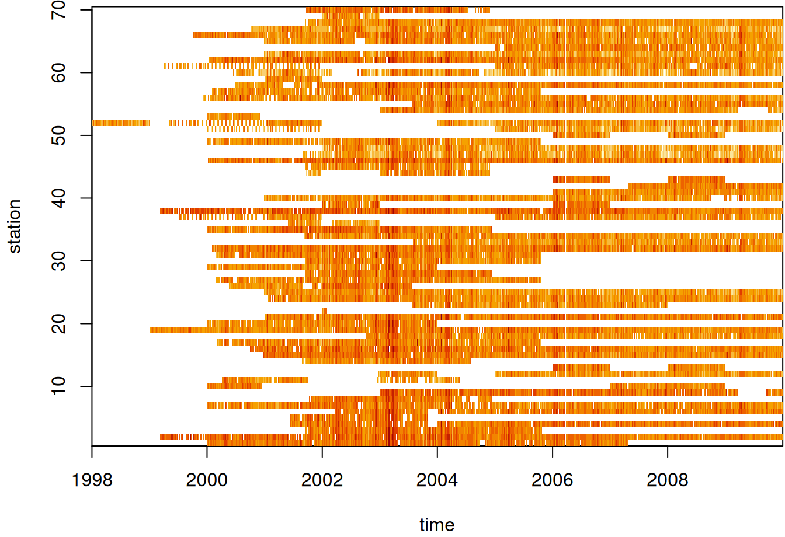{.lightbox}

  ``` r
  par(mar = c(5.1, 4.1, 0.3, 0.1))
  image(aperm(log(star_pm10), 2:1), main = NULL)
  ```

  - See [Data Formats](geospatial-spat-temp.qmd#sec-geo-sptemp-datform){style="color: green"} \>\> Time-wide \>\> Example 2 for the code for [star_pm10]{.var-text}
  - Missing values in white I assume.

- [Example 3]{.ribbon-highlight}: Mean Value by Location ([source](https://r-spatial.org/book/07-Introsf.html#example-aggregating-air-quality-time-series))\
  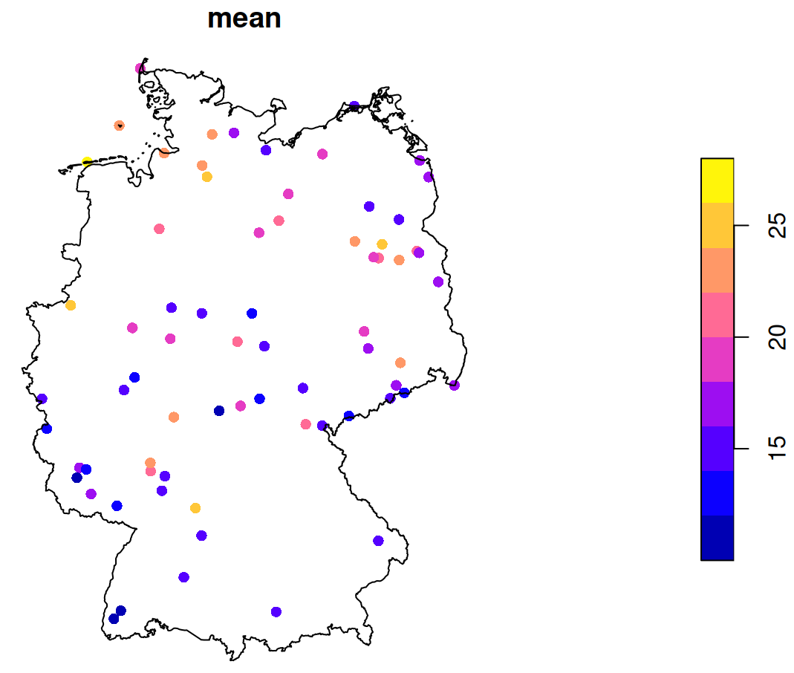{.lightbox width="432"}

  ``` r
  st_as_sf(st_apply(star_pm10, 1, mean, na.rm = TRUE)) |>
      plot(reset = FALSE, pch = 16, extent = de_nuts1)

  st_union(de_nuts1) |> plot(add = TRUE)
  ```

  - See [Data Formats](geospatial-spat-temp.qmd#sec-geo-sptemp-datform){style="color: green"} \>\> Time-wide \>\> Example 2 for the code for [star_pm10]{.var-text}
    - [de_nuts1]{.var-text} also loads with `data(air, package = "spacetime")`

- [Example 4]{.ribbon-highlight}: Counts of pairwise distances between locations\
  {.lightbox width="432"}

  <Details>

  <Summary>Code</Summary>

  ``` r
  pacman::p_load(
    spacetime,
    sf,
    ggplot2
  )

  data(air)

  # get rural location time series from 2005 to 2010
  rural <- STFDF(
    sp = stations, 
    time = dates, 
    data = data.frame(PM10 = as.vector(air))
  )
  rr <- rural[,"2005::2010"]
  # remove station ts w/all NAs
  unsel <- which(apply(
    as(rr, "xts"), 
    2, 
    function(x) all(is.na(x)))
  )
  r5to10 <- rr[-unsel,]


  sf_locs <- st_as_sf(r5to10@sp)
  # Calculate pairwise distances
  mat_dist_sf <- st_distance(sf_locs)
  # Convert to kilometers
  mat_dist_sf_km <- units::set_units(mat_dist_sf, km) |>
    units::drop_units()

  dim(mat_dist_sf_km)
  #> [1] 53 53

  tibble::tibble(
    distance = mat_dist_sf_km[upper.tri(mat_dist_sf_km)]
  ) |> 
    ggplot(aes(x = distance)) +
    geom_histogram(
      binwidth = 20, 
      fill = "steelblue", 
      color = "#FFFDF9FF") +
    labs(x = "Distance (km)", y = "Frequency") +
    theme_notebook()

  summary(mat_dist_sf_km[upper.tri(mat_dist_sf_km)])
  #>   Min. 1st Qu.  Median    Mean 3rd Qu.    Max. 
  #>  7.027 197.849 308.533 321.976 439.895 813.742 
  ```

  </Details>

  - The bin width is set to 20 km (which is the setting for the variogram model in the [{gstat}]{style="color: #990000"} vignette)
  - For kriging, ideally we'd want at least around 100 pairwise distances in each of the first few bins (short pairwise distances) for a stable range estimate, but no pairwise distance bin has that many. (See [Geospatial, Kriging \>\> Bin Width](geospatial-kriging.html#sec-geo-krig-bw){style="color: green"})
    - This is due to there only being 53 locations and the selection of only rural locations

- [Example 5]{.ribbon-highlight}: [{gglinedensity}]{style="color: #990000"}\
  {.lightbox width="432"}

  <Details>

  <Summary>Code</Summary>

  ``` r
  pacman::p_load(
    spacetime,
    dplyr,
    gglinedensity,
    ggplot2
  )

  data(air)

  rural <- STFDF(
    sp = stations, 
    time = dates, 
    data = data.frame(PM10 = as.vector(air))
  )
  rr <- rural[,"2005::2010"]

  # remove station ts w/all NAs
  unsel <- which(apply(
    as(rr, "xts"), 
    2, 
    function(x) all(is.na(x)))
  )
  r5to10 <- rr[-unsel,]

  pm10_tbl <- as_tibble(as.data.frame(r5to10)) |> 
    rename(station = sp.ID, date = time, pm10 = PM10) |> 
    mutate(date = as.Date(date)) |> 
    select(date, station, pm10)

  summary(pm10_tbl)
  #>       date               station           pm10        
  #>  Min.   :2005-01-01   DESH001: 1826   Min.   :  0.560  
  #>  1st Qu.:2006-04-02   DENI063: 1826   1st Qu.:  9.275  
  #>  Median :2007-07-02   DEUB038: 1826   Median : 13.852  
  #>  Mean   :2007-07-02   DEBE056: 1826   Mean   : 16.261  
  #>  3rd Qu.:2008-10-01   DEBE032: 1826   3rd Qu.: 20.333  
  #>  Max.   :2009-12-31   DEHE046: 1826   Max.   :269.079  
  #>                       (Other):85822   NA's   :21979 

  ggplot(
    pm10_tbl, 
    aes(x = date, 
        y = pm10,
        group = station)) +
    stat_line_density(
      bins = 75, 
      drop = FALSE, 
      na.rm = TRUE) + 
    scale_y_continuous(breaks = seq.int(0, 250, 50)) +
    theme_notebook()
  ```

  </Details>

  - With a bunch of time series, it's difficult to distinguish a primary trend to the data (e.g. in a spaghetti line chart). This density gives a sense of the seasonality and the trend of most of the locations.
  - The summary says the median is around 14 and the max is around 270.

- [Example 6]{.ribbon-highlight}: [{daiquiri}]{style="color: #990000"}\

  ::: {layout-ncol="2"}
  {.lightbox group="eda-daiq" width="332"}

  {.lightbox group="eda-daiq" width="332"}
  :::

  <Details>

  <Summary>Code</Summary>

  ``` r
  library(spacetime); library(dplyr); library(daiquiri)

  data(air)

  rural <- STFDF(
    sp = stations, 
    time = dates, 
    data = data.frame(PM10 = as.vector(air))
  )
  rr <- rural[,"2005::2010"]

  # remove station ts w/all NAs
  unsel <- which(apply(
    as(rr, "xts"), 
    2, 
    function(x) all(is.na(x)))
  )
  r5to10 <- rr[-unsel,]

  pm10_tbl <- as_tibble(as.data.frame(r5to10)) |> 
    rename(station = sp.ID, date = time, pm10 = PM10) |> 
    mutate(date = as.Date(date)) |> 
    select(date, station, pm10)

  fts <- 
    field_types(
      station = ft_strata(),
      date = ft_timepoint(includes_time = FALSE),
      pm10 = ft_numeric()
    )

  daiq_pm10 <- 
    daiquiri_report(
      pm10_tbl,
      fts
    )
  ```

  </Details>

  - Shows missingness and basic descriptive statistics over time for each [station]{.var-text}
    - Note that if your data is daily and there's only 1 measurement per day, then all these statistics will the same (duh, but one time I forgot and thought the package was broken)

### Temporal Dependence {#sec-geo-sptemp-eda-ac .unnumbered}

- Check characteristics of autocorrelation. Can the analysis be done in a purely spatial manner (a purely spatial model for each time step) or is adding a temporal aspect necessary?

- [Autocorrelation Function (ACF)]{.underline}

  - For each location, is there correlation between time $t$ and lag $t + h$
  - Does autocorrelation rapidly or gradually decrease?
    - If gradually, then the series isn't stationary and probably needs differencing (See [EDA, Time Series \>\> Stationarity](eda-time-series.qmd#sec-eda-ts-station){style="color: green"})
  - Is there a scalloped shape to autocorrelation?
    - If so, it might need seasonal differencing.
  - At which time lag (max, avg) does autocorrelation become insignificant?

- [Partial Autocorrelation Function (PACF)]{.underline}

  - Are there significant spikes in the PACF?
    - Could indicate the frequency of the seasonality?

- [Cross-Correlations]{.underline}

  - For each pair of locations, is there autocorrelation between location $a$ at time $t$ and location $b$ at time $t + h$
  - Cross-correlations can be asymmetric and they do *not* have to be 1 at lag 0 like autocorrelations
    - If you're looking at rainfall at two locations, strong correlation when upstream location A leads downstream location B by 2 hours, but weak correlation when B "leads" A, tells you about the direction of storm movement and typical travel time.
    - The strength of the asymmetry itself (how different the two plots look) can indicate how strong or consistent these directional relationships are in your data.
  - Potential Interpretations of Strong Asymmetry:
    - *Directional or causal relationships*: If the cross-correlation is stronger when A leads B (positive lags in A vs B plot) than when B leads A, this suggests A might influence B more than the reverse. This doesn't prove causation, but it's often consistent with one variable driving changes in the other.
    - *Different response times*: The asymmetry can reveal that one location responds to shared drivers faster than the other, or that the propagation time of some influence differs depending on direction.
    - *Lead-lag relationships*: Strong asymmetry with a clear peak at a non-zero lag indicates one series systematically precedes the other, which can be important for forecasting or understanding the physical mechanisms at play.
  - Is there an approximate distance between many pairs of locations at which autocorrelation is insignificant?

- [Pooled Temporal Variogram]{.underline}

  - A pooled temporal variogram is computed by holding space fixed and pooling squared temporal differences across spatial locations.

  - It can be used with spatio-temporal data to estimate the strength of temporal dependence of various time differences.

    - We can also use to get reasonable starting values for the time portions of spatio-temporal variogram models (e.g. separable, metric, product-sum, etc.)

  - Let $Y_{s,t}$ denote the observation at location $s = 1,\dots,S$ and time $t = 1,\dots,T$.

  - The pooled estimator is:\

    $$\hat{\gamma}(h_t) = \frac{1}{2 N_k(h_t)} \sum_{k=1}^{K} \sum_{s=1}^{S}
    \left( Y_{s,t} - Y_{s,t+u} \right)^2        $$

    - $h_t$ is a temporal bin
    - $N_k(h_t)$ is the number of valid (not NA) time difference pairs in that temporal bin
    - $K$ is the number of time difference pairs
    - $S$ is number of spatial locations
    - $u$ is temporal separation

- [Example 1]{.ribbon-highlight}: PM10 Pollution ([{gstat}]{style="color: #990000"} [vignette](https://cran.r-project.org/web/packages/gstat/vignettes/st.pdf), section 2)

  :::: panel-tabset
  ## Data

  ###### Set-Up

  ``` r
  pacman::p_load(
    spacetime,
    stars,
    sf,
    dplyr,
    ggplot2
  )

  data(air)

  # get rural location time series from 2005 to 2010
  rural_log <- STFDF(
    sp = stations, 
    time = dates, 
    data = data.frame(PM10 = log(as.vector(air)))
  )
  rr <- rural_log[,"2005::2010"]

  # remove station ts w/all NAs
  unsel <- which(apply(
    as(rr, "xts"), 
    2, 
    function(x) all(is.na(x)))
  )
  r5to10 <- rr[-unsel,]
  ```

  - [r5to10]{.var-text} is a STFDF (full grid) object
  - `r5to10@sp` is a [SpatialPoints]{.arg-text} ([{sp}]{style="color: #990000"}) class object with location names and coordinates

  ###### Map

  ::: {layout-ncol="2"}
  {.lightbox group="eda-ac-ex1" width="373"}

  {.lightbox group="eda-ac-ex1" width="373"}
  :::

  <Details>

  <Summary>Code</Summary>

  ``` r

  stars_r5to10 <- st_as_stars(r5to10)
  # stars has dplyr methods
  plot_slice <- 
    slice(stars_r5to10, 
          index = 3, # 3rd time step, so a location doesn't have NA 
          along = "time")
  # country boundary
  de_sf <- st_as_sf(DE)
  # states (provinces) boundaries
  nuts1_sf <- st_as_sf(DE_NUTS1)

  ggplot() +
    # location points
    geom_stars(
      data = plot_slice, 
      aes(color = PM10), 
      fill = NA) +
    scale_color_viridis_c(
      option = "magma", 
      na.value = "transparent") +
    # states
    geom_sf(
      data = nuts1_sf, 
      fill = NA, 
      color = "black", 
      size = 0.2, 
      linetype = "dotted") +
    # country
    geom_sf(
      data = de_sf, 
      fill = NA, 
      color = "black", 
      size = 0.8) +
    # Ensures coordinates align correctly
    coord_sf() +
    labs(
      title = "PM10 Concentration with Administrative Boundaries",
      fill = "PM10"
    ) +
    theme_minimal()

  # facet multiple time steps
  plot_slices <- 
    slice(stars_r5to10, 
          index = 4:7, 
          along = "time")
  plot_slices_sf <- st_as_sf(plot_slices, as_points = TRUE)
  plot_slices_long <- 
    plot_slices_sf |> 
    pivot_longer(cols = !sfc, 
                 names_to = "time", 
                 values_to = "PM10")

  ggplot() +
    geom_sf(
      data = plot_slices_long, 
      aes(color = PM10)) +
    scale_color_viridis_c(
      option = "magma", 
      na.value = "transparent") +
    geom_sf(
      data = nuts1_sf, 
      fill = NA, 
      color = "black", 
      size = 0.2, 
      linetype = "dotted") +
    geom_sf(
      data = de_sf, 
      fill = NA, 
      color = "black", 
      size = 0.8) +
    facet_wrap(~time) +
    coord_sf() +
    labs(
      title = "PM10 Concentration with Administrative Boundaries",
      color = "PM10"
    ) +
    theme_minimal()
  ```

  </Details>

  ## Autocorrelation

  ###### Average ACF per Location

  {.lightbox width="532"}

  ``` r
  # ACF for each station
  mat_acf <- apply(
    as(r5to10, "xts"), # coerce to matrix of time series columns
    2, 
    function(x) {
      acf(
        x, 
        na.action = na.pass, 
        plot = FALSE, 
        lag.max = 80)$acf
    }
  )

  # locations are rows
  acf_mean <- rowMeans(mat_acf, na.rm = TRUE)

  plot(
    0:80,           # 80 days
    acf_mean, 
    type = "b",     # points and lines
    xlab = "Lag (days)", 
    ylab = "Mean ACF",
    main = "Average temporal ACF across stations"
  )
  abline(h = 0, lty = 2)
  ```

  - The average autocorrelation gets close to zero around 40 days and then crosses zero at around 60 days. After 60 days, there's only a little noisy oscillation around zero.

  ###### Specific Locations

  {.lightbox group="eda-ac-ex1" width="532"}

  ``` r
  # select locations 4, 5, 6, 7
  rn = row.names(r5to10@sp)[4:7]

  par(mfrow=c(2,2))
  for (i in rn) {
    x <- na.omit(r5to10[i,]$PM10)
    acf(x, main = i)
  }
  ```

  - There does seem to be a gradual-ness and scalloped pattern with these locations.
  - Looks like at around lag 20, autocorrelation is not significant for most of these locations

  ## Partial Autocorrelation

  {.lightbox width="532"}

  ``` r
  par(mfrow=c(2,2))
  for (i in rn) {
    x <- na.omit(r5to10[i,]$PM10)
    pacf(x, main = i)
  }        
  ```

  - We see one or two significant spikes at each location, but nothing that would indicate a consistent seasonality among the locations.

  ## Cross-(Auto)Correlation

  {.lightbox group="eda-ac-ex1" width="632"}

  ``` r
  # coerce to xts class
  xts_pm10 <- as(r5to10, "xts")
  # extract numeric cols
  mat_pm10 <- zoo::coredata(xts_pm10)
  # find and remove cols with NAs > 20%
  na_cols <- colnames(mat_pm10)[colMeans(is.na(mat_pm10)) > 0.20]
  mat_pm10_nacols <- mat_pm10[, !colnames(mat_pm10) %in% na_cols]
  mat_pm10_clean <- na.omit(mat_pm10_nacols)
  # all data
  acf(mat_pm10_clean)

  # vs "DEUB004"
  no_ac_locs <- c("DEUB004", "DEBE056", "DEBB053")
  mat_pm10_naac <- mat_pm10_clean[, no_ac_locs]
  acf(mat_pm10_naac)
  ```

  - [r5to10]{.var-text} is a STFDF (full grid) object. It's coerced, using `as`, into a [xts]{.arg-text} object. Since it's now a multivariate time series object, `acf` will give you cross-correlations.
  - From the acf of all the data, there were a couple interesting locations that had very little cross-correlation between them.
  - When running `acf` for a fairly large number of locations there will be a large number of charts (due to all the combinations). After one chart is rendered, in the R console, it'll ask you to hit enter before it will render the next chart.
    - Note that within the cross-correlation charts, the titles of some of the location names get cut off.

  ## Pairwise Distance

  If there is no or little autocorrelation between a pair of locations, is it largely because there's a large distance between those locations? Maybe this can give a hint about the appropriate neighborhood size or area

  ###### Distance Matrix

  ``` r
  # select low cross-corr locations and random locations
  # indices for the low cross-corr locations
  no_ac_idx <- which(row.names(r5to10@sp) %in% no_ac_locs)
  # indices for the column names (locations) of the cleaned matrix
  mat_clean_idx <- which(row.names(r5to10@sp) %in% colnames(mat_pm10_clean))
  # sample 5 location indices that aren't low cross-corr locations
  mat_clean_idx_samp <- sort(sample(mat_clean_idx[-no_ac_idx], 5))
  # combine sample indices and low cross-corr indices
  mat_clean_idx_comb <- c(no_ac_idx, mat_clean_idx_samp)


  # convert the SpatialPoints (sp) to sf
  sf_locs <- st_as_sf(r5to10[mat_clean_idx_comb,]@sp)
  # pairwise distances (in meters for geographic coordinates)
  mat_dist_sf <- st_distance(sf_locs)
  # convert to kilometers
  mat_dist_sf_km <- round(units::set_units(mat_dist_sf, km), 2)

  colnames(mat_dist_sf_km) <- row.names(r5to10[mat_clean_idx_comb,]@sp)
  rownames(mat_dist_sf_km) <- row.names(r5to10[mat_clean_idx_comb,]@sp)
  mat_dist_sf_km
  #> Units: [km]
  #>         DEBE056 DEBB053 DEUB004 DEBE056 DETH026 DEUB004 DEBW031 DENW068
  #> DEBE056    0.00   28.07  648.60  235.43  357.82  541.62  198.99  557.63
  #> DEBB053   28.07    0.00  674.84  256.26  374.67  569.64  221.21  585.50
  #> DEUB004  648.60  674.84    0.00  441.77  660.90  209.86  579.71  173.85
  #> DEBE056  235.43  256.26  441.77    0.00  458.62  393.98  292.91  396.71
  #> DETH026  357.82  374.67  660.90  458.62    0.00  467.91  173.13  500.94
  #> DEUB004  541.62  569.64  209.86  393.98  467.91    0.00  420.84   36.08
  #> DEBW031  198.99  221.21  579.71  292.91  173.13  420.84    0.00  446.54
  #> DENW068  557.63  585.50  173.85  396.71  500.94   36.08  446.54    0.00

  # using sp
  mat_dist_sp <- round(sp::spDists(r5to10[mat_clean_idx_comb,]@sp), 2)
  colnames(mat_dist_sp) <- row.names(r5to10[mat_clean_idx_comb,]@sp)
  rownames(mat_dist_sp) <- row.names(r5to10[mat_clean_idx_comb,]@sp)
  ```

  - The 3rd column ([DEUB004]{.var-text}) and first two rows ([DEBE056]{.var-text}, [DEBB053]{.var-text}) shows the distances between the low cross-correlation locations. The other locations are included for context.
  - The distances for those low cross-correlations location pairs do seem to be quite a bit larger than the other 5 randomly sampled locations when paired with [DEUB004]{.var-text}. So the low cross-correlations are likely due to larger spatial distances between the locations.
  - Might be interesting to check the cross-correlation between [DEUB004]{.var-text} and [DETH026]{.var-text} and maybe [DEBW031]{.var-text} just to see how low those cross-correlations are in comparison.
  - The [{sp}]{style="color: #990000"} and [{sf}]{style="color: #990000"} numbers are slightly different, because [{sp}]{style="color: #990000"} uses spherical and [{sf}]{style="color: #990000"} uses elliptical distances. The elliptical should be more accurate, but either should be fine for most applications (fraction of a percentage difference)

  ###### Map

  {.lightbox group="eda-ac-ex1" width="373"}

  <Details>

  <Summary>Code</Summary>

  ``` r
  labeled_points <- 
    st_as_sf(plot_slice, as_points = TRUE) |> 
    mutate(station = rownames(r5to10@sp@coords)) |> 
    filter(station %in% c("DEUB004", "DEBE056", "DEBB053"))

  ggplot() +
    # location points
    geom_stars(
      data = plot_slice, 
      aes(color = PM10), 
      fill = NA) +
    scale_color_viridis_c(
      option = "magma", 
      na.value = "transparent") +
    # states
    geom_sf(
      data = nuts1_sf, 
      fill = NA, 
      color = "black", 
      size = 0.2, 
      linetype = "dotted") +
    # country
    geom_sf(
      data = de_sf, 
      fill = NA, 
      color = "black", 
      size = 0.8) +
    # Ensures coordinates align correctly
    coord_sf() +
    # color labelled points differently
    geom_sf(
      data = labeled_points, 
      color = "limegreen", 
      size = 3, 
      shape = 21, 
      fill = "limegreen") +
    geom_sf_label(
      data = labeled_points, 
      aes(label = station),
      nudge_x = 0.3, 
      nudge_y = 0.3, 
      size = 3) +
    labs(
      title = "PM10 Concentration with Administrative Boundaries",
      fill = "PM10") +
    theme_minimal()        
  ```

  </Details>

  - Pretty much on the other side of the country, but there are locations further away. Again, it'd be interesting to look at the cross-correlations between some of the pairs of locations that are just as far or farther away.
  ::::

- [Example 2]{.ribbon-highlight}: Pooled Temporal Variogram

  ::::: panel-tabset
  ## Data

  This is the PM10 air pollution dataset for Germany that's from [{spacetime}]{style="color: #990000"} and used in many of my examples.

  The goal is to find starting values for temporal `vgm` portions of spatio-temporal variogram models.

  ``` r
  pacman::p_load(
    ebtools, # pooled_temporal_variogram
    ggplot2,
    patchwork,
    gstat
  )

  data(air, package = "spacetime")

  keep_cols <- dates >= as.Date("2005-01-01") &
    dates <= as.Date("2010-12-31")
  air_sub <- air[, keep_cols]

  # Remove locations with all NAs
  keep_rows <- rowSums(!is.na(air_sub)) > 0
  air_sub <- air_sub[keep_rows, ]

  # add dates as column names
  keep_dates <- as.character(dates[keep_cols])
  colnames(air_sub) <- keep_dates

  air_sub_log <- log(air_sub)
  ```

  - `pooled_temporal_variogram` is from [my personal package](https://ercbk.github.io/ebtools/) and requires a space-time matrix with date or datetime strings as column names.

  ## Pooled Temporal Variogram

  {.lightbox group="eda-tdep-ex2" width="682"}

  ``` r
  ls_vario_time <- purrr::map(
    c(7, 14, 21), # 1wk, 2wks, 3wks
    \(x) {
      pooled_temporal_variogram(
        Y = air_sub_log,
        bin_width = x,
        max_time_diff = 375 # slightly more than a year in case there's noise
      )
    }
  )

  ls_plots <- purrr::map2(
    ls_vario_time,
    c(7, 14, 21),
    \(vario_obj, binwidth) {
      ggplot(vario_obj, 
             aes(x = dist, y = gamma)) +
        geom_point(color = "#59754D") +
        geom_line(color = "#59754D") +
        expand_limits(y = 0:0.35) +
        labs(
          x = "Time Difference (days)",
          y = "Semivariance",
          title = "Pooled Temporal Variogram",
          subtitle = glue::glue("With bin width of {binwidth} days")
        ) +
        theme_notebook() +
        theme(panel.grid.minor = element_line())
    }
  )

  ls_plots[[1]] + ls_plots[[2]] + ls_plots[[3]]    
  ```

  - The rapid rise and leveling indicates short-term temporal dependence
  - The bump could indicate some seasonality. It begins at around 200 days and lasts until around 300 days.
    - The (temporal) variogram assumes stationarity. So, if strong enough, it could substantially bias the estimation.
  - If there is seasonality, some seasonal differencing may be useful
    - Internally subtract location-wise mean or seasonal mean (rows in the matrix)
  - The dip after \~275 days suggests one of:
    - Finite sample noise; i.e. not enough pairs
    - Seasonality (annual structure)

  ## Fit Variogram Models

  ###### Without Nugget

  ::: {layout-ncol="3"}
  {.lightbox group="eda-tdep-ex2" width="382"}

  {.lightbox group="eda-tdep-ex2" width="382"}

  {.lightbox group="eda-tdep-ex2" width="382"}
  :::

  ``` r
  mod_vario_time_exp <- fit.variogram(
    object = ls_vario_time[[1]],
    model = vgm(
      model = "Exp",
      psill = 0.30, # units
      range = 120 # days
    )
  )

  mod_vario_time_exp
  #>   model     psill    range
  #> 1   Exp 0.2934582 2.590029

  plot(
    x = ls_vario_time[[1]],
    mod_vario_time_exp
  )

  mod_vario_time_sph <- fit.variogram(
    object = ls_vario_time[[1]],
    model = vgm(
      model = "Sph",
      psill = 0.30, # units
      range = 120 # days
    )
  )
  mod_vario_time_sph
  #>   model     psill   range
  #> 1   Sph 0.2903385 6.27746

  plot(
    x = ls_vario_time[[1]],
    mod_vario_time_sph
  )


  mod_vario_time_mat <- fit.variogram(
    object = ls_vario_time[[1]],
    model = vgm(
      model = "Mat",
      psill = 0.30, # units
      range = 120, # days
      kappa = 0.12
    )
  )

  mod_vario_time_mat
  #>   model     psill    range kappa
  #> 1   Mat 0.3125646 13.20735  0.12

  plot(
    x = ls_vario_time[[1]],
    mod_vario_time_mat
  )
  ```

  - Both exponential and spherical clearly undershoot the plateau, so matern is the choice here.
  - For the matern model, the default kappa is 0.5 which made the curve look closer to the exponential and spherical results.
  - For the exponential model, I tried an initial range of 200 and it didn't converge. When you see the model's estimate, you can see why. Both exponential and spherical have single digit ranges and the matern is around 14. I was off in my guess pretty badly.
  - I used the finer bin width (7 days) variogram, because there are still plenty of time difference pairs for semivariance estimation and there's no danger of overfitting these models.
    - Note that we have many more time points (and therefore time difference pairs per bin) as compared to spatial locations in the pooled spatial variogram case (example in next section), so smaller bin widths aren't an issue.
  - There are many models avaiable in gstat, but a lot are for specialized situations and the rest errored or didn't converge. I didn't investigate why some errored or didn't converge, so I just ended up with these three.

  ###### With Nugget

  ::: {layout-ncol="3"}
  {.lightbox group="eda-tdep-ex2" width="382"}

  {.lightbox group="eda-tdep-ex2" width="382"}

  {.lightbox group="eda-tdep-ex2" width="382"}
  :::

  ``` r
  mod_vario_time_exp_nug <- fit.variogram(
    object = ls_vario_time[[1]],
    model = vgm(
      model = "Exp",
      psill = 0.20, # units
      range = 40, # days
      nugget = 0.10
    )
  )

  mod_vario_time_exp_nug
  #>   model     psill    range
  #> 1   Nug 0.1401896 0.000000
  #> 2   Exp 0.1628611 5.416927

  plot(
    x = ls_vario_time[[1]],
    mod_vario_time_exp_nug,
  )

  mod_vario_time_sph_nug <- fit.variogram(
    object = ls_vario_time[[1]],
    model = vgm(
      model = "Sph",
      psill = 0.20, # units
      range = 40, # days
      nugget = 0.10
    )
  )
  mod_vario_time_sph_nug
  #>   model     psill    range
  #> 1   Nug 0.1769656  0.00000
  #> 2   Sph 0.1215215 15.40921

  plot(
    x = ls_vario_time[[1]],
    mod_vario_time_sph_nug
  )

  mod_vario_time_mat_nug <- fit.variogram(
    object = ls_vario_time[[1]],
    model = vgm(
      model = "Mat",
      psill = 0.20, # units
      range = 40, # days
      kappa = 0.12,
      nugget = 0.10
    )
  )

  mod_vario_time_mat_nug
  #>   model     psill    range kappa
  #> 1   Nug 0.0000000  0.00000  0.00
  #> 2   Mat 0.3125647 13.20737  0.12

  plot(
    x = ls_vario_time[[1]],
    mod_vario_time_mat_nug
  )    
  ```

  - Adding the nugget leads to a little better fit for the exponential and spherical models, but not enough to overtake the matern.
  - The matern didn't want the nugget when offered. Therefore, we have a better nugget-sill ratio which potentially means better kriging results, but a zero nugget doesn't sound too realistic in this case (i.e. no microscale variation or measurement erro).
  :::::

### Spatial Dependence {#sec-geo-sptemp-eda-spdep .unnumbered}

- Is there meaningful spatial correlation (relative to noise)?

  - Spatio-temporal variograms can appear structured even when spatial dependence is negligible—especially when temporal correlation is strong. So, we need to test whether spatial dependence exits independently.
  - If there were no spatial correlation, then for almost all spatial lags (i.e. pure nugget behavior), semi-variance is constant.
  - With spatial correlation, there should be a monotonic increase as distance increases which eventually plateaus.
    - Tells us that spatial dependence is not drowned out by temporal variability

- On what distance scale does spatial correlation operate?

  - At what distance does the variogram level off?
    - Realize the empirical range (calculated in the variogram model) and the practical range (using your eyes) and the effective range (where spatial semi-variance is higher than some threshold) are different things.
  - In general does this distance suggest a State-wide spatial dependence? County-wide? Region-wide? etc.

- Is the spatial structure smooth or erratic?

  - Can one curve fit the data well or are there groups of bins that stand out as not being fit well by the model curve.
  - Does monotonicity of the bins fail? (i.e. a bin at greater distance than another but having a smaller semi-variance)
    - Try spatial detrending (e.g. regress on coordinates, covariates) or temporal detrending can restore a monotone variogram.
    - If variance or mean changes over time and you pool time slices, then differencing in time (or demeaning by time) can stabilize variance. Then, the short-lag spatial structure can become clearer.

- Is fitting a full spatio-temporal variogram likely to succeed?

  - Flat variogram → Don’t bother with spatial-temporal modeling when there's no need for even spatial modeling.
  - Extremely short range → Metric models likely degenerate.
  - Wild instability → Spatio-Temporal fitting will be numerically meaningless. (too much noise → too much uncertainty → predictions essentially meaningless)

- [Example]{.ribbon-highlight}: Pooled Spatial Variogram

  ::: panel-tabset
  ## Sample Time Instances

  - The data, r5to10, is PM10 measurements across 53 measurement stations in Germany.
  - Pooled spatial variograms are analyzed. Semivariance is computed between station pairs within each time slice, and then those within-slice spatial relationships are *pooled* across slices. The partial sill and range estimates can be used as starting values in a spatio-temporal variogram..
  - Bootstrap distributions for the partial sill and range are calculated. These could give us a potential range of starting values if there are fitting issues with the spatio-temporal variogram.
    - Takes around 3hrs and 30 min on 10 workers
  - This example is from the [{gstat}]{style="color: #990000"} [vignette](https://cran.r-project.org/web/packages/gstat/vignettes/st.pdf) (Sect. 2.2) which they seem to have specified the model incorrectly given the package documentation. The vignette uses [dX = 0]{.arg-text} which I can only guess is because they thought [dX]{.arg-text} is *less than equal to* the 2-norm when it's actually *strictly less than* (See [Geospatial, Kriging \>\> Variograms](https://ercbk.github.io/Data-Science-Notebook/qmd/geospatial-kriging.qmd#sec-geo-krig-vario){style="color: green"} \>\> Example). Consequently, they produced a bad fit.
    - The correct specification [dX = 0.5]{.arg-text} with a factored time variable produced good fits for all models.

  ``` r
  pacman::p_load(
    dplyr,
    ggplot2,
    gstat,
    futurize
  )

  data(air, package = "spacetime")

  rural_log <- spacetime::STFDF(
    sp = stations,
    time = dates,
    data = data.frame(PM10 = log(as.vector(air)))
  )
  rr <- rural_log[, "2005::2010"]

  unsel <- which(apply(
    as(rr, "xts"), 2,
    function(x) all(is.na(x))
  ))
  r5to10 <- rr[-unsel, ]


  # sample 200 time instances (days)
  set.seed(2026)
  vec_time <- sample(
    x = dim(r5to10)[2],
    size = 200
  )

  ls_samp <- lapply(
    vec_time,
    function(i) {
      x = r5to10[,i]
      x$time_index = i
      rownames(x$coords) = NULL
      x
    }
  )

  spdf_samp <- do.call(
    what = rbind,
    args = ls_samp
  )
  ```

  - Unlike the vignette, I've logged the PM10 variable.
  - 200 time instances (days) are sampled
  - For each time instance, the [STFDF]{.arg-text} is subsetted by that day. Then that day is added to a new variable, [time_index]{.var-text}.
  - Each element of [ls_samp]{.var-text} is a [SpatialPointsDataFrame]{.arg-text} and `rbind` combines the elements into one [SpatialPointsDataFrame]{.arg-text}

  ## Pooled Spatial Variogram Models

  ###### Fit the Models

  ``` r
  spdf_samp$time_index <- as.factor(spdf_samp$time_index)

  vario_samp <- variogram(
    object = PM10 ~ time_index,
    locations = spdf_samp[!is.na(spdf_samp$PM10),],
    dX = 0.5   # select pairs only within same factor level (time instance)
  )

  fit_vario_mod <- function(
      mod_type, 
      is_nug, 
      vario_samp,
      gamma_max,
      dist_max) {

    if (is_nug) {
      # w/nugget
      mod_vario <- 
        fit.variogram(
          object = vario_samp, 
          model = vgm(
            # heuristic method
            psill = gamma_max * 0.85,
            model = mod_type,
            range = dist_max  * 0.25,
            nugget = gamma_max * 0.15
          )
        ) 
    } else {
      # no nugget
      mod_vario <- 
        fit.variogram(
          object = vario_samp, 
          model = vgm(
            psill = gamma_max * 0.85,
            model = mod_type,
            range = dist_max  * 0.25,
          )
        ) 
    }

    # cleaning up model output
    nugget_val <- mod_vario$psill[mod_vario$model == "Nug"]
    model_res <- mod_vario[mod_vario$model != "Nug", ]

    tib_res <- tibble(
      mod_type = model_res$model,
      psill = model_res$psill,
      range = model_res$range,
      nugget = ifelse(length(nugget_val) == 0, NA, nugget_val),
      sse =  attr(mod_vario, "SSErr"),
      model = list(mod_vario)
    )  

    return (tib_res)
  }

  # input for the mod fitting loop
  # theoretical model types and w or w/o nugget
  # empircal variogram plus data for starting values
  # used in heuristic for starting values
  gamma_max <- max(vario_samp$gamma)
  dist_max  <- max(vario_samp$dist)

  df_mods_nug <- expand.grid(
    mod_type = c("Exp", "Sph", "Mat"),
    is_nug = c(TRUE, FALSE),
    stringsAsFactors = FALSE,
    KEEP.OUT.ATTRS = FALSE
  ) |>
    as_tibble() |> 
    mutate(
      vario_samp = list(vario_samp),
      gamma_max = gamma_max,
      dist_max = dist_max,
    )

  tib_vario_mods <- purrr::pmap(
    df_mods_nug,
    fit_vario_mod
  ) |> 
    purrr::list_rbind()

  tib_vario_mods
  #> # A tibble: 6 × 6
  #>   mod_type psill range  nugget     sse model             
  #>   <fct>    <dbl> <dbl>   <dbl>   <dbl> <list>            
  #> 1 Exp      0.192  92.4  0.0191 0.00210 <vrgrmMdl [2 × 9]>
  #> 2 Sph      0.160 216.   0.0381 0.00247 <vrgrmMdl [2 × 9]>
  #> 3 Mat      0.192  92.4  0.0191 0.00210 <vrgrmMdl [2 × 9]>
  #> 4 Exp      0.196  67.5 NA      0.00230 <vrgrmMdl [1 × 9]>
  #> 5 Sph      0.179 127.  NA      0.00393 <vrgrmMdl [1 × 9]>
  #> 6 Mat      0.196  67.5 NA      0.00230 <vrgrmMdl [1 × 9]>
  ```

  - No warnings from any of the model fittings, so the starting values from the heuristic method seem to work fine in this case.
  - Each model fitted a nugget when offered the opportunity
  - The Exponential and Matern (both w/nugget) delivered the best performances with SSEs of 0.00210.

  ###### Visualize

  {.lightbox}

  <Details>

  <Summary>Code</Summary>

  ``` r
  # facet titles for each model
  tib_plot_data <- tib_vario_mods |> 
    mutate(
      nugget_status = if_else(is.na(nugget), 
                              "No Nugget", 
                              paste("Nugget:", round(nugget, 2))),
      facet_label = factor(
        paste(mod_type, "|", nugget_status),
        levels = unique(paste(mod_type, "|", nugget_status))
      )
    )

  # generates the fitted lines for each model
  model_lines <- purrr::map2_dfr(
    tib_plot_data$model, 
    tib_plot_data$facet_label, 
    ~ variogramLine(.x, maxdist = max(vario_samp$dist)) |> 
      mutate(facet_label = .y)
  )


  ggplot() +
    # experimental variogram points
    geom_point(
      data = vario_samp, 
      aes(x = dist, y = gamma), 
      color = "black", 
      size = 2
    ) +
    # labels for number of distance pairs
    ggrepel::geom_text_repel(
      data = vario_samp, 
      aes(x = dist, y = gamma, label = np),
      size = 3.5,
      color = "grey30",
      segment.color = "grey70",
      force = 2,
      box.padding = 0.5
    ) +
    # model lines
    geom_line(
      data = model_lines, 
      aes(x = dist, y = gamma), 
      color = "firebrick", 
      linewidth = 1
    ) +
    facet_wrap(~ facet_label, ncol = 3) +
    labs(
      title = "Variogram Model Fits by Type and Nugget Status",
      subtitle = "Labels indicate number of pairs per distance bin",
      x = "Distance (h)",
      y = "Semivariance (γ)"
    ) +
    theme_notebook(panel.spacing = unit(1.5, "lines"))
  ```

  </Details>

  - Even with just 200 time instance samples, these variograms look stable
    - Monotonicity isn't broken
    - No major outliers (maybe a mild one at the largest pairwise distance bin)
  - All these fits look fine visually. If I had to pick a bad one, it'd probably be the Spherical without a nugget.

  ## Block Bootstrapping

  - Different amounts of sampled time slices/instances a number of times can result in substantially different variograms — making it difficult to gain a feel for the partial sill and range parameters. Applying the bootstrap should give a better sense for a range of starting values for each of those parameters.
  - From the autocorrelation EDA example, there does seem to be some pretty strong autocorrelation present, so using the block version of bootstrapping makes sense.
  - Under iid resampling, you could draw many of those similar days into the same resample, producing a bootstrap distribution that understates variability in your parameter estimates because some resamples are effectively seeing the same spatial field repeatedly. The block bootstrap guards against this by ensuring consecutive days stay together, preserving the effective sample size of your bootstrap distribution.
  - Looking at the average ACF per location can help choose a block length\
    {.lightbox width="532"}
    - See [EDA \>\> Temporal Dependence](geospatial-spat-temp.qmd#sec-geo-sptemp-eda-ac){style="color: green"} \>\> Example 1 for the code.
    - Ideally 60 days (or 63 which is 9 weeks) is probably the choice, but 42 days (6 weeks) or even 21 days could possibly work.
    - The issue with choosing a block length is that there needs to be enough time instances (slices) sampled in order to get stable estimates.
      - Whether you have enough time instances depends on the amount of data (in this example, 1826 days after cleaning).
    - Also, this is a computationally expensive process that can take hours on the average desktop, so resources are another consideration.

  ###### Block Bootstrap the Partial Sill and Range

  See [Confidence and Prediction Intervals \>\> Bootstrapping](confidence-and-prediction-intervals.qmd#sec-cipi-boot){style="color: green"} \>\> Example 2: Block Bootstrap for more details on the code.

  <Details>

  <Summary>Code</Summary>

  ``` r
  # ---------- Model Function ---------- #

  estim_params_vgm <- function( # <1>
      mod_type, 
      idx_time_resamp, 
      dat) {

    ls_dat <- lapply(idx_time_resamp, function(i) {
      x <- dat[, i]
      x$time_index <- i
      rownames(x@coords) <- NULL
      x
    })

    spdf <- do.call(rbind, ls_dat)
    spdf <- spdf[!is.na(spdf$PM10), ]
    spdf$time_index <- as.factor(spdf$time_index)

    vario_exp <- variogram(
      PM10 ~ time_index, 
      spdf, 
      dX = 0.5
    )

    # matern model
    if (mod_type == "Mat") {
      # narrower than default
      kappa_grid <- seq(0.40, 0.70, by = 0.05)

      fits <- lapply(kappa_grid, function(k) {
        try(fit.variogram(
          vario_exp,
          vgm(nugget = NA,
              psill  = NA,
              model  = "Mat",
              range  = NA,
              kappa  = k),
          fit.kappa  = FALSE, # <2>
          fit.method = 7
        ), silent = TRUE)
      })

      # give NAs to degenerate results
      valid <- Filter(function(f) {
        !inherits(f, "try-error")     &&
          !isTRUE(attr(f, "singular")) &&
          all(f$psill >= 0)            &&
          all(f$range >= 0)
      }, fits)

      if (length(valid) == 0) return(tibble(
        model = mod_type, 
        psill = NA, 
        range = NA,
        nugget = NA, 
        kappa = NA, 
        sse = NA
      ))

      vario_mod   <- valid[[which.min(sapply(valid, function(f) attr(f, "SSErr")))]]
      kappa_value <- vario_mod$kappa[[2]]

    } else {

      # exponential or spherical
      vario_mod <- try(fit.variogram(
        vario_exp,
        vgm(
          psill  = NA,
          model  = mod_type,
          range  = NA,
          nugget = NA
        )
      ), silent = TRUE)

      failed <-
        inherits(vario_mod, "try-error")    ||
        isTRUE(attr(vario_mod, "singular")) ||
        any(vario_mod$psill < 0)            ||
        any(vario_mod$range < 0)

      if (failed) return(tibble(
        model = mod_type, 
        psill = NA, 
        range = NA,
        nugget = NA, 
        kappa = NA, 
        sse = NA
      ))

      kappa_value <- NA
    }

    tibble(
      model  = mod_type,
      psill  = vario_mod$psill[[2]],
      range  = vario_mod$range[[2]],
      nugget = vario_mod$psill[[1]],
      kappa  = kappa_value,
      sse    = attr(vario_mod, "SSErr")
    )
  }


  # ---------- Block Function ----------- #

  make_block_indices <- 
    function(n_time, 
             time_slices, 
             block_length, 
             n_samples) {
    mat_idxs <- matrix(NA, nrow = n_samples, ncol = time_slices)

    for (r in seq_len(n_samples)) { # <3>
      idx <- integer(0)

      while (length(idx) < time_slices) { # <4>
        start <- sample(
          1:(n_time - block_length + 1),
          size = 1
        )
        idx <- c(idx, start:(start + block_length - 1))
      }

      mat_idxs[r, ] <- idx[seq_len(time_slices)]
    }
    return(mat_idxs)
  }


  # ---------- Run it ---------- # 

  set.seed(2026) # <5>

  # cleaned data has 1826 days
  time_slices <- 504 # days
  block_length <- 42 # 6 weeks
  n_samples <- 200 # 200 resamples

  block_idxs <- make_block_indices(
    n_time = dim(r5to10)[2],
    time_slices = time_slices,
    block_length = block_length,
    n_samples = n_samples
  )

  plan(future.mirai::mirai_multisession, workers = 14L)

  tib_vario_params_full <- purrr::map(
    c("Exp", "Sph", "Mat"),
    \(i) {
      tib_vario_params <- purrr::map(
        asplit(block_idxs, 1),
        \(x) {
          estim_params_vgm(
            mod_type = i, 
            x, 
            dat = r5to10
          )
        }
      ) |> 
        futurize() |> 
        purrr::list_rbind()    
    }
  ) |> 
    purrr::list_rbind()

  mirai::daemons(0)
  ```

  1.  The basically just functionalizes the part of the script in the previous tabs and extracts the psill and range parameters from the variogram model
  2.  [fit.kappa = TRUE]{.arg-text} can produce some unrealistic parameter estimates while still having good MSE performance. It failed in this case, so I used a narrower grid search centered around the Exponential model ($\kappa = 0.50$) which was producing stable estimates for the most part when I was exploring different settings.
  3.  Iterates through the number of bootstrap replicates specified by [n_samples]{.var-text}
  4.  Generates blocks until the length of the replicate reaches the fixed length ([time_slices]{.var-text})
  5.  A matrix is created with `make_block_indices` where each row is indices of PM10 observations which are organized in blocks of 14 days. Each row of that matrix is fed into `estim_parmas_vgm` where a variogram model is fit. The calculated [psill]{.arg-text} and [range]{.arg-text} parameters of the fitted model are collected in a tibble

  </Details>

  ###### Experimentation Notes

  +------------------------+---------------------------+-------------------------------------------------------------------------------------------------------------------------------------------------------------------------------------------------+
  | Configuration          | Run Time                  | Results                                                                                                                                                                                         |
  +========================+===========================+=================================================================================================================================================================================================+
  | time slices: 630 days\ | 1 hr 14 min on 12 workers | Good median/mean spreads on parameter estimates                                                                                                                                                 |
  | block length: 42 days\ |                           |                                                                                                                                                                                                 |
  | n samples: 150         |                           |                                                                                                                                                                                                 |
  +------------------------+---------------------------+-------------------------------------------------------------------------------------------------------------------------------------------------------------------------------------------------+
  | time slices: 504 days\ | 42 min on 12 workers      | Still good median/mean spreads; nugget spread affected most but not too much.                                                                                                                   |
  | block length: 42 days\ |                           |                                                                                                                                                                                                 |
  | n samples: 150         |                           |                                                                                                                                                                                                 |
  +------------------------+---------------------------+-------------------------------------------------------------------------------------------------------------------------------------------------------------------------------------------------+
  | time slices: 420 days\ | 27 min on 12 workers      | Nugget and range spreads now affected. Nugget median and maximums have changed substantially.                                                                                                   |
  | block length: 42 days\ |                           |                                                                                                                                                                                                 |
  | n samples: 150         |                           |                                                                                                                                                                                                 |
  +------------------------+---------------------------+-------------------------------------------------------------------------------------------------------------------------------------------------------------------------------------------------+
  | time slices: 294 days\ | 10.5 min on 12 workers    | Mean/median spreads exploding; nugget and range values changing substantially                                                                                                                   |
  | block length: 42 days\ |                           |                                                                                                                                                                                                 |
  | n samples: 150         |                           |                                                                                                                                                                                                 |
  +------------------------+---------------------------+-------------------------------------------------------------------------------------------------------------------------------------------------------------------------------------------------+
  | time slices: 420\      | 26 min on 14 workers      | Increasing the block length from 42 to 63 caused the mean/median spreads and maximums to start exploding                                                                                        |
  | block length: 63\      |                           |                                                                                                                                                                                                 |
  | n samples: 150         |                           |                                                                                                                                                                                                 |
  +------------------------+---------------------------+-------------------------------------------------------------------------------------------------------------------------------------------------------------------------------------------------+
  | time slices: 420\      | 37 min on 14 workers      | Increasing n samples to 200 on exacerbated the exploding spreads and maximums                                                                                                                   |
  | block length: 63\      |                           |                                                                                                                                                                                                 |
  | n samples: 200         |                           |                                                                                                                                                                                                 |
  +------------------------+---------------------------+-------------------------------------------------------------------------------------------------------------------------------------------------------------------------------------------------+
  | time slices: 420\      | 37.5 min on 14 workers    | Decreasing the block length produced smaller spreads and maximums than a block length of 42, but is that good? (Taking into account autocorrelation is supposed increase variance of estimates) |
  | block length: 21\      |                           |                                                                                                                                                                                                 |
  | n samples: 200         |                           |                                                                                                                                                                                                 |
  +------------------------+---------------------------+-------------------------------------------------------------------------------------------------------------------------------------------------------------------------------------------------+

  - Unfortunately, I ended up doing this experimenet twice. After seeing `krigeST` residuals, I realized I should've logged the target variable (PM10). That's what happens when you blindly follow someone else's work and skip basic EDA. **THESE ARE NOTES FROM THAT FIRST EXPERIMENT.** So I'm not sure how they would hold up now. The bootstrap distributions look better. The mins and maxs for the range don't look too wild. Hard to tell for the psill and nugget since they're on the log scale.
    - This experiments execution time, which also included the Spherical model, was around 3hrs and 30 min on 10 workers.
  - **tl;dr**
    - As the number of time slices (length of rows in resample matrix) was reduced, the sequence of most affected estimates was nugget, then nugget and range, and finally nugget, range, and psill
    - Block lengths (step size in weeks) were chosen using the average ACF per location plot. Increasing the block length increased the variance. The higher the block length, the more nonsensical estimates produced.
      - Increasing the number of time slices can probably mitigate this, but that depends on your data (1826 days in this example) and resources (I have 16 workers available)
    - When the variance was high and estimates were non-sensical, increasing the number of resamples (n_samples) further increased the variance and made the estimates even worse.
  - The only model fit during this experimentation was the Matern model since that's the one that was most difficult to get stable estimates (i.e. spread between mean and median, maximum size)
  - Execution for both Exponential and Matern took 2.02 hrs on 14 workers. I felt this configuration (504 [time_slices]{.var-text}, 42 [block_length]{.var-text}, and 200 [n_samples]{.var-text}) gave me the best trade-off between precision (reasonable estimates) and run time.

  ###### Results

  ``` r
  # no error, singular mats, or negative estimates
  tib_vario_params_full |>
    group_by(model) |>
    summarize(na_rate = mean(is.na(range)))
  #> # A tibble: 3 × 2
  #>   model na_rate
  #>   <chr>   <dbl>
  #> 1 Exp         0
  #> 2 Mat         0
  #> 3 Sph         0

  tib_vario_params_full |>
    group_by(model) |>
    mutate(id = row_number()) |>
    ungroup() |>
    tidyr::pivot_wider(
      id_cols = id,
      names_from = model,
      values_from = c(psill, range, nugget, kappa, sse)
    ) |> 
    select(-id) |> 
    summary()
  #>    psill_Exp        psill_Sph         psill_Mat        range_Exp        range_Sph       range_Mat        nugget_Exp      
  #>  Min.   :0.1090   Min.   :0.09688   Min.   :0.1163   Min.   : 56.48   Min.   :111.3   Min.   : 48.96   Min.   :0.000000  
  #>  1st Qu.:0.1603   1st Qu.:0.14121   1st Qu.:0.1728   1st Qu.: 76.06   1st Qu.:153.0   1st Qu.: 97.21   1st Qu.:0.006057  
  #>  Median :0.1844   Median :0.16036   Median :0.1996   Median : 86.15   Median :187.1   Median :110.83   Median :0.009785  
  #>  Mean   :0.1893   Mean   :0.16559   Mean   :0.2035   Mean   : 92.53   Mean   :184.8   Mean   :119.30   Mean   :0.011923  
  #>  3rd Qu.:0.2166   3rd Qu.:0.18849   3rd Qu.:0.2328   3rd Qu.:101.71   3rd Qu.:207.5   3rd Qu.:133.97   3rd Qu.:0.015385  
  #>  Max.   :0.3142   Max.   :0.27928   Max.   :0.3142   Max.   :204.78   Max.   :277.1   Max.   :242.24   Max.   :0.042390  
  #>                                                                                                                          
  #>    nugget_Sph        nugget_Mat         kappa_Exp     kappa_Sph     kappa_Mat         sse_Exp            sse_Sph        
  #>  Min.   :0.00173   Min.   :0.000000   Min.   : NA   Min.   : NA   Min.   :0.4000   Min.   :0.001025   Min.   :0.001474  
  #>  1st Qu.:0.01061   1st Qu.:0.000234   1st Qu.: NA   1st Qu.: NA   1st Qu.:0.4000   1st Qu.:0.003597   1st Qu.:0.005448  
  #>  Median :0.01565   Median :0.003882   Median : NA   Median : NA   Median :0.4000   Median :0.005597   Median :0.008117  
  #>  Mean   :0.01764   Mean   :0.006398   Mean   :NaN   Mean   :NaN   Mean   :0.4113   Mean   :0.007300   Mean   :0.010201  
  #>  3rd Qu.:0.02269   3rd Qu.:0.008277   3rd Qu.: NA   3rd Qu.: NA   3rd Qu.:0.4000   3rd Qu.:0.009913   3rd Qu.:0.013603  
  #>  Max.   :0.05587   Max.   :0.045139   Max.   : NA   Max.   : NA   Max.   :0.6000   Max.   :0.035305   Max.   :0.046444  
  #>                                       NA's   :200   NA's   :200                                                         
  #>     sse_Mat         
  #>  Min.   :0.0008892  
  #>  1st Qu.:0.0032543  
  #>  Median :0.0053319  
  #>  Mean   :0.0069424  
  #>  3rd Qu.:0.0093035  
  #>  Max.   :0.0346830  

  tib_vario_params_full |> 
    summarize(
      sd_psill = sd(psill),
      sd_range = sd(range),
      sd_nugget = sd(nugget),
      .by = model)
  #> # A tibble: 3 × 4
  #>   model sd_psill sd_range sd_nugget
  #>   <chr>    <dbl>    <dbl>     <dbl>
  #> 1 Exp     0.0383     24.1   0.00878
  #> 2 Sph     0.0343     37.4   0.0101 
  #> 3 Mat     0.0403     36.5   0.00789
  ```

  - We have medians pretty close to the means for most of the parameters. Some skew for the Exponential and Matern ranges
  - The variance of each distribution is large which we expect when taking autocorrelation into account (smaller, correlated samples (less info) within blocks)

  ###### Visualize

  {.lightbox}

  <Details>

  <Summary>Code</Summary>

  ``` r
  library(ggdist); library(patchwork)

  notebook_colors <- unname(swatches::read_ase(here::here("palettes/Forest Floor.ase")))

  tib_plot <- 
    tib_vario_params_full |> 
    mutate(model = recode_values(
      model,
      "Exp" ~ "Exponential",
      "Mat" ~ "Matern"
    )) |> 
    tidyr::pivot_longer(cols = -model, names_to = "parameter",) |> 
    group_split(parameter)

  psill_plot <- ggplot(
    data = tib_plot[[3]],
    aes(y = model, 
        x = value,
        fill = model)) +

    # density
    stat_slab(
      aes(thickness = after_stat(pdf*n)), 
      scale = 0.5) +

    # histogram
    stat_dotsinterval(
      side = "bottom", 
      scale = 0.5, 
      slab_linewidth = NA) + # not sure why, setting to NA applies proper color to dots

    scale_fill_manual(values = c(notebook_colors[[4]], notebook_colors[[8]])) +
    labs(title = "Partial Sill") +
    xlab("Semi-Variance") +
    guides(fill = "none") +
    theme_notebook(
      axis.title.y = element_blank(),
      panel.border = element_rect(color = "#FFFDF9FF", 
                                  fill = "#FFFDF9FF", 
                                  linewidth = 1.5))

  range_plot <- ggplot(
    data = tib_plot[[4]],
    aes(y = model, 
        x = value,
        fill = model)) +

    # density
    stat_slab(
      aes(thickness = after_stat(pdf*n)), 
      scale = 0.5) +

    # histogram
    stat_dotsinterval(
      side = "bottom", 
      scale = 0.5, 
      slab_linewidth = NA) + # not sure why, setting to NA applies proper color to dots

    scale_fill_manual(values = c(notebook_colors[[4]], notebook_colors[[8]])) +
    labs(title = "Range") +
    xlab("Distance") +
    guides(fill = "none") +
    theme_notebook(
      axis.title.y = element_blank(),
      panel.border = element_rect(color = "#FFFDF9FF", 
                                  fill = "#FFFDF9FF", 
                                  linewidth = 1.5))


  nugget_plot <- 
    ggplot(tib_plot[[2]],
           aes(
             x = value, 
             y = model, 
             color = model
         )) +

    geom_boxplot(
      width = 0.3, 
      linewidth = 1,
      median.linewidth = 2,
      median.color = notebook_colors[[9]],
      outlier.shape = NA,  # hide redundant outlier dots
      color = "grey40", 
      fill = NA) +

    # adds points inline w/boxplot
    ggforce::geom_sina(
      alpha = 0.5, 
      size = 1.5, 
      maxwidth = 0.6) +

    # handle many outliers
    scale_x_sqrt() +  # sqrt transform helps w/skew w/o hiding zeros

    scale_color_manual(values = c(notebook_colors[[4]], notebook_colors[[8]])) +
    labs(
      x = "Semivariance (γ)", 
      y = NULL, 
      title = "Nugget") +
    guides(color = "none") +
    theme_notebook(
      axis.title.y = element_blank(),
      panel.border = element_rect(color = "#FFFDF9FF",
                                  fill = "#FFFDF9FF",
                                  linewidth = 1.5))


  kappa_plot <- ggplot(
    data = tib_plot[[1]] |> filter(model == "Matern"),
    aes(x = value)) +

    # dot bars
    geom_dots(
      layout = "bar", 
      fill = notebook_colors[[8]], 
      dotsize = 1) +

    # remove y axis
    scale_y_continuous(breaks = NULL) +
    # add cushion so dots don't get cutt off
    scale_x_continuous(expand = expansion(mult = 0.1)) +

    labs(title = "Matern's Kappa") +
    xlab("Kappa") +
    guides(fill = "none") +
    theme_notebook(
      axis.title.y = element_blank(),
      panel.border = element_rect(color = "#FFFDF9FF",
                                  fill = "#FFFDF9FF",
                                  linewidth = 1.5))


  sse_plot <- ggplot(
    data = tib_plot[[5]],
    aes(y = model, 
        x = value,
        fill = model)) +

    # density
    stat_slab(
      aes(thickness = after_stat(pdf*n)), 
      scale = 0.5) +

    # dot histogram
    stat_dotsinterval(
      side = "bottom", 
      scale = 0.5, 
      slab_linewidth = NA) + # not sure why, setting to NA applies proper color to dots

    # handle many outliers
    scale_x_log10() +

    scale_fill_manual(values = c(notebook_colors[[4]], notebook_colors[[8]])) +
    labs(title = "Sum of Squared Error (SSE)") +
    guides(fill = "none") +
    theme_notebook(
      axis.title.y = element_blank(),
      axis.title.x = element_blank(),
      panel.border = element_rect(color = "#FFFDF9FF", 
                                  fill = "#FFFDF9FF", 
                                  linewidth = 1.5))


  psill_plot + range_plot + nugget_plot + kappa_plot + sse_plot + plot_layout(nrow = 3, byrow = FALSE)
  ```

  </Details>

  - Some hints at multi-modal-ness but overall I think they're pretty well behaved.
    - I'd probably go with that first mode in the Spherical range distribution if I were taking it's estimates.
  - Nugget has a square root transform on the x-axis
  - SSE has a log10 transform on the x-axis
  - The choice for kappa was overwhelming 0.4 which makes me wonder if an even lower value would be optimal.
  - I think Matern might've been chosen in the vignette, but it looks like you get pretty close to the same SSE with the Exponential.
  - Nugget distributions look fine. The Matern's has a few zeros in its distribution
  :::

## Analysis {#sec-geo-sptemp-anal .unnumbered}

- Misc

  - Some (all currently) of these examples don't have a time element, but they include [{stars}]{style="color: #990000"} objects. So, an anlaysis involving a [{stars}]{style="color: #990000"} object with a time dimension would follow a similar workflow.

- [Example 1]{.ribbon-highlight}: Which destination gets the most visitors per mode of transportation

  :::: panel-tabset
  ## Total Trips by Destination

  ###### Calculate Total Trips

  ``` r
  library(ggplot2); library(stars)

  # total trips by destination
  star_sum_dest <- st_apply(
    star_bris_od,       # stars object
    2,                  # index of dimension
    sum                 # function to apply over dimension
  )
  which.max(star_sum_dest[[1]])
  #> [1] 33

  # verbose
  # star_sum_dest <- st_apply(
  #   star_bris_od, 
  #   c("dest"), 
  #   sum, 
  #   .fname = "n_trips_per_dest" # changes attribute name
  # )
  # which.max(star_sum_dest$n_trips_per_dest)
  #> [1] 33
  ```

  - See [Data Formats \>\> Long](geospatial-spat-temp.qmd#sec-geo-sptemp-datform-long){style="color: green"} \>\> Example 4 for details on [star_bris_od]{.var-text}

  ###### Visualize

  ::: {layout-ncol="2"}
  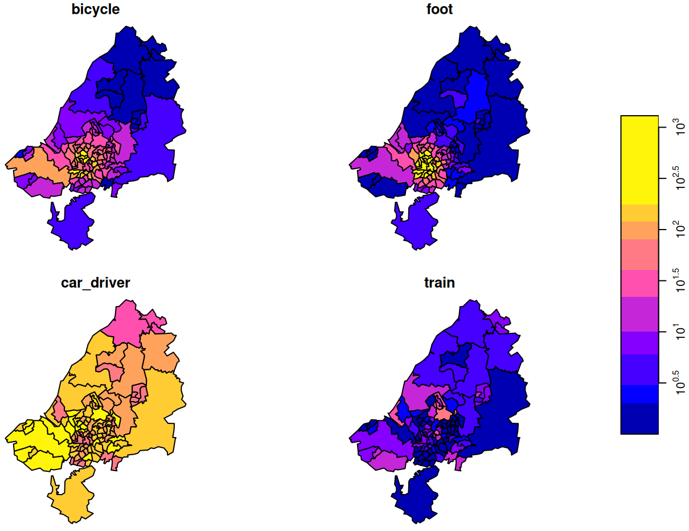{.lightbox group="eda-gen-max-dest-mode" width="532"}

  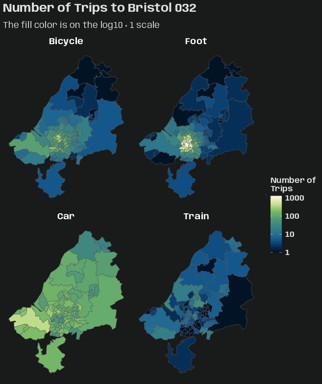{.lightbox group="eda-gen-max-dest-mode" width="532"}
  :::

  <Details>

  <Summary>Code</Summary>

  ``` r
  plot(adrop(star_bris_od[,,33]) + 1, logz = TRUE)

  ggplot() + 
    geom_stars(data = adrop(star_bris_od[,,33]) + 1) +
    coord_sf() +
    facet_wrap(
      ~ trans_mode,
      labeller = as_labeller(c(
        "bicycle" = "Bicycle",
        "foot" = "Foot",
        "car_driver" = "Car",
        "train" = "Train"
      ))
    ) +
    scico::scale_fill_scico(
      palette = "navia",
      transform = "log10"
    ) +
    labs(
      title = paste0("Number of Trips to ", bristol_zones$name[[33]]),
      subtitle = "The fill color is on the log10 + 1 scale",
      fill = "Number of\nTrips"
    ) +
    theme_charcoal_map()
  ```

  - `star_bris_od[,,33]` says take all attributes (there is only one: [n_trips]{.var-text}) since the first argument is empty, we take all [origin]{.var-text} regions (second argument empty), we take destination ([dest]{.var-text}) zone 33 (third argument), and all transportation modes ([trans_modes]{.var-text}) (fourth argument empty, or missing).
  - `adrop` drops all other dimensions except the ones specified to be kept. So all destinations get dropped except the 33^rd^

  </Details>

  ## Other Aggregations

  ``` r
  # --- total trips by each origin-to-destination combination ---
  st_apply(star_bris_od, 1:2, sum)
  #> stars object with 2 dimensions and 1 attribute
  #> attribute(s):
  #>      Min. 1st Qu. Median     Mean 3rd Qu. Max.
  #> sum     0       0      0 19.20636      19 1434
  #> dimension(s):
  #>        from  to refsys point                                                        values
  #> origin    1 102 WGS 84 FALSE MULTIPOLYGON (((-2.510462...,...,MULTIPOLYGON (((-2.55007 ...
  #> dest      1 102 WGS 84 FALSE MULTIPOLYGON (((-2.510462...,...,MULTIPOLYGON (((-2.55007 ...


  # --- total trips by origin and mode of transporation ---
  st_apply(star_bris_od, c(1,3), sum)
  #> stars object with 2 dimensions and 1 attribute
  #> attribute(s):
  #>      Min. 1st Qu. Median     Mean 3rd Qu. Max.
  #> sum     1    57.5  214.5 489.7623     771 2903
  #> dimension(s):
  #>            from  to refsys point                                                        values
  #> origin        1 102 WGS 84 FALSE MULTIPOLYGON (((-2.510462...,...,MULTIPOLYGON (((-2.55007 ...
  #> trans_mode    1   4     NA FALSE                                             bicycle,...,train

  st_apply(star_bris_od, c(1,3), sum) |> 
    as.data.frame() |> 
    head()
  #>                           origin trans_mode sum
  #> 1 MULTIPOLYGON (((-2.510462 5...    bicycle  30
  #> 2 MULTIPOLYGON (((-2.476122 5...    bicycle  34
  #> 3 MULTIPOLYGON (((-2.55073 51...    bicycle  19
  #> 4 MULTIPOLYGON (((-2.595763 5...    bicycle 161
  #> 5 MULTIPOLYGON (((-2.593783 5...    bicycle 188
  #> 6 MULTIPOLYGON (((-2.639581 5...    bicycle 126
  ```

  - Including these other aggregations just for more experience with the syntax.
  - Essentially, they're `summarize(.by = var)` calculations I think.
  ::::

- [Example 2]{.ribbon-highlight}: Trip Density per Location

  ::: panel-tabset
  ## Calculate Trip Density for Origins and Destinations

  The reason for the density calculation is because choropleths can be misleading. Small counts in large areas and vice versa can be misinterpreted.

  This density is calculated using area (probably out of convenience?), but I might've chosen population as the denominator if it was available for these areas. Both are better that raw counts though.

  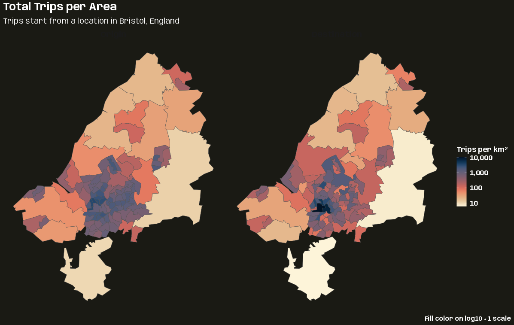{.lightbox width="632"}

  <Details>

  <Summary>Code</Summary>

  ``` r
  library(dplyr); library(ggplot2); library(stars)

  # same for dest
  area_origins <- st_apply(
    star_bris_od, 
    1, 
    sum
  ) |> 
    st_as_sf() |> 
    st_area() |> 
    # convert from m^2 to km^2
    units::set_units("km^2")

  star_dens_orig <-  st_apply(
    star_bris_od, 
    c("origin"), 
    sum,
    .fname = "tot_orig_trips"
  ) |> 
    mutate(trip_dens = tot_orig_trips / area_origins) |> 
    select(trip_dens)

  star_dens_dest <-  st_apply(
    star_bris_od, 
    c("dest"), 
    sum,
    .fname = "tot_dest_trips"
  ) |> 
    mutate(trip_dens = tot_dest_trips / area_origins) |> 
    select(trip_dens)

  (star_dens <- c(
    star_dens_orig, 
    star_dens_dest,
    along = list(location = c("Origin", "Destination"))
  ))
  #> stars object with 2 dimensions and 1 attribute
  #> attribute(s):
  #>                        Min.  1st Qu.   Median     Mean 3rd Qu.     Max.
  #> trip_dens [1/km^2] 5.107549 165.0211 544.9758 896.4212 1153.76 11147.27
  #> dimension(s):
  #>          from  to refsys point                                                        values
  #> origin      1 102 WGS 84 FALSE MULTIPOLYGON (((-2.510462...,...,MULTIPOLYGON (((-2.55007 ...
  #> location    1   2     NA    NA                                      Origin     , Destination

  star_dens |> 
    as_tibble() |> 
    glimpse()
  #> Rows: 204
  #> Columns: 3
  #> $ origin    <MULTIPOLYGON [°]> MULTIPOLYGON (((-2.510462 5..., MULTIPOLYGON (((-2.476122 5..., MULTIPOLYGON (((-2.55073 51.…
  #> $ location  <fct> Origin, Origin, Origin, Origin, Origin, Origin, Origin, Origin, Origin, Origin, Origin, Origin, Origin, O…
  #> $ trip_dens [1/km^2] 126.33201 [1/km^2], 151.50352 [1/km^2], 9.28764 [1/km^2], 727.55372 [1/km^2], 1035.17163 [1/km^2], 146…
  ```

  </Details>

  - This example primarily showcases the [{stars}]{style="color: #990000"} joining method, `c`. While it does result in one [{stars}]{style="color: #990000"} object, the data (attributes) are in a long format with a new grouping variable (dimension) created.
    - While geo stuff gets merged, for the data, it's more of a `bind_rows` operation
  - For two (or more? Or would that be a `reduce` use case?), they have to have the same attribute ([trip_dens]{.var-text}).
  - The [along]{.arg-text} argument creates the new grouping variable (dimension), [location]{.var-text}, and the values it takes on (order is important here) are [Origin]{.var-text} and [Destination]{.var-text}.

  ## Visualize

  ``` r
  ggplot() + 
    geom_stars(data = star_dens + 1) +
    coord_sf() +
    facet_wrap(~ location) +
    scico::scale_fill_scico(
      palette = "navia", 
      transform = "log10",
      labels = scales::label_comma()
    ) +
    labs(
      title = "Total Trips per Area",
      subtitle = "Trips start from a location in Bristol, England",
      caption = "Fill color on log10 + 1 scale",
      fill = "Trips per km^2^"
    ) +
    theme_charcoal_map(
      plot.caption.position = "plot",
      plot.caption = element_text(
        family = "Anybody",
        face = "bold",
        size = 11)
    ) + 
    theme(
      legend.title = ggtext::element_markdown(
        family = "Anybody",
        size = 12,
        face = "bold"
      )
    )
  ```

  - Tried to use `bquote` for km^2^ part in the legend title, but it overrid the styling specifcations in `theme_charcoal_map`. Had to use the [{ggtext}]{style="color: #990000"} alternative and specify the superscript in markdown.
  :::

## Kriging {#sec-geo-sptemp-krig .unnumbered}

### Misc {#sec-geo-sptemp-krig-misc .unnumbered}

- Packages

  - [{]{style="color: #990000"}[gstat](https://cran.r-project.org/web/packages/gstat/index.html){style="color: #990000"}[}]{style="color: #990000"} - **OG**; Has idw and various kriging methods.

- The added value of spatio-temporal kriging lies in the flexibility to not only interpolate at unobserved locations in space, but also at unobserved time instances.

  - This makes spatio-temporal kriging a suitable tool to fill gaps in time series not only based on the time series solely, but also including some of its spatial neighbors.

- A potential alternative to spatio-temporal kriging is co-kriging.

  - Only feasible if the number of time replicates is (very) small, as the number of cross variograms to be modelled equals the number of pairs of time replicates.
  - Co-kriging can only interpolate for these time slices, and *not inbetween or beyond them*. It does however provide prediction error covariances, which can help assessing the significance of estimated change parameters

- Spatio-Temporal vs Purely Spatial

  - You can try fitting a purely spatial variogram for each day separately using observations only from that day. However, if you have a small number of observation stations, this can produce unstable variograms. (e.g. montonicity gets broken, large variance between bins, etc.)
  - Examine the spatio-temporal variogram plot and check the spread of the lags. If there's very little spread, then temporal correlation is weak compared to spatial correlation. Therefore, you can consider modeling each day separately with purely spatial kriging models.

- For large datasets

  - Use local kriging (instead of global kriging) by selecting data within some distance or by specifying [nmax]{.arg-text} (the nearest n observations). (See `krigeST` below)
    - I'd argue to use local kriging unless the data require you to use global kriging (e.g. too few observations per station, dense station positioning).

- Basic Workflow

  ``` r
  # calculate sample/empirical variogram
  vario_emp <- variogramST(response ~ 1, data = stfdf)

  # specify covariance model
  cvar_mod <- vgmST(cvar_mod_type_parameters)

  # fit variogram model
  vario_mod <- 
    fit.STVariogram(
      object = vario_emp,
      model = cvar_mod
    )

  # run variogram diagnostics for cvar mod selection
  # sum of squared errors
  attr(vario_mod, "optim")$value
  # compare fit (vario_mod) with observations (vario_emp)
  plot(vario_samp, vario_mod, wireframe = T)

  # calculate predictions
  preds <- krigeST(
    data = stfdf,
    newdata = pred_grid,
    modelList = vario_mod
  )
  ```

- The parts of a kriging project are scattered throughout this note. The steps are the following:

  1.  [EDA \>\> Temporal Depenndence](geospatial-spat-temp.qmd#sec-geo-sptemp-eda-ac){style="color: green"} \>\> Example 2

  2.  [EDA \>\> Spatial Dependence](geospatial-spat-temp.qmd#sec-geo-sptemp-eda-spdep){style="color: green"} \>\> Example 1

  3.  [Starting Values \>\> Joint Models](geospatial-spat-temp.qmd#sec-geo-sptemp-krig-stval-joint){style="color: green"} \>\> Example 1

  4.  [Variogram \>\> Examples](geospatial-spat-temp.qmd#sec-geo-sptemp-krig-var-ex){style="color: green"} \>\> Example 1

  5.  [Examples](geospatial-spat-temp.qmd#sec-geo-sptemp-krig-ex){style="color: green"} \>\> Example 1, Example 2, and Example 3

### Starting Values {#sec-geo-sptemp-krig-stval .unnumbered}

- I don't think any starting values for parameters have to be set unless the model fails to converge. Failures (convergence, singular) aren't rare though, so maybe it's just better to use them from the jump.

#### Marginal Models {#sec-geo-sptemp-krig-stval-marg .unnumbered}

- Use estimates from pooled marginal variograms

  - See [EDA \>\> Temporal Dependence](geospatial-spat-temp.qmd#sec-geo-sptemp-eda-ac){style="color: green"} \>\> Example 2
  - See [EDA \>\> Spatial Dependence](geospatial-spat-temp.qmd#sec-geo-sptemp-eda-spdep){style="color: green"} \>\> Example 1

- Apply a heuristic

  - `nugget = 0.15 * max(vario_samp$gamma)`: Assume nugget is a smallish fraction of total variance
  - `psill = 0.85 * max(vario_samp$gamma)`: The remainder from nugget calculation
  - `range = 0.25 * max(vario_samp$dist)`: Assume the variogram reaches its sill somewhere in the first quarter of the distance range

- Others I've seen

  - Cutoff
    - Spatial ([source](https://www.youtube.com/watch?v=iJdbAGb9I_E&list=WL&index=6&pp=iAQBsAgC))

      ``` r
      cutoff <- 0.5 * max(
        x = sp::spDists(
          x = sp::coordinates(
            # SpatialGridDataFrame; Month is actually a date
            obj = sgdf_fires[sgdf_fires$Month == min(sgdf_fires$Month), ]
          )
        )
      )
      ```

      - The default is essentially this is divided by 3 instead of 2 (I think).
      - Not sure why he's filtering by the minimum date

    - Temporal ([source](https://www.youtube.com/watch?v=iJdbAGb9I_E&list=WL&index=6&pp=iAQBsAgC))

      ``` r
      # SpatialGridDataFrame; Month is actually a date
      cutoff <- diff(range(spdf_month$Month)) / 2
      ```

      - The range of date values was very large (maybe 10 years) in this example. So I think it's too long, but probably a reasonable starting point.
      - Dude said fitting the model took too long, so runtime should also be a consideration.
  - Sill
    - Overall ([source](https://www.youtube.com/watch?v=iJdbAGb9I_E&list=WL&index=6&pp=iAQBsAgC))

      ``` r
      # sample variance
      var(STIDF_fires@data$Fires)
      ```

      - Where [Fires]{.var-text} is the response variable (count)

    - Use the median of the outer third of bins

      ``` r
      outer_bins  <- vario_samp$gamma[vario_samp$dist > quantile(vario_samp$dist, 0.67)]
      sill_start  <- median(outer_bins)
      ```
  - Partial Sill (psill)
    - Use sill and nugget starting values

      ``` r
      psill_start <- max(sill_start - nugget_start, sill_start * 0.5)
      ```
  - Nugget
    - Use marginal psill ([source](https://www.youtube.com/watch?v=iJdbAGb9I_E&list=WL&index=6&pp=iAQBsAgC)): `fit.variogram_space$psill`

      - He used this for both temporal and space `vgm` models in `vgmST`
      - If you didn't fit the nugget in your marginal models and don't want to go back and do that, then I guess this is an option.

    - Extrapolate from the two shortest-distance bins

      ``` r
      nugget_start <- max(0,
        vario_samp$gamma[1] - diff(vario_samp$gamma[1:2]) /
        diff(vario_samp$dist[1:2]) * vario_samp$dist[1]
      )
      ```
  - Range
    - Use the distance where gamma first exceeds 95% of the estimated sill

      ``` r
      range_start <- vario_samp$dist[which(vario_samp$gamma >= 0.95 * sill_start)[1]]
      range_start <- ifelse(is.na(range_start), dist_max * 0.3, range_start)
      ```

#### Joint Models {#sec-geo-sptemp-krig-stval-joint .unnumbered}

- Joint models are components in the Metric class of variogram models (Metric, Sum Metric, and Simple Sum Metric)

- The visual estimation of the range (and to a lesser extent the sill) is substantially different (overestimating) the numerically calculated range from variogram models. So, if starting values aren't producing converging models, it's probably a good idea to try decreasing the starting values you're getting from heuristic/visual methods.

- Using the joint variogram based on metric distance to visually estimate the range and sill\
  {.lightbox width="582"}

  <Details>

  <Summary>Code</Summary>

  ``` r
  diag_slice <- vario_emp[vario_emp$spacelag > 0 & vario_emp$timelag > 0, ] |> 
    mutate(met_dist_exp = sqrt(spacelag^2 + (num_stani_exp * as.numeric(timelag))^2),
           timelag_lab = paste("time lag", as.numeric(timelag))) |> 
    mutate(rowid = row_number(),
           spacelag_lab = paste("space lag", rowid),
           .by = spacelag) |> 
    select(-rowid)

  # summary of the number of distance pairs per bin
  summary(diag_slice$np)
  #>   Min. 1st Qu.  Median    Mean 3rd Qu.    Max. 
  #>  10181   60088  127680  112616  152985  180704 

  (joint_sill_start_exp <- diag_slice |> 
    # only bins at and past estimated range
    filter(met_dist_exp >= 800) |> 
    summarize(med_gamma = median(gamma)) |> 
    pull(med_gamma))
  #> [1] 108.0044

  (joint_range_start <- diag_slice |>
    filter(
      # only keep around the first half of the timelags
      met_dist_exp < 0.5 * max(met_dist_exp)
      # narrow to points greater than the estimated sill
      gamma >= 0.95 * joint_sill_start_exp
    ) |>
    # vertical slices in the variogram
    group_by(timelag) |>
    # for each lag, how close is its avg gamma to the sill estimate
    mutate(gamma_diff = mean(abs(gamma - joint_sill_start_exp))) |>
    ungroup() |>
    # choose the lag that has the gamma diff closest to the sill
    slice_min(gamma_diff) |>
    summarize(range_est = mean(met_dist_exp)) |>
    pull(range_est))
  #> [1] 1122.117
  ```

  - These sill and range estimates assume "well-filled" bins which seems to be the case here (minimum \~10K)

  - The goal was to get the estimates for the sill and range using the points in the time lags

  - For the sill estimate, the curves seem to begin to flatten around a metric distance between 800 and 1000, so I limited the points to greater than 800 and took the avg gamma value of those points.

  - Range Estimate:

    - I'm trying to zero-in around that 7th time lag and get that metric distance (reducing estimation space horizontally). So I remove most of the time lags that are likely in that flat plateau area (1/2 total metric distance)
    - Then I remove all the points that have gamma values below my sill estimate. (narrowing the estimation space vertically)
    - Then I group by time lags and calculate how close their average gamma is to my sill estimate. I choose the time lag with the average gamma that closest to the sill estimate
    - Then I get that time lag's metric distance and that's my range estimate.

  - Visually 1122 seems like a reasonable range starting point to my eye

  - Spoiler: The best variogram models estimated the range to be around 360. So if I used this estimate, I overshot by about a factor of 3. ¯\\\_(ツ)\_/¯

    - The heuristic I went with in the example that doesn't assume well-filled bins still overshot by a factor of 2. It was still close enough to get converged fitted models though ¯\\\_(ツ)\_/¯ .

  - Visualization

    <Details>

    <Summary>Code</Summary>

    ``` r
    ggplot(diag_slice,
           aes(
             x = met_dist_exp,
             y = gamma
           )) +
      geom_point(color = prismatic::clr_darken(notebook_colors[[6]])) +
      geom_line(
        aes(group = factor(spacelag)),
        color = prismatic::clr_lighten(notebook_colors[[6]])
      ) + 

      # time lag
      ggforce::geom_mark_ellipse(
        aes(
          fill = as.numeric(timelag),
          label = timelag_lab,
          filter = as.numeric(timelag) == 7
        ),
        fill = notebook_colors[[5]],
        color = NA,
        con.colour = notebook_colors[[5]],
        label.fill = "#FFFDF9FF",
        label.colour = notebook_colors[[5]],
        expand = 0.01,
        con.cap = 0
      ) +

      # space lag
      ggforce::geom_mark_hull(
        aes(
          fill = spacelag,
          label = spacelag_lab,
          filter = spacelag == min(spacelag)
        ),
        fill = notebook_colors[[2]],
        color = NA,
        con.colour = notebook_colors[[2]],
        label.fill = "#FFFDF9FF",
        label.colour = prismatic::clr_darken(notebook_colors[[2]]),
        radius = unit(0.1, "mm"),
        expand = 0.01,
        concavity = 4,
        con.cap = 0
      ) +

      guides(fill = "none") +
      labs(
        x = "Metric Distance (km/day)",
        y = "Semi-Variance (γ)",
        title = "Joint Variogram Using Metric Distance",
        subtitle = "Exponential Model"
      ) + 
      theme_notebook()
    ```

    - After messing with the [radius]{.arg-text}, [expand]{.arg-text}, and [concavity]{.arg-text} settings, that's the best hull I could get for annotating the space lag unfortunately.

    </Details>

  </Details>

- [Example 1]{.ribbon-highlight}

  ::: panel-tabset
  ## Set-Up and Data

  This is the PM10 air pollution dataset for Germany that’s from [{spacetime}]{style="color: #990000"} and used in many of my examples.

  The goal is to find starting values for joint `vgm` portions of spatio-temporal variogram models.

  Objects, such as the empirical variogram and vgms, produced in this script will be used in [Variogram \>\> Examples](geospatial-spat-temp.qmd#sec-geo-sptemp-krig-var-ex){style="color: green"} \>\> Example 1

  <Details>

  <Summary>Code</Summary>

  ``` r

  pacman::p_load(
    dplyr,
    ggplot2,
    patchwork,
    gstat
  )

  set.seed(2026)
  options(scipen = 999)
  notebook_colors <- unname(swatches::read_ase(here::here("palettes/Forest Floor.ase")))

  data(air, package = "spacetime")

  # get rural location time series from 2005 to 2010
  rural_log <- spacetime::STFDF(
    sp = stations, 
    time = dates, 
    data = data.frame(PM10 = log(as.vector(air)))
  )
  rr <- rural_log[,"2005::2010"]

  # remove station ts w/all NAs
  unsel <- which(apply(
    as(rr, "xts"), 
    2, 
    function(x) all(is.na(x)))
  )
  r5to10 <- rr[-unsel,]
  ```

  </Details>

  - Urban stations have been removed as they have a different dgp and should be modelled separately
  - Unlike the vignette, PM10 has been logged

  ## Empirical Variogram and Anisotropy

  ###### Marginal VGMs

  ``` r
  # from pooled (marginal) variograms
  space_vgm_exp <- vgm(
    model = "Exp",
    psill = 0.18,
    range = 86.15,
    nugget = 0.01
  )

  space_vgm_mat <- vgm(
    model = "Mat",
    psill = 0.20,
    range = 110.83,
    nugget = 0.01,
    kappa = 0.40
  )

  time_vgm_mat <- vgm(
    model = "Mat",
    psill = 0.31,
    range = 13.21,
    nugget = 0.01,
    kappa = 0.12 
  )
  ```

  - The values are from the pooled (aka marginal) variograms EDA examples
  - See [EDA \>\> Temporal Dependence](geospatial-spat-temp.qmd#sec-geo-sptemp-eda-ac){style="color: green"} \>\> Example 2
  - See [EDA \>\> Spatial Dependence](geospatial-spat-temp.qmd#sec-geo-sptemp-eda-spdep){style="color: green"} \>\> Example 1

  ###### Compute Variogram and Calculate Anisotropy

  ``` r
  # tlags = 0:6 (vignette),              299.47 sec (~5 min)
  # tlags = 0:14 (range of pooled temp), 459.61 sec (~7.5 min)
  vario_emp <- variogramST(
    PM10 ~ 1,
    data = r5to10,
    tlags = 0:14
  )

  # estimate anistropy factor
  # 489.2811
  num_stani_exp <- estiStAni(
    empVgm = vario_emp,
    method = "metric",
    interval = c(1, 1000),
    spatialVgm = space_vgm_exp
  )

  # 468.8629
  num_stani_mat <- estiStAni(
    empVgm = vario_emp,
    method = "metric",
    interval = c(1, 1000),
    spatialVgm = space_vgm_mat
  )
  ```

  - Using the metric method for the anisotropy estimation since it felt consistent with using metric distance for the variogram plot (See EDA tab next) and seemed like it would be one of the best methods for spatio-temporal data in general.
    - See [fit.StVariogram](geospatial-spat-temp.qmd#sec-geo-sptemp-krig-var-fitstv){style="color: green"} \>\> stAni for details on methods and the interval starting range.

  ## EDA

  {.lightbox width="632"}

  ``` r
  # filter out purely spatial and temporal lags
  # calculate metric distance for both variogram models
  diag_slice <- vario_emp[vario_emp$spacelag > 0 & vario_emp$timelag > 0, ] |> 
    mutate(met_dist_exp = sqrt(spacelag^2 + (num_stani_exp * as.numeric(timelag))^2),
           met_dist_mat = sqrt(spacelag^2 + (num_stani_mat * as.numeric(timelag))^2))

  # summary of the number of distance pairs per bin
  summary(diag_slice$np)
  #>   Min. 1st Qu.  Median    Mean 3rd Qu.    Max. 
  #>  10181   60088  127680  112616  152985  180704 
  ```

  - Creates a variogram plot using the metric distance as it combines both spatial and temporal distance (i.e. jointly)

  - The only variable in the metric distance calculations for exponential and matern is the anistropy estimation. The plots are pretty much identical which is expected given that there isn't much difference in the anistropy estimates.\

  - Visualization

    <Details>

    <Summary>Code</Summary>

    ``` r
    plot_vario <- function(dat, mod_type) {

      if (mod_type == "exponential") {
        met_dist <- "met_dist_exp"
        ink_col <- notebook_colors[[6]]
      }
      if (mod_type == "matern") {
        met_dist <- "met_dist_mat"
        ink_col <- notebook_colors[[9]]
      }

      ggplot(dat,
             aes(
               x = .data[[met_dist]],
               y = gamma,
               group = factor(spacelag)
             )) +
        geom_line() +
        geom_point() +
        labs(
          x = "Metric Distance (km/day)",
          y = "Semi-Variance (γ)",
          subtitle = glue::glue("{stringr::str_to_title(mod_type)} Model")
        ) + 
        theme_notebook(geom = element_geom(
          ink = prismatic::clr_darken(ink_col),
          accent = prismatic::clr_lighten(ink_col)))
    }

    purrr::map(
      c("exponential", "matern"),
      \(x) {plot_vario(diag_slice, x)}
    ) |> 
      purrr::reduce(
        `+`
      ) +
      plot_annotation(
        title = "Variogram Using Metric Distance",
        theme = theme_notebook())
    ```

    </Details>

  ## Estimate Joint Parameters

  ``` r
  # use heuristics to get starting values
  calc_joint_vgm_params <- function(
      vario_emp,
      mod_type,
      stani) {

    # remove purely spatial and purely temporal lags (i.e. 0)
    diag_slice <- vario_emp[vario_emp$spacelag > 0 & vario_emp$timelag > 0, ] |> 
      mutate(met_dist = sqrt(spacelag^2 + (stani * as.numeric(timelag))^2))

    joint_sill_start <- diag_slice |> 
        filter(
          # only bins with enough distance pairs
          np > quantile(np, 0.5),
          # large dist where it's assumed gamma will be flat
          met_dist > max(met_dist) * 0.5
        ) |> 
        summarize(med_gamma = median(gamma)) |> 
        pull(med_gamma)

    joint_range_start <- diag_slice |>
        filter(
          # only bins with enough distance pairs
          np > quantile(np, 0.5),
          # right before the plateau
          gamma >= 0.95 * joint_sill_start
        ) |>
        summarize(range_est = min(met_dist)) |>
        pull(range_est)

    joint_nugget_start <- diag_slice |>
      filter(
        # only bins with enough distance pairs
        np > quantile(np, 0.5),
        # just enough starting bins to get a decent est
        met_dist < 0.6 * joint_range_start
      ) |>
      lm(gamma ~ met_dist, data = _) |> 
      broom::tidy() |> 
      filter(term == "(Intercept)") |> 
      pull(estimate)

    joint_psill_start <- joint_sill_start - joint_nugget_start

    if (mod_type == "exponential") {
      joint_params <- list(
        psill = joint_psill_start,
        range = joint_range_start,
        nugget = joint_nugget_start
      )
    }

    if (mod_type == "matern") {
      joint_params <- list(
        psill = joint_psill_start,
        range = joint_range_start,
        nugget = joint_nugget_start
      )
    }

    return(joint_params)
  }

  joint_mod_types <- c("exponential", "matern")

  tib_joint_specs <- tibble(
    vario_emp = rep(list(vario_emp), length(joint_mod_types)),
    mod_type = joint_mod_types,
    stani = c(num_stani_exp, num_stani_mat)
  )

  ls_joint_vgm_params <- purrr::pmap(
    tib_joint_specs,
    calc_joint_vgm_params
  )

   names(ls_joint_vgm_params) <- joint_mod_types
   ls_joint_vgm_params
  #> $exponential
  #> $exponential$psill
  #> [1] 0.3713649
  #> 
  #> $exponential$range
  #> [1] 1501.922
  #> 
  #> $exponential$nugget
  #> [1] -0.006394975
  #> 
  #> 
  #> $matern
  #> $matern$psill
  #> [1] 0.3556519
  #> 
  #> $matern$range
  #> [1] 1442.115
  #> 
  #> $matern$nugget
  #> [1] 0.009318045
  ```

  - Heuristic methods are used to get [psill]{.arg-text}, [range]{.arg-text}, and [nugget]{.arg-text} starting values. See code comments for more details.
  - Not much difference between the exponential and matern models
    - EEEK! A negative nugget for the Exponential!

  ## Create Joint VGMs

  ``` r
  create_joint_vgm <- function(mod_type, ls_params, joint_kappa) {

    # check for negative estimates
    ls_params <- lapply(ls_params, function(x) {
      ifelse(x < 0, 0.01, x)
    })

    if (mod_type == "exponential") {
      joint <- vgm(
        psill = ls_params$psill, 
        model = "Exp", 
        range = ls_params$range,
        nugget = ls_params$nugget
      )
    }

    if (mod_type == "matern") {
      joint <- vgm(
        psill = ls_params$psill, 
        model = "Mat", 
        range = ls_params$range,
        nugget = ls_params$nugget, 
        kappa = joint_kappa
      )
    }

    tib_joint <- tibble(
      mod_type = mod_type,
      kappa = joint_kappa,
      joint_vgm = list(joint)
    )
    return(tib_joint)
  }


  tib_joint_exp_params_grid <- tibble(
    mod_type = "exponential",
    ls_params = ls_joint_vgm_params["exponential"],  
    kappa = NA  
  )

  tib_joint_mat_params_grid <- expand.grid(
    mod_type = "matern",
    ls_params = ls_joint_vgm_params["matern"],
    kappa = c(0.3, 0.5, 0.8, 1.0, 1.5, 2.0)
  )

  tib_joint_all_params_grid <- tib_joint_exp_params_grid |> 
    bind_rows(tib_joint_mat_params_grid)

  tib_joint_vgm <- purrr::pmap(
    tib_joint_all_params_grid,
    ~ create_joint_vgm(..1, ..2, ..3)
  ) |> 
    purrr::list_rbind()
  ```

  - The joint model `vgm` objects are created using the starting values. These will be used for fitting the variogram models
  - There will be more matern vgms, because I'll be tuning that kappa value later.

  ## Calculate K

  ``` r
  calc_k_start <- function(space_vgm, time_vgm, joint_sill) {

    # if nuggets are NA, make'em zeros
    if(is.na(space_vgm$psill[[1]])) {
      space_vgm$psill[[1]] <- 0
    }

    if(is.na(time_vgm$psill[[1]])) {
      time_vgm$psill[[1]] <- 0
    }

    sills  <- space_vgm$psill[[2]] + space_vgm$psill[[1]]
    sillt  <- time_vgm$psill[[2]] + time_vgm$psill[[1]] 
    sillst <- joint_sill

    k_start <- (sillst - sills - sillt) / (sills * sillt)
    k_start <- max(k_start, 0.01)
    return(k_start)
  }

  # Using nugget + psill for the joint sill
  k_start_exp <- calc_k_start(
    space_vgm_exp,
    time_vgm_mat,
    ls_joint_vgm_params["exponential"][[1]]$psill + ls_joint_vgm_params["exponential"][[1]]$psill
  )

  k_start_mat <- calc_k_start(
    space_vgm_mat,
    time_vgm_mat,
    ls_joint_vgm_params["matern"][[1]]$psill + ls_joint_vgm_params["matern"][[1]]$psill
  )
  ```

  - The Product Sum model requires a k parameter which is a joint parameter. Therefore, the joint sill starting value is used here (calculated by adding the nugget and psill) as input.
  :::

### Variogram {#sec-geo-sptemp-krig-var .unnumbered}

#### Description

- Sample (or Empirical) Spatio-Temporal Variogram (Sherman 2011)\

  $$\hat \gamma(h,u) = \frac{1}{2N(h,u)} \sum_{N(h,u)} (Z(s_i, t_i) - Z(s_j, t_j))^2$$

  - Calculates the semi-variance for every pair of points separated by distance $h$ and time $u$.

#### `variogramST` {#sec-geo-sptemp-krig-var-vst .unnumbered}

- [Misc]{.underline}
  - [Docs](https://cran.r-project.org/web/packages/gstat/refman/gstat.html#variogramST)
  - Fits the Empirical/Experimental Variogram
  - Evidently fitting this object can take a crazy amount of time even with moderately sized datasets. So, it's recommended to **utilize the parallelization option** ([cores]{.arg-text})
    - In this [article](https://www.r-bloggers.com/2015/08/spatio-temporal-kriging-in-r/), he used a dataset with 6734 rows, and the dude ran it overnight. He didn't use the [core]{.arg-text} argument though. It was published 2015, so it might not have been available.
  - When setting function parameters, consider the amount of data you have (time periods, locations) and the total number of bins your parameter settings produce.
    - With more bins, you get more bins with few observations which causes:
      - Estimates become extremely noisy
      - Fitting metric or separable models becomes unstable
    - Examine variogram plots and note where semi-variance begins to top off spatially and temporally. Then, adjust width, cutoff, and tlags accordingly.
    - [Example]{.ribbon-highlight}:
      - width = 20, cutoff = 200 → \~10 spatial bins
      - tlags = 0:15 → 16 temporal bins
      - You now have \~160 bins.
- [cutoff]{.arg-text} - Spatial separation distance up to which point pairs are included in semivariance estimates
  - Default: The length of the diagonal of the box spanning the data is divided by three.
- [tlags]{.arg-text} - Time lags to consider. Default is [0:15]{.arg-text}
  - For [STIDF]{.arg-text} data, the argument [tunit]{.arg-text} is recommended (and only used in the case of STIDF) to set the temporal unit of the [tlags]{.arg-text}.
    - I think [tunit]{.arg-text} has the same type of input as `difftime` which are ["secs"]{.arg-text}, ["mins"]{.arg-text}, ["hours"]{.arg-text}, ["days"]{.arg-text}, or ["weeks"]{.arg-text}
  - The number of time lags is multiplied by the number of spatial bins to get the total bins. So the fewer the better, if the situation allows it. Fewer might also reduce computation time.
  - Seems like days are typical time unit is spatio-temporal data, so 15 lags might be a lot depending on what's being measured.
  - Using the ACFs to get an idea
- [twindow]{.arg-text} - Controls the temporal window used for temporal distance calculations.
  - This avoids the need of huge temporal distance matrices. The default uses twice the number as the average difference goes into the temporal cutoff. (I think this means *twice* the max of tlags)
    - Reduces unnecessary pair construction
    - Lowers memory use
    - Therefore, speeding up computation
  - The function will create time-distance pairs that aren't necessary
    - [Example]{.ribbon-highlight}: STFDF
      - If time = Jan 1, 2, 3, 4, 5, 6 and tlags is set to 0:3
      - By default, the function will create the distance pair 1,6 even though a lag of at most 3 days is all we care about.
      - Setting [twindow = 3]{.arg-text} makes sure pairs like (1,6) aren't created.
  - For [STFDF]{.arg-text} cases, setting [twindow = max(tlags)]{.arg-text} makes sense because any less and not all the desired tlags pairs get created and any more is meaningless because those pairs won't be used in the semi-variance calculations.
  - For [STIDF]{.arg-text} cases, maybe there's something like Jan 3.5 which represents noon on that day and you want the pair (0, 3.5) created where max(tlags) = 3. Not sure if that pair would be included in the semi-variance calculation or not though. Might require a special [tunits]{.arg-text} specification or transformation or something.
- [width]{.arg-text} - The width of subsequent distance intervals into which data point pairs are grouped for semivariance estimates
  - Default: The [cutoff]{.arg-text} is divided into 15 equal lags
  - Also see [Geospatial, Kriging \>\> Bin Width](geospatial-kriging.qmd#sec-geo-krig-bw){style="color: green"}
- [cores]{.arg-text} - Compute in parallel
  - Uses {future.apply} and currently has `plan("multicore")` hard coded in the function, so only Linux and Macs can take advantage.

#### `vgmST` {#sec-geo-sptemp-krig-var-vgmst .unnumbered}

- [Docs](https://cran.r-project.org/web/packages/gstat/refman/gstat.html#vgmST)
- Specifies the variogram model function.
- The best fits might have different variogram families and parameters for the pure spatial and temporal components.
- [Misc]{.underline}
  - See [Geospatial, Kriging \>\> Variograms](geospatial-kriging.qmd#sec-geo-krig-vario){style="color: green"} \>\> Terms for descriptions of sill, nugget, and range.
  - For `vgm`, you can just use `vgm("exponential")` and not worry about setting parameters like sill, nugget, etc. This might also be the case with `vgmST`. (See comments below [Geospatial, Kriging \>\> Variograms](geospatial-kriging.qmd#sec-geo-krig-vario){style="color: green"} \>\> Example 1)
    - You don't have to specify model types in each vgm for time and space. I think it fits them all and chooses the best one.
  - For [space]{.arg-text} and [time]{.arg-text} arguments, `vgm` is used to specify those models
- [Covariance Models]{.underline}
  - [Separable]{.underline}
    - Covariance Function: $C_{\text{sep}} = C_s(h)C_t(u)$
    - Variogram: $\gamma_{\text{sep}}(h, u) = \text{sill} \cdot (\bar \gamma_s (h) + \bar \gamma_t(u) - \bar\gamma_s(h)\bar\gamma_t(u))$
      - $h$ is the spatial step and $u$ is the time step
      - $\bar \gamma_s$ and $\bar \gamma_t$ are standardized spatial and temporal variograms with separate *nugget* effects and (joint) *sill* of 1
    - `vgmST(stModel = "separable", space, time, sill)`
    - Has a strong computational advantage in the setting where each spatial location has an observation at each temporal instance ([STFDF]{.arg-text} without [NA]{.arg-text}s)
  - [Product-Sum]{.underline}
    - Covariance Function: $C_{\text{ps}}(h,u) = kC_s(h)C_t(u) + C_s(h) + C_t(u)$

      - With $k \gt 0$ (Don't confuse this with the kappa anisotropy correction below)

    - Variogram:\

      $$\begin{align}
      \gamma_{\text{ps}}(h,u) = \;&(k \cdot \text{sill}_t + 1)\gamma_s(h) + \\
      &(k \cdot \text{sill}_s + 1)\gamma_t(h) -\\
      &k\gamma_s(h)\gamma_t(u)
      \end{align}$$

    - `vgmST(stModel = "productSum", space, time, k)`
  - [Metric]{.underline}
    - Assumes identical spatial and temporal covariance functions except for spatio-temporal anisotropy
      - i.e. Requires both spatial and temporal models use the same family. (e.g. spherical-spherical)
    - Covariance Function: $C_m(h,u) = C_{\text{joint}}(\sqrt{h^2 + (\kappa \cdot u)^2})$
      - $C_{\text{joint}}$ says that the spatial, temporal, and spatio-temporal distances are treated equally.
      - $\kappa$ is the **anisotropy correction**.
        - It's in space/time units so multiplying it times the time step, $u$, converts time into distance. This allows spatial distance and temporal "distance" to be used together in the euclidean distance calculation
        - e.g. $\kappa = 189 \frac{\text{km}}{\text{day}}$ says that 1 day is equivalent to 189 km.
    - Variogram: $\gamma_m(h,u) = \gamma_{\text{joint}}(\sqrt{h^2 + (\kappa \cdot u)^2})$
      - $\gamma_{\text{joint}}$ is any known variogram tha may generate a nugget effect
    - `vgmST("metric", joint, stAni)`
      - [stAni]{.arg-text}: The anisotropy correction ($\kappa$) which is given in spatial unit per temporal unit (commonly m/s). For estimating this input, see `estiStAni` below. Also see [Terms](geospatial-spat-temp.qmd#sec-geo-sptemp-terms){style="color: green"} \>\> Anisotropy
  - [Sum-Metric]{.underline}
    - A combination of spatial, temporal and a metric model including an anisotropy correction parameter, $\kappa$
    - Covariance Function: $C_{sm}(h,u) = C_s(h) + C_t(u) + C_{\text{joint}}(\sqrt{h^2 + (\kappa \cdot u)^2})$
    - Variogram: $\gamma_{sm}(h,u) = \gamma_s(h) + \gamma_t(u) + \gamma_{\text{joint}}(\sqrt{h^2 + (\kappa \cdot u)^2})$
      - Where $\gamma_s$, $\gamma_t$, and $\gamma_{\text{joint}}$ are spatial, temporal and joint variograms with separate nugget-effects
    - `vgmST("sumMetric", space, time, joint, stAni)`
      - Using the *simple* sum-metric model as starting values for the full sum-metric model improves the convergence speed.
  - [Simple Sum-Metric]{.underline}
    - Removes the nugget effects from the three variograms in the Sum-Metric model
    - Variogram: $\gamma_{\text{sm}}(h,u) = \text{nug} \cdot \mathbb{1}_{h\gt0\; \vee \; u\gt0} + \gamma_s(h) + \gamma_t(u) + \gamma_{\text{joint}}(\sqrt{h^2 + (\kappa \cdot u)^2})$
      - Think the nugget indicator says only include the nuggect effect if h or u is greater than 0.
    - `vgmST("simpleSumMetric", space, time, joint, nugget, stAni)`

#### `fit.StVariogram` {#sec-geo-sptemp-krig-var-fitstv .unnumbered}

- [Docs](https://cran.r-project.org/web/packages/gstat/refman/gstat.html#fit.StVariogram)
- Fits the variogram model using the empirical variogram (`variogramST`) and variogram model specification (`vgmST`)
- [Weighting Options]{.underline}\
  {.lightbox width="332"}
  - Controls the weighing of the residuals between empirical and model surface
  - **tl;dr** Even though 6 is the default, 7 seems like a sound statistical choice unless the data/problem makes another method make more sense.
  - Adding Weights narrows down the spatial and temporal distances and introduces a cutoff.
    - This ensures that the model is fitted to the differences over space and time actually used in the interpolation, and reduces the risk of overfitting the variogram model to large distances not used for prediction.
  - To increase numerical stability, it is advisable to use weights that do not change with the current model fit. (?)
  - Terms
    - $N_j$ is the number of location pairs for bin $j$
    - $h_j$ is the mean spatial distance for bin $j$
    - $u_j$ is the mean temporal distance for bin $j$
  - Primarily two categories of methods:
    - *Equal-Bin* - Have a 1 in the numerator which means only the denominator contributes
      - Each lag bin contributes roughly equally to the objective function, regardless of how many point pairs went into estimating that bin.
      - Consider with small datasets where $N_j$ does not vary much across bins or when a balanced structure is called for.
    - *Precision-Weighted* - Have $N_j$ in the numerator
      - Assumes bins with more location pairs provide more reliable empirical variogram estimates
      - Parameter estimates tend to be more stable and less sensitive to small, noisy bins.
      - Consider with moderate to large datasets with substantial variation in $N_j$
  - Methods
    - [fit.method = 6]{.arg-text} (default) - No weights
    - 1 and 3: Greater importance is placed on *longer* pairwise distance bins
    - 2 and 10: Involve weights based on the fitted variogram that might lead to bad convergence properties of the parameter estimates.
    - 7 and 11: Recommended to include the value of [sfAni]{.arg-text} otherwise it'll use the actual fitted spatio-temporal anisotropy which can lead the model to not converge.
      - `estiStAni` can be used to estimate the [stAni]{.arg-text} value
      - The spatio-temporal analog to the commonly used spatial weighting
      - Denominator referred to as the *metric distance* which is similar to the what's used in the metric covariance model
      - 7 puts higher confidence in lags filled with many pairs of spatio-temporal locations, but respects to some degree the need of an accurate model for short distances, as these short distances are the main source of information in the prediction step
    - 3, 4, and 5: Kept for compatibility reasons with the purely spatial `fit.variogram` function
    - 8 downweights more heaviliy the large pairwise distance bins (prioritizes small distance pairwise locations)
    - 9 downweights more heavily the large pairwise time-distance bins (prioritizes small time-distance pairwise locations)
- [stAni]{.arg-text}: The spatio-temporal anisotropy that is used in the weighting. Might be missing if the desired spatio-temporal variogram model already has the stAni parameter
  - See [Terms](geospatial-spat-temp.qmd#sec-geo-sptemp-terms){style="color: green"} \>\> Anisotropy, [`vgmST`](geospatial-spat-temp.qmd#sec-geo-sptemp-krig-var-vgmst){style="color: green"} \>\> Metric, Sum Metric, and Simple Sum Metric
  - Default is NA and will be understood as identity (1 temporal unit = 1 spatial unit)
    - Docs says this assumption is rarely the case so could be worth including to see if it improves performance
  - Arguments
    - [empVgm]{.arg-text} - Empircal variogram (`variogramST`)
    - [interval]{.arg-text} - The interval to search for the stAni value
      - Not sure how important this is. I've used a narrow interval that wasn't even remotely close to containing the estimated value. Then, tried a much, much wider interval and still ended up with the same estimate (within a 1000^th^ or 10,000^th^ of a point).
      - Just use `c(1, 1000)` at first. If the estimate is near the endpoint, then adjust the interval to search around the estimate to make sure it isn't a local minimum.
    - [method]{.arg-text} - Method used to estimate the value (see below)
    - [spatialVgm]{.arg-text} - `vgm` specification for the spatial model
    - [temporalVgm]{.arg-text} - `vgm` specification for the temporal model
    - [s.range]{.arg-text} - Spatial cutoff value (for linear model)
    - [t.range]{.arg-text} - Temporal cutoff value (for linear model)
  - Anisotropy Estimation Heuristics using `estiStAni`
    - [method = "linear"]{.arg-text} - Rescales a linear model
      - Requires [empVgm]{.arg-text}, [interval]{.arg-text} arguments
      - Recommended to also specify [s.range]{.arg-text} and [t.range]{.arg-text} arguments
        - i.e. where *before* this value, there's a sharp increase. The function will drop values after this distance/time in order to get a good linear fit.
        - Technically the function will run without these value set but you probably need to set them in most cases to get an unbiased estimate
    - [method = "range"]{.arg-text} - Estimates equal ranges
      - Requires [empVgm]{.arg-text}, [spatialVgm]{.arg-text}, and [temporalVgm]{.arg-text} arguments
    - [method = "vgm"]{.arg-text} - Rescales a pure spatial variogram
      - Requires [empVgm]{.arg-text}, [interval]{.arg-text}, and [spatialVgm]{.arg-text} arguments
    - [method = "metric"]{.arg-text} - Estimates a complete spatio-temporal metric variogram model and returns its spatio-temporal anisotropy parameter.
      - Requires [empVgm]{.arg-text}, [interval]{.arg-text}, and [spatialVgm]{.arg-text} arguments

#### Diagnostics {#sec-geo-sptemp-krig-var-diag .unnumbered}

- "The selection of a spatio-temporal covariance model should not only be made based on the (weighted) mean squared difference between the empirical and model variogram surfaces (`attributes(fit_vario)$value`), but also on conceptional choices and visual judgement of the fits.
  - e.g.

    ``` r
    plot(
      emp_vario, 
      c(fit_vario1, fit_vario2, fit_vario3), 
      wireframe = TRUE, 
      all = TRUE
    )
    ```
- `plot` - Shows the sample and fitted variogram surfaces next to each other as colored level plots. ([Docs](https://cran.r-project.org/web/packages/gstat/refman/gstat.html#plot.gstatVariogram))
  - The 3-D wireframe charts aren't good for comparison. Maybe if they were interactive (rotation, zoom) and created using a more modern package, they'd be more useful.
  - With heatmaps, I'm able to distinguish really bad fitting models from other models, but comparison is difficult if the fit of the models is similar.
  - The multi-line chart is the best at comparing fits (IMO).
  - [wireframe = TRUE]{.arg-text} creates a wireframe plot
  - [map = TRUE]{.arg-text} (default) creates a heatmap of time vs space.
    - [FALSE]{.arg-text} creates a multi-line chart
  - [diff = TRUE]{.arg-text} plots the difference between the sample and fitted variogram surfaces.
    - Helps to better identify structural shortcomings of the selected model
  - [all = TRUE]{.arg-text} plots sample and model variogram(s)
- Convergence output from `optim`
  - [method = "L-BFGS-B"]{.arg-text} is the default. It uses a limited-memory modification of the BFGS quasi-Newton method, and has been said not the be as *robust* as "BFGS" which is supposed to be the gold standard ([thread](https://bsky.app/profile/vdveenb.bsky.social/post/3mb2ff75rh22i)). So if you have issues, "BFGS" may be worth a try.

  - Get these by accessing the [optim.out]{.arg-text} attribute from `fit.StVariogram`

    ``` r
    fit_var <- fit.StVariogram(...)
    attr_opt <- attributes(fit_var)$optim.out
    ```

  - [\$convergence]{.arg-text} - The convergence code (guessing this just binary: converged or not converged (`attr_opt$convergence`)

  - [\$message]{.arg-text} - Probably gives more details about "not converged" or maybe the time, eps, etc.

  - [\$value]{.arg-text} - The mean of the (weighted) squared deviations (loss function) between sample and fitted variogram surface. (aka Weighted Mean Squared Error (wMSE))
- Check the estimated parameters against the parameter boundaries and starting values
  - Be prepared to set upper and lower parameter boundaries if, for example, the sill parameters returned are negative.

#### Convergence Help {#sec-geo-sptemp-krig-var-convh .unnumbered}

- Fitting tips, notes, etc.
  1.  Get rid of errors that are the result from some parameter estimate being negative) from the get-go by restricting the search space to being positive for all estimated parameters for that model.
      - You can use `extractPar(model)` or `extractParNames(model)` to extract the estimated parameters names and ORDER.

      - **The order of parameter values in the vector is paramount.** The names are basically for you only. `optim` only cares about the order. Out of order parameters will like result in confusing errors like, "non-finite finite-difference value \[2\]" or something

        ``` r
        extractPar(sep_mod)
        #>  range.s nugget.s  range.t nugget.t     sill 
        #> 123.0000   0.5000  14.0000   0.1000 109.9943
        ```

        - If you set the bounds ([lower]{.arg-text} or [upper]{.arg-text}) and you give `optim` [range.t = 0.1]{.arg-text} first, it will think that is the value you want for [range.s]{.arg-text}. It doesn't care that you named it [range.t]{.arg-text}.
        - So double check that you have the correct order using `extractPar` or `extractParNames`

      - [Example]{.ribbon-highlight}:

        ``` r
        lower_bounds <- switch(
          mod_type,
          "separable" = c(
            range.s  = 1,   nugget.s = 0,
            range.t  = 0.1, nugget.t = 0,
            sill     = 0
          ),
          "productSum" = c(
           sill.s = 0, range.s = 1,
           nugget.s = 0, sill.t = 0,
           range.t = 0.1, nugget.t = 0,
           k = 0.0001
          ),
          "metric" = c(
           sill    = 0, range   = 1,
           nugget  = 0, anis    = 1
          ),
          "simpleSumMetric" = c(
           sill.s  = 0, range.s  = 1,
           sill.t  = 0, range.t  = 0.1,
           sill.st = 0, range.st = 1,
           nugget  = 0, anis     = 1
          )
        )          

        fit.StVariogram(
          vario_emp, 
          mod, 
          lower = lower_bounds
        )

        sum_metric_lower_bounds <- c(
          sill.s = 0,     range.s = 1,
          nugget.s = 0,   sill.t = 0,
          range.t = 0.1,  nugget.t = 0,
          sill.st = 0,    range.st = 1,
          nugget.st = 0,  anis = 1
        )
        ```

        - Using floats is okay if the context of the data makes it plausible (e.g. temporal data is in days, but perhaps a range of less than a day (hours) is plausible)
  2.  Make convergence more likely by increasing the optimization iterations
      - [Example]{.ribbon-highlight}:

        ``` r
        fit.StVariogram(
          vario_emp, 
          mod,
          control = list(maxit=10000)
        )
        ```
  3.  Fit the *Simple Sum Metric* first. Then, use its estimated model parameters to fit the *Sum Metric*
      - It's already mentioned in the notes under [Sum Metric](geospatial-spat-temp.html#sec-geo-sptemp-krig-var-vgmst){style="color: green"}, but it's worth emphasizing. The optimizer errors aren't really helpful, so the best course is to avoid them all together.
      - See [Starting Values](geospatial-spat-temp.qmd#sec-geo-sptemp-krig-stval){style="color: green"} \>\> Joint Models \>\> Example 1
  4.  Tune the weighting method ([fit.method]{.arg-text}) for `fit.StVariogram`
      - For the Simple Sum Metric using the Matern model in [Starting Values](geospatial-spat-temp.qmd#sec-geo-sptemp-krig-stval){style="color: green"} \>\> Joint Models \>\> Example 1, changing to [fit.method = 7]{.arg-text} from [fit.method = 6]{.arg-text} resulted in a 300% decrease in sum of squared errors (SSE).
- In some cases, you should rescale spatial and temporal distances to ranges similar to the ones of sills and nuggets using the parameter [parscale]{.arg-text}.
  - [control = list(parscale=c())]{.arg-text} - Input a vector of the same length as the number of parameters to be optimized

    - It's the same *number of parameters and order of parameters* as in the lower bounds specifications shown in the Fitting Tips, notes, etc. section above.

  - In most applications, a change of 1 in the sills will have a stronger influence on the variogram surface than a change of 1 in the ranges.

  - [Example]{.ribbon-highlight}: From [{gstat}]{style="color: #990000"} vignette

    ``` r
    fit.StVariogram(empVgm, separableModel, fit.method = 7,
      stAni = 117.3, method = "L-BFGS-B",
      control = list(parscale = c(100, 1, 10, 1, 100)),
      lower = c(10, 0, 0.1, 0, 0.1),
      upper = c(2000, 1, 12, 1, 200)
    )
    ```

    - Pretty sure what this says is to divide the [range.s]{.arg-text} parameter by 100, the [range.t]{.arg-text} parameter by 10, and the joint [sill]{.arg-text} by 100 — keep the rest the same. (I haven't had to use this yet.)
    - The nugget is measured in semi-variance units. For this data, the spatial range is measured in kilometers and the temporal range is measured in days.
    - The sill is measured in semi-variance units, so I'm surprised it's being scaled as well. Joint components are typically quite a bit larger than their spatial or temporal components at least in my limited experience, but the joint sill being 100x larger in scale than the spatial and temporal nugget scales seems a bit much. ¯\\\_(ツ)\_/¯

#### Examples {#sec-geo-sptemp-krig-var-ex .unnumbered}

- [Example 1]{.ribbon-highlight}: Germany's PM10 Polution Data

  ::: panel-tabset
  ## Assemble Parameter Grid

  The goal is choose the best spatio-temporal variogram model (Separable, Product-Sum, Metric, Sum-Metric, or Simple Sum-Metric) based on the lowest sum of squared errors score.\
  \
  This example is a continuation from getting starting values for the marginal components (space and time) and getting starting values for the joint components. See:

  - [EDA \>\> Temporal Depenndence](geospatial-spat-temp.qmd#sec-geo-sptemp-eda-ac){style="color: green"} \>\> Example 2
  - [EDA \>\> Spatial Dependence](geospatial-spat-temp.qmd#sec-geo-sptemp-eda-spdep){style="color: green"} \>\> Example 1
  - [Starting Values \>\> Joint Models](geospatial-spat-temp.qmd#sec-geo-sptemp-krig-stval-joint){style="color: green"} \>\> Example 1

  <Details>

  <Summary>Code</Summary>

  ``` r
  pacman::p_load(
    dplyr,
    ggplot2,
    futurize,
    gstat,
    plotly
  )

  set.seed(2026)
  options(scipen = 999)
  notebook_colors <- unname(swatches::read_ase(here::here("palettes/Forest Floor.ase")))

  tib_specs_variost <- expand.grid( # <1>
    mod_type = c("separable", "productSum", "metric", "simpleSumMetric"),
    space_type = c("matern", "exponential"),
    time_type = "matern",
    joint_type = c("matern", "exponential"),
    kappa = c(0.3, 0.5, 0.8, 1.0, 1.5, 2.0),
    wgt = c(1, 2, 6, 7, 9),
    stringsAsFactors = FALSE,
    KEEP.OUT.ATTRS = FALSE
  ) |>

    # clean-up expand.grid output 
    mutate( # <2>
      # give NAs to models that don't have joint components
      # and joint types that aren't matern
      kappa = ifelse(
        mod_type %in% c("separable", "productSum") |
          joint_type == "exponential",
        NA,
        kappa),
      # give NAs to models that don't have joint components
      joint_type = ifelse(
        mod_type %in% c("separable", "productSum"),
        NA,
        joint_type
      ), 
      # remove space, time types from metric model
      space_type = ifelse(
        mod_type == "metric",
        NA,
        space_type
      ),
      time_type = ifelse(
        mod_type == "metric",
        NA,
        time_type
      )
    ) |> 
    distinct() |> 

    # add components
    mutate( # <3>
      vario_emp = list(vario_emp),
      space_vgm = case_when(
        space_type == "exponential" ~ list(space_vgm_exp),
        space_type == "matern" ~ list(space_vgm_mat)
      ),
      time_vgm = ifelse(
        time_type == "matern",
        list(time_vgm_mat),
        NA),
      stAni =  case_when(
        joint_type == "exponential" | 
          (space_type == "exponential" & wgt == 7) ~ num_stani_exp,
        joint_type == "matern" | 
          (space_type == "matern" & wgt == 7)~ num_stani_mat
      ),
      k = case_when(
        mod_type == "productSum" &
          space_type  == "exponential" ~ k_start_exp,
        mod_type == "productSum" &
          space_type  ==  "matern" ~ k_start_mat
      ),
      nugget = case_when(
        mod_type == "simpleSumMetric" &
          space_type  == "exponential" ~ 
          ls_joint_vgm_params["exponential"][[1]]$nugget,
        mod_type == "simpleSumMetric" &
          space_type  ==  "matern" ~
          ls_joint_vgm_params["matern"][[1]]$nugget
      ),
      sill = case_when(
        mod_type == "separable" &
          space_type  == "exponential" ~ 
          # using sill = nugget + psill
          ls_joint_vgm_params["exponential"][[1]]$nugget + ls_joint_vgm_params["exponential"][[1]]$psill,
        mod_type == "separable" &
          space_type  ==  "matern" ~
          ls_joint_vgm_params["matern"][[1]]$nugget + ls_joint_vgm_params["matern"][[1]]$psill
      )
    ) |> 

    # add joint vgms
    left_join(
      tib_joint_vgm,
      by = join_by(
        joint_type == mod_type,
        kappa
      )
    ) |> 

    # misc
    # blend of the model types for space, time, and joint
    mutate(comp_type = paste(space_type, time_type, joint_type, sep = "_")) |> # <4>
    # replace negative parameter estimates
    mutate(across(where(is.numeric), ~ifelse(.x < 0, 0.01, .x))) |> 
    relocate(joint_vgm, .after = time_vgm) |> 
    relocate(comp_type, .after = mod_type) |> 
    arrange(desc(mod_type), wgt)

  glimpse(tib_specs_variost)
  #> Rows: 125
  #> Columns: 15
  #> $ mod_type   <chr> "simpleSumMetric", "simpleSumMetric", "simpleSumMetric", "simpleSumMetric", "simpleSumMetric", "simpleSumMetric", "simpleSumMetric", "simple…
  #> $ comp_type  <chr> "matern_matern_matern", "exponential_matern_matern", "matern_matern_exponential", "exponential_matern_exponential", "matern_matern_matern", …
  #> $ space_type <chr> "matern", "exponential", "matern", "exponential", "matern", "exponential", "matern", "exponential", "matern", "exponential", "matern", "expo…
  #> $ time_type  <chr> "matern", "matern", "matern", "matern", "matern", "matern", "matern", "matern", "matern", "matern", "matern", "matern", "matern", "matern", …
  #> $ joint_type <chr> "matern", "matern", "exponential", "exponential", "matern", "matern", "matern", "matern", "matern", "matern", "matern", "matern", "matern", …
  #> $ kappa      <dbl> 0.3, 0.3, NA, NA, 0.5, 0.5, 0.8, 0.8, 1.0, 1.0, 1.5, 1.5, 2.0, 2.0, 0.3, 0.3, NA, NA, 0.5, 0.5, 0.8, 0.8, 1.0, 1.0, 1.5, 1.5, 2.0, 2.0, 0.3,…
  #> $ wgt        <dbl> 1, 1, 1, 1, 1, 1, 1, 1, 1, 1, 1, 1, 1, 1, 2, 2, 2, 2, 2, 2, 2, 2, 2, 2, 2, 2, 2, 2, 6, 6, 6, 6, 6, 6, 6, 6, 6, 6, 6, 6, 6, 6, 7, 7, 7, 7, 7,…
  #> $ vario_emp  <list> [<StVariogram[240 x 7]>], [<StVariogram[240 x 7]>], [<StVariogram[240 x 7]>], [<StVariogram[240 x 7]>], [<StVariogram[240 x 7]>], [<StVario…
  #> $ space_vgm  <list> [<variogramModel[2 x 9]>], [<variogramModel[2 x 9]>], [<variogramModel[2 x 9]>], [<variogramModel[2 x 9]>], [<variogramModel[2 x 9]>], [<va…
  #> $ time_vgm   <list> [<variogramModel[2 x 9]>], [<variogramModel[2 x 9]>], [<variogramModel[2 x 9]>], [<variogramModel[2 x 9]>], [<variogramModel[2 x 9]>], [<va…
  #> $ joint_vgm  <list> [<variogramModel[2 x 9]>], [<variogramModel[2 x 9]>], [<variogramModel[2 x 9]>], [<variogramModel[2 x 9]>], [<variogramModel[2 x 9]>], [<va…
  #> $ stAni      <dbl> 468.8629, 468.8629, 489.2811, 489.2811, 468.8629, 468.8629, 468.8629, 468.8629, 468.8629, 468.8629, 468.8629, 468.8629, 468.8629, 468.8629, …
  #> $ k          <dbl> NA, NA, NA, NA, NA, NA, NA, NA, NA, NA, NA, NA, NA, NA, NA, NA, NA, NA, NA, NA, NA, NA, NA, NA, NA, NA, NA, NA, NA, NA, NA, NA, NA, NA, NA, …
  #> $ nugget     <dbl> 0.009318045, 0.010000000, 0.009318045, 0.010000000, 0.009318045, 0.010000000, 0.009318045, 0.010000000, 0.009318045, 0.010000000, 0.00931804…
  #> $ sill       <dbl> NA, NA, NA, NA, NA, NA, NA, NA, NA, NA, NA, NA, NA, NA, NA, NA, NA, NA, NA, NA, NA, NA, NA, NA, NA, NA, NA, NA, NA, NA, NA, NA, NA, NA, NA, …
  ```

  </Details>

  1.  Creates an initial grid with a couple arguments I want to tune. Decided to only go with 1 time marginal model (Matern) as it seemed like the much better fit visually. [wgt]{.var-text} will be input for the [fit.method]{.arg-text} argument in `fit.StVariogram`
  2.  expand.grid produces *all* combinations and in the process, adds some argument values to models that don't use them (e.g. joint type to Separable, kappa to an exponential model, etc.). This chuck cleans that stuff up.
  3.  The rest of values and components are added to the appropriate models including the actual `vgm`s
  4.  Some miscellaneous processing plus [comp_type]{.var-text} which concantenates all the marginal `vgm` types (space, time, joint)

  ## Fit Variogram Models

  ###### Fitting Function

  ``` r
  fit_vario_models <- function(
      mod_type,
      comp_type,
      kappa, 
      wgt,
      vario_emp,
      space_vgm,
      time_vgm,
      joint_vgm = NA,
      stAni,
      k,
      nugget,
      sill) {

    mod <- switch(
      mod_type,
      "separable" = vgmST(
        stModel = mod_type,
        space = space_vgm,
        time  = time_vgm,
        sill = sill
      ),
      "productSum" = vgmST(
        stModel = mod_type,
        space = space_vgm,
        time  = time_vgm,
        k = k
      ),
      "metric" = vgmST(
        stModel = mod_type,
        joint = joint_vgm,
        stAni = stAni
      ),
      "simpleSumMetric" = vgmST(
        stModel = mod_type,
        space = space_vgm,
        time = time_vgm,
        joint = joint_vgm,
        nugget = nugget,
        stAni = stAni
      )
    )

    lower_bounds <- switch(
      mod_type,
      "separable" = c(
        range.s  = 1,   nugget.s = 0,
        range.t  = 0.1, nugget.t = 0,
        sill     = 0
      ),
      "productSum" = c(
       sill.s = 0, range.s = 1,
       nugget.s = 0, sill.t = 0,
       range.t = 0.1, nugget.t = 0,
       k = 0.0001
      ),
      "metric" = c(
       sill    = 0, range   = 1,
       nugget  = 0, anis    = 1
      ),
      "simpleSumMetric" = c(
       sill.s  = 0, range.s  = 1,
       sill.t  = 0, range.t  = 0.1,
       sill.st = 0, range.st = 1,
       nugget  = 0, anis     = 1
      )
    )

    fit_stv <- tryCatch({  
      fit.StVariogram(
        vario_emp, 
        mod, 
        fit.method = wgt,
        stAni = stAni,
        lower = lower_bounds,
        control = list(maxit=10000)
      )
    }, error = \(e) {
      message(
        "model type = ",
        mod_type,
        ", kappa = ", 
        kappa, 
        " and weight method = ", 
        wgt,
        " failed: ", 
        e$message
      )
      return(NULL)
    })

    if (is.null(fit_stv)) return(NULL)

    attr_opt <- attributes(fit_stv)$optim.output

    tib_res <- tibble(
      mod_type = mod_type,
      comp_type = comp_type,
      kappa = kappa,
      weight_method = wgt,
      fit_stv = list(fit_stv),
      converge = attr_opt$convergence,
      message = attr_opt$message,
      sse = attr_opt$value
    )

    return(tib_res)
  }
  ```

  - The function that fits all the candidate spatio-temporal variogram models.
  - The appropriate lower bounds settings for the [lower]{.arg-text} argument are applied to each model. It helps prevent optimization errors that happen with invalid values (e.g. negative sill) are converged on.
    - See [Variogram \>\> Convergence Help](geospatial-spat-temp.qmd#sec-geo-sptemp-krig-var-convh){style="color: green"} \>\> Fitting tips, notes, etc. for more details

  ###### Results

  ``` r
  plan(future.mirai::mirai_multisession, workers = 12L)

  # about 4-6 minutes
  tib_vario_mod_fits <- purrr::pmap(
    tib_specs_variost |> select(-space_type, -time_type, -joint_type),
    fit_vario_models
    ) |> 
    futurize(
      options = futurize_options(seed = TRUE)
    ) |> 
    purrr::list_rbind()
  # out of 125 models, only 5 failed. They were all fit.method = 2 which is known to have issues. 

  mirai::daemons(0)

  # simpleSumMetric and weighting method 7 take all the medals
  tib_vario_mod_fits |> 
    slice_min(sse, n = 10) |> 
    select(-fit_stv, -message)
  #> # A tibble: 10 × 6
  #>    mod_type        comp_type                      kappa weight_method converge       sse
  #>    <chr>           <chr>                          <dbl>         <dbl>    <int>     <dbl>
  #>  1 simpleSumMetric exponential_matern_matern        0.3             7        0 0.0000854
  #>  2 simpleSumMetric exponential_matern_matern        0.5             7        0 0.0000858
  #>  3 simpleSumMetric matern_matern_exponential       NA               7        0 0.0000858
  #>  4 simpleSumMetric matern_matern_matern             0.3             7        0 0.0000859
  #>  5 simpleSumMetric exponential_matern_exponential  NA               7        0 0.0000864
  #>  6 simpleSumMetric matern_matern_matern             0.5             7        0 0.0000877
  #>  7 simpleSumMetric exponential_matern_matern        0.8             7        0 0.0000954
  #>  8 simpleSumMetric matern_matern_matern             0.8             7        0 0.0000977
  #>  9 simpleSumMetric exponential_matern_matern        1               7        0 0.0000999
  #> 10 simpleSumMetric matern_matern_matern             1               7        0 0.000102 
  ```

  - The Simple Sum-Metric model dominates and in particular, the ones with a matern joint model with a kappa (smoothnes parameter) of 0.3 and the 7-type weighting method.
  - Note that the Sum-Metric hasn't been included in the model selection process. That's because the estimated parameter values of the best Simple Sum-Metric model will be used to fit the (even more) finicky Sum-Metric model

  ## Fit Sum Metric

  ###### Tune Simple Sum Metric

  ``` r
  tune_joint_ssm_matern <- function(kappa) {

    joint <- vgm(
      psill = ls_joint_vgm_params["matern"][[1]]$psill,
      model = "Mat",
      range = ls_joint_vgm_params["matern"][[1]]$range,
      nugget = ls_joint_vgm_params["matern"][[1]]$psill,
      kappa = kappa
    )

    mod <- vgmST(
      "simpleSumMetric",
      space = space_vgm_mat,
      time  = time_vgm_mat,
      joint = joint,
      nugget = ls_joint_vgm_params["matern"][[1]]$psill,
      stAni = num_stani_mat
    )

    fit_ssm <- tryCatch({
      fit.StVariogram(
        vario_emp,
        mod,
        fit.method = 7,
        stAni = num_stani_mat,
        lower = c(
          sill.s   = 0,   range.s  = 1,   # km
          sill.t   = 0,   range.t  = 0.1, # days
          sill.st  = 0,   range.st = 1,
          nugget   = 0,   anis     = 1
        ),
        control = list(maxit=10000)
      )
    }, error = \(e) {
      message(
        "kappa = ",
        k,
        " failed: ",
        e$message
      )
      return(NULL)
    })

    if (is.null(fit_ssm)) return(NULL)

    attr_opt <- attributes(fit_ssm)$optim.output

    tib_res <- tibble(
      kappa = kappa,
      fit_ssm = list(fit_ssm),
      converge = attr_opt$convergence,
      message = attr_opt$message,
      sse = attr_opt$value
    )

    return(tib_res)
  }


  plan(future.mirai::mirai_multisession, workers = 12L)

  # about 39 sec
  tib_ssm_fits <- purrr::map(
    c(0.15, 0.2, 0.25, 0.3, 0.35, 0.4, 0.45),
    tune_joint_ssm_matern
  ) |>
    futurize(
      options = futurize_options(seed = TRUE)
    ) |>
    purrr::list_rbind()

  mirai::daemons(0)


  tib_ssm_fits |> 
    select(kappa, converge, sse) |> 
    arrange(sse)
  #> # A tibble: 7 × 3
  #>   kappa converge       sse
  #>   <dbl>    <int>     <dbl>
  #> 1  0.35        0 0.0000845
  #> 2  0.4         0 0.0000847
  #> 3  0.3         0 0.0000859
  #> 4  0.45        0 0.0000860
  #> 5  0.25        0 0.0000896
  #> 6  0.2         0 0.0000980
  #> 7  0.15        0 0.000119 


  best_ssm <- tib_ssm_fits |> 
    slice_min(sse) |> 
    pull(fit_ssm) |> 
    first()

  best_ssm
  #> space component: 
  #>   model     psill    range kappa
  #> 1   Mat 0.1084484 110.8302   0.4
  #> time component: 
  #>   model psill    range kappa
  #> 1   Mat     0 13.21124  0.12
  #> joint component: 
  #>   model     psill    range kappa
  #> 1   Mat 0.2696335 1442.115  0.35
  #> nugget: 0.0243474434624375
  #> stAni: 468.862817278627
  ```

  - The top Simple Sum-Metric models had exponential space and matern time and joint component models with a kappa value of 0.3 for the joint model. This code will explore the kappa space a little further by testing values around 0.15 and 0.45.
    - [fit.method = 7]{.arg-text} also dominated in model selection, so it's used as well.
  - The model with the lowest SSE has a kappa value of 0.35.
  - [best_ssm]{.var-text} shows the estimated parameters that will be used as starting values for the Sum-Metric model.

  ###### Fit Sum Metric

  ``` r

  extract_vgmst_components <- function(fit_vgmst, nugget) {

    extract_vgm <- function(component) {
      vgm(
        psill = component$psill,
        model = as.character(component$model),
        range = component$range,
        kappa = component$kappa,
        nugget = nugget + 0.01 # in case nugget is zero
      )
    }

    list(
      space  = extract_vgm(fit_vgmst$space),
      time   = extract_vgm(fit_vgmst$time),
      joint  = extract_vgm(fit_vgmst$joint),
      stAni  = unname(fit_vgmst$stAni)
    )
  }

  comps_vgmst_ssm <- extract_vgmst_components(best_ssm, unname(best_ssm$nugget))

  vgmst_sm <- vgmST(
    "sumMetric",
    space = comps_vgmst_ssm$space,
    time  = comps_vgmst_ssm$time,
    joint = comps_vgmst_ssm$joint,
    stAni = comps_vgmst_ssm$stAni
  )

  fit_vario_sm <- fit.StVariogram(
    vario_emp, 
    vgmst_sm,
    fit.method = 7,
    stAni = comps_vgmst_ssm$stAni,
    lower = c(
      sill.s   = 0,   range.s  = 1,
      nugget.s = 0,   sill.t = 0,
      range.t  = 0.1, nugget.t = 0,
      sill.st  = 0,   range.st = 1,
      nugget.st = 0,  anis     = 1
    ),
    control = list(maxit=10000)
  )
  ```

  - The Sum-Metric model is fit with the estimate parameters from the best Simple Sum-Metric using the appropriate lower bounds settings.

  ###### Compare Results

  ``` r
  attributes(fit_vario_sm)$optim.output$convergence
  #> [1] 0
  attributes(fit_vario_sm)$optim.output$value
  #> [1] 0.00008409905

  fit_vario_sm
  #> space component: 
  #>   model      psill    range kappa
  #> 1   Nug 0.01340038   0.0000   0.0
  #> 2   Mat 0.10743242 110.8302   0.4
  #> time component: 
  #>   model       psill    range kappa
  #> 1   Nug 0.000000000  0.00000  0.00
  #> 2   Mat 0.002002074 13.21124  0.12
  #> joint component: 
  #>   model      psill    range kappa
  #> 1   Nug 0.01144517    0.000  0.00
  #> 2   Mat 0.26927656 1442.115  0.35
  #> stAni: 468.862814647035

  best_mod_fits <- tib_vario_mod_fits |> 
    filter_out(mod_type == "simpleSumMetric") |> 
    group_by(mod_type) |> 
    slice_min(sse) |> 
    ungroup()

  best_mod_fits |> 
    select(mod_type, sse) |> 
    add_row(mod_type = "simpleSumMetric",
            sse = tib_ssm_fits |> 
              slice_min(sse) |> 
              pull(sse) |> 
              first())
  #> # A tibble: 4 × 2
  #>   mod_type              sse
  #>   <chr>               <dbl>
  #> 1 metric          0.000203 
  #> 2 productSum      0.000139 
  #> 3 separable       0.000231 
  #> 4 simpleSumMetric 0.0000845
  ```

  - The Sum-Metric beats the Simple Sum Metric (but it's very close) and is chosen as the variogram model to later be used in kriging.
  - If we were to chose a simpler model, the Product-Sum model would probably do decent job for us.

  ## Lattice Plots

  ###### Multi-Line

  {.lightbox group="krig-fitvario-ex1" width="632"}

  ``` r
  best_mod_fits_all <- list(fit_vario_sm, best_ssm) |> append(best_mod_fits$fit_stv)

  plot(vario_emp,
       best_mod_fits_all,
       map = FALSE,
       all = TRUE)
  ```

  - These multi-line plots confirm visually what we gleaned from the SSE scores — that the Sum-Metric and Simple Sum Metric are a better fit for empirical variogram (sample) than the other models.
  - Of the 3 diagnostic plots, I find this one to be the easiest to interpret. Even with the noisiness of the sample variogram, the trends and shapes of the curves are pretty obvious.

  ###### Heatmap

  {.lightbox group="krig-fitvario-ex1" width="632"}

  ``` r
  plot(vario_emp,
       best_mod_fits_all,
       map = TRUE,
       all = TRUE)
  ```

  - I think the noise (out of place columns) of the empircal variogram (sample) makes this a little more difficult to interpret, but it's still pretty clear (once you ignore the noise) that the Sum-Metric and Simple Sum Metric are the better fits.

  ###### Surface

  {.lightbox group="krig-fitvario-ex1" width="632"}

  ``` r
  plot(vario_emp,
       best_mod_fits_all,
       map = FALSE,
       wireframe = TRUE,
       all = TRUE)
  ```

  - If I had to choose the best fitting model based on this visual, I'd be in trouble.
  - The Separable model is obviously bad, but I'd have difficulty choosing between the Metrica and Product Sum models.
  - It's a 3-D surface, which is cool, but in terms of model selection, it's not much help.
    - Maybe if it were interactive and we were able to rotate the visual it would make it more useful. (hint, hint, wink)

  ## ggplot2 and plotly

  These are [{ggplot2}]{style="color: #990000"} and [{plotly}]{style="color: #990000"} recreations of the [{lattice}]{style="color: #990000"} plots of the previous tab, so I'm not repeating the interpretations

  Note that the code for the [{plotly}]{style="color: #990000"} surface plot produces an interactive plot, and when one subplot is rotated, the others match its rotation.

  ###### Data Processing

  <Details>

  <Summary>Code</Summary>

  ``` r
  # in the same order as best_mod_fits_all
  model_names <- c("Sum Metric", "Simple Sum Metric", "Metric", "Product Sum", "Separable")

  # process empirical variogram df
  tib_vario_emp <- vario_emp |> 
    mutate(
      timelag = as.numeric(timelag),
      # makes sure gamma calc below doesn't divide by 0
      avgDist = ifelse(
        avgDist == 0 & timelag == 0,
        sqrt(.Machine$double.eps),
        avgDist)
    )


  # calc each model's gamma estimates
  tib_vario_mods_gamma <- purrr::map2(
    best_mod_fits_all,
    model_names,
    \(mod, mod_name) {
      mod_gamma <- variogramSurface(
        model = mod,
        dist_grid = data.frame(
          spacelag = tib_vario_emp$avgDist,
          timelag = tib_vario_emp$timelag
        )
      )$gamma
      tibble(
        model = mod_name,
        gamma = mod_gamma,
        avgDist = tib_vario_emp$avgDist,
        timelag = tib_vario_emp$timelag
      )
    }
  ) |> 
    purrr::list_rbind()

  # combine tibbles; make legend labels
  tib_plot <- tib_vario_emp |> 
    mutate(model = "Observed") |> 
    select(model, gamma, avgDist, timelag) |> 
    bind_rows(tib_vario_mods_gamma) |> 
    filter_out(is.na(gamma)) |> 
    mutate(
      lag_label = factor(
        paste0("lag", timelag), 
        # minus 1 to get lag0
        levels = paste0("lag", 0:length(unique(tib_vario_emp$timelag))-1)),
      model = factor(model, levels = c("Observed", model_names))
    )  

  # named list for colors
  lag_colors <- setNames(
    rev(scico::scico(length(unique(tib_plot$timelag)), palette = "glasgow")),
    paste0("lag", 0:(length(unique(tib_plot$timelag))-1))
  )
  ```

  - The empirical variogram (`vario_emp`) is from [Starting Values \>\> Joint Models](geospatial-spat-temp.qmd#sec-geo-sptemp-krig-stval-joint){style="color: green"} \>\> Example 1
  - For purely spatial variogram models, `variogramLine` is used, but for spatio-temporal variogram models, `variogramSurface` is used to get the gamma (semi-variance) estimates.
  - [avgDist]{.var-text} is the median(?) pairwise distance value for each bin of the variogram and it'll be used for the x-axis of these plots.

  </Details>

  ###### Multi-Line

  {.lightbox group="krig-fitvario-ex1" width="632"}

  <Details>

  <Summary>Code</Summary>

  ``` r
  ggplot(tib_plot, 
         aes(x = avgDist, 
             y = gamma,
             group = lag_label, 
             color = lag_label
         )) +
    geom_line(linewidth = 0.85) +
    geom_point(shape = 1, size = 1.5) +
    scale_color_manual(values = lag_colors, name = NULL) +
    facet_wrap(~ model, nrow = 2) +
    guides(color = guide_legend(reverse = TRUE)) +
    labs(
      title = "Variogram Model Comparison",
      subtitle = "The best fit of each type of model",
      x = "distance (km)", 
      y = "gamma"
    ) +
    theme_notebook(legend.key.width = unit(1, "cm"))
  ```

  </Details>

  ###### Heatmap

  {.lightbox group="krig-fitvario-ex1" width="632"}

  <Details>

  <Summary>Code</Summary>

  ``` r
  # observed noisy, metric abrupt temporally, prod/sep gradual in space and time
  ggplot(tib_plot, aes(x = factor(floor(avgDist)), y = timelag, fill = gamma)) +
    geom_tile() +
    scale_fill_gradientn(
      colors = rev(scico::scico(100, palette = "glasgow")),
      na.value = "white"
    ) +
    scale_x_discrete(
      # skips every other value to prevent overlap of the labels
      breaks = function(x) x[seq(1, length(x), by = 2)]
    ) +
    facet_wrap(~ model, nrow = 2) +
    labs(
      title = "Spatio-Temporal Semi-Variance Surfaces",
      subtitle = "Model comparison between the best fit of each type of model",
      x = "distance (km)",
      y = "time lag (days)",
      fill = "Semi-\nVariance"
    ) +
    theme_notebook(
      strip.background = element_blank(),
      panel.grid = element_blank(),
      legend.key.height = unit(1.95, "cm"),
    )
  ```

  </Details>

  ###### Surface

  {.lightbox group="krig-fitvario-ex1" width="632"}

  <Details>

  <Summary>Code</Summary>

  ``` r
  model_levels <- c("Observed", model_names)

  # z-coordinate requires a matrix
  make_surface_matrix <- function(data, mod_name) {
    data |>
      filter(model == mod_name) |>
      select(avgDist, timelag, gamma) |>
      arrange(timelag, avgDist) |>
      tidyr::pivot_wider(names_from = timelag, values_from = gamma) |>
      arrange(avgDist) |>
      select(-avgDist) |>
      as.matrix()
  }

  # requires unique, sorted axis values
  x_vals <- sort(unique(tib_plot$avgDist))
  y_vals <- sort(unique(tib_plot$timelag))


  glasgow_colors <- rev(scico::scico(10, palette = "glasgow"))
  colorscale <- purrr::map2(
    seq(0, 1, length.out = 10),
    glasgow_colors,
    \(stop, color) list(stop, color)
  )


  make_surface_plot <- function(mod_name, scene_id) {
    # surface requires a matrix in z direction
    z_mat <- make_surface_matrix(tib_plot, mod_name)

    # legend
    colorbar_settings <- list(
      title = list(
        text = "Semi-<br>Variance",
        font = list(size = 12)
      ),
      # positioning
      x = 1.02,
      xanchor = "left", # position using left side of legend
      y = 0.5,
      yanchor = "middle", # position using middle of legend
      len = 0.5,
      thickness = 20,
      bgcolor = '#FFFDF9FF',
      bordercolor = '#FFFDF9FF'
    )

    plot_ly(
      x = x_vals,
      y = y_vals,
      z = z_mat,
      type = "surface",
      colorscale = colorscale,
      # only need a colorbar for one plot
      showscale = mod_name == "Observed",
      # plot id
      scene = scene_id,
      colorbar = if(mod_name == "Observed") colorbar_settings else NULL,
      # tooltip
      hovertemplate = paste(
        "<b>distance</b>: %{x:.1f} km<br>",
        "<b>time lag</b>: %{y:.0f} days<br>",
        "<b>semi-variance</b>: %{z:.2f}<br>",
        "<extra></extra>"
      )
    )
  }

  # plotly requires the first scene to be exactly labelled "scene"
  scene_ids <- c("scene", paste0("scene", 2:6))
  plots <- purrr::map2(
    model_levels, 
    scene_ids, 
    make_surface_plot
  )

  # set initial plot orientation
  shared_camera <- list(
    eye = list(x = -1.5, y = -1.5, z = 1.0)
  )

  # subplot styling
  scene_layout_init <- purrr::map(
    scene_ids, 
    \(sid) {
      list(
        camera = shared_camera,
        xaxis = list(title = list(text = "distance (km)")),
        yaxis = list(title = list(text = "time lag (days)")),
        zaxis = list(title = list(text = "semi-variance (γ)")),
        bgcolor = '#FFFDF9FF'
      )
  }) |>
    setNames(scene_ids)

  # subplot positioning
  domains <- list(
    list(x = c(0.00, 0.30), y = c(0.50, 1.00)),
    list(x = c(0.33, 0.63), y = c(0.50, 1.00)),
    list(x = c(0.66, 0.96), y = c(0.50, 1.00)),
    list(x = c(0.00, 0.30), y = c(0.00, 0.50)),
    list(x = c(0.33, 0.63), y = c(0.00, 0.50)),
    list(x = c(0.66, 0.96), y = c(0.00, 0.50))
  )

  # add domain positions to the scenes
  scene_layout_fin <- purrr::map2(
    scene_layout_init, 
    domains,
    \(l, d) {
      l$domain <- d
      l
    })

  # Set title positions for subplots
  title_positions <- list(
    # Top row (y = 0.95)
    list(x = 0.14, y = 0.93),  # Column 1
    list(x = 0.48, y = 0.93),  # Column 2
    list(x = 0.815,  y = 0.93),  # Column 3
    # Bottom row (y = 0.45)
    list(x = 0.145, y = 0.43),
    list(x = 0.48, y = 0.43),
    list(x = 0.815, y = 0.43)
  )

  # titles for subplots
  annotations_list <- purrr::map2(
    model_levels, 
    title_positions, 
    function(name, pos) {
      list(
        text = paste0("<b>", name, "</b>"),
        x = pos$x, 
        y = pos$y,
        xref = "paper",      # Using paper coordinates sets coordinate range from 0 to 1 across figure
        yref = "paper",      
        showarrow = FALSE,
        font = list(size = 16),
        xanchor = "center",
        yanchor = "bottom"
      )
  })

  # Build visual
  fig <- subplot(plots, nrows = 2) |>
    layout(
      title = list(
        text = "<b>Spatio-Temporal Semi-Variance Surfaces</b>",
        font = list(size = 25)
      ),
      margin = list(
        t = 100  # Increase top margin to stop title being cutoff
      ),
      paper_bgcolor  = '#FFFDF9FF',
      plot_bgcolor = '#FFFDF9FF',
      annotations = annotations_list,
      autosize = TRUE,
      scene = scene_layout_fin$scene,
      scene2 = scene_layout_fin$scene2,
      scene3 = scene_layout_fin$scene3,
      scene4 = scene_layout_fin$scene4,
      scene5 = scene_layout_fin$scene5,
      scene6 = scene_layout_fin$scene6
    ) |> 
    config(scrollZoom = FALSE) # sync for zoom is really buggy

  # sync subplots with JS
  fig_synced <- fig |>
    htmlwidgets::onRender("
      function(el, x) {
        var scenes = ['scene', 'scene2', 'scene3', 'scene4', 'scene5', 'scene6'];
        var syncing = false;

        el.on('plotly_relayout', function(eventData) {
          if (syncing) return;

          var triggerScene = null;
          var newCamera = null;

          scenes.forEach(function(scene) {
            var key = scene + '.camera';
            if (eventData[key] !== undefined) {
              triggerScene = scene;
              newCamera = eventData[key];
            }
          });

          if (triggerScene === null || newCamera === null) return;

          var update = {};
          scenes.forEach(function(scene) {
            if (scene !== triggerScene) {
              update[scene + '.camera'] = newCamera;
            }
          });

          syncing = true;
          Plotly.relayout(el, update).then(function() {
            syncing = false;
          });
        });
      }
    ")


  fig_synced
  ```

  - Holy crap is it complicated to build a multi-plot layout in plotly. FFS.
  - Most text stylings don't work and plotly has abandoned its R version. Supposedly Posit is going to take it over though. (info from plotly R issue in Dec 2025 I think)
  - The sync is a little delayed, but that's the best that can be done with plotly's api according to Claude

  </Details>
  :::

### Interpolate {#sec-geo-sptemp-krig-inter .unnumbered}

#### Misc {#sec-geo-sptemp-krig-inter-misc .unnumbered}

- No parallel option! (but one could be added for local kriging)
- `stplot(preds)` is a wrapper around `sp::spplot`. It will plot the results. For sure with a [{spacetime}]{style="color: #990000"} prediction object, not sure with [{stars}]{style="color: #990000"} or [{sftime}]{style="color: #990000"} classes.
- Regarding Discrete Prediction Zones
  - Sometimes the prediction surfaces look zonal or patchy (see [Examples](geospatial-spat-temp.qmd#sec-geo-sptemp-krig-ex){style="color: green"} \>\> Example 3 \>\> Visualize) instead of the smooth gradient blending of colors that is shown in gstat vignettes and the SDS book.
  - From the vignette: "An additional consideration is that in space-time, observations may not be regularly spaced. In some cases, the nearest n observations may come from a single measurement location, which may lead to sharp jumps/boundaries in the interpolated values. This might be solved by using larger neighborhoods, or by setting the [omax]{.arg-text} in krige or gstat calls to the neighborhood size to select per octant (this should be combined with specifying [maxdist]{.arg-text})."
    - These options are not currently available for `krigeST`
  - From SDS, end of Ch.13: "A larger value for [nmax]{.arg-text} was needed here to decrease the visible disturbance (sharp edges) caused by discrete neighborhood selections, which are now done in space and time."
    - This may be the case, but adjusting [nmax]{.arg-text} affects your SSE score. So the choice is often going to be whether you want accurate prediction maps or prettier ones.
  - The best case would be you have a substantial number of measurement locations and they're sufficiently dispersed in the study area.

#### `krigeST` {#sec-geo-sptemp-krig-inter-krigest .unnumbered}

- `krigeST(formula, data, modelList, newdata)`
  - [data]{.arg-text} - Original dataset (used to fit `variogramST`)
    - From docs, "ST object: should contain the dependent variable and independent variables."
  - [modelList]{.arg-text} - Object (Variogram Model) returned from `fit.StVariogram`
  - [newdata]{.arg-text} - An ST object with prediction/simulation locations in space and time
    - Should contain attribute columns with the independent variables (if present).
    - From docs, "ST object with prediction/simulation locations in space and time; should contain attribute columns with the independent variables (if present)."
  - [computeVar = TRUE]{.arg-text} - Returns prediction variances
    - [fullCovariance = TRUE]{.arg-text} - Returns the full covariance matrix
    - Can be used for Prediction Intervals, but also for backtransforming predictions if the target variable has been logged.
      - Be careful when using this Gaussian bias-correction backtransforming method. If the residual distribution isn't Normal, it could do a worse job than just backtransforming using an exponential. (See [Examples](geospatial-spat-temp.qmd#sec-geo-sptemp-krig-ex){style="color: green"} \>\> Example 2 \>\> Data and Set-Up for an example of this)
      - In my example, I found these PIs to be pretty conservative. (See [Examples](geospatial-spat-temp.qmd#sec-geo-sptemp-krig-ex){style="color: green"} \>\> Example 2 \>\> Model-specific \>\> PI Coverage)
  - [bufferNmax = 1]{.arg-text} (default) - A factor that get multiplied times [nmax]{.arg-text}. This product is the number of clusters (neighborhoods) created from all spatio-temporal observations. Eventually a certain number ([nmax]{.arg-text}) of spatio-temporal observations will be chosen from one of those clusters to be used to calculate a prediction. (See the [Local Spatio-Temporal Kriging](geospatial-spat-temp.qmd#sec-geo-sptemp-krig-inter-localk){style="color: green"} section for details)
  - [nmax]{.arg-text} - The maximum number of spatio-temporal observations selected (based on strength of covariance) to be used to calculate a prediction for a time and locations. (See the [Local Spatio-Temporal Kriging](geospatial-spat-temp.qmd#sec-geo-sptemp-krig-inter-localk){style="color: green"} section for details)
  - [stAni]{.arg-text} - Only needs to be set if the provided variogram model doesn't include a [stAni]{.arg-text} parameter (Seperable and Product-Sum)
- **Regarding the [data]{.arg-text} and [newdata]{.arg-text} objects**
  - BOTH must be the same class — e.g. both must be [STFDF]{.arg-text} objects or both must be [{stars}]{style="color: #990000"} objects
  - BOTH objects' time components must be the same class — e.g. both must be a [Date]{.arg-text} class or both must be [POSIXct]{.arg-text} class

#### Tuning nmax and bufferNmax {#sec-geo-sptemp-krig-inter-tunenb .unnumbered}

- Tuning [bufferNmax]{.arg-text} increased performance by 20% in [Examples](geospatial-spat-temp.qmd#sec-geo-sptemp-krig-ex){style="color: green"} \>\> Example 1 which ended up beating ML models handily (not the case before tuning).
- Process
  1.  Order is important. [nmax]{.arg-text} should be tuned first.
      - The [nmax]{.arg-text} value should be obtained via cross-validation. Just use a 1, 2, or 3 for [bufferNmax]{.arg-text} and select the best [nmax]{.arg-text} according to which model has the lowest SSE.
  2.  Tune [bufferNmax]{.arg-text}. Use `est_buffernmax` (see [Estimate bufferNmax](geospatial-spat-temp.qmd#sec-geo-sptemp-krig-inter-estbuf){style="color: green"} below) to find an estimate of the optimal [bufferNmax]{.arg-text} value. Use this value to create a search grid from.
      1.  Create a 3 number sequence (estimate $\pm$ 10). For example, if the estimate is 132 and your [nmax]{.arg-text} value is 10, then your grid is: `expand.grid(nmax = 10, bufferNmax = c(122, 132, 142))`
          - I've currently only used this once, but the reasoning behind `est_buffernmax` is pretty sound, and I think it can get pretty close the optimal value. So perhaps, a spread of 5 instead of 10 would be enough.
      2.  Whichever direction yields the lower SSE, Then do a fine search of that region. For example, if the optimal value is between 132 and 142, the next grid would be: `expand.grid(nmax =10, bufferNmax = seq(133, 141))`
          - No need to include 132 and 142 since we already have their SSE scores.
  3.  (Optional) Tune [nmax]{.arg-text} again for peace of mind that you didn't find a local minimum the first time. For example, if your [nmax]{.arg-text} value has been 10 and you find the optimal [bufferNmax]{.arg-text} value is 134, then your grid would be: `expand.grid(nmax = c(8, 9, 11, 12), bufferNmax = 134)`
      - After various stages during my experimentation, I would stop tuning [bufferNmax]{.arg-text}, select the current best [bufferNmax]{.arg-text} value, and tune [nmax]{.arg-text} again. The optimal value of nmax never changed. So, I'm not sure this step needs to occur.

#### Estimate bufferNmax {#sec-geo-sptemp-krig-inter-estbuf .unnumbered}

- [{]{style="color: #990000"}[ebtools::est_bufferNmax](https://ercbk.github.io/ebtools/reference/est_buffernmax.html){style="color: #990000"}[}]{style="color: #990000"} ([code](https://github.com/ercbk/ebtools/blob/master/R/est_buffernmax.R))

  - See [Details \>\> How the function works](https://ercbk.github.io/ebtools/reference/est_buffernmax.html#how-the-function-works) for a breakdown of the process

- [Example]{.ribbon-highlight}: Based on [Examples](geospatial-spat-temp.qmd#sec-geo-sptemp-krig-ex){style="color: green"} \>\> Example 1 (and previous examples in series)

  <Details>

  <Summary>Code</Summary>

  ``` r
  library(gstat)

  data(air, package = "spacetime")

  # get all unique dates and coordiantes of all locations
  rural_log <- spacetime::STFDF(
    sp = stations,
    time = dates,
    data = data.frame(PM10 = log(as.vector(air)))
  )
  rr <- rural_log[, "2005::2010"]

  unsel <- which(apply(
    as(rr, "xts"),
    2,
    function(x) all(is.na(x)))
  )
  r5to10 <- rr[-unsel, ]

  coords_mat <- r5to10@sp@coords
  all_dates <- as.Date(zoo::index(r5to10@time))


  # estimate stani from marginal spatial variogram
  space_vgm_mat <- vgm(
    model = "Mat",
    psill = 0.20,
    range = 110.83,
    nugget = 0.01,
    kappa = 0.40
  )

  num_stani_mat <- estiStAni(
    empVgm = vario_emp, # computation not shown
    method = "metric",
    interval = c(1, 1000),
    spatialVgm = space_vgm_mat
  )

  # compute pairwise spatial distance matrix in km
  sf_locs <- sf::st_as_sf(r5to10@sp)
  mat_dist_sf <- sf::st_distance(sf_locs)
  dist_matrix <- mat_dist_sf |>
    units::set_units("km") |>
    units::drop_units() |>
    as.matrix()
  rownames(dist_matrix) <- rownames(r5to10@sp@coords)
  colnames(dist_matrix) <- rownames(r5to10@sp@coords)

  ebtools::est_buffernmax(
    dates = all_dates,
    coords = coords_mat,
    vario_mod = fit_vario_sm, # computation not shown
    dist_spatial = dist_matrix,
    nmax = 10,
    stani = num_stani_mat,
    samp_size = 1000,
    seed = NULL,
    cor_level = 0.01
  )
  #> [1] 132
  ```

  - [vario_emp]{.var-text} from [Starting Values \>\> Joint Models](geospatial-spat-temp.qmd#sec-geo-sptemp-krig-stval-joint){style="color: green"} \>\> Example 1 \>\> Empirical Variogram and Anistropy
  - [space_vgm_mat]{.var-text} settings from [EDA \>\> Spatial Dependence](geospatial-spat-temp.qmd#sec-geo-sptemp-eda-spdep){style="color: green"} \>\> Example 1 \>\> Blocked Bootstrap \>\> Results
  - [fit_vario_sm]{.var-text} from [Variogram \>\> Examples](geospatial-spat-temp.qmd#sec-geo-sptemp-krig-ex){style="color: green"} \>\> Example 1 \>\> Fit Sum Metric \>\> Fit Sum Metric

  </Details>

#### Prediction Grids {#sec-geo-sptemp-krig-inter-pgrid .unnumbered}

- i.e. [newdata]{.arg-text} input

- Also see [Examples](geospatial-spat-temp.qmd#sec-geo-sptemp-krig-ex){style="color: green"} \>\> Example 3 \>\> Data and Set-Up \>\> Create Prediction Grid (5K m^2^ cells across Germany)

- [Example]{.ribbon-highlight}: [{sp}]{style="color: #990000"} `SpatialGrid` and `GridTopology` method ([github](https://github.com/r-spatial/gstat/blob/c1df8b864e96a25e2f3e24c4662884734e50d326/demo/stkrige-prediction.R#L15-L21), [vignette](https://cran.r-project.org/web/packages/gstat/vignettes/spatio-temporal-kriging.pdf))

  <Details>

  <Summary>Code</Summary>

  ``` r
  gridDE <- sp::SpatialGrid(sp::GridTopology(
    cellcentre.offset = DE_RB_2005@sp@bbox[,1] %/% 10000 * 10000, 
    cellsize = c(10000, 10000),
    # number of cells in each dimension
    cells.dim = ceiling(apply(
      DE_RB_2005@sp@bbox,
      1,
      diff
    )/10000) #  10 km × 10 km
  ))
  # projected coords
  sp::proj4string(gridDE) <- sp::CRS("+init=epsg:32632")
  # "demotes a gridded structure back to a non-structured one"
  sp::fullgrid(gridDE) <- F

  ind <- sp::over(x = gridDE, y = as(DE_NUTS1,"SpatialPolygons"))
  gridDE <- gridDE[!is.na(ind)]

  smplDays <- sort(sample(365,8)) # from stkrige.R
  DE_pred <- STF(gridDE, DE_RB_2005@time[smplDays])

  tIDS <- unique(pmax(1,pmin(as.numeric(outer(-5:5, smplDays, "+")), 365)))

  sumPred <- krigeST(
    PM10 ~ 1, 
    data=DE_RB_2005[,tIDS],
    newdata = DE_pred, 
    fitSumMetricModel, 
    nmax = 50,
    stAni = fitMetricModel$stAni/24/3600
  )
  ```

  - DE_RB_2005 dataset from [{gstat}]{style="color: #990000"}. Creates a grid over Germany for PM10 pollution interpolation
  - [cellcentre.offset]{.arg-text}: Numeric; vector with the smallest centroid coordinates for each dimension; coordinates refer to the cell centre
  - `over`: "at the spatial locations of object x retrieves the indexes or attributes from spatial object y"
  - Only interpolates an 8 day sample

  </Details>

- [Example]{.ribbon-highlight}: Using [{stars}]{style="color: #990000"} ([SDS, Ch 13.3](https://r-spatial.org/book/13-Geostatistics.html#a-spatiotemporal-variogram-model))

  <Details>

  <Summary>Code</Summary>

  ``` r
  crs <- st_crs('EPSG:32632')
  de <- read_sf("data/de_nuts1.gpkg") |> st_transform(crs)

  grd <- sf::st_bbox(de) |>
    st_as_stars(dx = 10000) |>
    sf::st_crop(de)

  d <- dim(grd)

  # no2.st is a stars obj
  t <- st_get_dimension_values(x = no2.st, which = 1)
  # 1080 3240 5400 7560
  t4 <- t[(1:4 - 0.5) * (3*24*30)]

  grd.st <- st_as_stars(
    pts = array(
      1, 
      c(d[1], d[2], time = length(t4))
    )
  ) |>
      st_set_dimensions("time", t4) |>
      st_set_dimensions("x", st_get_dimension_values(grd, "x")) |>
      st_set_dimensions("y", st_get_dimension_values(grd, "y")) |>
      sf::st_set_crs(crs)

  new_int <- krigeST(
    NO2~1, 
    data = no2.st["NO2"], 
    newdata = grd.st,
    nmax = 200, 
    stAni = StAni, 
    modelList = fitProdSumModel,
    progress = FALSE
  )
  names(new_int)[2] = "NO2"
  ```

  </Details>

#### Local Spatio-Temporal Kriging {#sec-geo-sptemp-krig-inter-localk .unnumbered}

- Including this section, because I don't want to have figure out exactly what `krigeST.local` is doing ever again. ([Code](https://github.com/r-spatial/gstat/blob/2a578765502dd29520dcc3b40af42c953237faa3/R/krigeST.R#L227-L310)) (in case I ever want to optimize this function)
- When you include values for [nmax]{.arg-text} and [bufferNmax]{.arg-text}, the function performs local kriging which means instead of every observation being used to make a prediction, a neighborhood of spatio-temporal observations based on convariance is selected to make the prediction.
  - Locally solving the kriging system, using only the selected neighborhood rather than all training observations (global kriging), makes computation tractable for large spatio-temporal datasets.
  - Local kriging also implicitly allows the mean to vary smoothly across the domain since each prediction uses a different local subset of observations, partially relaxing the global stationarity assumption of ordinary kriging.
- Process
  1.  Build the spatio-temporal coordinate matrices [df]{.var-text} (training data, i.e. [data]{.arg-text}) and [query]{.var-text} (prediction locations, i.e. [newdata]{.arg-text}) by extracting spatial coordinates and time, then scaling time by [stAni]{.arg-text}.
      - For 2D spatial data, columns 1 and 2 are the x and y coordinates and column 4 is the time index. For 3D spatial data, columns 1, 2, and 3 are the coordinates and column 5 is the time index.
      - Time is converted to numeric (seconds for `POSIXct`) and multiplied by [stAni]{.arg-text}. The effect is that time is expressed in equivalent spatial units, making Euclidean distance (for clustering) meaningful across all three dimensions simultaneously.
      - Each row of [df]{.var-text} represents one training observation as `[x, y, time_scaled]` and each row of [query]{.var-text} represents one prediction location as `[x, y, time_scaled]`.
  2.  For each prediction location in [query]{.var-text}, [k]{.arg-text} nearest neighbors is computed in [df]{.var-text} using Euclidean distance via [{]{style="color: #990000"}[FNN::get.knnx](https://cran.r-universe.dev/FNN/doc/manual.html#get.knn){style="color: #990000"}[}]{style="color: #990000"}.
      - The result, [nb]{.var-text}, is a matrix where row [i]{.arg-text} contains the sorted indices of the `k = ceiling(bufferNmax * nmax)` nearest training observations to prediction location [i]{.arg-text} in the spatio-temporal metric space.
      - `get.knnx` uses euclidean distance to find neighbors by default, but since the time component has been transformed using stAni, this is equivalent to using Metric Distance. (See [Variogram \>\> vgmST](geospatial-spat-temp.qmd#sec-geo-sptemp-krig-var-vgmst){style="color: green"} \>\> Metric for details)
      - Metric distance is used here as a proxy for covariance strength.
  3.  For each prediction location [i]{.var-text}, the STIDF training data object ([data]{.var-text}) is subset according to the candidate neighbors identified (nb).
      - `nghbrData <- data[nb[i, ], , drop = FALSE]` retrieves the full spatio-temporal data object for the candidate neighbors, not just their coordinates and time.
  4.  The candidate neighbors ([nghbrData]{.var-text}) are refined by evaluating the actual spatio-temporal covariance between each candidate and the prediction location using the fitted variogram model, then only the [nmax]{.arg-text} candidates with the strongest covariance are retained.
      - `covfn.ST` evaluates the full covariance (variogram) model function for each candidate. This is the step that corrects for the imperfect metric distance proxy.
      - The retained neighbors are re-sorted by their original index order (not by covariance strength).
  5.  A (global) kriging model for each prediction location [i]{.arg-text} using [nghbrData]{.var-text} is fit via `krigeST.df`, and the predicted value is stored in row [i]{.arg-text} of the result dataframe, [res]{.var-text}.
      - If [computeVar = TRUE]{.arg-text}, the kriging variance is also computed and stored in `res$var1.var`. This variance reflects the uncertainty of the prediction given the local neighborhood structure and the fitted variogram model.
      - The final [res]{.var-text} dataframe has one row per prediction location with columns [var1.pred]{.var-text} (predicted value) and optionally [var1.var]{.var-text} (kriging variance), which are then attached back to the [newdata]{.arg-text} object and returned in its original class format.

### Examples {#sec-geo-sptemp-krig-ex .unnumbered}

- [Example 1]{.ribbon-highlight}: Cross-Validation

  ::: panel-tabset
  ## Data and Set-Up

  Cross-Validation is peformed using [{mlr3spatiotempcv}]{style="color: #990000"}. The models include Random Forest, Light GBM, Catboost and krigeST.

  **tl;dr**

  - Catboost performs the best out of the ML models by barely beating the RF, but krigeST outperformed Catboost after extensive tuning of [nmax]{.arg-text} and [bufferNmax]{.arg-text}.
    - No tuning of the ML models
  - Catboost and the krigeST model could be considered "weakly predictive," so not good models but better than naive models on average.

  This is the PM10 air pollution dataset for Germany that’s from [{spacetime}]{style="color: #990000"} and used in many of my examples.

  This example is a continuation from getting starting values for the marginal components (space and time), getting starting values for the joint components, and fitting the variogram model. See:

  - [EDA \>\> Temporal Depenndence](geospatial-spat-temp.qmd#sec-geo-sptemp-eda-ac){style="color: green"} \>\> Example 2
  - [EDA \>\> Spatial Dependence](geospatial-spat-temp.qmd#sec-geo-sptemp-eda-spdep){style="color: green"} \>\> Example 1
  - [Starting Values \>\> Joint Models](geospatial-spat-temp.qmd#sec-geo-sptemp-krig-stval-joint){style="color: green"} \>\> Example 1
  - [Variogram \>\> Examples](geospatial-spat-temp.qmd#sec-geo-sptemp-krig-var-ex){style="color: green"} \>\> Example 1
  - [Examples](geospatial-spat-temp.qmd#sec-geo-sptemp-krig-ex){style="color: green"} \>\> Example 2 and Example 3

  <Details>

  <Summary>Code</Summary>

  ``` r
  pacman::p_load(
    dplyr,
    futurize,
    mlr3,
    mlr3learners,
    mlr3extralearners,
    mlr3pipelines,
    mlr3spatiotempcv
  )

  requireNamespace("mlr3measures")
  # requireNamespace("xgboost", quietly = TRUE)
  source("../../temp-storage/PipeOpThinPlateSpline.R")


  set.seed(2026)
  options(scipen = 999)

  data(air, package = "spacetime")

  # get rural location time series from 2005 to 2010
  rural_log <- spacetime::STFDF(
    sp = stations, 
    time = dates, 
    data = data.frame(PM10 = log(as.vector(air)))
  )
  rr <- rural_log[,"2005::2010"]

  # remove station ts w/all NAs
  unsel <- which(apply(
    as(rr, "xts"), 
    2, 
    function(x) all(is.na(x)))
  )
  r5to10 <- rr[-unsel,]

  sf_r5 <- r5to10 |> # STFDF object
    stars::st_as_stars() |> 
    sf::st_as_sf(long = TRUE) |> 
    rename(geometry = sfc)

  tib_stations <- as_tibble(stations@coords) |> 
    mutate(station_id = rownames(stations@coords))

  sf_stations <- sf::st_as_sf(
    tib_stations,
    coords = c("coords.x1", "coords.x2"),
    crs = sf::st_crs(sf_r5)
  )

  sf_pm10 <- sf_r5 |> 
    sf::st_join(sf_stations) |> 
    sf::st_transform(crs = 25832) |> # projected, UTM zone 32N
    filter(!is.na(PM10)) |> 
    rename(date = time, pm10 = PM10)


  tib_pm10 <- sf_pm10 |> 
    sf::st_drop_geometry() |> 
    mutate(
      date_feat = date, # extra for feat eng
      X = sf::st_coordinates(sf_pm10)[, 1],
      Y = sf::st_coordinates(sf_pm10)[, 2]
    )
  ```

  </Details>

  - This code is taking the original [r5to10]{.var-text} object from the [{gstat}]{style="color: #990000"} vignette and transforming it into a tibble with some minor preprocessing along the way.
    - The PM10 variable has been logged which doesn't happen in the vignette.
  - There's a more efficient way to convert a [STFDF]{.arg-text} object to a tibble (along with CRS conversion, various transforms, etc.), but I use [sf_pm10]{.var-text} in too many other places to change this code now. See [Data Formats](geospatial-spat-temp.qmd#sec-geo-sptemp-datform){style="color: green"} \>\> Long \>\> Example 3 for the efficient code.
    - Basically [{spacetime}]{style="color: #990000"} comes with a `as.data.frame` method which makes this easier.

  ## [{mlr3}]{style="color: #990000"}

  As far as I know, currently, [{mlrspatiotempcv}]{style="color: #990000"} is the only R package that implements CV for spatiotemporal modeling.\
  \
  While I'm in the mlr3 framework, I decided to include some ML models to see how they perform on this data.

  ###### Task

  ``` r
  task_st_pm10 <- as_task_regr_st( # <1>
    tib_pm10,
    target = "pm10",
    coordinate_names = c("X", "Y"), # <2>
    coords_as_features = TRUE,
    id = "pm10_st"
  )

  task_st_pm10$set_col_roles("station_id", roles = "space") # <3>
  task_st_pm10$set_col_roles("date",       roles = "time")

  # task_st_pm10$feature_names
  ```

  1.  `as_task_regr_st` is a special task function from [{mlrspatiotempcv}]{style="color: #990000"}. It basically applies some attributes to the data that going to be used for modeling.
  2.  If you're using a [{sf}]{style="color: #990000"} class dataframe, then you don't have to specify the coordinate_names. I'm going to be doing some feature engineering on the coordinates, so I decided to extract them into a tibble. Maybe, I could've still done this with a [{sf}]{style="color: #990000"} object with just setting [coord_as_features = TRUE]{.arg-text}, but I didn't try.
  3.  Space and time roles must be specified for [sptcv_cstf]{.arg-text} spatiotemporal CV method

  ###### Pipe Ops

  ``` r
  path_spline <- po("scalerange", id = "spl_scalerang", affect_columns = selector_name(c("X", "Y"))) %>>% 
    po("thin_plate_spline", id = "spl_tp", coords = c("X", "Y"), k = 10L) %>>%  
    # removing "date_feat" has to be done here
    po("select", id = "spl_rm_feat", selector = selector_invert(selector_name("date_feat")))

  path_date <- po("select", id = "date_sel_feat", selector = selector_name("date_feat")) %>>%
    po("datefeatures", id = "date_feat") %>>%
    # xgb hates integers
    po("mutate", mutation = list(
      date_feat.year = ~ as.numeric(date_feat.year),
      date_feat.month = ~ as.numeric(date_feat.month),
      date_feat.quarter = ~ as.numeric(date_feat.quarter),
      date_feat.week_of_year = ~ as.numeric(date_feat.week_of_year),
      date_feat.day_of_year = ~ as.numeric(date_feat.day_of_year),
      date_feat.day_of_month = ~ as.numeric(date_feat.day_of_month),
      date_feat.day_of_week = ~ as.numeric(date_feat.day_of_week)
    ))

  result_spl <- path_spline$train(task_st_pm10)
  result_date <- path_date$train(task_st_pm10)

  result_spl[[1]]$data()[1:3]
  #>        pm10   spline_1  spline_2  spline_3  spline_4   spline_5   spline_6  spline_7    spline_8 spline_9
  #>       <num>      <num>     <num>     <num>     <num>      <num>      <num>     <num>       <num>    <num>
  #> 1: 2.815169 -0.7845660 1.0161461 0.5642808 0.7840572 -0.5688355 -0.7853558 0.7391472 -0.16817003 1.317808
  #> 2: 3.455275 -0.8604533 0.8683869 0.6483173 0.6173459 -0.6283766 -0.8058987 0.6285879 -0.12413108 1.234869
  #> 3: 3.111291 -0.5593611 1.5303593 0.7460287 1.0285107 -0.9101423 -0.4846120 0.9965906 -0.08220771 1.547379

  result_date[[1]]$data()[1:3]
  #>        pm10 date_feat.year date_feat.month date_feat.quarter date_feat.week_of_year date_feat.day_of_year date_feat.day_of_month
  #>       <num>          <num>           <num>             <num>                  <num>                 <num>                  <num>
  #> 1: 2.815169           2005               1                 1                     53                     1                      1
  #> 2: 3.455275           2005               1                 1                     53                     1                      1
  #> 3: 3.111291           2005               1                 1                     53                     1                      1
  #>    date_feat.day_of_week
  #>                    <num>
  #> 1:                     7
  #> 2:                     7
  #> 3:                     7
  ```

  - `po` stands for the [PipeOps]{.arg-text} class. These are essentially [{recipe}]{style="color: #990000"} steps from the [{tidymodels}]{style="color: #990000"} framework.
    - Technically, I think two chained (`%>>%)` [PipeOps]{.arg-text} creates a [Graph]{.arg-text} class, but the mlr3 book uses this path naming convention, so that's what I went with.
  - [path_spline]{.var-text} scales the spatial coordinate features using min/max (aka range scaling) and then applies a spline transformation. The [date_feat]{.var-text} feature also gets manually dropped from the output for compatibility when I combine these paths (later).
    - Max Absolute and Robust scaling were options, but given that the data analysis is exclusively on Germany and the locations of the measurement stations, I felt I didn't have to worry much about a hypothetically much larger future max or smaller future min screwing too much with this transformation.
    - [thin_plate_spline]{.arg-text} is a custom [PipeOp]{.arg-text} that Claude wrote (See next section for the code). mlr3 has spline [PipeOp]{.arg-text} (natural and a b-spline I think), but I've only seen coordinates transformed using thin plate splines.
    - Straight [X]{.var-text} and [Y]{.var-text} features will not pick up spatial patterns well enough. I'm not sure if this approach is optimal for spatial patterns but it does improve the model perfomance.
    - [k]{.arg-text} is set to 10 based on some other examples I've seen, but it should be tuned.
    - I tried to drop that [date_feat]{.var-text} variable later during the [Graph]{.arg-text} formation, but it doesn't work and causes the Graph to hang during execution.
  - [datefeatures]{.arg-text} creates some basic calendar features for the selected date variable. Unfortunately, [datefeatures]{.arg-text} outputs integer columns which some ML (xgboost and maybe catboost) models don't tolerate, so they get painfully coerced to numerics.
    - Pretty sure I could do this same thing outside of mlr3 since there shouldn't be any data leakage concerns, but I just wanted try out linking PipeOps paths into a [Graph]{.arg-text} (later). It'd be much cleaner outside and I could do more feature engineering.
    - This was the only PipeOp that I saw that was dedicated to time variable engineering.
    - [datefeatures]{.arg-text} autoselects feat w/[Date]{.arg-text} or [POSIXct]{.arg-text} class but I'd rather be explicit
    - [datefeatures]{.arg-text} automatically skips hms features for a Date class column
  - Training your path/[PipeOp]{.arg-text} on the task allows you to check out the output and see if everything works as expected

  ###### Thin Plate Spline PipeOp

  <Details>

  <Summary>Code</Summary>

  ``` r
  #' @title PipeOpThinPlateSpline
  #'
  #' @description
  #' Fits a thin plate spline basis (via \pkg{mgcv}) on two scaled coordinate
  #' columns of a \code{\link[mlr3]{Task}} and replaces those columns with the
  #' resulting basis-function columns.
  #'
  #' **Training:** calls \code{mgcv::smoothCon()} to learn the spline basis and
  #' stores the smooth object in \code{$state}.
  #'
  #' **Prediction:** calls \code{mgcv::PredictMat()} to project new coordinates
  #' onto the *training* basis, so the output columns are always aligned with
  #' what the learner saw during training.
  #'
  #' @section Parameters:
  #' \describe{
  #'   \item{\code{coords}}{(\code{character(2)})\cr
  #'     Names of the two coordinate columns (x first, then y).
  #'     Default: \code{c("X", "Y")}.}
  #'   \item{\code{k}}{(\code{integer(1)})\cr
  #'     Basis dimension passed to \code{mgcv::s(..., k = k)}.
  #'     Must be \eqn{\ge 3}. Default: \code{10L}.}
  #'   \item{\code{prefix}}{(\code{character(1)})\cr
  #'     Prefix for the new spline column names, e.g. \code{"spline_"} produces
  #'     \code{spline_1}, \code{spline_2}, \ldots. Default: \code{"spline_"}.}
  #' }
  #'
  #' @section Usage in a Graph:
  #' \preformatted{
  #' library(mlr3pipelines)
  #'
  #' # Scale raw X/Y with PipeOpScaleRange first, then apply splines
  #' gr <- po("scalerange", affect_columns = selector_name(c("X", "Y"))) %>>%
  #'   PipeOpThinPlateSpline$new(
  #'     param_vals = list(coords = c("X", "Y"), k = 10L)
  #'   )
  #' }
  #'
  #' @importFrom R6 R6Class
  #' @importFrom mlr3pipelines PipeOp
  #' @importFrom mlr3 mlr_pipeops
  #' @importFrom paradox ps p_int p_uty
  #' @importFrom mgcv smoothCon s PredictMat
  #' @export
  PipeOpThinPlateSpline <- R6::R6Class(
    "PipeOpThinPlateSpline",
    inherit = mlr3pipelines::PipeOp,

    public = list(

      #' @description
      #' Creates a new \code{PipeOpThinPlateSpline} object.
      #'
      #' @param id (\code{character(1)})\cr Identifier for the \code{PipeOp}.
      #' @param param_vals (named \code{list})\cr Initial parameter values.
      initialize = function(id = "thin_plate_spline", param_vals = list()) {

        param_set <- paradox::ps(
          coords = paradox::p_uty(
            default = c("X", "Y"),
            tags = "train",
            custom_check = function(x) {
              if (!is.character(x) || length(x) != 2L)
                return("'coords' must be a character vector of length 2")
              TRUE
            }
          ),
          k = paradox::p_int(
            lower = 3L,
            default = 10L,
            tags = c("train", "tune")
          ),
          prefix = paradox::p_uty(
            default = "spline_",
            tags = "train",
            custom_check = function(x) {
              if (!is.character(x) || length(x) != 1L)
                return("'prefix' must be a single character string")
              TRUE
            }
          )
        )

        # Set defaults explicitly
        param_set$values <- utils::modifyList(
          list(coords = c("X", "Y"), k = 10L, prefix = "spline_"),
          param_vals
        )

        super$initialize(
          id = id,
          param_set = param_set,
          # One Task in, one Task out
          input = data.table::data.table(
            name = "input",
            train = "Task",
            predict = "Task"
          ),
          output = data.table::data.table(
            name = "output",
            train = "Task",
            predict = "Task"
          ),
          packages = c("mgcv", "data.table")
        )
      }
    ),

    private = list(

      # ------------------------------------------------------------------
      # .train()
      # Receives: list with one Task
      # Returns:  list with one (modified) Task
      # Side-effect: populates self$state with the smooth object
      # ------------------------------------------------------------------
      .train = function(inputs) {
        task <- inputs[[1L]]
        pv <- self$param_set$values
        coords <- pv$coords
        k <- pv$k
        prefix <- pv$prefix

        # ---- Validate that coord columns exist in the task ----------------
        missing_cols <- setdiff(coords, task$feature_names)
        if (length(missing_cols))
          stop(sprintf(
            "PipeOpThinPlateSpline: column(s) not found in Task: %s",
            paste(missing_cols, collapse = ", ")
          ))

        # ---- Extract coordinate data frame --------------------------------
        coord_data <- as.data.frame(task$data(cols = coords))

        # ---- Build the spline basis ---------------------------------------
        # smoothCon needs a named data frame matching the variable names used
        # in s(); we rename columns to match the bare symbol names mgcv expects
        fit_data <- coord_data
        names(fit_data) <- coords

        # Evaluate the smooth spec in the mgcv namespace so s() is found
        # correctly when smoothCon() evaluates it internally
        spline_spec <- eval(
          call("s", as.name(coords[1L]), as.name(coords[2L]), bs = "ts", k = k),
          envir = asNamespace("mgcv")
        )
        smooth_list <- mgcv::smoothCon(
          object = spline_spec,
          data = fit_data,
          knots = NULL,
          absorb.cons = TRUE  # identifiability constraint absorbed into basis
        )
        smooth_obj <- smooth_list[[1L]]

        # ---- Build spline matrix ------------------------------------------
        n_cols <- ncol(smooth_obj$X)
        spline_cols <- paste0(prefix, seq_len(n_cols))
        spline_mat <- as.data.frame(smooth_obj$X)
        names(spline_mat) <- spline_cols

        # ---- Store state (smooth object + metadata) ----------------------
        self$state <- list(
          smooth = smooth_obj,
          coords = coords,
          spline_cols = spline_cols,
          prefix = prefix
        )

        # ---- Modify Task -------------------------------------------------
        task <- private$.replace_columns(task, coord_data, spline_mat, coords)
        list(task)
      },

      # ------------------------------------------------------------------
      # .predict()
      # Uses PredictMat() to project onto the *training* basis.
      # ------------------------------------------------------------------
      .predict = function(inputs) {
        task <- inputs[[1L]]
        st <- self$state
        coords <- st$coords
        spline_cols <- st$spline_cols

        missing_cols <- setdiff(coords, task$feature_names)
        if (length(missing_cols))
          stop(sprintf(
            "PipeOpThinPlateSpline: column(s) not found in Task at predict time: %s",
            paste(missing_cols, collapse = ", ")
          ))

        coord_data <- as.data.frame(task$data(cols = coords))
        names(coord_data) <- coords  # ensure names match training

        spline_mat <- as.data.frame(mgcv::PredictMat(st$smooth, coord_data))
        names(spline_mat) <- spline_cols

        task <- private$.replace_columns(task, coord_data, spline_mat, coords)
        list(task)
      },

      # ------------------------------------------------------------------
      # Helper: drop coord columns, add spline columns
      # ------------------------------------------------------------------
      .replace_columns = function(task, coord_data, spline_mat, coords) {
        ids <- task$row_ids

        spline_dt <- data.table::as.data.table(spline_mat)
        spline_dt[, (task$backend$primary_key) := ids]

        task$cbind(spline_dt)

        task$select(setdiff(task$feature_names, coords))

        task
      }
    )
  )

  # Register in the mlr3 dictionary so po("thin_plate_spline") works
  mlr3pipelines::mlr_pipeops$add(
    "thin_plate_spline",
    PipeOpThinPlateSpline
  )
  ```

  - I have not idea how this works. I didn't want to delve into it or the R6 framework, so I had Claude write it. It did a damn good job surprisingly. I wasn't expecting it to be versed in this niche task.
  - Hopefully I can add it to my personal package and get it out of here. This note is already huge.

  </Details>

  ###### Graph

  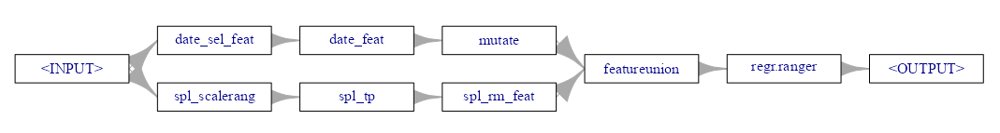{.lightbox width="632"}\

  <Details>

  <Summary>Code</Summary>

  ``` r
  learner_rf <- lrn(
    "regr.ranger",
    num.trees  = 1000
  )
  # learner_xgb <- lrn("regr.xgboost")
  learner_lgbm <- lrn("regr.lightgbm")
  learner_cat <- lrn("regr.catboost")


  gr_rf <- gunion(list(path_date, path_spline)) %>>% 
    po("featureunion") %>>% 
    learner_rf

  # gr_xgb <- gunion(list(path_date, path_spline)) %>>%
  #   po("featureunion") %>>%
  #   learner_xgb
  # Error: 'xgb.params' is not an exported object from 'namespace:xgboost'
  # This happened in PipeOp regr.xgboost's $train()

  gr_lgbm <- gunion(list(path_date, path_spline)) %>>% 
    po("featureunion") %>>% 
    learner_lgbm
  gr_cat <- gunion(list(path_date, path_spline)) %>>% 
    po("featureunion") %>>%   
    learner_cat

  gr_rf$plot(horizontal = TRUE)
  ```

  </Details>

  - Learners (i.e. models) are specified and tacked on the end of the paths to create Graph objects. One learner per graph object.
  - I couldn't get XGBoost to work. The final error didn't seem like something I could correct, so I just moved on. Probably need to create an issue with the mlr3 people.
  - The plot method allows you to see your Graph structure. The random forest pipeline is shown but they're all the same.

  ###### Run CV

  ``` r
  learners_pm10 <- list(
    glrn_rf = as_learner(gr_rf),
    # glrn_xgb = as_learner(gr_xgb),
    glrn_lgbm = as_learner(gr_lgbm),
    glrn_cat = as_learner(gr_cat)
  )

  # set up resampling
  rcv_st_pm10 <- rsmp(
    "repeated_sptcv_cstf", 
    folds = 5, 
    repeats = 3
  )

  # needed so kriging can train on the same indices
  # rcv_st_pm10$instantiate(task_st_pm10)

  design_pm10 <- benchmark_grid(
    tasks = task_st_pm10,
    learners = learners_pm10,
    resamplings = rcv_st_pm10
  )

  mirai::daemons(
    10L, 
    .compute = "mlr3_parallelization", 
    seed = 2026L, 
    output = TRUE
  )

  tictoc::tic()
  # ~ 3.63 min for rf, lgbm, cat
  bmr_pm10 <- benchmark(design_pm10)
  tictoc::toc()

  mirai::daemons(0)

  bmr_pm10$aggregate(msr("regr.rmse")) |> 
    select(learner_id, resampling_id, regr.rmse) |> 
    mutate(learner_id = stringr::str_extract(learner_id, "regr\\.(\\w)*"))
  #>       learner_id       resampling_id regr.rmse
  #>           <char>              <char>     <num>
  #> 1:   regr.ranger repeated_sptcv_cstf 0.5561710
  #> 2: regr.lightgbm repeated_sptcv_cstf 0.5683319
  #> 3: regr.catboost repeated_sptcv_cstf 0.5521295


  (cat_fold_scores <- bmr_pm10$score(msr("regr.rmse")) |> 
    select(iteration, regr.rmse) |> 
      slice(31:45)) # catboost
  #>     iteration regr.rmse
  #>         <int>     <num>
  #>  1:         1 0.5109692
  #>  2:         2 0.5425213
  #>  3:         3 0.6898884
  #>  4:         4 0.5280379
  #>  5:         5 0.5458836
  #>  6:         6 0.5727127
  #>  7:         7 0.5623074
  #>  8:         8 0.5713485
  #>  9:         9 0.4784572
  #> 10:        10 0.5292341
  #> 11:        11 0.5459597
  #> 12:        12 0.5545424
  #> 13:        13 0.5155985
  #> 14:        14 0.5563014
  #> 15:        15 0.5781796

  sd(cat_fold_scores$regr.rmse)
  #> [1] 0.0465267

  0.5521295 / sd(tib_pm10$pm10)
  #> [1] 0.8807431

  # Train the production model
  lrn_cat <- as_learner(gr_cat)
  lrn_cat_final <- lrn_cat$train(task_st_pm10)

  preds_final <- lrn_cat_final$predict(task_st_pm10)
  # substantially better than the cv score
  preds_final$score(msr("regr.rmse"))
  #> regr.rmse 
  #> 0.3645166 
  ```

  - The Graphs are packaged up into a list
    - `as_learner` applied to a Graph object allows it to function as a "Learner"
  - The spatiotemporal CV method is specified.
    - In previous experimentation (nested cv), 5 folds with 3 repeats had good generaliztion error and was computationally efficient. Is this an apples to apples situation? Nope. Using it anyways.
    - Dudes from [Geocomputation with R](https://r.geocompx.org/spatial-cv#spatial-cv-with-mlr3) ran an example with 100 repeats 😲! So, maybe if I were only comparing ML models that would be an option, but ain't no way I'm running 500 krigeST models along with a tuning grid here.
  - Note that mlr3 has its own parallelization parameterization setting with [{future}]{style="color: #990000"}. Don't remember what [output = TRUE]{.arg-text} is about. Think I just copied it from an example.
  - Only about 3.6 minutes to complete this is pretty freaking awesome compared to the kriging times.
  - Catboost eeks out the victory. SD is okay so it looks like a stable algorithm for this data.

  ## krigeST

  mlr3 has functions that allow you to use the cross-validation row indices outside of its framework which is nice. This way I can cross-validate krigeST without much effort.

  In the gstats vignette, cross-validation scores are reported. If you check out the github for [{gstat}]{style="color: #990000"}, the code used is under demo \>\> stkrige-crossvalidation.R. I didn't dig into it though, since I had this easier mlr3 route.

  ###### CV Function

  <Details>

  <Summary>Code</Summary>

  ``` r
  fit_vario_sm <- readr::read_rds("../../temp-storage/gstat-vig9-sm-mod.rds")
  rcv_st_pm10 <- readr::read_rds("../../temp-storage/gstat-vig-krig1-mlr-rcv.rds")

  run_krigeST_fold <- function(
      fold_idx, 
      cv_folds, 
      sf_dat,
      vario_mod, 
      nmax, 
      bufferNmax) {

    # get train and test row indices from mlr3 resampling
    train_idx <- cv_folds$train_set(fold_idx)
    test_idx  <- cv_folds$test_set(fold_idx)

    # subset sf_p10 to train and test
    sf_train <- sf_dat[train_idx, ] |> sf::st_as_sf(coords = c("X", "Y"))
    sf_test  <- sf_dat[test_idx, ] |> sf::st_as_sf(coords = c("X", "Y"))

    # build SpatialPoints for train
    sp_train <- SpatialPoints(
      coords = st_coordinates(sf_train),
      proj4string = CRS("EPSG:25832")
    )

    # build SpatialPoints for test
    sp_test <- SpatialPoints(
      coords = st_coordinates(sf_test),
      proj4string = CRS("EPSG:25832")
    )

    # build STIDF for training data
    stidf_train <- STIDF(
      sp = sp_train,
      time = as.POSIXct(sf_train$date),
      data = data.frame(pm10 = sf_train$pm10)
    )

    # build STIDF for test locations 
    # where pm10 = NA, these are prediction targets
    stidf_test <- STIDF(
      sp = sp_test,
      time = as.POSIXct(sf_test$date),
      data = data.frame(pm10 = rep(NA_real_, nrow(sf_test)))
    )

    krige_pred <- tryCatch({
      krigeST(
        pm10 ~ 1,
        data = stidf_train,
        newdata = stidf_test,
        modelList = vario_mod,
        nmax = nmax,
        bufferNmax = bufferNmax,
        computeVar = TRUE
      )
    }, error = \(e) {
      message("Fold ", fold_idx, " failed: ", e$message)
      return(NULL)
    })

    if (is.null(krige_pred)) return(NULL)

    tibble(
      fold = fold_idx,
      nmax = nmax,
      bufferNmax = bufferNmax,
      station_id = sf_test$station_id,
      date = sf_test$date,
      observed = sf_test$pm10,
      predicted = krige_pred@data$var1.pred,
      pred_var = krige_pred@data$var1.var
    )
  }
  ```

  </Details>

  - The function takes the test and train row indices from the mlr3 folds, subsets the dat accordingly, uses them to create [STFDF]{.arg-text} objects, runs `krigeST`, and records the results.

  ###### Run CV

  ``` r
  # tune nmax. then tune bufferNmax. then tune nmax again
  # settings for final cv run
  krig_grid <- expand.grid(
    fold_idx = 1:15,
    nmax = c(8, 9, 11, 12),
    bufferNmax = 132
  ) |> 
    mutate(
      cv_folds = list(rcv_st_pm10),
      sf_dat = list(sf_pm10),
      vario_mod = list(fit_vario_sm)
    )

  plan(future.mirai::mirai_multisession, workers = 12L)

  tictoc::tic()
  # run CV across all folds
  # 8265.92 sec or 3.15 hrs with 12 workers w/nmax = c(10, 15, 20), bufferNmax = c(1, 2)
  # 6077.15 sec or 1.68 hrs with 12 workers w/nmax = 10, bufferNmax = c(1, 2, 3)
  # 7479.77 sec or 2.08 hrs with 12 workers w/nmax = c(8, 9, 11, 12), bufferNmax = 132
  tib_res_cv_krige <- purrr::pmap(
    krig_grid,
    run_krigeST_fold
  ) |>
    futurize() |>
    purrr::list_rbind()
  tictoc::toc()

  mirai::daemons(0)

  # showing last two cv runs
  # winner: RMSE = 0.4947919
  (res_scores <- tib_res_cv_krige |>
    summarize(
      RMSE = sqrt(mean((observed - predicted)^2, na.rm = TRUE)),
      ME = mean(observed - predicted, na.rm = TRUE),
      .by = c(nmax, bufferNmax)
    ) |> 
    arrange(RMSE))
  #> # A tibble: 9 × 4
  #>    nmax bufferNmax  RMSE      ME
  #>   <dbl>      <int> <dbl>   <dbl>
  #> 1    10        132 0.495 -0.0123
  #> 2    10        131 0.495 -0.0124
  #> 3    10        133 0.495 -0.0123
  #> 4    10        134 0.495 -0.0122
  #> 5    10        135 0.495 -0.0121
  #> 6    10        136 0.496 -0.0119
  #> 7    10        137 0.496 -0.0118
  #> 8    10        138 0.496 -0.0118
  #> 9    10        139 0.496 -0.0119

  #> # A tibble: 4 × 4
  #>    nmax bufferNmax  RMSE       ME
  #>   <dbl>      <dbl> <dbl>    <dbl>
  #> 1     9        132 0.495 -0.0154 
  #> 2     8        132 0.495 -0.0190 
  #> 3    11        132 0.496 -0.0116 
  #> 4    12        132 0.497 -0.00908


  tib_res_cv_krige |>
    filter(
      nmax == 10,
      bufferNmax == 132
    ) |>
    summarize(
      RMSE = sqrt(mean((observed - predicted)^2, na.rm = TRUE)),
      ME   = mean(observed - predicted, na.rm = TRUE),
      .by = fold
    )
  #> # A tibble: 15 × 3
  #>     fold  RMSE      ME
  #>    <int> <dbl>   <dbl>
  #>  1     1 0.438 -0.0191
  #>  2     2 0.455 -0.0269
  #>  3     3 0.631 -0.173 
  #>  4     4 0.462  0.100 
  #>  5     5 0.481  0.0341
  #>  6     6 0.507 -0.0467
  #>  7     7 0.495 -0.0741
  #>  8     8 0.509 -0.0852
  #>  9     9 0.430  0.116 
  #> 10    10 0.497  0.0586
  #> 11    11 0.503 -0.0977
  #> 12    12 0.486 -0.0345
  #> 13    13 0.443  0.0401
  #> 14    14 0.499  0.0831
  #> 15    15 0.532 -0.0198


  # lower is better
  # guidelines say "weakly informative"
  res_scores |> 
    filter(nmax == 10, bufferNmax == 132) |> 
    summarize(rmse_ratio = mean(RMSE)/sd(tib_pm10$pm10))
  #> # A tibble: 1 × 1
  #>   rmse_ratio
  #>        <dbl>
  #> 1      0.789


  moose <- tib_res_cv_krige |>
    filter(
      nmax == 10,
      bufferNmax == 132
    )
  yardstick::rsq_vec(moose$observed, moose$predicted)
  #> [1] 0.3840644
  ```

  - Using CV to also tune [nmax]{.arg-text} and [bufferNmax]{.arg-text}.
    - Results show a [nmax = 10]{.arg-text} and [bufferNmax = 132]{.arg-text} with the lowest RMSE
    - Process: Tune [nmax]{.arg-text}. Then tune [bufferNmax]{.arg-text}. Then tune [nmax]{.arg-text} again
    - Tuning [bufferNmax]{.arg-text}, while grooling because I didn't have any kind of heuristic at the time, bettered my RMSE by around 20%.
  - Process time varied based on the tuning grid, but it typically ranged beween 1.68 and 3.15 hrs per run using using 12 workers on my rig.
    - Claude and I came up with some speed-up ideas. Hopefully I'll apply those someday and create a pull request or package out it.
  - I experimented with a logged PM10 (results shown) and not-logged PM10. It doesn't seem to affect the scores much at all, but hopefully the residuals will look better.
  - Neither the Catboost nor this kriging model are *good* models, but they're better than taking the mean. They're also basic models with no real predictors. Adding informative predictors (e.g. wind speed, distance from factories, interstates, elevation, weather, population, etc.) would hopefully make these much better.
    - 78% for the RMSE Ratio puts this model (and Catboost) in the "weakly predictive " category. (See[Diagnostics, Regression \>\> ML Prediction](diagnostics-regression.qmd#sec-diag-reg-mlpred){style="color: green"} \>\> GOF)
    - The Catboost has a few engineered variables but those (basic space and time variables) are just so it can play on the same field as a true spatio-temporal model.
  :::

- [Example 2]{.ribbon-highlight}: Diagnostics

  :::: panel-tabset
  ## Data and Set-Up

  Diagnostics are peformed on the cross-validation results of Catboost and Ordiary Kriging models

  **tl;dr**

  - krigeST and Catboost are pretty decent at predicting PM10 values between 0 and 40.
    - For values between 40 and 100, krigeST is by far the best but not good. Catboost's predictions stop being useful at around 60.
  - No real obvious spatial or temporal patterns regarding prediction performance or bias. A few fuzzy ones though.
    - Catboost possibly indicates a PM10 level jump at around Northing 5750000
    - There's a large model disagreement around January 2006 that might be worth investigating.
  - Overall, I'd prefer krigeST's advantage at predicting higher levels of PM10.

  This is the PM10 air pollution dataset for Germany that’s from [{spacetime}]{style="color: #990000"} and used in many of my examples.

  This example is a continuation from getting starting values for the marginal components (space and time), getting starting values for the joint components, fitting the variogram, and running cross-validation on predictive models. See:

  - [EDA \>\> Temporal Depenndence](geospatial-spat-temp.qmd#sec-geo-sptemp-eda-ac){style="color: green"} \>\> Example 2
  - [EDA \>\> Spatial Dependence](geospatial-spat-temp.qmd#sec-geo-sptemp-eda-spdep){style="color: green"} \>\> Example 1
  - [Starting Values \>\> Joint Models](geospatial-spat-temp.qmd#sec-geo-sptemp-krig-stval-joint){style="color: green"} \>\> Example 1
  - [Variogram \>\> Examples](geospatial-spat-temp.qmd#sec-geo-sptemp-krig-var-ex){style="color: green"} \>\> Example 1
  - [Examples](geospatial-spat-temp.qmd#sec-geo-sptemp-krig-ex){style="color: green"} \>\> Example 1 and Example 3

  <Details>

  <Summary>Code</Summary>

  ``` r
  pacman::p_load(
    dplyr,
    ggplot2,
    ggdist,
    DALEX,
    DALEXtra
  )

  tib_res_cv_krige_fin <- tib_res_cv_krige |> 
    filter(
      nmax == 10,
      bufferNmax == 132
    )

  set.seed(2026)
  options(scipen = 999)
  notebook_colors <- unname(swatches::read_ase(here::here("palettes/Forest Floor.ase")))


  data(air, package = "spacetime")

  # get rural location time series from 2005 to 2010
  rural_log <- spacetime::STFDF(
    sp = stations, 
    time = dates, 
    data = data.frame(PM10 = log(as.vector(air)))
  )
  rr <- rural_log[,"2005::2010"]

  # remove station ts w/all NAs
  unsel <- which(apply(
    as(rr, "xts"), 
    2, 
    function(x) all(is.na(x)))
  )
  r5to10 <- rr[-unsel,]

  sf_r5 <- r5to10 |> # STFDF object
    stars::st_as_stars() |> 
    sf::st_as_sf(long = TRUE) |> 
    rename(geometry = sfc)

  tib_stations <- as_tibble(stations@coords) |> 
    mutate(station_id = rownames(stations@coords))

  sf_stations <- sf::st_as_sf(
    tib_stations,
    coords = c("coords.x1", "coords.x2"),
    crs = sf::st_crs(sf_r5)
  )

  sf_pm10 <- sf_r5 |> 
    sf::st_join(sf_stations) |> 
    sf::st_transform(crs = 25832) |> # projected, UTM zone 32N
    filter(!is.na(PM10)) |> 
    rename(date = time, pm10 = PM10)


  tib_pm10 <- sf_pm10 |> 
    sf::st_drop_geometry() |> 
    mutate(
      date_feat = date, # extra for feat eng
      X = sf::st_coordinates(sf_pm10)[, 1],
      Y = sf::st_coordinates(sf_pm10)[, 2]
    )

  # used for joining station_ids
  tib_sf_pm10_ids <- sf_pm10 |>
    sf::st_drop_geometry() |>
    mutate(row_id = row_number()) |>
    select(row_id, station_id, date)

  # used for joining station coords --- projected and geographic
  tib_station_coords <- sf_pm10 |>
    select(station_id) |>
    mutate(
      x = sf::st_coordinates(geometry)[, "X"],
      y = sf::st_coordinates(geometry)[, "Y"]
    ) |>
    sf::st_drop_geometry() |> 
    distinct()

  tib_station_coords_ll <- sf_pm10 |>
    select(station_id) |>
    sf::st_transform(crs = 4326) |>
    mutate(
      x = sf::st_coordinates(geometry)[, "X"],
      y = sf::st_coordinates(geometry)[, "Y"]
    ) |>
    sf::st_drop_geometry() |> 
    distinct()


  # ---- Prepare CV Results ----

  # calculate log residuals from test folds
  cv_krige_log <- tib_res_cv_krige_fin |>
    summarize(
      predicted = mean(predicted, na.rm = TRUE),
      pred_var  = mean(pred_var, na.rm = TRUE),
      observed  = first(observed),
      .by = c(station_id, date) # stratification vars
    ) |>
    mutate(
      residual_log = observed - predicted,
      model = "krigeST"
    )

  cv_cat_log <- purrr::map(1:15, \(i) {
    pred <- cv_cat_pm10$resample_result(3)$predictions()[[i]]
    tibble(
      fold = i,
      row_id = pred$row_ids,
      observed = pred$truth,
      predicted = pred$response
    )
  }) |>
    purrr::list_rbind() |>
    left_join(tib_sf_pm10_ids, by = "row_id") |>
    # averages predictions by location and data across all test folds and repeats
    summarize(
      predicted = mean(predicted, na.rm = TRUE),
      observed = first(observed),
      .by = c(station_id, date)
    ) |> 
    mutate(
      residual_log = observed - predicted,
      model = "Catboost"
    )

  cv_log <- cv_krige_log |>
    bind_rows(cv_cat_log) |>
    mutate(
      month = lubridate::month(date),
      season = case_when(
        month %in% c(12, 1, 2)  ~ "DJF",
        month %in% c(3, 4, 5)   ~ "MAM",
        month %in% c(6, 7, 8)   ~ "JJA",
        month %in% c(9, 10, 11) ~ "SON"
      ) |>
        factor(levels = c("DJF", "MAM", "JJA", "SON"))
    )

  # global smear factor
  smear_factor_global <- cv_log |>
    summarize(
      smear_global = mean(exp(residual_log), na.rm = TRUE),
      .by = model
    )

  cv_combined <- cv_log |>
    left_join(smear_factor_global, by = "model") |>
    mutate(
      predicted = exp(predicted) * smear_global,
      observed = exp(observed),
      residual = observed - predicted,
      model = factor(model, levels = c("krigeST", "Catboost")),
    )
  ```

  </Details>

  - This code backtransforms the logged observed and predicted variables, calculates the residuals, and creates some coordinate dataframes.
  - There is a bias when back-transforming logged expected values (outcome variables). I tested four options: exponentiation, gaussian bias correction, Duan's global smear, and Duan's local smear.
    - See [Feature Engineering, General \>\> Continuous \>\> Transformations \>\> Logging](feature-engineering-general.qmd#sec-feat-eng-gen-cont-tran-log){style="color: green"} for the testing code and further details on the backtransformation methods
    - Exponentiating to the median doesn't really fit the use case.
    - The gaussian bias corrections uses the prediction variance from `krigeST(computeVar=TRUE)` but requires the residual destribution to be Normal
    - Duan's global smear had the best scores for ME and RMSE on the original scale which is what I cared about most.
  - [cv_cat_pm10]{.var-text} and [tib_res_cv_krige]{.var-text} are the cross-validation results from Example 1

  ## Residuals

  ###### Distribution

  {.lightbox group="krig-interp-ex2-resid" width="582"}

  <Details>

  <Summary>Code</Summary>

  ``` r

  p_resid_dist <- cv_combined |> 
    ggplot(
      aes(y = model, 
          x = residual,
          fill = model)
    ) +
    # density
    stat_slab(
      aes(thickness = after_stat(pdf*n)), 
      scale = 0.5) +
    # histogram
    stat_dotsinterval(
      side = "bottom", 
      scale = 0.5, 
      slab_linewidth = NA) + # not sure why, setting to NA applies proper color to dots
    scale_fill_manual(values = c(notebook_colors[[5]], notebook_colors[[6]])) +
    labs(title = "Residual Distributions") +
    xlab("Residual") +
    guides(fill = "none") +
    theme_notebook(
      plot.title.position = "plot",
      axis.title.y = element_blank(),
      axis.text.y = element_text(size = 14, face = "bold"),
      panel.border = element_rect(color = "#FFFDF9FF", 
                                  fill = "#FFFDF9FF", 
                                  linewidth = 1.5))
  ```

  </Details>

  - The bulk (sans outliers) of the catboost's and krigeST's residuals are asymmetric wtih krigeST a little less asymmetric.
  - Both distributions have sharper peaks (leptokurtic) and median's slightly left of zero indicating an over-prediction bias.
  - There are looong tails, especially on the right (under-prediction) for Catboost.
    - i.e. there are might be some extreme observed values that the models are having trouble predicting.

  ###### Q-Q

  {.lightbox group="krig-interp-ex2-resid" width="582"}

  <Details>

  <Summary>Code</Summary>

  ``` r
  p_qq <- cv_combined |>
    ggplot(aes(sample = residual, color = model)) +
    stat_qq() +
    stat_qq_line() +
    scale_color_manual(
      values = c(notebook_colors[[5]], notebook_colors[[6]])
    ) +
    facet_wrap(~model) +
    labs(
      title = "Residual QQ-Plot",
      x = "Theoretical Quantiles",
      y = "Sample Quantiles"
    ) +
    theme_notebook(legend.position = "none")
  ```

  </Details>

  - The fatter tails and outliers are clearly indicated in this chart
  - The assymetries of residual distributions are also obvious now

  ###### Residuals vs. Predicted

  {.lightbox group="krig-interp-ex2-resid" width="582"}

  <Details>

  <Summary>Code</Summary>

  ``` r
  p_resid_pred <- cv_combined |>
    ggplot(
      aes(x = predicted, 
          y = residual, 
          color = model)
    ) +
    geom_point(alpha = 0.3, size = 0.8) +
    geom_hline(yintercept = 0, linetype = "dashed") +
    scale_color_manual(
      values = c(notebook_colors[[5]], notebook_colors[[6]])
    ) +
    facet_wrap(~model) +
    labs(
      title = "Residuals vs Predicted",
      x = "Predicted PM10",
      y = "Residual"
    ) +
    theme_notebook(legend.position = "none")
  ```

  </Details>

  - Both distributions display some randomness except for the floor for the negative residuals that deepens as the predictions get larger.
    - I'm guessing this is due to the strictly positive nature of the pm10 variable. Makes sense to me for a tree model (all positives in leaves), but I'm not sure about the reasoning behind the kriging model being affected by it.
  - For krigeST, there's an under-prediction bias until it evens out at around 20. Afterwards, the model is biased towards over-prediction.
    - Relatively few outlier under-predictions at small predicted values, i.e under-predictions for large observed values
  - For Catboost, there's an under-prediction bias until it evens out at around 30. In fact, Catboost doesn't seem to have a larger prediction than around 68 even though the maximum observed value of PM10 is 274.
    - Some very high positive outlier residuals at low predicted values indicated some bad under-predictions.

  ###### Robust Distributions per Prediction Quantile

  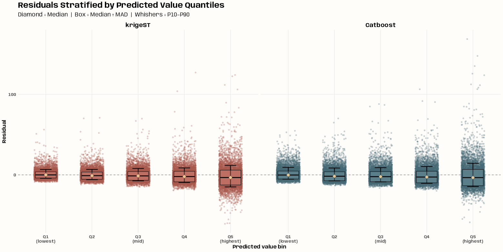{.lightbox group="krig-interp-ex2-resid" width="632"}

  <Details>

  <Summary>Code</Summary>

  ``` r
  # stratify predicted values into quantile-based bins
  n_bins <- 5

  tib_quant_bins <- cv_combined |>
    mutate(
      pred_bin = cut(
        predicted,
        breaks = quantile(
          predicted, 
          probs = seq(0, 1, length.out = n_bins + 1)
        ),
        include.lowest = TRUE,
        labels = paste0("Q", seq_len(n_bins))
      ),
      .by = model
    )

  # stratify residuals per predicted value quantile bin
  bin_stats <- tib_quant_bins |>
    summarize(
      median_res = median(residual),
      mad_res = mad(residual),
      p10 = quantile(residual, 0.10),
      p90 = quantile(residual, 0.90),
      .by = c(model, pred_bin)
    )

  p_res_pred_bin <- ggplot(
    tib_quant_bins, 
    aes(x = pred_bin, 
        y = residual,
        color = model)
  ) +
    geom_hline(
      yintercept = 0, 
      linetype = "dashed", 
      color = "grey50", 
      linewidth = 0.5) +
    # points base on residuals
    geom_jitter(
      width = 0.25, 
      alpha = 0.25, 
      size = 1.2
    ) +
    # whiskers based on residuals
    geom_errorbar(
      data = bin_stats,
      aes(x = pred_bin, 
          ymin = p10, 
          ymax = p90),
      inherit.aes = FALSE,
      width = 0.25,
      linewidth = 0.8
    ) +
    # custom IQR box based median and mad residual
    geom_crossbar(
      data = bin_stats,
      aes(
        x = pred_bin,
        y = median_res,
        ymin = median_res - mad_res,
        ymax = median_res + mad_res,
        fill = model
      ),
      inherit.aes = FALSE,
      width = 0.45,
      linewidth = 0.4,
      alpha = 0.25
    ) +
    scale_color_manual(values = c(
      "krigeST" = notebook_colors[[5]], 
      "Catboost" = notebook_colors[[6]]
    )) +
    scale_fill_manual(values = c(
      "krigeST" = prismatic::clr_lighten(notebook_colors[[5]], shift = 0.6), 
      "Catboost" = prismatic::clr_lighten(notebook_colors[[6]], shift = 0.6)
    )) +
    # median residual (diamond shape)
    geom_point(
      data = bin_stats,
      aes(x = pred_bin, 
          y = median_res),
      inherit.aes = FALSE,
      size = 3.5,
      shape = 18,
      fill = prismatic::clr_lighten(notebook_colors[[7]], shift = 0.6),
      color = prismatic::clr_lighten(notebook_colors[[7]], shift = 0.6)
    ) +  
    scale_x_discrete(
      labels = c("Q1\n(lowest)", "Q2", "Q3\n(mid)", "Q4", "Q5\n(highest)")
    ) +
    facet_wrap(~ model) +
    guides(color = "none", fill = "none") +
    labs(
      title = "Residuals Stratified by Predicted Value Quantiles",
      subtitle = "Diamond = Median  |  Box = Median ± MAD  |  Whishers = P10–P90",
      x = "Predicted value bin",
      y = "Residual"
    ) +
    theme_notebook()
  ```

  </Details>

  - For skewed distributions, this method (median + mad) provides a more robust description of the residual distributions.
  - For both models, the quantile medians show at trend towards higher and higher over-prediction bias as predictions get larger.
    - In the last quantile, the distributions approaches being symmetric except for the outliers. Perhaps some informative predictor variables would lessen these.
  - The progression from low and high predictions doesn't seem to drastically change the size of the box plots (not getting substantially longer), so heteroskedacity probably isn't a huge problem.
    - The boxes do get a little bigger at Q4 and Q5, but I don't think that's as important as all the outliers.

  ###### Residual Variograms

  ::: {layout-ncol="2"}
  {.lightbox group="krig-interp-ex2-resid" width="382"}

  {.lightbox group="krig-interp-ex2-resid" width="382"}
  :::

  <Details>

  <Summary>Code</Summary>

  ``` r
  # creating a full grid (STFDF)
  cv_dates <- cv_combined |> 
    select(date) |> 
    distinct() |> 
    summarize(
      min_date = min(date),
      max_date = max(date)
    )

  cv_dates_full <- tibble(
    date = seq(
      cv_dates$min_date[[1]], 
      cv_dates$max_date[[1]], 
      by = "day"
    )
  )


  # -------------- krigeST --------------


  cv_combined_full <- cv_combined |> 
    filter(model == "krigeST") |> 
    select(date, station_id, residual) |> 
    group_split(station_id) |> 
    purrr::map(\(x) {
      current_station <- x |> 
        select(station_id) |> 
        pull(station_id) |> 
        first()
      cv_combined_full_station <- cv_dates_full |> 
        left_join(x, by = "date") |> 
        mutate(station_id = ifelse(is.na(station_id), current_station, station_id))
    }
    ) |> 
    purrr::list_rbind() |> 
    arrange(date)

  cv_coords_full <- cv_combined_full |> 
    slice_min(date) |> 
    select(station_id) |> 
    left_join(tib_station_coords_ll, by = "station_id") |> 
    tibble::column_to_rownames("station_id") |> 
    as.matrix(rownames.force = TRUE)

  stfdf_resid <- spacetime::STFDF(
    sp = sp::SpatialPoints(
      coords = cv_coords_full,
      proj4string = sp::CRS("+proj=longlat +datum=WGS84 +no_defs")
    ),                                                      # 53 stations (rows of coords)
    time = as.POSIXct(cv_dates_full$date),                  # 1826 dates
    data = data.frame(residual = cv_combined_full$residual) # 96778 observations = 53 * 1826
  )

  # w/na.omit = TRUE you get an identical plot
  vario_resid <- gstat::variogramST(
    residual ~ 1,
    data = stfdf_resid,
    tlags = 0:14
  )


  tib_resid_vario <- vario_resid |>
    filter(!is.na(gamma)) |>
    mutate(
      timelag_num = as.numeric(timelag),
      lag_label = factor(
        paste0("lag", timelag_num),
        levels = paste0("lag", 0:(length(unique(as.numeric(timelag))) - 1))
      )
    )

  # named list for colors
  lag_colors <- setNames(
    rev(scico::scico(length(unique(tib_resid_vario$timelag)), palette = "glasgow")),
    paste0("lag", 0:(length(unique(tib_resid_vario$timelag))-1))
  )

  p_resid_vario <- tib_resid_vario |>
    ggplot(aes(
      x = avgDist,
      y = gamma,
      group = lag_label,
      color = lag_label
    )) +
    geom_line(linewidth = 1.75) +
    scale_y_continuous(breaks = seq(0, 175, by = 25)) +
    expand_limits(y = c(0, 125)) +
    scale_color_manual(
      values = lag_colors,
      name = NULL
    ) +
    guides(color = guide_legend(reverse = TRUE)) +
    labs(
      title = "Spatio-Temporal Variogram of KrigeST Residuals",
      x = "Distance (km)",
      y = "Semivariance"
    ) +
    theme_notebook(legend.key.width = unit(1, "cm"))


  # -------------- Catboost --------------


  cv_combined_full_cat <- cv_combined |> 
    filter(model == "Catboost") |> 
    select(date, station_id, residual) |> 
    group_split(station_id) |> 
    purrr::map(\(x) {
      current_station <- x |> 
        select(station_id) |> 
        pull(station_id) |> 
        first()
      cv_combined_full_station <- cv_dates_full |> 
        left_join(x, by = "date") |> 
        mutate(station_id = ifelse(is.na(station_id), current_station, station_id))
    }
    ) |> 
    purrr::list_rbind() |> 
    arrange(date)

  cv_coords_full_cat <- cv_combined_full_cat |> 
    slice_min(date) |> 
    select(station_id) |> 
    left_join(tib_station_coords_ll, by = "station_id") |> 
    tibble::column_to_rownames("station_id") |> 
    as.matrix(rownames.force = TRUE)

  stfdf_resid_cat <- spacetime::STFDF(
    sp = sp::SpatialPoints(
      coords = cv_coords_full_cat,
      proj4string = sp::CRS("+proj=longlat +datum=WGS84 +no_defs")
    ),                                                       # 53 stations (rows of coords)
    time = as.POSIXct(cv_dates_full$date),                   # 1826 dates
    data = data.frame(residual = cv_combined_full_cat$residual) # 96778 observations = 53 * 1826
  )

  # w/na.omit = TRUE you get an identical plot
  vario_resid_cat <- gstat::variogramST(
    residual ~ 1,
    data = stfdf_resid_cat,
    tlags = 0:14
  )

  tib_resid_vario_cat <- vario_resid_cat |>
    filter(!is.na(gamma)) |>
    mutate(
      timelag_num = as.numeric(timelag),
      lag_label = factor(
        paste0("lag", timelag_num),
        levels = paste0("lag", 0:(length(unique(as.numeric(timelag))) - 1))
      )
    )


  lag_colors_cat <- setNames(
    rev(scico::scico(length(unique(tib_resid_vario_cat$timelag)), palette = "glasgow")),
    paste0("lag", 0:(length(unique(tib_resid_vario_cat$timelag))-1))
  )

  p_resid_vario_cat <- tib_resid_vario_cat |>
    ggplot(aes(
      x = avgDist,
      y = gamma,
      group = lag_label,
      color = lag_label
    )) +
    geom_line(linewidth = 1.75) +
    scale_y_continuous(breaks = seq(0, 175, by = 25)) +
    expand_limits(y = c(0, 125)) +
    scale_color_manual(
      values = lag_colors_cat,
      name = NULL
    ) +
    guides(color = guide_legend(reverse = TRUE)) +
    labs(
      title = "Spatio-Temporal Variogram of Catboost Residuals",
      x = "Distance (km)",
      y = "Semivariance"
    ) +
    theme_notebook(legend.key.width = unit(1, "cm"))
  ```

  </Details>

  - krigeST has a lower overall semivariance (spatial autocorrelation) and tighter lag clustering (temporal autocorrelation) indicating that krigeST captured more of the spatio-temporal signal, leaving less structured variance in its residuals.
  - Both models have spikes of semi-variance at a short distance (20 to 35km?) and could use predictors to help with that.
  - For Catboost, a greater emphasis on adding time variables to decrease that lag spread would be most helpful.
  - Maybe adding some spatial lags (both models?) would help with the leftover semi-variance.

  ## Spatial

  ###### Processing

  <Details>

  <Summary>Code</Summary>

  ``` r
  germany <- rnaturalearth::ne_countries(
    country = "Germany",
    scale = "medium",
    returnclass = "sf"
  ) |>
    sf::st_transform(crs = 25832)


  tib_station_metrics <- cv_combined |>
    summarize(
      RMSE = sqrt(mean(residual^2, na.rm = TRUE)),
      ME = mean(residual, na.rm = TRUE),
      .by = c(model, station_id)
    ) |>
    left_join(tib_station_coords, by = "station_id") |>
    sf::st_as_sf(coords = c("x", "y"), crs = 25832)
  ```

  - Getting the base map and calculating metrics per station and model

  </Details>

  ###### RMSE

  {.lightbox group="krig-interp-ex2-spat" width="582"}

  <Details>

  <Summary>Code</Summary>

  ``` r
  tib_rmse_outliers <- tib_station_metrics |> 
    select(-ME) |> 
    tidyr::pivot_wider(names_from = model, values_from = RMSE) |> 
    mutate(rmse_diff = abs(krigeST - Catboost)) |> 
    slice_max(rmse_diff, n = 4) |> 
    select(-rmse_diff) |> 
    tidyr::pivot_longer(
      cols = c(krigeST, Catboost),
      names_to = "model",
      values_to = "RMSE"
    )

  p_map_rmse <- tib_station_metrics |>
    ggplot() +
    geom_sf(
      data = germany, 
      fill = "#263238",
      color = "#37474F",
      linewidth = 0.2
    ) +
    geom_sf(aes(color = RMSE, size = RMSE)) +
    geom_sf_label(
      data = tib_rmse_outliers |>
        filter(station_id == "DEBB056"),
      aes(label = paste0(station_id, "\n", round(RMSE, 2))),
      nudge_x = -40000,
      nudge_y = 35000,
      size = 3
    ) +
    geom_sf_label(
      data = tib_rmse_outliers |>
        filter(station_id == "DEBE056"),
      aes(label = paste0(station_id, "\n", round(RMSE, 2))),
      nudge_x = 0,
      nudge_y = -35000,
      size = 3
    ) +
    geom_sf_label(
      data = tib_rmse_outliers |>
        filter(station_id %in% c("DEBB053", "DEBW030")),
      aes(label = paste0(station_id, "\n", round(RMSE, 2))),
      nudge_x = 47000,
      nudge_y = 32000,
      size = 3
    ) +
    scale_color_gradientn(
      # sunsetdark from CARTOColors
      colors = colorRampPalette(c(
        "#fcde9c","#faa476","#f0746e","#e34f6f",
        "#dc3977","#b9257a","#7c1d6f"))(100)
    ) +
    facet_wrap(~model) +
    guides(
      color = guide_colorbar(order = 2),
      size = guide_legend(
        order = 1,
        reverse = TRUE,
        override.aes = list(color = "#fcde9c"))
    ) +
    labs(
      title = "RMSE by Station",
      subtitle = "Stations with greatest difference are highlighted
  ",
      color = "RMSE",
      size = "RMSE"
    ) +
    theme_slate_map()
  ```

  </Details>

  - Label Positions:
    - Two Top Locations: top-left of location and top-right of location
    - Middle-Top Location: bottom-middle
    - Middle-Bottom Location: top-right
  - All four locations have a difference of around three RMSE.
    - I didn't really dig into how many locations I should highlight or the distribution of differences. Chose 4 on a whim.
  - Not sure if the top right locations could be a cluster or not

  ###### Mean Error (ME)

  {.lightbox group="krig-interp-ex2-spat" width="582"}

  <Details>

  <Summary>Code</Summary>

  ``` r
  tib_me_outliers <- tib_station_metrics |> 
    select(-RMSE) |> 
    tidyr::pivot_wider(names_from = model, values_from = ME) |> 
    mutate(me_diff = abs(krigeST - Catboost)) |> 
    slice_max(me_diff, n = 4) |> 
    select(-me_diff) |> 
    tidyr::pivot_longer(
      cols = c(krigeST, Catboost),
      names_to = "model",
      values_to = "ME"
    )

  p_map_me <- tib_station_metrics |>
    ggplot() +
    geom_sf(
      data = germany, 
      fill = "#242424",
      color = "#333333",
      linewidth = 0.15
    ) +
    geom_sf(aes(
      color = ME, 
      size = abs(ME)
    )) +
    scale_color_gradientn(
      # tealrose from CARTOColors
      colors = colorRampPalette(c(
        "#009392", "#72aaa1", "#b1c7b3", "#f1eac8", 
        "#e5b9ad","#d98994", "#d0587e"))(100),
      limits = c(
        -max(abs(tib_station_metrics$ME)),
        max(abs(tib_station_metrics$ME))
      )
    ) +
    geom_sf_label(
      data = tib_me_outliers,
      aes(label = paste0(station_id, "\n", round(ME, 2))),
      nudge_x = -40000,
      nudge_y = 35000,
      size = 3
    ) +
    facet_wrap(~ model) +
    guides(size = guide_legend(
      reverse = TRUE,
      override.aes = list(color = "#f1eac8"))
    ) +
    labs(
      title = "Mean Error by Station",
      subtitle = "Stations with greatest difference are highlighted
  ",
      color = "ME",
      size = "|ME|"
    ) +
    theme_charcoal_map()
  ```

  </Details>

  - All locations: label is top-left of location
  - Varying difference sizes
  - No spatial patterns of over vs. under-prediction for either model.

  ## Temporal

  ###### Mean Residual by Month

  {.lightbox group="krig-interp-ex2-temp" width="582"}

  <Details>

  <Summary>Code</Summary>

  ``` r
  p_resid_time <- cv_combined |>
    mutate(year_month = lubridate::floor_date(date, "month")) |>
    summarize(
      mean_residual = mean(residual, na.rm = TRUE),
      .by = c(model, year_month)
    ) |>
    ggplot(aes(x = year_month, y = mean_residual, color = model)) +
    geom_line(linewidth = 2) +
    geom_hline(yintercept = 0, linetype = "dashed") +
    scale_color_manual(
      values = c(notebook_colors[[5]], notebook_colors[[6]])
    ) +
    labs(
      title = "Mean Residual Over Time",
      x = "Date",
      y = "Mean Residual",
      color = "Model"
    ) +
    theme_notebook(legend.position = "top")
  ```

  </Details>

  - January 2006 is interesting --- opposite directions and relatively large spikes.
  - Catboost definitely has the larger variance in residuals
  - krigeST spends most of the time overpredicting on average per month.

  ###### RMSE and ME by Season

  {.lightbox group="krig-interp-ex2-temp" width="582"}

  <Details>

  <Summary>Code</Summary>

  ``` r
  p_rmse_season <- cv_combined |>
    summarize(
      RMSE = sqrt(mean(residual^2, na.rm = TRUE)),
      ME = mean(residual, na.rm = TRUE),
      .by = c(model, season)
    ) |>
    tidyr::pivot_longer(
      cols = c(RMSE, ME),
      names_to = "metric",
      values_to = "value"
    ) |>
    ggplot(aes(x = season, y = value, fill = model)) +
    geom_col(position = "dodge") +
    scale_fill_manual(
      values = c(notebook_colors[[5]], notebook_colors[[6]])
    ) +
    facet_wrap(~metric, scales = "free_y") +
    labs(
      title = "RMSE and ME by Season",
      x = "Season",
      y = "Value",
      fill = "Model"
    ) +
    theme_notebook(legend.position = "top")
  ```

  </Details>

  - Both models have the same seasonal bias except for winter, but it's not a wild disagreement.
  - krigeST has the smaller RMSE in all 4 seasons

  ###### Prediction Difference by Month

  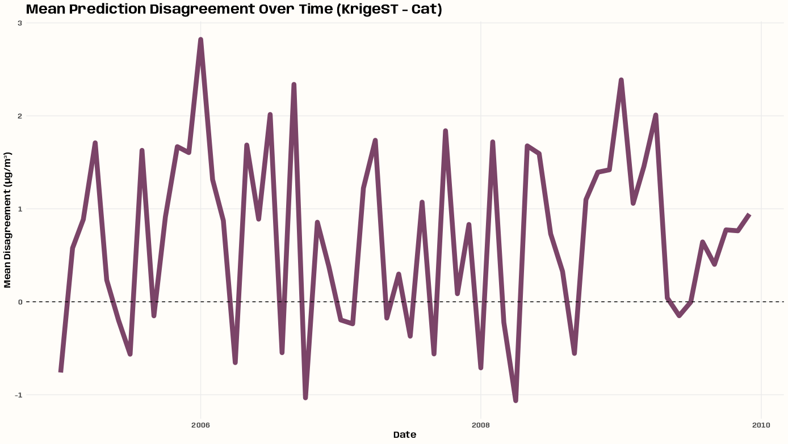{.lightbox group="krig-interp-ex2-resid" width="582"}

  <Details>

  <Summary>Code</Summary>

  ``` r
  tib_disagree_time <- cv_combined |>
    summarize(
      predicted = mean(predicted, na.rm = TRUE),
      .by = c(date, model)
    ) |>
    tidyr::pivot_wider(names_from = model, values_from = predicted) |>
    mutate(
      disagreement = krigeST - Catboost,
      year_month = lubridate::floor_date(date, "month")
    ) |>
    summarize(
      mean_disagreement = mean(disagreement, na.rm = TRUE),
      .by = year_month
    )

  p_disagree_temporal <- tib_disagree_time |>
    ggplot(aes(x = year_month, y = mean_disagreement)) +
    geom_line(color = notebook_colors[[9]], linewidth = 3) +
    geom_hline(yintercept = 0, linetype = "dashed") +
    labs(
      title = "Mean Prediction Disagreement Over Time (KrigeST - Cat)",
      x = "Date",
      y = "Mean Disagreement (µg/m³)"
    ) +
    theme_notebook()
  ```

  </Details>

  - Disagreement fluctuates over time
  - That large disagreement on January 2006 is more explicit here.

  ## Model-specific

  ###### Kriging PI Coverage

  {.lightbox group="krig-interp-ex2-modspec" width="432"}

  <Details>

  <Summary>Code</Summary>

  ``` r
  tib_pi <- tib_res_cv_krige_fin |>
    mutate(
      se = sqrt(pred_var),
      lower_95_log = predicted - 1.96 * se,
      upper_95_log = predicted + 1.96 * se,
      # back-transform to original scale after arithmetic
      lower_95 = exp(lower_95_log),
      upper_95 = exp(upper_95_log),
      observed_bt = exp(observed),
      covered = observed_bt >= lower_95 & observed_bt <= upper_95
    )

  tib_pi_station <- tib_pi |>
    summarize(
      coverage = mean(covered, na.rm = TRUE),
      .by = station_id
    ) |>
    left_join(tib_station_coords, by = "station_id") |>
    sf::st_as_sf(coords = c("x", "y"), crs = 25832)

  tib_pi_outlier <- tib_pi_station |> 
    filter(coverage < 0.95)

  p_pi_map <- tib_pi_station |>
    ggplot() +
    geom_sf(
      data = germany, 
      fill = "#263238",
      color = "#37474F",
      linewidth = 0.2
    ) +
    geom_sf(aes(color = coverage, size = coverage)) +
    geom_sf_label(
      data = tib_pi_outlier |> 
        filter(station_id != "DEBW031"),
      aes(label = paste0(station_id, "\n", round(coverage, 2))),
      nudge_x = -40000,
      nudge_y = 35000,
      size = 3
    ) +
    geom_sf_label(
      data = tib_pi_outlier |> 
        filter(station_id == "DEBW031"),
      aes(label = paste0(station_id, "\n", round(coverage, 2))),
      nudge_x = -40000,
      nudge_y = -35000,
      size = 3
    ) +
    scale_color_gradientn(
      # sunsetdark from CARTOColors
      colors = colorRampPalette(c(
        "#fcde9c","#faa476","#f0746e","#e34f6f",
        "#dc3977","#b9257a","#7c1d6f"))(100)
    ) +
    guides(size = guide_legend(
      reverse = TRUE,
      override.aes = list(color = "#fcde9c"))
    ) +
    labs(
      title = "95% Prediction Interval Coverage by Station",
      color = "Coverage",
      size = "Coverage"
    ) +
    theme_slate_map()

  tib_pi |>
    summarize(overall_coverage = mean(covered, na.rm = TRUE))
  #> # A tibble: 1 × 1
  #>   overall_coverage
  #>              <dbl>
  #> 1            0.981
  ```

  </Details>

  - Overall average coverage is 98.1% (see code) which is pretty convservative. This is likely caused by the Gaussian assumption of the residuals failing and inflating the prediction variance calculated by `krigeST`.
    - The interval could still be useful. 98% is just *more* certainty that is usually isn't required.
  - No apparent pattern to the under-covered locations

  ###### Catboost Variable Importance

  {.lightbox group="krig-interp-ex2-modspec" width="582"}

  <Details>

  <Summary>Code</Summary>

  ``` r

  # 3.3.2 https://mlr3book.mlr-org.com/chapters/chapter3/evaluation_and_benchmarking.html#sec-bm-resamp
  learner_cat_final <- readr::read_rds( "../../temp-storage/gstat-krig-log/lrn-cat-final.rds")

  # PredictionValuesChange shows how much on average the prediction changes if the feature value changes. The bigger the value of the importance the bigger on average is the change to the prediction value, if this feature is changed.
  cat_import_raw <- tibble(
    importance = unname(learner_cat_final$importance()),
    vars = names(learner_cat_final$importance())
  ) |> 
    mutate(vars = stringr::str_remove(vars, "date_feat\\."),
           vars = stringr::str_replace_all(vars, "_", " "),
           vars = stringr::str_to_title(vars))

  spline_total <- cat_import_raw %>%
    filter(stringr::str_detect(vars, "^Spline")) %>%
    summarize(
      vars = "Spline Total",
      importance = sum(importance, na.rm = TRUE)
    )

  cat_import_fin <- cat_import_raw |> 
    filter(!stringr::str_detect(vars, "^Spline")) %>%  # remove original spline vars
    bind_rows(spline_total) |> 
    mutate(vars = factor(vars),
           vars = forcats::fct_reorder(vars, importance))


  p_cat_import <- cat_import_fin |> 
    ggplot(aes(x = importance, y = vars)) +
    geom_col(fill = notebook_colors[[6]]) + 
    labs(title = "Catboost Feature Importance",
         subtitle = "Uses prediction value change method") +
    theme_notebook(
      axis.title.x = element_blank(),
      axis.title.y = element_blank(),
      axis.text.y = element_text(
        family = "Anybody",
        face = "bold",
        size = 12
      ),
      axis.text.x = element_text(
        family = "Anybody",
        face = "bold",
        size = 12
      ),
      plot.title.position = "plot"
    )
  ```

  </Details>

  - The [Splines Total]{.var-text}, [Year]{.var-text}, and [Day of Year]{.var-text} are supremely important
    - [Splines Total]{.var-text} is the sum of the importances of all the thin plate spatial spline basis function variables. Since importance is based on predictive difference, I think this should be fine.
  - Might be able to get rid of [Quarter]{.var-text}, [Month]{.var-text}, and [Day of Week]{.var-text} and not lose much.
  - Feature importance procedure covered in [Ch.3.3.2](https://mlr3book.mlr-org.com/chapters/chapter3/evaluation_and_benchmarking.html#sec-bm-resamp) of the [{mlr3}]{style="color: #990000"} book

  ###### Catboost CP Profiles

  {.lightbox group="krig-interp-ex2-modspec" width="582"}

  <Details>

  <Summary>Code</Summary>

  ``` r
  exp_cat <- explain_mlr3(
    learner_cat_final,
    data = tib_pm10,
    y = tib_pm10$pm10,
    label = ""
  )

  cat_prof <- model_profile(exp_cat, variables = c("X", "Y"))

  p_pdp <- plot(
    cat_prof,
    geom = "profiles"
  ) +
    labs(
      title = "Ceteris Paribus Profiles",
      subtitle = "Catboost"
    ) +
    theme_notebook()

  p_pdp@layers[[2]]$aes_params$colour <- notebook_colors[[6]]

  # find facet variable
  p_pdp$facet$params$facets
  #> <list_of<quosure>>
  #> 
  #> $`_vname_`
  #> <quosure>
  #> expr: ^`_vname_`
  #> env:  0x000002100f466a68

  # confirm
  moose <- ggplot_build(p_pdp)
  moose$layout$layout
  #>   PANEL ROW COL _vname_ SCALE_X SCALE_Y COORD
  #> 1     1   1   1     doy       1       1     1
  #> 2     2   1   2       X       2       1     2
  #> 3     3   1   3       Y       3       1     3

  p_pdp <- p_pdp +
    facet_wrap(
      vars(`_vname_`),
      scales = "free_x",
      labeller = as_labeller(c(
        # "doy" = "Day of the Year",
        "X" = "Easting (m)",
        "Y" = "Northing (m)"
      ))
    )
  ```

  </Details>

  - Highlighted line is the partial dependence (pd) line which is the mean of all the gray lines. There doesn't seem to be any clustering patterns present in the gray lines, so 1 pd line is sufficient.
  - The coordinates are projected and not geographical so [Easting]{.var-text} and [Northing]{.var-text} are the appropriate nomenclature for [X]{.var-text} and [Y]{.var-text} coordinates.
  - No real information in East-West direction.
  - Looks like there could be a level jump at [Northing]{.var-text} 5750000.
  - Unfortunately, DALEXtra's mlr3 specification doesn't take its feature engineering pipelines into account currently. So, it's only using the features declared in the [Task]{.arg-text} which I'm kind of surprised works at all.
  - Also DALEX has always been opininated in its chart styling which is a fucking pain.
    - The first thing I did here was to change the pd line color
    - The second thing was to change the facet subtitles.
      - The layout shows features from an earlier iteration of this experiment that had day of year ([doy]{.var-text}) as a feature in the data specified in the [mlr3]{style="color: #990000"} [Task.]{.var-text}

  ## Others

  ###### Predicted vs. Observed

  {.lightbox group="krig-interp-ex2-other" width="582"}

  <Details>

  <Summary>Code</Summary>

  ``` r
  p_obs_pred <- cv_combined |>
    ggplot(aes(x = observed, y = predicted, color = model)) +
    geom_point(alpha = 0.2, size = 0.8) +
    geom_abline(slope = 1, intercept = 0, linetype = "dashed") +
    scale_color_manual(
      values = c(notebook_colors[[5]], notebook_colors[[6]])
    ) +
    expand_limits(x = c(0, 270), y = c(0, 270)) +
    facet_wrap(~model) +
    labs(
      title = "Observed vs Predicted PM10",
      x = "Observed PM10 (µg/m³)",
      y = "Predicted PM10 (µg/m³)"
    ) +
    theme_notebook() +
    theme(legend.position = "none")
  ```

  </Details>

  - krigeST has pretty good symmetricity around the a/b line.
    - Catboost's bias is apparent
  - Neither model has any over-predictions for observed values over 100, but Catboost's underpredictions for these large values is egregious.
    - Catboost's last over-prediction is at an observed value of around 50.

  ###### RMSE and ME by Observed Range

  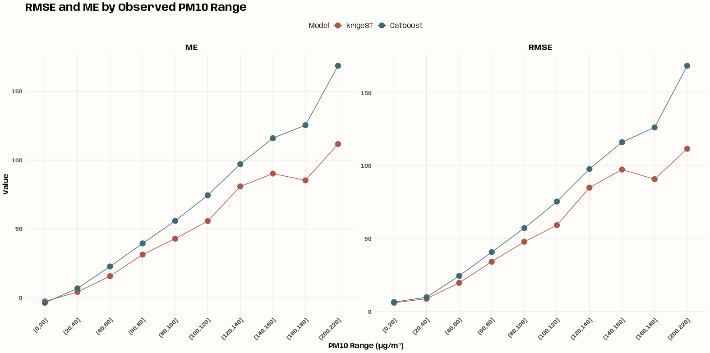{.lightbox group="krig-interp-ex2-other" width="582"}

  <Details>

  <Summary>Code</Summary>

  ``` r
  p_rmse_range <- cv_combined |>
    mutate(
      pm10_bin = cut(observed, breaks = seq(0, max(observed) + 10, by = 20))
    ) |>
    summarize(
      RMSE = sqrt(mean(residual^2, na.rm = TRUE)),
      ME = mean(residual, na.rm = TRUE),
      .by = c(model, pm10_bin)
    ) |>
    tidyr::pivot_longer(
      cols = c(RMSE, ME),
      names_to = "metric",
      values_to = "value"
    ) |>
    ggplot(aes(x = pm10_bin, y = value, color = model, group = model)) +
    geom_line() +
    geom_point(size = 4) +
    scale_color_manual(
      values = c(notebook_colors[[5]], notebook_colors[[6]])
    ) +
    facet_wrap(~metric, scales = "free_y") +
    labs(
      title = "RMSE and ME by Observed PM10 Range",
      x = "PM10 Range (µg/m³)",
      y = "Value",
      color = "Model"
    ) +
    theme_notebook(
      axis.text.x = element_text(angle = 45, hjust = 1),
      legend.position = "top"
    )

  cv_combined |>
    filter(model == "krigeST") |>
    mutate(pm10_bin = cut(observed, breaks = seq(0, max(observed) + 10, by = 20))) |>
    count(pm10_bin, sort = TRUE)
  #> # A tibble: 10 × 2
  #>    pm10_bin      n
  #>    <fct>     <int>
  #>  1 (0,20]    27100
  #>  2 (20,40]    8138
  #>  3 (40,60]     934
  #>  4 (60,80]     159
  #>  5 (80,100]     39
  #>  6 (100,120]    20
  #>  7 (160,180]     5
  #>  8 (120,140]     4
  #>  9 (140,160]     2
  #> 10 (200,220]     1 
  ```

  </Details>

  - Systematic under-prediction for observed PM10 ranges for both models
    - Except for the 0 to 20 bin which shows over-prediction for each model.
  - For krigeST, something interesting happens at the bins spanning 160 to 220.
    - Could indicate sparse observations in that range making the estimates unstable, or a genuine feature of the spatial correlation structure at those concentration levels
    - Unfortunately, it just indicates sparsity — only 3 total observations in those bins (see code).
  - 1826 days and 53 stations and only around 200 instances of PM10 levels over 60. So even though this data spans about 5 yrs, that still isn't enough time to get enough data to predict extreme events with these types of models.
  ::::

- [Example 3]{.ribbon-highlight}: Prediction

  ::: panel-tabset
  ## Data and Set-Up

  Predictions using Catboost and Spatio-Temporal Kriging are calculated and visualized

  This is the PM10 air pollution dataset for Germany that’s from [{spacetime}]{style="color: #990000"} and used in many of my examples.

  This example is a continuation from getting starting values for the marginal components (space and time), getting starting values for the joint components, fitting the variogram, running cross-validation on predictive models, and running diagnostics on those cross-validation results. See:

  - [EDA \>\> Temporal Depenndence](geospatial-spat-temp.qmd#sec-geo-sptemp-eda-ac){style="color: green"} \>\> Example 2
  - [EDA \>\> Spatial Dependence](geospatial-spat-temp.qmd#sec-geo-sptemp-eda-spdep){style="color: green"} \>\> Example 1
  - [Starting Values \>\> Joint Models](geospatial-spat-temp.qmd#sec-geo-sptemp-krig-stval-joint){style="color: green"} \>\> Example 1
  - [Variogram \>\> Examples](geospatial-spat-temp.qmd#sec-geo-sptemp-krig-var-ex){style="color: green"} \>\> Example 1
  - [Examples](geospatial-spat-temp.qmd#sec-geo-sptemp-krig-ex){style="color: green"} \>\> Example 1 and Example 2

  ###### Non-logged PM10 versions

  <Details>

  <Summary>Code</Summary>

  ``` r
  pacman::p_load(
    dplyr,
    ggplot2,
    patchwork,
    sf
  )

  set.seed(2026)
  options(scipen = 999)

  # get rural location time series from 2005 to 2010
  rural_nl <- spacetime::STFDF(
    sp = stations, 
    time = dates, 
    data = data.frame(PM10 = as.vector(air))
  )
  rr_nl <- rural_nl[,"2005::2010"]

  # remove station ts w/all NAs
  unsel_nl <- which(apply(
    as(rr_nl, "xts"), 
    2, 
    function(x) all(is.na(x)))
  )
  r5to10_nl <- rr_nl[-unsel,]


  # Convert to Long Format
  crs_r5_nl <- sp::proj4string(r5to10_nl@sp)
  sf_r5_nl <- as.data.frame(r5to10_nl) |> 
    sf::st_as_sf(coords = c("coords.x1", "coords.x2"), crs = crs_r5_nl) |>
    sf::st_transform(crs = 25832) |> # projected, UTM zone 32N
    filter(!is.na(PM10)) |> 
    rename(
      date = time, 
      pm10 = PM10,
      station_id = sp.ID
    ) |> 
    select(-endTime, -timeIndex)

  tib_pm10_nl <- sf_r5_nl |> 
    mutate(
      date_feat = date, # extra for feat eng
      X = sf::st_coordinates(geometry)[, 1],
      Y = sf::st_coordinates(geometry)[, 2]
    ) |> 
    sf::st_drop_geometry()
  ```

  </Details>

  - Predictions get backtransformed to the original scale, and I'll be using observed PM10 values on the original scale on the prediction maps later.

  ###### Create Prediction Grid

  <Details>

  <Summary>Code</Summary>

  ``` r
  # no days with all stations having observations
  tib_almost_complete_days <- sf_pm10 |>
    st_drop_geometry() |>
    summarize(
      n_stations = n_distinct(station_id),
      .by = date
    ) |>
    filter(n_stations %in% c(44, 45, 46))

  min(tib_almost_complete_days$date)
  #> [1] "2005-01-01"
  max(tib_almost_complete_days$date)
  #> [1] "2006-12-28"

  tib_high_var_pm10 <- tib_pm10 |> 
    filter(date %in% tib_almost_complete_days$date) |> 
    summarize(sd_pm10 = sd(pm10), .by = date) |> 
    arrange(desc(sd_pm10)) |> 
    slice_max(sd_pm10, n = 30)

  # sample two high variance days from each season
  vec_sample_days <- tib_high_var_pm10 |>
    mutate(
      month = lubridate::month(date),
      season = case_when(
        month %in% c(12, 1, 2, 3) ~ "DJFM",
        month %in% c(4, 5, 6, 7) ~ "AMJJ",
        month %in% c(8, 9, 10, 11) ~ "ASON"
      )
    ) |>
    group_by(season) |> 
    slice_sample(n = 2) |>
    pull(date) |>
    sort()

  vec_sample_days
  #> [1] "2005-04-19" "2006-04-17" "2006-09-25" "2006-11-14" "2006-12-13" "2006-12-14"

  sf_germany <- rnaturalearth::ne_countries(
    country = "Germany",
    scale = "medium",
    returnclass = "sf"
  ) |>
    st_transform(crs = 25832)

  grd_stars <- sf_germany |>
    st_bbox() |>
    stars::st_as_stars(dx = 5000) |>
    st_crop(sf_germany)

  dim_grd <- dim(grd_stars)
  arr_grd <- array(
    1,
    dim = c(
      x = dim_grd[1],
      y = dim_grd[2],
      time = length(vec_sample_days)
    )
  )

  star_dims_grd <- stars::st_dimensions(
    x = stars::st_get_dimension_values(grd_stars, "x"),
    y = stars::st_get_dimension_values(grd_stars, "y"),
    time = vec_sample_days
  )

  grd_st <- stars::st_as_stars(
    pts = arr_grd,
    dimensions = star_dims_grd
  ) |> 
    st_set_crs(25832)
  ```

  </Details>

  - [sf_pm10]{.var-text} and [tib_pm10]{.var-text} are from Example 2 \>\> Data and Set-Up
  - I chose the pool of potential sample days based on days with the most stations reporting and had the most PM10 variance at the stations.
    - Was trying to get some decent predictions and colorful maps
  - The grid is 5km cells but the vignette used a 10km x 10km ([dx = 10000]{.arg-text}) grid. I used the 5km x 5km grid because my prediction maps weren't coming out with that smooth interpolated prediction surface that is so nice to look at. I wrongly thought that increasing the resolution would help. It does not. What it does do is increase an already long computation time.
    - tl;dr You can probably use a 10km x 10km grid ([dx = 10000]{.arg-text}) unless your use case requires something finer.
  - Could've used [{sp}]{style="color: #990000"} and created [STFDF]{.arg-text} grid ([newdata]{.arg-text}) objects, but I think [{stars}]{style="color: #990000"} objects are probably easier to post-process and create maps with [{ggplot2}]{style="color: #990000"}, etc.

  ## krigeST

  ``` r
  # outputs stars obj
  # ~ 40 min for 2 days at 10k cells
  # 23879.57 sec or ~6.63 hrs for 6 days at 5k cells w/nmax = 15, bufferNmax = 2
  # 28742.18 sec or ~7.98 hrs for 6 days at 5k cells w/nmax = 120, bufferNmax = default
  # 30205.98 sec or ~8.39 hrs for 6 days at 5k cells w/nmax = 200, bufferNmax = 3
  # 24967.48 sec or ~6.94 hrs for 6 days at 5k cells w/nmax = 10, bufferNmax = 132
  tictoc::tic()
  krige_grid_pred <- gstat::krigeST(
    PM10 ~ 1,
    data = stars::st_as_stars(r5to10) |> st_transform(25832),
    newdata = grd_st,
    modelList = fit_vario_sm,
    nmax = 10,
    bufferNmax = 132,
    computeVar = TRUE,
    progress = TRUE
  )
  tictoc::toc()

  star_preds_krig <- krige_grid_pred |>
    mutate(predicted = exp(var1.pred) * smear_factor$krigeST[[1]]) |> 
    select(predicted) |> 
    st_crop(sf_germany)
  ```

  - [fit_vario_sm]{.var-text} is from [Variogram \>\> Examples](geospatial-spat-temp.qmd#sec-geo-sptemp-krig-var-ex){style="color: green"} \>\> Example 1 \>\> Fit Sum Metric \>\> Fit Sum Metric
  - There's no parallelization so it doesn't take up many computer resources. The downside is that it takes hours upon hours to finish.
  - I included other runtimes which show higher values of [nmax]{.arg-text} take longer. Which means the covariance model function that's used to pick the *best* neighbors is probably the bottleneck.
  - This is stated elsewhere but notice that both [data]{.arg-text} and [newdata]{.arg-text} have the same class ([{stars}]{style="color: #990000"}) object. That's required.
  - [smear_factor]{.var-text} is from Example 2 \>\> Data and Set-Up

  ## Catboost

  ###### Create Grid and Predict

  ``` r
  tib_grid_coords <- grd_st |>
    as.data.frame() |>
    filter(!is.na(pts)) |>
    select(x, y) |>
    distinct()

  # build sf prediction grid matching sf_pm10 structure
  sf_cat_grid <- tidyr::expand_grid(
    tib_grid_coords,
    date = vec_sample_days
  ) |>
    st_as_sf(coords = c("x", "y"), crs = 25832)

  # build mlr3 task for prediction grid
  tib_newdata_cat <- sf_cat_grid |>
    st_drop_geometry() |>
    mutate(
      X = st_coordinates(sf_cat_grid)[, "X"],
      Y = st_coordinates(sf_cat_grid)[, "Y"],
      station_id = NA_character_,
      date_feat = date
    )

  # predict using final trained learner
  cat_grid_pred <- learner_cat_final$predict_newdata(tib_newdata_cat)
  ```

  - [learner_cat_final]{.var-text} is from Example 1 \>\> {mlr} \>\> Run CV
  - The original grid coordinates are converted to a data.frame and repeated for each sample day.
  - A features listed in the [{mlr3}]{style="color: #990000"} [Task]{.arg-text} object are required in the [newdata]{.arg-text} object.
    - There are no [station_ids]{.var-text} for these new grid coordinates. Fortunately, the model accepts [NAs]{.arg-text}
  - The predictions are computed lickety split.

  ###### Process Predictions

  <Details>

  <Summary>Code</Summary>

  ``` r
  # make sure same order and they are
  match(sf_cat_grid$date[1:6], vec_sample_days)
  #> [1] 1 2 3 4 5 6

  # long format according to date which will be our index for filling array
  df_cat_pred <- sf_cat_grid |>
    st_drop_geometry() |> 
    mutate(
      predicted = exp(cat_grid_pred$response) * smear_factor$Catboost[[1]],
      x = as.character(st_coordinates(sf_cat_grid)[, 1]),
      y = as.character(st_coordinates(sf_cat_grid)[, 2]),
      date = as.character(date)
    )

  # specify array
  arr_cat_pred <- array(
    0,
    dim = c(
      x = dim_grd[1],
      y = dim_grd[2],
      time = length(vec_sample_days)
    ),
    dimnames = list(
      # for some reason, getting these values from grd_stars throws
      # an error when filling the array
      x = as.character(stars::st_get_dimension_values(grd_st, "x")),
      y = as.character(stars::st_get_dimension_values(grd_st, "y")),
      time = as.character(vec_sample_days)
    )
  )

  # fill array with predictions
  mat_cat_idx <- as.matrix(df_cat_pred[c("x", "y", "date")])
  arr_cat_pred[mat_cat_idx] <- df_cat_pred$predicted

  # specify dimensions
  star_dims_cat <- stars::st_dimensions(
    x = stars::st_get_dimension_values(grd_st, "x"), 
    y = stars::st_get_dimension_values(grd_st, "y"), 
    time = vec_sample_days
  )

  # create stars object
  star_preds_cat <- stars::st_as_stars(
    list(predicted = arr_cat_pred), 
    dimensions = star_dims_cat
  ) |>
    st_set_crs(25832) |> 
    st_crop(sf_germany)
  ```

  </Details>

  - Predictions are backtransformed and the [{stars}]{style="color: #990000"} object is reconstituted.
  - This follows the recipe from [Data Formats \>\> Long](geospatial-spat-temp.qmd#sec-geo-sptemp-datform-long){style="color: green"} \>\> Example 4

  ###### Process Predictions (alternative)

  <Details>

  <Summary>Code</Summary>

  ``` r
  sf_pred_cat <- sf_cat_grid |>
    mutate(
      predicted = exp(cat_grid_pred$response) * smear_factor$Catboost[[1]],
      model = "Catboost"
    ) |>
    select(date, predicted, model, geometry)  

  ls_star_cat <- purrr::map(vec_sample_days, \(d) {
    sf_pred_cat |>
      filter(date == d) |>
      select(predicted, geometry) |>
      stars::st_rasterize(
        stars::st_as_stars(st_bbox(sf_germany), dx = 5000)
      ) |>
      st_crop(sf_germany)
  })

  star_combined_cat <- do.call(
    c,
    c(ls_star_cat, list(along = c(time = vec_sample_days)))
  )  
  ```

  - This way is more condensed and the `c` method is a legit way to join [{stars}]{style="color: #990000"} objects (it's in the [{stars}]{style="color: #990000"} docs). Otherwise, it's a bit hacky to me, and unless I worked on this type of data all the time, future me would be confused about what exactly is happening. But ya never know, so I'm keeping it here in case I ever need it.

  </Details>

  ## Visualize

  ###### Predictions

  {.lightbox group="krig-ex3" width="632"}

  <Details>

  <Summary>Code</Summary>

  ``` r
  legend_limits <- tibble(
    predicted = as.data.frame(star_preds_krig)$predicted
  ) |> 
    bind_rows(as.data.frame(star_preds_cat)["predicted"]) |> 
    reframe(range_pred = range(predicted, na.rm = TRUE)) |> 
    mutate(range_pred = case_when(
      range_pred == min(range_pred) ~ floor(range_pred),
      range_pred == max(range_pred) ~ ceiling(range_pred) + 5
    )) |> 
    pull(range_pred)

  sf_obs_sample_nl <- sf_r5_nl |>
    filter(date %in% vec_sample_days) |>
    mutate(
      x = st_coordinates(geometry)[, "X"],
      y = st_coordinates(geometry)[, "Y"]
    ) |> 
    select(date, station_id, pm10, x, y, geometry)

  # germany boundary as multilinestring for overlay
  sf_germany_line <- sf_germany |>
    st_cast("MULTILINESTRING")

  p_krige_pred <- ggplot() +
    stars::geom_stars(
      data = star_preds_krig,
      aes(x = x,
          y = y,
          fill = predicted)
    ) +
    geom_sf(
      data = sf_germany_line, 
      color = "grey40", 
      linewidth = 0.3
    ) +  
    geom_sf(
      data = sf_obs_sample_nl,
      color = "white",
      size = 0.8,
      alpha = 0.7
    ) +
    geom_point(
      data = sf_obs_sample_nl |> st_drop_geometry(),
      aes(x = x, y = y, fill = pm10),
      shape = 21,
      size = 3,
      color = "white",
      stroke = 0.1
    ) +
    facet_wrap(~ as.Date(time), nrow = 1) +
    scico::scale_fill_scico(
      palette = "glasgow",
      limits = legend_limits,
      direction = -1,
      name = "PM10\n(µg/m³)",
      na.value = "transparent"
    ) +
    coord_sf(lims_method = "geometry_bbox") +
    labs(title = "KrigeST") +
    theme_charcoal_map()


  p_cat_pred <- ggplot() +
    stars::geom_stars(
      data = star_preds_cat,
      aes(x = x, 
          y = y, 
          fill = predicted)
    ) +
    geom_sf(
      data = sf_germany_line, 
      color = "grey40", 
      linewidth = 0.3
    ) +
    geom_sf(
      data = sf_obs_sample,
      color = "white",
      size = 0.8,
      alpha = 0.7
    ) +
    geom_point(
      data = sf_obs_sample_nl |> st_drop_geometry(),
      aes(x = x, y = y, fill = pm10),
      shape = 21,
      size = 3,
      color = "white",
      stroke = 0.1
    ) +
    facet_wrap(~as.Date(time), nrow = 1) +
    scico::scale_fill_scico(
      palette = "glasgow",
      limits = legend_limits,
      direction = -1,
      name = "PM10\n(µg/m³)",
      na.value = "transparent"
    ) +
    coord_sf(lims_method = "geometry_bbox") +
    labs(title = "Catboost") +
    theme_charcoal_map()


  theme_patch <- theme(
    plot.title = element_text(
      family = "Anybody",
      size = 25, 
      color = "white",
      face = "bold"
    ),
    plot.subtitle = element_text(
      family = "Anybody",
      size = 16, 
      color = "white"
    ),
    plot.background = element_rect(fill = "#191a1a", color = NA)
  )
  p_krige_pred / p_cat_pred + 
    plot_layout(guides = "collect") + 
    plot_annotation(
      title = "PM10 Predictions", 
      subtitle = "Station location color represents observed PM10 level",
      theme = theme_patch
    )
  ```

  </Details>

  - The location coloration (observed PM10 levels) can help indicate whether an area has probaby been over or under-predicted.
  - When you examine the maps closely, the spatial prediction surfaces of both models are quite different. The krigeST surface is zonal and Catboost is the kind of a nonlinear, contour-looking surface.
    - For krigeSt, the zonal pattern is due to the k-NN methodology of local kriging and the number of stations and their dispersal pattern. See [Interpolate](geospatial-spat-temp.qmd#sec-geo-sptemp-krig-inter){style="color: green"} for more details
    - For Catboost, the contour pattern is likely due to the thin plate spline I used for the spatial coordinate features. I didn't check performance differences, but I'd wager this transformation results in a better model. Without the transformation, you get a prediction surface that looks like a paint brush has ran across it horizontally and vertically\
      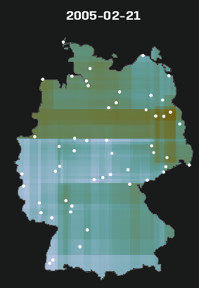{.lightbox width="232"}

  ###### Standardized Prediction Error

  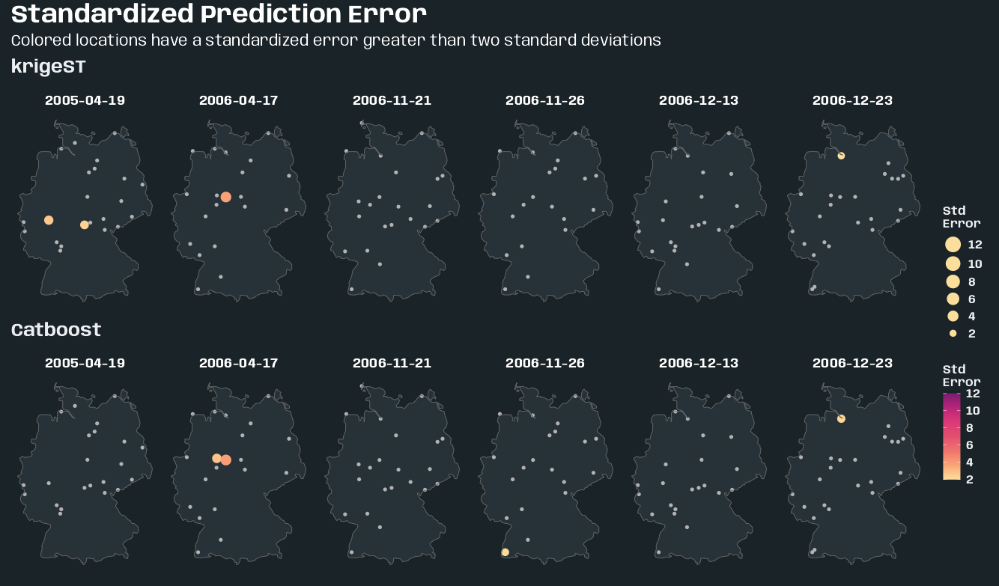{.lightbox group="krig-ex3" width="632"}

  <Details>

  <Summary>Code</Summary>

  ``` r
  tib_station_residual_sd <- cv_combined |>
    summarize(
      residual_sd = sd(residual, na.rm = TRUE),
      .by = c(station_id, model)
    )

  sf_skill <- cv_combined |>
    filter(date %in% vec_sample_days) |>
    left_join(tib_station_residual_sd, by = c("station_id", "model")) |>
    mutate(
      std_error = abs(residual) / residual_sd,
      std_error_cat = ifelse(std_error > 2, "bad", "good")
    ) |>
    left_join(tib_station_coords, by = "station_id") |>
    sf::st_as_sf(coords = c("x", "y"), crs = 25832)

  # compute limits from full cv_combined, not just sampled days
  legend_limits <- cv_combined |>
    left_join(
      tib_station_residual_sd, 
      by = "station_id",
      relationship = "many-to-many"
    ) |>
    mutate(std_error = abs(residual) / residual_sd) |>
    filter(std_error > 2) |>
    reframe(range_error = range(std_error, na.rm = TRUE)) |>
    mutate(
      range_error = case_when(
        range_error == min(range_error) ~ floor(range_error),
        range_error == max(range_error) ~ ceiling(range_error)
      )
    )

  make_std_error_map <- function(mod_name, sf_skill, sf_germany, germany_line) {

    sf_bad <- sf_skill |>
      filter(model == mod_name, std_error_cat == "bad")
    sf_good <- sf_skill |>
      filter(model == mod_name, std_error_cat == "good")

    ggplot() +
      geom_sf(
        data = sf_germany,
        fill = "#263238",
        color = "#37474F",
        linewidth = 0.2
      ) +
      geom_sf(
        data = sf_good,
        color = "grey70",
        size = 1.5,
        shape = 16
      ) +
      geom_sf(
        data = sf_bad,
        aes(color = std_error, size = std_error),
        shape = 16
      ) +
      geom_sf(
        data = germany_line,
        color = "grey40",
        linewidth = 0.3
      ) +
      facet_wrap(~date, nrow = 1) +
      rcartocolor::scale_color_carto_c(
        palette = "SunsetDark",
        name = "Std\nError",
        limits = c(
          legend_limits$range_error[1],
          legend_limits$range_error[2]
        )
      ) +
      scale_size_continuous(
        name = "Std\nError",
        range = c(3, 7),
        limits = c(
          legend_limits$range_error[1],
          legend_limits$range_error[2]
        )
      ) +
      coord_sf(lims_method = "geometry_bbox") +
      guides(
        # fix order (top to bottom) that legends displayed
        color = guide_colorbar(order = 2),
        size = guide_legend(
          order = 1,
          reverse = TRUE,
          override.aes = list(color = "#fcde9c"))
      ) +
      labs(title = mod_name) +
      theme_slate_map(legend.position = "right")
  }

  theme_patch <- theme(
    plot.title = element_text(
      family = "Anybody",
      size = 25, 
      color = "white",
      face = "bold"
    ),
    plot.subtitle = element_text(
      family = "Anybody",
      size = 16, 
      color = "white"
    ),
    plot.background = element_rect(fill = "#1a2327", color = NA)
  )

  purrr::map(
    c("krigeST", "Catboost"),
    \(x) {
      make_std_error_map(
        x,
        sf_skill,
        sf_germany,
        sf_germany_line
      )
    }
  ) |> 
    purrr::reduce(
      `/`
    ) +
    plot_layout(guides = "collect") + 
    plot_annotation(
      title = "Standardized Prediction Error",
      subtitle = "Colored locations have a standardized error greater than two standard deviations",
      theme = theme_patch
    )
  ```

  </Details>

  - [cv_combined]{.var-text} is from Example 2 \>\> Data and Set-Up
  - These are locations that were predicted poorly relative to each model's overall peformance. Comparing bad station predictions to the prediction map can give insight into how off the predictions around that station are.
  - Cross-validation errors for each station on the sampled days are standardized by the standard deviation of the residuals of each station across all test folds.
  - Stations with a standardized residual greater than two are deemed "bad."
  :::
