---
lightbox:
  loop: true
---

# Spatio-Temporal {#sec-geo-sptemp .unnumbered}

## Misc {#sec-geo-sptemp-misc .unnumbered}

- Packages
  - [CRAN Task View](https://cran.r-project.org/web/views/SpatioTemporal.html)
  - [{]{style="color: #990000"}[cubble](https://huizezhang-sherry.github.io/cubble/){style="color: #990000"}[}]{style="color: #990000"} ([Vignette](https://www.jstatsoft.org/article/view/v110i07)) - **Organizing** and **wrangling** space-time data. Addresses data collected at unique fixed locations with irregularity in the temporal dimension
    - Handles **sparse grids** by nesting the time series features in a tibble or tsibble.
  - [{]{style="color: #990000"}[glmSTARMA](https://cran.r-project.org/web/packages/glmSTARMA/index.html){style="color: #990000"}[}]{style="color: #990000"} - (Double) **Generalized Linear Models** for Spatio-Temporal Data
  - [{]{style="color: #990000"}[magclass](https://cran.r-project.org/web/packages/magclass/index.html){style="color: #990000"}[}]{style="color: #990000"} - Data Class and Tools for Handling Spatial-Temporal Data
    - Has **datatable** under the hood, so it should be pretty fast for larger data
    - **Conversions, basic calculations and basic data manipulation**
  - [{]{style="color: #990000"}[mlr3spatiotempcv](https://mlr3spatiotempcv.mlr-org.com/){style="color: #990000"}[}]{style="color: #990000"} - Extends the **mlr3** machine learning framework with spatio-temporal **resampling methods** to account for the presence of spatiotemporal autocorrelation (STAC) in predictor variables
  - [{]{style="color: #990000"}[rasterVis](https://oscarperpinan.github.io/rastervis/){style="color: #990000"}[}]{style="color: #990000"} - Provides three methods to **visualize** spatiotemporal rasters:
    - `hovmoller` produces Hovmöller diagrams
    - `horizonplot` creates horizon graphs, with many time series displayed in parallel
    - `xyplot` displays conventional time series plots extracted from a multilayer raster.
  - [{]{style="color: #990000"}[SemiparMF](https://cran.r-project.org/web/packages/SemiparMF/index.html){style="color: #990000"}[}]{style="color: #990000"} - Fits a **semiparametric** spatiotemporal (**regression?**) model for data with **mixed frequencies**, specifically where the response variable is observed at a lower frequency than some covariates.
    - Combines a non-parametric smoothing spline for high-frequency data, parametric estimation for low-frequency and spatial neighborhood effects, and an autoregressive error structure
  - [{]{style="color: #990000"}[sdmTMB](https://sdmtmb.github.io/sdmTMB/){style="color: #990000"}[}]{style="color: #990000"} - Implements spatial and spatiotemporal **GLMMs** (Generalized Linear Mixed Effect Models)
  - [{]{style="color: #990000"}[sftime](https://r-spatial.github.io/sftime/){style="color: #990000"}[}]{style="color: #990000"} - A complement to [{stars}]{style="color: #990000"}; provides a generic data format which can also handle **irregular (grid)** spatiotemporal data
  - [{]{style="color: #990000"}[spStack](https://span-18.github.io/spStack-dev/){style="color: #990000"}[}]{style="color: #990000"} - Bayesian inference for point-referenced spatial data by assimilating posterior inference over a collection of candidate models using stacking of predictive densities.
    - Currently, it supports point-referenced Gaussian, Poisson, binomial and binary outcomes.
    - Highly parallelizable and hence, much faster than traditional Markov chain Monte Carlo algorithms while delivering competitive predictive performance
    - Fits **Bayesian spatially-temporally varying coefficients (STVC) generalized linear models** without MCMC
  - [{]{style="color: #990000"}[stdbscan](https://cran.r-project.org/web/packages/stdbscan/index.html){style="color: #990000"}[}]{style="color: #990000"} - Spatio-Temporal **DBSCAN Clustering**
  - [{]{style="color: #990000"}[spacetime](https://cran.r-project.org/web/packages/spacetime/index.html){style="color: #990000"}[}]{style="color: #990000"} - Superceded by [{stars}]{style="color: #990000"}. Extends the shared classes defined in [{sp}]{style="color: #990000"} for spatio-temporal data.
    - [{stars}]{style="color: #990000"} uses PROJ and GDAL through [{sf}]{style="color: #990000"}.
  - [{]{style="color: #990000"}[spTimer](https://cran.r-project.org/web/packages/spTimer/index.html){style="color: #990000"}[}]{style="color: #990000"} ([Vignette](https://www.jstatsoft.org/article/view/v063i15)) - Spatio-Temporal **Bayesian Modelling**
    - Models: Bayesian Gaussian Process (GP) Models, Bayesian Auto-Regressive (AR) Models, and Bayesian Gaussian Predictive Processes (GPP) based AR Models for spatio-temporal big-n problems
    - Depends on [{spacetime}]{style="color: #990000"} and [{sp}]{style="color: #990000"}
  - [{]{style="color: #990000"}[stars](https://r-spatial.github.io/stars/){style="color: #990000"}[}]{style="color: #990000"} - **Reading, manipulating, writing and plotting** spatiotemporal arrays (raster and vector data cubes) in 'R', using 'GDAL' bindings provided by 'sf', and 'NetCDF' bindings by 'ncmeta' and 'RNetCDF'
    - Only handles **full lattice/grid** data
    - It supercedes [{spacetime}]{style="color: #990000"}, which extended the shared classes defined in [{sp}]{style="color: #990000"} for spatio-temporal data. [{stars}]{style="color: #990000"} uses PROJ and GDAL through [{sf}]{style="color: #990000"}.
      - Easily convert spacetime objects to stars object with `st_as_stars(spacetime_obj)`
    - Has [dplyr verb methods](https://r-spatial.github.io/stars/reference/dplyr.html)
  - [{]{style="color: #990000"}[WaveST](https://cran.r-project.org/web/packages/WaveST/index.html){style="color: #990000"}[}]{style="color: #990000"} - An integrated **wavelet-based spatial time series modeling** framework designed to enhance predictive accuracy under noisy and nonstationary conditions by jointly exploiting multi-resolution (wavelet) information and spatial dependence
- Resources
  - [SDS, Ch.13](https://r-spatial.org/book/13-Geostatistics.html)
  - [Geodata and Spatial Regression, Ch. 14](https://ruettenauer.github.io/Geodata_Spatial_Regression/09_spatiotemporal.html)
  - [Spatial Modelling for Data Scientists, Ch. 10](https://gdsl-ul.github.io/san/10-st_analysis.html)
  - Spatio-Temporal Statistics in R (See R \>\> Documents \>\> Geospatial)
  - [Spatial and Temporal Statistics](https://darrenjw.github.io/spatio-temporal/)
    - It's kind of a brief overview of spatial and temporal modeling *separately*. The spatio-temporal section at the end is also brief and pretty basic.
    - There are things such as HMMs and GPs that I'm not yet familar with which could be interesting.
- Papers
  - [INLA-RF: A Hybrid Modeling Strategy for Spatio-Temporal Environmental Data](https://arxiv.org/abs/2507.18488)
    - Integrates a statistical spatio-temporal model with RF in an iterative two-stage framework.
    - The first algorithm (INLA-RF1) incorporates RF predictions as an offset in the INLA-SPDE model, while the second (INLA-RF2) uses RF to directly correct selected latent field nodes. Both hybrid strategies enable uncertainty propagation between modeling stages, an aspect often overlooked in existing hybrid approaches.
    - A Kullback-Leibler divergence-based stopping criterion.
  - [Effective Bayesian Modeling of Large Spatiotemporal Count Data Using Autoregressive Gamma Processes](https://arxiv.org/abs/2507.19915)
    - Introduces spatempBayesCounts package but evidently it hasn't been publicly released yet
  - [Amortized Bayesian Inference for Spatio-Temporal Extremes: A Copula Factor Model with Autoregression](https://arxiv.org/abs/2510.02618)
- Notes from
  - [spacetime: Spatio-Temporal Data in R](https://cran.r-project.org/web/packages/spacetime/vignettes/jss816.pdf) - It's been superseded by [{stars}]{style="color: #990000"}, but there didn't seem to be much about working with vector data in [{stars}]{style="color: #990000"} vignettes. So, it seemed like a better place to start for a beginner, and I think the concepts might transfer since the packages were created by the same people. Some packages still use sp and spacetime, so it could be useful in using with those packages
  - [Spatio-Temporal Interpolation using gstat](https://cran.r-project.org/web/packages/gstat/vignettes/spatio-temporal-kriging.pdf)
  - [Introduction to Spatio-Temporal Variography](https://cran.r-project.org/web/packages/gstat/vignettes/st.pdf) ([{gstat}]{style="color: #990000"} vignette)
  - [Spatio-Temporal Kriging in R](https://www.r-bloggers.com/2015/08/spatio-temporal-kriging-in-r/)
    - Also shows how to create a prediction grid of roads
- Recommended Workflow ([source](https://www.youtube.com/watch?v=P18CZinoKos&list=WL&index=2))
  - Go from simple analysis to complex (analysis) to get a feel for your data first. A lot of times, you probably will not need to do a spatio-temporal analysis at all.
  - Steps
    1.  Run univariate/multivariate analysis while ignoring space and time variables
    2.  Aggregate over locations (e.g. average across all time points for each location). Then run spatial analysis (e.g. spatial regression, kriging, etc.).
        - Looking for patterns, hotspots, etc.
        - `group_by(location) |> summarize(median_val = median(val))`
        - e.g. min, mean, median, or max depending on the project
    3.  Aggregate over time (e.g. average across all locations for each time point). Then run time series analysis (e.g. moving average, arima, etc.).
        - Looking trend, seasonality, shocks, etc.
        - `group_by(date) |> summarize(max_val = max(val))`
    4.  Select interesting or important locations (e.g. top sales store, crime hotspot) and run a time series analysis on that location's data
    5.  Select interesting or important time points (e.g. holiday, noon) and run a spatial analysis on that time point
    6.  Run a spatio-temporal analysis

## Terms {#sec-geo-sptemp-terms .unnumbered}

- [**Anisotropy**]{style="color: #009499"}
  - *Spatial Anisotropy* means that spatial correlation depends not only on distance between locations but also direction.\
    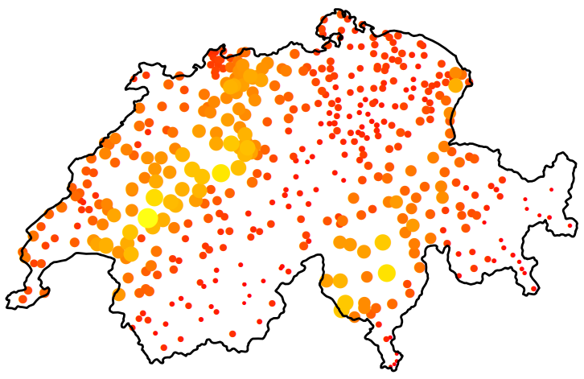{.lightbox width="332"}

    - The size and color of circle represent rainfall values
    - The figure ([source](https://www.mate.polimi.it/biblioteca/add/qmox/45-2018.pdf)) demonstrates spatial anisotropy with alternating stripes of large and small circles from left to right, southwest to northeast.
    - Standard Kriging assumes **isotropy** (uniform in all directions) and uses an omnidirectional variogram that averages spatial correlation across all directions. Violation of isotropy can bias predictions; overestimate uncertainty in "stronger" directions (and vice versa); and the predictions will fail to capture patterns.

  - *Spatio-Temporal Anisotropy* refers to directional dependence in correlation that varies across both space and time dimensions

    - [Example]{.ribbon-highlight}: If you are mapping a pollution plume moving North at 10 km/h, the correlation structure is not just "longer in the North-South direction."\
      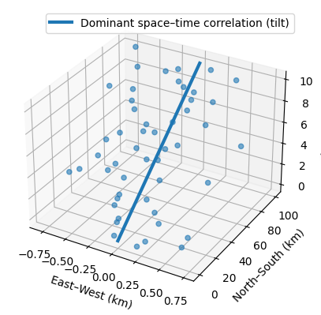{.lightbox width="332"}
      - It is tilted in the space-time cube where time is the vertical in the 3d representation.
        - A vertical correlation (no anisotropy) would start at the bottom of the line and be parallel to the z-axis (time)
      - If you are measuring something that doesn't move—like soil quality at a specific GPS coordinate—the time correlation is vertical
      - With a pollution plume, the time correlation will "tilt" because pollution values will be more similar in different locations as time increases.
- [**Non-Spatial Microscale Effects**]{style="color: #009499"} - Sources of variability that do not necessarily decay with spatial distance over your sampling resolution, but appear as excess semivariance at short lags (i.e. possible explanations for a nugget effect)
  - Measurement Error
    - Instrument noise
    - Calibration differences across monitors
    - Local siting effects (height, enclosure, nearby obstructions
  - Sub-Grid Physical Variability
    - Street-level pollution vs background air
    - Near-road vs off-road effects
    - Local point sources (traffic lights, factories, heating units)
  - Omitted Covariates
    - Elevation
    - Land use
    - Urban/rural classification
    - Meteorology (boundary layer height, wind exposure)
  - Regime Mixing in Time
    - Seasonal transitions
    - Weather regimes
    - Policy or emissions changes
- [**UNIX Time**]{style="color: #009499"} - The number of seconds between a particular time and the UNIX epoch, which is January the 1st 1970 GMT.
  - Should have 10 digits. If it has 13, then milliseconds are also included.

  - Convert to POSIXlt

    ``` r
    data$TIME <- 
      as.POSIXlt(as.numeric(substr(
        paste(data$generation_time), start = 1, stope = 10)), 
        origin = "1970-01-01")
    ```

    - `substr` is subsetting the 1st 10 digits
    - `paste` is converting the numeric to a string. I'd try `as.charater`.

## Grid Layouts {#sec-geo-sptemp-grlay .unnumbered}

### Types {#sec-geo-sptemp-grlay-type .unnumbered}

- [{spacetime}]{style="color: #990000"} Classes\
  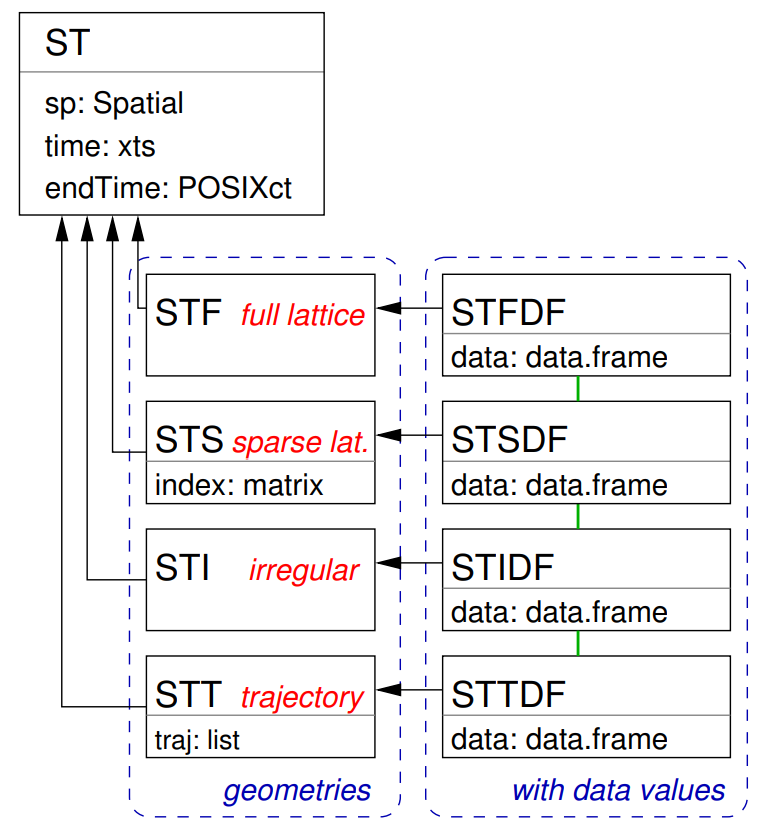{.lightbox width="401"}
- [Full-Grids]{.underline}\
  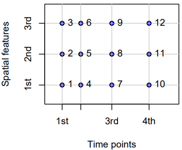{.lightbox width="232"}
  - Each coordinate (spatial feature vs. time) for each time point has a value (which can be NA) — i.e. a fixed set of spatial entities and a fixed set of time points.
  - `STFDF(sp, time, data)`
    - [sp]{.arg-text}: A [SpatialPoints]{.arg-text} or maybe a [SpatialPointsDataFrame]{.arg-text} class object
      - Requires **only unique pairs (lat, lon) of coordinates** that are present in the [data]{.arg-text}, e.g. if there are 53 locations, then there should be 53 pairs (lat, long) of coordinates.
      - This object's coordinates has to be **ordered the same way as the data** (first by time, then by space).
    - [time]{.arg-text}: An *ordered* vector of dates (can be [Date]{.arg-text} or [POSIXct]{.arg-text})
      - Requires **only a unique set of dates**
    - [data]{.arg-text}: A dataframe with the variable(s) of interest.
    - `nrows(data) == nrows(coords) * length(time)` where [coords]{.var-text} is the coordinates matrix in the [SpatialPoints]{.arg-text} object. If this logical isn't true, you'll get an error.
      - It will be true if all the bold instructions above are followed.
  - Examples
    - Regular (e.g., hourly) measurements of air quality at a spatially irregular set of points (measurement stations)
    - Yearly disease counts for a set of administrative regions
    - A sequence of rainfall images (e.g., monthly sums), interpolated to a spatially regular grid. In this example, the spatial feature (images) are grids themselves.
- [Sparse Grids]{.underline}\
  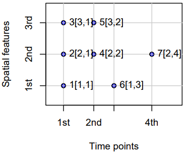{.lightbox width="232"}
  - Only coordinates (spatial feature vs. time) that have a value are included (no NA values)
  - Use Cases
    - Space-time lattices where there are many missing or trivial values
      - e.g. grids where points represent observed fires, and points where no fires are recorded are discarded.
    - Each spatial feature has a different set of time points
      - e.g. where spatial feaatures are regions and a point indicates when and where a crime takes place. Some regions may have frequent crimes while others hardly any.
    - When spatial features vary with time
      - Scenarios
        - Some locations only exist during certain periods.
        - Measurement stations move or appear/disappear.
        - Remote sensing scenes shift or have different extents.
        - Administrative boundaries change (e.g., counties/tracts splitting or merging).
      - [Example]{.ribbon-highlight}: Suppose you have monthly satellite images of vegetation over a region for three months
        - January: the satellite covers tiles A, B, and C
        - February: cloud cover obscures tile B; only A and C are available
        - March: a different orbital path covers B and D (a new area)
      - [Example]{.ribbon-highlight}: Crime locations over time for a city
        - In 2018, you have GPS points for all recorded crimes that year (randomly scattered).
        - In 2019, you have a completely different set of GPS points (different crimes, different places).
        - The number of points per year also varies.
- [Irregular Grids]{.underline}\
  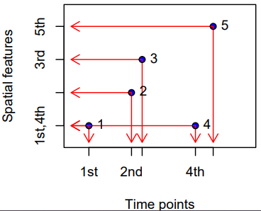{.lightbox width="232"}
  - Time and space points of measured values have no apparent organization: for each measured value the spatial feature and time point is stored, as in the long format.
  - No underlying lattice structure or indexes. Each observation is a standalone (space, time) pair. Repeated values are possible.
  - Essentially just a dataframe with a geometry column, datetime column, and value column.
  - `STIDF(sp, time, data)`
    - Arguments [**sp**]{.arg-text}**, [time]{.arg-text} and [data]{.arg-text} need to have the same number of records**, and regardless of the class of time (xts or POSIXct) have to be in correspoinding order: the triple [sp\[i\]]{.arg-text}, [time\[i\]]{.arg-text} and [data\[i, \]]{.arg-text} refer to the same observation
    - I haven't had any luck with this class in my limited usage (hanging `StVariogram`). You can just create a [STFDF]{.arg-text} class object with your data with [NA]{.arg-text}s for your variable(s) at the filled-in time instances (`StVariogram` worked for me. See [Interpolate](geospatial-spat-temp.qmd#sec-geo-sptemp-krig-inter){style="color: green"} \>\> Example 2).
  - Use Cases
    - Mobile sensors or moving animals: each record has its own location and timestamp — no fixed grid or station network.
    - Lightning strikes: purely random events in continuous space-time.
- [Trajectory Grids]{.underline}\
  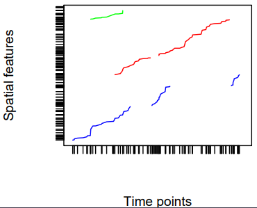{.lightbox width="232"}
  - Trajectories cover the case where sets of (irregular) space-time points form sequences, and depict a trajectory.
  - Their grouping may be *simple* (e.g., the trajectories of two persons on different days), *nested* (for several objects, a set of trajectories representing different trips) or *more complex* (e.g., with objects that split, merge, or disappear).
  - Examples
    - Human trajectories
    - Mobile sensor measurements (where the sequence is kept, e.g., to derive the speed and direction of the sensor)
    - Trajectories of tornados where the tornado extent of each time stamp can be reflected by a different polygon

### Subsetting {#sec-geo-sptemp-grlay-sub .unnumbered}

- Notes from [Subsetting of Spatio-Temporal Objects](https://cran.r-project.org/web/packages/spacetime/vignettes/stsubs.pdf)

- **Don't subset STSDF (or probably STIDF objects too)** as it's not intuitive. You're subsetting the index inside the object and not spatial locations. After index is subsetted, the resulting structure makes no sense to me. Best to do your subsetting before creating these objects.

- Example data

  ``` r
  spObj
  #> SpatialPoints:
  #>   x y
  #> A 0 2
  #> B 2 2
  #> C 1 1
  #> D 0 0
  #> E 2 0
  #> Coordinate Reference System (CRS) arguments: NA 

  timeObj
  #> [1] "2010-08-05 EDT" "2010-08-06 EDT"

  mydata
  #>        smpl1     smpl2
  #> 1   8.798207  8.658649
  #> 2         NA        NA
  #> 3  29.764684 28.761798
  #> 4         NA        NA
  #> 5  49.808253 49.931965
  #> 6         NA        NA
  #> 7         NA        NA
  #> 8  28.308468 29.619051
  #> 9  39.334547 40.642147
  #> 10 49.174389 51.285906

  # the indexing for the STFDF object
  # 1  (A, t1)
  # 2  (A, t2)
  # 3  (B, t1)
  # 4  (B, t2)
  # 5  (C, t1)
  # 6  (C, t2)
  # 7  (D, t1)
  # 8  (D, t2)
  # 9  (E, t1)
  # 10 (E, t2)
  ```

  - Data used to create the various grid type objects
  - When creating one of these objects, `nrow(object@data) == length(object@sp) * nrow(object@time)`
    - In this example, 10 = 5 \* 2
  - When a STSDF (sparse) is constructed, rows with NA are dropped.

- Spatially

  - Only first 3 locations

    ``` r
    STFobj[1:3, ]
    #> An object of class "STF"
    #> Slot "sp":
    #> SpatialPoints:
    #>   x y
    #> A 0 2
    #> B 2 2
    #> C 1 1
    #> Coordinate Reference System (CRS) arguments: NA 
    #> 
    #> Slot "time":
    #>            timeIndex
    #> 2010-08-05         1
    #> 2010-08-06         2
    #> 
    #> Slot "endTime":
    #> [1] "2010-08-06 EDT" "2010-08-07 EDT"
    ```

  - Only first 3 locations in reverse order

    ``` r
    # in reverse order
    STFobj[3:1, ]
    #> An object of class "STF"
    #> Slot "sp":
    #> SpatialPoints:
    #>   x y
    #> C 1 1
    #> B 2 2
    #> A 0 2
    #> Coordinate Reference System (CRS) arguments: NA 
    #> 
    #> Slot "time":
    #>            timeIndex
    #> 2010-08-05         1
    #> 2010-08-06         2
    #> 
    #> Slot "endTime":
    #> [1] "2010-08-06 EDT" "2010-08-07 EDT"
    ```

  - Using a logical vector

    ``` r
    STFobj[c(TRUE,TRUE,FALSE,FALSE,TRUE), ]
    #> An object of class "STF"
    #> Slot "sp":
    #> SpatialPoints:
    #>   x y
    #> A 0 2
    #> B 2 2
    #> E 2 0
    #> Coordinate Reference System (CRS) arguments: NA 
    #> 
    #> Slot "time":
    #>            timeIndex
    #> 2010-08-05         1
    #> 2010-08-06         2
    #> 
    #> Slot "endTime":
    #> [1] "2010-08-06 EDT" "2010-08-07 EDT"
    ```

  - Using a location names

    ``` r
    STFobj[c("A","B"), ]
    #> An object of class "STF"
    #> Slot "sp":
    #> SpatialPoints:
    #>   x y
    #> A 0 2
    #> B 2 2
    #> Coordinate Reference System (CRS) arguments: NA 
    #> 
    #> Slot "time":
    #>            timeIndex
    #> 2010-08-05         1
    #> 2010-08-06         2
    #> 
    #> Slot "endTime":
    #> [1] "2010-08-06 EDT" "2010-08-07 EDT"
    ```

- Temporally

  - Uses [{]{style="color: #990000"}[xts](https://joshuaulrich.github.io/xts/){style="color: #990000"}[}]{style="color: #990000"} for the time series component, so use their syntax to subset different time intervals

  - By years

    ``` r
    STFDFobj[, "2023::2024"]
    ```

    - All data from 2023-01-01 to 2024-12-01
    - Was in the [{spacetime}]{style="color: #990000"} vignette but not in xts docs ¯\\\_(ツ)\_/¯

  - 1 month

    ``` r
    STFDFobj[,'2023-03'] # ❌ doesn't work
    STFDFobj[,'2023-03-01'] # ❌ doesn't work
    STFDFobj[, '2023-03/2023-03'] # works
    ```

  - Everything before August 2023 (includes August)

    ``` r
    STFDFobj[,'/2023-08']
    ```

  - Everything after August 2023 (doesn't include August

    ``` r
    STFDFobj[,'2023-08/']
    ```

  - Subsetting by index is a pain and should be avoided. When you do it, you have to convert the resulting object back to a spacetime object.

## Data Formats {#sec-geo-sptemp-datform .unnumbered}

- [Misc]{.underline}
  - [{spacetime}]{style="color: #990000"} supported Time Classes: Date, POSIXt, timeDate ([{timeDate}]{style="color: #990000"}), yearmon ([{zoo}]{style="color: #990000"}), and yearqtr ([{zoo}]{style="color: #990000"})
  - Data and Spatial Classes:
    - Points: Data having points support should use the SpatialPoints class for the spatial feature
    - Polygons: Values reflect aggregates (e.g., sums, or averages) over the polygon (SpatialPolygonsDataFrame, SpatialPolygons)
    - Grids: Values can be point data or aggregates over the cell.
  - `stConstruct` creates "a [STFDF]{.arg-text} (full lattice/full grid) object if all space and time combinations occur only once, or else an object of class [STIDF]{.arg-text} (irregular grid), which might be coerced into other representations."
  - Latitude and Longitude to using [{sp}]{style="color: #990000"}
    - [Example]{.ribbon-highlight}: ([source](https://www.r-bloggers.com/2015/08/spatio-temporal-kriging-in-r/))

      ``` r
      # Create a SpatialPointsDataFrame
      coordinates(df) <- ~ LON + LAT
      projection(df) <- CRS("+init=epsg:4326")

      # Transform into Mercator Projection
      # SpatialPointsDataFrame with coordinates in meters.
      ozone.UTM <- spTransform(df, CRS("+init=epsg:3395"))
      # SpatialPoints
      ozoneSP <- SpatialPoints(ozone.UTM@coords, CRS("+init=epsg:3395")) 
      ```
- [Long]{.underline} - The full spatio-temporal information (i.e. response value) is held in a single column, and location and time are also single columns.
  - [Example]{.ribbon-highlight}: Private capital stock (?)

    ``` r
    #>     state year region     pcap     hwy   water    util       pc   gsp
    #> 1 ALABAMA 1970      6 15032.67 7325.80 1655.68 6051.20 35793.80 28418
    #> 2 ALABAMA 1971      6 15501.94 7525.94 1721.02 6254.98 37299.91 29375
    #> 3 ALABAMA 1972      6 15972.41 7765.42 1764.75 6442.23 38670.30 31303
    #> 4 ALABAMA 1973      6 16406.26 7907.66 1742.41 6756.19 40084.01 33430
    #> 5 ALABAMA 1974      6 16762.67 8025.52 1734.85 7002.29 42057.31 33749
    ```

    - Each row is a single time unit and space unit combination.
    - This is likely not the row order you want though. I think these spatio-temporal object creation functions want ordered by time, then by space. (See Example)

  - [Example]{.ribbon-highlight}: Create full grid spacetime object from a long table (7.2 Panel Data in [{spacetime}]{style="color: #990000"} vignette)

    ::: panel-tabset
    ## Input Data

    ``` r
    head(df_data); tail(df_data)
    #>          state year region      pcap      hwy    water     util        pc    gsp    emp unemp
    #> 1      ALABAMA 1970      6  15032.67  7325.80  1655.68  6051.20  35793.80  28418 1010.5   4.7
    #> 18     ARIZONA 1970      8  10148.42  4556.81  1627.87  3963.75  23585.99  19288  547.4   4.4
    #> 35    ARKANSAS 1970      7   7613.26  3647.73   644.99  3320.54  19749.63  15392  536.2   5.0
    #> 52  CALIFORNIA 1970      9 128545.36 42961.31 17837.26 67746.79 172791.92 263933 6946.2   7.2
    #> 69    COLORADO 1970      8  11402.52  4403.21  2165.03  4834.28  23709.75  25689  750.2   4.4
    #> 86 CONNECTICUT 1970      1  15865.66  7237.14  2208.10  6420.42  24082.38  38880 1197.5   5.6
    #>             state year region     pcap      hwy   water     util       pc   gsp    emp unemp
    #> 731       VERMONT 1986      1  2936.44  1830.16  335.51   770.78  6939.39  7585  234.4   4.7
    #> 748      VIRGINIA 1986      5 28000.68 14253.92 4786.93  8959.83 71355.78 88171 2557.7   5.0
    #> 765    WASHINGTON 1986      9 41136.36 11738.08 5042.96 24355.32 66033.81 67158 1769.9   8.2
    #> 782 WEST_VIRGINIA 1986      5 10984.38  7544.99  834.01  2605.38 35781.74 21705  597.5  12.0
    #> 799     WISCONSIN 1986      3 26400.60 10848.68 5292.62 10259.30 60241.65 70171 2023.9   7.0
    #> 816       WYOMING 1986      8  5700.41  3400.96  565.58  1733.88 27110.51 10870  196.3   9.0

    yrs <- 1970:1986
    vec_time <- 
      as.POSIXct(paste(yrs, "-01-01", sep=""), tz = "GMT")
    head(vec_time)
    #> [1] "1970-01-01 GMT" "1971-01-01 GMT" "1972-01-01 GMT" "1973-01-01 GMT" "1974-01-01 GMT" "1975-01-01 GMT"

    head(spatial_geom_ids)
    #> [1] "alabama"     "arizona"     "arkansas"    "california"  "colorado"    "connecticut"
    class(geom_states)
    #> [1] "SpatialPolygons"
    #> attr(,"package")
    #> [1] "sp"
    ```

    - The names of the objects above don't the match the ones in the example, but I wanted names that were more informative about what types of objects were needed. The package documentation and vignette are spotty with their descriptions and explanations.
    - **The row order of the spatial geometry object should match the row order of the spatial feature column (in each time section) of the dataframe.**
    - The [data_df]{.var-text} only has the state name (all caps) and the year as space and time features.
    - [spatial_geom_ids]{.var-text} shows the order of the spatial geometry object (state polygons) which are state names in alphabetical order.
      - At least in this example, the geometry object ([geom_states]{.var-text}) didn't store the actual state names. It just used a id index (e.g. [ID1]{.var-text}, [ID2]{.var-text}, etc.)

    ## STFDF Object

    ``` r
    st_data <- 
      STFDF(sp = geom_states, 
            time = vec_time, 
            data = df_data)

    length(st_data)
    #> [1] 816
    nrow(df_data)
    #> [1] 816
    class(st_data)
    #> [1] "STFDF"
    #> attr(,"package")
    #> [1] "spacetime"

    df_st_data <- as.data.frame(st_data)
    head(df_st_data[1:6]); tail(df_st_data[1:6])
    #>           V1       V2 sp.ID       time    endTime timeIndex
    #> 1  -86.83042 32.80316   ID1 1970-01-01 1971-01-01         1
    #> 2 -111.66786 34.30060   ID2 1970-01-01 1971-01-01         1
    #> 3  -92.44013 34.90418   ID3 1970-01-01 1971-01-01         1
    #> 4 -119.60154 37.26901   ID4 1970-01-01 1971-01-01         1
    #> 5 -105.55251 38.99797   ID5 1970-01-01 1971-01-01         1
    #> 6  -72.72598 41.62566   ID6 1970-01-01 1971-01-01         1
    #>             V1       V2 sp.ID       time    endTime timeIndex
    #> 811  -72.66686 44.07759  ID44 1986-01-01 1987-01-01        17
    #> 812  -78.89655 37.51580  ID45 1986-01-01 1987-01-01        17
    #> 813 -120.39569 47.37073  ID46 1986-01-01 1987-01-01        17
    #> 814  -80.62365 38.64619  ID47 1986-01-01 1987-01-01        17
    #> 815  -90.01171 44.63285  ID48 1986-01-01 1987-01-01        17
    #> 816 -107.55736 43.00390  ID49 1986-01-01 1987-01-01        17
    ```

    - So combining of these objects into a spacetime object doesn't seemed be based any names (e.g. a joining variable) of the elements of these separate objects.
    - STFDF arguments:
      - [sp]{.arg-text}: An object of class [Spatial]{.arg-text}, having n elements
      - [time]{.arg-text}: An object holding time information, of length m;
      - [data]{.arg-text}: A data frame with n\*m rows corresponding to the observations
    - Converting back to a dataframe adds 6 new columns to [df_data]{.var-text}:
      - [V1]{.var-text}, [V2]{.var-text}: Latitude, Longitude
      - [sp.ID]{.var-text}: IDs within the spatial geomtry object (geom_states)
      - [time]{.var-text}: Time object values
      - [endTime]{.var-text}: Used for intervals
      - [timeIndex]{.var-text}: An index of time "sections" in the data dataframe. (e.g. 1:17 for 17 unique year values)
    :::
- [Space-wide]{.underline} - Each space unit is a column
  - [Example]{.ribbon-highlight}: Wind speeds

    ``` r
    #>   year month day   RPT   VAL   ROS   KIL   SHA  BIR   DUB   CLA   MUL
    #> 1   61     1   1 15.04 14.96 13.17  9.29 13.96 9.87 13.67 10.25 10.83
    #> 2   61     1   2 14.71 16.88 10.83  6.50 12.62 7.67 11.50 10.04  9.79
    #> 3   61     1   3 18.50 16.88 12.33 10.13 11.17 6.17 11.25  8.04  8.50
    #> 4   61     1   4 10.58  6.63 11.75  4.58  4.54 2.88  8.63  1.79  5.83
    #> 5   61     1   5 13.33 13.25 11.42  6.17 10.71 8.21 11.92  6.54 10.92
    #> 6   61     1   6 13.21  8.12  9.96  6.67  5.37 4.50 10.67  4.42  7.17
    ```

    - Each row is a unique time unit

  - [Example]{.ribbon-highlight}: Create full grid spacetime object from a space-wide table (7.3 Interpolating Irish Wind in [{spacetime}]{style="color: #990000"} vignette)

    ::: panel-tabset
    ## Input Data

    ``` r
    class(mat_wind_velos)
    #> [1] "matrix" "array" 
    dim(mat_wind_velos)
    #> [1] 6574   12
    mat_wind_velos[1:6, 1:6]
    #>             RPT        VAL         ROS         KIL         SHA        BIR
    #> [1,] 0.47349183  0.4660816  0.29476767 -0.12216857  0.37172544 -0.0549353
    #> [2,] 0.43828072  0.6342761  0.04762928 -0.48431251  0.23530275 -0.3264873
    #> [3,] 0.76797566  0.6297610  0.20133157 -0.03446898  0.07989186 -0.5358676
    #> [4,] 0.01118683 -0.4751407  0.13684623 -0.78709720 -0.79381717 -1.1049744
    #> [5,] 0.29298091  0.2851083  0.09805298 -0.54439303  0.02147079 -0.2707680
    #> [6,] 0.27715281 -0.2860777 -0.06624749 -0.47759668 -0.66795421 -0.8085874

    class(wind$time)
    #> [1] "POSIXct" "POSIXt" 
    wind$time[1:5]
    #> [1] "1961-01-01 12:00:00 GMT" "1961-01-02 12:00:00 GMT" "1961-01-03 12:00:00 GMT" "1961-01-04 12:00:00 GMT" "1961-01-05 12:00:00 GMT"

    class(geom_stations)
    #> [1] "SpatialPoints"
    #> attr(,"package")
    #> [1] "sp"
    ```

    - See Long \>\> Example \>\> Create full grid spacetime object for a more detailed breakdown of creating these objects
    - **The order of station geometries in [geom_stations]{.var-text} should match the order of the columns in [mat_wind_velos]{.var-text}**
      - In the vignette, the data used to create the geometry object is ordered according to the matrix using `match`. See [R, Base R \>\> Functions](r-base-r.qmd#sec-r-baser-funs){style="color: green"} \>\> `match` for the code.

    ## STFDF Object

    ``` r
    st_wind = 
      stConstruct(
        # space-wide matrix
        x = mat_wind_velos, 
        # index for spatial feature/spatial geometries
        space = list(values = 1:ncol(mat_wind_velos)),
        # datetime column from original data
        time = wind$time, 
        # spatial geometry
        SpatialObj = geom_stations, 
        interval = TRUE
      )
    class(st_wind)
    #> [1] "STFDF"
    #> attr(,"package")
    #> [1] "spacetime"

    df_st_wind <- as.data.frame(st_wind)
    dim(df_st_wind)
    #> [1] 78888     7
    head(df_st_wind); tail(df_st_wind)
    #>   coords.x1 coords.x2 sp.ID                time             endTime timeIndex     values
    #> 1  551716.7   5739060     1 1961-01-01 12:00:00 1961-01-02 12:00:00         1  0.4734918
    #> 2  414061.0   5754361     2 1961-01-01 12:00:00 1961-01-02 12:00:00         1  0.4660816
    #> 3  680286.0   5795743     3 1961-01-01 12:00:00 1961-01-02 12:00:00         1  0.2947677
    #> 4  617213.8   5836601     4 1961-01-01 12:00:00 1961-01-02 12:00:00         1 -0.1221686
    #> 5  505631.2   5838902     5 1961-01-01 12:00:00 1961-01-02 12:00:00         1  0.3717254
    #> 6  574794.2   5882123     6 1961-01-01 12:00:00 1961-01-02 12:00:00         1 -0.0549353
    #>       coords.x1 coords.x2 sp.ID                time             endTime timeIndex    values
    #> 78883  682680.1   5923999     7 1978-12-31 12:00:00 1979-01-01 12:00:00      6574 0.8600970
    #> 78884  501099.9   5951999     8 1978-12-31 12:00:00 1979-01-01 12:00:00      6574 0.1589576
    #> 78885  608253.8   5932843     9 1978-12-31 12:00:00 1979-01-01 12:00:00      6574 0.1536922
    #> 78886  615289.0   6005361    10 1978-12-31 12:00:00 1979-01-01 12:00:00      6574 0.1325158
    #> 78887  434818.6   6009945    11 1978-12-31 12:00:00 1979-01-01 12:00:00      6574 0.2058466
    #> 78888  605634.5   6136859    12 1978-12-31 12:00:00 1979-01-01 12:00:00      6574 1.0835638
    ```

    - [space]{.arg-text} has a confusing description. Here it's just a numerical index for the number of columns of [mat_wind_velos]{.var-text} which would match an index/order for the geometries in [geom_stations]{.var-text}.
    - [interval = TRUE]{.arg-text}, since the values are daily mean wind speed (aggregation)
      - See Time and Movement section
    - [df_st_wind]{.var-text} is in long format
    :::
- [Time-wide]{.underline} - Each time unit is a column
  - [Example]{.ribbon-highlight}: Counts of SIDS

    ``` r
    #>          NAME BIR74 SID74 NWBIR74 BIR79 SID79 NWBIR79
    #> 1        Ashe  1091     1      10  1364     0      19
    #> 2   Alleghany   487     0      10   542     3      12
    #> 3       Surry  3188     5     208  3616     6     260
    #> 4   Currituck   508     1     123   830     2     145
    #> 5 Northampton  1421     9    1066  1606     3    1197
    ```

    - [SID74]{.var-text} contains to the infant death syndrome cases for each county at a particular time period (1974-1984). [SID79]{.var-text} are SIDS deaths from 1979-84.
      - [NWB]{.var-text} is non-white births, [BIR]{.var-text} is births.
    - Each row is a spatial unit and unique
- [Time and Movement]{.underline}\
  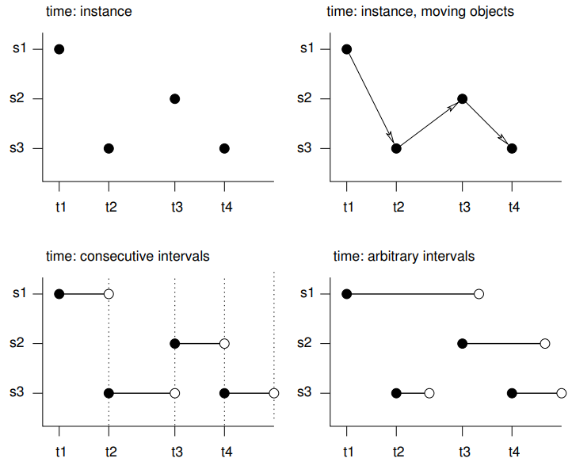{.lightbox width="432"}
  - s1 refers to the first feature/location, t1 to the first time instance or interval, thick lines indicate time intervals, arrows indicate movement. Filled circles denote start time, empty circles end times, intervals are right-closed
  - Spatio-temporal objects essentially needs specification of the spatial, the temporal, and the data values
  - *Intervals* - The spatial feature (e.g. location) or its associated data values does not change during this interval, but reflects the value or state during this interval (e.g. an average)
    - e.g. yearly mean temperature at a set of locations
  - *Instants* - Reflects moments of change (e.g., the start of the meteorological summer), or events with a zero or negligible duration (e.g., an earthquake, a lightning).
  - *Movement* - Reflects objects may change location during a time interval. For time instants. locations are at a particular moment, and movement occurs between registered (time, feature) pairs and must be continuous.
  - *Trajectories* - Where sets of (irregular) space-time points form sequences, and depict a trajectory.
    - Their grouping may be simple (e.g., the trajectories of two persons on different days), nested (for several objects, a set of trajectories representing different trips) or more complex (e.g., with objects that split, merge, or disappear).
    - Examples
      - Human trajectories
      - Mobile sensor measurements (where the sequence is kept, e.g., to derive the speed and direction of the sensor)
      - Trajectories of tornados where the tornado extent of each time stamp can be reflected by a different polygon

## EDA {#sec-geo-sptemp-eda .unnumbered}

### Misc {#sec-geo-sptemp-eda-misc .unnumbered}

- Also see [EDA, Time Series](eda-time-series.qmd#sec-eda-ts){style="color: green"}
- Check for duplicate locations:
  - Kriging cannot handle duplicate locations and returns an error, generally in the form of a “singular matrix”.

  - [Examples]{.ribbon-highlight}:

    ``` r
    dupl <- sp::zerodist(spatialpoints_obj)

    # sf
    dup <- duplicated(st_coordinates(sf_obj))
    log_mat <- st_equals(sf_obj)

    # terra (or w/spatraster, spatvector)
    d <- distance(lon_lat_mat)
    log_mat <- which(d == 0, arr.ind = TRUE)

    # base r
    dup_indices <- duplicated(df[, c("lat", "long")])

    # within a tolerance
    # Find points within 0.01 distance
    dup_pairs <- st_is_within_distance(sf_obj, dist = 0.01, sparse = FALSE)
    ```

### General {#sec-geo-sptemp-eda-gen .unnumbered}

- [Example]{.ribbon-highlight}: Days per Location\
  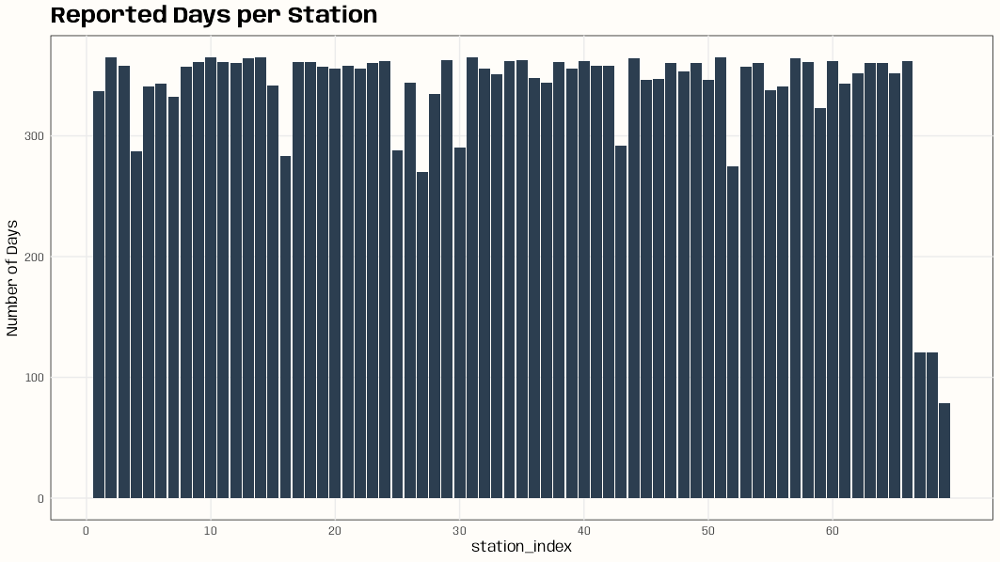{.lightbox width="532"}

  <Details>

  <Summary>Code</Summary>

  ``` r
  library(dplyr); library(ggplot2)

  data(DE_RB_2005, package = "gstat")
  class(DE_RB_2005)
  #> [1] "STSDF"

  tibble(station_index = DE_RB_2005@index[,1]) |> 
    count(station_index) |> 
    ggplot(aes(x = station_index, y = n)) +
    geom_col(fill = "#2c3e50") + 
    scale_x_continuous(breaks = seq.int(0, length(unique(DE_RB_2005@index[,1])), 10)) +
    ylab("Number of Days") +
    ggtitle("Reported Days per Station") +
    theme_notebook()

  # station names for some indexes w/low number of days
  row.names(DE_RB_2005@sp)[c(4, 16, 52, 67, 68, 69)]
  #> [1] "DEUB038"   "DEUB039"   "DEUB026"   "DEHE052.1" "DEHE042.1" "DEHE060"
  ```

  </Details>

  - If there's there are locations with few observations on too many days, this can result in volatile variograms.

- [Example]{.ribbon-highlight}: Counts of pairwise distances between locations\
  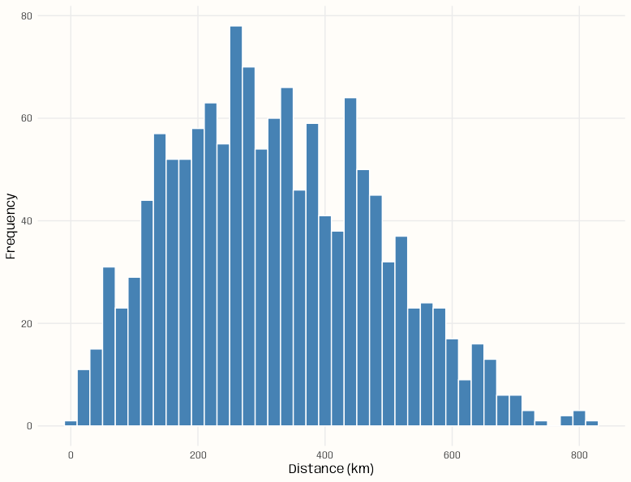{.lightbox width="432"}

  <Details>

  <Summary>Code</Summary>

  ``` r
  pacman::p_load(
    spacetime,
    sf,
    ggplot2
  )

  data(air)

  # get rural location time series from 2005 to 2010
  rural <- STFDF(
    sp = stations, 
    time = dates, 
    data = data.frame(PM10 = as.vector(air))
  )
  rr <- rural[,"2005::2010"]
  # remove station ts w/all NAs
  unsel <- which(apply(
    as(rr, "xts"), 
    2, 
    function(x) all(is.na(x)))
  )
  r5to10 <- rr[-unsel,]


  sf_locs <- st_as_sf(r5to10@sp)
  # Calculate pairwise distances
  mat_dist_sf <- st_distance(sf_locs)
  # Convert to kilometers
  mat_dist_sf_km <- units::set_units(mat_dist_sf, km) |>
    units::drop_units()

  dim(mat_dist_sf_km)
  #> [1] 53 53

  tibble::tibble(
    distance = mat_dist_sf_km[upper.tri(mat_dist_sf_km)]
  ) |> 
    ggplot(aes(x = distance)) +
    geom_histogram(
      binwidth = 20, 
      fill = "steelblue", 
      color = "#FFFDF9FF") +
    labs(x = "Distance (km)", y = "Frequency") +
    theme_notebook()

  summary(mat_dist_sf_km[upper.tri(mat_dist_sf_km)])
  #>   Min. 1st Qu.  Median    Mean 3rd Qu.    Max. 
  #>  7.027 197.849 308.533 321.976 439.895 813.742 
  ```

  </Details>

  - The bin width is set to 20 km (which is the setting for the variogram model in the [{gstat}]{style="color: #990000"} vignette)
  - For kriging, ideally we'd want at least around 100 pairwise distances in each of the first few bins (short pairwise distances) for a stable range estimate, but no pairwise distance bin has that many. (See [Geospatial, Kriging \>\> Bin Width](geospatial-kriging.html#sec-geo-krig-bw){style="color: green"})
    - This is due to there only being 53 locations and the selection of only rural locations

- [Example]{.ribbon-highlight}: [{gglinedensity}]{style="color: #990000"}\
  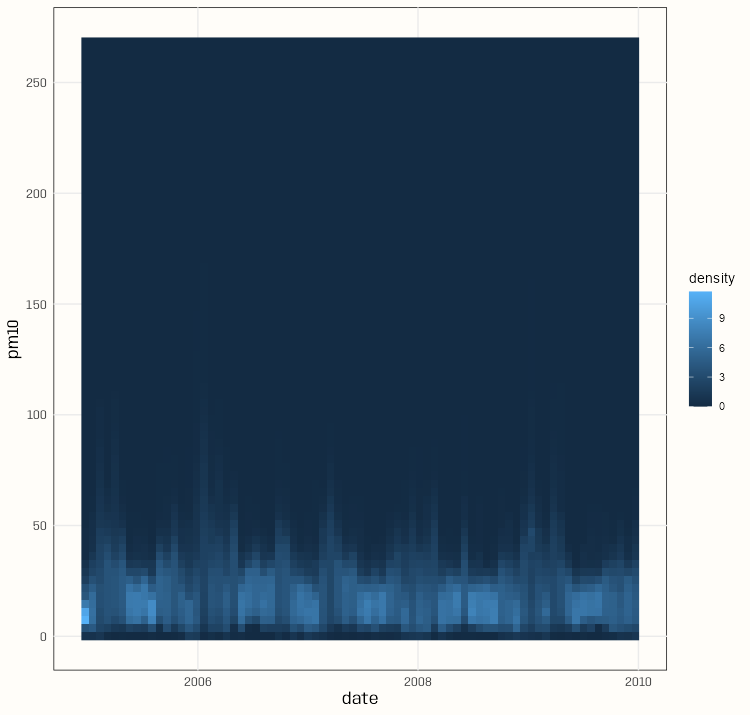{.lightbox width="432"}

  <Details>

  <Summary>Code</Summary>

  ``` r
  pacman::p_load(
    spacetime,
    dplyr,
    gglinedensity,
    ggplot2
  )

  data(air)

  rural <- STFDF(
    sp = stations, 
    time = dates, 
    data = data.frame(PM10 = as.vector(air))
  )
  rr <- rural[,"2005::2010"]

  # remove station ts w/all NAs
  unsel <- which(apply(
    as(rr, "xts"), 
    2, 
    function(x) all(is.na(x)))
  )
  r5to10 <- rr[-unsel,]

  pm10_tbl <- as_tibble(as.data.frame(r5to10)) |> 
    rename(station = sp.ID, date = time, pm10 = PM10) |> 
    mutate(date = as.Date(date)) |> 
    select(date, station, pm10)

  summary(pm10_tbl)
  #>       date               station           pm10        
  #>  Min.   :2005-01-01   DESH001: 1826   Min.   :  0.560  
  #>  1st Qu.:2006-04-02   DENI063: 1826   1st Qu.:  9.275  
  #>  Median :2007-07-02   DEUB038: 1826   Median : 13.852  
  #>  Mean   :2007-07-02   DEBE056: 1826   Mean   : 16.261  
  #>  3rd Qu.:2008-10-01   DEBE032: 1826   3rd Qu.: 20.333  
  #>  Max.   :2009-12-31   DEHE046: 1826   Max.   :269.079  
  #>                       (Other):85822   NA's   :21979 

  ggplot(
    pm10_tbl, 
    aes(x = date, 
        y = pm10,
        group = station)) +
    stat_line_density(
      bins = 75, 
      drop = FALSE, 
      na.rm = TRUE) + 
    scale_y_continuous(breaks = seq.int(0, 250, 50)) +
    theme_notebook()
  ```

  </Details>

  - With a bunch of time series, it's difficult to distinguish a primary trend to the data (e.g. in a spaghetti line chart). This density gives a sense of the seasonality and the trend of most of the locations.
  - The summary says the median is around 14 and the max is around 270.

- [Example]{.ribbon-highlight}: [{daiquiri}]{style="color: #990000"}\

  ::: {layout-ncol="2"}
  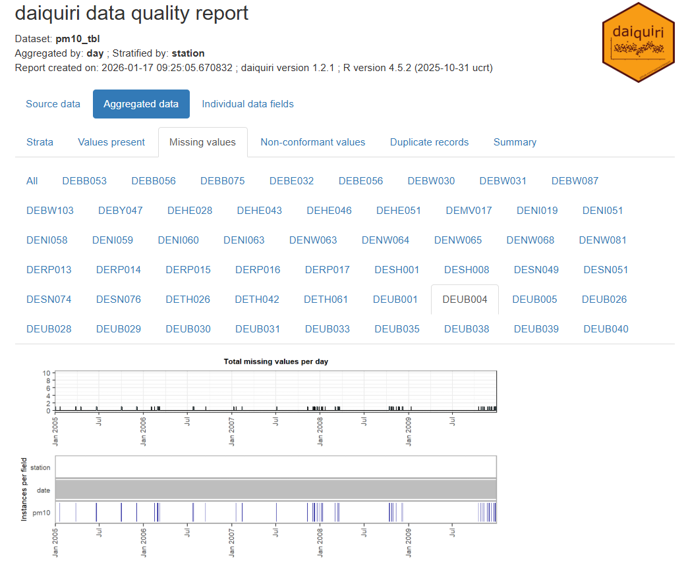{.lightbox group="eda-daiq" width="332"}

  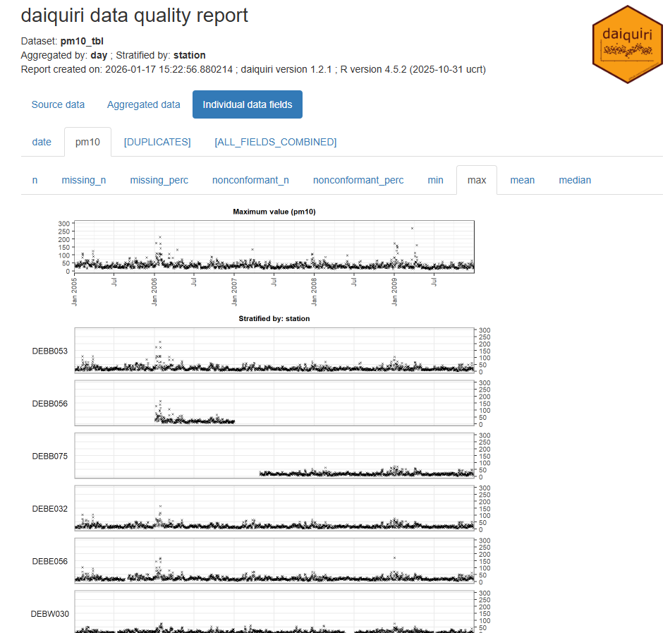{.lightbox group="eda-daiq" width="332"}
  :::

  <Details>

  <Summary>Code</Summary>

  ``` r
  library(spacetime); library(dplyr); library(daiquiri)

  data(air)

  rural <- STFDF(
    sp = stations, 
    time = dates, 
    data = data.frame(PM10 = as.vector(air))
  )
  rr <- rural[,"2005::2010"]

  # remove station ts w/all NAs
  unsel <- which(apply(
    as(rr, "xts"), 
    2, 
    function(x) all(is.na(x)))
  )
  r5to10 <- rr[-unsel,]

  pm10_tbl <- as_tibble(as.data.frame(r5to10)) |> 
    rename(station = sp.ID, date = time, pm10 = PM10) |> 
    mutate(date = as.Date(date)) |> 
    select(date, station, pm10)

  fts <- 
    field_types(
      station = ft_strata(),
      date = ft_timepoint(includes_time = FALSE),
      pm10 = ft_numeric()
    )

  daiq_pm10 <- 
    daiquiri_report(
      pm10_tbl,
      fts
    )
  ```

  </Details>

  - Shows missingness and basic descriptive statistics over time for each [station]{.var-text}
    - Note that if your data is daily and there's only 1 measurement per day, then all these statistics will the same (duh, but one time I forgot and thought the package was broken)

### Temporal Dependence {#sec-geo-sptemp-eda-ac .unnumbered}

- Check characteristics of autocorrelation. Can the analysis be done in a purely spatial manner (a purely spatial model for each time step) or is adding a temporal aspect necessary?

- [Autocorrelation Function (ACF)]{.underline}

  - For each location, is there correlation between time $t$ and lag $t + h$
  - Does autocorrelation rapidly or gradually decrease?
    - If gradually, then the series isn't stationary and probably needs differencing (See [EDA, Time Series \>\> Stationarity](eda-time-series.qmd#sec-eda-ts-station){style="color: green"})
  - Is there a scalloped shape to autocorrelation?
    - If so, it might need seasonal differencing.
  - At which time lag (max, avg) does autocorrelation become insignificant?

- [Partial Autocorrelation Function (PACF)]{.underline}

  - Are there significant spikes in the PACF?
    - Could indicate the frequency of the seasonality?

- [Cross-Correlations]{.underline}

  - For each pair of locations, is there autocorrelation between location $a$ at time $t$ and location $b$ at time $t + h$
  - Cross-correlations can be asymmetric and they do *not* have to 1 at lag 0 like autocorrelations
    - If you're looking at rainfall at two locations, strong correlation when upstream location A leads downstream location B by 2 hours, but weak correlation when B "leads" A, tells you about the direction of storm movement and typical travel time.
    - The strength of the asymmetry itself (how different the two plots look) can indicate how strong or consistent these directional relationships are in your data.
  - Potential Meaning Behind Strong Asymmetry:
    - *Directional or causal relationships*: If the cross-correlation is stronger when A leads B (positive lags in A vs B plot) than when B leads A, this suggests A might influence B more than the reverse. This doesn't prove causation, but it's often consistent with one variable driving changes in the other.S
    - *Different response times*: The asymmetry can reveal that one location responds to shared drivers faster than the other, or that the propagation time of some influence differs depending on direction.
    - *Lead-lag relationships*: Strong asymmetry with a clear peak at a non-zero lag indicates one series systematically precedes the other, which can be important for forecasting or understanding the physical mechanisms at play.
  - Is there a approximate distance between many pairs of locations at which autocorrelation is insignificant?

- [Pooled Temporal Variogram]{.underline}

  - A pooled temporal variogram is computed by holding space fixed and pooling squared temporal differences across spatial locations.

  - It can be used with spatio-temporal data to estimate the strength of temporal dependence of various time differences.

    - We can also use to get reasonable starting values for the time portions of spatio-temporal variogram models (e.g. separable, metric, product-sum, etc.)

  - Let $Y_{s,t}$ denote the observation at location $s = 1,\dots,S$ and time $t = 1,\dots,T$.

  - The pooled estimator is:\

    $$\hat{\gamma}(h_t) = \frac{1}{2 N_k(h_t)} \sum_{k=1}^{K} \sum_{s=1}^{S}
    \left( Y_{s,t} - Y_{s,t+u} \right)^2        $$

    - $h_t$ is a temporal bin
    - $N_k(h_t)$ is the number of valid (not NA) time difference pairs in that temporal bin
    - $K$ is the number of time difference pairs
    - $S$ is number of spatial locations
    - $u$ is temporal separation

- [Example 1]{.ribbon-highlight}: PM10 Pollution ([{gstat}]{style="color: #990000"} [vignette](https://cran.r-project.org/web/packages/gstat/vignettes/st.pdf), section 2)

  :::: panel-tabset
  ## Data

  ###### Set-Up

  ``` r
  pacman::p_load(
    spacetime,
    stars,
    sf,
    dplyr,
    ggplot2
  )

  data(air)

  # get rural location time series from 2005 to 2010
  rural <- STFDF(
    sp = stations, 
    time = dates, 
    data = data.frame(PM10 = as.vector(air))
  )
  rr <- rural[,"2005::2010"]

  # remove station ts w/all NAs
  unsel <- which(apply(
    as(rr, "xts"), 
    2, 
    function(x) all(is.na(x)))
  )
  r5to10 <- rr[-unsel,]
  ```

  - [r5to10]{.var-text} is a STFDF (full grid) object
  - `r5to10@sp` is a [SpatialPoints]{.arg-text} ([{sp}]{style="color: #990000"}) class object with location names and coordinates

  ###### Map

  ::: {layout-ncol="2"}
  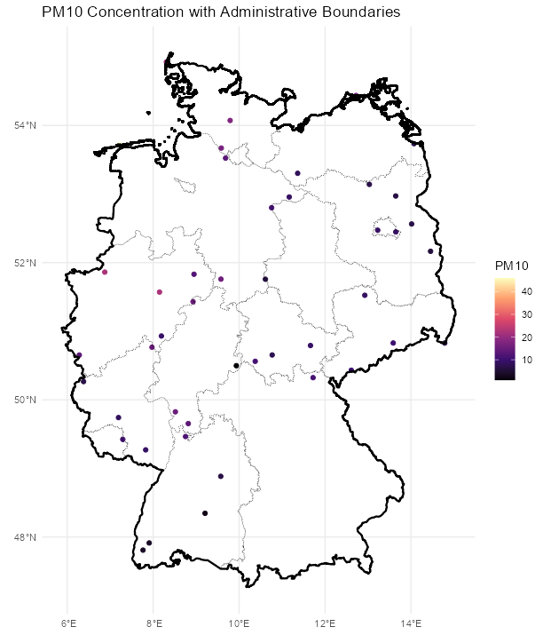{.lightbox group="eda-ac-ex1" width="373"}

  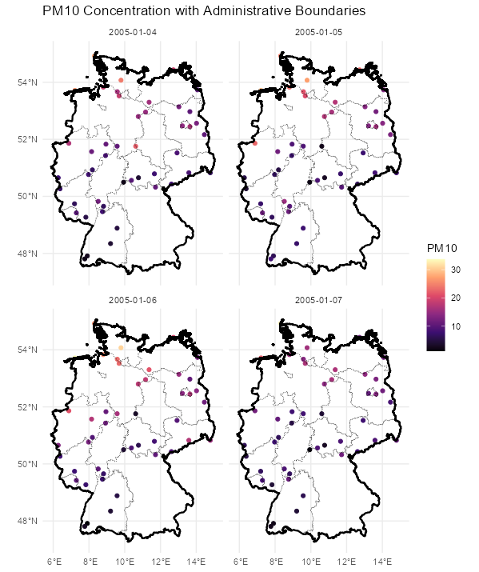{.lightbox group="eda-ac-ex1" width="373"}
  :::

  <Details>

  <Summary>Code</Summary>

  ``` r

  stars_r5to10 <- st_as_stars(r5to10)
  # stars has dplyr methods
  plot_slice <- 
    slice(stars_r5to10, 
          index = 3, # 3rd time step, so a location doesn't have NA 
          along = "time")
  # country boundary
  de_sf <- st_as_sf(DE)
  # states (provinces) boundaries
  nuts1_sf <- st_as_sf(DE_NUTS1)

  ggplot() +
    # location points
    geom_stars(
      data = plot_slice, 
      aes(color = PM10), 
      fill = NA) +
    scale_color_viridis_c(
      option = "magma", 
      na.value = "transparent") +
    # states
    geom_sf(
      data = nuts1_sf, 
      fill = NA, 
      color = "black", 
      size = 0.2, 
      linetype = "dotted") +
    # country
    geom_sf(
      data = de_sf, 
      fill = NA, 
      color = "black", 
      size = 0.8) +
    # Ensures coordinates align correctly
    coord_sf() +
    labs(
      title = "PM10 Concentration with Administrative Boundaries",
      fill = "PM10"
    ) +
    theme_minimal()

  # facet multiple time steps
  plot_slices <- 
    slice(stars_r5to10, 
          index = 4:7, 
          along = "time")
  plot_slices_sf <- st_as_sf(plot_slices, as_points = TRUE)
  plot_slices_long <- 
    plot_slices_sf |> 
    pivot_longer(cols = !sfc, 
                 names_to = "time", 
                 values_to = "PM10")

  ggplot() +
    geom_sf(
      data = plot_slices_long, 
      aes(color = PM10)) +
    scale_color_viridis_c(
      option = "magma", 
      na.value = "transparent") +
    geom_sf(
      data = nuts1_sf, 
      fill = NA, 
      color = "black", 
      size = 0.2, 
      linetype = "dotted") +
    geom_sf(
      data = de_sf, 
      fill = NA, 
      color = "black", 
      size = 0.8) +
    facet_wrap(~time) +
    coord_sf() +
    labs(
      title = "PM10 Concentration with Administrative Boundaries",
      color = "PM10"
    ) +
    theme_minimal()
  ```

  </Details>

  ## Autocorrelation

  ###### Average ACF per Location

  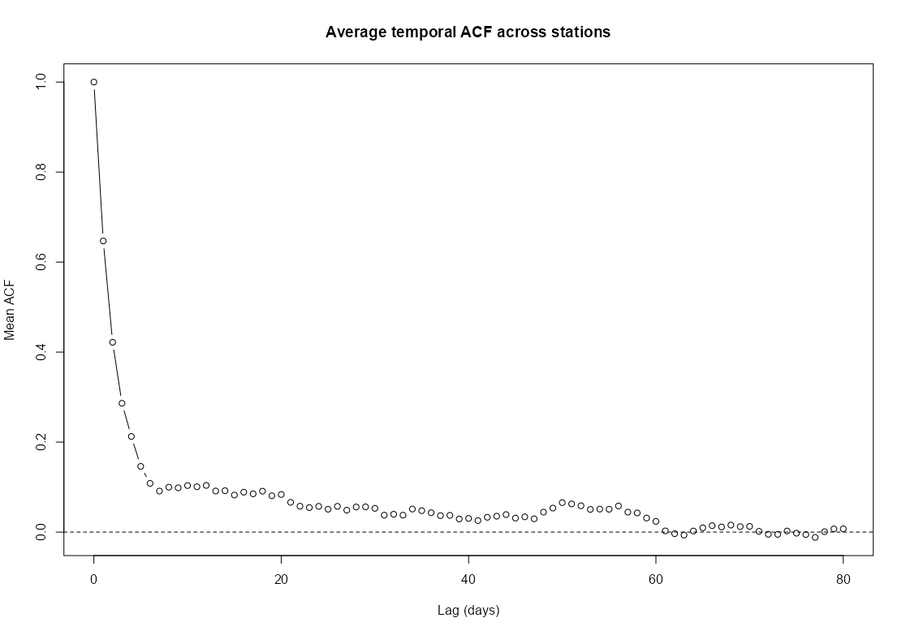{.lightbox width="532"}

  ``` r
  # ACF for each station
  mat_acf <- apply(
    as(r5to10, "xts"), # coerce to matrix of time series columns
    2, 
    function(x) {
      acf(
        x, 
        na.action = na.pass, 
        plot = FALSE, 
        lag.max = 80)$acf
    }
  )

  # locations are rows
  acf_mean <- rowMeans(mat_acf, na.rm = TRUE)

  plot(
    0:80,           # 80 days
    acf_mean, 
    type = "b",     # points and lines
    xlab = "Lag (days)", 
    ylab = "Mean ACF",
    main = "Average temporal ACF across stations"
  )
  abline(h = 0, lty = 2)
  ```

  - The average autocorrelation gets close to zero around 40 days and then crosses zero at around 60 days. After 60 days, there's only a little noisy oscillation around zero.

  ###### Specific Locations

  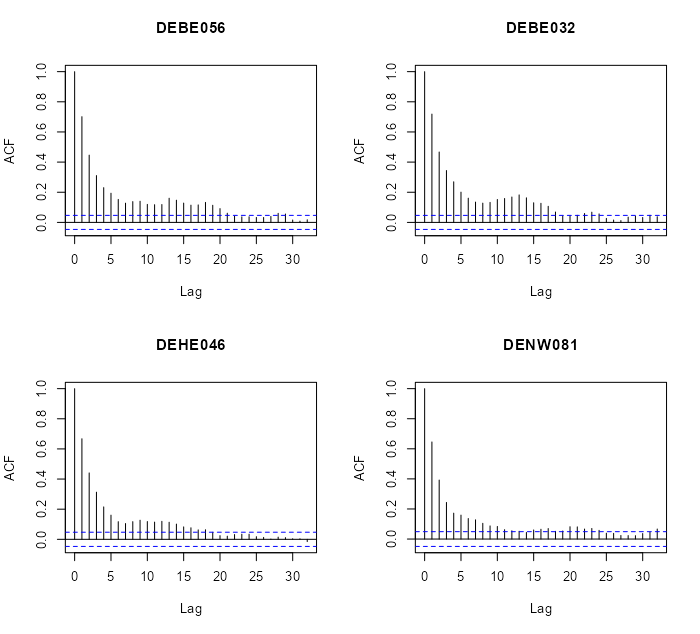{.lightbox group="eda-ac-ex1" width="532"}

  ``` r
  # select locations 4, 5, 6, 7
  rn = row.names(r5to10@sp)[4:7]

  par(mfrow=c(2,2))
  for (i in rn) {
    x <- na.omit(r5to10[i,]$PM10)
    acf(x, main = i)
  }
  ```

  - There does seem to be a gradual-ness and scalloped pattern with these locations.
  - Looks like at around lag 20, autocorrelation is not significant for most of these locations

  ## Partial Autocorrelation

  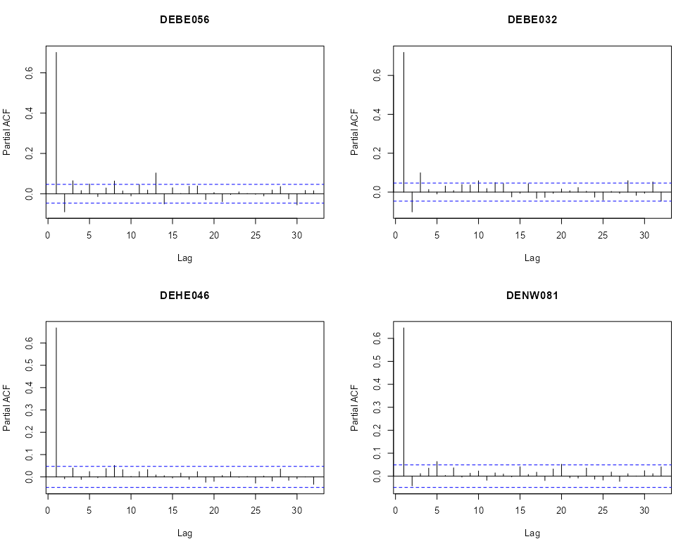{.lightbox width="532"}

  ``` r
  par(mfrow=c(2,2))
  for (i in rn) {
    x <- na.omit(r5to10[i,]$PM10)
    pacf(x, main = i)
  }        
  ```

  - We see one or two significant spikes at each location, but nothing that would indicate a consistent seasonality among the locations.

  ## Cross-(Auto)Correlation

  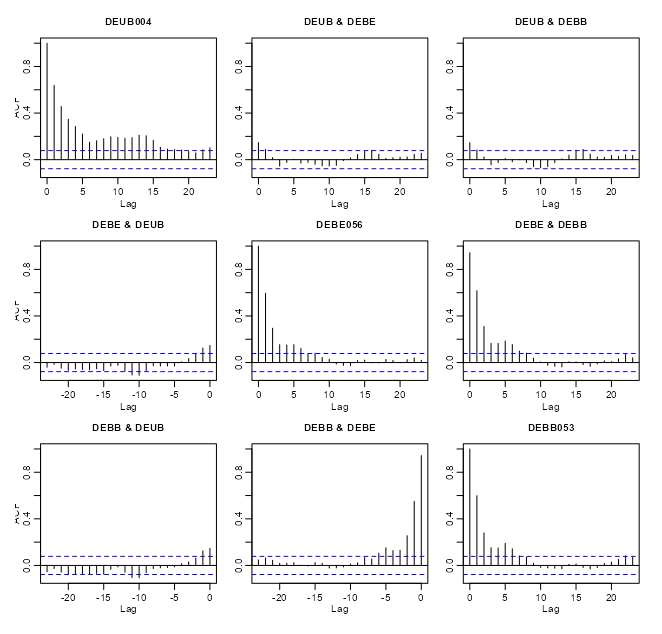{.lightbox group="eda-ac-ex1" width="632"}

  ``` r
  # coerce to xts class
  xts_pm10 <- as(r5to10, "xts")
  # extract numeric cols
  mat_pm10 <- zoo::coredata(xts_pm10)
  # find and remove cols with NAs > 20%
  na_cols <- colnames(mat_pm10)[colMeans(is.na(mat_pm10)) > 0.20]
  mat_pm10_nacols <- mat_pm10[, !colnames(mat_pm10) %in% na_cols]
  mat_pm10_clean <- na.omit(mat_pm10_nacols)
  # all data
  acf(mat_pm10_clean)

  # vs "DEUB004"
  no_ac_locs <- c("DEUB004", "DEBE056", "DEBB053")
  mat_pm10_naac <- mat_pm10_clean[, no_ac_locs]
  acf(mat_pm10_naac)
  ```

  - [r5to10]{.var-text} is a STFDF (full grid) object. It's coerced, using `as`, into a [xts]{.arg-text} object. Since it's now a multivariate time series object, `acf` will give you cross-correlations.
  - From the acf of all the data, there were a couple interesting locations that had very little cross-correlation between them.
  - When running `acf` for a fairly large number of locations there will be a large number of charts (due to all the combinations). After one chart is rendered, in the R console, it'll ask you to hit enter before it will render the next chart.
    - Note that within the cross-correlation charts, the titles of some of the location names get cut off.

  ## Pairwise Distance

  If there is no or little autocorrelation between a pair of locations, is it largely because there's a large distance between those locations? Maybe this can give a hint about the appropriate neighborhood size or area

  ###### Distance Matrix

  ``` r
  # select low cross-corr locations and random locations
  # indices for the low cross-corr locations
  no_ac_idx <- which(row.names(r5to10@sp) %in% no_ac_locs)
  # indices for the column names (locations) of the cleaned matrix
  mat_clean_idx <- which(row.names(r5to10@sp) %in% colnames(mat_pm10_clean))
  # sample 5 location indices that aren't low cross-corr locations
  mat_clean_idx_samp <- sort(sample(mat_clean_idx[-no_ac_idx], 5))
  # combine sample indices and low cross-corr indices
  mat_clean_idx_comb <- c(no_ac_idx, mat_clean_idx_samp)


  # convert the SpatialPoints (sp) to sf
  sf_locs <- st_as_sf(r5to10[mat_clean_idx_comb,]@sp)
  # pairwise distances (in meters for geographic coordinates)
  mat_dist_sf <- st_distance(sf_locs)
  # convert to kilometers
  mat_dist_sf_km <- round(units::set_units(mat_dist_sf, km), 2)

  colnames(mat_dist_sf_km) <- row.names(r5to10[mat_clean_idx_comb,]@sp)
  rownames(mat_dist_sf_km) <- row.names(r5to10[mat_clean_idx_comb,]@sp)
  mat_dist_sf_km
  #> Units: [km]
  #>         DEBE056 DEBB053 DEUB004 DEBE056 DETH026 DEUB004 DEBW031 DENW068
  #> DEBE056    0.00   28.07  648.60  235.43  357.82  541.62  198.99  557.63
  #> DEBB053   28.07    0.00  674.84  256.26  374.67  569.64  221.21  585.50
  #> DEUB004  648.60  674.84    0.00  441.77  660.90  209.86  579.71  173.85
  #> DEBE056  235.43  256.26  441.77    0.00  458.62  393.98  292.91  396.71
  #> DETH026  357.82  374.67  660.90  458.62    0.00  467.91  173.13  500.94
  #> DEUB004  541.62  569.64  209.86  393.98  467.91    0.00  420.84   36.08
  #> DEBW031  198.99  221.21  579.71  292.91  173.13  420.84    0.00  446.54
  #> DENW068  557.63  585.50  173.85  396.71  500.94   36.08  446.54    0.00

  # using sp
  mat_dist_sp <- round(sp::spDists(r5to10[mat_clean_idx_comb,]@sp), 2)
  colnames(mat_dist_sp) <- row.names(r5to10[mat_clean_idx_comb,]@sp)
  rownames(mat_dist_sp) <- row.names(r5to10[mat_clean_idx_comb,]@sp)
  ```

  - The 3rd column ([DEUB004]{.var-text}) and first two rows ([DEBE056]{.var-text}, [DEBB053]{.var-text}) shows the distances between the low cross-correlation locations. The other locations are included for context.
  - The distances for those low cross-correlations location pairs do seem to be quite a bit larger than the other 5 randomly sampled locations when paired with [DEUB004]{.var-text}. So the low cross-correlations are likely due to larger spatial distances between the locations.
  - Might be interesting to check the cross-correlation between [DEUB004]{.var-text} and [DETH026]{.var-text} and maybe [DEBW031]{.var-text} just to see how low those cross-correlations are in comparison.
  - The [{sp}]{style="color: #990000"} and [{sf}]{style="color: #990000"} numbers are slightly different, because [{sp}]{style="color: #990000"} uses spherical and [{sf}]{style="color: #990000"} uses elliptical distances. The elliptical should be more accurate, but either should be fine for most applications (fraction of a percentage difference)

  ###### Map

  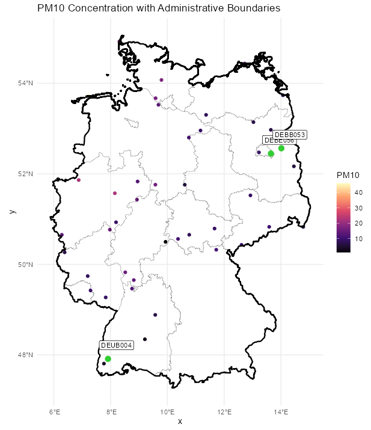{.lightbox group="eda-ac-ex1" width="373"}

  <Details>

  <Summary>Code</Summary>

  ``` r
  labeled_points <- 
    st_as_sf(plot_slice, as_points = TRUE) |> 
    mutate(station = rownames(r5to10@sp@coords)) |> 
    filter(station %in% c("DEUB004", "DEBE056", "DEBB053"))

  ggplot() +
    # location points
    geom_stars(
      data = plot_slice, 
      aes(color = PM10), 
      fill = NA) +
    scale_color_viridis_c(
      option = "magma", 
      na.value = "transparent") +
    # states
    geom_sf(
      data = nuts1_sf, 
      fill = NA, 
      color = "black", 
      size = 0.2, 
      linetype = "dotted") +
    # country
    geom_sf(
      data = de_sf, 
      fill = NA, 
      color = "black", 
      size = 0.8) +
    # Ensures coordinates align correctly
    coord_sf() +
    # color labelled points differently
    geom_sf(
      data = labeled_points, 
      color = "limegreen", 
      size = 3, 
      shape = 21, 
      fill = "limegreen") +
    geom_sf_label(
      data = labeled_points, 
      aes(label = station),
      nudge_x = 0.3, 
      nudge_y = 0.3, 
      size = 3) +
    labs(
      title = "PM10 Concentration with Administrative Boundaries",
      fill = "PM10") +
    theme_minimal()        
  ```

  </Details>

  - Pretty much on the other side of the country, but there are locations further away. Again, it'd be interesting to look at the cross-correlations between some of the pairs of locations that are just as far or farther away.
  ::::

- [Example 2]{.ribbon-highlight}: Pooled Temporal Variogram

  ::::: panel-tabset
  ## Data

  This is the PM10 air pollution dataset for Germany that's from [{spacetime}]{style="color: #990000"} and used in many of my examples.

  The goal is to find starting values for temporal `vgm` portions of spatio-temporal variogram models.

  ``` r
  pacman::p_load(
    ebtools, # pooled_temporal_variogram
    ggplot2,
    patchwork,
    gstat
  )

  data(air, package = "spacetime")

  keep_cols <- dates >= as.Date("2005-01-01") &
    dates <= as.Date("2010-12-31")

  air_sub <- air[, keep_cols]

  # Remove locations with all NAs
  keep_rows <- rowSums(!is.na(air_sub)) > 0
  air_sub <- air_sub[keep_rows, ]

  # add dates as column names
  keep_dates <- as.character(dates[keep_cols])
  colnames(air_sub) <- keep_dates
  ```

  - `pooled_temporal_variogram` is from [my personal package](https://ercbk.github.io/ebtools/) and requires a space-time matrix with date or datetime strings as column names.

  ## Pooled Temporal Variogram

  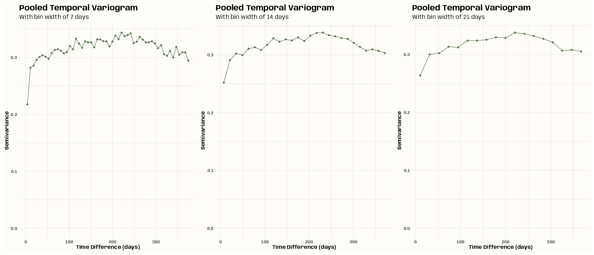{.lightbox group="eda-tdep-ex2" width="682"}

  ``` r
  ls_vario_time <- purrr::map(
    c(7, 14, 21), # 1wk, 2wks, 3wks
    \(x) {
      pooled_temporal_variogram(
        Y = air_sub,
        bin_width = x,
        max_time_diff = 375 # slightly more than a year in case there's noise
      )
    }
  )

  ls_plots <- purrr::map2(
    ls_vario_time,
    c(7, 14, 21),
    \(vario_obj, binwidth) {
      ggplot(vario_obj, 
             aes(x = dist, y = gamma)) +
        geom_point(color = "#59754D") +
        geom_line(color = "#59754D") +
        expand_limits(y = 60:110) +
        labs(
          x = "Time Difference (days)",
          y = "Semivariance",
          title = "Pooled Temporal Variogram",
          subtitle = glue::glue("With bin width of {binwidth} days")
        ) +
        theme_notebook() +
        theme(panel.grid.minor = element_line())
    }
  )

  ls_plots[[1]] + ls_plots[[2]] + ls_plots[[3]]    
  ```

  - **tl;dr MY RANGE ESTIMATION WAS BAD.** The main issue I think was that I didn't extend the y-axis to zero in my plots which zoomed me into the data. It caused me to over-interpret the pattern which led me to estimate a larger range. Turns out that the variogram model sees the data as FLAT which leads to a much smaller range. When you see the plots in the next section you can kind of see where it's coming from, and honestly with air pollution, a small range makes more intuitive sense to me.
    - If I could go back and change my range guess, I'd go with 25 to 30 days.
    - **My nugget and sill estimations (and some other stuff) were pretty good at least (for some models).**
    - I'm leaving this interpretation here, because it might be helpful to look back upon for when there is an actual pattern in my data.
  - Using a bin width 7 is best for nugget estimation and initial detection of any patterns (e.g. seasonality)
    - My nugget estimation: \~68 units
      - So probably some micro-scale variation or measurment error present
  - Using a bin width 14 and 21 is best for sill and range estimation
    - Refinement of interpretation of any patterns
    - Sill estimation: \~103 units
    - Range estimation options:
      - Use the bump: \~220 days
      - Treat the bump as an anomaly: \~120 days
  - The rapid rise and leveling indicates strong short-term temporal dependence
  - The bump could indicate some seasonality. It begins at around 200 days and lasts until around 300 days.
    - The (temporal) variogram assumes stationarity. So, if strong enough, it could substantially bias the estimation.
    - Perhaps some seasonal differencing may be useful
    - Internally subtract location-wise mean or seasonal mean (rows in the matrix)
  - The nugget-sill ratio: 68/103 = 0.66 which is quite high
    - Interpretation:
      - High day-to-day variability
        - Since roughly two-thirds of the total variance is unstructured at the resolution of the sampling
      - Weak persistence after short lags
        - i.e. variable de-autocorrelates quickly after a 2 or 3 weeks
      - This is realistic for air pollution
    - Reasons
      - Pollution levels are driven by episodic events (traffic, wind shifts, industrial emissions, weather fronts)
      - Day-to-day meteorological forcing is highly variable and not strongly autocorrelated
      - PM10 responds quickly to local conditions and doesn't "persist" the way a slower variable like soil organic matter or groundwater depth might
  - The dip after \~275 days suggests one of:
    - Finite sample noise (most likely)
    - Seasonality (annual structure)
      - Potentially correct as the bump is at the tail
    - Not enough pairs
      - There are more than enough, so this ain't it

  ## Fit Variogram Models

  ###### Without Nugget

  ::: {layout-ncol="3"}
  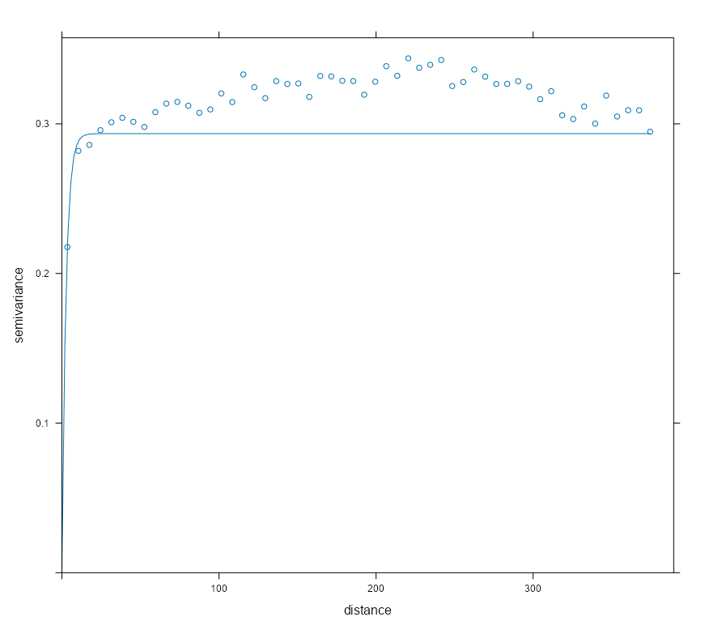{.lightbox group="eda-tdep-ex2" width="382"}

  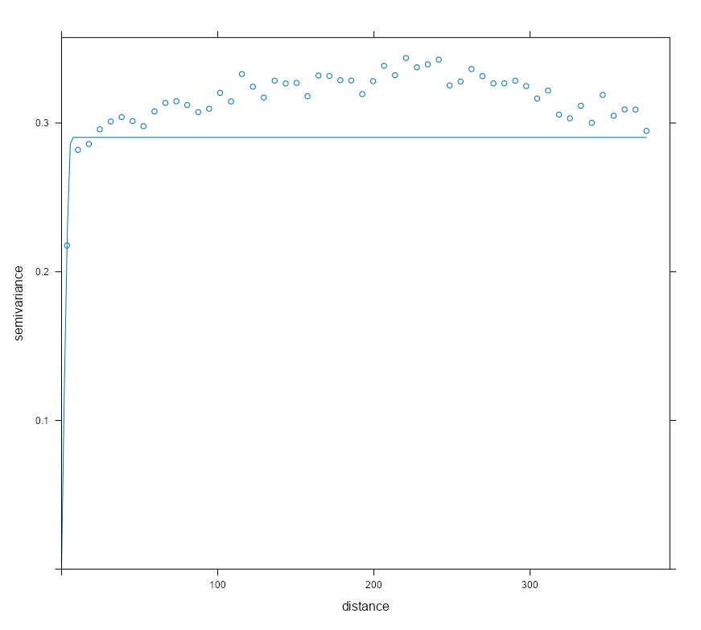{.lightbox group="eda-tdep-ex2" width="382"}

  {.lightbox group="eda-tdep-ex2" width="382"}
  :::

  ``` r
  mod_vario_time_exp <- fit.variogram(
    object = ls_vario_time[[1]],
    model = vgm(
      model = "Exp",
      psill = 35, # units; 103-68
      range = 120 # days
    )
  )

  mod_vario_time_exp
  #>   model    psill    range
  #> 1   Exp 93.56833 2.669963

  plot(
    x = ls_vario_time[[1]],
    mod_vario_time_exp
  )

  mod_vario_time_sph <- fit.variogram(
    object = ls_vario_time[[1]],
    model = vgm(
      model = "Sph",
      psill = 35, # units; 103-68
      range = 120 # days
    )
  )
  mod_vario_time_sph
  #>   model    psill    range
  #> 1   Sph 92.40597 6.379134

  plot(
    x = ls_vario_time[[1]],
    mod_vario_time_sph
  )


  mod_vario_time_mat <- fit.variogram(
    object = ls_vario_time[[1]],
    model = vgm(
      model = "Mat",
      psill = 35, # units; 103-68
      range = 120, # days,
      kappa = 0.12
    )
  )

  mod_vario_time_mat
  #>   model    psill    range kappa
  #> 1   Mat 100.2906 14.42514  0.12

  plot(
    x = ls_vario_time[[1]],
    mod_vario_time_mat
  )
  ```

  - Both exponential and spherical clearly undershoot the plateau, so matern is the choice here.
  - For the matern model, the default kappa is 0.5 which made the curve look closer to the exponential and spherical results.
  - For the exponential model, I tried an initial range of 200 and it didn't converge. When you see the model's estimate, you can see why. Both exponential and spherical have single digit ranges and the matern is around 14. I was off in my guess pretty badly.
  - I used the finer bin width (7 days) variogram, because there are still plenty of time difference pairs for semivariance estimation and there's no danger of overfitting these models.
    - Note that we have many more time points (and therefore time difference pairs per bin) as compared to spatial locations in the pooled spatial variogram case (example in next section), so smaller bin widths aren't an issue.
  - There are many models avaiable in gstat, but a lot are for specialized situations and the rest errored or didn't converge. I didn't investigate why some errored or didn't converge, so I just ended up with these three.

  ###### With Nugget

  ::: {layout-ncol="3"}
  {.lightbox group="eda-tdep-ex2" width="382"}

  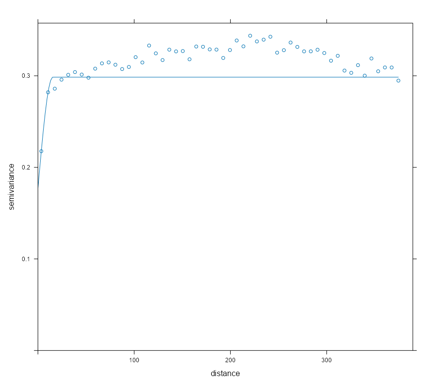{.lightbox group="eda-tdep-ex2" width="382"}

  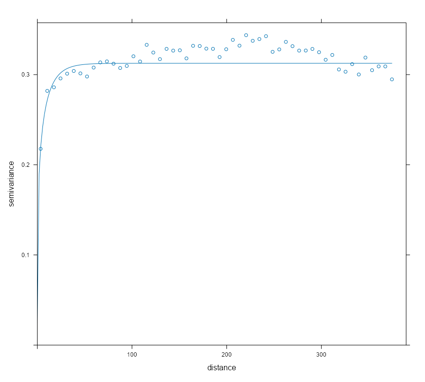{.lightbox group="eda-tdep-ex2" width="382"}
  :::

  ``` r
  mod_vario_time_exp_nug <- fit.variogram(
    object = ls_vario_time[[1]],
    model = vgm(
      model = "Exp",
      psill = 35, # units; 103-68
      range = 2, # days
      nugget = 68
    )
  )

  mod_vario_time_exp_nug
  #>   model    psill    range
  #> 1   Nug 45.06836 0.000000
  #> 2   Exp 52.17817 5.894366

  plot(
    x = ls_vario_time[[1]],
    mod_vario_time_exp_nug,
  )

  mod_vario_time_sph_nug <- fit.variogram(
    object = ls_vario_time[[1]],
    model = vgm(
      model = "Sph",
      psill = 35, # units; 103-68
      range = 120, # days
      nugget = 68
    )
  )
  mod_vario_time_sph_nug
  #>   model    psill    range
  #> 1   Nug 55.59087  0.00000
  #> 2   Sph 39.97869 16.10447

  plot(
    x = ls_vario_time[[1]],
    mod_vario_time_sph_nug
  )

  mod_vario_time_mat_nug <- fit.variogram(
    object = ls_vario_time[[1]],
    model = vgm(
      model = "Mat",
      psill = 35, # units; 103-68
      range = 120, # days,
      kappa = 0.12,
      nugget = 68
    )
  )

  mod_vario_time_mat_nug
  #>   model    psill    range kappa
  #> 1   Nug   0.0000  0.00000  0.00
  #> 2   Mat 100.2906 14.42514  0.12

  plot(
    x = ls_vario_time[[1]],
    mod_vario_time_mat_nug
  )    
  ```

  - Adding the nugget leads to a little better fit for the exponential and spherical models, but not enough to overtake the matern.
  - The matern didn't want the nugget when offered. Therefore, we have a better nugget-sill ratio which potentially means better kriging results, but a zero nugget doesn't sound too realistic in this case (i.e. no microscale variation or measurement erro).
  :::::

### Spatial Dependence {#sec-geo-sptemp-eda-spdep .unnumbered}

- Is there meaningful spatial correlation at all (relative to noise)?

  - Spatio-temporal variograms can appear structured even when spatial dependence is negligible—especially when temporal correlation is strong. So, we need to test whether spatial dependence exits independently.
  - If there were no spatial correlation, then for almost all spatial lags (i.e. pure nugget behavior), semi-variance is constant.
  - With spatial correlation, there should be a monotonic increase as distance increases which eventually plateaus.
    - Tells us that spatial dependence is not drowned out by temporal variability

- On what distance scale does spatial correlation operate?

  - At what distance does the variogram level off?
    - Realize the empirical range (calculated in the variogram model) and the practical range (using your eyes) are two different things.
  - In general does this distance suggest a State-wide spatial dependence? County-wide? Region-wide? etc.

- Is the spatial structure smooth or erratic?

  - Can one curve fit the data well or are there groups of bins that stand out as not being fit well by the model curve.
  - Does monotonicity of the bins fail? (i.e. a bin at greater distance than another but having a smaller semi-variance)
    - Try spatial detrending (e.g. regress on coordinates, covariates) or temporal detrending can restore a monotone variogram.
    - If variance or mean changes over time and you pool time slices, then differencing in time (or demeaning by time) can stabilize variance. Then, the short-lag spatial structure can become clearer.

- Is fitting a full spatio-temporal variogram likely to succeed?

  - Flat variogram → Don’t bother with spatial-temporal modeling when there's no need for even spatial modeling.
  - Extremely short range → Metric models likely degenerate.
  - Wild instability → Spatio-Temporal fitting will be numerically meaningless. (too much noise → too much uncertainty → predictions essentially meaningless)

- [Example]{.ribbon-highlight}: Pooled Spatial Variogram

  ::: panel-tabset
  ## Sample Time Instances

  - The data, r5to10, is PM10 measurements across 53 measurement stations in Germany.
  - Pooled spatial variograms are analyzed. Semivariance is computed between station pairs within each time slice, and then those within-slice spatial relationships are *pooled* across slices. The partial sill and range estimates can be used as starting values in a spatio-temporal variogram..
  - Bootstrap distributions for the partial sill and range are calculated. These could give us a potential range of starting values if there are fitting issues with the spatio-temporal variogram.
  - This example is from the [{gstat}]{style="color: #990000"} [vignette](https://cran.r-project.org/web/packages/gstat/vignettes/st.pdf) (Sect. 2.2) which they seem to have specified the model incorrectly given the package documentation. The vignette uses [dX = 0]{.arg-text} which I can only guess is because they thought [dX]{.arg-text} is *less than equal to* the 2-norm when it's actually *strictly less than* (See [Geospatial, Kriging \>\> Variograms](https://ercbk.github.io/Data-Science-Notebook/qmd/geospatial-kriging.qmd#sec-geo-krig-vario){style="color: green"} \>\> Example). Consequently, they produced a bad fit.
    - The correct specification [dX = 0.5]{.arg-text} with a factored time variable produced good fits for all models.

  ``` r
  pacman::p_load(
    dplyr,
    ggplot2,
    gstat,
    futurize
  )

  data(air, package = "spacetime")

  rural <- spacetime::STFDF(
    sp = stations,
    time = dates,
    data = data.frame(PM10 = as.vector(air))
  )
  rr <- rural[, "2005::2010"]

  unsel <- which(apply(
    as(rr, "xts"), 2,
    function(x) all(is.na(x))
  ))
  r5to10 <- rr[-unsel, ]


  # sample 100 time instances (days)
  set.seed(2026)
  vec_time <- sample(
    x = dim(r5to10)[2],
    size = 100
  )

  ls_samp <- lapply(
    vec_time,
    function(i) {
      x = r5to10[,i]
      x$time_index = i
      rownames(x$coords) = NULL
      x
    }
  )

  spdf_samp <- do.call(
    what = rbind,
    args = ls_samp
  )
  ```

  - 100 time instances (days) are sampled
  - For each time instance, the [STFDF]{.arg-text} is subsetted by that day. Then that day is added to a new variable, [time_index]{.var-text}.
  - Each element of [ls_samp]{.var-text} is a [SpatialPointsDataFrame]{.arg-text} and `rbind` combines the elements into one [SpatialPointsDataFrame]{.arg-text}

  ## Pooled Spatial Variogram Models

  ###### Fit the Models

  ``` r
  spdf_samp$time_index <- as.factor(spdf_samp$time_index)

  vario_samp <- variogram(
    object = PM10 ~ time_index,
    locations = spdf_samp[!is.na(spdf_samp$PM10),],
    dX = 0.5   # select pairs only within same factor level (time instance)
  )

  fit_vario_mod <- function(
      mod_type, 
      is_nug, 
      vario_samp,
      gamma_max,
      dist_max) {

    if (is_nug) {
      # w/nugget
      mod_vario <- 
        fit.variogram(
          object = vario_samp, 
          model = vgm(
            # heuristic method
            psill = gamma_max * 0.85,
            model = mod_type,
            range = dist_max  * 0.25,
            nugget = gamma_max * 0.15
          )
        ) 
    } else {
      # no nugget
      mod_vario <- 
        fit.variogram(
          object = vario_samp, 
          model = vgm(
            psill = gamma_max * 0.85,
            model = mod_type,
            range = dist_max  * 0.25,
          )
        ) 
    }

    # cleaning up model output
    nugget_val <- mod_vario$psill[mod_vario$model == "Nug"]
    model_res <- mod_vario[mod_vario$model != "Nug", ]

    tib_res <- tibble(
      mod_type = model_res$model,
      psill = model_res$psill,
      range = model_res$range,
      nugget = ifelse(length(nugget_val) == 0, NA, nugget_val),
      sse =  attr(mod_vario, "SSErr"),
      model = list(mod_vario)
    )  

    return (tib_res)
  }

  # input for the mod fitting loop
  # theoretical model types and w or w/o nugget
  # empircal variogram plus data for starting values
  # used in heuristic for starting values
  gamma_max <- max(vario_samp$gamma)
  dist_max  <- max(vario_samp$dist)

  df_mods_nug <- expand.grid(
    mod_type = c("Exp", "Sph", "Mat"),
    is_nug = c(TRUE, FALSE),
    stringsAsFactors = FALSE,
    KEEP.OUT.ATTRS = FALSE
  ) |>
    as_tibble() |> 
    mutate(
      vario_samp = list(vario_samp),
      gamma_max = gamma_max,
      dist_max = dist_max,
    )

  tib_vario_mods <- purrr::pmap(
    df_mods_nug,
    fit_vario_mod
  ) |> 
    purrr::list_rbind()

  tib_vario_mods
  #> # A tibble: 6 × 6
  #>   mod_type psill range nugget   sse model             
  #>   <fct>    <dbl> <dbl>  <dbl> <dbl> <list>            
  #> 1 Exp      106.   283.   4.76  49.1 <vrgrmMdl [2 × 9]>
  #> 2 Sph       68.4  343.   6.45  51.7 <vrgrmMdl [2 × 9]>
  #> 3 Mat      106.   283.   4.76  49.1 <vrgrmMdl [2 × 9]>
  #> 4 Exp       84.8  167.  NA     63.3 <vrgrmMdl [1 × 9]>
  #> 5 Sph       68.3  264.  NA    102.  <vrgrmMdl [1 × 9]>
  #> 6 Mat       84.8  167.  NA     63.3 <vrgrmMdl [1 × 9]>
  ```

  - No warnings from any of the model fittings, so the starting values from the heuristic method seem to work fine in this case.
  - Each model fitted a nugget when offered the opportunity
  - The Exponential and Matern (both w/nugget) delivered the best performances with SSEs of 49.1.

  ###### Visualize

  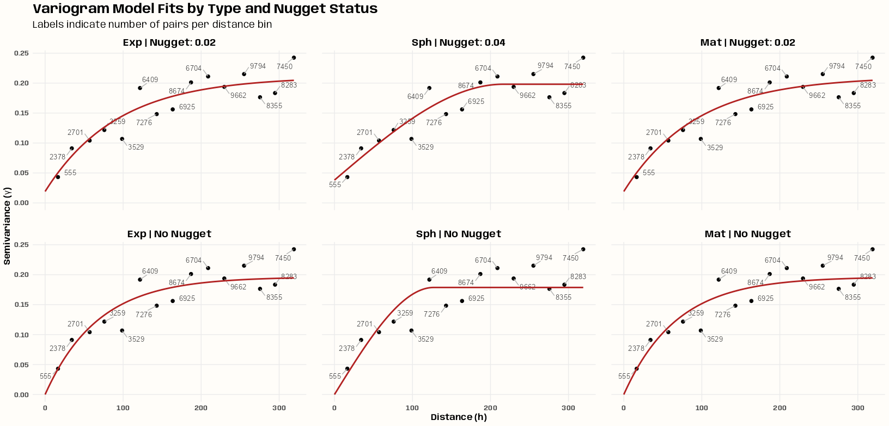{.lightbox}

  <Details>

  <Summary>Code</Summary>

  ``` r
  # facet titles for each model
  tib_plot_data <- tib_vario_mods |> 
    mutate(
      nugget_status = if_else(is.na(nugget), 
                              "No Nugget", 
                              paste("Nugget:", round(nugget, 2))),
      facet_label = factor(
        paste(mod_type, "|", nugget_status),
        levels = unique(paste(mod_type, "|", nugget_status))
      )
    )

  # generates the fitted lines for each model
  model_lines <- purrr::map2_dfr(
    tib_plot_data$model, 
    tib_plot_data$facet_label, 
    ~ variogramLine(.x, maxdist = max(vario_samp$dist)) |> 
      mutate(facet_label = .y)
  )


  ggplot() +

    # experimental variogram points
    geom_point(
      data = vario_samp, 
      aes(x = dist, y = gamma), 
      color = "black", 
      size = 2
    ) +

    # labels for number of distance pairs
    ggrepel::geom_text_repel(
      data = vario_samp, 
      aes(x = dist, y = gamma, label = np),
      size = 3.5,
      color = "grey30",
      segment.color = "grey70",
      force = 2,
      box.padding = 0.5
    ) +

    # model lines
    geom_line(
      data = model_lines, 
      aes(x = dist, y = gamma), 
      color = "firebrick", 
      linewidth = 1
    ) +

    facet_wrap(~ facet_label, ncol = 3) +

    labs(
      title = "Variogram Model Fits by Type and Nugget Status",
      subtitle = "Labels indicate number of pairs per distance bin",
      x = "Distance (h)",
      y = "Semivariance (γ)"
    ) +

    theme_notebook() +

    theme(
      # increase facet title font size
      strip.text = element_text(
        size = 14, 
        face = "bold", 
        color = "black"
      ),
      axis.title = element_text(size = 12),
      panel.spacing = unit(1.5, "lines")
    )
  ```

  </Details>

  - Even with just 100 time instance samples, these variograms look stable
    - Monotonicity isn't broken
    - No major outliers (maybe a couple mild ones at the large pairwise distance bins)
  - All these fits look fine visually. If I had to pick a bad one, it'd probably be the Spherical without a nugget, but maybe it's right and the others are overfitting.

  ## Block Bootstrapping

  - Different amounts of sampled time slices/instances a number of times can result in substantially different variograms — making it difficult to gain a feel for the partial sill and range parameters. Applying the bootstrap should give a better sense for a range of starting values for each of those parameters.
  - From the autocorrelation EDA example, there does seem to be some pretty strong autocorrelation present, so using the block version of bootstrapping makes sense.
  - Under iid resampling, you could draw many of those similar days into the same resample, producing a bootstrap distribution that understates variability in your parameter estimates because some resamples are effectively seeing the same spatial field repeatedly. The block bootstrap guards against this by ensuring consecutive days stay together, preserving the effective sample size of your bootstrap distribution.
  - Looking at the average ACF per location can help choose a block length\
    {.lightbox width="532"}
    - See [EDA \>\> Temporal Dependence](geospatial-spat-temp.qmd#sec-geo-sptemp-eda-ac){style="color: green"} \>\> Example 1 for the code.
    - Ideally 60 days (or 63 which is 9 weeks) is probably the choice, but 42 days (6 weeks) or even 21 days could possibly work.
    - The issue with choosing a block length is that there needs to be enough time instances (slices) sampled in order to get stable estimates.
      - Whether you have enough time instances depends on the amount of data (in this example, 1826 days after cleaning).
    - Also, this is a computationally expensive process that can take hours on the average desktop, so resources are another consideration.

  ###### Block Bootstrap the Partial Sill and Range

  See [Confidence and Prediction Intervals \>\> Bootstrapping](confidence-and-prediction-intervals.qmd#sec-cipi-boot){style="color: green"} \>\> Example 2: Block Bootstrap for more details on the code.

  <Details>

  <Summary>Code</Summary>

  ``` r
  # ---------- Model Function ---------- #

  estim_params_vgm <- function( # <1>
      mod_type, 
      idx_time_resamp, 
      dat) {

    ls_dat <- lapply(idx_time_resamp, function(i) {
      x <- dat[, i]
      x$time_index <- i
      rownames(x@coords) <- NULL
      x
    })

    spdf <- do.call(rbind, ls_dat)
    spdf <- spdf[!is.na(spdf$PM10), ]
    spdf$time_index <- as.factor(spdf$time_index)

    vario_exp <- variogram(
      PM10 ~ time_index, 
      spdf, 
      dX = 0.5
    )

    # matern model
    if (mod_type == "Mat") {
      # narrower than default
      kappa_grid <- seq(0.40, 0.70, by = 0.05)

      fits <- lapply(kappa_grid, function(k) {
        try(fit.variogram(
          vario_exp,
          vgm(nugget = NA,
              psill  = NA,
              model  = "Mat",
              range  = NA,
              kappa  = k),
          fit.kappa  = FALSE, # <2>
          fit.method = 7
        ), silent = TRUE)
      })

      # give NAs to degenerate results
      valid <- Filter(function(f) {
        !inherits(f, "try-error")     &&
          !isTRUE(attr(f, "singular")) &&
          all(f$psill >= 0)            &&
          all(f$range >= 0)
      }, fits)

      if (length(valid) == 0) return(tibble(
        model = mod_type, 
        psill = NA, 
        range = NA,
        nugget = NA, 
        kappa = NA, 
        sse = NA
      ))

      vario_mod   <- valid[[which.min(sapply(valid, function(f) attr(f, "SSErr")))]]
      kappa_value <- vario_mod$kappa[[2]]

    } else {

      # exponential or spherical
      vario_mod <- try(fit.variogram(
        vario_exp,
        vgm(
          psill  = NA,
          model  = mod_type,
          range  = NA,
          nugget = NA
        )
      ), silent = TRUE)

      failed <-
        inherits(vario_mod, "try-error")    ||
        isTRUE(attr(vario_mod, "singular")) ||
        any(vario_mod$psill < 0)            ||
        any(vario_mod$range < 0)

      if (failed) return(tibble(
        model = mod_type, 
        psill = NA, 
        range = NA,
        nugget = NA, 
        kappa = NA, 
        sse = NA
      ))

      kappa_value <- NA
    }

    tibble(
      model  = mod_type,
      psill  = vario_mod$psill[[2]],
      range  = vario_mod$range[[2]],
      nugget = vario_mod$psill[[1]],
      kappa  = kappa_value,
      sse    = attr(vario_mod, "SSErr")
    )
  }


  # ---------- Block Function ----------- #

  make_block_indices <- 
    function(n_time, 
             time_slices, 
             block_length, 
             n_samples) {
    mat_idxs <- matrix(NA, nrow = n_samples, ncol = time_slices)

    for (r in seq_len(n_samples)) { # <3>
      idx <- integer(0)

      while (length(idx) < time_slices) { # <4>
        start <- sample(
          1:(n_time - block_length + 1),
          size = 1
        )
        idx <- c(idx, start:(start + block_length - 1))
      }

      mat_idxs[r, ] <- idx[seq_len(time_slices)]
    }
    return(mat_idxs)
  }


  # ---------- Run it ---------- # 

  set.seed(2026) # <5>

  # cleaned data has 1826 days
  time_slices <- 504 # days
  block_length <- 42 # 6 weeks
  n_samples <- 200 # 200 resamples

  block_idxs <- make_block_indices(
    n_time = dim(r5to10)[2],
    time_slices = time_slices,
    block_length = block_length,
    n_samples = n_samples
  )

  plan(future.mirai::mirai_multisession, workers = 14L)

  tib_vario_params_full <- purrr::map(
    c("Exp", "Mat"),
    \(i) {
      tib_vario_params <- purrr::map(
        asplit(block_idxs, 1),
        \(x) {
          estim_params_vgm(
            mod_type = i, 
            x, 
            dat = r5to10
          )
        }
      ) |> 
        futurize() |> 
        purrr::list_rbind()    
    }
  ) |> 
    purrr::list_rbind()

  mirai::daemons(0)
  ```

  1.  The basically just functionalizes the part of the script in the previous tabs and extracts the psill and range parameters from the variogram model
  2.  [fit.kappa = TRUE]{.arg-text} can produce some unrealistic parameter estimates while still having good MSE performance. It failed in this case, so I used a narrower grid search centered around the Exponential model ($\kappa = 0.50$) which was producing stable estimates for the most part when I was exploring different settings.
  3.  Iterates through the number of bootstrap replicates specified by [n_samples]{.var-text}
  4.  Generates blocks until the length of the replicate reaches the fixed length ([time_slices]{.var-text})
  5.  A matrix is created with `make_block_indices` where each row is indices of PM10 observations which are organized in blocks of 14 days. Each row of that matrix is fed into `estim_parmas_vgm` where a variogram model is fit. The calculated [psill]{.arg-text} and [range]{.arg-text} parameters of the fitted model are collected in a tibble

  </Details>

  ###### Experimentation Notes

  +------------------------+---------------------------+-------------------------------------------------------------------------------------------------------------------------------------------------------------------------------------------------+
  | Configuration          | Run Time                  | Results                                                                                                                                                                                         |
  +========================+===========================+=================================================================================================================================================================================================+
  | time slices: 630 days\ | 1 hr 14 min on 12 workers | Good median/mean spreads on parameter estimates                                                                                                                                                 |
  | block length: 42 days\ |                           |                                                                                                                                                                                                 |
  | n samples: 150         |                           |                                                                                                                                                                                                 |
  +------------------------+---------------------------+-------------------------------------------------------------------------------------------------------------------------------------------------------------------------------------------------+
  | time slices: 504 days\ | 42 min on 12 workers      | Still good median/mean spreads; nugget spread affected most but not too much.                                                                                                                   |
  | block length: 42 days\ |                           |                                                                                                                                                                                                 |
  | n samples: 150         |                           |                                                                                                                                                                                                 |
  +------------------------+---------------------------+-------------------------------------------------------------------------------------------------------------------------------------------------------------------------------------------------+
  | time slices: 420 days\ | 27 min on 12 workers      | Nugget and range spreads now affected. Nugget median and maximums have changed substantially.                                                                                                   |
  | block length: 42 days\ |                           |                                                                                                                                                                                                 |
  | n samples: 150         |                           |                                                                                                                                                                                                 |
  +------------------------+---------------------------+-------------------------------------------------------------------------------------------------------------------------------------------------------------------------------------------------+
  | time slices: 294 days\ | 10.5 min on 12 workers    | Mean/median spreads exploding; nugget and range values changing substantially                                                                                                                   |
  | block length: 42 days\ |                           |                                                                                                                                                                                                 |
  | n samples: 150         |                           |                                                                                                                                                                                                 |
  +------------------------+---------------------------+-------------------------------------------------------------------------------------------------------------------------------------------------------------------------------------------------+
  | time slices: 420\      | 26 min on 14 workers      | Increasing the block length from 42 to 63 caused the mean/median spreads and maximums to start exploding                                                                                        |
  | block length: 63\      |                           |                                                                                                                                                                                                 |
  | n samples: 150         |                           |                                                                                                                                                                                                 |
  +------------------------+---------------------------+-------------------------------------------------------------------------------------------------------------------------------------------------------------------------------------------------+
  | time slices: 420\      | 37 min on 14 workers      | Increasing n samples to 200 on exacerbated the exploding spreads and maximums                                                                                                                   |
  | block length: 63\      |                           |                                                                                                                                                                                                 |
  | n samples: 200         |                           |                                                                                                                                                                                                 |
  +------------------------+---------------------------+-------------------------------------------------------------------------------------------------------------------------------------------------------------------------------------------------+
  | time slices: 420\      | 37.5 min on 14 workers    | Decreasing the block length produced smaller spreads and maximums than a block length of 42, but is that good? (Taking into account autocorrelation is supposed increase variance of estimates) |
  | block length: 21\      |                           |                                                                                                                                                                                                 |
  | n samples: 200         |                           |                                                                                                                                                                                                 |
  +------------------------+---------------------------+-------------------------------------------------------------------------------------------------------------------------------------------------------------------------------------------------+

  - **tl;dr**
    - As the number of time slices (length of rows in resample matrix) was reduced, the sequence of most affected estimates was nugget, then nugget and range, and finally nugget, range, and psill
    - Block lengths (step size in weeks) were chosen using the average ACF per location plot. Increasing the block length increased the variance. The higher the block length, the more nonsensical estimates produced.
      - Increasing the number of time slices can probably mitigate this, but that depends on your data (1826 days in this example) and resources (I have 16 workers available)
    - When the variance was high and estimates were non-sensical, increasing the number of resamples (n_samples) further increased the variance and made the estimates even worse.
  - The only model fit during this experimentation was the Matern model since that's the one that was most difficult to get stable estimates (i.e. spread between mean and median, maximum size)
  - Execution for both Exponential and Matern took 2.02 hrs on 14 workers. I felt this configuration (504 [time_slices]{.var-text}, 42 [block_length]{.var-text}, and 200 [n_samples]{.var-text}) gave me the best trade-off between precision (reasonable estimates) and run time.

  ###### Results

  ``` r
  # no error, singular mats, or negative estimates
  tib_vario_params_full |>
    group_by(model) |>
    summarize(na_rate = mean(is.na(range)))
  #>   model na_rate
  #>   <chr>   <dbl>
  #> 1 Exp         0
  #> 2 Mat         0

  tib_vario_params_full |>
    group_by(model) |>
    mutate(id = row_number()) |>
    ungroup() |>
    tidyr::pivot_wider(
      id_cols = id,
      names_from = model,
      values_from = c(psill, range, nugget, kappa, sse)
    ) |> 
    select(-id) |> 
    summary()
  #>    psill_Exp        psill_Mat        range_Exp        range_Mat        nugget_Exp       nugget_Mat       kappa_Exp     kappa_Mat     
  #>  Min.   : 22.33   Min.   : 22.97   Min.   : 36.60   Min.   : 23.70   Min.   : 0.000   Min.   :0.0000   Min.   : NA   Min.   :0.4000  
  #>  1st Qu.: 40.64   1st Qu.: 42.61   1st Qu.: 62.71   1st Qu.: 63.13   1st Qu.: 0.000   1st Qu.:0.0000   1st Qu.: NA   1st Qu.:0.4000  
  #>  Median : 52.49   Median : 54.98   Median : 92.56   Median :123.06   Median : 1.115   Median :0.0000   Median : NA   Median :0.4000  
  #>  Mean   : 58.37   Mean   : 63.68   Mean   :107.38   Mean   :150.49   Mean   : 1.836   Mean   :0.9716   Mean   :NaN   Mean   :0.4755  
  #>  3rd Qu.: 69.20   3rd Qu.: 76.28   3rd Qu.:137.62   3rd Qu.:193.86   3rd Qu.: 2.734   3rd Qu.:1.2989   3rd Qu.: NA   3rd Qu.:0.5000  
  #>  Max.   :165.82   Max.   :201.13   Max.   :291.82   Max.   :608.03   Max.   :10.166   Max.   :7.1015   Max.   : NA   Max.   :0.7000  
  #>                                                                                                        NA's   :200                   
  #>     sse_Exp            sse_Mat        
  #>  Min.   :   68.07   Min.   :   57.24  
  #>  1st Qu.:  202.13   1st Qu.:  175.43  
  #>  Median :  375.05   Median :  334.31  
  #>  Mean   : 1264.13   Mean   : 1056.00  
  #>  3rd Qu.: 1087.46   3rd Qu.: 1001.13  
  #>  Max.   :75587.82   Max.   :56389.88  

  tib_vario_params_full |> 
    summarize(
      sd_psill = sd(psill),
      sd_range = sd(range),
      sd_nugget = sd(nugget),
      .by = model)
  #> # A tibble: 2 × 4
  #>   model sd_psill sd_range sd_nugget
  #>   <chr>    <dbl>    <dbl>     <dbl>
  #> 1 Exp       24.8     54.6      2.18
  #> 2 Mat       29.4    121.       1.63

  # iid resamples
  mat_idx_resamp <- matrix(
    sample(dim(r5to10)[2],
           size = n_samples * time_slices,
           replace = TRUE),
    nrow = n_samples,
    ncol = time_slices
  )

  # iid results for 300 time_slices, 200 n_samples
  #>    psill_Exp        psill_Mat        range_Exp        range_Mat         nugget_Exp       nugget_Mat       kappa_Exp  
  #>  Min.   : 37.34   Min.   : 34.93   Min.   : 43.64   Min.   :  26.65   Min.   :0.0000   Min.   :0.0000   Min.   : NA  
  #>  1st Qu.: 48.28   1st Qu.: 50.25   1st Qu.: 63.91   1st Qu.:  66.45   1st Qu.:0.0000   1st Qu.:0.0000   1st Qu.: NA  
  #>  Median : 53.74   Median : 56.52   Median : 78.20   Median : 102.19   Median :0.7017   Median :0.0000   Median : NA  
  #>  Mean   : 57.18   Mean   : 63.78   Mean   : 87.84   Mean   : 123.55   Mean   :1.0686   Mean   :0.2783   Mean   :NaN  
  #>  3rd Qu.: 61.72   3rd Qu.: 66.56   3rd Qu.:104.52   3rd Qu.: 140.35   3rd Qu.:1.8377   3rd Qu.:0.0000   3rd Qu.: NA  
  #>  Max.   :253.32   Max.   :841.60   Max.   :396.88   Max.   :2607.34   Max.   :7.1390   Max.   :5.2885   Max.   : NA  
  #>                                                                                                         NA's   :200  
  #>    kappa_Mat         sse_Exp           sse_Mat       
  #>  Min.   :0.4000   Min.   :  71.14   Min.   :  58.78  
  #>  1st Qu.:0.4000   1st Qu.: 184.81   1st Qu.: 160.25  
  #>  Median :0.4000   Median : 292.64   Median : 274.38  
  #>  Mean   :0.4672   Mean   : 508.06   Mean   : 463.26  
  #>  3rd Qu.:0.5000   3rd Qu.: 472.73   3rd Qu.: 454.14  
  #>  Max.   :0.7000   Max.   :6871.59   Max.   :5979.79
  ```

  - We have medians less than means, so skew is present
  - The variance of each distribution is quite large which we expect when taking autocorrelation into account.
  - You see some crazy maximums, but the spreads between the median and means are fairly tame.
  - Also included standard bootstrap code and the results. The results are similar to results I got with the blocked bootstrap. So, I guess as long as autocorrelation isn't too big of a concern, the standard bootstrap is probably good enough.

  ###### Visualize

  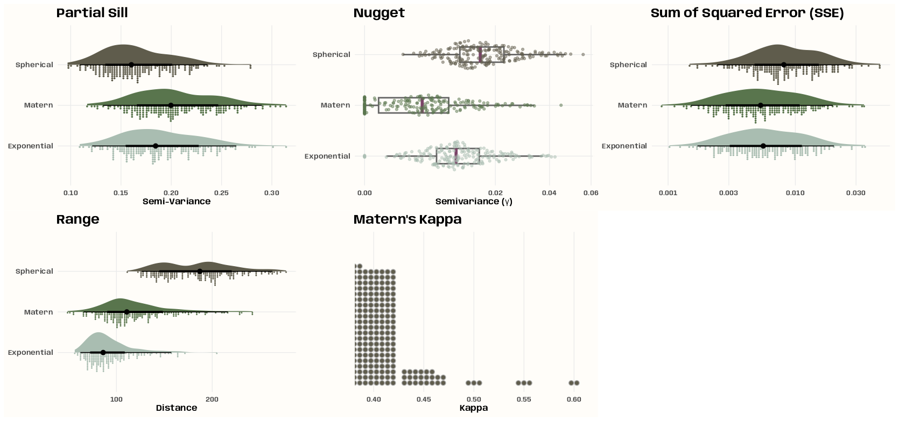{.lightbox}

  <Details>

  <Summary>Code</Summary>

  ``` r
  library(ggdist); library(patchwork)

  notebook_colors <- unname(swatches::read_ase(here::here("palettes/Forest Floor.ase")))

  tib_plot <- 
    tib_vario_params_full |> 
    mutate(model = recode_values(
      model,
      "Exp" ~ "Exponential",
      "Mat" ~ "Matern"
    )) |> 
    tidyr::pivot_longer(cols = -model, names_to = "parameter",) |> 
    group_split(parameter)

  psill_plot <- ggplot(
    data = tib_plot[[3]],
    aes(y = model, 
        x = value,
        fill = model)) +

    # density
    stat_slab(
      aes(thickness = after_stat(pdf*n)), 
      scale = 0.5) +

    # histogram
    stat_dotsinterval(
      side = "bottom", 
      scale = 0.5, 
      slab_linewidth = NA) + # not sure why, setting to NA applies proper color to dots

    scale_fill_manual(values = c(notebook_colors[[4]], notebook_colors[[8]])) +
    labs(title = "Partial Sill") +
    xlab("Semi-Variance") +
    guides(fill = "none") +
    theme_notebook(
      axis.title.y = element_blank(),
      panel.border = element_rect(color = "#FFFDF9FF", 
                                  fill = "#FFFDF9FF", 
                                  linewidth = 1.5))

  range_plot <- ggplot(
    data = tib_plot[[4]],
    aes(y = model, 
        x = value,
        fill = model)) +

    # density
    stat_slab(
      aes(thickness = after_stat(pdf*n)), 
      scale = 0.5) +

    # histogram
    stat_dotsinterval(
      side = "bottom", 
      scale = 0.5, 
      slab_linewidth = NA) + # not sure why, setting to NA applies proper color to dots

    scale_fill_manual(values = c(notebook_colors[[4]], notebook_colors[[8]])) +
    labs(title = "Range") +
    xlab("Distance") +
    guides(fill = "none") +
    theme_notebook(
      axis.title.y = element_blank(),
      panel.border = element_rect(color = "#FFFDF9FF", 
                                  fill = "#FFFDF9FF", 
                                  linewidth = 1.5))


  nugget_plot <- 
    ggplot(tib_plot[[2]],
           aes(
             x = value, 
             y = model, 
             color = model
         )) +

    geom_boxplot(
      width = 0.3, 
      linewidth = 1,
      median.linewidth = 2,
      median.color = notebook_colors[[9]],
      outlier.shape = NA,  # hide redundant outlier dots
      color = "grey40", 
      fill = NA) +

    # adds points inline w/boxplot
    ggforce::geom_sina(
      alpha = 0.5, 
      size = 1.5, 
      maxwidth = 0.6) +

    # handle many outliers
    scale_x_sqrt() +  # sqrt transform helps w/skew w/o hiding zeros

    scale_color_manual(values = c(notebook_colors[[4]], notebook_colors[[8]])) +
    labs(
      x = "Semivariance (γ)", 
      y = NULL, 
      title = "Nugget") +
    guides(color = "none") +
    theme_notebook(
      axis.title.y = element_blank(),
      panel.border = element_rect(color = "#FFFDF9FF",
                                  fill = "#FFFDF9FF",
                                  linewidth = 1.5))


  kappa_plot <- ggplot(
    data = tib_plot[[1]] |> filter(model == "Matern"),
    aes(x = value)) +

    # dot bars
    geom_dots(
      layout = "bar", 
      fill = notebook_colors[[8]], 
      dotsize = 1) +

    # remove y axis
    scale_y_continuous(breaks = NULL) +
    # add cushion so dots don't get cutt off
    scale_x_continuous(expand = expansion(mult = 0.1)) +

    labs(title = "Matern's Kappa") +
    xlab("Kappa") +
    guides(fill = "none") +
    theme_notebook(
      axis.title.y = element_blank(),
      panel.border = element_rect(color = "#FFFDF9FF",
                                  fill = "#FFFDF9FF",
                                  linewidth = 1.5))


  sse_plot <- ggplot(
    data = tib_plot[[5]],
    aes(y = model, 
        x = value,
        fill = model)) +

    # density
    stat_slab(
      aes(thickness = after_stat(pdf*n)), 
      scale = 0.5) +

    # dot histogram
    stat_dotsinterval(
      side = "bottom", 
      scale = 0.5, 
      slab_linewidth = NA) + # not sure why, setting to NA applies proper color to dots

    # handle many outliers
    scale_x_log10() +

    scale_fill_manual(values = c(notebook_colors[[4]], notebook_colors[[8]])) +
    labs(title = "Sum of Squared Error (SSE)") +
    guides(fill = "none") +
    theme_notebook(
      axis.title.y = element_blank(),
      axis.title.x = element_blank(),
      panel.border = element_rect(color = "#FFFDF9FF", 
                                  fill = "#FFFDF9FF", 
                                  linewidth = 1.5))


  psill_plot + range_plot + nugget_plot + kappa_plot + sse_plot + plot_layout(nrow = 3, byrow = FALSE)
  ```

  </Details>

  - Lots of skew and outliers
  - Nugget has a square root transform on the x-axis
  - SSE has a log10 transform on the x-axis
  - Kind of interesting that most of the chosen kappa values are at both extremes of the search grid.
  - I think Matern might've been chosen in the vignette, but it looks like you get pretty close to the same SSE with less potential drama (extreme range and psill estimates).
    - Although the Matern's nugget looks a little more stable. Also note that it has more zeros than the Exponential.
  :::

## Kriging {#sec-geo-sptemp-krig .unnumbered}

### Misc {#sec-geo-sptemp-krig-misc .unnumbered}

- Packages

  - [{]{style="color: #990000"}[gstat](https://cran.r-project.org/web/packages/gstat/index.html){style="color: #990000"}[}]{style="color: #990000"} - **OG**; Has idw and various kriging methods.

- The added value of spatio-temporal kriging lies in the flexibility to not only interpolate at unobserved locations in space, but also at unobserved time instances.

  - This makes spatio-temporal kriging a suitable tool to fill gaps in time series not only based on the time series solely, but also including some of its spatial neighbours.

- A potential alternative to spatio-temporal kriging is co-kriging.

  - Only feasible if the number of time replicates is (very) small, as the number of cross variograms to be modelled equals the number of pairs of time replicates.
  - Co-kriging can only interpolate for these time slices, and *not inbetween or beyond them*. It does however provide prediction error covariances, which can help assessing the significance of estimated change parameters

- The best fits of the respective spatio-temporal models might suggest different variogram families and parameters for the pure spatial and temporal ones.

- Spatio-Temporal vs Purely Spatial

  - By examining the spatio-temporal variogram plot, you
    - [Example]{.ribbon-highlight} (gstat vignette): A temporal lag of one or a few days leads already to a large variability compared to spatial distances of few hundred kilometers, implying that the temporal correlation is too weak to considerably improve the overall prediction.

- For large datasets

  - Try local kriging (instead of global kriging) by selecting data within some distance or by specifying [nmax]{.arg-text} (the nearest n observations). (See `krigeST` below)

- Workflow

  ``` r
  # calculate sample/empirical variogram
  vario_samp <- variogramST()

  # specify covariance model
  mod_cvar <- vgmST()

  # fit variogram model
  vario_mod <- 
    fit.STVariogram(
      object = vario_samp,
      model = mod_cvar
    )

  # run variogram diagnostics
  attr(vario_mod, "optim")$value
  plot(vario_mod)
  plot(vario_samp, vario_mod, wireframe = T)
  ```

### Starting Values {#sec-geo-sptemp-krig-stval .unnumbered}

- I don't think any starting values for parameters have to be set unless the model fails to converge. Failures (convergence, singular) aren't rare though, so maybe it's just better to use them from the jump.

#### Marginal Models {#sec-geo-sptemp-krig-stval-marg .unnumbered}

- Use estimates from pooled marginal variograms

  - See [EDA \>\> Temporal Dependence](geospatial-spat-temp.qmd#sec-geo-sptemp-eda-ac){style="color: green"} \>\> Example 2
  - See [EDA \>\> Spatial Dependence](geospatial-spat-temp.qmd#sec-geo-sptemp-eda-spdep){style="color: green"} \>\> Example 1

- Apply a heuristic

  - `nugget = 0.15 * max(vario_samp$gamma)`: Assume nugget is a smallish fraction of total variance
  - `psill = 0.85 * max(vario_samp$gamma)`: The remainder from nugget calculation
  - `range = 0.25 * max(vario_samp$dist)`: Assume the variogram reaches its sill somewhere in the first quarter of the distance range

- Others I've seen

  - Cutoff
    - Spatial ([source](https://www.youtube.com/watch?v=iJdbAGb9I_E&list=WL&index=6&pp=iAQBsAgC))

      ``` r
      cutoff <- 0.5 * max(
        x = sp::spDists(
          x = sp::coordinates(
            # SpatialGridDataFrame; Month is actually a date
            obj = sgdf_fires[sgdf_fires$Month == min(sgdf_fires$Month), ]
          )
        )
      )
      ```

      - The default is essentially this is divided by 3 instead of 2 (I think).
      - Not sure why he's filtering by the minimum date

    - Temporal ([source](https://www.youtube.com/watch?v=iJdbAGb9I_E&list=WL&index=6&pp=iAQBsAgC))

      ``` r
      # SpatialGridDataFrame; Month is actually a date
      cutoff <- diff(range(spdf_month$Month)) / 2
      ```

      - The range of date values was very large (maybe 10 years) in this example. So I think it's too long, but probably a reasonable starting point.
      - Dude said fitting the model took too long, so runtime should also be a consideration.
  - Sill
    - Overall ([source](https://www.youtube.com/watch?v=iJdbAGb9I_E&list=WL&index=6&pp=iAQBsAgC))

      ``` r
      # sample variance
      var(STIDF_fires@data$Fires)
      ```

      - Where [Fires]{.var-text} is the response variable (count)

    - Use the median of the outer third of bins

      ``` r
      outer_bins  <- vario_samp$gamma[vario_samp$dist > quantile(vario_samp$dist, 0.67)]
      sill_start  <- median(outer_bins)
      ```
  - Partial Sill (psill)
    - Use sill and nugget starting values

      ``` r
      psill_start <- max(sill_start - nugget_start, sill_start * 0.5)
      ```
  - Nugget
    - Use marginal psill ([source](https://www.youtube.com/watch?v=iJdbAGb9I_E&list=WL&index=6&pp=iAQBsAgC)): `fit.variogram_space$psill`

      - He used this for both temporal and space `vgm` models in `vgmST`
      - If you didn't fit the nugget in your marginal models and don't want to go back and do that, then I guess this is an option.

    - Extrapolate from the two shortest-distance bins

      ``` r
      nugget_start <- max(0,
        vario_samp$gamma[1] - diff(vario_samp$gamma[1:2]) /
        diff(vario_samp$dist[1:2]) * vario_samp$dist[1]
      )
      ```
  - Range
    - Use the distance where gamma first exceeds 95% of the estimated sill

      ``` r
      range_start <- vario_samp$dist[which(vario_samp$gamma >= 0.95 * sill_start)[1]]
      range_start <- ifelse(is.na(range_start), dist_max * 0.3, range_start)
      ```

#### Joint Models {#sec-geo-sptemp-krig-stval-joint .unnumbered}

- Joint models are components in the Metric class of variogram models (Metric, Sum Metric, and Simple Sum Metric)

- The visual estimation of the range (and to a lesser extent the sill) is substantially different (overestimating) the numerically calculated range from variogram models. So, if starting values aren't producing converging models, it's probably a good idea to try decreasing the starting values you're getting from heuristic/visual methods.

- Using the joint variogram based on metric distance to visually estimate the range and sill\
  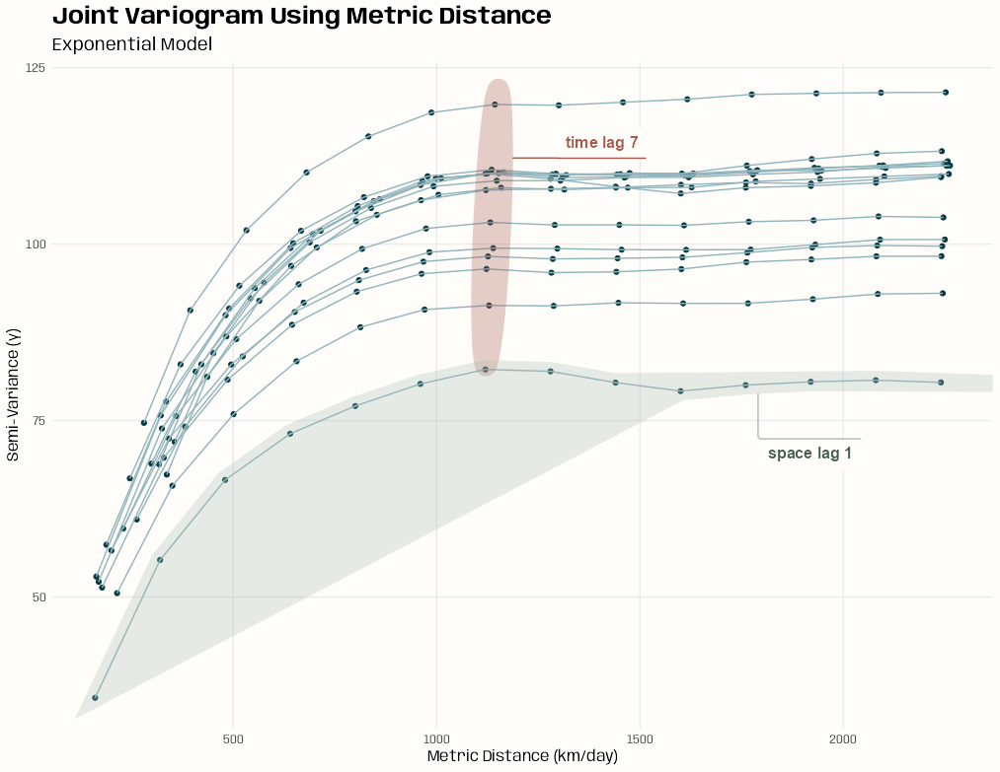{.lightbox width="582"}

  ``` r
  diag_slice <- vario_emp[vario_emp$spacelag > 0 & vario_emp$timelag > 0, ] |> 
    mutate(met_dist_exp = sqrt(spacelag^2 + (num_stani_exp * as.numeric(timelag))^2),
           timelag_lab = paste("time lag", as.numeric(timelag))) |> 
    mutate(rowid = row_number(),
           spacelag_lab = paste("space lag", rowid),
           .by = spacelag) |> 
    select(-rowid)

  # summary of the number of distance pairs per bin
  summary(diag_slice$np)
  #>   Min. 1st Qu.  Median    Mean 3rd Qu.    Max. 
  #>  10181   60088  127680  112616  152985  180704 

  (joint_sill_start_exp <- diag_slice |> 
    # only bins at and past estimated range
    filter(met_dist_exp >= 800) |> 
    summarize(med_gamma = median(gamma)) |> 
    pull(med_gamma))
  #> [1] 108.0044

  (joint_range_start <- diag_slice |>
    filter(
      # only keep around the first half of the timelags
      met_dist_exp < 0.5 * max(met_dist_exp)
      # narrow to points greater than the estimated sill
      gamma >= 0.95 * joint_sill_start_exp
    ) |>
    # vertical slices in the variogram
    group_by(timelag) |>
    # for each lag, how close is its avg gamma to the sill estimate
    mutate(gamma_diff = mean(abs(gamma - joint_sill_start_exp))) |>
    ungroup() |>
    # choose the lag that has the gamma diff closest to the sill
    slice_min(gamma_diff) |>
    summarize(range_est = mean(met_dist_exp)) |>
    pull(range_est))
  #> [1] 1122.117
  ```

  - These sill and range estimates assume "well-filled" bins which seems to be the case here (minimum \~10K)

  - The goal was to get the estimates for the sill and range using the points in the time lags

  - For the sill estimate, the curves seem to begin to flatten around a metric distance between 800 and 1000, so I limited the points to greater than 800 and took the avg gamma value of those points.

  - Range Estimate:

    - I'm trying to zero-in around that 7th time lag and get that metric distance (reducing estimation space horizontally). So I remove most of the time lags that are likely in that flat plateau area (1/2 total metric distance)
    - Then I remove all the points that have gamma values below my sill estimate. (narrowing the estimation space vertically)
    - Then I group by time lags and calculate how close their average gamma is to my sill estimate. I choose the time lag with the average gamma that closest to the sill estimate
    - Then I get that time lag's metric distance and that's my range estimate.

  - Visually 1122 seems like a reasonable range starting point to my eye

  - Spoiler: The best variogram models estimated the range to be around 360. So if I used this estimate, I overshot by about a factor of 3. ¯\\\_(ツ)\_/¯

    - The heuristic I went with in the example that doesn't assume well-filled bins still overshot by a factor of 2. It was still close enough to get converged fitted models though ¯\\\_(ツ)\_/¯ .

  - Visualization

    <Details>

    <Summary>Code</Summary>

    ``` r
    ggplot(diag_slice,
           aes(
             x = met_dist_exp,
             y = gamma
           )) +
      geom_point(color = prismatic::clr_darken(notebook_colors[[6]])) +
      geom_line(
        aes(group = factor(spacelag)),
        color = prismatic::clr_lighten(notebook_colors[[6]])
      ) + 

      # time lag
      ggforce::geom_mark_ellipse(
        aes(
          fill = as.numeric(timelag),
          label = timelag_lab,
          filter = as.numeric(timelag) == 7
        ),
        fill = notebook_colors[[5]],
        color = NA,
        con.colour = notebook_colors[[5]],
        label.fill = "#FFFDF9FF",
        label.colour = notebook_colors[[5]],
        expand = 0.01,
        con.cap = 0
      ) +

      # space lag
      ggforce::geom_mark_hull(
        aes(
          fill = spacelag,
          label = spacelag_lab,
          filter = spacelag == min(spacelag)
        ),
        fill = notebook_colors[[2]],
        color = NA,
        con.colour = notebook_colors[[2]],
        label.fill = "#FFFDF9FF",
        label.colour = prismatic::clr_darken(notebook_colors[[2]]),
        radius = unit(0.1, "mm"),
        expand = 0.01,
        concavity = 4,
        con.cap = 0
      ) +

      guides(fill = "none") +
      labs(
        x = "Metric Distance (km/day)",
        y = "Semi-Variance (γ)",
        title = "Joint Variogram Using Metric Distance",
        subtitle = "Exponential Model"
      ) + 
      theme_notebook()
    ```

    - After messing with the [radius]{.arg-text}, [expand]{.arg-text}, and [concavity]{.arg-text} settings, that's the best hull I could get for annotating the space lag unfortunately.

    </Details>

- [Example 1]{.ribbon-highlight}

  ::: panel-tabset
  ## Set-Up and Data

  This is the PM10 air pollution dataset for Germany that’s from [{spacetime}]{style="color: #990000"} and used in many of my examples.

  The goal is to find starting values for joint `vgm` portions of spatio-temporal variogram models.

  ``` r

  pacman::p_load(
    dplyr,
    ggplot2,
    patchwork,
    gstat
  )

  set.seed(2026)
  options(scipen = 999)
  notebook_colors <- unname(swatches::read_ase(here::here("palettes/Forest Floor.ase")))

  data(air, package = "spacetime")

  # get rural location time series from 2005 to 2010
  rural <- spacetime::STFDF(
    sp = stations, 
    time = dates, 
    data = data.frame(PM10 = as.vector(air))
  )
  rr <- rural[,"2005::2010"]

  # remove station ts w/all NAs
  unsel <- which(apply(
    as(rr, "xts"), 
    2, 
    function(x) all(is.na(x)))
  )
  r5to10 <- rr[-unsel,]
  ```

  - Urban stations have been removed as they have a different dgp and should be modelled separately

  ## Empirical Variogram and Anistropy

  ``` r
  # tlags = 0:6 (vignette),              299.47 sec (~5 min)
  # tlags = 0:14 (range of pooled temp), 459.61 sec (~7.5 min)
  vario_emp <- variogramST(
    PM10 ~ 1,
    data = r5to10,
    tlags = 0:14
  )

  # estimate anistropy
  # 160.0086
  num_stani_exp <- estiStAni(
    empVgm = vario_emp,
    method = "metric",
    interval = c(1, 1000),
    spatialVgm = space_vgm_exp
  )

  # 164.2333
  num_stani_mat <- estiStAni(
    empVgm = vario_emp,
    method = "metric",
    interval = c(1, 1000),
    spatialVgm = space_vgm_mat
  )
  ```

  - Using the metric method for the anistropy estimation since it felt consistent with using metric distance for the variogram plot (See EDA tab next) and seemed like it would be one of the best methods for spatio-temporal data in general.
    - See [fit.StVariogram](geospatial-spat-temp.qmd#sec-geo-sptemp-krig-var-fitstv){style="color: green"} \>\> stAni for details on methods and the interval starting range.

  ## EDA

  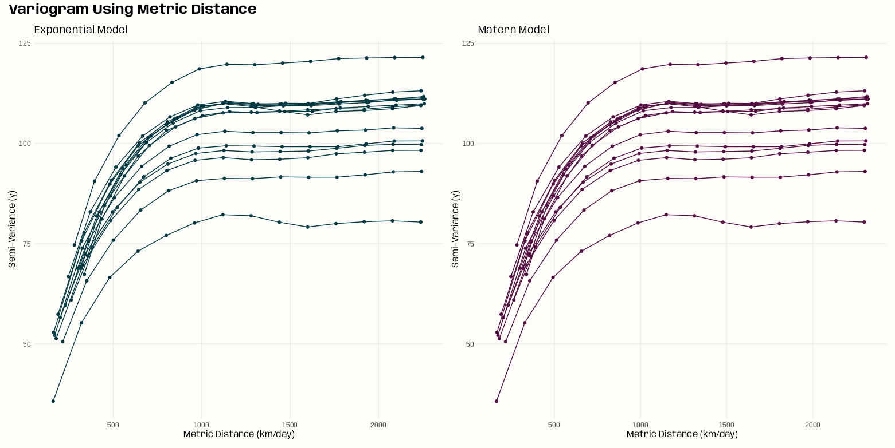{.lightbox width="632"}

  ``` r
  # filter out purely spatial and temporal lags
  # calculate metric distance for both variogram models
  diag_slice <- vario_emp[vario_emp$spacelag > 0 & vario_emp$timelag > 0, ] |> 
    mutate(met_dist_exp = sqrt(spacelag^2 + (num_stani_exp * as.numeric(timelag))^2),
           met_dist_mat = sqrt(spacelag^2 + (num_stani_mat * as.numeric(timelag))^2))

  # summary of the number of distance pairs per bin
  summary(diag_slice$np)
  #>   Min. 1st Qu.  Median    Mean 3rd Qu.    Max. 
  #>  10181   60088  127680  112616  152985  180704 
  ```

  - Creates a variogram plot using the metric distance as it combines both spatial and temporal distance (i.e. jointly)

  - The only variable in the metric distance calculations for exponential and matern is the anistropy estimation. The plots are pretty much identical which is expected given that there isn't much difference in the anistropy estimates.\

  - Visualization

    <Details>

    <Summary>Code</Summary>

    ``` r
    plot_vario <- function(dat, mod_type) {

      if (mod_type == "exponential") {
        met_dist <- "met_dist_exp"
        ink_col <- notebook_colors[[6]]
      }
      if (mod_type == "matern") {
        met_dist <- "met_dist_mat"
        ink_col <- notebook_colors[[9]]
      }

      ggplot(dat,
             aes(
               x = .data[[met_dist]],
               y = gamma,
               group = factor(spacelag)
             )) +
        geom_line() +
        geom_point() +
        labs(
          x = "Metric Distance (km/day)",
          y = "Semi-Variance (γ)",
          subtitle = glue::glue("{stringr::str_to_title(mod_type)} Model")
        ) + 
        theme_notebook(geom = element_geom(
          ink = prismatic::clr_darken(ink_col),
          accent = prismatic::clr_lighten(ink_col)))
    }

    purrr::map(
      c("exponential", "matern"),
      \(x) {plot_vario(diag_slice, x)}
    ) |> 
      purrr::reduce(
        `+`
      ) +
      plot_annotation(
        title = "Variogram Using Metric Distance",
        theme = theme_notebook())
    ```

    </Details>

  ## Estimate Joint Parameters

  ###### Marginal VGMs

  ``` r
  # from pooled (marginal) variograms
  space_vgm_exp <- vgm(
    model = "Exp",
    psill = 52,
    range = 93,
    nugget = 1.5
  )

  space_vgm_mat <- vgm(
    model = "Mat",
    psill = 55,
    range = 123,
    nugget = 0.5,
    kappa = 0.4
  )

  time_vgm_mat <- vgm(
    model = "Mat",
    psill = 100,
    range = 14,
    nugget = 0.1,
    kappa = 0.12 
  )
  ```

  - The values are from the pooled (aka marginal) variograms EDA examples
  - See [EDA \>\> Temporal Dependence](geospatial-spat-temp.qmd#sec-geo-sptemp-eda-ac){style="color: green"} \>\> Example 2
  - See [EDA \>\> Spatial Dependence](geospatial-spat-temp.qmd#sec-geo-sptemp-eda-spdep){style="color: green"} \>\> Example 1

  ###### Estimate Parameters

  ``` r
  # use heuristics to get starting values
  calc_joint_vgm_params <- function(
      vario_emp,
      mod_type,
      stani) {

    # remove purely spatial and purely temporal lags (i.e. 0)
    diag_slice <- vario_emp[vario_emp$spacelag > 0 & vario_emp$timelag > 0, ] |> 
      mutate(met_dist = sqrt(spacelag^2 + (stani * as.numeric(timelag))^2))

    joint_sill_start <- diag_slice |> 
        filter(
          # only bins with enough distance pairs
          np > quantile(np, 0.5),
          # large dist where it's assumed gamma will be flat
          met_dist > max(met_dist) * 0.5
        ) |> 
        summarize(med_gamma = median(gamma)) |> 
        pull(med_gamma)

    joint_range_start <- diag_slice |>
        filter(
          # only bins with enough distance pairs
          np > quantile(np, 0.5),
          # right before the plateau
          gamma >= 0.95 * joint_sill_start
        ) |>
        summarize(range_est = min(met_dist)) |>
        pull(range_est)

    joint_nugget_start <- diag_slice |>
      filter(
        # only bins with enough distance pairs
        np > quantile(np, 0.5),
        # just enough starting bins to get a decent est
        met_dist < 0.6 * joint_range_start
      ) |>
      lm(gamma ~ met_dist, data = _) |> 
      broom::tidy() |> 
      filter(term == "(Intercept)") |> 
      pull(estimate)

    joint_psill_start <- joint_sill_start - joint_nugget_start

    if (mod_type == "exponential") {
      joint_params <- list(
        psill = joint_psill_start,
        range = joint_range_start,
        nugget = joint_nugget_start
      )
    }

    if (mod_type == "matern") {
      joint_params <- list(
        psill = joint_psill_start,
        range = joint_range_start,
        nugget = joint_nugget_start
      )
    }

    return(joint_params)
  }

  joint_mod_types <- c("exponential", "matern")

  tib_joint_specs <- tibble(
    vario_emp = rep(list(vario_emp), length(joint_mod_types)),
    mod_type = joint_mod_types,
    stani = c(num_stani_exp, num_stani_mat)
  )

  ls_joint_vgm_params <- purrr::pmap(
    tib_joint_specs,
    calc_joint_vgm_params
  )

   names(ls_joint_vgm_params) <- joint_mod_types
   ls_joint_vgm_params
   #> $exponential
  #> $exponential$psill
  #> [1] 82.77977
  #> 
  #> $exponential$range
  #> [1] 680.2305
  #> 
  #> $exponential$nugget
  #> [1] 27.2145
  #> 
  #> 
  #> $matern
  #> $matern$psill
  #> [1] 82.31318
  #> 
  #> $matern$range
  #> [1] 696.1542
  #> 
  #> $matern$nugget
  #> [1] 27.68108
  ```

  - Heuristic methods are used to get [psill]{.arg-text}, [range]{.arg-text}, and [nugget]{.arg-text} starting values. See code comments for more details.
  - Not much difference between the exponential and matern models

  ## Create Joint VGMs

  ``` r
  create_joint_vgm <- function(mod_type, ls_params, joint_kappa) {

    if (mod_type == "exponential") {
      joint <- vgm(
        psill = ls_params$psill, 
        model = "Exp", 
        range = ls_params$range,
        nugget = ls_params$nugget
      )
    }

    if (mod_type == "matern") {
      joint <- vgm(
        psill = ls_params$psill, 
        model = "Mat", 
        range = ls_params$range,
        nugget = ls_params$nugget, 
        kappa = joint_kappa
      )
    }

    tib_joint <- tibble(
      mod_type = mod_type,
      kappa = joint_kappa,
      joint_vgm = list(joint)
    )
    return(tib_joint)
  }


  tib_joint_exp_params_grid <- tibble(
    mod_type = "exponential",
    ls_params = ls_joint_vgm_params["exponential"],  
    kappa = NA  
  )

  tib_joint_mat_params_grid <- expand.grid(
    mod_type = "matern",
    ls_params = ls_joint_vgm_params["matern"],
    kappa = c(0.3, 0.5, 0.8, 1.0, 1.5, 2.0)
  )

  tib_joint_all_params_grid <- tib_joint_exp_params_grid |> 
    bind_rows(tib_joint_mat_params_grid)

  tib_joint_vgm <- purrr::pmap(
    tib_joint_all_params_grid,
    ~ create_joint_vgm(..1, ..2, ..3)
  ) |> 
    purrr::list_rbind()
  ```

  - The joint model `vgm` objects are created using the starting values. These will be used for fitting the variogram models
  - There will be more matern vgms, because I'll be tuning that kappa value later.

  ## Calculate K

  ``` r
  calc_k_start <- function(space_vgm, time_vgm, joint_sill) {

    # if nuggets are NA, make'em zeros
    if(is.na(space_vgm$psill[[1]])) {
      space_vgm$psill[[1]] <- 0
    }

    if(is.na(time_vgm$psill[[1]])) {
      time_vgm$psill[[1]] <- 0
    }

    sills  <- space_vgm$psill[[2]] + space_vgm$psill[[1]]
    sillt  <- time_vgm$psill[[2]] + time_vgm$psill[[1]] 
    sillst <- joint_sill

    k_start <- (sillst - sills - sillt) / (sills * sillt)
    k_start <- max(k_start, 0.01)
    return(k_start)
  }

  # Using nugget + psill for the joint sill
  k_start_exp <- calc_k_start(
    space_vgm_exp,
    time_vgm_mat,
    ls_joint_vgm_params["exponential"][[1]]$psill + ls_joint_vgm_params["exponential"][[1]]$psill
  )

  k_start_mat <- calc_k_start(
    space_vgm_mat,
    time_vgm_mat,
    ls_joint_vgm_params["matern"][[1]]$psill + ls_joint_vgm_params["matern"][[1]]$psill
  )
  ```

  - The Product Sum model requires a k parameter which is a joint parameter. Therefore, the joint sill starting value is used here (calculated by adding the nugget and psill) as input.
  :::

### Variogram {#sec-geo-sptemp-krig-var .unnumbered}

#### Description

- Sample (or Empirical) Spatio-Temporal Variogram (Sherman 2011)\

  $$\hat \gamma(h,u) = \frac{1}{2N(h,u)} \sum_{N(h,u)} (Z(s_i, t_i) - Z(s_j, t_j))^2$$

  - Calculates the semi-variance for every pair of points separated by distance $h$ and time $u$.

#### `variogramST` {#sec-geo-sptemp-krig-var-vst .unnumbered}

- [Misc]{.underline}
  - [Docs](https://cran.r-project.org/web/packages/gstat/refman/gstat.html#variogramST)
  - Fits the Empirical/Experimental Variogram
  - Evidently fitting this object can take a crazy amount of time even with moderately sized datasets. So, it's recommended to **utilize the parallelization option** ([cores]{.arg-text})
    - In this [article](https://www.r-bloggers.com/2015/08/spatio-temporal-kriging-in-r/), he used a dataset with 6734 rows, and the dude ran it overnight. He didn't use the [core]{.arg-text} argument though. It was published 2015, so it might not have been available.
  - When setting function parameters, consider the amount of data you have (time periods, locations) and the total number of bins your parameter settings produce.
    - With more bins, you get more bins with few observations which causes:
      - Estimates become extremely noisy
      - Fitting metric or separable models becomes unstable
    - Examine variogram plots and note where semi-variance begins to top off spatially and temporally. Then, adjust width, cutoff, and tlags accordingly.
    - [Example]{.ribbon-highlight}:
      - width = 20, cutoff = 200 → \~10 spatial bins
      - tlags = 0:15 → 16 temporal bins
      - You now have \~160 bins.
- [cutoff]{.arg-text} - Spatial separation distance up to which point pairs are included in semivariance estimates
  - Default: The length of the diagonal of the box spanning the data is divided by three.
- [tlags]{.arg-text} - Time lags to consider. Default is [0:15]{.arg-text}
  - For [STIDF]{.arg-text} data, the argument [tunit]{.arg-text} is recommended (and only used in the case of STIDF) to set the temporal unit of the [tlags]{.arg-text}.
    - I think [tunit]{.arg-text} has the same type of input as `difftime` which are ["secs"]{.arg-text}, ["mins"]{.arg-text}, ["hours"]{.arg-text}, ["days"]{.arg-text}, or ["weeks"]{.arg-text}
  - The number of time lags is multiplied by the number of spatial bins to get the total bins. So the fewer the better, if the situation allows it. Fewer might also reduce computation time.
  - Seems like days are typical time unit is spatio-temporal data, so 15 lags might be a lot depending on what's being measured.
  - Using the ACFs to get an idea
- [twindow]{.arg-text} - Controls the temporal window used for temporal distance calculations.
  - This avoids the need of huge temporal distance matrices. The default uses twice the number as the average difference goes into the temporal cutoff. (I think this means *twice* the max of tlags)
    - Reduces unnecessary pair construction
    - Lowers memory use
    - Therefore, speeding up computation
  - The function will create time-distance pairs that aren't necessary
    - [Example]{.ribbon-highlight}: STFDF
      - If time = Jan 1, 2, 3, 4, 5, 6 and tlags is set to 0:3
      - By default, the function will create the distance pair 1,6 even though a lag of at most 3 days is all we care about.
      - Setting [twindow = 3]{.arg-text} makes sure pairs like (1,6) aren't created.
  - For [STFDF]{.arg-text} cases, setting [twindow = max(tlags)]{.arg-text} makes sense because any less and not all the desired tlags pairs get created and any more is meaningless because those pairs won't be used in the semi-variance calculations.
  - For [STIDF]{.arg-text} cases, maybe there's something like Jan 3.5 which represents noon on that day and you want the pair (0, 3.5) created where max(tlags) = 3. Not sure if that pair would be included in the semi-variance calculation or not though. Might require a special [tunits]{.arg-text} specification or transformation or something.
- [width]{.arg-text} - The width of subsequent distance intervals into which data point pairs are grouped for semivariance estimates
  - Default: The [cutoff]{.arg-text} is divided into 15 equal lags
  - Also see [Geospatial, Kriging \>\> Bin Width](geospatial-kriging.qmd#sec-geo-krig-bw){style="color: green"}
- [cores]{.arg-text} - Compute in parallel
  - Uses {future.apply} and currently has `plan("multicore")` hard coded in the function, so only Linux and Macs can take advantage.

#### `vgmST` {#sec-geo-sptemp-krig-var-vgmst .unnumbered}

- [Docs](https://cran.r-project.org/web/packages/gstat/refman/gstat.html#vgmST)
- Specifies the variogram model function.
- [Misc]{.underline}
  - See [Geospatial, Kriging \>\> Variograms](geospatial-kriging.qmd#sec-geo-krig-vario){style="color: green"} \>\> Terms for descriptions of sill, nugget, and range.
  - For `vgm`, you can just use `vgm("exponential")` and not worry about setting parameters like sill, nugget, etc. This might also be the case with `vgmST`. (See comments below [Geospatial, Kriging \>\> Variograms](geospatial-kriging.qmd#sec-geo-krig-vario){style="color: green"} \>\> Example 1)
    - You don't have to specify model types in each vgm for time and space. I think it fits them all and chooses the best one.
  - For [space]{.arg-text} and [time]{.arg-text} arguments, `vgm` is used to specify those models
- [Covariance Models]{.underline}
  - [Separable]{.underline}
    - Covariance Function: $C_{\text{sep}} = C_s(h)C_t(u)$
    - Variogram: $\gamma_{\text{sep}}(h, u) = \text{sill} \cdot (\bar \gamma_s (h) + \bar \gamma_t(u) - \bar\gamma_s(h)\bar\gamma_t(u))$
      - $h$ is the spatial step and $u$ is the time step
      - $\bar \gamma_s$ and $\bar \gamma_t$ are standardized spatial and temporal variograms with separate *nugget* effects and (joint) *sill* of 1
    - `vgmST(stModel = "separable", space, time, sill)`
    - Has a strong computational advantage in the setting where each spatial location has an observation at each temporal instance ([STFDF]{.arg-text} without [NA]{.arg-text}s)
  - [Product-Sum]{.underline}
    - Covariance Function: $C_{\text{ps}}(h,u) = kC_s(h)C_t(u) + C_s(h) + C_t(u)$

      - With $k \gt 0$ (Don't confuse this with the kappa anisotropy correction below)

    - Variogram:\

      $$\begin{align}
      \gamma_{\text{ps}}(h,u) = \;&(k \cdot \text{sill}_t + 1)\gamma_s(h) + \\
      &(k \cdot \text{sill}_s + 1)\gamma_t(h) -\\
      &k\gamma_s(h)\gamma_t(u)
      \end{align}$$

    - `vgmST(stModel = "productSum", space, time, k)`
  - [Metric]{.underline}
    - Assumes identical spatial and temporal covariance functions except for spatio-temporal anisotropy
      - i.e. Requires both spatial and temporal models use the same family. (e.g. spherical-spherical)
    - Covariance Function: $C_m(h,u) = C_{\text{joint}}(\sqrt{h^2 + (\kappa \cdot u)^2})$
      - $C_{\text{joint}}$ says that the spatial, temporal, and spatio-temporal distances are treated equally.
      - $\kappa$ is the **anisotropy correction**.
        - It's in space/time units so multiplying it times the time step, $u$, converts time into distance. This allows spatial distance and temporal "distance" to be used together in the euclidean distance calculation
        - e.g. $\kappa = 189 \frac{\text{km}}{\text{day}}$ says that 1 day is equivalent to 189 km.
    - Variogram: $\gamma_m(h,u) = \gamma_{\text{joint}}(\sqrt{h^2 + (\kappa \cdot u)^2})$
      - $\gamma_{\text{joint}}$ is any known variogram tha may generate a nugget effect
    - `vgmST("metric", joint, stAni)`
      - [stAni]{.arg-text}: The anisotropy correction ($\kappa$) which is given in spatial unit per temporal unit (commonly m/s). For estimating this input, see `estiStAni` below. Also see [Terms](geospatial-spat-temp.qmd#sec-geo-sptemp-terms){style="color: green"} \>\> Anisotropy
  - [Sum-Metric]{.underline}
    - A combination of spatial, temporal and a metric model including an anisotropy correction parameter, $\kappa$
    - Covariance Function: $C_{sm}(h,u) = C_s(h) + C_t(u) + C_{\text{joint}}(\sqrt{h^2 + (\kappa \cdot u)^2})$
    - Variogram: $\gamma_{sm}(h,u) = \gamma_s(h) + \gamma_t(u) + \gamma_{\text{joint}}(\sqrt{h^2 + (\kappa \cdot u)^2})$
      - Where $\gamma_s$, $\gamma_t$, and $\gamma_{\text{joint}}$ are spatial, temporal and joint variograms with separate nugget-effects
    - `vgmST("sumMetric", space, time, joint, stAni)`
      - Using the *simple* sum-metric model as starting values for the full sum-metric model improves the convergence speed.
  - [Simple Sum-Metric]{.underline}
    - Removes the nugget effects from the three variograms in the Sum-Metric model
    - Variogram: $\gamma_{\text{sm}}(h,u) = \text{nug} \cdot \mathbb{1}_{h\gt0\; \vee \; u\gt0} + \gamma_s(h) + \gamma_t(u) + \gamma_{\text{joint}}(\sqrt{h^2 + (\kappa \cdot u)^2})$
      - Think the nugget indicator says only include the nuggect effect if h or u is greater than 0.
    - `vgmST("simpleSumMetric", space, time, joint, nugget, stAni)`

#### `fit.StVariogram` {#sec-geo-sptemp-krig-var-fitstv .unnumbered}

- [Docs](https://cran.r-project.org/web/packages/gstat/refman/gstat.html#fit.StVariogram)
- Fits the variogram model using the empirical variogram (`variogramST`) and variogram model specification (`vgmST`)
- [Misc]{.underline}
  - Fitting tips, notes, etc.
    1.  Get rid of errors that are the result from some parameter estimate being negative) from the get-go by restricting the search space to being positive for all estimated parameters for that model.
        - You can use `extractPar(model)` or `extractParNames(model)` to extract the estimated parameters names and ORDER.

        - **The order of parameter values in the vector is paramount.** The names are basically for you only. `optim` only cares about the order. Out of order parameters will like result in confusing errors like, "non-finite finite-difference value \[2\]" or something

          ``` r
          extractPar(sep_mod)
          #>  range.s nugget.s  range.t nugget.t     sill 
          #> 123.0000   0.5000  14.0000   0.1000 109.9943
          ```

          - If you set the bounds ([lower]{.arg-text} or [upper]{.arg-text}) and you give `optim` [range.t = 0.1]{.arg-text} first, it will think that is the value you want for [range.s]{.arg-text}. It doesn't care that you named it [range.t]{.arg-text}.
          - So double check that you have the correct order using `extractPar` or `extractParNames`

        - [Example]{.ribbon-highlight}:

          ``` r
          lower_bounds <- switch(
            mod_type,
            "separable" = c(
              range.s  = 1,   nugget.s = 0,
              range.t  = 0.1, nugget.t = 0,
              sill     = 0
            ),
            "productSum" = c(
             sill.s = 0, range.s = 1,
             nugget.s = 0, sill.t = 0,
             range.t = 0.1, nugget.t = 0,
             k = 0.0001
            ),
            "metric" = c(
             sill    = 0, range   = 1,
             nugget  = 0, anis    = 1
            ),
            "simpleSumMetric" = c(
             sill.s  = 0, range.s  = 1,
             sill.t  = 0, range.t  = 0.1,
             sill.st = 0, range.st = 1,
             nugget  = 0, anis     = 1
            )
          )          

          fit.StVariogram(
            vario_emp, 
            mod, 
            lower = lower_bounds
          )

          sum_metric_lower_bounds <- c(
            sill.s = 0,     range.s = 1,
            nugget.s = 0,   sill.t = 0,
            range.t = 0.1,  nugget.t = 0,
            sill.st = 0,    range.st = 1,
            nugget.st = 0,  anis = 1
          )
          ```

          - Using floats is okay if the context of the data makes it plausible (e.g. temporal data is in days, but perhaps a range of less than a day (hours) is plausible)
    2.  Make convergence more likely by increasing the optimization iterations
        - [Example]{.ribbon-highlight}:

          ``` r
          fit.StVariogram(
            vario_emp, 
            mod,
            control = list(maxit=10000)
          )
          ```
    3.  Fit the *Simple Sum Metric* first. Then, use its estimated model parameters to fit the *Sum Metric*
        - It's already mentioned in the notes under [Sum Metric](geospatial-spat-temp.html#sec-geo-sptemp-krig-var-vgmst){style="color: green"}, but it's worth emphasizing. The optimizer errors aren't really helpful, so the best course is to avoid them all together.
        - See [Starting Values](geospatial-spat-temp.qmd#sec-geo-sptemp-krig-stval){style="color: green"} \>\> Joint Models \>\> Example 1
    4.  Tune the weighting method ([fit.method]{.arg-text}) for `fit.StVariogram`
        - For the Simple Sum Metric using the Matern model in [Starting Values](geospatial-spat-temp.qmd#sec-geo-sptemp-krig-stval){style="color: green"} \>\> Joint Models \>\> Example 1, changing to [fit.method = 7]{.arg-text} from [fit.method = 6]{.arg-text} resulted in a 300% decrease in sum of squared errors (SSE).
- [Weighting Options]{.underline}\
  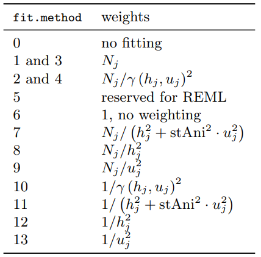{.lightbox width="332"}
  - Controls the weighing of the residuals between empirical and model surface
  - **tl;dr** Even though 6 is the default, 7 seems like a sound statistical choice unless the data/problem makes another method make more sense.
  - Adding Weights narrows down the spatial and temporal distances and introduces a cutoff.
    - This ensures that the model is fitted to the differences over space and time actually used in the interpolation, and reduces the risk of overfitting the variogram model to large distances not used for prediction.
  - To increase numerical stability, it is advisable to use weights that do not change with the current model fit. (?)
  - Terms
    - $N_j$ is the number of location pairs for bin $j$
    - $h_j$ is the mean spatial distance for bin $j$
    - $u_j$ is the mean temporal distance for bin $j$
  - Primarily two categories of methods:
    - *Equal-Bin* - Have a 1 in the numerator which means only the denominator contributes
      - Each lag bin contributes roughly equally to the objective function, regardless of how many point pairs went into estimating that bin.
      - Consider with small datasets where $N_j$ does not vary much across bins or when a balanced structure is called for.
    - *Precision-Weighted* - Have $N_j$ in the numerator
      - Assumes bins with more location pairs provide more reliable empirical variogram estimates
      - Parameter estimates tend to be more stable and less sensitive to small, noisy bins.
      - Consider with moderate to large datasets with substantial variation in $N_j$
  - Methods
    - [fit.method = 6]{.arg-text} (default) - No weights
    - 1 and 3: Greater importance is placed on *longer* pairwise distance bins
    - 2 and 10: Involve weights based on the fitted variogram that might lead to bad convergence properties of the parameter estimates.
    - 7 and 11: Recommended to include the value of [sfAni]{.arg-text} otherwise it'll use the actual fitted spatio-temporal anisotropy which can lead the model to not converge.
      - `estiStAni` can be used to estimate the [stAni]{.arg-text} value
      - The spatio-temporal analog to the commonly used spatial weighting
      - Denominator referred to as the *metric distance* which is similar to the what's used in the metric covariance model
      - 7 puts higher confidence in lags filled with many pairs of spatio-temporal locations, but respects to some degree the need of an accurate model for short distances, as these short distances are the main source of information in the prediction step
    - 3, 4, and 5: Kept for compatibility reasons with the purely spatial `fit.variogram` function
    - 8 downweights more heaviliy the large pairwise distance bins (prioritizes small distance pairwise locations)
    - 9 downweights more heavily the large pairwise time-distance bins (prioritizes small time-distance pairwise locations)
- [stAni]{.arg-text}: The spatio-temporal anisotropy that is used in the weighting. Might be missing if the desired spatio-temporal variogram model already has the stAni parameter
  - See [Terms](geospatial-spat-temp.qmd#sec-geo-sptemp-terms){style="color: green"} \>\> Anisotropy, [`vgmST`](geospatial-spat-temp.qmd#sec-geo-sptemp-krig-var-vgmst){style="color: green"} \>\> Metric, Sum Metric, and Simple Sum Metric
  - Default is NA and will be understood as identity (1 temporal unit = 1 spatial unit)
    - Docs says this assumption is rarely the case so could be worth including to see if it improves performance
  - Arguments
    - [empVgm]{.arg-text} - Empircal variogram (`variogramST`)
    - [interval]{.arg-text} - The interval to search for the stAni value
      - Not sure how important this is. I've used a narrow interval that wasn't even remotely close to containing the estimated value. Then, tried a much, much wider interval and still ended up with the same estimate (within a 1000^th^ or 10,000^th^ of a point).
      - Just use `c(1, 1000)` at first. If the estimate is near the endpoint, then adjust the interval to search around the estimate to make sure it isn't a local minimum.
    - [method]{.arg-text} - Method used to estimate the value (see below)
    - [spatialVgm]{.arg-text} - `vgm` specification for the spatial model
    - [temporalVgm]{.arg-text} - `vgm` specification for the temporal model
    - [s.range]{.arg-text} - Spatial cutoff value (for linear model)
    - [t.range]{.arg-text} - Temporal cutoff value (for linear model)
  - Anisotropy Estimation Heuristics using `estiStAni`
    - [method = "linear"]{.arg-text} - Rescales a linear model
      - Requires [empVgm]{.arg-text}, [interval]{.arg-text} arguments
      - Recommended to also specify [s.range]{.arg-text} and [t.range]{.arg-text} arguments
        - i.e. where *before* this value, there's a sharp increase. The function will drop values after this distance/time in order to get a good linear fit.
        - Technically the function will run without these value set but you probably need to set them in most cases to get an unbiased estimate
    - [method = "range"]{.arg-text} - Estimates equal ranges
      - Requires [empVgm]{.arg-text}, [spatialVgm]{.arg-text}, and [temporalVgm]{.arg-text} arguments
    - [method = "vgm"]{.arg-text} - Rescales a pure spatial variogram
      - Requires [empVgm]{.arg-text}, [interval]{.arg-text}, and [spatialVgm]{.arg-text} arguments
    - [method = "metric"]{.arg-text} - Estimates a complete spatio-temporal metric variogram model and returns its spatio-temporal anisotropy parameter.
      - Requires [empVgm]{.arg-text}, [interval]{.arg-text}, and [spatialVgm]{.arg-text} arguments

#### Diagnostics {#sec-geo-sptemp-krig-var-diag .unnumbered}

- "The selection of a spatio-temporal covariance model should not only be made based on the (weighted) mean squared difference between the empirical and model variogram surfaces (`attributes(fit_vario)$value`), but also on conceptional choices and visual judgement of the fits.
  - e.g.

    ``` r
    plot(
      emp_vario, 
      c(fit_vario1, fit_vario2, fit_vario3), 
      wireframe = TRUE, 
      all = TRUE
    )
    ```
- `plot` - Shows the sample and fitted variogram surfaces next to each other as colored level plots. ([Docs](https://cran.r-project.org/web/packages/gstat/refman/gstat.html#plot.gstatVariogram))
  - The 3-D wireframe charts aren't good for comparison. Maybe if they were interactive (rotation, zoom) and created using a more modern package, they'd be more useful.
  - With heatmaps, I'm able to distinguish really bad fitting models from other models, but comparison is difficult if the fit of the models is similar.
  - The multi-line chart is the best at comparing fits (IMO).
  - [wireframe = TRUE]{.arg-text} creates a wireframe plot
  - [map = TRUE]{.arg-text} (default) creates a heatmap of time vs space.
    - [FALSE]{.arg-text} creates a multi-line chart
  - [diff = TRUE]{.arg-text} plots the difference between the sample and fitted variogram surfaces.
    - Helps to better identify structural shortcomings of the selected model
  - [all = TRUE]{.arg-text} plots sample and model variogram(s)
- Convergence output from `optim`
  - [method = "L-BFGS-B"]{.arg-text} is the default. It uses a limited-memory modification of the BFGS quasi-Newton method, and has been said not the be as *robust* as "BFGS" which is supposed to be the gold standard ([thread](https://bsky.app/profile/vdveenb.bsky.social/post/3mb2ff75rh22i)). So if you have issues, "BFGS" may be worth a try.

  - Get these by accessing the [optim.out]{.arg-text} attribute from `fit.StVariogram`

    ``` r
    fit_var <- fit.StVariogram(...)
    attr_opt <- attributes(fit_var)$optim.out
    ```

  - [\$convergence]{.arg-text} - The convergence code (guessing this just binary: converged or not converged (`attr_opt$convergence`)

  - [\$message]{.arg-text} - Probably gives more details about "not converged" or maybe the time, eps, etc.

  - [\$value]{.arg-text} - The mean of the (weighted) squared deviations (loss function) between sample and fitted variogram surface. (aka Weighted Mean Squared Error (wMSE))
- Check the estimated parameters against the parameter boundaries and starting values
  - Be prepared to set upper and lower parameter boundaries if, for example, the sill parameters returned are negative.

#### Convergence Help {#sec-geo-sptemp-krig-var-convh .unnumbered}

- Starting values can affect the results (hitting local optima) or even success of the optimization
  - Using a starting value grid search might better asses the sensitivity of the estimates.
  - Starting values can in most cases be read from the sample variogram.
  - Parameters of the spatial and temporal variograms can be assessed from the spatio-temporal surface fixing the counterpart at 0.
    - Example: Inspection of the ranges of the variograms in the temporal domain, suggests that any station more than at most 6 days apart does not meaningfully contribute
  - The overall spatio-temporal sill including the nugget can be deducted from the plateau that a nicely behaving sample variogram reaches for ’large’ spatial and temporal distances.
- In some cases, you should rescale spatial and temporal distances to ranges similar to the ones of sills and nuggets using the parameter [parscale]{.arg-text}.
  - [control = list(parscale=...)]{.arg-text} - Input a vector of the same length as the number of parameters to be optimized (See `optim` docs for details)
  - See vignette for an example. They used the simple sum-metric model to obtain starting values for the full sum-metric model, and that improved the convergence speed of the more complex model.
    - There is a note in the discussion section about how this resulted in the more complex model being essentially the same as the simple model, but they tried other starting values and still ended up with the same result. So don't freak if you get the same model.
  - In most applications, a change of 1 in the sills will have a stronger influence on the variogram surface than a change of 1 in the ranges.

#### Examples {#sec-geo-sptemp-krig-var-ex .unnumbered}

- [Example 1]{.ribbon-highlight}: Germany's PM10 Polution Data

  ::: panel-tabset
  ## Assemble Parameter Grid

  The goal is choose the best spatio-temporal variogram model (Separable, Product-Sum, Metric, Sum-Metric, or Simple Sum-Metric) based on the lowest sum of squared errors score.\
  \
  This example is a continuation from getting starting values for the marginal components (space and time) and getting starting values for the joint components. See:

  - [EDA \>\> Temporal Depenndence](geospatial-spat-temp.qmd#sec-geo-sptemp-eda-ac){style="color: green"} \>\> Example 2
  - [EDA \>\> Spatial Dependence](geospatial-spat-temp.qmd#sec-geo-sptemp-eda-spdep){style="color: green"} \>\> Example 1
  - [Starting Values \>\> Joint Models](geospatial-spat-temp.qmd#sec-geo-sptemp-krig-stval-joint){style="color: green"} \>\> Example 1

  ``` r
  pacman::p_load(
    dplyr,
    ggplot2,
    futurize,
    gstat,
    plotly
  )

  set.seed(2026)
  options(scipen = 999)
  notebook_colors <- unname(swatches::read_ase(here::here("palettes/Forest Floor.ase")))

  tib_specs_variost <- expand.grid( # <1>
    mod_type = c("separable", "productSum", "metric", "simpleSumMetric"),
    space_type = c("matern", "exponential"),
    time_type = "matern",
    joint_type = c("matern", "exponential"),
    kappa = c(0.3, 0.5, 0.8, 1.0, 1.5, 2.0),
    wgt = c(1, 2, 6, 7, 9),
    stringsAsFactors = FALSE,
    KEEP.OUT.ATTRS = FALSE
  ) |>

    # clean-up expand.grid output 
    mutate( # <2>
      # give NAs to models that don't have joint components
      # and joint types that aren't matern
      kappa = ifelse(
        mod_type %in% c("separable", "productSum") |
          joint_type == "exponential",
        NA,
        kappa),
      # give NAs to models that don't have joint components
      joint_type = ifelse(
        mod_type %in% c("separable", "productSum"),
        NA,
        joint_type
      ), 
      # remove space, time types from metric model
      space_type = ifelse(
        mod_type == "metric",
        NA,
        space_type
      ),
      time_type = ifelse(
        mod_type == "metric",
        NA,
        time_type
      )
    ) |> 
    distinct() |> 

    # add components
    mutate( # <3>
      vario_emp = list(vario_emp),
      space_vgm = case_when(
        space_type == "exponential" ~ list(space_vgm_exp),
        space_type == "matern" ~ list(space_vgm_mat)
      ),
      time_vgm = ifelse(
        time_type == "matern",
        list(time_vgm_mat),
        NA),
      stAni =  case_when(
        joint_type == "exponential" | 
          (space_type == "exponential" & wgt == 7) ~ num_stani_exp,
        joint_type == "matern" | 
          (space_type == "matern" & wgt == 7)~ num_stani_mat
      ),
      k = case_when(
        mod_type == "productSum" &
          space_type  == "exponential" ~ k_start_exp,
        mod_type == "productSum" &
          space_type  ==  "matern" ~ k_start_mat
      ),
      nugget = case_when(
        mod_type == "simpleSumMetric" &
          space_type  == "exponential" ~ 
          ls_joint_vgm_params["exponential"][[1]]$nugget,
        mod_type == "simpleSumMetric" &
          space_type  ==  "matern" ~
          ls_joint_vgm_params["matern"][[1]]$nugget
      ),
      sill = case_when(
        mod_type == "separable" &
          space_type  == "exponential" ~ 
          # using sill = nugget + psill
          ls_joint_vgm_params["exponential"][[1]]$nugget + ls_joint_vgm_params["exponential"][[1]]$psill,
        mod_type == "separable" &
          space_type  ==  "matern" ~
          ls_joint_vgm_params["matern"][[1]]$nugget + ls_joint_vgm_params["matern"][[1]]$psill
      )
    ) |> 

    # add joint vgms
    left_join(
      tib_joint_vgm,
      by = join_by(
        joint_type == mod_type,
        kappa
      )
    ) |> 

    # misc
    # blend of the model types for space, time, and joint
    mutate(comp_type = paste(space_type, time_type, joint_type, sep = "_")) |> # <4>
    relocate(joint_vgm, .after = time_vgm) |> 
    relocate(comp_type, .after = mod_type) |> 
    arrange(desc(mod_type), wgt)

  glimpse(tib_specs_variost)
  #> Rows: 125
  #> Columns: 15
  #> $ mod_type   <chr> "simpleSumMetric", "simpleSumMetric", "simpleSumMetric", "simpleSumMetric", "simpleSumMetric", "simpleSumMet…
  #> $ comp_type  <chr> "matern_matern_matern", "exponential_matern_matern", "matern_matern_exponential", "exponential_matern_expone…
  #> $ space_type <chr> "matern", "exponential", "matern", "exponential", "matern", "exponential", "matern", "exponential", "matern"…
  #> $ time_type  <chr> "matern", "matern", "matern", "matern", "matern", "matern", "matern", "matern", "matern", "matern", "matern"…
  #> $ joint_type <chr> "matern", "matern", "exponential", "exponential", "matern", "matern", "matern", "matern", "matern", "matern"…
  #> $ kappa      <dbl> 0.3, 0.3, NA, NA, 0.5, 0.5, 0.8, 0.8, 1.0, 1.0, 1.5, 1.5, 2.0, 2.0, 0.3, 0.3, NA, NA, 0.5, 0.5, 0.8, 0.8, 1.…
  #> $ wgt        <dbl> 1, 1, 1, 1, 1, 1, 1, 1, 1, 1, 1, 1, 1, 1, 2, 2, 2, 2, 2, 2, 2, 2, 2, 2, 2, 2, 2, 2, 6, 6, 6, 6, 6, 6, 6, 6, …
  #> $ vario_emp  <list> [<StVariogram[240 x 7]>], [<StVariogram[240 x 7]>], [<StVariogram[240 x 7]>], [<StVariogram[240 x 7]>], [<S…
  #> $ space_vgm  <list> [<variogramModel[2 x 9]>], [<variogramModel[2 x 9]>], [<variogramModel[2 x 9]>], [<variogramModel[2 x 9]>],…
  #> $ time_vgm   <list> [<variogramModel[2 x 9]>], [<variogramModel[2 x 9]>], [<variogramModel[2 x 9]>], [<variogramModel[2 x 9]>],…
  #> $ joint_vgm  <list> [<variogramModel[2 x 9]>], [<variogramModel[2 x 9]>], [<variogramModel[2 x 9]>], [<variogramModel[2 x 9]>],…
  #> $ stAni      <dbl> 164.2333, 164.2333, 160.0086, 160.0086, 164.2333, 164.2333, 164.2333, 164.2333, 164.2333, 164.2333, 164.2333…
  #> $ k          <dbl> NA, NA, NA, NA, NA, NA, NA, NA, NA, NA, NA, NA, NA, NA, NA, NA, NA, NA, NA, NA, NA, NA, NA, NA, NA, NA, NA, …
  #> $ nugget     <dbl> 27.68108, 27.21450, 27.68108, 27.21450, 27.68108, 27.21450, 27.68108, 27.21450, 27.68108, 27.21450, 27.68108…
  #> $ sill       <dbl> NA, NA, NA, NA, NA, NA, NA, NA, NA, NA, NA, NA, NA, NA, NA, NA, NA, NA, NA, NA, NA, NA, NA, NA, NA, NA, NA, …
  ```

  1.  Creates an initial grid with a couple arguments I want to tune. Decided to only go with 1 time marginal model (Matern) as it seemed like the much better fit visually. [wgt]{.var-text} will be input for the [fit.method]{.arg-text} argument in `fit.StVariogram`
  2.  expand.grid produces *all* combinations and in the process, adds some argument values to models that don't use them (e.g. joint type to Separable, kappa to an exponential model, etc.). This chuck cleans that stuff up.
  3.  The rest of values and components are added to the appropriate models including the actual `vgm`s
  4.  Some miscellaneous processing plus [comp_type]{.var-text} which concantenates all the marginal `vgm` types (space, time, joint)

  ## Fit Variogram Models

  ###### Fitting Function

  ``` r
  fit_vario_models <- function(
      mod_type,
      comp_type,
      kappa, 
      wgt,
      vario_emp,
      space_vgm,
      time_vgm,
      joint_vgm = NA,
      stAni,
      k,
      nugget,
      sill) {

    mod <- switch(
      mod_type,
      "separable" = vgmST(
        stModel = mod_type,
        space = space_vgm,
        time  = time_vgm,
        sill = sill
      ),
      "productSum" = vgmST(
        stModel = mod_type,
        space = space_vgm,
        time  = time_vgm,
        k = k
      ),
      "metric" = vgmST(
        stModel = mod_type,
        joint = joint_vgm,
        stAni = stAni
      ),
      "simpleSumMetric" = vgmST(
        stModel = mod_type,
        space = space_vgm,
        time = time_vgm,
        joint = joint_vgm,
        nugget = nugget,
        stAni = stAni
      )
    )

    lower_bounds <- switch(
      mod_type,
      "separable" = c(
        range.s  = 1,   nugget.s = 0,
        range.t  = 0.1, nugget.t = 0,
        sill     = 0
      ),
      "productSum" = c(
       sill.s = 0, range.s = 1,
       nugget.s = 0, sill.t = 0,
       range.t = 0.1, nugget.t = 0,
       k = 0.0001
      ),
      "metric" = c(
       sill    = 0, range   = 1,
       nugget  = 0, anis    = 1
      ),
      "simpleSumMetric" = c(
       sill.s  = 0, range.s  = 1,
       sill.t  = 0, range.t  = 0.1,
       sill.st = 0, range.st = 1,
       nugget  = 0, anis     = 1
      )
    )

    fit_stv <- tryCatch({  
      fit.StVariogram(
        vario_emp, 
        mod, 
        fit.method = wgt,
        stAni = stAni,
        lower = lower_bounds,
        control = list(maxit=10000)
      )
    }, error = \(e) {
      message(
        "model type = ",
        mod_type,
        ", kappa = ", 
        kappa, 
        " and weight method = ", 
        wgt,
        " failed: ", 
        e$message
      )
      return(NULL)
    })

    if (is.null(fit_stv)) return(NULL)

    attr_opt <- attributes(fit_stv)$optim.output

    tib_res <- tibble(
      mod_type = mod_type,
      comp_type = comp_type,
      kappa = kappa,
      weight_method = wgt,
      fit_stv = list(fit_stv),
      converge = attr_opt$convergence,
      message = attr_opt$message,
      sse = attr_opt$value
    )

    return(tib_res)
  }
  ```

  - The function that fits all the candidate spatio-temporal variogram models.
  - The appropriate lower bounds settings for the [lower]{.arg-text} argument are applied to each model. It helps prevent optimization errors that happen with invalid values (e.g. negative sill) are converged on.
    - See [fit.StVariogram](geospatial-spat-temp.qmd#sec-geo-sptemp-krig-var-fitstv){style="color: green"} \>\> Misc \>\> Fitting tips, notes, etc. for more details

  ###### Results

  ``` r
  plan(future.mirai::mirai_multisession, workers = 12L)

  # about 4-6 minutes
  tib_vario_mod_fits <- purrr::pmap(
    tib_specs_variost |> select(-space_type, -time_type, -joint_type),
    fit_vario_models
    ) |> 
    futurize(
      options = futurize_options(seed = TRUE)
    ) |> 
    purrr::list_rbind()
  # out of 125 models, only 5 failed. They were all fit.method = 2 which is known to have issues. 

  mirai::daemons(0)

  # simpleSumMetric and weighting method 7 take all the medals
  tib_vario_mod_fits |> 
    slice_min(sse, n = 10) |> 
    select(-fit_stv, -message)
  #> # A tibble: 10 × 6
  #>    mod_type        comp_type                      kappa weight_method converge   sse
  #>    <chr>           <chr>                          <dbl>         <dbl>    <int> <dbl>
  #>  1 simpleSumMetric matern_matern_matern             0.5             7        0  11.7
  #>  2 simpleSumMetric matern_matern_matern             0.8             7        0  11.7
  #>  3 simpleSumMetric exponential_matern_matern        0.8             7        0  11.7
  #>  4 simpleSumMetric exponential_matern_matern        0.5             7        0  11.8
  #>  5 simpleSumMetric exponential_matern_exponential  NA               7        0  11.8
  #>  6 simpleSumMetric exponential_matern_matern        1               7        0  12.0
  #>  7 simpleSumMetric matern_matern_exponential       NA               7        0  12.0
  #>  8 simpleSumMetric matern_matern_matern             1               7        0  12.0
  #>  9 simpleSumMetric exponential_matern_matern        1.5             7        0  12.7
  #> 10 simpleSumMetric matern_matern_matern             1.5             7        0  12.8
  ```

  - The Simple Sum-Metric model dominates and in particular, the ones with a matern joint model with kappas (smoothnes parameter) 0.5 and 0.8 and the 7-type weighting method.
  - Note that the Sum-Metric hasn't been included in the model selection process. That's because the estimated parameter values of the best Simple Sum-Metric model will be used to fit the (even more) finicky Sum-Metric model

  ## Fit Sum Metric

  ###### Tune Simple Sum Metric

  ``` r
  tune_joint_ssm_matern <- function(kappa) {

    joint <- vgm(
      psill = ls_joint_vgm_params["matern"][[1]]$psill,
      model = "Mat",
      range = ls_joint_vgm_params["matern"][[1]]$range,
      nugget = ls_joint_vgm_params["matern"][[1]]$psill,
      kappa = kappa
    )

    mod <- vgmST(
      "simpleSumMetric",
      space = space_vgm_mat,
      time  = time_vgm_mat,
      joint = joint,
      nugget = ls_joint_vgm_params["matern"][[1]]$psill,
      stAni = num_stani_mat
    )

    fit_ssm <- tryCatch({
      fit.StVariogram(
        vario_emp,
        mod,
        fit.method = 7,
        stAni = num_stani_mat,
        lower = c(
          sill.s   = 0,   range.s  = 1,   # km
          sill.t   = 0,   range.t  = 0.1, # days
          sill.st  = 0,   range.st = 1,
          nugget   = 0,   anis     = 1
        ),
        control = list(maxit=10000)
      )
    }, error = \(e) {
      message(
        "kappa = ",
        k,
        " failed: ",
        e$message
      )
      return(NULL)
    })

    if (is.null(fit_ssm)) return(NULL)

    attr_opt <- attributes(fit_ssm)$optim.output

    tib_res <- tibble(
      kappa = kappa,
      fit_ssm = list(fit_ssm),
      converge = attr_opt$convergence,
      message = attr_opt$message,
      sse = attr_opt$value
    )

    return(tib_res)
  }


  plan(future.mirai::mirai_multisession, workers = 12L)

  # about 39 sec
  tib_ssm_fits <- purrr::map(
    c(0.45, 0.5, 0.55, 0.6, 0.65, 0.7, 0.75, 0.8, 0.85),
    tune_joint_ssm_matern
  ) |>
    futurize(
      options = futurize_options(seed = TRUE)
    ) |>
    purrr::list_rbind()

  mirai::daemons(0)


  tib_ssm_fits |> 
    select(kappa, converge, sse) |> 
    arrange(sse)
  #> # A tibble: 9 × 3
  #>   kappa converge   sse
  #>   <dbl>    <int> <dbl>
  #> 1  0.6         0  11.4
  #> 2  0.65        0  11.4
  #> 3  0.55        0  11.5
  #> 4  0.7         0  11.5
  #> 5  0.75        0  11.6
  #> 6  0.5         0  11.7
  #> 7  0.8         0  11.7
  #> 8  0.85        0  11.7
  #> 9  0.45        0  12.0


  best_ssm <- tib_ssm_fits |> 
    slice_min(sse) |> 
    pull(fit_ssm) |> 
    first()

  best_ssm
  #> space component: 
  #>   model    psill   range kappa
  #> 1   Mat 20.52655 20.9819   0.4
  #> time component: 
  #>   model    psill    range kappa
  #> 1   Mat 4.665003 2.282749  0.12
  #> joint component: 
  #>   model    psill    range kappa
  #> 1   Mat 84.44602 359.2199   0.6
  #> nugget: 0
  #> stAni: 183.003165956668
  ```

  - The top two Simple Sum-Metric models had matern space, time, and joint component models with kappa values of 0.5 and 0.8 for the joint model. This code will explore the kappa space a little further by testing values around 0.5 and 0.8.
    - [fit.method = 7]{.arg-text} also dominated in model selection, so it's used as well.
  - The model with the lowest SSE has a kappa value of 0.6 and 0.65. Either would be fine. I'm going 0.6.
  - [best_ssm]{.var-text} shows the estimated parameters that will be used as starting values for the Sum-Metric model.

  ###### Fit Sum Metric

  ``` r

  extract_vgmst_components <- function(fit_vgmst, nugget) {

    extract_vgm <- function(component) {
      vgm(
        psill = component$psill,
        model = as.character(component$model),
        range = component$range,
        kappa = component$kappa,
        nugget = nugget + 0.01 # in case nugget is zero
      )
    }

    list(
      space  = extract_vgm(fit_vgmst$space),
      time   = extract_vgm(fit_vgmst$time),
      joint  = extract_vgm(fit_vgmst$joint),
      stAni  = unname(fit_vgmst$stAni)
    )
  }

  comps_vgmst_ssm <- extract_vgmst_components(best_ssm, unname(best_ssm$nugget))

  vgmst_sm <- vgmST(
    "sumMetric",
    space = comps_vgmst_ssm$space,
    time  = comps_vgmst_ssm$time,
    joint = comps_vgmst_ssm$joint,
    stAni = comps_vgmst_ssm$stAni
  )

  fit_vario_sm <- fit.StVariogram(
    vario_emp, 
    vgmst_sm,
    fit.method = 7,
    stAni = comps_vgmst_ssm$stAni,
    lower = c(
      sill.s   = 0,   range.s  = 1,
      nugget.s = 0,   sill.t = 0,
      range.t  = 0.1, nugget.t = 0,
      sill.st  = 0,   range.st = 1,
      nugget.st = 0,  anis     = 1
    ),
    control = list(maxit=10000)
  )
  ```

  - The Sum-Metric model is fit with the estimate parameters from the best Simple Sum-Metric using the appropriate lower bounds settings.

  ###### Compare Results

  ``` r
  attributes(fit_vario_sm)$optim.output$convergence
  #> [1] 0
  attributes(fit_vario_sm)$optim.output$value
  #> [1] 10.21217

  fit_vario_sm
  #> space component: 
  #>   model    psill   range kappa
  #> 1   Nug  0.00000  0.0000   0.0
  #> 2   Mat 20.80275 21.4185   0.4
  #> time component: 
  #>   model    psill    range kappa
  #> 1   Nug 0.000000 0.000000  0.00
  #> 2   Mat 4.731562 2.284217  0.12
  #> joint component: 
  #>   model    psill   range kappa
  #> 1   Nug  0.00000   0.000   0.0
  #> 2   Mat 84.19348 362.735   0.6
  #> stAni: 184.266947554025

  best_mod_fits <- tib_vario_mod_fits |> 
    filter_out(mod_type == "simpleSumMetric") |> 
    group_by(mod_type) |> 
    slice_min(sse) |> 
    ungroup()

  best_mod_fits |> select(mod_type, sse)
  #> # A tibble: 3 × 2
  #>   mod_type     sse
  #>   <chr>      <dbl>
  #> 1 metric      18.8
  #> 2 productSum  42.2
  #> 3 separable   41.4
  ```

  - The Sum-Metric significantly beats the Simple Sum Metric and is chosen as the variogram model to later be used in kriging.
  - If we were to chose a simpler model, the plain ol'Metric model would probably do decent job for us.

  ## Lattice Plots

  ###### Multi-Line

  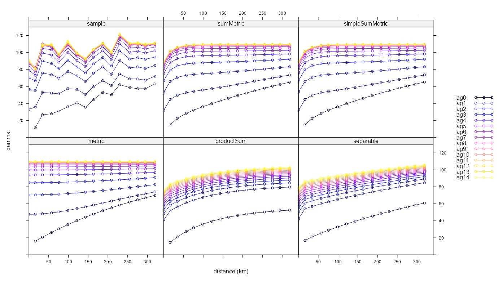{.lightbox group="krig-fitvario-ex1" width="632"}

  ``` r
  best_mod_fits_all <- list(fit_vario_sm, best_ssm) |> append(best_mod_fits$fit_stv)

  plot(vario_emp,
       best_mod_fits_all,
       map = FALSE,
       all = TRUE)
  ```

  - These multi-line plots confirm visually what we gleaned from the SSE scores — that the Sum-Metric and Simple Sum Metric are a better fit for empirical variogram (sample) than the other models.
  - Of the 3 diagnostic plots, I find this one to be the easiest to interpret. Even with the noisiness of the sample variogram, the trends and shapes of the curves are pretty obvious.

  ###### Heatmap

  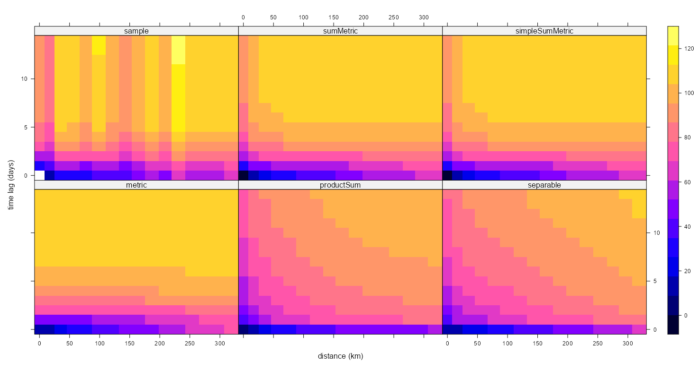{.lightbox group="krig-fitvario-ex1" width="632"}

  ``` r
  plot(vario_emp,
       best_mod_fits_all,
       map = TRUE,
       all = TRUE)
  ```

  - I think the noise (out of place columns) of the empircal variogram (sample) makes this a little more difficult to interpret, but it's still pretty clear (once you ignore the noise) that the Sum-Metric and Simple Sum Metric are the better fits.

  ###### Surface

  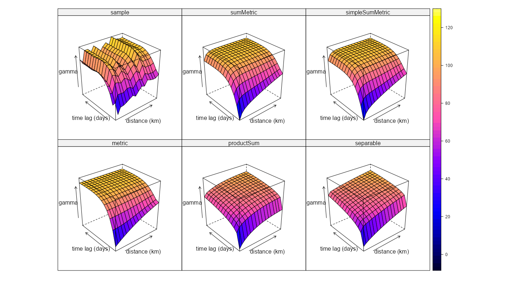{.lightbox group="krig-fitvario-ex1" width="632"}

  ``` r
  plot(vario_emp,
       best_mod_fits_all,
       map = FALSE,
       wireframe = TRUE,
       all = TRUE)
  ```

  - If I had to choose the best fitting model based on this visual, I'd be in trouble.
  - Maybe the extra pinkish coloring of the inner layers of the Product-Sum and Separable might be enough for the discerning user to disqualify those models, but that's tough to make out.
  - It's a 3-D surface, which is cool, but in terms of model selection, it's not much help.
    - Maybe if it were interactive and we were able to rotate the visual it would make it more useful. (hint, hint, wink)

  ## ggplot2 and plotly

  These are [{ggplot2}]{style="color: #990000"} and [{plotly}]{style="color: #990000"} recreations of the [{lattice}]{style="color: #990000"} plots of the previous tab, so I'm not repeating the interpretations

  Note that the code for the [{plotly}]{style="color: #990000"} surface plot produces an interactive plot, and when one subplot is rotated, the others match its rotation.

  ###### Data Processing

  ``` r
  # process empirical variogram df
  tib_vario_emp <- vario_emp |> 
    mutate(
      timelag = as.numeric(timelag),
      # makes sure gamma calc below doesn't divide by 0
      avgDist = ifelse(
        avgDist == 0 & timelag == 0,
        sqrt(.Machine$double.eps),
        avgDist)
    )


  # calc each model's gamma estimates
  tib_vario_mods_gamma <- purrr::map2(
    best_mod_fits_all,
    model_names,
    \(mod, mod_name) {
      mod_gamma <- variogramSurface(
        model = mod,
        dist_grid = data.frame(
          spacelag = tib_vario_emp$avgDist,
          timelag = tib_vario_emp$timelag
        )
      )$gamma
      tibble(
        model = mod_name,
        gamma = mod_gamma,
        avgDist = tib_vario_emp$avgDist,
        timelag = tib_vario_emp$timelag
      )
    }
  ) |> 
    purrr::list_rbind()

  # combine tibbles; make legend labels
  tib_plot <- tib_vario_emp |> 
    mutate(model = "Observed") |> 
    select(model, gamma, avgDist, timelag) |> 
    bind_rows(tib_vario_mods_gamma) |> 
    filter_out(is.na(gamma)) |> 
    mutate(
      lag_label = factor(
        paste0("lag", timelag), 
        # minus 1 to get lag0
        levels = paste0("lag", 0:length(unique(tib_vario_emp$timelag))-1)),
      model = factor(model, levels = c("Observed", model_names))
    )  

  # named list for colors
  lag_colors <- setNames(
    rev(scico::scico(length(unique(tib_plot$timelag)), palette = "glasgow")),
    paste0("lag", 0:(length(unique(tib_plot$timelag))-1))
  )
  ```

  - For purely spatial variogram models, `variogramLine` is used, but for spatio-temporal variogram models, `variogramSurface` is used to get the gamma (semi-variance) estimates.
  - [avgDist]{.var-text} is the median(?) pairwise distance value for each bin of the variogram and it'll be used for the x-axis of these plots.

  ###### Multi-Line

  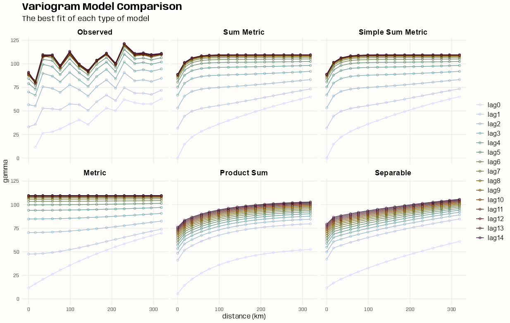{.lightbox group="krig-fitvario-ex1" width="632"}

  <Details>

  <Summary>Code</Summary>

  ``` r
  ggplot(tib_plot, 
         aes(x = avgDist, 
             y = gamma,
             group = lag_label, 
             color = lag_label
         )) +
    geom_line() +
    geom_point(shape = 1, size = 1.5) +
    scale_color_manual(values = lag_colors, name = NULL) +
    facet_wrap(~ model, nrow = 2) +
    labs(
      title = "Variogram Model Comparison",
      subtitle = "The best fit of each type of model",
      x = "distance (km)", 
      y = "gamma"
    ) +
    theme_notebook(
      strip.text = element_text(
        size = 14, 
        face = "bold", 
        color = "black"
      ),
      legend.text = element_text(size = 12)
    )
  ```

  </Details>

  ###### Heatmap

  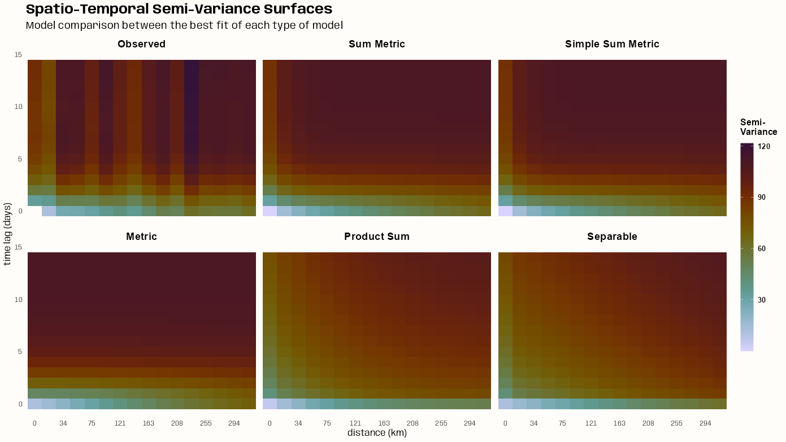{.lightbox group="krig-fitvario-ex1" width="632"}

  <Details>

  <Summary>Code</Summary>

  ``` r
  # observed noisy, metric abrupt temporally, prod/sep gradual in space and time
  ggplot(tib_plot, aes(x = factor(floor(avgDist)), y = timelag, fill = gamma)) +
    geom_tile() +
    scale_fill_gradientn(
      colors = rev(scico::scico(100, palette = "glasgow")),
      na.value = "white"
    ) +
    scale_x_discrete(
      # skips every other value to prevent overlap of the labels
      breaks = function(x) x[seq(1, length(x), by = 2)]
    ) +
    facet_wrap(~ model, nrow = 2) +
    labs(
      title = "Spatio-Temporal Semi-Variance Surfaces",
      subtitle = "Model comparison between the best fit of each type of model",
      x = "distance (km)",
      y = "time lag (days)",
      fill = "Semi-\nVariance"
    ) +
    theme_notebook(
      strip.background = element_blank(),
      strip.text = element_text(
        size = 14, 
        face = "bold", 
        color = "black"
      ),
      panel.grid = element_blank(),
      legend.key.height = unit(1.95, "cm"),
      legend.text = element_text(
        size = 10, 
        face = "bold"
      ),
      legend.title = element_text(
        size = 12,
        face = "bold",
        margin = margin(b = 10)
      )
    )
  ```

  </Details>

  ###### Surface

  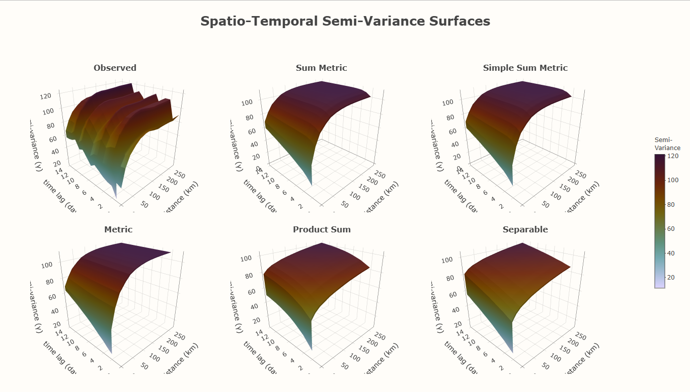{.lightbox group="krig-fitvario-ex1" width="632"}

  <Details>

  <Summary>Code</Summary>

  ``` r
  model_levels <- c("Observed", model_names)

  # z-coordinate requires a matrix
  make_surface_matrix <- function(data, mod_name) {
    data |>
      filter(model == mod_name) |>
      select(avgDist, timelag, gamma) |>
      arrange(timelag, avgDist) |>
      tidyr::pivot_wider(names_from = timelag, values_from = gamma) |>
      arrange(avgDist) |>
      select(-avgDist) |>
      as.matrix()
  }

  # requires unique, sorted axis values
  x_vals <- sort(unique(tib_plot$avgDist))
  y_vals <- sort(unique(tib_plot$timelag))


  glasgow_colors <- rev(scico::scico(10, palette = "glasgow"))
  colorscale <- purrr::map2(
    seq(0, 1, length.out = 10),
    glasgow_colors,
    \(stop, color) list(stop, color)
  )


  make_surface_plot <- function(mod_name, scene_id) {
    # surface requires a matrix in z direction
    z_mat <- make_surface_matrix(tib_plot, mod_name)

    # legend
    colorbar_settings <- list(
      title = list(
        text = "Semi-<br>Variance",
        font = list(size = 12)
      ),
      # positioning
      x = 1.02,
      xanchor = "left", # position using left side of legend
      y = 0.5,
      yanchor = "middle", # position using middle of legend
      len = 0.5,
      thickness = 20,
      bgcolor = '#FFFDF9FF',
      bordercolor = '#FFFDF9FF'
    )

    plot_ly(
      x = x_vals,
      y = y_vals,
      z = z_mat,
      type = "surface",
      colorscale = colorscale,
      # only need a colorbar for one plot
      showscale = mod_name == "Observed",
      # plot id
      scene = scene_id,
      colorbar = if(mod_name == "Observed") colorbar_settings else NULL,
      # tooltip
      hovertemplate = paste(
        "<b>distance</b>: %{x:.1f} km<br>",
        "<b>time lag</b>: %{y:.0f} days<br>",
        "<b>semi-variance</b>: %{z:.2f}<br>",
        "<extra></extra>"
      )
    )
  }

  # plotly requires the first scene to be exactly labelled "scene"
  scene_ids <- c("scene", paste0("scene", 2:6))
  plots <- purrr::map2(
    model_levels, 
    scene_ids, 
    make_surface_plot
  )

  # set initial plot orientation
  shared_camera <- list(
    eye = list(x = -1.5, y = -1.5, z = 1.0)
  )

  # subplot styling
  scene_layout_init <- purrr::map(
    scene_ids, 
    \(sid) {
      list(
        camera = shared_camera,
        xaxis = list(title = list(text = "distance (km)")),
        yaxis = list(title = list(text = "time lag (days)")),
        zaxis = list(title = list(text = "semi-variance (γ)")),
        bgcolor = '#FFFDF9FF'
      )
  }) |>
    setNames(scene_ids)

  # subplot positioning
  domains <- list(
    list(x = c(0.00, 0.30), y = c(0.50, 1.00)),
    list(x = c(0.33, 0.63), y = c(0.50, 1.00)),
    list(x = c(0.66, 0.96), y = c(0.50, 1.00)),
    list(x = c(0.00, 0.30), y = c(0.00, 0.50)),
    list(x = c(0.33, 0.63), y = c(0.00, 0.50)),
    list(x = c(0.66, 0.96), y = c(0.00, 0.50))
  )

  # add domain positions to the scenes
  scene_layout_fin <- purrr::map2(
    scene_layout_init, 
    domains,
    \(l, d) {
      l$domain <- d
      l
    })

  # Set title positions for subplots
  title_positions <- list(
    # Top row (y = 0.95)
    list(x = 0.14, y = 0.93),  # Column 1
    list(x = 0.48, y = 0.93),  # Column 2
    list(x = 0.815,  y = 0.93),  # Column 3
    # Bottom row (y = 0.45)
    list(x = 0.145, y = 0.43),
    list(x = 0.48, y = 0.43),
    list(x = 0.815, y = 0.43)
  )

  # titles for subplots
  annotations_list <- purrr::map2(
    model_levels, 
    title_positions, 
    function(name, pos) {
      list(
        text = paste0("<b>", name, "</b>"),
        x = pos$x, 
        y = pos$y,
        xref = "paper",      # Using paper coordinates sets coordinate range from 0 to 1 across figure
        yref = "paper",      
        showarrow = FALSE,
        font = list(size = 16),
        xanchor = "center",
        yanchor = "bottom"
      )
  })

  # Build visual
  fig <- subplot(plots, nrows = 2) |>
    layout(
      title = list(
        text = "<b>Spatio-Temporal Semi-Variance Surfaces</b>",
        font = list(size = 25)
      ),
      margin = list(
        t = 100  # Increase top margin to stop title being cutoff
      ),
      paper_bgcolor  = '#FFFDF9FF',
      plot_bgcolor = '#FFFDF9FF',
      annotations = annotations_list,
      autosize = TRUE,
      scene = scene_layout_fin$scene,
      scene2 = scene_layout_fin$scene2,
      scene3 = scene_layout_fin$scene3,
      scene4 = scene_layout_fin$scene4,
      scene5 = scene_layout_fin$scene5,
      scene6 = scene_layout_fin$scene6
    ) |> 
    config(scrollZoom = FALSE) # sync for zoom is really buggy

  # sync subplots with JS
  fig_synced <- fig |>
    htmlwidgets::onRender("
      function(el, x) {
        var scenes = ['scene', 'scene2', 'scene3', 'scene4', 'scene5', 'scene6'];
        var syncing = false;

        el.on('plotly_relayout', function(eventData) {
          if (syncing) return;

          var triggerScene = null;
          var newCamera = null;

          scenes.forEach(function(scene) {
            var key = scene + '.camera';
            if (eventData[key] !== undefined) {
              triggerScene = scene;
              newCamera = eventData[key];
            }
          });

          if (triggerScene === null || newCamera === null) return;

          var update = {};
          scenes.forEach(function(scene) {
            if (scene !== triggerScene) {
              update[scene + '.camera'] = newCamera;
            }
          });

          syncing = true;
          Plotly.relayout(el, update).then(function() {
            syncing = false;
          });
        });
      }
    ")


  fig_synced
  ```

  - Holy crap is it complicated to build a multi-plot layout in plotly. FFS.
  - Most text stylings don't work and plotly has abandoned it's R version. Supposedly Posit is going to take it over though. (info from plotly R issue in Dec 2025 I think)
  - The sync is a little delayed, but that's the best that can be done with plotly's api according to Claude

  </Details>
  :::

### Interpolate {#sec-geo-sptemp-krig-inter .unnumbered}

- A joint distance is formulated in the same manner as the metric covariance model, and then used to find a subset of data with k-NN for a prediction location. The interpolation performs iteratively for each spatiotemporal prediction location with that local subset of data.
  - Other methods (staged search) and (octant search) are briefly described in the vignette but not implemented in [{gstat}]{style="color: #990000"}
- No parallel option!
- `krigeST(formula, data, modelList, newdata)`
  - [data]{.arg-text} - Original dataset (used to fit `variogramST`)
    - From docs, "ST object: should contain the dependent variable and independent variables."
  - [modelList]{.arg-text} - Object returned from `fit.StVariogram`
  - [newdata]{.arg-text} - An ST object with prediction/simulation locations in space and time
    - Should contain attribute columns with the independent variables (if present).
    - From docs, "ST object with prediction/simulation locations in space and time; should contain attribute columns with the independent variables (if present)."
  - [computeVar = TRUE]{.arg-text} - Returns prediction variances
    - [fullCovariance = TRUE]{.arg-text} - Returns the full covariance matrix
  - [bufferNmax = 1]{.arg-text} (default) - Used to increase the search radius for neighbors (e.g. 2 would be double the default radius.)
    - A larger neighbourhood is evaluated within the covariance model and the strongest correlated [nmax]{.arg-text} neighbours are selected
    - If the prediction variances are large, then this parameter should help by gathering more data points.
  - [nmax]{.arg-text} - The maximum number of neighboring locations for a spatio-temporal local neighbourhood
  - [stAni]{.arg-text} - Only needs to be set if the provided variogram model doesn't include a [stAni]{.arg-text} parameter (Seperable and Product-Sum)
  - **Regarding the [data]{.arg-text} and [newdata]{.arg-text} objects**
    - BOTH must be same class — e.g. both must be [STFDF]{.arg-text} objects or both must be [{stars}]{style="color: #990000"} objects
    - BOTH objects' time components must be the same class — e.g. both must be a [Date]{.arg-text} class or both must be [POSIXct]{.arg-text} class
- [Prediction Grids]{.underline} (i.e. [newdata]{.arg-text} input)
  - [Example]{.ribbon-highlight}: DE_RB_2005 dataset from [{gstat}]{style="color: #990000"} ([github](https://github.com/r-spatial/gstat/blob/c1df8b864e96a25e2f3e24c4662884734e50d326/demo/stkrige-prediction.R#L15-L21), [vignette](https://cran.r-project.org/web/packages/gstat/vignettes/spatio-temporal-kriging.pdf))

    ``` r
    gridDE <- sp::SpatialGrid(sp::GridTopology(
      cellcentre.offset = DE_RB_2005@sp@bbox[,1] %/% 10000 * 10000, 
      cellsize = c(10000, 10000),
      # number of cells in each dimension
      cells.dim = ceiling(apply(
        DE_RB_2005@sp@bbox,
        1,
        diff
      )/10000) #  10 km × 10 km
    ))
    # projected coords
    sp::proj4string(gridDE) <- sp::CRS("+init=epsg:32632")
    # "demotes a gridded structure back to a non-structured one"
    sp::fullgrid(gridDE) <- F

    ind <- sp::over(x = gridDE, y = as(DE_NUTS1,"SpatialPolygons"))
    gridDE <- gridDE[!is.na(ind)]

    smplDays <- sort(sample(365,8)) # from stkrige.R
    DE_pred <- STF(gridDE, DE_RB_2005@time[smplDays])

    tIDS <- unique(pmax(1,pmin(as.numeric(outer(-5:5, smplDays, "+")), 365)))

    sumPred <- krigeST(
      PM10 ~ 1, 
      data=DE_RB_2005[,tIDS],
      newdata = DE_pred, 
      fitSumMetricModel, 
      nmax = 50,
      stAni = fitMetricModel$stAni/24/3600
    )
    ```

    - Creates a grid over Germany for PM10 pollution interpolation
    - [cellcentre.offset]{.arg-text}: Numeric; vector with the smallest centroid coordinates for each dimension; coordinates refer to the cell centre
    - `over`: "at the spatial locations of object x retrieves the indexes or attributes from spatial object y"
    - Only interpolates an 8 day sample

  - [Example]{.ribbon-highlight}: using mostly [{stars}]{style="color: #990000"} ([SDS, Ch 13.3](https://r-spatial.org/book/13-Geostatistics.html#a-spatiotemporal-variogram-model))

    ``` r
    crs <- st_crs('EPSG:32632')
    de <- read_sf("data/de_nuts1.gpkg") |> st_transform(crs)

    grd <- sf::st_bbox(de) |>
      st_as_stars(dx = 10000) |>
      sf::st_crop(de)

    d <- dim(grd)

    # no2.st is a stars obj
    t <- st_get_dimension_values(x = no2.st, which = 1)
    # 1080 3240 5400 7560
    t4 <- t[(1:4 - 0.5) * (3*24*30)]

    grd.st <- st_as_stars(
      pts = array(
        1, 
        c(d[1], d[2], time = length(t4))
      )
    ) |>
        st_set_dimensions("time", t4) |>
        st_set_dimensions("x", st_get_dimension_values(grd, "x")) |>
        st_set_dimensions("y", st_get_dimension_values(grd, "y")) |>
        sf::st_set_crs(crs)

    new_int <- krigeST(
      NO2~1, 
      data = no2.st["NO2"], 
      newdata = grd.st,
      nmax = 200, 
      stAni = StAni, 
      modelList = fitProdSumModel,
      progress = FALSE
    )
    names(new_int)[2] = "NO2"
    ```
- `stplot(preds)` will plot the results
- Vignette raw notes
  - we could have fitted the spatial variogram for each day separately using observations from that day only. However, given the small number of observation stations, this produced unstable variograms for several days and we decided to use the single spatial variogram derived from all spatio-temporal locations treating time slices as uncorrelated copies of the spatial random field.

    - Either add to workflow or misc in kriging

  - A temporal lag of one or a few days leads already to a large variability compared to spatial distances of few hundred kilometres, implying that the temporal correlation is too weak to considerably improve the overall prediction.

    - Think this a comment about a table of results but it refers to the empircal variogram

  - Further preprocessing steps might be necessary to improve the modelling of this PM10 data set such as for instance a temporal AR-model followed by spatio-temporal residual kriging or using further covariates in a preceding (linear) modelling step.

    - Need to research the AR model part

  - The prediction at an unobserved location with a cluster of observations at one side will be biased towards this cluster and neglect the locations towards the other directions. Similar as the quadrant search in the pure spatial case an octant wise search strategy for the local neighbourhood would solve this limitation. A simpler stepwise approach to define an n-dimensional neighbourhood might already be sufficient in which at first ns spatial neighbours and then from each spatial neighbour nt time instances are selected, such that

  - Starting values can in most cases be read from the sample variogram

    - need to see if a st empirical variogram can be plotted (or printed?) and what can actually be gleaned from it

### Examples {#sec-geo-sptemp-krig-ex .unnumbered}

- [Example 1]{.ribbon-highlight}: Cross-Validation

  ::: panel-tabset
  ## Data and Set-Up

  Cross-Validation is peformed using \[{mlr3spatiotempcv}\]{style:"color: #990000"}. The models include Random Forest, Light GBM, Catboost and krigeST.

  This is the PM10 air pollution dataset for Germany that’s from [{spacetime}]{style="color: #990000"} and used in many of my examples.

  This example is a continuation from getting starting values for the marginal components (space and time) and getting starting values for the joint components. See:

  - [EDA \>\> Temporal Depenndence](geospatial-spat-temp.qmd#sec-geo-sptemp-eda-ac){style="color: green"} \>\> Example 2
  - [EDA \>\> Spatial Dependence](geospatial-spat-temp.qmd#sec-geo-sptemp-eda-spdep){style="color: green"} \>\> Example 1
  - [Starting Values \>\> Joint Models](geospatial-spat-temp.qmd#sec-geo-sptemp-krig-stval-joint){style="color: green"} \>\> Example 1
  - [Variogram \>\> Examples](geospatial-spat-temp.qmd#sec-geo-sptemp-krig-var-ex){style="color: green"} \>\> Example 1
  - [Examples](geospatial-spat-temp.qmd#sec-geo-sptemp-krig-ex){style="color: green"} \>\> Example 2 and Example 3

  ``` r
  pacman::p_load(
    dplyr,
    futurize,
    mlr3,
    mlr3learners,
    mlr3extralearners,
    mlr3pipelines,
    mlr3spatiotempcv
  )

  requireNamespace("mlr3measures")
  # requireNamespace("xgboost", quietly = TRUE)
  source("../../temp-storage/PipeOpThinPlateSpline.R")


  set.seed(2026)
  options(scipen = 999)

  data(air, package = "spacetime")

  # get rural location time series from 2005 to 2010
  rural <- spacetime::STFDF(
    sp = stations, 
    time = dates, 
    data = data.frame(PM10 = as.vector(air))
  )
  rr <- rural[,"2005::2010"]

  # remove station ts w/all NAs
  unsel <- which(apply(
    as(rr, "xts"), 
    2, 
    function(x) all(is.na(x)))
  )
  r5to10 <- rr[-unsel,]

  sf_r5 <- r5to10 |> # STFDF object
    stars::st_as_stars() |> 
    sf::st_as_sf(long = TRUE) |> 
    rename(geometry = sfc)

  tib_stations <- as_tibble(stations@coords) |> 
    mutate(station_id = rownames(stations@coords))

  sf_stations <- sf::st_as_sf(
    tib_stations,
    coords = c("coords.x1", "coords.x2"),
    crs = sf::st_crs(sf_r5)
  )

  sf_pm10 <- sf_r5 |> 
    sf::st_join(sf_stations) |> 
    sf::st_transform(crs = 25832) |> # projected, UTM zone 32N
    filter(!is.na(PM10)) |> 
    rename(date = time, pm10 = PM10)


  tib_pm10 <- sf_pm10 |> 
    sf::st_drop_geometry() |> 
    mutate(
      date_feat = date, # extra for feat eng
      X = sf::st_coordinates(sf_pm10)[, 1],
      Y = sf::st_coordinates(sf_pm10)[, 2]
    )
  ```

  - Thoughts

  ## [{mlr3}]{style="color: #990000"}

  words

  ###### Task

  ``` r
  task_st_pm10 <- as_task_regr_st(
    tib_pm10,
    target = "pm10",
    coordinate_names = c("X", "Y"),
    coords_as_features = TRUE,
    id = "pm10_st"
  )


  # set space and time roles for sptcv_cstf
  task_st_pm10$set_col_roles("station_id", roles = "space")
  task_st_pm10$set_col_roles("date",       roles = "time")

  # task_st_pm10$feature_names
  ```

  - Thoughts

  ###### Pipe Ops

  ``` r
  path_spline <- po("scalerange", id = "spl_scalerang", affect_columns = selector_name(c("X", "Y"))) %>>% 
    po("thin_plate_spline", id = "spl_tp", coords = c("X", "Y"), k = 10L) %>>%   
    # removing "date_feat" has to be done here
    po("select", id = "spl_rm_feat", selector = selector_invert(selector_name("date_feat")))

  # po("datefeatures") autoselects feat w/Date or POSIXct class but I'd rather be explicit
  # po("datefeatures"): hms features automatically skipped for a Date class col
  # believe this could've been done outside of mlr since no leakage risk
  path_date <- po("select", id = "date_sel_feat", selector = selector_name("date_feat")) %>>%
    po("datefeatures", id = "date_feat") %>>%
    # xgb hates integers
    po("mutate", mutation = list(
      date_feat.year = ~ as.numeric(date_feat.year),
      date_feat.month = ~ as.numeric(date_feat.month),
      date_feat.quarter = ~ as.numeric(date_feat.quarter),
      date_feat.week_of_year = ~ as.numeric(date_feat.week_of_year),
      date_feat.day_of_year = ~ as.numeric(date_feat.day_of_year),
      date_feat.day_of_month = ~ as.numeric(date_feat.day_of_month),
      date_feat.day_of_week = ~ as.numeric(date_feat.day_of_week)
    ))

  # gr$plot(horizontal = TRUE)

  result_spl <- path_spline$train(task_st_pm10)
  result_date <- path_date$train(task_st_pm10)

  result_spl[[1]]$data()[1:3]
  #>      pm10   spline_1  spline_2  spline_3  spline_4   spline_5   spline_6  spline_7    spline_8 spline_9
  #>     <num>      <num>     <num>     <num>     <num>      <num>      <num>     <num>       <num>    <num>
  #> 1: 16.696 -0.7845660 1.0161461 0.5642808 0.7840572 -0.5688355 -0.7853558 0.7391472 -0.16817003 1.317808
  #> 2: 31.667 -0.8604533 0.8683869 0.6483173 0.6173459 -0.6283766 -0.8058987 0.6285879 -0.12413108 1.234869
  #> 3: 22.450 -0.5593611 1.5303593 0.7460287 1.0285107 -0.9101423 -0.4846120 0.9965906 -0.08220771 1.547379

  result_date[[1]]$data()[1:3]
  #>      pm10 date_feat.year date_feat.month date_feat.quarter date_feat.week_of_year date_feat.day_of_year
  #>     <num>          <num>           <num>             <num>                  <num>                 <num>
  #> 1: 16.696           2005               1                 1                     53                     1
  #> 2: 31.667           2005               1                 1                     53                     1
  #> 3: 22.450           2005               1                 1                     53                     1
  #>    date_feat.day_of_month date_feat.day_of_week
  #>                     <num>                 <num>
  #> 1:                      1                     7
  #> 2:                      1                     7
  #> 3:                      1                     7
  ```

  - Thoughts

  ###### Graph

  ``` r
  learner_rf <- lrn(
    "regr.ranger",
    num.trees  = 1000
  )
  # learner_xgb <- lrn("regr.xgboost")
  learner_lgbm <- lrn("regr.lightgbm")
  learner_cat <- lrn("regr.catboost")


  gr_rf <- gunion(list(path_date, path_spline)) %>>% 
    po("featureunion") %>>% 
    learner_rf

  # gr_xgb <- gunion(list(path_date, path_spline)) %>>%
  #   po("featureunion") %>>%
  #   learner_xgb
  # Error: 'xgb.params' is not an exported object from 'namespace:xgboost'
  # This happened in PipeOp regr.xgboost's $train()

  gr_lgbm <- gunion(list(path_date, path_spline)) %>>% 
    po("featureunion") %>>% 
    learner_lgbm
  gr_cat <- gunion(list(path_date, path_spline)) %>>% 
    po("featureunion") %>>%   
    learner_cat

  gr_rf$plot(horizontal = TRUE)
  ```

  - Thoughts

  ###### Run CV

  ``` r
  learners_pm10 <- list(
    glrn_rf = as_learner(gr_rf),
    # glrn_xgb = as_learner(gr_xgb),
    glrn_lgbm = as_learner(gr_lgbm),
    glrn_cat = as_learner(gr_cat)
  )

  # set up resampling
  rcv_st_pm10 <- rsmp(
    "repeated_sptcv_cstf", 
    folds = 5, 
    repeats = 3
  )

  # needed so kriging can train on the same indices
  # rcv_st_pm10$instantiate(task_st_pm10)

  design_pm10 <- benchmark_grid(
    tasks = task_st_pm10,
    learners = learners_pm10,
    resamplings = rcv_st_pm10
  )

  mirai::daemons(
    10L, 
    .compute = "mlr3_parallelization", 
    seed = 2026L, 
    output = TRUE
  )

  tictoc::tic()
  # ~ 3.63 min for rf, lgbm, cat
  bmr_pm10 <- benchmark(design_pm10)
  tictoc::toc()

  mirai::daemons(0)

  bmr_pm10$aggregate(msr("regr.rmse")) |> 
    select(learner_id, resampling_id, regr.rmse) |> 
    mutate(learner_id = stringr::str_extract(learner_id, "regr\\.(\\w)*"))

  (cat_fold_scores <- bmr_pm10$score(msr("regr.rmse")) |> 
    select(iteration, regr.rmse) |> 
    slice(31:45))
  #>     iteration regr.rmse
  #>         <int>     <num>
  #>  1:         1  8.665232
  #>  2:         2  9.461272
  #>  3:         3  9.758544
  #>  4:         4  8.494960
  #>  5:         5 10.718390
  #>  6:         6  8.562439
  #>  7:         7  8.269326
  #>  8:         8 10.400065
  #>  9:         9  8.979645
  #> 10:        10  9.519779
  #> 11:        11  8.797159
  #> 12:        12  8.660889
  #> 13:        13  9.049979
  #> 14:        14 11.038864
  #> 15:        15  8.813295

  sd(cat_fold_scores$regr.rmse)
  #> [1] 0.8554204

  lrn_cat <- as_learner(gr_cat)
  lrn_cat_final <- lrn_cat$train(task_st_pm10)

  # currently there is no initial split, so held-out test set to create a final model on.
  # predict in-sample (entire dataset) instead
  preds_final <- lrn_cat_final$predict(task_st_pm10)
  # substantially better than the cv score
  preds_final$score(msr("regr.rmse"))
  #> regr.rmse 
  #>    6.2681
  ```

  - Thoughts

  ## krigeST

  words

  ###### CV Function

  ``` r
  fit_vario_sm <- readr::read_rds("../../temp-storage/gstat-vig9-sm-mod.rds")
  rcv_st_pm10 <- readr::read_rds("../../temp-storage/gstat-vig-krig1-mlr-rcv.rds")

  run_krigeST_fold <- function(
      fold_idx, 
      cv_folds, 
      sf_dat,
      vario_mod, 
      nmax, 
      bufferNmax) {

    # get train and test row indices from mlr3 resampling
    train_idx <- cv_folds$train_set(fold_idx)
    test_idx  <- cv_folds$test_set(fold_idx)

    # subset sf_p10 to train and test
    sf_train <- sf_dat[train_idx, ]
    sf_test  <- sf_dat[test_idx, ]

    # build SpatialPoints for train
    sp_train <- SpatialPoints(
      coords = st_coordinates(sf_train),
      proj4string = CRS("EPSG:25832")
    )

    # build SpatialPoints for test
    sp_test <- SpatialPoints(
      coords = st_coordinates(sf_test),
      proj4string = CRS("EPSG:25832")
    )

    # build STIDF for training data
    stidf_train <- STIDF(
      sp = sp_train,
      time = as.POSIXct(sf_train$date),
      data = data.frame(pm10 = sf_train$pm10)
    )

    # build STIDF for test locations 
    # where pm10 = NA, these are prediction targets
    stidf_test <- STIDF(
      sp = sp_test,
      time = as.POSIXct(sf_test$date),
      data = data.frame(pm10 = rep(NA_real_, nrow(sf_test)))
    )

    krige_pred <- tryCatch({
      krigeST(
        pm10 ~ 1,
        data = stidf_train,
        newdata = stidf_test,
        modelList = vario_mod,
        nmax = nmax,
        bufferNmax = bufferNmax,
        computeVar = TRUE
      )
    }, error = \(e) {
      message("Fold ", fold_idx, " failed: ", e$message)
      return(NULL)
    })

    if (is.null(krige_pred)) return(NULL)

    tibble(
      fold = fold_idx,
      nmax = nmax,
      bufferNmax = bufferNmax,
      station_id = sf_test$station_id,
      date = sf_test$date,
      observed = sf_test$pm10,
      predicted = krige_pred@data$var1.pred,
      pred_var = krige_pred@data$var1.var
    )
  }
  ```

  - Thoughts

  ###### Run CV

  ``` r
  # 90 models
  krig_grid <- expand.grid(
    fold_idx = 1:15,
    nmax = c(10, 15, 20), # only 53 locations
    bufferNmax = c(1, 2) #
  ) |> 
    mutate(
      cv_folds = list(rcv_st_pm10),
      sf_dat = list(sf_pm10),
      vario_mod = list(fit_vario_sm)
    )

  plan(future.mirai::mirai_multisession, workers = 12L)

  tictoc::tic()
  # run CV across all folds
  # 11395.29 sec or 3.15 hrs with 12 workers
  tib_res_cv_krige <- purrr::pmap(
    krig_grid,
    run_krigeST_fold
  ) |>
    futurize() |>
    purrr::list_rbind()
  tictoc::toc()

  mirai::daemons(0)

  # 4 models w/lowest RMSE, but (15, 2) with lowest bias (neg or pos)
  tib_res_cv_krige |>
    summarize(
      RMSE = sqrt(mean((observed - predicted)^2, na.rm = TRUE)),
      ME   = mean(observed - predicted, na.rm = TRUE),
      .by = c(nmax, bufferNmax)
    ) |> 
    arrange(RMSE)
  #> # A tibble: 6 × 4
  #>    nmax bufferNmax  RMSE     ME
  #>   <dbl>      <dbl> <dbl>  <dbl>
  #> 1    10          1  10.1 -0.193
  #> 2    10          2  10.1 -0.187
  #> 3    15          1  10.1 -0.194
  #> 4    15          2  10.1 -0.140
  #> 5    20          2  10.3 -0.220
  #> 6    20          1  10.3 -0.235


  # the (15, 2) model doesn't show any erratic scores in the folds
  # everything between 9 and 11
  tib_res_cv_krige |>
    filter(
      nmax == 15,
      bufferNmax == 2
    ) |>
    summarize(
      RMSE = sqrt(mean((observed - predicted)^2, na.rm = TRUE)),
      ME   = mean(observed - predicted, na.rm = TRUE),
      .by = fold
    )
  #> # A tibble: 15 × 3
  #>     fold  RMSE       ME
  #>    <int> <dbl>    <dbl>
  #>  1     1 10.2  -1.10   
  #>  2     2  9.40 -0.268  
  #>  3     3 10.4  -0.578  
  #>  4     4 11.1   1.08   
  #>  5     5  9.42 -0.798  
  #>  6     6 10.1  -0.669  
  #>  7     7  9.35  0.308  
  #>  8     8  9.57  0.969  
  #>  9     9 11.6  -0.00601
  #> 10    10  9.55  0.668  
  #> 11    11 10.8   1.02   
  #> 12    12  9.79 -1.64   
  #> 13    13  9.68 -0.554  
  #> 14    14 11.0   0.901  
  #> 15    15 10.1  -1.17  
  ```

  - Thoughts
  :::

- [Example 2]{.ribbon-highlight}: Diagnostics

  ::: panel-tabset
  ## Data and Set-Up

  Diagnostics are peformed on the cross-validation results of Catboost and Ordiary Kriging models

  This is the PM10 air pollution dataset for Germany that’s from [{spacetime}]{style="color: #990000"} and used in many of my examples.

  This example is a continuation from getting starting values for the marginal components (space and time) and getting starting values for the joint components. See:

  - [EDA \>\> Temporal Depenndence](geospatial-spat-temp.qmd#sec-geo-sptemp-eda-ac){style="color: green"} \>\> Example 2
  - [EDA \>\> Spatial Dependence](geospatial-spat-temp.qmd#sec-geo-sptemp-eda-spdep){style="color: green"} \>\> Example 1
  - [Starting Values \>\> Joint Models](geospatial-spat-temp.qmd#sec-geo-sptemp-krig-stval-joint){style="color: green"} \>\> Example 1
  - [Variogram \>\> Examples](geospatial-spat-temp.qmd#sec-geo-sptemp-krig-var-ex){style="color: green"} \>\> Example 1
  - [Examples](geospatial-spat-temp.qmd#sec-geo-sptemp-krig-ex){style="color: green"} \>\> Example 1 and Example 3

  ``` r
  pacman::p_load(
    dplyr,
    ggplot2,
    ggdist,
    DALEX,
    DALEXtra
  )

  cv_cat_pm10 <- readr::read_rds("../../temp-storage/gstat-vig-krig1-mlr-cv-rf-cat-lgbm.rds")
  tib_res_cv_krige <- readr::read_rds("../../temp-storage/gstat-vig-krig1-krig.rds")

  tib_res_cv_krige_fin <- tib_res_cv_krige |> 
    filter(
      nmax == 15,
      bufferNmax == 2
    )

  set.seed(2026)
  options(scipen = 999)
  notebook_colors <- unname(swatches::read_ase(here::here("palettes/Forest Floor.ase")))

  # ---- Prepare CV Results ----

  tib_sf_pm10_ids <- sf_pm10 |>
    sf::st_drop_geometry() |>
    mutate(row_id = row_number()) |>
    select(row_id, station_id, date)


  cat_cv_results <- purrr::map(1:15, \(i) {
    pred <- cv_cat_pm10$resample_result(3)$predictions()[[i]]
    tibble(
      fold = i,
      row_id = pred$row_ids,
      observed = pred$truth,
      predicted = pred$response
    )
  }) |>
    purrr::list_rbind() |>
    left_join(tib_sf_pm10_ids, by = "row_id") |> 
    # averages predictions by location and data across all test folds and repeats
    summarize(
      predicted = mean(predicted, na.rm = TRUE),
      observed = first(observed),
      .by = c(station_id, date)
    ) |>
    mutate(
      residual = observed - predicted,
      model = "Catboost"
    )


  # each model's results have 36402 out of 74799 observations covered (~49%) after 3 repeats × 5 folds = 15 folds is actually consistent with that coverage rate (15 × ~4% ≈ 60%, minus overlaps between folds reducing it to ~49%).
  cv_combined <- tib_res_cv_krige_fin |>
    summarize(
      predicted = mean(predicted, na.rm = TRUE),
      pred_var = mean(pred_var, na.rm = TRUE),
      observed = first(observed),
      .by = c(station_id, date)
    ) |>
    mutate(
      residual = observed - predicted,
      model = "krigeST"
    ) |> 
    bind_rows(cat_cv_results) |>
    mutate(
      model = factor(model, levels = c("krigeST", "Catboost")),
      month = lubridate::month(date),
      season = case_when(
        month %in% c(12, 1, 2) ~ "DJF",
        month %in% c(3, 4, 5) ~ "MAM",
        month %in% c(6, 7, 8) ~ "JJA",
        month %in% c(9, 10, 11) ~ "SON"
      ) |>
        factor(levels = c("DJF", "MAM", "JJA", "SON"))
    )
  ```

  - Thoughts

  ## Residuals

  ###### Distribution

  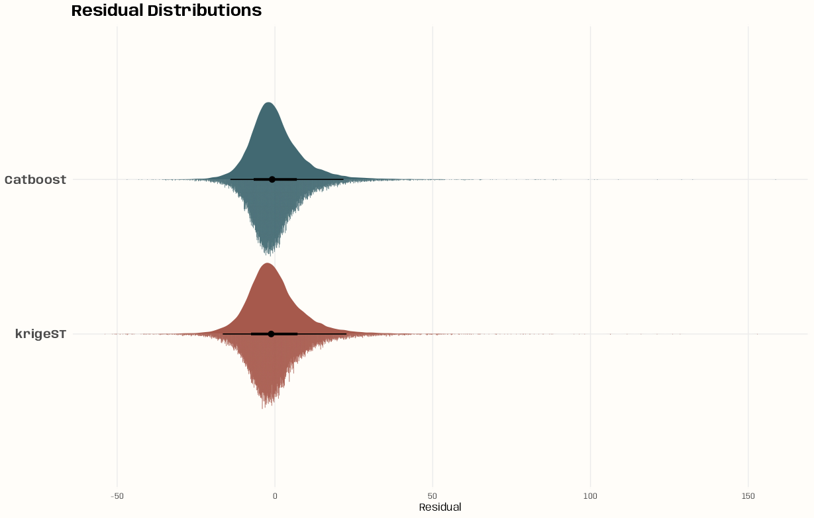{.lightbox width="582"}

  <Details>

  <Summary>Code</Summary>

  ``` r

  p_resid_dist <- cv_combined |> 
    ggplot(
      aes(y = model, 
          x = residual,
          fill = model)
    ) +
    # density
    stat_slab(
      aes(thickness = after_stat(pdf*n)), 
      scale = 0.5) +
    # histogram
    stat_dotsinterval(
      side = "bottom", 
      scale = 0.5, 
      slab_linewidth = NA) + # not sure why, setting to NA applies proper color to dots
    scale_fill_manual(values = c(notebook_colors[[5]], notebook_colors[[6]])) +
    labs(title = "Residual Distributions") +
    xlab("Residual") +
    guides(fill = "none") +
    theme_notebook(
      axis.title.y = element_blank(),
      axis.text.y = element_text(size = 14, face = "bold"),
      panel.border = element_rect(color = "#FFFDF9FF", 
                                  fill = "#FFFDF9FF", 
                                  linewidth = 1.5))
  ```

  </Details>

  - Thoughts

  ###### Q-Q

  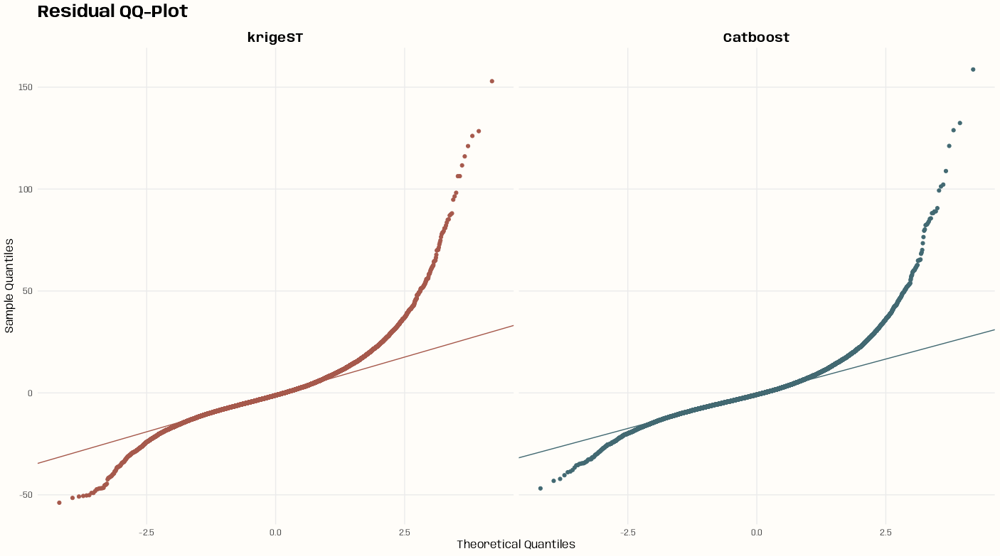{.lightbox width="582"}

  <Details>

  <Summary>Code</Summary>

  ``` r
  p_qq <- cv_combined |>
    ggplot(aes(sample = residual, color = model)) +
    stat_qq() +
    stat_qq_line() +
    scale_color_manual(
      values = c(notebook_colors[[5]], notebook_colors[[6]])
    ) +
    facet_wrap(~model) +
    labs(
      title = "Residual QQ-Plot",
      x = "Theoretical Quantiles",
      y = "Sample Quantiles"
    ) +
    theme_notebook(legend.position = "none")
  ```

  </Details>

  - Thoughts

  ###### Residuals vs. Predicted

  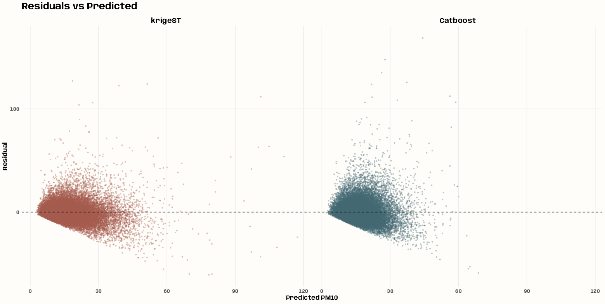{.lightbox width="582"}

  <Details>

  <Summary>Code</Summary>

  ``` r
  p_resid_pred <- cv_combined |>
    ggplot(
      aes(x = predicted, 
          y = residual, 
          color = model)
    ) +
    geom_point(alpha = 0.3, size = 0.8) +
    geom_hline(yintercept = 0, linetype = "dashed") +
    scale_color_manual(
      values = c(notebook_colors[[5]], notebook_colors[[6]])
    ) +
    facet_wrap(~model) +
    labs(
      title = "Residuals vs Predicted",
      x = "Predicted PM10",
      y = "Residual"
    ) +
    theme_notebook(legend.position = "none")
  ```

  </Details>

  - Thoughts

  ###### Residual Variograms

  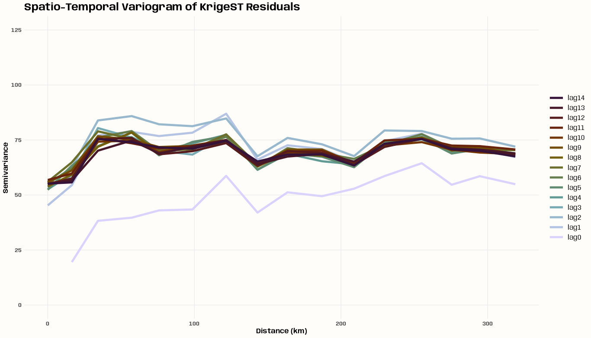{.lightbox width="382"}\
  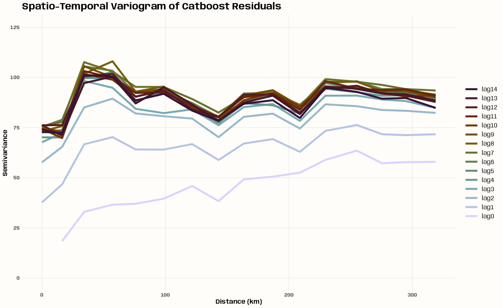{.lightbox width="382"}

  <Details>

  <Summary>Code</Summary>

  ``` r
  # creating a full grid (STFDF)
  cv_dates <- cv_combined |> 
    select(date) |> 
    distinct() |> 
    summarize(
      min_date = min(date),
      max_date = max(date)
    )

  cv_dates_full <- tibble(
    date = seq(
      cv_dates$min_date[[1]], 
      cv_dates$max_date[[1]], 
      by = "day"
    )
  )


  # -------------- krigeST --------------


  cv_combined_full <- cv_combined |> 
    filter(model == "krigeST") |> 
    select(date, station_id, residual) |> 
    group_split(station_id) |> 
    purrr::map(\(x) {
      current_station <- x |> 
        select(station_id) |> 
        pull(station_id) |> 
        first()
      cv_combined_full_station <- cv_dates_full |> 
        left_join(x, by = "date") |> 
        mutate(station_id = ifelse(is.na(station_id), current_station, station_id))
    }
    ) |> 
    purrr::list_rbind() |> 
    arrange(date)

  cv_coords_full <- cv_combined_full |> 
    slice_min(date) |> 
    select(station_id) |> 
    left_join(tib_station_coords_ll, by = "station_id") |> 
    tibble::column_to_rownames("station_id") |> 
    as.matrix(rownames.force = TRUE)

  stfdf_resid <- spacetime::STFDF(
    sp = sp::SpatialPoints(
      coords = cv_coords_full,
      proj4string = sp::CRS("+proj=longlat +datum=WGS84 +no_defs")
    ),                                                      # 53 stations (rows of coords)
    time = as.POSIXct(cv_dates_full$date),                  # 1826 dates
    data = data.frame(residual = cv_combined_full$residual) # 96778 observations = 53 * 1826
  )

  # w/na.omit = TRUE you get an identical plot
  vario_resid <- gstat::variogramST(
    residual ~ 1,
    data = stfdf_resid,
    tlags = 0:14
  )


  tib_resid_vario <- vario_resid |>
    filter(!is.na(gamma)) |>
    mutate(
      timelag_num = as.numeric(timelag),
      lag_label = factor(
        paste0("lag", timelag_num),
        levels = paste0("lag", 0:(length(unique(as.numeric(timelag))) - 1))
      )
    )

  # named list for colors
  lag_colors <- setNames(
    rev(scico::scico(length(unique(tib_resid_vario$timelag)), palette = "glasgow")),
    paste0("lag", 0:(length(unique(tib_resid_vario$timelag))-1))
  )

  p_resid_vario <- tib_resid_vario |>
    ggplot(aes(
      x = avgDist,
      y = gamma,
      group = lag_label,
      color = lag_label
    )) +
    geom_line(linewidth = 1.75) +
    # geom_point(shape = 1, size = 1.5) +
    scale_color_manual(
      values = lag_colors,
      name = NULL
    ) +
    guides(color = guide_legend(reverse = TRUE)) +
    labs(
      title = "Spatio-Temporal Variogram of KrigeST Residuals",
      x = "Distance (km)",
      y = "Semivariance"
    ) +
    theme_notebook(legend.key.width = unit(1, "cm"))


  # -------------- Catboost --------------


  cv_combined_full_cat <- cv_combined |> 
    filter(model == "Catboost") |> 
    select(date, station_id, residual) |> 
    group_split(station_id) |> 
    purrr::map(\(x) {
      current_station <- x |> 
        select(station_id) |> 
        pull(station_id) |> 
        first()
      cv_combined_full_station <- cv_dates_full |> 
        left_join(x, by = "date") |> 
        mutate(station_id = ifelse(is.na(station_id), current_station, station_id))
    }
    ) |> 
    purrr::list_rbind() |> 
    arrange(date)

  cv_coords_full_cat <- cv_combined_full_cat |> 
    slice_min(date) |> 
    select(station_id) |> 
    left_join(tib_station_coords_ll, by = "station_id") |> 
    tibble::column_to_rownames("station_id") |> 
    as.matrix(rownames.force = TRUE)

  stfdf_resid_cat <- spacetime::STFDF(
    sp = sp::SpatialPoints(
      coords = cv_coords_full_cat,
      proj4string = sp::CRS("+proj=longlat +datum=WGS84 +no_defs")
    ),                                                       # 53 stations (rows of coords)
    time = as.POSIXct(cv_dates_full$date),                   # 1826 dates
    data = data.frame(residual = cv_combined_full_cat$residual) # 96778 observations = 53 * 1826
  )

  # w/na.omit = TRUE you get an identical plot
  vario_resid_cat <- gstat::variogramST(
    residual ~ 1,
    data = stfdf_resid_cat,
    tlags = 0:14
  )

  tib_resid_vario_cat <- vario_resid_cat |>
    filter(!is.na(gamma)) |>
    mutate(
      timelag_num = as.numeric(timelag),
      lag_label = factor(
        paste0("lag", timelag_num),
        levels = paste0("lag", 0:(length(unique(as.numeric(timelag))) - 1))
      )
    )


  lag_colors_cat <- setNames(
    rev(scico::scico(length(unique(tib_resid_vario_cat$timelag)), palette = "glasgow")),
    paste0("lag", 0:(length(unique(tib_resid_vario_cat$timelag))-1))
  )

  p_resid_vario_cat <- tib_resid_vario_cat |>
    ggplot(aes(
      x = avgDist,
      y = gamma,
      group = lag_label,
      color = lag_label
    )) +
    geom_line(linewidth = 1.75) +
    scale_color_manual(
      values = lag_colors_cat,
      name = NULL
    ) +
    guides(color = guide_legend(reverse = TRUE)) +
    labs(
      title = "Spatio-Temporal Variogram of Catboost Residuals",
      x = "Distance (km)",
      y = "Semivariance"
    ) +
    theme_notebook(legend.key.width = unit(1, "cm"))
  ```

  </Details>

  - Thoughts

  ## Spatial

  ###### Processing

  <Details>

  <Summary>Code</Summary>

  ``` r
  germany <- rnaturalearth::ne_countries(
    country = "Germany",
    scale = "medium",
    returnclass = "sf"
  ) |>
    sf::st_transform(crs = 25832)

  tib_station_coords <- sf_pm10 |>
    select(station_id) |>
    mutate(
      x = sf::st_coordinates(geometry)[, "X"],
      y = sf::st_coordinates(geometry)[, "Y"]
    ) |>
    sf::st_drop_geometry() |> 
    distinct()

  tib_station_coords_ll <- sf_pm10 |>
    select(station_id) |>
    sf::st_transform(crs = 4326) |>
    mutate(
      x = sf::st_coordinates(geometry)[, "X"],
      y = sf::st_coordinates(geometry)[, "Y"]
    ) |>
    sf::st_drop_geometry() |> 
    distinct()

  tib_station_metrics <- cv_combined |>
    summarize(
      RMSE = sqrt(mean(residual^2, na.rm = TRUE)),
      ME = mean(residual, na.rm = TRUE),
      .by = c(model, station_id)
    ) |>
    left_join(tib_station_coords, by = "station_id") |>
    sf::st_as_sf(coords = c("x", "y"), crs = 25832)
  ```

  - Thoughts

  </Details>

  ###### RMSE

  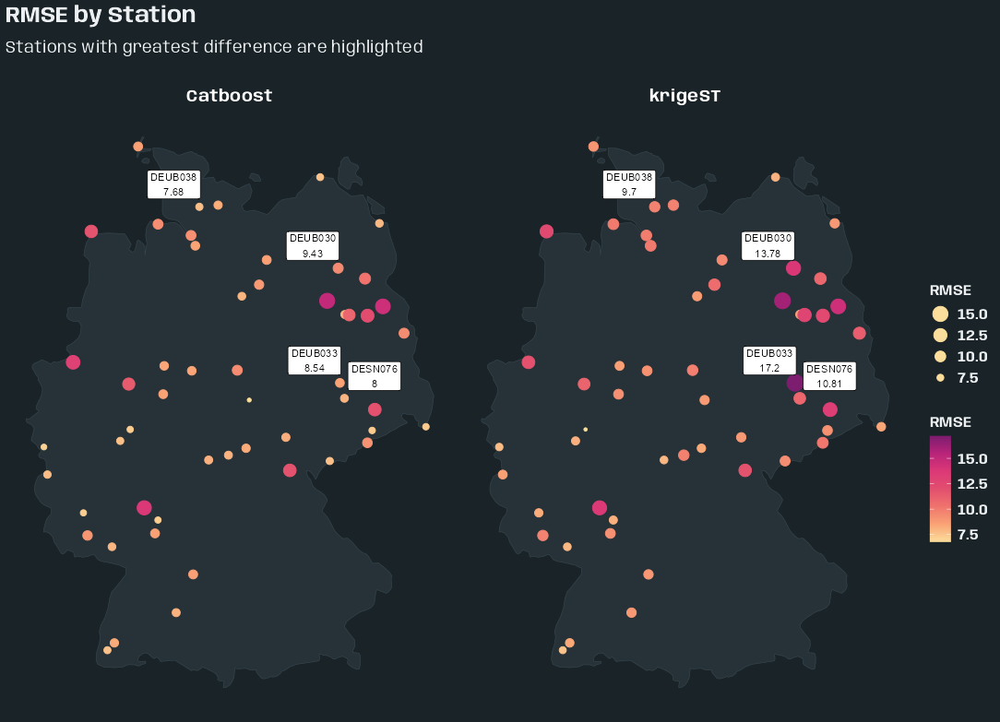{.lightbox width="582"}

  <Details>

  <Summary>Code</Summary>

  ``` r
  tib_rmse_outliers <- tib_station_metrics |> 
    select(-ME) |> 
    tidyr::pivot_wider(names_from = model, values_from = RMSE) |> 
    mutate(rmse_diff = abs(krigeST - Catboost)) |> 
    slice_max(rmse_diff, n = 4) |> 
    select(-rmse_diff) |> 
    tidyr::pivot_longer(
      cols = c(krigeST, Catboost),
      names_to = "model",
      values_to = "RMSE"
    )

  p_map_rmse <- tib_station_metrics |>
    ggplot() +
    geom_sf(
      data = germany, 
      fill = "#263238",
      color = "#37474F",
      linewidth = 0.2
    ) +
    geom_sf(aes(color = RMSE, size = RMSE)) +
    geom_sf_label(
      data = tib_rmse_outliers |> 
        filter(station_id != "DESN076"),
      aes(label = paste0(station_id, "\n", round(RMSE, 2))),
      nudge_x = -40000,
      nudge_y = 35000,
      size = 3
    ) +
    geom_sf_label(
      data = tib_rmse_outliers |> 
        filter(station_id == "DESN076"),
      aes(label = paste0(station_id, "\n", round(RMSE, 2))),
      nudge_x = 47000,
      nudge_y = 35000,
      size = 3
    ) +
    scale_color_gradientn(
      # sunsetdark from CARTOColors
      colors = colorRampPalette(c(
        "#fcde9c","#faa476","#f0746e","#e34f6f",
        "#dc3977","#b9257a","#7c1d6f"))(100)
    ) +
    facet_wrap(~model) +
    guides(size = guide_legend(
      reverse = TRUE,
      override.aes = list(color = "#fcde9c"))
    ) +
    labs(
      title = "RMSE by Station",
      subtitle = "Stations with greatest difference are highlighted
  ",
      color = "RMSE",
      size = "RMSE"
    ) +
    theme_slate_map()
  ```

  </Details>

  - Thoughts

  ###### Mean Error (ME)

  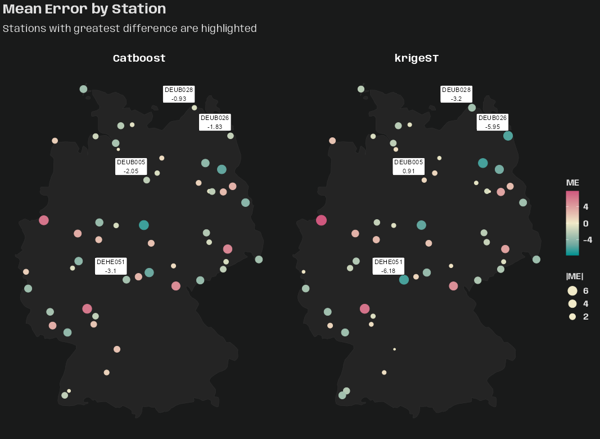{.lightbox width="582"}

  <Details>

  <Summary>Code</Summary>

  ``` r
  tib_me_outliers <- tib_station_metrics |> 
    select(-RMSE) |> 
    tidyr::pivot_wider(names_from = model, values_from = ME) |> 
    mutate(me_diff = abs(krigeST - Catboost)) |> 
    slice_max(me_diff, n = 4) |> 
    select(-me_diff) |> 
    tidyr::pivot_longer(
      cols = c(krigeST, Catboost),
      names_to = "model",
      values_to = "ME"
    )

  p_map_me <- tib_station_metrics |>
    ggplot() +
    geom_sf(
      data = germany, 
      fill = "#242424",
      color = "#333333",
      linewidth = 0.15
    ) +
    geom_sf(aes(
      color = ME, 
      size = abs(ME)
    )) +
    scale_color_gradientn(
      # tealrose from CARTOColors
      colors = colorRampPalette(c(
        "#009392", "#72aaa1", "#b1c7b3", "#f1eac8", 
        "#e5b9ad","#d98994", "#d0587e"))(100),
      limits = c(
        -max(abs(tib_station_metrics$ME)),
        max(abs(tib_station_metrics$ME))
      )
    ) +
    geom_sf_label(
      data = tib_rmse_outliers |> 
        filter(station_id != "DESN076"),
      aes(label = paste0(station_id, "\n", round(RMSE, 2))),
      nudge_x = -40000,
      nudge_y = 35000,
      size = 3
    ) +
    geom_sf_label(
      data = tib_rmse_outliers |> 
        filter(station_id == "DESN076"),
      aes(label = paste0(station_id, "\n", round(RMSE, 2))),
      nudge_x = 47000,
      nudge_y = 35000,
      size = 3
    ) +
    facet_wrap(~ model) +
    guides(size = guide_legend(
      reverse = TRUE,
      override.aes = list(color = "#f1eac8"))
    ) +
    labs(
      title = "Mean Error by Station",
      subtitle = "Stations with greatest difference are highlighted
  ",
      color = "ME",
      size = "|ME|"
    ) +
    theme_charcoal_map()
  ```

  </Details>

  - Thoughts

  ## Temporal

  ###### Mean Residual by Month

  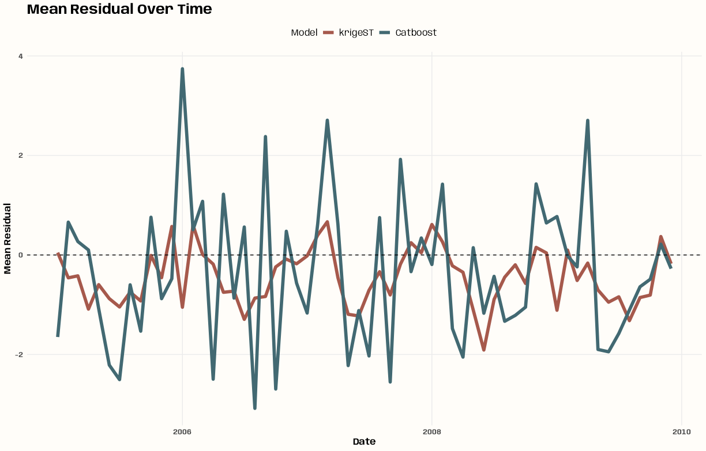{.lightbox width="582"}

  <Details>

  <Summary>Code</Summary>

  ``` r
  p_resid_time <- cv_combined |>
    mutate(year_month = lubridate::floor_date(date, "month")) |>
    summarize(
      mean_residual = mean(residual, na.rm = TRUE),
      .by = c(model, year_month)
    ) |>
    ggplot(aes(x = year_month, y = mean_residual, color = model)) +
    geom_line(linewidth = 2) +
    geom_hline(yintercept = 0, linetype = "dashed") +
    scale_color_manual(
      values = c(notebook_colors[[5]], notebook_colors[[6]])
    ) +
    labs(
      title = "Mean Residual Over Time",
      x = "Date",
      y = "Mean Residual",
      color = "Model"
    ) +
    theme_notebook(legend.position = "top")
  ```

  </Details>

  - Thoughts

  ###### RMSE and ME by Season

  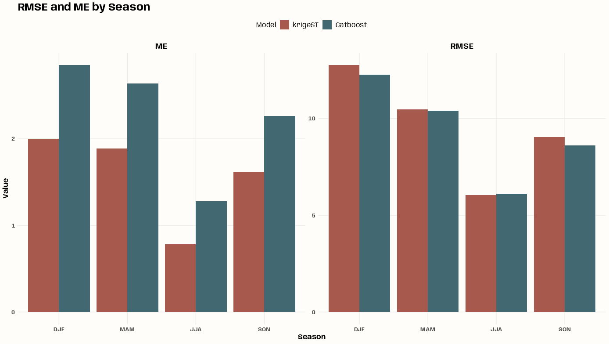{.lightbox width="582"}

  <Details>

  <Summary>Code</Summary>

  ``` r
  p_rmse_season <- cv_combined |>
    summarize(
      RMSE = sqrt(mean(residual^2, na.rm = TRUE)),
      ME = mean(residual, na.rm = TRUE),
      .by = c(model, season)
    ) |>
    tidyr::pivot_longer(
      cols = c(RMSE, ME),
      names_to = "metric",
      values_to = "value"
    ) |>
    ggplot(aes(x = season, y = value, fill = model)) +
    geom_col(position = "dodge") +
    scale_fill_manual(
      values = c(notebook_colors[[5]], notebook_colors[[6]])
    ) +
    facet_wrap(~metric, scales = "free_y") +
    labs(
      title = "RMSE and ME by Season",
      x = "Season",
      y = "Value",
      fill = "Model"
    ) +
    theme_notebook(legend.position = "top")
  ```

  </Details>

  - Thoughts

  ###### Prediction Difference by Month

  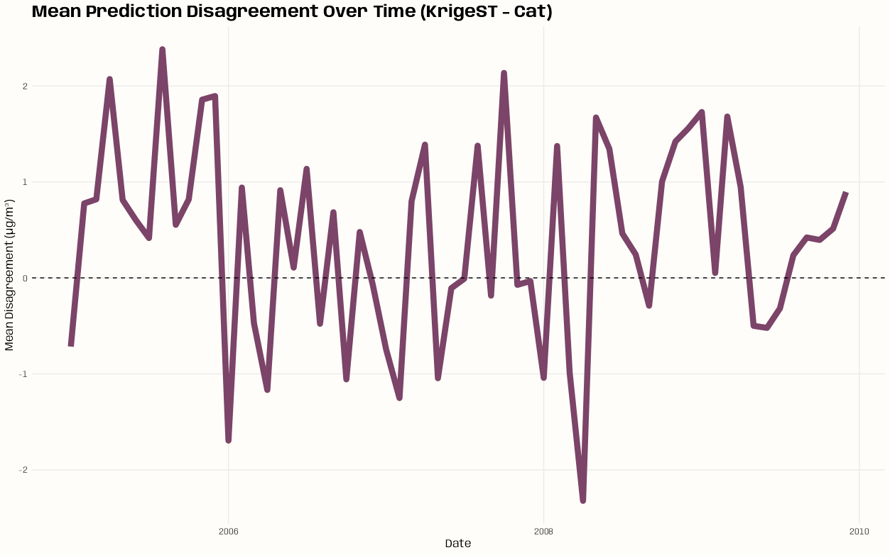{.lightbox}

  <Details>

  <Summary>Code</Summary>

  ``` r
  tib_disagree_time <- cv_combined |>
    summarize(
      predicted = mean(predicted, na.rm = TRUE),
      .by = c(date, model)
    ) |>
    tidyr::pivot_wider(names_from = model, values_from = predicted) |>
    mutate(
      disagreement = krigeST - Catboost,
      year_month = lubridate::floor_date(date, "month")
    ) |>
    summarize(
      mean_disagreement = mean(disagreement, na.rm = TRUE),
      .by = year_month
    )

  p_disagree_temporal <- tib_disagree_time |>
    ggplot(aes(x = year_month, y = mean_disagreement)) +
    geom_line(color = notebook_colors[[9]], linewidth = 3) +
    geom_hline(yintercept = 0, linetype = "dashed") +
    labs(
      title = "Mean Prediction Disagreement Over Time (KrigeST - Cat)",
      x = "Date",
      y = "Mean Disagreement (µg/m³)"
    ) +
    theme_notebook()
  ```

  </Details>

  - Thoughts

  ## Model-specific

  ###### Kriging PI Coverage

  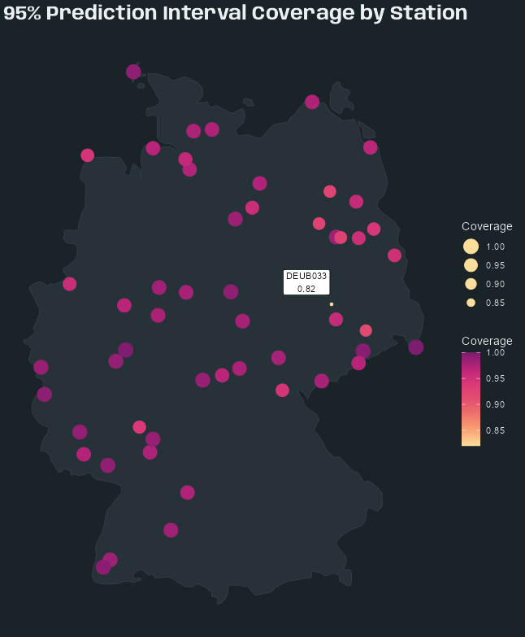{.lightbox width="432"}

  <Details>

  <Summary>Code</Summary>

  ``` r
  tib_pi <- tib_res_cv_krige_fin |>
    mutate(
      se = sqrt(pred_var),
      lower_95 = predicted - 1.96 * se,
      upper_95 = predicted + 1.96 * se,
      covered = observed >= lower_95 & observed <= upper_95
    )

  tib_pi_station <- tib_pi |>
    summarize(
      coverage = mean(covered, na.rm = TRUE),
      .by = station_id
    ) |>
    left_join(tib_station_coords, by = "station_id") |>
    sf::st_as_sf(coords = c("x", "y"), crs = 25832)

  tib_pi_outlier <- tib_pi_station |> 
    slice_min(coverage)

  p_pi_map <- tib_pi_station |>
    ggplot() +
    geom_sf(
      data = germany, 
      fill = "#263238",
      color = "#37474F",
      linewidth = 0.2
    ) +
    geom_sf(aes(color = coverage, size = coverage)) +
    geom_sf_label(
      data = tib_pi_outlier,
      aes(label = paste0(station_id, "\n", round(coverage, 2))),
      nudge_x = -40000,
      nudge_y = 35000,
      size = 3
    ) +
    scale_color_gradientn(
      # sunsetdark from CARTOColors
      colors = colorRampPalette(c(
        "#fcde9c","#faa476","#f0746e","#e34f6f",
        "#dc3977","#b9257a","#7c1d6f"))(100)
    ) +
    guides(size = guide_legend(
      reverse = TRUE,
      override.aes = list(color = "#fcde9c"))
    ) +
    labs(
      title = "95% Prediction Interval Coverage by Station",
      color = "Coverage",
      size = "Coverage"
    ) +
    theme_slate_map()

  tib_pi |>
    summarize(overall_coverage = mean(covered, na.rm = TRUE))
  #> # A tibble: 1 × 1
  #>   overall_coverage
  #>              <dbl>
  #> 1            0.971
  ```

  </Details>

  - Overall average coverage is 97.1% (see code)

  ###### Catboost Variable Importance

  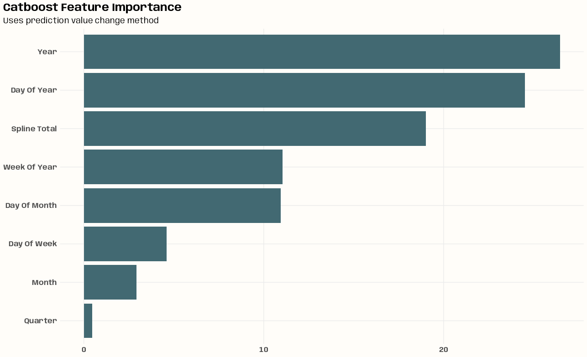{.lightbox width="582"}

  <Details>

  <Summary>Code</Summary>

  ``` r

  # 3.3.2 https://mlr3book.mlr-org.com/chapters/chapter3/evaluation_and_benchmarking.html#sec-bm-resamp
  learner_cat_final <- readr::read_rds( "../../temp-storage/gstat-vig-krig-mlr-cat-final.rds")

  # PredictionValuesChange shows how much on average the prediction changes if the feature value changes. The bigger the value of the importance the bigger on average is the change to the prediction value, if this feature is changed.
  cat_import_raw <- tibble(
    importance = unname(learner_cat_final$importance()),
    vars = names(learner_cat_final$importance())
  ) |> 
    mutate(vars = stringr::str_remove(vars, "date_feat\\."),
           vars = stringr::str_replace_all(vars, "_", " "),
           vars = stringr::str_to_title(vars))

  spline_total <- cat_import_raw %>%
    filter(stringr::str_detect(vars, "^Spline")) %>%
    summarize(
      vars = "Spline Total",
      importance = sum(importance, na.rm = TRUE)
    )

  cat_import_fin <- cat_import_raw |> 
    filter(!stringr::str_detect(vars, "^Spline")) %>%  # remove original spline vars
    bind_rows(spline_total) |> 
    mutate(vars = factor(vars),
           vars = forcats::fct_reorder(vars, importance))


  p_cat_import <- cat_import_fin |> 
    ggplot(aes(x = importance, y = vars)) +
    geom_col(fill = notebook_colors[[6]]) + 
    labs(title = "Catboost Feature Importance",
         subtitle = "Uses prediction value change method") +
    theme_notebook(
      axis.title.x = element_blank(),
      axis.title.y = element_blank(),
      axis.text.y = element_text(
        family = "Anybody",
        face = "bold",
        size = 12
      ),
      axis.text.x = element_text(
        family = "Anybody",
        face = "bold",
        size = 12
      ),
      plot.title.position = "plot"
    )
  ```

  </Details>

  - Thoughts

  ###### Catboost CP Profiles

  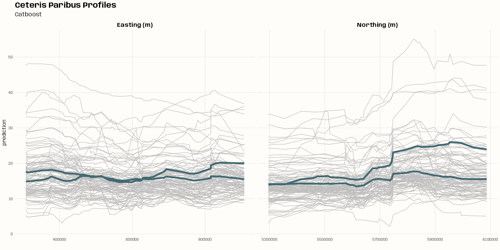{.lightbox width="582"}

  <Details>

  <Summary>Code</Summary>

  ``` r
  tib_pm10 <- sf_pm10 |> 
    sf::st_drop_geometry() |> 
    mutate(
      date_feat = date, # extra for feat eng
      X = sf::st_coordinates(sf_pm10)[, 1],
      Y = sf::st_coordinates(sf_pm10)[, 2]
    )

  exp_cat <- explain_mlr3(
    learner_cat_final,
    data = tib_pm10,
    y = tib_pm10$pm10,
    label = ""
  )

  cat_prof <- model_profile(exp_cat, k = 2, variables = c("X", "Y"))

  p_pdp <- plot(
    cat_prof,
    geom = "profiles"
  ) +
    labs(
      title = "Ceteris Paribus Profiles",
      subtitle = "Catboost"
    ) +
    theme_notebook()

  p_pdp@layers[[2]]$aes_params$colour <- notebook_colors[[6]]

  # find facet variable
  p_pdp$facet$params$facets
  #> <list_of<quosure>>
  #> 
  #> $`_vname_`
  #> <quosure>
  #> expr: ^`_vname_`
  #> env:  0x000002100f466a68

  # confirm
  moose <- ggplot_build(p_pdp)
  moose$layout$layout
  #>   PANEL ROW COL _vname_ SCALE_X SCALE_Y COORD
  #> 1     1   1   1     doy       1       1     1
  #> 2     2   1   2       X       2       1     2
  #> 3     3   1   3       Y       3       1     3

  p_pdp <- p_pdp +
    facet_wrap(
      vars(`_vname_`),
      scales = "free_x",
      labeller = as_labeller(c(
        # "doy" = "Day of the Year",
        "X" = "Easting (m)",
        "Y" = "Northing (m)"
      ))
    )
  ```

  </Details>

  - Thoughts

  ## Others

  ###### Predicted vs. Observed

  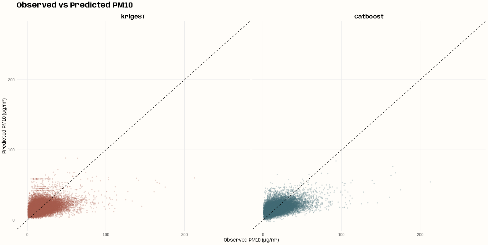{.lightbox width="582"}

  <Details>

  <Summary>Code</Summary>

  ``` r
  p_obs_pred <- cv_combined |>
    ggplot(aes(x = observed, y = predicted, color = model)) +
    geom_point(alpha = 0.2, size = 0.8) +
    geom_abline(slope = 1, intercept = 0, linetype = "dashed") +
    scale_color_manual(
      values = c(notebook_colors[[5]], notebook_colors[[6]])
    ) +
    expand_limits(x = c(0, 270), y = c(0, 270)) +
    facet_wrap(~model) +
    labs(
      title = "Observed vs Predicted PM10",
      x = "Observed PM10 (µg/m³)",
      y = "Predicted PM10 (µg/m³)"
    ) +
    theme_notebook() +
    theme(legend.position = "none")
  ```

  </Details>

  - Thoughts

  ###### RMSE and ME by Observed Range

  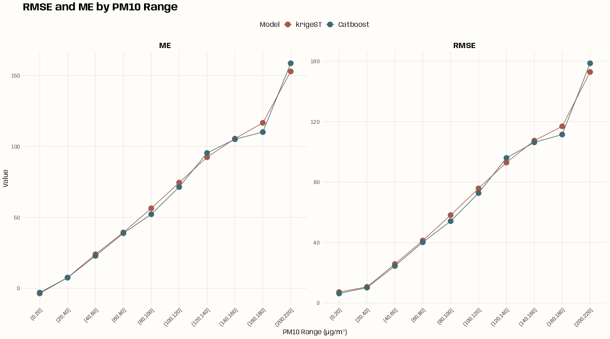{.lightbox width="582"}

  <Details>

  <Summary>Code</Summary>

  ``` r
  p_rmse_range <- cv_combined |>
    mutate(
      pm10_bin = cut(observed, breaks = seq(0, max(observed) + 10, by = 20))
    ) |>
    summarize(
      RMSE = sqrt(mean(residual^2, na.rm = TRUE)),
      ME = mean(residual, na.rm = TRUE),
      .by = c(model, pm10_bin)
    ) |>
    tidyr::pivot_longer(
      cols = c(RMSE, ME),
      names_to = "metric",
      values_to = "value"
    ) |>
    ggplot(aes(x = pm10_bin, y = value, color = model, group = model)) +
    geom_line() +
    geom_point(size = 4) +
    scale_color_manual(
      values = c(notebook_colors[[5]], notebook_colors[[6]])
    ) +
    facet_wrap(~metric, scales = "free_y") +
    labs(
      title = "RMSE and ME by PM10 Range",
      x = "PM10 Range (µg/m³)",
      y = "Value",
      color = "Model"
    ) +
    theme_notebook(
      axis.text.x = element_text(angle = 45, hjust = 1),
      legend.position = "top"
    )
  ```

  </Details>

  - Thoughts
  :::

- [Example 3]{.ribbon-highlight}: Prediction

  ::: panel-tabset
  ## Data and Set-Up

  Predictions using Catboost and Spatio-Temporal Kriging are calculated and visualized

  This is the PM10 air pollution dataset for Germany that’s from [{spacetime}]{style="color: #990000"} and used in many of my examples.

  This example is a continuation from getting starting values for the marginal components (space and time) and getting starting values for the joint components. See:

  - [EDA \>\> Temporal Depenndence](geospatial-spat-temp.qmd#sec-geo-sptemp-eda-ac){style="color: green"} \>\> Example 2
  - [EDA \>\> Spatial Dependence](geospatial-spat-temp.qmd#sec-geo-sptemp-eda-spdep){style="color: green"} \>\> Example 1
  - [Starting Values \>\> Joint Models](geospatial-spat-temp.qmd#sec-geo-sptemp-krig-stval-joint){style="color: green"} \>\> Example 1
  - [Variogram \>\> Examples](geospatial-spat-temp.qmd#sec-geo-sptemp-krig-var-ex){style="color: green"} \>\> Example 1
  - [Examples](geospatial-spat-temp.qmd#sec-geo-sptemp-krig-ex){style="color: green"} \>\> Example 1 and Example 2

  ``` r
  pacman::p_load(
    dplyr,
    ggplot2,
    patchwork,
    sf
  )

  learner_cat_final <- readr::read_rds( "../../temp-storage/gstat-vig-krig-mlr-cat-final.rds")
  fit_vario_sm <- readr::read_rds("../../temp-storage/gstat-vig9-sm-mod.rds")

  set.seed(2026)
  options(scipen = 999)

  # no days with all stations having observations
  tib_almost_complete_days <- sf_pm10 |>
    st_drop_geometry() |>
    summarize(
      n_stations = n_distinct(station_id),
      .by = date
    ) |>
    filter(n_stations %in% c(44, 45, 46))

  min(tib_almost_complete_days$date)
  #> [1] "2005-01-01"
  max(tib_almost_complete_days$date)
  #> [1] "2006-12-28"

  vec_sample_days <- tib_almost_complete_days |>
    slice_sample(n = 6) |>
    pull(date) |>
    sort()

  vec_sample_days
  #> [1] "2005-02-21" "2005-05-15" "2005-05-26" "2005-10-08" "2006-05-08" "2006-10-23""

  sf_germany <- rnaturalearth::ne_countries(
    country = "Germany",
    scale = "medium",
    returnclass = "sf"
  ) |>
    st_transform(crs = 25832)

  grd_stars <- sf_germany |>
    st_bbox() |>
    stars::st_as_stars(dx = 5000) |>
    st_crop(sf_germany)

  dim_grd <- dim(grd_stars)

  # build spatio-temporal stars grid for krigeST
  grd_st <- stars::st_as_stars(
    pts = array(
      1,
      c(dim_grd[1], dim_grd[2], time = length(vec_sample_days))
    )
  ) |>
    stars::st_set_dimensions("time", vec_sample_days) |>
    stars::st_set_dimensions(
      "x",
      stars::st_get_dimension_values(grd_stars, "x")
    ) |>
    stars::st_set_dimensions(
      "y",
      stars::st_get_dimension_values(grd_stars, "y")
    ) |>
    st_set_crs(25832)
  ```

  - Thoughts

  ## krigeST

  words

  ``` r
  # outputs stars obj
  # ~ 40 min for 2 days at 10k cells
  # 23879.57 sec or ~6.63 hrs for 6 days at 5k cells w/nmax = 15, bufferNmax = 2
  # 28742.18 sec or ~7.98 hrs for 6 days at 5k cells w/nmax = 120, bufferNmax = default
  tictoc::tic()
  krige_grid_pred <- gstat::krigeST(
    PM10 ~ 1,
    data = stars::st_as_stars(r5to10) |> st_transform(25832),
    newdata = grd_st,
    modelList = fit_vario_sm,
    nmax = 120,
    progress = TRUE
  )
  tictoc::toc()

  sf_krige_pred <- krige_grid_pred |>
    as.data.frame() |>
    filter(!is.na(var1.pred)) |>
    st_as_sf(coords = c("x", "y"), crs = 25832) |>
    rename(
      predicted = var1.pred
    ) |>
    mutate(
      date = as.Date(time),
      model = "krigeST"
    ) |>
    select(date, predicted, model, geometry)
  ```

  - Thoughts

  ## Catboost

  words

  ``` r
  tib_grid_coords <- grd_st |>
    as.data.frame() |>
    filter(!is.na(pts)) |>
    select(x, y) |>
    distinct()

  # build sf prediction grid matching sf_pm10 structure
  sf_cat_grid <- tidyr::expand_grid(
    tib_grid_coords,
    date = vec_sample_days
  ) |>
    st_as_sf(coords = c("x", "y"), crs = 25832)

  # build mlr3 task for prediction grid
  tib_newdata_cat <- sf_cat_grid |>
    st_drop_geometry() |>
    mutate(
      X = st_coordinates(sf_cat_grid)[, "X"],
      Y = st_coordinates(sf_cat_grid)[, "Y"],
      station_id = NA_character_,
      date_feat = date
    )

  # predict using final trained learner
  cat_grid_pred <- learner_cat_final$predict_newdata(tib_newdata_cat)

  sf_cat_pred <- sf_cat_grid |>
    mutate(
      predicted = cat_grid_pred$response,
      model = "Catboost"
    ) |>
    select(date, predicted, model, geometry)
  ```

  - Thoughts

  ## Visualize

  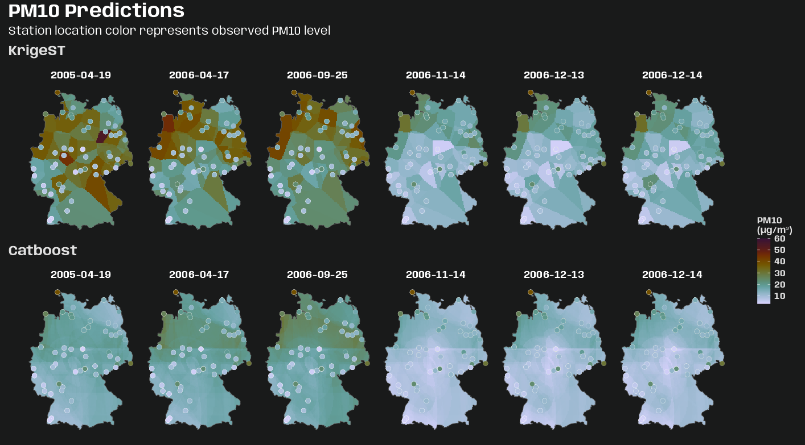{.lightbox width="632"}

  ``` r
  legend_limits <- sf_krige_pred |>
    bind_rows(sf_cat_pred) |>
    st_drop_geometry() |> 
    reframe(range_pred = range(predicted, na.rm = TRUE)) |> 
    mutate(range_pred = case_when(
      range_pred == min(range_pred) ~ floor(range_pred),
      range_pred == max(range_pred) ~ ceiling(range_pred) + 5
    )) |> 
    pull(range_pred)

  sf_obs_sample <- sf_pm10 |>
    filter(date %in% vec_sample_days) |>
    select(date, station_id, pm10, geometry)

  # germany boundary as multilinestring for overlay
  sf_germany_line <- sf_germany |>
    st_cast("MULTILINESTRING")

  p_krige_pred <- ggplot() +
    stars::geom_stars(
      data = krige_grid_pred |> st_crop(sf_germany),
      aes(x = x,
          y = y,
          fill = var1.pred)
    ) +
    geom_sf(
      data = sf_germany_line, 
      color = "grey40", 
      linewidth = 0.3
    ) +
    geom_sf(
      data = sf_obs_sample,
      color = "white",
      size = 0.8,
      alpha = 0.7
    ) +
    facet_wrap(~ as.Date(time), nrow = 1) +
    scico::scale_fill_scico(
      palette = "glasgow",
      limits = legend_limits,
      direction = -1,
      name = "PM10\n(µg/m³)",
      na.value = "transparent"
    ) +
    coord_sf(lims_method = "geometry_bbox") +
    labs(title = "KrigeST") +
    theme_charcoal_map()


  p_cat_pred <- ggplot() +
    stars::geom_stars(
      data = cat_stars_combined,
      aes(x = x, 
          y = y, 
          fill = predicted)
    ) +
    geom_sf(
      data = sf_germany_line, 
      color = "grey40", 
      linewidth = 0.3
    ) +
    geom_sf(
      data = sf_obs_sample,
      color = "white",
      size = 0.8,
      alpha = 0.7
    ) +
    facet_wrap(~as.Date(time), nrow = 1) +
    scico::scale_fill_scico(
      palette = "glasgow",
      limits = legend_limits,
      direction = -1,
      name = "PM10\n(µg/m³)",
      na.value = "transparent"
    ) +
    coord_sf(lims_method = "geometry_bbox") +
    labs(title = "Catboost") +
    theme_charcoal_map()

  theme_patch <- theme(
    plot.title = element_text(
      family = "Anybody",
      size = 25, 
      color = "white",
      face = "bold"
    ),
    plot.background = element_rect(fill = "#191a1a", color = NA)
  )
  p_krige_pred / p_cat_pred + plot_layout(guides = "collect") + plot_annotation(title = "PM10 Predictions", theme = theme_patch)
  ```

  - Thoughts
  :::
