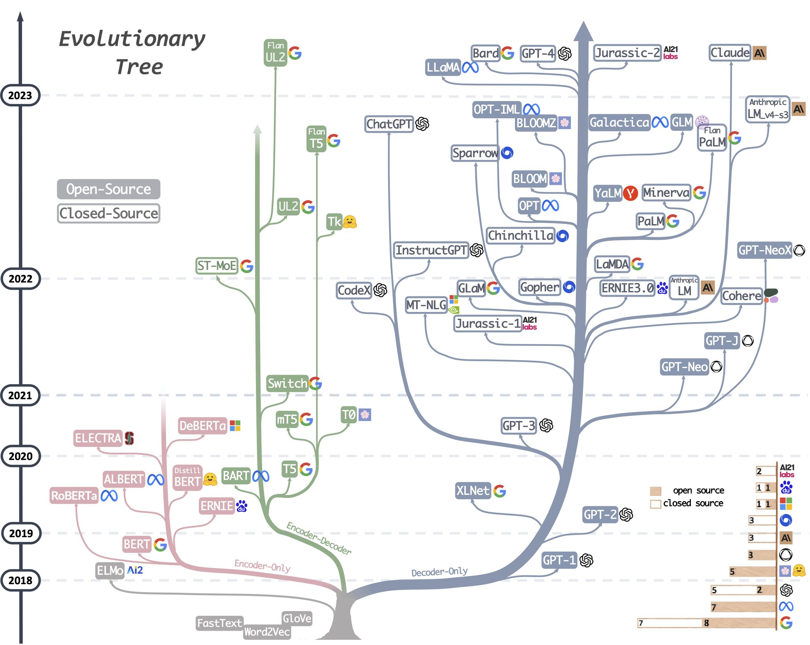
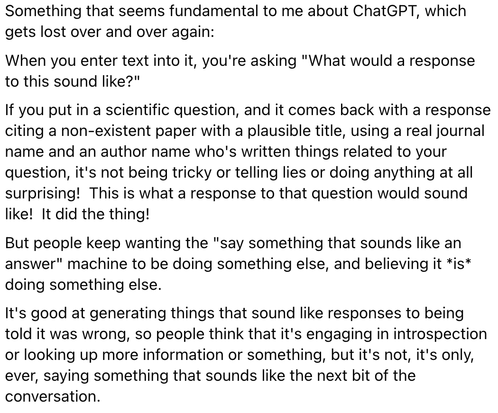
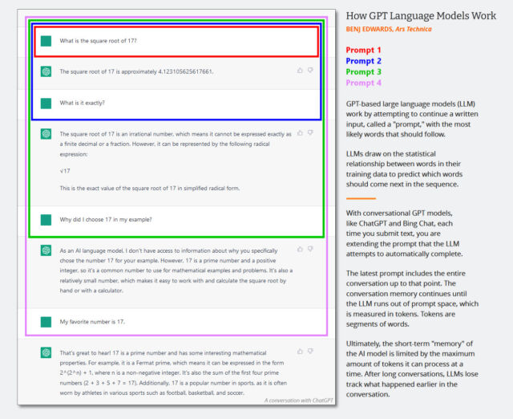

# General {#sec-llm-gen .unnumbered}

::: {.callout-tip collapse="true"}
## Packages

-   [Simple API Wrappers]{.underline}
    -   [{]{style="color: #990000"}[tidychatmodels](https://tidychatmodels.albert-rapp.de/){style="color: #990000"}[}]{style="color: #990000"} - Communicates with different chatbot vendors like openAI, mistral.ai, etc. using the same interface.
    -   [{]{style="color: #990000"}[gemini.R](https://jhk0530.github.io/gemini.R/){style="color: #990000"}[}]{style="color: #990000"} - Wrapper around Google Gemini API
    -   [{]{style="color: #990000"}[rollama](https://jbgruber.github.io/rollama/){style="color: #990000"}[}]{style="color: #990000"} - Wrapper around the Ollama API
    -   [{]{style="color: #990000"}[chatAI4R](https://cran.r-project.org/web/packages/chatAI4R/index.html){style="color: #990000"}[}]{style="color: #990000"} - Wrapper around OpenAI API
    -   [{]{style="color: #990000"}[TheOpenAIR](https://openair-lib.org/){style="color: #990000"}[}]{style="color: #990000"} - Wrapper around OpenAI models
-   [Code Assistants]{.underline}
    -   [{]{style="color: #990000"}[btw](https://posit-dev.github.io/btw/){style="color: #990000"}[}]{style="color: #990000"} - Helps you describe your computational environment to LLMs
        -   Assembles context on your R environment, package documentation, and working directory, copying the results to your clipboard for easy pasting into chat interfaces.
        -   Wraps methods that can be easily incorporated into **ellmer tool calls** for describing various kinds of objects in R
        -   Support for [{mcptools}]{style="color: #990000"}
    -   [{]{style="color: #990000"}[chattr](https://mlverse.github.io/chattr/){style="color: #990000"}[}]{style="color: #990000"} - Code assistant for RStudio
    -   [{]{style="color: #990000"}[gander](https://simonpcouch.github.io/gander/){style="color: #990000"}[}]{style="color: #990000"} - A higher-performance and lower-friction chat experience for data scientists in RStudio and Positron–sort of like completions with Copilot, but it knows how to talk to the objects in your R environment.
        -   Brings [{ellmer}]{style="color: #990000"} chats into your project sessions, automatically incorporating relevant context and streaming their responses directly into your documents.
    -   [{]{style="color: #990000"}[ravel](https://cran.r-project.org/web/packages/ravel/index.html){style="color: #990000"}[}]{style="color: #990000"} - AI Copilot for R Analysis Workflows in 'RStudio'
    -   [{]{style="color: #990000"}[saber](https://cran.r-project.org/web/packages/saber/index.html){style="color: #990000"}[}]{style="color: #990000"} ([Intro](https://cornball.ai/posts/tokensvstrees/))- Code Analysis and Project Context for R
        -   Provides context for coding assistants for complex projects using dependency graphs.
        -   Parses R source files into AST symbol indices, traces function callers across projects, discovers project dependency graphs, generates project briefings, and provides package introspection tools.
-   [Processing]{.underline}
    -   [{]{style="color: #990000"}[toon](https://cran.r-project.org/web/packages/toon/index.html){style="color: #990000"}[}]{style="color: #990000"} - Token-Oriented Object Notation (TOON) is a compact, human-readable serialization format designed for passing structured data to Large Language Models with significantly reduced token usage.
        -   It's intended for LLM input as a lossless, drop-in representation of JSON data.
-   [Diagnostics]{.underline}
    -   [{]{style="color: #990000"}[samesies](https://dylanpieper.github.io/samesies/){style="color: #990000"}[}]{style="color: #990000"} - A reliability tool for comparing the similarity of texts, factors, or numbers across two or more lists. The motivating use case is to evaluate the reliability of Large Language Model (LLM) responses across models, providers, or prompts
    -   [{]{style="color: #990000"}[vitals](https://vitals.tidyverse.org/){style="color: #990000"}[}]{style="color: #990000"} - A framework for large language model evaluation in R. It’s specifically aimed at ellmer users who want to measure the effectiveness of their LLM products
        -   Measure whether changes in your prompts or additions of new tools improve performance in your LLM product
        -   Compare how different models affect performance, cost, and/or latency of your LLM product
        -   Surface problematic behaviors in your LLM product
-   [Local]{.underline}
    -   [{]{style="color: #990000"}[llamaR](https://cran.r-project.org/web/packages/llamaR/index.html){style="color: #990000"}[}]{style="color: #990000"} - Interface for Large Language Models via 'llama.cpp'
        -   Run Large Language Models ('LLMs') locally with optional 'Vulkan' GPU acceleration via [{]{style="color: #990000"}[ggmlR](https://cran.r-project.org/web/packages/ggmlR/index.html){style="color: #990000"}[}]{style="color: #990000"}
    -   [{]{style="color: #990000"}[localLLM](https://www.eddieyang.net/software/localllm/){style="color: #990000"}[}]{style="color: #990000"} - Provides an easy-to-use interface to run local large language models (LLMs) directly in R.
        -   Uses the performant llama.cpp library as the backend and allows you to generate text and analyze data with LLM
    -   [{]{style="color: #990000"}[ollamar](https://hauselin.github.io/ollama-r/){style="color: #990000"}[}]{style="color: #990000"} - R version of [{]{style="color: goldenrod"}[ollama](https://github.com/ollama/ollama-python){style="color: goldenrod"}[}]{style="color: goldenrod"} python and [{]{style="color: #CE3375"}[ollama](https://github.com/ollama/ollama-js){style="color: #CE3375"}[}]{style="color: #CE3375"} JS libraries
        -   Makes it easy to work with data structures (e.g., conversational/chat histories) that are standard for different LLMs (such as those provided by OpenAI and Anthropic).
        -   Lets you specify different output formats (e.g., dataframes, text/vector, lists) that best suit your need, allowing easy integration with other libraries/tools and parallelization via the [{httr2}]{style="color: #990000"} library.
    -   [{]{style="color: #990000"}[shiny.ollama](https://www.indraneelchakraborty.com/shiny.ollama/){style="color: #990000"}[}]{style="color: #990000"} - Chat offline with open-source LLMs like deepseek-r1, nemotron, qwen, llama and more all through a simple R package powered by Shiny and Ollama.
-   [{]{style="color: #990000"}[edgemodelr](https://github.com/PawanRamaMali/edgemodelr){style="color: #990000"}[}]{style="color: #990000"} - Enables R users to run large language models locally using 'GGUF' model files and the 'llama.cpp' inference engine
    -   [**GGUF**]{style="color: #009499"} - A binary format that is optimized for quick loading and saving of models, making it highly efficient for inference purposes.
        -   Models initially developed in frameworks like PyTorch can be converted to GGUF format for use with those engines.
        -   [GGUF on Huggingface](https://huggingface.co/docs/hub/gguf)
-   [{]{style="color: #990000"}[ellmer](https://ellmer.tidyverse.org/){style="color: #990000"}[}]{style="color: #990000"} - Supports a wide variety of LLM providers and implements a rich set of features including streaming outputs, tool/function calling, structured data extraction, and more.
-   [{]{style="color: #990000"}[mall](https://mlverse.github.io/mall/){style="color: #990000"}[}]{style="color: #990000"} ([Intro](https://blogs.rstudio.com/ai/posts/2024-10-30-mall/))- Text analysis by using rows of a dataframe along with a pre-determined (depending on the function), one-shot prompt. The prompt + row gets sent to an Ollama LLM for the prediction
    -   Also available in Python
    -   Features
        -   Sentiment analysis
        -   Text summarizing
        -   Classify text
        -   Extract one, or several, specific pieces information from the text
        -   Translate text
        -   Verify that something it true about the text (binary)
        -   Custom prompt
-   [{]{style="color: #990000"}[batchLLM](https://github.com/dylanpieper/batchLLM){style="color: #990000"}[}]{style="color: #990000"} - Process prompts through multiple LLMs at the same time.
    -   Uses data frames and column rows as LLM input and a new column with the text completions as the output.
    -   Supports OpenAI, Claude & Gemini.
-   [{]{style="color: #990000"}[llmR](https://github.com/bakaburg1/llmR){style="color: #990000"}[}]{style="color: #990000"} - Interface to OpenAI’s GPT models, Azure’s language models, Google’s Gemini models, or custom local servers
    -   Unified API: Setup and easily switch between different LLM providers and models using a consistent set of functions.
    -   Prompt Processing: Convert chat messages into a standard format suitable for LLMs.
    -   Output Processing: Can request JSON output from the LLMs and tries to sanitize the response if the parsing fails.
    -   Error Handling: Automatically handle errors and retry requests when rate limits are exceeded. If a response is cut due to token limits, the package will ask the LLM to complete the response.
    -   Custom Providers: Interrogate custom endpoints (local and online) and allow implementation of ad-hoc LLM connection functions.
    -   Mock Calls: Allows simulation of LLM interactions for testing purposes.
    -   Logging: Option to log the LLM response details for performance and cost monitoring
-   [{]{style="color: #990000"}[aigenflow](https://github.com/mharu997/aigenflow){style="color: #990000"}[}]{style="color: #990000"} - Enables you to create intelligent agents and orchestrate workflows with just a few lines of code, making advanced AI capabilities accessible to developers, data scientists, and researchers across diverse fields.
-   [{]{style="color: #990000"}[hellmer](https://dylanpieper.github.io/hellmer/){style="color: #990000"}[}]{style="color: #990000"} - Enables sequential or parallel batch processing for chat models from ellmer.
-   [{]{style="color: #990000"}[querychat](https://posit-dev.github.io/querychat/){style="color: #990000"}[}]{style="color: #990000"} (also in python) - A drop-in component for Shiny that allows users to query a data frame using natural language. The results are available as a reactive data frame, so they can be easily used from Shiny outputs, reactive expressions, downloads, etc.
-   [{]{style="color: #990000"}[shinychat](https://posit-dev.github.io/shinychat/){style="color: #990000"}[}]{style="color: #990000"} - Shiny ui component for LLM apps
    -   Example: Basic ([source](https://www.infoworld.com/article/3848270/genai-tools-for-r-new-tools-to-make-r-programming-easier.html))

        ``` r
        library(shiny)
        library(shinychat)

        ui <- bslib::page_fluid(
          chat_ui("chat")
        )

        server <- function(input, output, session) {
          chat <- ellmer::chat_ollama(system_prompt = "You are a helpful assistant", model = "phi4")

          observeEvent(input$chat_user_input, {
            stream <- chat$stream_async(input$chat_user_input)
            chat_append("chat", stream)
          })
        }

        shinyApp(ui, server)
        ```

        -   [More robust version](https://gist.github.com/smach/f38c61ec9a8ad4649f43cd8a134db687)
:::

## Misc {#sec-llm-gen-misc .unnumbered}

-   Resources

    -   [Large Language Model tools for R](https://luisdva.github.io/llmsr-book/)
    -   [LLM Leaderboard Collection: A useful collection of LLM leaderboards for finding the right LLM for your use case](https://ludwigstumpp.com/llm-leaderboards)
    -   [How well do LLMs generate R code?](https://skaltman-model-eval-app.share.connect.posit.cloud/) - Dashboard that's updated with the latest cloud models. Tracks R code accuracy and cost.
    -   [Awesome Generative AI Data Scientist](https://github.com/business-science/awesome-generative-ai-data-scientist) - Curated list of LLM learning resources
    -   [Awesome LLM Resources](https://github.com/ilsilfverskiold/Awesome-LLM-Resources-List) - Tracks tools, platforms, etc.
    -   [LLMs in R: Quick Wins](https://www.aifordatapeople.com/courses/llms-in-r) - Free LLM online course with Nic Crane

-   Benchmarks

    -   Companies that suggest their agents have something like 85% success rate don't tell you that they're talking about single-step evaluations measured using controlled benchmarks on carefully selected tasks

        -   [Example]{.ribbon-highlight}: Agent w/"85%" success rate on a ten-step task actually has a 20% overall success rate: $0.85 × 0.85 × 0.85 × 0.85 × 0.85 × 0.85 × 0.85 × 0.85 × 0.85 × 0.85 = 0.197$

    -   When comparing agent brands, ask, "Does your actual task distribution resemble the benchmark’s task distribution?"

        -   If your tasks are longer, more ambiguous, involve novel contexts, or operate in environments the benchmark didn’t include, apply a discount of at least 30–50% to the benchmark accuracy number when estimating real production performance

    -   Sites

        -   [LLM Evals](https://kschaul.com/llm-evals/) (Shaul)
        -   [Scale Labs](https://labs.scale.com/leaderboard)
            -   "Scale AI’s SWE-bench Pro, which uses realistic task complexity closer to actual engineering work" ([source](https://towardsdatascience.com/the-math-thats-killing-your-ai-agent/))
                -   As compared to *SWE-bench Verified* or *HumanEval* (other benchmarking websites) which is a less realistic, controlled testing environment

    -   Extracting data from a .pdf or .jpg of a table ([source](https://kschaul.com/llm-evals/evals/extract-fema-incidents/))

        -   gemini-2.5-pro-preview-03-25 scored 100% accuracy
        -   Claude 3.5 and 3.7 sonnet only got 1 or the two requests correct

-   Use Cases

    -   For public facing apps, LLMs should only be used to translate user input to make it possible *to select* a function(s) to be executed, then translate the output of the function(s) into human language the user can understand. They should not be used to execute logic. (Apr 2025 [article](https://sgnt.ai/p/hell-out-of-llms/))
    -   Understanding code (Can reduce cognative load)([article](https://www.caitlinhudon.com/posts/programming-beyond-cognitive-limitations-with-ai))
        -   During code reviews or onboarding new programmers
        -   under-commented code
    -   Generating the code scaffold for a problem where you aren't sure where or how to start solving it.
    -   LLMs don't require removing stopwords during preprocessing of document.

-   Humans with expertise need to be included in the process

    -   It's difficult for people *without* sufficient expertise to tell:
        -   when answers look right and are right
        -   when they look right and are wrong
        -   when answers look right but are suboptimal

-   Generate "Impossibility" List ([source](https://fosstodon.org/@smach@masto.machlis.com/112733952485781181))

    -   “I suggest that people and organizations keep an ‘impossibility list’ - things that their experiments have shown that AI can definitely not do today but which it can almost do. . . . When AI models are updated, test them on your impossibility list to see if they can now do these impossible tasks.” - Ethan Mollick, Gradually, then Suddenly: Upon the Threshold”

-   Requirements for success using AI for development ([Thread](https://bsky.app/profile/christiannolan.bsky.social/post/3mf7ie4myis2t))

    -   Docs with examples
    -   A CLI that can scaffold, create, and validate the pipelines
    -   Opinionated organization for projects and files
    -   Code that an LLM can inspect

-   Evolution of LLMs\
    {.lightbox width="732"}

## Description {#sec-llm-gen-desc .unnumbered}

-   What chatGPT is:

    -   "What would a response to this question sound like" machine Researchers build (train) large language models like GPT-3 and GPT-4 by using a process called "unsupervised learning," which means the data they use to train the model isn't specially annotated or labeled. During this process, the model is fed a large body of text (millions of books, websites, articles, poems, transcripts, and other sources) and repeatedly tries to predict the next word in every sequence of words. If the model's prediction is close to the actual next word, the neural network updates its parameters to reinforce the patterns that led to that prediction.

        Conversely, if the prediction is incorrect, the model adjusts its parameters to improve its performance and tries again. This process of trial and error, though a technique called "backpropagation," allows the model to learn from its mistakes and gradually improve its predictions during the training process. As a result, GPT learns statistical associations between words and related concepts in the data set.

        In the current wave of GPT models, this core training (now often called "pre-training") happens only once. After that, people can use the trained neural network in "**inference mode**," which lets users feed an input into the trained network and get a result. During inference, the input sequence for the GPT model is always provided by a human, and it's called a "prompt." The prompt determines the model's output, and altering the prompt even slightly can dramatically change what the model produces.Iterative prompting is limited by the size of the model's "context window" since each prompt is appended onto the previous prompt.  ChatGPT is different from vanilla GPT-3 because it has also been trained on transcripts of conversations written by humans. "We trained an initial model using **supervised fine-tuning**: human AI trainers provided conversations in which they played both sides---the user and an AI assistant,"

        ChatGPT has also been tuned more heavily than GPT-3 using a technique called "**reinforcement learning from human feedback**," or RLHF, where human raters ranked ChatGPT's responses in order of preference, then fed that information back into the model. This has allowed the ChatGPT to produce coherent responses with fewer confabulations than the base model. The prevalence of accurate content in the data set, recognition of factual information in the results by humans, or reinforcement learning guidance from humans that emphasizes certain factual responses.

        Two major types of falsehoods that LLMs like ChatGPT might produce. The first comes from inaccurate source material in its training data set, such as common misconceptions (e.g., "eating turkey makes you drowsy"). The second arises from making inferences about specific situations that are absent from its training material (data set); this falls under the aforementioned "hallucination" label.

        Whether the GPT model makes a wild guess or not is based on a property that AI researchers call "**temperature**," which is often characterized as a "creativity" setting. If the creativity is set high, the model will guess wildly; if it's set low, it will spit out data deterministically based on its data set. If creativity is set low, "\[It\] answers 'I don't know' all the time or only reads what is there in the Search results (also sometimes incorrect). What is missing is the tone of voice: it shouldn't sound so confident in those situations."

        In some ways, ChatGPT is a mirror: It gives you back what you feed it. If you feed it falsehoods, it will tend to agree with you and "think" along those lines. That's why it's important to start fresh with a new prompt when changing subjects or experiencing unwanted responses.

        "One of the most actively researched approaches for increasing factuality in LLMs is **retrieval augmentation**---providing external documents to the model to use as sources and supporting context," said Goodside. With that technique, he explained, researchers hope to teach models to use external search engines like Google, "citing reliable sources in their answers as a human researcher might, and rely less on the unreliable factual knowledge learned during model training." Bing Chat and Google Bard do this already by roping in searches from the web, and soon, a browser-enabled version of ChatGPT will as well. Additionally, ChatGPT plugins aim to supplement GPT-4's training data with information it retrieves from external sources, such as the web and purpose-built databases.

        Other things that might help with hallucination include, "a more sophisticated data curation and the linking of the training data with **'trust' scores**, using a method not unlike PageRank... It would also be possible to fine-tune the model to hedge when it is less confident in the response." (arstechnica [article](https://arstechnica.com/information-technology/2023/04/why-ai-chatbots-are-the-ultimate-bs-machines-and-how-people-hope-to-fix-them/))

## APIs {#sec-llm-gen-apis .unnumbered}

-   OpenAI [models](https://platform.openai.com/docs/models/models)
-   [Cloudflare Workers AI](https://developers.cloudflare.com/workers-ai/)
-   [Hugging Face Models](https://huggingface.co/models)
