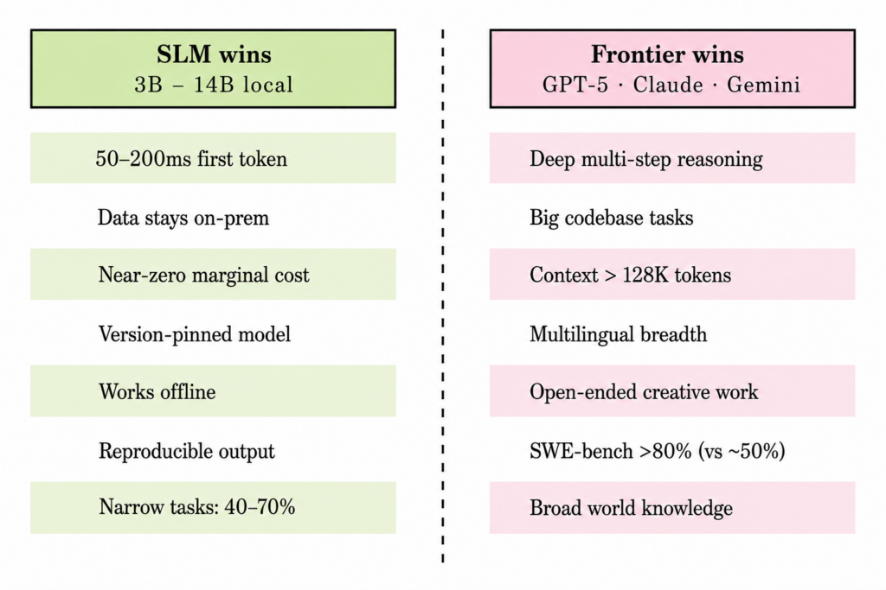

# Local

- Notes from
  - [How to Choose Between Small and Frontier Models](https://towardsdatascience.com/how-to-choose-between-small-and-frontier-models/)
- Companies are doing is tiered routing: about 70% local SLM, 20% mid-tier API, and 10% frontier API. (2026)
- The best 30B coder SLMs top out around 50% on SWE-bench Verified while Claude Opus 4.6 hits 80.8% on SWE-bench Verified (2026)
- Tradeoffs (2026)\
  {.llightbox width="582"}
  - A 3B to 8B local model is roughly a 2023-era GPT-3.5 for general chat: useful, not magical.
- Trusted Benchmarks
  - GPQA Diamond
  - SWE-bench Verified
  - ARC-AGI-2
  - HLE
  - LiveCodeBench
- Security Issues
  - In February 2025, [ReversingLabs](https://www.reversinglabs.com/blog/rl-identifies-malware-ml-model-hosted-on-hugging-face) found malicious models on Hugging Face using broken pickle files to smuggle a reverse shell past the scanner; they sat undetected for about eight months.
  - Prompt injection works exactly the same against a local model
  - RAG content can carry instructions
  - Tools like Ollama and LM Studio ship without safety classifiers by default.
- Guidelines
  - Ues SLMs when:
    - The task is high-volume and narrow: classification, extraction, routing, summarization.
    - Latency is critical: autocomplete or voice, where you need first-token times under 100 ms.
    - You’re in a privacy-regulated domain: healthcare, legal, finance or government, where the data can’t leave the building.
    - It’s an agentic sub-task, an edge or offline deployment, or any workload pushing past a few million tokens a day, where the API meter becomes the dominant cost.
    - Good at summarization, rewriting, basic Q&A, code completion, and RAG over your own documents.
    - Weak at deep reasoning, long multi-step problems, and niche factual recall.
  - Use frontier models when:
    - The work is open-ended or one-off: creative writing, research assistance, or debugging across a large codebase.
    - You need broad world knowledge: complex multi-tool agents, or customer support across long-tail languages.
    - The volume is low: under maybe 1,000 requests a day across varied tasks. Here the API is cheaper *and* better.
- Memory
  - A rule of thumb for fitting a model in memory at 4-bit: budget about 0.6 to 0.8 GB per billion parameters, plus 1 to 4 GB for context and overhead.
  - Guidelines
    - 8 GB RAM handles 1 to 3B models
    - 16 GB runs a 7 to 8B comfortably
    - 32 GB RAM handles 13 to 14B, or a 27 to 30B model, if you’re patient
    - 24 GB GPU (e.g. RTX 4090) runs Gemma 3 27B (QAT) or Qwen3-30B-A3B well
- Response Speed
  - Expect 10 to 40 tokens per second on a modern laptop
  - Expect 80 to 150 on an RTX 4090
- Fine Tuning
  - A small model with constrained decoding (Outlines, XGrammar) hits 99%+ schema validity, where a larger model drifts.
  - Do when:
    - The task is narrow and repetitive at scale. NVIDIA’s rule of thumb: a stable schema plus more than 10K requests a day.
    - Latency or cost ceilings bind, privacy requires on-prem, or you need behavioral reliability.
  - Prompt a frontier model instead when:
    - The task is open-ended, evolving, or low-volume, or it needs broad world knowledge.
    - The knowledge changes: RAG beats fine-tuning anyway.
  - QLoRA is the default: a 4-bit NF4 base with BF16 LoRA adapters.
    - Rank: start at 16, raise to 32-64 for harder tasks.
    - Alpha: 32
    - Learning rate: \~2e-4 for supervised fine-tuning, 5e-6 for DPO
    - Epochs: 1 to 3 (more usually overfits)
    - Train in the precision you serve in.
  - Data Requirements
    - Style and format adaptation (100 to 1,000 pairs): Teaching a model to respond in a specific tone, length, or structural format (like JSON).
    - Classification or extraction (1K to 10K examples): Training a small model to consistently map text to specific categories or pull structured entities out of raw text.
    - Injecting domain knowledge (10K to 100K): Trying to teach the model new facts.
      - If you need this much data, RAG (Retrieval-Augmented Generation) is usually a better and more reliable choice than fine-tuning.
    - Reasoning distillation (100K to 1M+ traces): Teaching a smaller model complex multi-step reasoning by training it on the thought processes (chains of thought) generated by a much larger frontier model.
  - Evaluation before you train
    - Build a task-specific eval set of 100 to 500 hand-graded examples before you train.
    - Track schema validity, exact-match, executable-call rate, p95 latency, and cost per successful task.
    - Tools like lm-eval-harness, promptfoo, and Arize Phoenix handle the mechanics.
    - Use an LLM-as-judge only after you’ve sanity-checked it against human grades.
  - Guidelines
    - If you’re running more than 10 requests per second on a single narrow task, fine-tune a 3 to 8B model and self-host it, as the volume justifies the upfront effort and the cost savings compound.
    - If you’re under 100 requests a day across varied tasks, don’t bother: just call an API, since you’ll never recoup the time spent training and maintaining your own model.
    - If you’re somewhere in the middle, start with prompting plus RAG, and only reach for fine-tuning once your evaluation set stops improving.
- Tools
  - [Ollama](https://ollama.com/)
    - Ollama exposes an OpenAI-compatible API on port 11434, bound to 127.0.0.1 by default, so nothing leaves your machine.
  - [LM Studio](https://lmstudio.ai/)
- Examples
  - [Example]{.ribbon-highlight}: Ollama

    - Pull model

      ``` bash
      ollama pull qwen3:4b
      ollama run qwen3:4b
      ```

    - Point to code base

      ``` python
      from openai import OpenAI
      # Same SDK you'd use for the cloud, pointed at your local model
      client = OpenAI(base_url="http://localhost:11434/v1", api_key="ollama")
      resp = client.chat.completions.create(
          model="qwen3:4b",
          messages=[
              {"role": "user", "content": "Summarize this support ticket in 3 bullets: ..."}
          ],
      )
      print(resp.choices[0].message.content)
      ```

  - [Example]{.ribbon-highlight}: Tiered Routing

    ``` python
    # Toy router: handle narrow work locally, escalate to a frontier model
    # only when the task genuinely needs broad reasoning or long context.
    def answer(task):
        if task.kind in {"classify", "extract", "summarize", "route"}:
            return local_slm(task.text)     # runs on your machine, ~free
        if task.tokens > 128_000 or task.kind == "open_ended":
            return frontier_api(task.text)  # broad reasoning, long context
        return local_slm(task.text)         # default to local, fall back if low confidence
    ```

    - In production, you’d also add a confidence check on the local answer and escalate on failure

  - [Example]{.ribbon-highlight}: Fine Tuning

    ``` python
    from unsloth import FastLanguageModel

    model, tokenizer = FastLanguageModel.from_pretrained(
        model_name="unsloth/Qwen3-4B-Instruct",
        max_seq_length=4096,
        load_in_4bit=True,                # NF4 4-bit base
    )

    model = FastLanguageModel.get_peft_model(
        model,
        r=16, lora_alpha=32,              # bump to 32-64 for harder tasks
        target_modules=["q_proj", "k_proj", "v_proj", "o_proj",
                        "gate_proj", "up_proj", "down_proj"],
    )

    # Then train with TRL's SFTTrainer at lr=2e-4 for 1-3 epochs.
    ```
