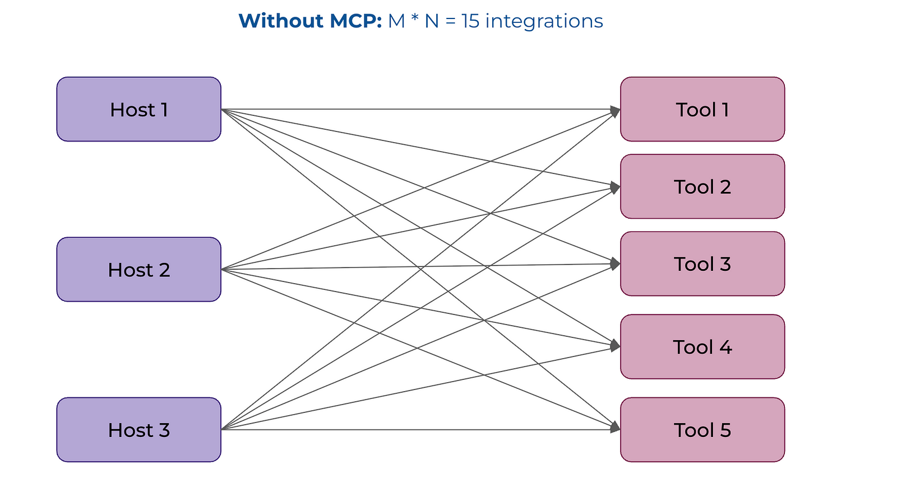
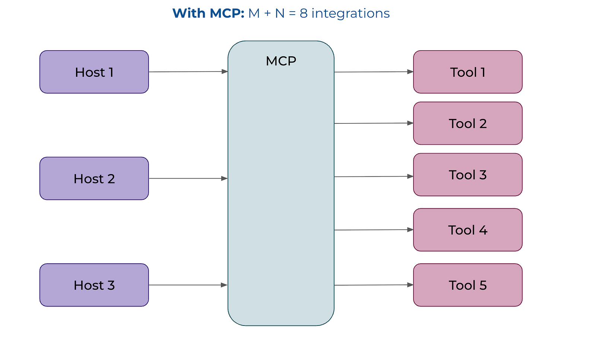
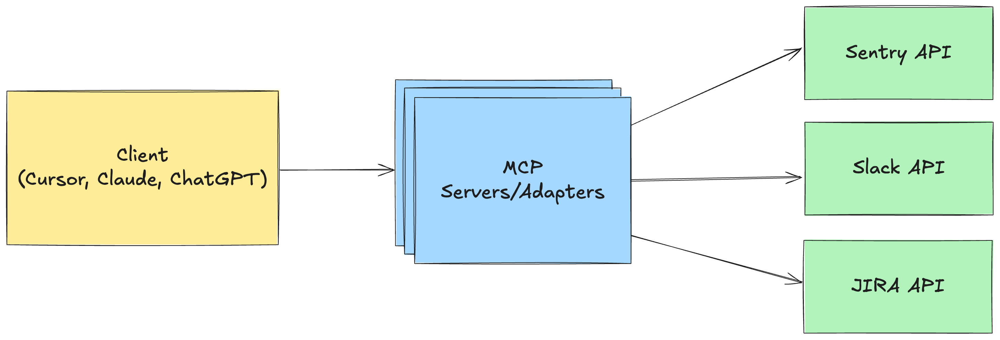

# Model Context Protocol (MCP) {#sec-llms-mcp .unnumbered}

- Allows LLMS to more easily integrate with external tools

  - It establishes a standard interface for APIs to communicate to LLMs. This way all types of APIs and their individual patterns can be integrated into an LLM app without too much hassle.
  - Without MCP\
    {.lightbox width="382"}
    - You have build integration for each application and tool
  - With MCP\
    {.lightbox width="382"}
    - Interactions are standardized.

- Notes from [MCP (Model Context Protocol): Simply explained in 5 minutes](https://read.highgrowthengineer.com/p/mcps-simply-explained?utm_source=multiple-personal-recommendations-email&utm_medium=email&triedRedirect=true)

- Packages

  - [{]{style="color: #990000"}[debrief](https://r-lib.github.io/debrief/){style="color: #990000"}[}]{style="color: #990000"} ([Intro](https://opensource.posit.co/blog/2026-06-22_debrief-0-1-0/)) - Code optimization diagnostic that provides LLM-friendly text output from a [{profvis}]{style="color: #990000"} analysis. (See [Code, Optimization](code-optimization.qmd#sec-code-opt){style="color: green"})
  - [{]{style="color: #990000"}[mcptools](https://posit-dev.github.io/mcptools/){style="color: #990000"}[}]{style="color: #990000"} - Allows MCP-enabled tools like Claude Desktop, Claude Code, and VS Code GitHub Copilot can run R code *in the sessions you have running* to answer your questions
    - Works well with [{btw}]{style="color: #990000"}
  - [{]{style="color: #990000"}[mcpr](https://mcpr.opifex.org/){style="color: #990000"}[}]{style="color: #990000"} - Enables R applications to expose capabilities (tools, resources, and prompts) to AI models through a standard JSON-RPC 2.0 interface. It also provides client functionality to connect to and interact with MCP servers
  - [{]{style="color: goldenrod"}[fastapi_mcp](https://fastapi-mcp.tadata.com/getting-started/welcome){style="color: goldenrod"}[}]{style="color: goldenrod"} - Exposes FastAPI endpoints as Model Context Protocol (MCP) tools with Auth (i.e. takes an existing FastAPI application and essentially “turning it into” an MCP server)
  - [{]{style="color: #990000"}[plumber2mcp](https://arman.aksoy.org/plumber2mcp/){style="color: #990000"}[}]{style="color: #990000"} - Takes a plumber API and exposes its endpoints as MCP utilities (Same as [{fastapi.mcp}]{style="color: goldenrod"})
    - By adding MCP support to your Plumber API, you make your R functions available as:
      - Tools: AI assistants can call your API endpoints directly

      - Resources: AI assistants can read documentation, data, and analysis results

      - Prompts: AI assistants can use pre-defined templates to guide interactions

- Resources

  - [Docs](https://modelcontextprotocol.io/introduction)
  - [Model Context Protocol servers](https://github.com/modelcontextprotocol/servers) - Links to official mcp servers and community-based servers

- Servers

  - [R Econometrics MCP Server](https://github.com/gojiplus/rmcp/)
  - [mcp-repl](https://github.com/t-kalinowski/mcp-repl) - A MCP server that exposes a long-lived interactive REPL runtime over stdio.
    - It is backend-agnostic in design. The default interpreter is R, with an opt-in Python interpreter (--interpreter python).
    - Session state persists across calls, so agents can iterate in place, inspect intermediate values, debug, and read docs in-band.

- Using MCP servers rather than the cloud service CLI tools (e.g. BigQuery CLI) provides better security control over what LLM products (e.g. Claude Code) can access, especially for handling sensitive data that requires logging or has potential privacy concerns.

- Protocol\
  {.lightbox width="532"}

  - **MCP Client:** Various clients and apps you use, like Cursor, know how to talk using the “MCP Protocol.”
  - **MCP Servers:** Providers like Sentry, Slack, JIRA, Gmail, etc. set up **adapters** around their APIs that follow the MCP Protocol.
    - They convert a message like “Get me the recent messages in the #alerts channel” to a request that can be sent to the Slack API

- Server File(s) Components

  - Defines a set of tools for the MCP Server to implement
  - Creates the server to listen for incoming requests
  - Defines a \`switch\` case that receives the tool call and calls the underlying external API, like the Slack API.
  - Wire up transport between Client and Server
    - Allows the MCP client and server to communicate more simply than standard HTTP requests. Instead, they can read from standard IO when communicating.

- Security

  - Notes from [The MCP Server Auth Playbook: What the Spec Leaves Out](https://medium.com/data-science-collective/the-mcp-server-auth-playbook-what-the-spec-leaves-out-d3ae389dd264)
  - Requirements from the MCP specification and the OAuth RFCs
    - API Key
      - The key says a request is authorized, so strangers don't get access.
      - Doesn't identify the user though since keys can get passed around.
      - The key is also permanent. They don't expire or get rotated.
    - OAuth
      - OAuth 2.1 with PKCE (Proof Key for Code Exchange, the step that makes a stolen authorization code useless to whoever stole it)
      - Tokens are validated instead of secrets
      - You gain per-user identity, expiry, revocation, and a standard every client library already speaks
      - DCR and CIMD
        - Instead of requiring manual registration (standard OAuth policy) of every agent that wants to connect to your MCP, these two things allow the agent to register itself.
        - Dynamic Client Registration (DCR) lets a client register itself at runtime and receive credentials.
        - Client ID Metadata Documents (CIMD) lets a client identify itself by a URL that hosts its own metadata.
        - This now creates a registration endpoint that strangers can call 😖.

  Examples

  - [Example]{.ribbon-highlight}: Use [{btw}]{style="color: #990000"} to start a local MCP server for your R packages

    ``` bash
    claude mcp add -s "user" r-btw -- Rscript -e "btw::btw_mcp_server()"
    ```

    - Now Claude Code can answer questions about ANY R package installed on your system.
