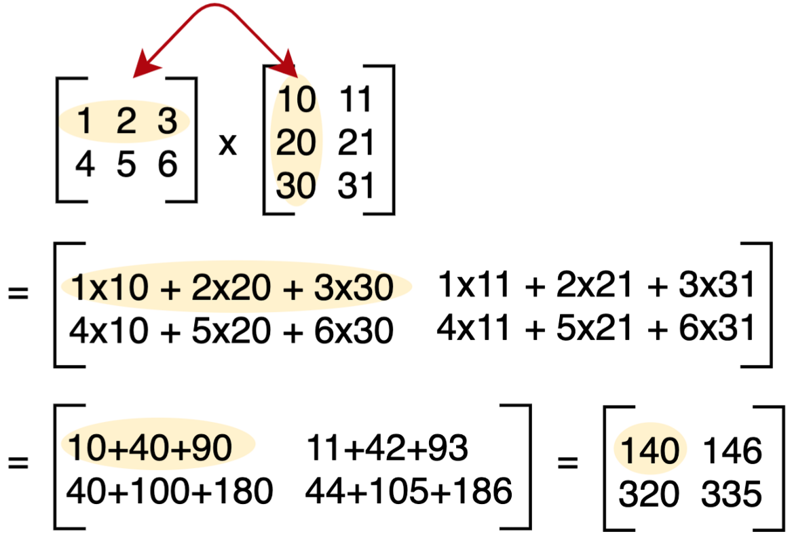
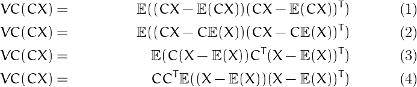
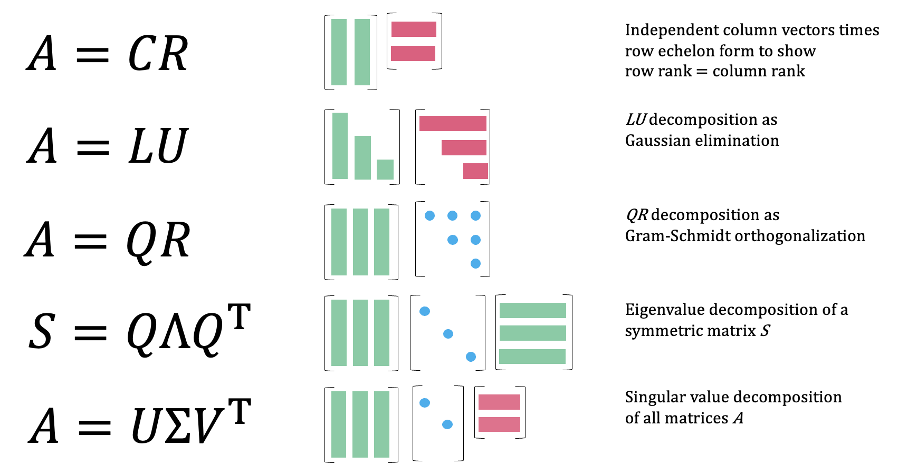

# Linear Algebra {#sec-math-linalg .unnumbered}

## Misc {#sec-math-linalg-misc .unnumbered}

-   Packages
    -   [{]{style="color: #990000"}[sparsevctrs](https://r-lib.github.io/sparsevctrs/index.html){style="color: #990000"}[}]{style="color: #990000"} - Sparse Vectors for Use in Data Frames or Tibbles
        -   Sparse matrices are not great for data in general, or at least not until the very end, when mathematical calculations occur.
        -   Some computational tools for calculations use sparse matrices, specifically the Matrix package and some modeling packages (e.g., xgboost, glmnet, etc.).
        -   A sparse representation of data that allows us to use modern data manipulation interfaces, keeps memory overhead low, and can be efficiently converted to a more primitive matrix format so that we can let Matrix and other packages do what they do best.
    -   [{]{style="color: #990000"}[quickr](https://github.com/t-kalinowski/quickr){style="color: #990000"}[}]{style="color: #990000"} - R to Fortran Transpiler
        -   Only atomic vectors, matrices, and array are currently supported: [integer]{.arg-text}, [double]{.arg-text}, [logical]{.arg-text}, and [complex]{.arg-text}.

        -   The return value must be an atomic array (e.g., not a list)

        -   Only a subset of R’s vocabulary is currently supported.

            ``` r
            #>  [1] !=        %%        %/%       &         &&        (         *        
            #>  [8] +         -         /         :         <         <-        <=       
            #> [15] =         ==        >         >=        Fortran   [         [<-      
            #> [22] ^         c         cat       cbind     character declare   double   
            #> [29] for       if        ifelse    integer   length    logical   matrix   
            #> [36] max       min       numeric   print     prod      raw       seq      
            #> [43] sum       which.max which.min {         |         ||
            ```

## Resources {#sec-math-linalg-resc .unnumbered}

-   [Crash Course in Matrix Algebra: A Refresher on Matrix Algebra for Econometricians with Implementation in R](https://matrix.svenotto.com/)
-   See Matrix Cookbook pdf in R \>\> Documents \>\> Mathematics
    -   derivatives, inverses, statistics, probability, etc.
-   [Link](http://facweb.cs.depaul.edu/sjost/csc423/documents/matrix-form.htm) - A lot of matrix properties as related to regression, covariance, coefficients, etc.
-   [EBOOK statistical linear algebra: basics, transformations, decompositions, linear systems, regression - Matrix Algebra for Educational Scientists](https://zief0002.github.io/matrix-algebra/index.html)
-   Video Course: [Linear Algebra for Data Science](https://www.youtube.com/playlist?list=PLB3yPBd26tWyDNoUpEGVsyI-sygPLqYa1) - Basics, Least Squares, Covariance, Regression, PCA, SVD
-   [Powered by Linear Algebra: The central role of matrices and vector spaces in data science by Matloff](https://matloff.github.io/WackyLinearAlgebra/Powered-by-Linear-Algebra.pdf)
    -   Delta Method, Regularized Regression, PCA, SVD, Attention

## Matrix Multiplication {#sec-math-linalg-matmult .unnumbered}

{.lightbox width="532"}

## Matrix Algebra {#sec-math-linalg-matalg .unnumbered}

-   An expected value equation (VC stands for variance-covariance in example) multiplied by a matrix, C.\
    {.lightbox width="532"}

    -   C is factored out of an expected value as C
    -   C is factored out of a transpose as CT

## Factorization {#sec-math-linalg-fact .unnumbered}

{.lightbox width="532"}

## Methods {#sec-math-linalg-meth .unnumbered}

### The Moore-Penrose Inverse

-   The Moore-Penrose inverse, often denoted as $A^+$, is a generalization of the ordinary matrix inverse that applies to *any* matrix, even those that are singular (non-invertible) or rectangular. It was independently developed by E.H. Moore and Roger Penrose.
-   [Generalized Inverse]{.underline}
    -   Unlike a regular inverse, which only exists for square, non-singular matrices, the Moore-Penrose inverse exists for all matrices. This is incredibly useful in situations where you have more equations than unknowns (overdetermined systems) or fewer equations than unknowns (underdetermined systems), or when your matrix is singular.
-   [Four Penrose Conditions]{.underline}
    -   The Moore-Penrose inverse $A^+$ of a matrix $A$ is uniquely defined by four conditions:
        1.  $A A^+ A = A$
        2.  $A^+ A A^+ = A^+$
        3.  $(A A^+)^T = A A^+$
        4.  $(A^+ A)^T = A^+ A$
-   [Least Squares Solution]{.underline}
    -   One of its most important applications is in finding the "best fit" (least squares) solution to a system of linear equations $Ax = b$. When an exact solution doesn't exist (e.g., in overdetermined systems), the Moore-Penrose inverse provides the $x$ that minimizes the Euclidean norm of the residual error, $\|Ax - b\|^2$. The solution is given by $x = A^+ b$. If there are multiple solutions (e.g., in underdetermined systems), it provides the solution with the minimum Euclidean norm $\|x\|^2$.
-   [Computation]{.underline}
    -   The most common and robust method for computing the Moore-Penrose inverse is through Singular Value Decomposition (SVD). If $A = U \Sigma V^T$ is the SVD of $A$, then $A^+ = V \Sigma^+ U^T$, where $\Sigma^+$ is obtained by taking the reciprocal of the non-zero singular values in $\Sigma$ and transposing the resulting matrix.

## Specialty Matrices {#sec-math-linalg-specmat .unnumbered}

-   Notes from [Derivatives, Gradients, Jacobians and Hessians – Oh My!](https://blog.demofox.org/2025/08/16/derivatives-gradients-jacobians-and-hessians-oh-my/)
-   [Jacobian\
    ]{.underline}\
    $$
    \begin{align}
    &v, w = f(x, y, z) \\
    &\mathbb{J} = 
    \begin{bmatrix}
    \frac{\partial v}{\partial x} & \frac{\partial v}{\partial y} & \frac{\partial v}{\partial z} \\
    \frac{\partial w}{\partial x} & \frac{\partial w}{\partial y} & \frac{\partial w}{\partial z}
    \end{bmatrix}
    \end{align}
    $$
    -   Also see (Video) [The Jacobian : Data Science Basics](https://www.youtube.com/watch?v=AdV5w8CY3pw) for it's usage in ML
    -   The gradient is calculated for v and the gradient is calculated for w. Then, the result is put into matrix.
    -   At a specific point in space (of whatever space the input parameters are in), it tells you how the space is warped in that location – like how much it is rotated and squished.
    -   The determinent of the Jacobian:
        -   $\gt 1$ : Things get bigger
        -   $\lt 1$ but $\gt 0$ : Things get smaller
        -   $\lt 0$ : Things get flipped
        -   $0$ : Things get squished to a point, and the matrix is *not* invertible
-   [Hessian]{.underline}\
    $$
    \begin{align}
    &w = f(x, y, z) \\
    &\mathbb{H} = 
    \begin{bmatrix}
    \frac{\partial^2 w}{\partial x^2} & \frac{\partial^2 w}{\partial xy} & \frac{\partial^2 w}{\partial xz} \\
    \frac{\partial^2 w}{\partial yx} & \frac{\partial^2 w}{\partial y^2} & \frac{\partial^2 w}{\partial yz} \\
    \frac{\partial^2 w}{\partial zx} & \frac{\partial^2 w}{\partial zy} & \frac{\partial^2 w}{\partial z^2}
    \end{bmatrix}
    \end{align}
    $$
    -   See
        -   [(Video) Visually Explained: Newton's Method in Optimization](https://www.youtube.com/watch?v=W7S94pq5Xuo)
        -   [(Slides) Analyzing the Hessian](https://web.stanford.edu/group/sisl/k12/optimization/MO-unit4-pdfs/4.10applicationsofhessians.pdf)
        -   [Quasi Newton Methods Part 1](https://www.youtube.com/watch?v=UvGQRAA8Yms)
    -   Taking the second derivative is taking partial derivatives (3 total, 1 w.r.t. each variable) of each partial derivative (3 total, 1 w.r.t. each variable) for a grand total of 9 partial derivatives.

## R {#sec-math-linalg-r .unnumbered}

-   [drop = TRUE]{.arg-text} (default): If [TRUE]{.arg-text} the result is coerced to the lowest possible dimension

    -   This only works for extracting elements, not for the replacement

    -   [Example]{.ribbon-highlight}:

        ``` r
        (m <- matrix(1:3, nrow = 3))
        #>      [,1]
        #> [1,]    1
        #> [2,]    2
        #> [3,]    3

        m[1:2,]
        #> [1] 1 2

        class(m[1:2,])
        #> [1] "integer"

        m[1:2, , drop = FALSE]
        #>      [,1]
        #> [1,]    1
        #> [2,]    2

        class(m[1:2, , drop = FALSE])
        #> [1] "matrix" "array" 

        rowSums(m[1:2,])
        #> Error in rowSums(m[1:2, ]) : 
        #>   'x' must be an array of at least two dimensions

        rowSums(m[1:2, , drop = FALSE])
        #> [1] 1 2
        ```

-   [Example]{.ribbon-highlight}: Difference between a column and a lag

    ::: panel-tabset
    ## Lag 1

    from blah blah

    Each column is a time step (e.g. day 1, day 2, day 3, etc.)

    ``` r
    set.seed(2026)

    (Y <- matrix(sample(1:18, 18), nrow = 3))
    #>      [,1] [,2] [,3] [,4] [,5] [,6]
    #> [1,]    1   15    4    2   14    9
    #> [2,]    6   11    5    8   18    7
    #> [3,]   13   12   10    3   16   17

    T <- ncol(Y)
    u <- 1 # lag 1

    Y[, 1:(T - u), drop = FALSE] 
    #>      [,1] [,2] [,3] [,4] [,5]
    #> [1,]    1   15    4    2   14
    #> [2,]    6   11    5    8   18
    #> [3,]   13   12   10    3   16

    Y[, (1 + u):T, drop = FALSE]
    #>      [,1] [,2] [,3] [,4] [,5]
    #> [1,]   15    4    2   14    9
    #> [2,]   11    5    8   18    7
    #> [3,]   12   10    3   16   17

    Y[, 1:(T - u), drop = FALSE] -
      Y[, (1 + u):T, drop = FALSE]
    #>      [,1] [,2] [,3] [,4] [,5]
    #> [1,]  -14   11    2  -12    5
    #> [2,]   -5    6   -3  -10   11
    #> [3,]    1    2    7  -13   -1
    ```

    -   Column 2 is subtracted from column 1. Column 3 is subtracted from column 2 and so on.
    -   [T]{.var-text} is number of columns which is the maximum number of lags we can calculate the difference for.

    ## Lag 2

    ``` r
    u <- 2 # lag 2

    Y[, 1:(T - u), drop = FALSE] 
    #>      [,1] [,2] [,3] [,4]
    #> [1,]    1   15    4    2
    #> [2,]    6   11    5    8
    #> [3,]   13   12   10    3

    Y[, (1 + u):T, drop = FALSE]
    #>      [,1] [,2] [,3] [,4]
    #> [1,]    4    2   14    9
    #> [2,]    5    8   18    7
    #> [3,]   10    3   16   17

    Y[, 1:(T - u), drop = FALSE] -
      Y[, (1 + u):T, drop = FALSE]
    #>      [,1] [,2] [,3] [,4]
    #> [1,]   -3   13  -10   -7
    #> [2,]    1    3  -13    1
    #> [3,]    3    9   -6  -14
    ```

    -   With the second lag, the total number of columns for each submatrix is 2 fewer than the original total. (It was 1 fewer for lag 1)
        -   This explains why the number of columns is the maximum number of lags

    ## Lag 3

    ``` r
    u <- 3 # lag 3

    Y[, 1:(T - u), drop = FALSE] 
    #>      [,1] [,2] [,3]
    #> [1,]    1   15    4
    #> [2,]    6   11    5
    #> [3,]   13   12   10

    Y[, (1 + u):T, drop = FALSE]
    #>      [,1] [,2] [,3]
    #> [1,]    2   14    9
    #> [2,]    8   18    7
    #> [3,]    3   16   17

    Y[, 1:(T - u), drop = FALSE] -
      Y[, (1 + u):T, drop = FALSE]
    #>      [,1] [,2] [,3]
    #> [1,]   -1    1   -5
    #> [2,]   -2   -7   -2
    #> [3,]   10   -4   -7
    ```

    ## NAs

    ``` r
    Y[2,2] <- NA
    Y
    #>      [,1] [,2] [,3] [,4] [,5] [,6]
    #> [1,]    1   15    4    2   14    9
    #> [2,]    6   NA    5    8   18    7
    #> [3,]   13   12   10    3   16   17 

    u <- 1 # lag 1

    Y[, 1:(T - u), drop = FALSE] 
    #>      [,1] [,2] [,3] [,4] [,5]
    #> [1,]    1   15    4    2   14
    #> [2,]    6   NA    5    8   18
    #> [3,]   13   12   10    3   16

    Y[, (1 + u):T, drop = FALSE]
    #>      [,1] [,2] [,3] [,4] [,5]
    #> [1,]   15    4    2   14    9
    #> [2,]   NA    5    8   18    7
    #> [3,]   12   10    3   16   17

    (diff <- Y[, 1:(T - u), drop = FALSE] - 
      Y[, (1 + u):T, drop = FALSE])
    #>      [,1] [,2] [,3] [,4] [,5]
    #> [1,]  -14   11    2  -12    5
    #> [2,]   NA   NA   -3  -10   11
    #> [3,]    1    2    7  -13   -1

    diff^2 
    #>      [,1] [,2] [,3] [,4] [,5]
    #> [1,]  196  121    4  144   25
    #> [2,]   NA   NA    9  100  121
    #> [3,]    1    4   49  169    1
    ```

    -   So [NA]{.arg-text} - number or vice-versa is [NA]{.arg-text}, and squaring the matrix shows that [NA^2^]{.arg-text} is [NA]{.arg-text}.
    :::
