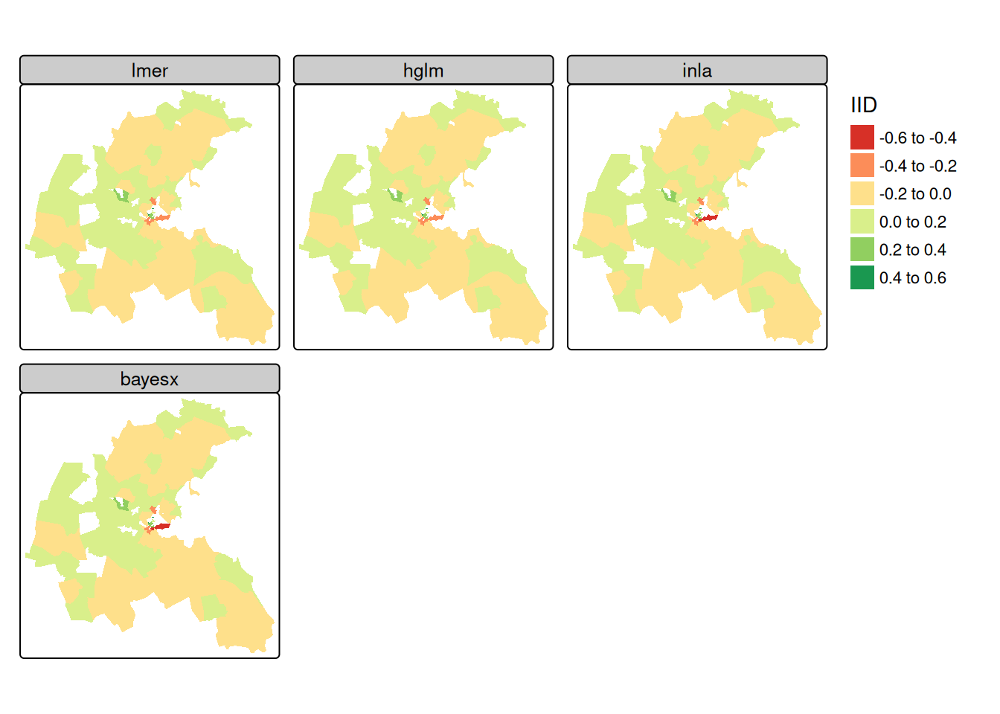
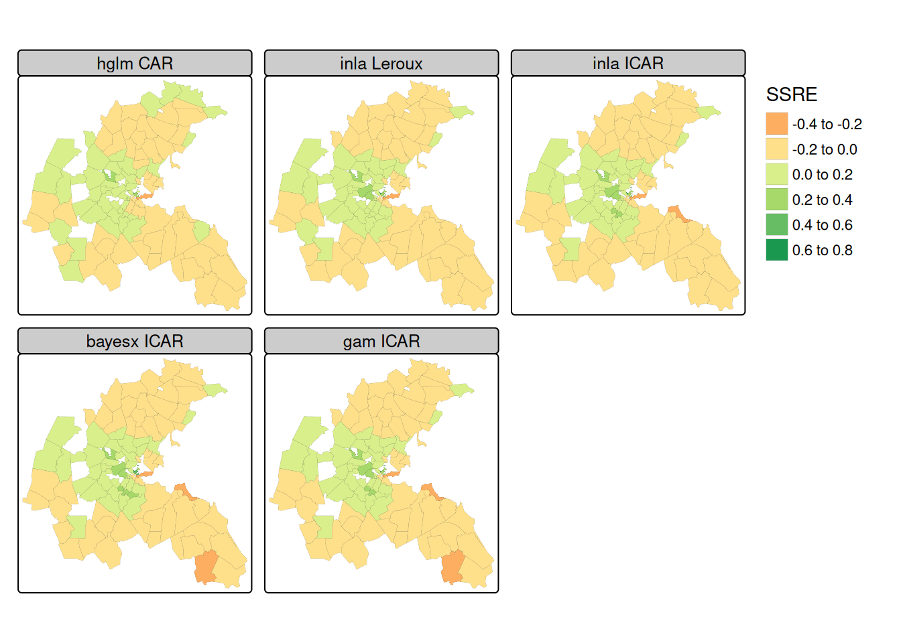

# Spatial {#sec-me-spat .unnumbered}

## Misc {#sec-me-spat-misc .unnumbered}

- Packages
  - [{]{style="color: #990000"}[CARBayesST](https://cran.r-project.org/web/packages/CARBayesST/index.html){style="color: #990000"}[}]{style="color: #990000"} ([Vignette](https://www.jstatsoft.org/article/view/v084i09)) - Spatio-Temporal **Generalized Linear Mixed Models** for Areal Unit Data
    - Binomial, Gaussian, or Poisson available
    - [A spatio-temporal Bayesian model to estimate risk and evaluate factors related to drug-involved emergency department visits in the greater Baltimore metropolitan area](https://www.sciencedirect.com/science/article/pii/S0740547221002609)
  - [{]{style="color: #990000"}[hglm](https://cran.r-project.org/web/packages/hglm/index.html){style="color: #990000"}[}]{style="color: #990000"} - Procedures for fitting hierarchical generalized linear models (HGLM).
    - Linear mixed models and generalized linear mixed models with random effects for a variety of links and a variety of distributions for both the outcomes and the random effects.
  - [{]{style="color: #990000"}[INLA](https://www.r-inla.org/home){style="color: #990000"}[}]{style="color: #990000"} - Integrated nested Laplace approximation (INLA) is a method for approximate Bayesian inference.
    - Alternative to other methods such as Markov chain Monte Carlo because of its speed and ease of use via the R-INLA package.
    - Although the INLA methodology focuses on models that can be expressed as latent Gaussian Markov random fields (GMRF), this encompasses a large family of models that are used in practice.
  - glmmTMB uses functions of the distance between observations, and fitted variograms to model the spatial autocorrelation present (haven't found an example using this package)
  - [{]{style="color: #990000"}[R2BayesX](https://cran.r-project.org/web/packages/R2BayesX/index.html){style="color: #990000"}[}]{style="color: #990000"} - Estimate structured additive regression (STAR) models with 'BayesX'.
- Notes from
  - Spatial Data Science, [Ch.16](https://r-spatial.org/book/16-SpatialRegression.html)

## Varying Intercepts {#sec-me-spat-vi .unnumbered}

- Uses a discrete location/id variable as the group variable (i.e. varying intercepts by location).
- Examples
  - [Example]{.ribbon-highlight}: Boston Housing Values ([SDS Ch. 16.2](https://r-spatial.org/book/16-SpatialRegression.html#sec-multilevel))

    - The lower level (census tract) dataset (no aggregation of variables) is used in these models
    - Since the [NOX]{.var-text} (air pollution) variable is measured at the higher geometry level ([NOX_ID]{.var-text}) and not the census tract level like the other covariates, the coefficient estimates for that variable are not useful, but looking at the random effects does provide some insight (See Visualization tab).

    ::: panel-tabset
    ## [{lme4}]{style="color: #990000"}

    This example shows how to fit the same model with four different packages

    See [Geospatial, Preprocessing \>\> Aggregations \>\> Examples](geospatial-processing.qmd#sec-geo-proc-agg-exs){style="color: green"} \>\> Example 3 for notes on the processing of this dataset.

    [NOX_ID]{.var-text} is the location variable (and grouping variable) for the measured NOX values.

    ``` r
    library(Matrix)
    library(lme4)

    form <- 
      formula(log(median) ~ CRIM + ZN + INDUS + CHAS + 
              I((NOX*10)^2) + I(RM^2) + AGE + log(DIS) +
              log(RAD) + TAX + PTRATIO + I(BB/100) + 
              log(I(LSTAT/100)))

    MLM <- 
      lmer(update(form, . ~ . + (1 | NOX_ID)),
           data = boston_487, 
           REML = FALSE)

    # random effects
    boston_93$MLM_re <- ranef(MLM)[[1]][,1]
    ```

    - Not sure why [{Matrix}]{#990000 style="\"color:"} needs to be loaded

    ## [{hglm}]{style="color: #990000"}

    ``` r
    library(hglm) |> suppressPackageStartupMessages()
    suppressWarnings(HGLM_iid <- hglm(fixed = form,
                                      random = ~1 | NOX_ID,
                                      data = boston_487,
                                      family = gaussian()))

    # random effects
    boston_93$HGLM_re <- unname(HGLM_iid$ranef)
    ```

    ## [{R2BayesX}]{style="color: #990000"}

    ``` r
    library(R2BayesX) |> suppressPackageStartupMessages()

    BX_iid <- 
      bayesx(update(form, . ~ . + sx(NOX_ID, bs = "re")),
             family = "gaussian", 
             data = boston_487,
             method = "MCMC", 
             iterations = 12000,
             burnin = 2000, 
             step = 2, 
             seed = 123)
    ```

    ## [{INLA}]{style="color: #990000"}

    ``` r
    library(INLA) |> suppressPackageStartupMessages()

    INLA_iid <- 
      inla(update(form, . ~ . + f(NOX_ID, model = "iid")),
           family = "gaussian", 
           data = boston_487)

    # random effects
    boston_93$INLA_re <- INLA_iid$summary.random$NOX_ID$mean
    ```

    ## Visualization

    {.lightbox width="532"}

    ``` r
    library(tmap)

    tm_shape(boston_93) +
      tm_polygons(fill = c("MLM_re", "HGLM_re", "INLA_re", "BX_re"),
          fill.legend = tm_legend("IID", frame=FALSE, item.r = 0),
          fill.free = FALSE, lwd = 0.01,
          fill.scale = tm_scale(midpoint = 0, values = "brewer.rd_yl_gn")) +
      tm_facets_wrap(columns = 2, rows = 2) + 
      tm_layout(panel.labels = c("lmer", "hglm", "inla", "bayesx"))                
    ```

    - The air pollution model output zone level IID random effects are very similar across the four model fitting functions reported.
    - The central downtown zones have stronger negative random effect values, but strong positive values are also found in close proximity; suburban areas take values closer to zero.
    :::

## Spatially Structured Random Effects {#sec-me-spat-ssre .unnumbered}

- Simultaneous Autoregressive (SAR), Conditional Autoregressive (CAR), and Intrinsic CAR (ICAR) models use spatially structured random effects

  - SAR, CAR, ICAR, and Leroux models have the same overall model formula but different random effects formulas

- Model Formula\

  $$\begin{align}
  &Y = X \beta + Zu \\
  &\text{where} \;\; u \sim\mathcal{N}(0, \sigma^2_u \; \Sigma)
  \end{align}$$

  - $\sigma^2_u \; \Sigma$ is the variance/covariance matrix of the random effects

- Random Effects ($u$) Formulas

  - SAR: $\Sigma^{-1} = (I-\rho W)'\;(I-\rho W)$
    - $W$ is a non-singular spatial weights matrix
    - $\rho$ is a spatial correlation parameter
  - CAR: $\Sigma^{-1} = (I-\rho W)$
    - $W$ is a symmetric and strictly positive definite spatial weights matrix
  - ICAR: $\Sigma^-1 = M = \text{diag}(n_i) - W$
    - $W$ is a symmetric and strictly positive definite spatial weights matrix
  - Leroux: $\Sigma^{-1} = (I-\rho)I_n + \rho M)$

- Examples

  - [Example]{.ribbon-highlight}: Boston Housing Values ([SDS Ch. 16.2](https://r-spatial.org/book/16-SpatialRegression.html#sec-multilevel))

    - The lower level (census tract) dataset (no aggregation of variables) is used in these models while the neighbor's list/spatial weights object used is created from a higher level geometry ([NOX_ID]{.var-text}) (i.e. the spatial relationship is modeled at the higher level)
    - Since the [NOX]{.var-text} (air pollution) variable is measured at the higher geometry level ([NOX_ID]{.var-text}) and not the census tract level like the other covariates, the coefficient estimates for that variable are not useful, but looking at the random effects does provide some insight (See Visualization tab).
    - Care is needed to match the indexing variable with the spatial weights. The neighbor's list object ([nb_q_93]{.var-text}) needs to get manipulated in some way in all these models in order for the spatial weights object to be in a suitable format for the particular model to accept.

    ::: panel-tabset
    ## [{hglm}]{style="color: #990000"} (CAR)

    See [Geospatial, Preprocessing \>\> Aggregations \>\> Examples](geospatial-processing.qmd#sec-geo-proc-agg-exs){style="color: green"} \>\> Example 3 for notes on the processing of this dataset.

    [NOX_ID]{.var-text} is the location variable (and grouping variable) for the measured NOX values.

    ``` r
    library(spatialreg)
    W <- as(spdep::nb2listw(nb_q_93, style = "B"), "CsparseMatrix")

    form <- 
      formula(log(median) ~ CRIM + ZN + INDUS + CHAS + 
              I((NOX*10)^2) + I(RM^2) + AGE + log(DIS) +
              log(RAD) + TAX + PTRATIO + I(BB/100) + 
              log(I(LSTAT/100)))

    suppressWarnings(
      HGLM_car <- 
        hglm(fixed = form,
             random = ~ 1 | NOX_ID,
             data = boston_487,
             family = gaussian(),
             rand.family = CAR(D = W))
    )

    # random effects
    boston_93$HGLM_ss <- HGLM_car$ranef[,1]
    ```

    ## [{R2BayesX}]{style="color: #990000"} (ICAR)

    ``` r
    library(R2BayesX)

    RBX_gra <- R2BayesX::nb2gra(nb_q_93)
    all.equal(row.names(RBX_gra), attr(nb_q_93, "region.id"))
    # [1] TRUE

    all.equal(unname(diag(RBX_gra)), spdep::card(nb_q_93))
    # [1] TRUE

    BX_mrf <- 
      bayesx(update(form, . ~ . + sx(NOX_ID, 
                                     bs = "mrf",
                                     map = RBX_gra)), 
             family = "gaussian", 
             data = boston_487,
             method = "MCMC", 
             iterations = 12000,
             burnin = 2000, 
             step = 2, 
             seed = 123)

    # random effects
    boston_93$BX_ss <- BX_mrf$effects["sx(NOX_ID):mrf"][[1]]$Mean
    ```

    ## [{INLA}]{style="color: #990000"} (ICAR)

    ``` r
    library(INLA) |> suppressPackageStartupMessages()

    ID2 <- as.integer(as.factor(boston_487$NOX_ID))

    INLA_ss <- 
      inla(update(form, . ~ . + f(ID2, 
                                  model = "besag",
                                  graph = W)),
           family = "gaussian", 
           data = boston_487)

    # random effects
    boston_93$INLA_ss <- INLA_ss$summary.random$ID2$mean
    ```

    ## [{INLA}]{style="color: #990000"} (Laroux)

    ``` r
    M <- Diagonal(nrow(W), rowSums(W)) - W
    Cmatrix <- Diagonal(nrow(M), 1) -  M

    INLA_lr <- 
      inla(update(form, . ~ . + f(ID2, 
                                  model = "generic1",
                                  Cmatrix = Cmatrix)),
           family = "gaussian", 
           data = boston_487)

    # random effects
    boston_93$INLA_lr <- INLA_lr$summary.random$ID2$mean
    ```

    ## [{mcgv}]{style="color: #990000"} (ICAR)

    ``` r
    library(mgcv)

    names(nb_q_93) <- attr(nb_q_93, "region.id")
    boston_487$NOX_ID <- as.factor(boston_487$NOX_ID)

    GAM_MRF <- 
      gam(update(form, . ~ . + s(NOX_ID, 
                                 bs = "mrf",
                                 xt = list(nb = nb_q_93))),
          data = boston_487, 
          method = "REML")

    # random effects
    ssre <- 
      predict(GAM_MRF, 
              type = "terms",
              se = FALSE)[, "s(NOX_ID)"]

    all(sapply(tapply(ssre, list(boston_487$NOX_ID), c),
               function(x) length(unique(round(x, 8))) == 1))
    # [1] TRUE

    # return the first value for each upper-level unit
    boston_93$GAM_ss <- aggregate(ssre, list(boston_487$NOX_ID), 
                                  head, n=1)$x
    ```

    - The upper-level random effects may be extracted by predicting terms
    - The values in all lower-level tracts belonging to the same upper-level air pollution model output zones are identical

    ## Visualization

    {.lightbox width="532"}

    ``` r
    library(tmap)

    tm_shape(boston_93) +
      tm_polygons(fill = c("HGLM_ss", "INLA_lr", "INLA_ss", "BX_ss", 
              "GAM_ss"),
          fill.legend = tm_legend("SSRE", frame=FALSE, item.r = 0),
          fill.free = FALSE, lwd = 0.1,
          fill.scale = tm_scale(midpoint = 0, values = "brewer.rd_yl_gn")) +
      tm_facets_wrap(columns = 3, rows = 2) + 
      tm_layout(panel.labels = c("hglm CAR", "inla Leroux",
               "inla ICAR", "bayesx ICAR", "gam ICAR"))
    ```

    - The spatially structured random effects are also very similar to each other
      - The SAR spatial smooth is perhaps a little smoother than the CAR smooths when considering the range of values taken by the random effect term.
    - The central downtown zones have stronger negative random effect values, but strong positive values are also found in close proximity; suburban areas take values closer to zero.
    :::
