# ML Monitoring {#sec-prod-mlmon .unnumbered}

## Misc {#sec-prod-mlmon-misc .unnumbered}

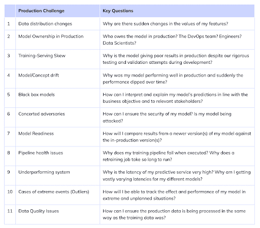{.lightbox width="532"}

-   Packages

    -   [{]{style="color: #990000"}[datareportR](https://cran.r-project.org/web/packages/datareportR/index.html){style="color: #990000"}[}]{style="color: #990000"} - Generates an RMarkdown data report with two components: a summary of an input dataset and a diff of the dataset relative to an old version.
    -   [{]{style="color: #990000"}[dispersionIndicators](https://cran.r-project.org/web/packages/dispersionIndicators/index.html){style="color: #990000"}[}]{style="color: #990000"} - Indicators for the Analysis of Dispersion of Datasets with Batched and Ordered Samples. Designed to facilitate robust statistical assessment of data variability with indicators based on convex hull or integrated covariance Mahalanobis. Supports applications in exploratory data analysis and quality control.
    -   [{]{style="color: #990000"}[TrustworthyMLR](https://cran.r-project.org/web/packages/TrustworthyMLR/index.html){style="color: #990000"}[}]{style="color: #990000"} - Stability and Robustness Evaluation for Machine Learning Models
        -   Computes a Stability Index that quantifies the consistency of model predictions across multiple runs or resamples, and a Robustness Score that measures model resilience under small input perturbations.

-   Notes from

    -   https://blog.anomalo.com/effective-data-monitoring-8bce3ddf87b4
    -   <https://eugeneyan.com/writing/practical-guide-to-maintaining-machine-learning/?utm_campaign=Data_Elixir&utm_medium=social>
    -   <https://towardsdatascience.com/the-playbook-to-monitor-your-models-performance-in-production-ec06c1cc3245>
    -   [Inferring Concept Drift Without Labeled Data](https://concept-drift.fastforwardlabs.com/)

-   Example: RStudio Connect and [{pins}]{style="color: #990000"} ([article](https://www.rstudio.com/blog/model-monitoring-with-r-markdown/))

    -   Deploy a model as a RESTful API using Plumber
    -   Create an R Markdown document to regularly assess model performance by:
        -   Sending the deployed model new observations via httr
        -   Evaluating how the model performed with these new predictions using model metrics from yardstick
        -   Versioning the model metrics using the pins package
        -   Summarize and visualize the results using flexdashboard
    -   Schedule the R Markdown dashboard to regularly evaluate the model and notify us of the results

-   DL Monitoring points\
    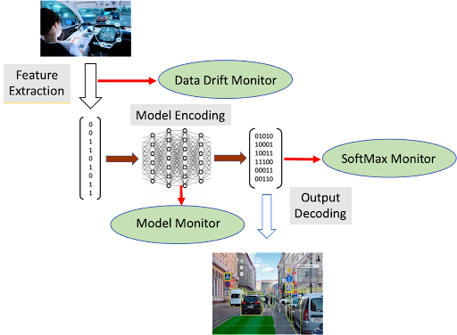{.lightbox width="432"}

    -   Data Drift Monitor and SoftMax Monitor (i.e. monitor prediction metrics) are typical of any monitoring system
    -   Model Monitor is an auxiliary model (or models) trained to recognize basic patterns that emerge in the baseline operations of the primary model.
        -   Example: monitor the values of normalized outputs of various layers within the model.
            -   These values could be input to a neural network trained to distinguish the patterns of normal operation from out-of-range examples included in the training set. This model monitor could then flag potential drift during operation of the primary system

## Data Drift {#sec-prod-mlmon-ddrift .unnumbered}

-   (AKA Covariate Shift) Refers to changes in the statistical distribution of the inputs to your model — the features. Distributions change but relationships between features remain. The model itself hasn't changed, but the world it's seeing has.
    -   [Example]{.ribbon-highlight}: Fraud
        -   A fraud detection model was trained on 2020 transaction data and consumer spending patterns. That data shifts significantly by 2024, and the feature distributions at inference time no longer match what the model was trained on.

### Data Requirements {#sec-prod-mlmon-ddrift-datreq .unnumbered}

-   If customer facing, then the data should be that which is necessary to calculate service level indicators (SLI), which will help the company keep its customer obligations outlined in the service level agreement (SLA) (see [link](https://www.atlassian.com/incident-management/kpis/sla-vs-slo-vs-sli) for more details)
-   Types of data to log:
    -   Unique ID per request provided by the system that called the ML model. This unique identifier will be stored with each log and will allow us to follow the path of a prediction before, during, and after the ML model
    -   Input features before feature engineering
    -   Input features after feature engineering
    -   Output probabilities
    -   Predicted value
-   Data size required to accurately measure a metric
    -   How many observations do I need so that I know the metric I'm measuring is accurate?
    -   Depends on the metric and threshold for the accuracy of that metric
    -   [Example]{.ribbon-highlight}:
        -   Classification with imbalanced dataset; 1/100 is a positive event
        -   Recall = 90%: the model should get 90% of all true positives correct
        -   Threshold (aka shot noise) = 0.1%: the maximum error in measuring recall is 0.1%, so a model with 90.0009% recall would trigger a model retrain
        -   `shot_noise <- ((pos_rate * data_size) * (1 - recall)) / data_size`
            -   Note: data_size cancels out, so this may be an optimization problem rather than a closed-form solution
-   Limiting tests to the most recent data can reduce data warehouse costs

### Data Collection {#sec-prod-mlmon-ddrift-datcol .unnumbered}

-   [Ground Truth Latency]{.underline}
    -   How long does it take to know if your prediction was right?
        -   Realtime / near realtime
            -   Examples: stocks, gambling, food delivery time estimates, digital advertising
            -   Able to determine whether there's an issue with your model almost immediately
        -   Delayed
            -   Example: credit card fraud
            -   Requires monitoring of proxy metrics (metrics associated with the ground truth) until ground truth arrives
    -   If predictions result in an intervention, it will be difficult to determine drift
        -   Example: a patient is determined to be at high risk by a model, gets treated by a clinician, and lives. Was this a false positive by the model, or was the model correct and the intervention caused the patient to live?
-   [Problematic Ground Truth Types]{.underline}
    -   Biased
        -   Example: loan default model — the ground truth only includes results from customers who were approved for a loan, so there's no information about whether a denied applicant would have repaid
        -   Solution: An occasional A/B test where a control group of customers is not subject to model predictions vs. a treatment group that is
    -   Little, zero, or sporadic ground truth feedback
        -   Requires monitoring of proxy metrics (metrics associated with the ground truth)
        -   Manual collection of ground truth data
            -   Can be expensive, but high-quality ground truth data is very important

### Architectures {#sec-prod-mlmon-ddrift-arch .unnumbered}

-   [Example]{.ribbon-highlight}: [How to Build a Fully Automated Data Drift Detection Pipeline](https://towardsdatascience.com/how-to-build-a-fully-automated-data-drift-detection-pipeline-e9278584e58d)

    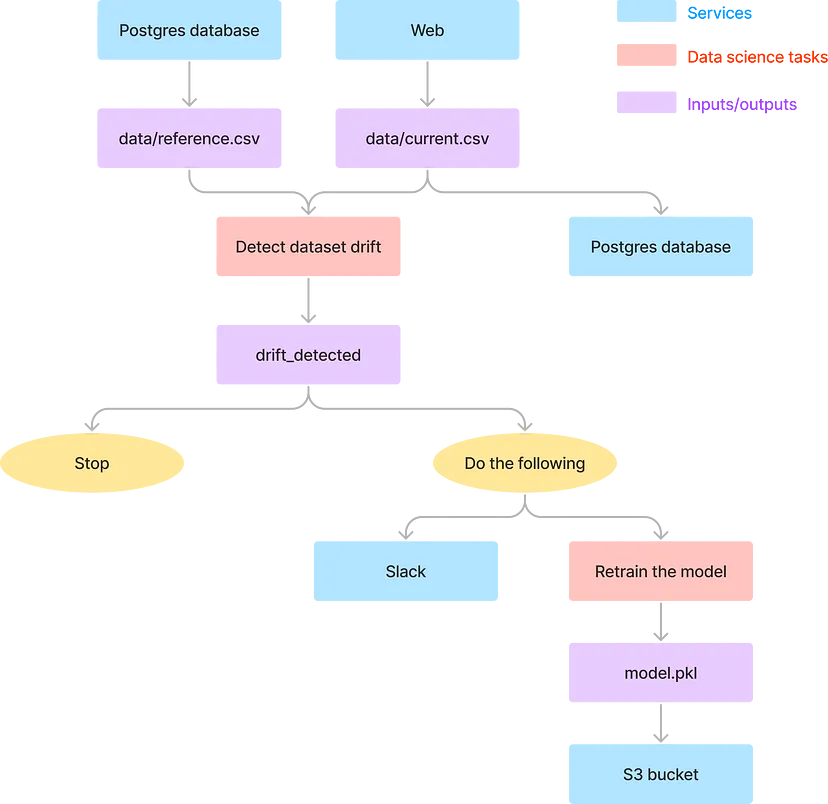{.lightbox width="632"}

    -   Uses Kestra for orchestration
    -   Example relies on scheduled data pulls for detecting drift. Kestra can make use of Graphana to create a real-time detection pipeline.

### Tracking Distribution Distance Metrics {#sec-prod-mlmon-ddrift-trdm .unnumbered}

-   Track distance metrics between reference variable distribution and a production variable distribution
    -   The production variable distributions should include feature variable data entering the pipeline and prediction output from the models
    -   Upward trends in the distance between baseline and operational data distributions can be the basis of data drift detection
-   Potential reference distributions (i.e. monitoring window):
    -   Fixed time window (distribution doesn't change). Examples:
        -   Training distribution
        -   Validation/test set distribution
        -   Initial model deployment distribution (or a time when the distribution was thought to be stable)
    -   Moving time window (distribution can change)
        -   Example: last week's input data vs. this week's input data
    -   Considerations:
        -   *Representation differences:* Class ratios across windows may not be the same (e.g., the fraction of positives in one window may be very different from the fraction in another)
        -   *Varying sample sizes:* The number of data points in each window may vary (e.g., fewer requests on a Sunday than a Monday)
        -   *Delayed feedback:* Due to reasonable events (e.g., loss of Internet connection), labels may arrive with a lag, making it impossible to factor unlabeled predictions into the current window's evaluation metric

## Distribution Distance Metrics {#sec-prod-mlmon-ddmet .unnumbered}

### Misc {#sec-prod-mlmon-ddmet-misc .unnumbered}

-   Packages
    -   [{]{style="color: #990000"}[philentropy](https://drostlab.github.io/philentropy/){style="color: #990000"}[}]{style="color: #990000"} has a ton of distribution distance measures + some helper functions.
    -   [{]{style="color: goldenrod"}[cinnamon](https://github.com/zelros/cinnamon){style="color: goldenrod"}[}]{style="color: goldenrod"} - Tools to detect, explain, and correct data drift in a machine learning system
        -   Handles py models and calculates wasserstein and kolmogorov-smirnov
    -   [{]{style="color: #990000"}[KSgeneral](https://CRAN.R-project.org/package=KSgeneral){style="color: #990000"}[}]{style="color: #990000"} ([Paper](https://www.jstatsoft.org/article/view/v095i10)) can perform KS tests between continuous, mixed, or discrete distributions
        -   See [Distributions \>\> Tests](distributions.html#sec-distr-tests){style="color: green"} for more details on kolmogorov-smirnov
        -   Paper: [Two-sample KS test with approxQuantile in Apache Spark](https://arxiv.org/abs/2312.09380) provides code that uses Spark's `approxQuantile` to perform a (currently) unavailable 2-sample KS test in Spark for big data situations.
    -   [{]{style="color: #990000"}[RenyiExtropy](https://cran.r-project.org/web/packages/RenyiExtropy/index.html){style="color: #990000"}[}]{style="color: #990000"} - Provides functions to compute Shannon entropy, Renyi entropy, Tsallis entropy, and related extropy measures for discrete probability distributions.
        -   Includes joint and conditional entropy, KL divergence, Jensen-Shannon divergence, cross-entropy, normalized entropy, and Renyi extropy (including the conditional and maximum forms).
-   Other measures
    -   Kullback-Leibler Divergence (KL Divergence)
    -   Wasserstein's Distance
        -   See this [article](https://www.r-bloggers.com/2022/09/kantorovich-distance-with-the-ompr-package/) for examples of computing wasserstein (aka Kantorovich) distance in R, py, Julia.
    -   [SHAP for Drift Detection: Effective Data Shift Monitoring](https://towardsdatascience.com/shap-for-drift-detection-effective-data-shift-monitoring-c7fb9590adb0): feeds the distribution of SHAP values into a logistic regression, then applies a KS test on probability predictions for `Y==1`, `Y==0`

### Population Stability Index (PSI) {#sec-prod-mlmon-ddmet-psi .unnumbered}

-   Compares a reference distribution (e.g. training data) to a production distribution for a given variable, binning the data and measuring how much the bin proportions have shifted.
-   Packages
    -   [{]{style="color: #990000"}[distantia](https://github.com/BlasBenito/distantia){style="color: #990000"}[}]{style="color: #990000"} - Qantifies dissimilarity between time series (includes psi)
-   Formula\
    $$
    \text{PSI} = \sum_i (p_{i,\text{prod}}-p_{i,\text{ref}}) \times \ln \left(\frac{p_{i,\text{prod}}}{p_{i,\text{ref}}}\right)
    $$
    -   $i \in$ `length(bins)`
    -   p is the percent of total observations in bin i
    -   ref is the reference variable
    -   prod is the production variable
-   Misc
    -   Notes from
        -   [Population Stability Index \| Matthew's Blog](https://mwburke.github.io/data%20science/2018/04/29/population-stability-index.html)
        -   [Checking model stability and population shift with PSI and CSI](https://towardsdatascience.com/checking-model-stability-and-population-shift-with-psi-and-csi-6d12af008783)
    -   Often seen in the finance industry
    -   For both numeric and categorical features
    -   Sometimes referred to as Characteristic Stability Index (CSI) when used on predictor variables
-   Steps
    1.  Divide the reference variable variable range into 10 bins (arbitrary but seems to be common) or however many bins you want depending on how fine a resolution you want.
        -   For categorical variables, the levels can be used as bins or levels can be collapsed into fewer bins
        -   Continuous
            -   Slicing the *range* of the reference variable into sections of the same interval length
            -   Slicing the reference variable into *quantiles* where each bin has the same number of observations
    2.  Count the number of values in each of those bins.
    3.  Divide each bin count by the sample size to get a percentage
    4.  Repeat for the production variable
    5.  Calculate PSI
-   Guidelines Also see Thresholds section above from https://scholarworks.wmich.edu/cgi/viewcontent.cgi?article=4249&context=dissertations\
    .png)
    -   N is reference sample size and M is production sample size (although it's symmetric so doesn't matter which you column/row you use for each)
    -   B is the number of bins used.
    -   Cells have the PSI values for 95% level significance
    -   PSIs \>= the appropriate cell value can reliably be interpreted that a shift in the variable distribution has occurred.
    -   See paper tables in Appendix B for other significance levels and B values. Can also use a chisq distribution.
-   Example: Model Predictions\
    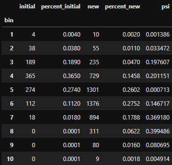\
    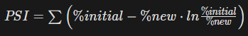
    -   Equation is slightly different but may be equivalent
        -   initial - model predictions that are used as a reference (e.g. predictions from when current model first went into production)
        -   new - current model predictions
    -   Average PSI is used to represent the model
    -   Guidelines
        -   PSI \< 0.1 = The population hasn't changed, and we can keep the model
        -   0.1 ≤ PS1 \< 0.2 = The population has slightly changed, and it is advisable to evaluate the impacts of these changes
        -   PSI ≥ 0.2 = The changes in population are significant, and the model should be retrained or even redesigned.
-   Example from [arize ai](https://arize.com/take-my-drift-away/) (model monitoring platform)\
    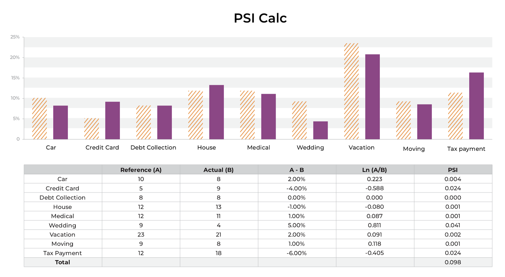{.lightbox width="632"}
    -   A comparison in the distributions of how a person spent their money this last year as compared to the year prior
        -   Y-axis represents the percentage of the total money spent in each category, as denoted on the X-axis.
    -   Steps
        -   Calculate the difference in percentage between the reference distribution A (budget last year) and the actual distribution B (budget this year)
        -   Multiply that difference by the natural log of (A %/ B%)
    -   The larger the PSI, the less similar your distributions are.
    -   You can set up thresholding alerts on the drift in your distributions.

### Jensen-Shannon Divergence {#sec-prod-mlmon-ddmet-jsi .unnumbered}

-   Statisticallly (compared to PSI) quantifies how different two probability distributions are. The metric is symmetric, bounded, and derived from KL divergence.

-   Misc

    -   Notes from <https://docs.aws.amazon.com/sagemaker/latest/dg/clarify-data-bias-metric-jensen-shannon-divergence.html>
    -   Also see [How to Understand and Use the Jensen-Shannon Divergence](https://towardsdatascience.com/how-to-understand-and-use-jensen-shannon-divergence-b10e11b03fd6) (Haven't read but looks more in-depth)

-   Formula

    $$
    \begin{aligned}
    &\text{JS} = 0.5(\text{KL}(p_{\text{ref}}\;||\; p_{\text{mix}}) + \text{KL}(p_{\text{prod}}\;||\; p_{\text{mix}})) \\
    &\begin{aligned}
    \text{where} \;\; &p_{\text{mix}} = 0.5(p_{\text{ref}} + p_{\text{prod}}) \;\; \text{and} \\
    & \text{KL}(p_{\text{ref}}\;||\; p_{\text{mix}}) = \sum_i p_{i,\text{ref}} \log\left(\frac{p_{i,\text{ref}}}{p_{\text{mix}}}\right)
    \end{aligned}
    \end{aligned}
    $$

    -   $i \in$ `length(bins)`
    -   $p$ is the percent of total observations in bin $i$
    -   Similar for $\text{KL}(p_{\text{prod}}\;||\; p_{\text{mix}}))$

-   Steps: Same preparation steps as with the PSI distance metric (binning, proportions, etc.)

-   Symmetric version of K-L divergence (See [Information Theory\>\> K-L Divergence](information-theory.qmd#sec-infothy-kldiv){style="color: green"} which means it satisfies the triangle inequality which means it's a true distance metric

-   FYI using $\log_2$ means KL is in units of "bits" and using $\ln$ means KL is in "nats"

-   The range of JS values for binary, multicategory, continuous outcomes

    -   Using $ln$, $\text{JS} \in [0, \ln(2) \approx 0.693]$
    -   Using $\log_2$, $\text{JS} \in  [0, 1]$ Values near zero mean the labels are similarly distributed.

-   Positive values mean the label distributions diverge, the more positive the larger the divergence.

-   Supposedly the usage of the mixture reference makes this an unstable metric for using a moving window. It makes the JS score not comparable to past values.

    -   Seems like all moving window reference distributions, mixed or not, will have some variability to it, but maybe this produces extra variability that makes it unreliable.

### Metric Thresholds {#sec-prod-mlmon-ddmet-thresh .unnumbered}

-   Answers how large should your metric be before it can be called a meaningful drift signal.
-   See [Automating Data Drift Thresholding in Machine Learning Systems](https://towardsdatascience.com/automating-data-drift-thresholding-in-machine-learning-systems-524e6259f59f)
    -   Note: the author coded the impractical solution and did not code the preferred solution
-   **Computationally intensive method (may not be practical)**
    -   Bootstrap or MC simulate the feature at the size of the production dataset (or whatever amount of data you're going to test for drift)
    -   For each simulation, measure the drift (e.g. PSI, JS Divergence) between the simulated dataset and the training dataset
    -   Threshold = mean(drift) of all simulations; if any production/inference dataset has a drift \> threshold, trigger an alert
-   **Closed-form method for PSI**
    -   Supposedly can be calculated for other distance measures as well
    -   Final solution for the threshold 🥴\
        $$
        = \sum_{k}^{K} P_k \left( \log P_k - \psi(\alpha_k) + \psi \left( \sum_j^K \alpha_j \right) \right) + \frac{\alpha_k \left( \log \left( \frac{\alpha_k}{\sum_j^K \alpha_j} \right) - \log P_k \right)}{\sum_j^K \alpha_j}
        $$
        -   $K$ is the number of bins (numeric) or levels (categorical)
        -   $P_k$ is the percentage of total *training* observations equal to level $K$, or the percent of total training observations in bin $K$
        -   $\alpha_k = 1 + N_q + P_k$
            -   $N_q$ = sample size of the production/inference set $Q$; should be a constant for all $K$
            -   Note: the author used lowercase $p_k$ here instead of $P_k$; may want to double-check whether they are the same
        -   $\psi$ is the digamma function

## NLP Monitoring {#sec-prod-mlmon-nlpm .unnumbered}

-   Packages
    -   [{]{style="color: goldenrod"}[evidently](https://github.com/evidentlyai/evidently){style="color: goldenrod"}[}]{style="color: goldenrod"}
-   Notes from [Monitoring NLP models in production](https://towardsdatascience.com/monitoring-nlp-models-in-production-ac65745772cf)
-   Descriptive Statistics
    -   Features: length of text, out-of-vocabulary (OOV) words %, and the share of non-letter character %

    -   Example:

        ``` python
        column_mapping = ColumnMapping() 
        column_mapping.target = 'is_positive'        # binary target
        column_mapping.prediction = 'predict_proba'  # predicted probabilities
        column_mapping.text_features = ['review']    # text feature

        data_drift_report = Report( 
            metrics=[ 
                ColumnDriftMetric('is_positive'),
                ColumnDriftMetric('predict_proba'), 
                TextDescriptorsDriftMetric(column_name='review'), # text feature
            ] 
        ) 
        data_drift_report.run(reference_data=reference, 
                              current_data=valid_disturbed, 
                              column_mapping=column_mapping) 
        data_drift_report
        ```

        -   Stat tests on distributions are performed (e.g. K-S test) with p-values given
        -   Other drill down charts are provided if drift is detected
-   Domain Classifier
    -   [{evidently}]{style="color: goldenrod"} [article](https://www.evidentlyai.com/blog/evidently-data-quality-monitoring-and-drift-detection-for-text-data)
        -   Builds a binary classifier model to predict with the text feature data came from the reference dataset (1) or the current dataset (0)

        -   The ROC AUC of the binary classifier shows if the drift is detected. If a model can reliably identify the samples that belong to the current or reference dataset, the two datasets are probably sufficiently different.

        -   Can be biased if there are time related text (e.g. month names or dates)(makes it easier for the classifier), but these can be detected by looking at feature importance plot and looking for date/time related tokens

        -   If drift is detect, you can drill down further

            -   Typical words in the current and reference dataset - These words are most indicative when predicting which dataset a specific review belongs to.
            -   Examples of texts - from current and reference datasets that were the easiest for a classifier to label correctly (with predicted probabilities being very close to 0 or 1).

        -   Example

            ``` python
            data_drift_dataset_report = Report(metrics=[ 
                ColumnDriftMetric(column_name='review') 
            ]) 
            data_drift_dataset_report.run(reference_data=reference, 
                                          current_data=new_content, 
                                          column_mapping=column_mapping) 
            data_drift_dataset_report
            ```
-   Invariance testing
    -   Tests whether an ML model produces consistent results under different conditions
    -   See [{]{style="color: goldenrod"}[behave](https://github.com/behave/behave){style="color: goldenrod"}[}]{style="color: goldenrod"}, [Write Readable Tests for Your Machine Learning Models with Behave](https://towardsdatascience.com/write-readable-tests-for-your-machine-learning-models-with-behave-ec4a27b91490)
    -   [Example]{.ribbon-highlight}\
        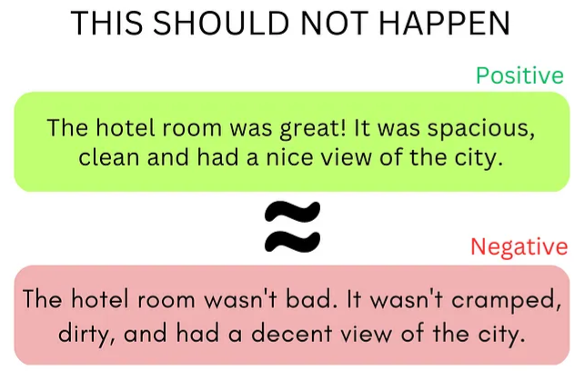{.lightbox width="332"}
-   Directional Testing
    -   Statistical method used to assess whether the impact of an independent variable on a dependent variable is in a particular direction, either positive or negative.
    -   For NLP, this test checks whether the presence of a specific word has a positive or negative effect on the sentiment score of a given text.
    -   See [{]{style="color: goldenrod"}[behave](https://github.com/behave/behave){style="color: goldenrod"}[}]{style="color: goldenrod"}, [Write Readable Tests for Your Machine Learning Models with Behave](https://towardsdatascience.com/write-readable-tests-for-your-machine-learning-models-with-behave-ec4a27b91490)
    -   [Example]{.ribbon-highlight}\
        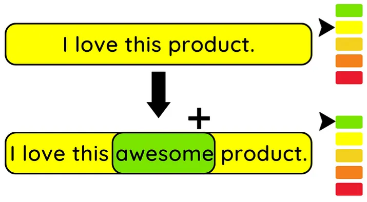{.lightbox width="332"}
        -   Sentiment score should increase due to the new word's ("awesome")\_ presence

## Investigating Data Drift {#sec-prod-mlmon-invdd .unnumbered}

-   If feature distributions change, it may be something else besides a true data generating process (dgp) shift.
    -   Check for pipeline: code infrastructure, processing, data sources, hardware, and input model issues. (see below for details)
-   Questions
    -   Which features are drifting?
    -   How strongly?
        -   May require domain expert to determine whether there are substantial changes in associations
    -   What's the process behind it?
        -   Examples
            -   A change in the socio-economic relations, such as inflation, diseases, or political changes;
            -   Unaccounted events, such as holidays, world cups, or even natural disasters;
            -   The entrance of a new competitor in the market, and/or the shift of customers;
            -   Changes in the offered product, or the marketing campaign.
-   Actions
    -   Data Pipeline: fix it
    -   Drift Severity:
        -   Low to Moderate: Leave it alone and see if the model handles it or gets worse
        -   High or Meaningful: Retraining the model should suffice
    -   Additional actions (may need if new labels/target variable data isn't immediately available)
        -   Take the component of the application that uses the model offline (e.g remove recommendations for website)
        -   Make a human do what the model was doing (e.g. insurance claims processing, manufacturing quality control, or sales lead scoring)
        -   Rule-based approach: You can often design a set of rules or heuristics that will be less precise but more robust than a rogue model. (e.g. simply show the most popular items to all customers)
        -   Add business logic or an adjustment on top of the model output
            -   Probably won't generalize well so should be context specific
-   Code infrastructure
    -   Wrong source - A pipeline points to an older version of the marketing table, or there is an unresolved version conflict.
    -   Lost access - Someone moved the table to a new location but did not update the permissions.
    -   Broken queries - These JOINSs and SELECTs might work well until the first complication. Say, a user showed up from a different time zone and a new category of time zone is in the data. Some queries might not hold up.
    -   Infrastructure update - You got a new version of a database and some automated spring cleaning. Spaces replaced with underscores, all column names in lowercase. All looks fine until your model wants to calculate its regular feature as "Last month income/Total income" with hard-coded column titles.
-   Processing
    -   Broken feature code - For instance, the promo discounts were never more than 50% in training. Then marketing introduces a "free" offer and types 100% for the first time. Some dependent feature code suddenly makes no sense and returns negative numbers.
    -   Dealing with outliers and missing values
        -   Notes from <https://towardsdatascience.com/why-data-integrity-is-key-to-ml-monitoring-3843edd75cf5>
        -   Skip the prediction or have a back-up system
            -   For models that make a large number of non-critical decisions (e.g. product recommendation), if the data is bad, the serving system can skip the prediction to avoid erroring out or making an inaccurate prediction.
            -   For models that make business or life-critical decisions (e.g. healthcare), there needs to be a backup decision-making system to ensure an outcome. However, these backup systems can further complicate the solution.
        -   Impute or predict missing values
            -   Consistently replacing bad data can shift the expected feature's distribution (aka data drift) causing the model to degrade. A drift as a result of this data replacement could be very difficult to catch, impacting the model's performance slowly over time.
        -   Set default values
            -   When the value is out of range, it can be replaced by a known high or low or unique value, e.g. replacing a very high or low age with the closest known minimum or maximum value. This can also cause gradual drift over time impacting performance.
        -   Acquire missing data
            -   In some critical high value use cases like lending, ML teams also have the option to acquire the missing data to fill the gap. This is not typical for the vast majority of use cases.
        -   Do nothing
            -   It allows for bad data to surface upstream or downstream so that the problem behind it can be resolved. (Recommended)
            -   A prediction made on bad data can show up as an outlier of either the output or the impacted input helping surface the issue.
-   Data source
    -   New data formats, types, and schemas
        -   An update in the original business system leads to a change of unit of measurements (think Celsius to Fahrenheit) or dates formats (DD/MM/YY or MM/DD/YY?)
        -   New product features in the application add the telemetry that the model never trained on.
        -   There is a new 3rd party data provider or API, or an announced change in the format.
    -   The website being scraped changes urls or webpage format
-   Hardware
    -   Sensor breaks, Server goes down
    -   Data collection can stop or the data that's collected could be corrupted
-   Input model
    -   A model's results that are used as inputs to another model
    -   Would need to determine if it was model drift or data drift

## Model Drift {#sec-prod-mlmon-mdrift .unnumbered}

### Misc {#sec-prod-mlmon-mdrift-misc .unnumbered}

-   (AKA Concept Drift) Refers to a change in the underlying relationship between inputs and outputs — the thing the model was trying to learn has changed in the real world. Distributions might remain similar, but the relationships change instead: in between the features, or between the features and the model output.
    -   Relies more on the performance monitoring and ground truth tracking strategies
    -   [Example]{.ribbon-highlight}: Fraud
        -   Fraudsters have changed their tactics so that the behavioral patterns that used to indicate fraud no longer do. Even if the input distributions look the same, the correct mapping from inputs → fraud/not-fraud has shifted.
-   Notes from
    -   [Getting a Grip on Data and Model Drift with Azure Machine Learning](https://towardsdatascience.com/getting-a-grip-on-data-and-model-drift-with-azure-machine-learning-ebd240176b8b)
    -   <https://towardsdatascience.com/why-data-integrity-is-key-to-ml-monitoring-3843edd75cf5>
-   Identifying issues and retraining models will minimize losses
    -   Deviations between baseline and production distributions
    -   Feature and cohort performance
-   ML transparency regulation requires understanding why a model made a particular prediction to ensure broader governance, fairness, and mitigate bias
    -   Keep track of predictions by group
-   If you are dealing with a high-risk domain, it is best to design model fallbacks from the get-go in case of model failure from broken code, concept drift, etc.
    -   Examples:
        -   Make a human do what the model was doing (e.g. insurance claims processing, manufacturing quality control, or sales lead scoring)
        -   Rule-based approach: You can often design a set of rules or heuristics that will be less precise but more robust than a rogue model (e.g. simply show the most popular items to all customers)

### Performance Monitoring {#sec-prod-mlmon-mdrift-perfmon .unnumbered}

-   [Measuring Precision and Recall]{.underline}
    -   Actions taken by model:
        -   *Soft Actions*: Events are flagged for humans to take action
        -   *Hard Actions*: Events are flagged and actions are automatically taken by an algorithm
    -   Precision: ratio of positive predictions that are correct ($\text{Precision} = TP / (TP + FP)$)
        -   *Soft Action models*: Record human decisions that are made on the flagged events
        -   *Hard Action models*: Set up a control group: for a fraction of the volume, let a human decide instead of the model; the precision in the control group is an estimate of the model's precision
    -   Recall: ratio of all positive events that the model is detecting ($\text{Recall} = TP / (TP + FN)$)
        -   Need to audit negative predictions to count the number of False Negatives (FN)
        -   Issue: imbalanced classes (e.g. fraud model)
            -   If recall is expected to be 99.9%, on average you'd need to audit at least 1,000 negatives per day just to find one false negative, and even more for statistical significance
        -   Solution: Importance Sampling (Google blog [post](https://arun.chagantys.org/technical/2019/06/09/estimating-recall.html))
            -   Sample negative predictions based on their model scores
            -   Sample more heavily from data points with high model scores, as that's where most false negatives are expected
-   [Cohort Performance]{.underline}
    -   Track predictions by group (cohort performance)
        -   Drift may impact groups differently
            -   e.g. persons with high net worth, low FICO scores, recent default, etc.
        -   Groups that are very important to the company should be tracked at the very least
        -   Makes misclassified or poorly predicted observations exportable so they can be studied further
            -   Consider versioning these exports
-   [Predicting Model Drift]{.underline}
    -   Important so that:
        -   SLA requirements related to model availability can be met
        -   Analysis can be done on such cases for root cause analysis in pre-production settings
        -   Computational requirements for retraining can be calculated in advance, knowing the frequency and prevalence of these events across models
    -   Survival analysis to model performance decay in predictive models:
        -   Data requirements:
            -   Sufficient historical scoring data is available on 1 model, OR
            -   Scoring data is available on a large number of closely related models
        -   Once you have the probability-of-survival distribution, you can use the 95th percentile survival time to trigger a model retrain, ensuring that model degradation stays below the performance threshold with the specified probability

### Testing {#sec-prod-mlmon-mdrift-test .unnumbered}

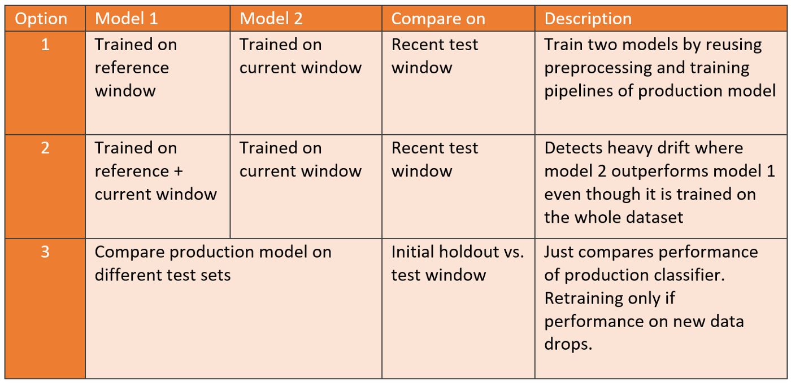{.lightbox width="532"}

-   Option 1: You'll already have a trained candidate ready for deployment if model 2 outperforms model 1.
    -   Example: An aggregated dataset consists of 45,000 timestamped observations which we spilt into 20,000 references, 20,000 current, and 5,000 most recent observations for the test.
        -   Score Models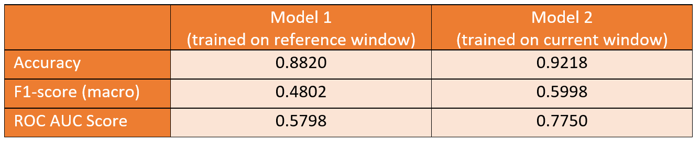{.lightbox width="532"}
        -   The current model outperforms the reference model by a large margin. Therefore, we can conclude that we indeed have identified model drift and that the current model is a promising candidate for replacing the production model.
-   Option 2: Will likely reduce false positives, at the expense of being less sensitive to drift.
-   Option 3: Reduces unnecessary training cycles in cases where no drift is identified.

### Architectures {#sec-prod-mlmon-mdrift-arch .unnumbered}

-   [Azure ML]{.underline}\
    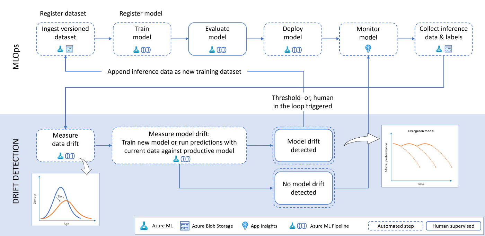{.lightbox width="632"}
    -   Ingest and version data in Azure Machine Learning
        -   For automation, we use Azure Machine Learning pipelines which consume managed datasets. By specifying the version parameter (version="latest") you can ensure to obtain the most recent data.
    -   Train model
        -   Model is trained on the source data. This activity can also be part of an automated Azure Machine Learning pipeline.
        -   Recommend adding a few parameters like the dataset name and version to re-use the same pipeline object across multiple dataset versions.
            -   By doing so, the same pipeline can be triggered in case model drift is present.
        -   Once the training is finished, the model is registered in the Azure Machine Learning model registry.
    -   Evaluate model
        -   Besides looking at performance metrics to see how good a model is, a thorough evaluation also includes reviewing explanations, checking for bias and fairness issues, looking at where the model makes mistakes, etc. It will often include human verification.
    -   Deploy model - Deploy a specific version of the model
    -   Monitor model - Collect telemetry about the deployed model.
        -   An Azure AppInsights workbook can be used to collect the number of requests made to the model instance as well as service availability and other user-defined metrics.
    -   Collect inference data and labels
        -   As part of a continuous improvement of the service, all the inferences that are made by the model should be saved into a repository (e.g., Azure Data Lake) alongside the ground truth (if available).
            -   Allows us to figure out the amount of drift between the inference and the reference data.
        -   Should the ground truth labels not be available, we can monitor data drift but not model drift.
    -   Measure data drift - Use the reference data and contrast it against the current data
    -   Measure model drift - Determine if the model is affected by data or concept drift
    -   Trigger re-training
        -   In case of model or concept drift, we can trigger a full re-training and deployment pipeline utilizing the same Azure ML pipeline we used for the initial training.
        -   Re-training triggers can either be:
            -   Automatic --- Comparing performance between the reference model and current model and automatically deploying if the current model performance is better than the reference model.
            -   Human in the loop --- Inspect data drift visualization alongside performance metrics between reference and current model and deploy with a data scientist/ model owner in the loop. This scenario would be suitable for highly regulated industries. This can be done using PowerApps, Azure DevOps pipelines, or GitHub Actions.
-   [NLP]{.underline}
    -   Issue
        -   After writing the new predictions with assigned labels (e.g. good/bad review) to a database., you typically do not get immediate feedback. There is no quick way to know if the predicted labels are correct. However, you do need something to keep tabs on the model's performance to ensure it works as expected.
    -   Options for collecting ground truth labels (reactive sol'ns, so there will be delay in awareness of drift)
        -   You can have a feedback mechanism directly in the website UI. For example, you can allow the review authors or readers to report incorrectly assigned categories and suggest a better one. If you get a lot of reports or corrections, you can react to this and investigate.
        -   Manual labeling as quality control. In the simplest form, the model creator can look at some of the model predictions to see if it behaves as expected. You can also engage external labelers from time to time to label a portion of the data. This way, you can directly evaluate the quality of the model predictions against expert-assigned labels.
    -   Lead indicators of model drift are often data quality issues and changes in the input data distributions
        -   Regarding data quality, there might be corruption due to wrong encoding, the presence of special symbols, text in different languages, emojis, etc. being newly introduced into the data pipeline
        -   See NLP Monitoring

## Investigating Model Drift {#sec-prod-mlmon-imd .unnumbered}

-   Analyze locally - For critical use cases the best practice is to begin with a fine grained approach of prediction analysis by replaying the inference with the issue and seeing its impact on the model.
    -   For ML models, use model-agnostic diagnostic scores (e.g. shap, dalex, iml, etc.) to compare previous model prediction features to the drifted model prediction features.
        -   Define the segments of low performance
            -   Have previously important features become not-so important. Is that a data issue or some outside event causing the change?
-   Analyze Globally - This involves analyzing the data for that feature over a broader range of time to see when the issue might have begun. Data changes typically coincide with product releases. So querying for data change timeline can tie the issue to a specific code and data release helping revert or address it quickly.
    -   Imputing or other missing data methods may only gradually affect model results after a lengthy period and therefore may be difficult for data validation monitoring to detect.
-   Perform an analysis on the data that caused the trigger
    -   Did the mean or sd (i.e. distribution) change?
    -   Is there a new seasonality or cyclic component present?
    -   Are there new correlations between variables?
    -   What's behind the change (expansion into a different area, new product, new vendor, new competitor, etc.)
    -   Competitor feature distributions
        -   Would be useful for diagnosing whether changes in data are specific to your company or happening across the industry sector
-   Root Cause Analysis
    -   Uses statistical methods to find out where the issue is
        -   `group_by(cat) %>% summarize(pct_bad = ...)`
        -   Permute rows of the anomalous column and see where there's a relationship change between the anomalous column/rows and other columns. Columns where the relationship changes may be involved in the anomalous values of the permuted column
            -   Clustering or correlation?
    -   Get user feedback on alerts (useful or not useful?)

## Model Retraining {#sec-prod-mlmon-retrain .unnumbered}

### Trigger Types {#sec-prod-mlmon-retrain-ttypes .unnumbered}

-   Triggers for retraining the model (if possible, use both)
-   **Performance-based triggers** are good for use cases where there is fast feedback and a high volume of data (e.g. real-time bidding), where model performance can be measured close to the time of predictions, in short time intervals, and with high confidence
    -   The main limitation of relying on performance only is the time it takes to obtain ground truth — if you obtain it at all. In user conversion prediction, it can take 30–60 days or more; in cases like transaction fraud detection or LTV, it can take 6+ months. Waiting that long means retraining too late, after the business has already been impacted
-   **Data distribution triggers** — by measuring changes in the input data (i.e. changes in the distribution of features used by the model), you can detect data drifts indicating the model may be outdated and needs retraining on fresh data

### Automated Triggers {#sec-prod-mlmon-retrain-autot .unnumbered}

-   Requirements for automated retraining to be appropriate:
    -   The number of models in production is limited so retraining costs are low
        -   Retail, logistics, etc. may involve thousands of related (e.g. geography-based) models
    -   The frequency of triggering events is rare
    -   There are no strict requirements on model availability
-   Risks of Automated Retraining
    -   Retraining on delayed data
        -   In some real-world scenarios, like loan-default prediction, labels may be delayed for months or even years. The ground truth is still coming, but you are retraining your model using the old data, which may not represent the current reality well.
    -   Failure to determine the root cause of the problem
        -   If the model's performance drops, it doesn't always mean that it needs more data. There could be various reasons for the model's failure, such as changes in downstream business processes, training-serving skew, or data leakage. You should first investigate to find the underlying issue and then retrain the model if necessary.
    -   Higher risk of failure
        -   Retraining amplifies the risk of model failure. Besides the fact that it adds complexity to the infrastructure, the more frequently you update, the more opportunities the model has to fail. Any undetected problem appearing in the data collection or preprocessing will be propagated to the model, resulting in a retrained model on flawed data.
    -   Higher costs
        -   Storing and validating the retraining data
        -   Compute resources to retrain the model
        -   Testing a new model to determine if it performs better than the current one

### Retraining {#sec-prod-mlmon-retrain-retrain .unnumbered}

-   Using the characteristics of the data found in the analysis, decide on the most relevant block of data that is representative the current state of the data being collected. This is the retraining dataset
    -   A sufficient sample size should also be a consideration.
    -   Maybe use upsampling or simulation to obtain a sufficiently sized dataset with the necessary characteristics
-   Potential next steps. Which one or combination of steps depends on the severity and causes of the data drift/model performance degradation, time and budget constraints.
    -   Retrain using current algorithm
        -   Retrain with more weight on recent data points
        -   Retrain with recent data only
        -   Retrain on all your past dataset
    -   Update using current algorithm but with a new dataset
        -   Use initial weights and batch training
        -   This might only be for DL models or I think there might be something in {sklearn} and/or {tidymodels}
    -   Redo the algorithm selection process
    -   Redo feature engineering
    -   Redo everything

## Alerts {#sec-prod-mlmon-alert .unnumbered}

-   [Misc]{.underline}
    -   Also see [Project, Management \>\> Event Auditing](project-management.qmd#sec-prod-mang-eaudit){style="color: green"}
    -   Prioritize different alerts (e.g. highly important, important, normal, warning, note)
    -   If your model is triggering alerts to often, generate additional rules with users to limit the number of alerts
        -   Example: model that predicts patient risk of death can only trigger a *re-alert* to the clinician if:
            -   it's been 48 hrs since the previous alert
            -   if the patient has *not* just came from the ICU
-   [Routing and Response]{.underline}
    -   Route alerts (e.g. Slack) for a particular table only to teams that regularly use or maintain that table
        -   As alerts arrive, teams can use emoji reactions to classify their response. Common reactions include:
            -   ✅ the issue has been fixed
            -   🔥 an important alert
            -   🛠️ a fix is underway
            -   🆗 expected behavior, nothing needed
            -   👀 under review
-   [Content]{.underline}
    -   Alerts should have contextual information. Example:
        -   Why does this alert matter?
        -   What \# and % of `user_id` values are affected?
        -   How often has this alert failed in the recent past?
        -   Who configured this alert, and why?
        -   What dashboards or ML models depend on `fact_table`?
        -   What raw data source contributed `user_id` to `fact_table`?
    -   Include an image with a row that triggered the alert alongside a row with a valid value
-   [Notification Methods]{.underline}
    -   Email
        -   [Example]{.ribbon-highlight}: to developers\
            .png){.lightbox width="432"}
            -   "jarvis" is an internal package and this function probably wraps a template and email package function
        -   [Example]{.ribbon-highlight}: to users\
            .png){.lightbox width="532"}
            -   "CHARTWatch" is the name of the data product
            -   Alerts user that the product is down and other pertinent information
    -   Slack
        -   [Example]{.ribbon-highlight}\
            .png){.lightbox width="432"}
            -   "jarvis" is an internal package and this function probably wraps a template and slack package function

## Operational Tracking {#sec-prod-mlmon-optrack .unnumbered}

-   [Model Usage]{.underline}
    -   Model calls
        -   If model usage drops or becomes erratic, it could be a signal something is wrong
        -   Only useful for frequently used apps
        -   Depending on the model environment, check requests and responses separately:
            -   Was the model not asked (e.g., because a recommendation widget crashed) or did it fail to answer (e.g., the model timed out and a static recommendation was used instead)? The answer points to where debugging should start
    -   Other stuff to track
        -   Number of predictions made
        -   Prediction latency — how long it takes to make a prediction
        -   If the product is customer facing, customer satisfaction/usage-type metrics should also be tracked
-   [Alerts]{.underline}
    -   Number of alerts triggered by model
        -   Work with users to minimize false positives and hence unnecessary alerts. Otherwise model alerts might be treated as the boy who cried wolf and will be ignored or taken less seriously.
    -   Interventions after a trigger
        -   This will let you know if your model predictions are being adhered to
        -   Example: model that predicts a patient is at high risk of death and triggers an alert to a clinician
            -   Part of the standard protocol for intervening is to perform additional vitals measurements. The number of vitals measurements for a patient are recorded, so this metric can be used as a proxy. If there is an increase in vitals measurements for a high-risk patient, the data team can infer that the model's alerts are being adhered to.
