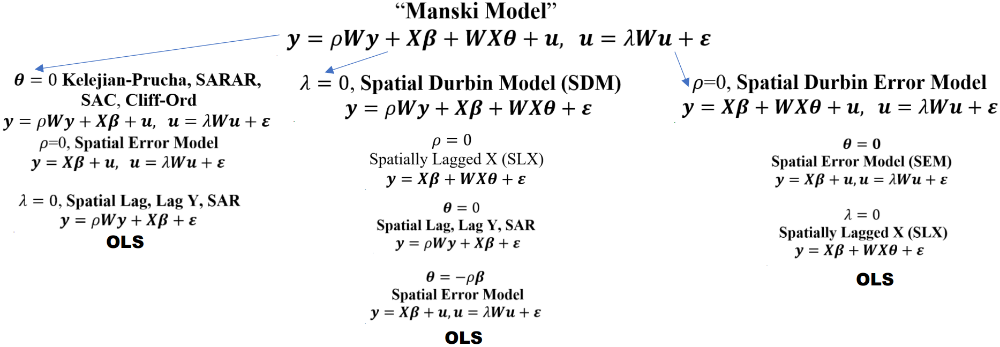
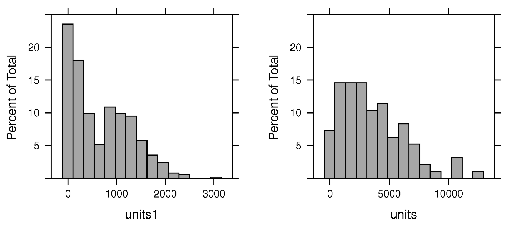

# Spatial {#sec-reg-spat .unnumbered}

## Misc {#sec-reg-spat-misc .unnumbered}

- Also see
  - [Geospatial, Spatial Weights](geospatial-spatial-weights.qmd#sec-geo-swgt){style="color: green"}
  - [Diagnostics, Geospatial](diagnostics-geospatial.qmd#sec-diag-geo){style="color: green"}
- Packages
  - [{]{style="color: #990000"}[conleyreg](https://cran.r-project.org/web/packages/conleyreg/index.html){style="color: #990000"}[}]{style="color: #990000"} - Allows for serial correlation over all (or a specified number of) time periods, as well as spatial correlation among units that fall within a certain distance of each other.; Alternative to using a geospatial variable (e.g. region, country) as a fixed effect.
    - Fits **ols, logit, probit, and poisson** models with **Conely SEs**
    - Handles **panel data** with formula options to specify fixed effects
    - Conely SEs assume that the degree of correlation in errors decays as the distance between two locations increases.
    - Use a distance-based correction to account for spatial dependence. The errors of observations close to each other are assumed to be correlated, but this correlation weakens as the geographical distance between them increases. This allows for a more continuous and flexible adjustment to the error structure across space.
  - [{]{style="color: #990000"}[pmlsp](https://cran.r-project.org/web/packages/pmlsp/index.html){style="color: #990000"}[}]{style="color: #990000"} - Estimate spatial autoregressive nonlinear **probit** models with and without autoregressive disturbances using partial maximum likelihood estimation
    - Documentation is sparse, but go to function reference \>\> model function for a better understanding of what this is.
  - [{]{style="color: goldenrod"}[pysal](https://pysal.org/pysal/){style="color: goldenrod"}[}]{style="color: goldenrod"} - Geospatial data science with an emphasis on geospatial vector data
    - Spatial regression and statistical modeling on geographically **embedded networks**
    - Spatial **econometrics**
    - [Anselin's jupyter notebooks](https://github.com/lanselin/spatial_regression_notebooks)
  - [{]{style="color: #990000"}[spatemR](https://cran.r-project.org/web/packages/spatemR/index.html){style="color: #990000"}[}]{style="color: #990000"} - **Generalized Spatial Autoregressive** Models for Mean and Variance
    - Extends classical methods like **logistic** Spatial Autoregresive Models (SAR), **probit** Spatial Autoregresive Models (SAR), and **Poisson** Spatial Autoregresive Models (SAR),
    - Built on top of [{gamlss}]{style="color: #990000"} so splines can be included.
  - [{]{style="color: #990000"}[SpatialInference](https://cran.r-project.org/web/packages/SpatialInference/index.html){style="color: #990000"}[}]{style="color: #990000"} - Estimates a **linear regression** via [{lfe::felm}]{style="color: #990000"}
    - Augments the output with Moran's I tests for spatial autocorrelation
    - Optional correlograms for range estimation in order to compute **Conley spatial HAC standard errors**.
      - Includes more kernel options than [{conelyreg}]{style="color: #990000"} (Besides the Barlett, the Epanechnikov kernel is also recommended)
    - Handles **panel data** with formula options to specify fixed effects. See Details section of [{]{style="color: #990000"}[lfe::felm](https://cran.r-project.org/web/packages/lfe/refman/lfe.html#felm){style="color: #990000"}[}]{style="color: #990000"} for information of the formula syntax. (Pay attention to the group variable section. In the SpatialInference vignette, latitude and longitude variable are specified there)
    - Able to display results via [{modelsummary::modelsummary}]{style="color: #990000"} and comes with custom `tidy` and `glance` methods from [{broom}]{style="color: #990000"}.
  - [{]{style="color: #990000"}[spatialreg](https://r-spatial.github.io/spatialreg/){style="color: #990000"}[}]{style="color: #990000"} - **OG**; Various methods of spatial **regression**, Bivand's package
    - Spatial Autoregressive Combined (SAC) models combine both a Spatial Autoregression (SAR) model and a Spatial Error (SEM) model
  - [{]{style="color: #990000"}[spdgp](https://josiahparry.github.io/spdgp/){style="color: #990000"}[}]{style="color: #990000"} - Simulates data from econometric spatial regression model processes
  - [{]{style="color: #990000"}[sphet](https://cran.r-project.org/web/packages/sphet/){style="color: #990000"}[}]{style="color: #990000"} - Estimation of Spatial Autoregressive Models with and without **Heteroskedastic Innovations**
  - [{]{style="color: #990000"}[spldv](https://cran.r-project.org/web/packages/spldv/index.html){style="color: #990000"}[}]{style="color: #990000"} - Estimates spatial autoregressive models for **binary dependent variables** using GMM estimators
    - Computes average marginal effects for probit and logit models
  - [{]{style="color: #990000"}[spmixW](https://cran.r-project.org/web/packages/spmixW/index.html){style="color: #990000"}[}]{style="color: #990000"} - Bayesian Spatial **Panel Data** Models with Convex Combinations of Weight Matrices
    - Includes Spatial Autoregressive (SAR), Spatial Durbin Model (SDM), Spatial Error Model (SEM), Spatial Durbin Error Model (SDEM), and Spatial Lag of X (SLX) specifications with fixed effects.
- Resources
  - [Spatial Modelling for Data Scientists, Ch. 7](https://gdsl-ul.github.io/san/07-multilevel-01.html), [8](https://gdsl-ul.github.io/san/08-multilevel-02.html)
- Papers
  - [A Review of Software for Spatial Econometrics in R](https://www.mdpi.com/2227-7390/9/11/1276) (2021)
- Notes from
  - Bivand's slides and source code, [Categorical independent variables and spatial regression: interpretation and reporting](https://rsbivand.github.io/eqc25_talk/)
  - Spatial Data Science, [Ch.16](https://r-spatial.org/book/16-SpatialRegression.html), [Ch.17](https://r-spatial.org/book/17-Econometrics.html)
  - [Geodata & Spatial Regression](https://ruettenauer.github.io/Geodata_Spatial_Regression/)

## Econometric {#sec-reg-spat-econ .unnumbered}

](_resources/Regression-Spatial.resources/econometric-venn-1.png){.lightbox width="532"}

### Misc {#sec-reg-spat-econ-misc .unnumbered}

- Workflow (LeSage (2014), [What Regional Scientists Need to Know about Spacial Econometrics](https://rrs.scholasticahq.com/article/8081-what-regional-scientists-need-to-know-about-spatial-econometrics))
  1.  Does your DGP indicate a local or global model (i.e. SDM or SDEM)?
      - See [Impacts](regression-spatial.qmd#sec-reg-spat-econ-imp){style="color: green"} \>\> Types for definitions of Local and Global
      - See [Models](regression-spatial.qmd#sec-reg-spat-econ-mod){style="color: green"} \>\> Nested Structure. SDM (middle column, global) and SDEM (right column, local)
      - SAC is also a global model but LeSage doesn't like the SAC model (left column).
        - See [Models](regression-spatial.qmd#sec-reg-spat-econ-mod){style="color: green"} \>\> SAC for details.
        - I'd need to check the paper, but I think his concerns might be assuaged with the second spatial weights argument ([listw2]{.arg-text}) in the model function
  2.  Use Likelihood Ratio Tests to select between models nested under whichever one you selected
- The spatial lag is usually taken as the mean of the values of the variable at neighboring observations for row-standardised spatial weights, or the sum for binary spatial weights.
- Relatively dense spatial weights matrices may down-weight model estimates, suggesting that sparser weights are preferable
- The presence of residual spatial autocorrelation need not bias the estimates of variance of regression coefficients, provided that the covariates themselves do not exhibit spatial autocorrelation
  - if covariates and the residual are autocorrelated, it is likely that the estimates of variance of regression coefficients will be biased downwards if attempts are not made to model the spatial processes.
- Common use of pre-test strategies for model selection probably ought to be replaced by the estimation of the most general model appropriate for the relationships being modelled.
- All covariates should NOT be added in spatially lagged form
- If the processes in the covariates and the response match, we should find little difference between the coefficients of a least squares and a SEM, but very often they diverge, suggesting that a Hausman test for this condition should be employed.

### Models {#sec-reg-spat-econ-mod .unnumbered}

- Nested Structure\
  {.lightbox width="632"}

  - Structure
    - SAC $\rightarrow$ SEM $\rightarrow$ SAR (aka SLM)
    - SDM $\rightarrow$ SLX $\rightarrow$ SAR $\rightarrow$ SEM
    - SDEM $\rightarrow$ SEM $\rightarrow$ SLX
  - SDEM (right) nests: OLS, SLX and SEM, but SEM only nests OLS, not SLX.

- [[{spatialreg}]{.underline}]{style="color: #990000"} [Model Functions]{.underline}\

  | model | model name | maximum likelihood estimation function |
  |----|----|----|
  | SEM | spatial error | `errorsarlm(..., Durbin=FALSE)` |
  | SEM | spatial error | `spautolm(..., family="SAR")` |
  | SDEM | spatial Durbin error | `errorsarlm(..., Durbin=TRUE)` |
  | SLM (aka SAR) | spatial lag | `lagsarlm(..., Durbin=FALSE)` |
  | SDM | spatial Durbin | `lagsarlm(..., Durbin=TRUE)` |
  | SLX | spatially lagged | `lmSLX(..., Durbin = TRUE)` |
  | SAC | spatial autoregressive combined | `sacsarlm(..., Durbin=FALSE)` |
  | GNM | general nested | `sacsarlm(..., Durbin=TRUE)` |

  - `errorsarlm` has a [weights]{.arg-text} argument may be used to provide weights indicating the known degree of per-observation variability in the variance term (not spatial weights)
  - [method]{.arg-text} gives the method for calculating the log determinant term in the log likelihood function, and defaults to `"eigen"`, suitable for moderately sized datasets
  - `summary` results for models with:
    - $\rho_{\text{lag}} Wy$ (lagged y) will have a [rho]{.arg-text} estimate
    - $\theta WX$ (lagged covariates) will have [lag.\<covariate\>]{.arg-text} estimates
    - $\rho_{\text{err}}Wu$ (spatially modelled errors) will have a [lambda]{.arg-text} estimate
      - Says when location i's neighbors' residual increases by 1 unit on average, then location i's residual changes by the lambda estimate on average.
    - The significance of $\rho_{\text{err}}$ indicates whether spatial correlation remains in the residuals
    - The combined absolute values of $\rho_{\text{lag}}$ and $\rho_{\text{err}}$ and their statistical significance give you an idea of how much spatial autocorrelation is being modelled.

- **Spatial Lag Model (SLM)** or **Spatial Autoregressive (SAR)**\

  $$y = \rho_{\text{lag}}Wy + X\beta + \epsilon$$

  - Includes a spatial process for the response
  - Lag of Y (endogenous interaction effects):
    - Possible space-time dependence (e.g. drug use spreads through space over time)
    - Values of Y are jointly determined with that of neighboring agents, or there are “spillover effects”
  - Terms
    - $y$ : A $n\times 1$ vector of observations on a response variable taken at each of $n$ locations
    - $\rho_{\text{lag}}$ : Scalar spatial parameter
    - $W$ : A $n\times n$ spatial weights matrix
    - $X$ : A $n\times k$ matrix of covariates usually including the intercept
    - $\beta$ : A $k\times 1$ vector of parameters
    - $\epsilon$ : A $n\times 1$ vector of iid *disturbances*

- **Spatial Error Model (SEM)**\

  $$\begin{align}
  &y = X\beta + u \\
  &\text{where} \;\; u = \rho_{\text{err}} Wu + \epsilon
  \end{align}$$

  - Includes a spatial process for the residuals
  - $u$ : A $n\;\times\;1$ spatially autocorrelated disturbance vector
  - $\rho_{\text{err}}$ : A scalar spatial parameter.
  - Can be motivated by spatial heterogeneity (e.g., a spatially correlated fixed effect as in panel data models), an omitted variable with spatially distinct effects, others.

- **Spatial Durbin Model (SDM)**\

  $$y = \rho_{\text{lag}}Wy + X\beta + WX\gamma + \epsilon$$

  - Includes spatial processes for the response and covariates
  - $WX$ : Is the spatially weighted, lagged covariates term
  - $\gamma$ : A $k\;' \times 1$ vector of parameters where often $k' = k - 1$ when using row-standardized spatial weights and ommitting the spatially lagged intercept.
  - Can be motivated by assuming that there is a spatially correlated omitted variable (e.g. environmental amenities, highway accessibility, community social capital)
  - The indirect spillover effect produced by the SDM model is both local and global with no prior restrictions on the magnitudes of these effects
  - The exogenous regressor of one location casts an effect on the dependent variable of the neighboring locations through *feedback loops*.
    - The feedback loops are a result of the Durbin term due to which a location, say $i$ affects aneighboring location, say $j$, which eventually has a consequence on $i, j = 1,2, \ldots , n$
  - An advantage of the spatial Durbin model is that it produces correct standard errors or t−values of the coefficient estimates also if the true data generating process is a spatial error model
  - The SDM model reduces to SEM under a non-linear common factor restriction. Thus, theoretically speaking, the choice between SDM and SEM can be settled by performing astatistical test for the common factor restriction.
  - Rao’s score test principle which is asymptotically equivalent to the Likelihood Ratio Test (LRT) but computationally much simpler
    - Use of the likelihood ratio test (LRT) is not attractive for testing a non-linear hypothesis, since LRT requires maximum likelihood estimation both under the null and the alternative hypotheses.

- **General Nested Model (GNM)** or **General Nested Spatial Model (GNS)**

  $$\begin{align}
  &y = \rho_{\text{lag}}Wy + X\beta + WX\gamma + u \\
  &\text{where} \;\; u = \rho_{\text{err}} Wu + \epsilon
  \end{align}$$

  - Includes a spatial process to the response, covariates, and residuals (kitchen sink model)
  - AKA **Manski Model**
  - Issue: The GNS is only weakly (or not?) identifiable
    - Not recommended
    - Analogous to Manski’s reflection problem on neighborhood effects: If people in the same group behave similar, this can be because
      - Imitating behavior of the group
      - Exogenous characteristics of the group influence the behaviour
      - Members of the same group are exposed to the same external circumstances. 
    - We just cannot separate those in observational data.

- **Combined Spatial Autocorrelation (SAC)**

  $$\begin{align}
  &y = \rho_{\text{lag}}Wy + X\beta + u \\
  &\text{where} \;\; u = \rho_{\text{err}} Wu + \epsilon
  \end{align}$$

  - No spatial process for covariates
  - AKA **Spatial AutoRegressive-AutoRegressive (SARAR), Kelejian-Prucha, Cliff-Ord**
  - Issue: Using the same W matrix for lag and error terms can lead to identification problems.
    - `sacsarlm` has a [listw2]{.arg-text} argument to pass a second spatial weights matrix
      - Bivand doesn't use it in his example though

- **Spatially Lagged X Model (SLX)**

  $$y = X\beta + WX\gamma + \epsilon$$

  - Only has a spatial process for the covariates
  - If explanatory variables of area i might affect its neighbor j

- **Error Durbin model (SDEM)**

  $$\begin{align}
  &y = X\beta + WX\gamma + u \\
  &\text{where} \;\; u = \rho_{\text{err}} Wu + \epsilon
  \end{align}$$

  - No spatial process for the response

### Impacts {#sec-reg-spat-econ-imp .unnumbered}

- [Misc]{.underline}
  - Notes from
    - [SDS Ch.17.3](https://r-spatial.org/book/17-Econometrics.html#impacts)
    - [Geodata and Spatial Regression Ch.10](https://ruettenauer.github.io/Geodata_Spatial_Regression/07_impacts.html)
  - AKA **Marginal Effects**
  - A model will have either local direct, indirect, and total impacts or global direct, indirect, and total impacts.
  - Standard error estimates from SEM and SDEM models (fit by maximum likelihood) and have been corrected by multiplying them by $N∕(N - k)$ can be compared to OLS and SLX standard error estimates. ([section 3.3](https://openjournals.wu.ac.at/region/paper_107/107.html))
  - Code
    - Just the impact point estimates: `impacts(mod, listw = listw_obj)`

    - W/p-values:

      ``` r
      summary(impacts(
        mod,
        listw = listw_obj,
        R = 500,
        zstats = TRUE
      ))
      ```
- [Types]{.underline}
  - [**Direct impacts**]{style="color: #009499"} measure the effect of changing an explanatory variable in a specific location on the dependent variable in that same location. This is analogous to traditional regression coefficients but accounts for spatial **feedback effects** when lagged endogenous variables are present (i.e. lagged response).
    - Note that all variation in the impacts matrix comes from the variation in the spatial weights matrix which we've specified a priori.

      - i.e. it's sort of subjective since we choose the neighboring scheme, weighting method, and normalization method. $W$ is not directly estimated from the data.
      - I guess we could treat those choices as hyperparameters though.

    - For a GNM,\

      $$S_r(W) = ((I - \rho_{\text{lag}}W)^{-1}(I\beta_r + W\gamma_r)$$

      - $S_r(W)$ (the partial derivative) expresses the **direct impacts** (effects) on its principal diagonal, and **indirect impacts** in off-diagonal elements.

    - For SAR,\

      $$S_r(W) = (I - \rho_{\text{lag}}W)^{-1}$$

    - For SLX, SDEM,

      - $\beta_k$ is the average (local) direct impact (covariate coefficient) and $\gamma_k$ is the average (local) indirect impact (lagged covariate parameter)
  - [**Feedback Effects**]{style="color: #009499"} are where the initial change in a location influences neighboring locations, which in turn influence the original location back.
    - My $X$ influences my $Y$ directly, but my $Y$ then influences my neigbour’s $Y$, which then influences my $Y$ again (also also other neighbour’s $Y$s). Thus the influence of my $X$ on my $Y$ includes a spatial multiplier
  - [**Global impacts**]{style="color: #009499"} provide system-wide average measures of direct, indirect, and total effects. Effects spread to all neighbors (i.e. includes higher order neighbors) but decrease with distance. Global spillover effects can be seen as a kind of diffusion process.
    - Seen as crucial for reporting results from fitting models including the spatially lagged response (**SLM**, **SDM**, **SAC**, **GNM**) which assume global dependence, and has been extended to models with spatially lagged covariates (SLX, SDEM).
    - Issue: These processes happen over time. In a cross-sectional framework, the global spillover effects are hard to interpret. Anselin (2003) proposes an interpretation as an equilibrium outcome, where the partial impact represents an estimate of how this long-run equilibrium would change due to a change in $x_k$.
    - [Example]{.ribbon-highlight}: A public railway is built (exogenous effect) and connects the business district to other key areas in the city
      - The new transit station drastically increases the desirability of District A. This surge in desirability leads to a sharp increase in demand for housing in District A.
        - Because housing supply is fixed in the short term (you can't instantly build new houses), this increased demand results in a significant increase in house prices in District A.
      - Potential homebuyers who were priced out of District A will now look for the next best alternative. District B, which is adjacent to District A and might have similar housing stock but without the direct train access, suddenly becomes a more attractive option by comparison. These buyers bring their increased willingness-to-pay with them.
      - This effect continues to ALL higher order neighbors, but weakens the further the district is from a railway station.
  - [**Indirect impacts**]{style="color: #009499"} (aka [**Spillover Effects**]{style="color: #009499"}) capture how changing an explanatory variable in one location affects the dependent variable in neighboring locations through spatial interdependencies. These effects propagate through the spatial weights matrix.
  - [**Local impacts**]{style="color: #009499"} allow these effects to *vary* across different locations. This is particularly relevant in weighted spatial regression and other spatially varying coefficient models, where the relationship between variables can differ across space due to local conditions, policies, or characteristics.
    - In Spatial Lag of X (**SLX**) model or the Spatial Durbin Error Model (**SDEM**), the influence of a change in an explanatory variable is restricted to a defined neighborhood of the initial location.
      - These models assume local dependence. The impact does not propagate endlessly throughout the system. This more contained spillover is referred to as a local impact.
    - Only direct neighbors – as defined in $W$ – contribute to local spillover effects. The coefficients only estimate how my direct neighbour’s $X$ values influence my own outcome $Y$.
      - There are no higher order neighbors involved (as long as we do not model them), nor are there any feedback loops due to interdependence.
    - Local impacts may be reported for SDEM and SLX models, using a linear combination to calculate standard errors for the total impacts of each covariate (sums of coefficients on the covariates and their spatial lags)
    - [Example]{.ribbon-highlight}: The effect of environmental quality on house prices
      - The environmental quality in the focal unit itself but also in neighbouring units could influence the attractiveness of a district and its house prices.
      - Therefore, it seems reasonable to assume that we have local spillover effects: only the environmental quality in directly contiguous units (e.g. in walking distance) is relevant for estimating the house prices.
    - [Example]{.ribbon-highlight}: DUIs ([source](https://www.youtube.com/watch?v=MbQ4s8lwqGI))
      - Data on DUI counts (response) and covariates are at the county level
      - Covariates are % population are baptists (dry), liquor sold per capita, % population is college students (drunk kids), avg distance between liquor stores and homes, avg distance between restaurants w/liquor and homes, % recreation/entertainment workers (tourism)
      - Does a change in any of these covariates in one county affect the count of DUIs in ALL other counties in the state (global) or just the counties neighboring a particular county (local)?
        - Likely just neighboring counties, so we should use a local model.
  - [**Spillover Effects**]{style="color: #009499"} - See [**Indirect Effects**]{style="color: #009499"}
  - [**Total impacts**]{style="color: #009499"} are simply the sum of direct and indirect impacts, representing the overall effect of changing a variable across the entire spatial system.
- [Interpretation]{.underline}
  - **Direct Impacts** represent the average change in the dependent variable at location $i$ from a one-unit change in the explanatory variable at location $i$.
    - An average effect of a unit change in $x_i$ on $y_i$
    - [Example]{.ribbon-highlight}: If the direct impact of [police spending]{.var-text} (in \$1000s) is [0.15]{.arg-text} for [crime]{.var-text} reduction, then a \$1,000 increase in [police spending]{.var-text} in a [city]{.var-text} *reduces* [crime]{.var-text} in that same [city]{.var-text} by [0.15]{.arg-text} units on average.
  - **Indirect Impacts** represent the average change in the dependent variable at location $i$ from a one-unit change in the explanatory variable at all other locations $j \ne i$.
    - How a change in $x_i$, on average, influences all neighboring units $y_j$ .
    - For global models: A change of $x_i$ in the focal units flows through the entire system of neighbors (direct neightbors, neighbors of neighbours, …) influencing ‘their ’ $y_j$. One can think of this as diffusion or a change in a long-term equilibrium.
      - [Example]{.ribbon-highlight}: If logNO2 increases by one unit, this increases the house price in the focal unit by 0.448 units. Overall, a one unit change in logNO2 increases the house prices in the entire neighborhood system (direct and higher order neighbours) by 0.754.
      - [Example]{.ribbon-highlight}: If the indirect impact is [0.08]{.arg-text}, then a $\$1,000$ increase in [police spending]{.var-text} in city $i$ r*educes* [crime]{.var-text} in all other cities by [0.08]{.arg-text} units on average through **spillover effects**.
    - Local
      - [Example]{.ribbon-highlight}: % of county population employed by the entertainment industry (i.e. tourism proxy) is shown to have a significant indirect impact on the count of DUIs in a county. Although, the total impact for this variable is not significant. ([source](https://www.youtube.com/watch?v=MbQ4s8lwqGI))
        - Indirect: Says counties with any neighbors building a casino/hotel/etc which would increase their population that's employed by the entertainment/hotel/etc. industry should be prepared for an increase in DUIs
        - Total: Says that the state shouldn't expect DUIs to significantly increase statewide and there's no evidence to indicate changes in policy are necessary.
          - I don't agree with this interpretation. Sounds like the interpretation of a global model's total impact.
          - I think maybe this should be interpreted for group of counties (i.e. a county and it's neighbors) and not statewide. So the total DUIs in a neighborhood which includes a county with a substatial proportion of entertainment workers should expect that total to be significantly affected.
    - Remember it's the *average*. The effect on location $i$ from each other location will vary according to spatial relationships encoded in the spatial weights matrix.
    - A change in city $j$ can affect city $i$ both directly (if they're neighbors) and indirectly through intermediate cities in the spatial network (i.e. the effect generated in other cities spilling over into a city).
    - For SLX models, nothing is gained from computing the "impacts," as they equal the coefficients. Again, it’s the effects of direct neighbours only (i.e. a local indirect impact).
  - **Total Impacts** represent the overall effect of a change in an explanatory variable across all locations in the study area. In essence, it captures the entire spatial multiplier effect
    - [Example]{.ribbon-highlight}: Human Capital's impact on regional labor productivity
      - "A ceteris paribus increase in the level of human capital is found to have a significant and positive direct impact. But this positive direct impact is offset by a significant and negative indirect (spillover) impact leading to a total impact that is not significantly different from zero."

### Prediction {#sec-reg-spat-econ-pred .unnumbered}

- Misc

  - SLX (`lmSLX`) has it's own prediction method and doesn't have a [pred.type]{.arg-text} argument. So I'm not sure what kind of predictions it's able to do.

- Output

  - [**Trend**]{style="color: #009499"} ($X\beta$) — The fitted values from the covariate part of the model alone. Tells you the unit's predicted value if there were no spatial dependence in the data at all.
  - [**Signal**]{style="color: #009499"} ($\rho W y$ for SLM, SDM) or ($\lambda W y - \lambda W X \beta$ for SEM, SDEM): The contribution of spatial dependence to the prediction. It's the influence of neighboring outcomes above and beyond what the covariates already explain.
    - [Example]{.ribbon-highlight}: If you were modeling voter turnout, a large signal relative to trend for a given voting district means its turnout is being pulled substantially toward its neighbors' turnout, over and above what its own socioeconomic characteristics (explanatory variables) would predict. This could indicate spillover effects of voter mobilization, regional political culture, etc.
    - Diagnostic: If the signal is large and systematic across many units, that's telling you the spatial model is earning its keep relative to OLS. If the signal is near zero almost everywhere, the spatial term isn't adding much.
  - [**Noise**]{style="color: #009499"}: Residuals

- Scenarios

  - [**In-Sample**]{style="color: #009499"} ([newdata = NULL]{.arg-text}): Predicting for the units the model was fitted on. The response $y$ is known, so its spatial lags can be used directly to compute the **signal**.
  - [**Forecast**]{style="color: #009499"} ([newdata]{.arg-text} has the *same* row names as [listw]{.arg-text}): The [newdata]{.arg-text} has the same spatial units, different values of the covariates. This is a *temporal-style* forecast — you're projecting forward with new $X$ but the same neighborhood structure and known unit identities.
  - [**Out-of-Sample**]{style="color: #009499"} ([newdata]{.arg-text} has *different* row names from [listw]{.arg-text}): The [newdata]{.arg-text} has new spatial units. Now $y$ is unknown, so the **signal** cannot use observed $Wy$ and must be approximated somehow. This is where most of the [pred.type]{.arg-text} proliferation comes from.

- [Universal]{.underline}

| pred.type | Strategy | Output | Models |
|----|----|----|----|
| "trend" | No spatial adjustment. Returns $X\beta$ only — ignores all spatial dependence. | fit | All models |

- [In-sample and Forecast]{.underline}

|  |  |  |  |
|----|----|----|----|
| ["TS"]{.arg-text} (default) | Uses the observed response directly: signal = $\rho Wy$ (SLM, SDM) or $\lambda Wy − \lambda WX \beta$ (SEM, SDEM)). | fit, trend, signal | SEM, SDEM, SLM, SDM |
| ["TC"]{.arg-text}; also requires [listw]{.arg-text} | Trend-corrected: adds a correction to the trend using fitted residuals and the spatial structure. The in-sample version has full access to residuals; out-of-sample is an approximation. | fit, trend | SLM, SDM, SAC, GNM (caution\*) |
| ["BP"]{.arg-text}; also requires [listw]{.arg-text} | Best predictor (Goulard et al. 2017): optimal BLUP-type prediction that minimises mean squared prediction error by exploiting the full covariance structure. | fit, trend | SLM, SDM, SAC, GNM (caution\*) |

- [Out-of-sample]{.underline} (Goulard et al. 2017 notation)

+------------------------------------------+-----------------------------------------------------------------------------------------------------------------------------------------------------------------------------------------------------+---------------+--------------------------------+
|                                          |                                                                                                                                                                                                     |               |                                |
+==========================================+=====================================================================================================================================================================================================+===============+================================+
| ["TS1"]{.arg-text} or ["KP4"]{.arg-text} | Leave-one-out version of ["TS"]{.arg-text}. Each out-of-sample unit is predicted in turn, treating its neighbous' $y$ values as known. Computed separately per unit when newdata has multiple rows. | Out-of-sample | SLM, SDM, SAC, GNM             |
+------------------------------------------+-----------------------------------------------------------------------------------------------------------------------------------------------------------------------------------------------------+---------------+--------------------------------+
| ["TC1"]{.arg-text} or ["KP1"]{.arg-text} | Leave-one-out version of ["TC"]{.arg-text}. Most broadly applicable out-of-sample predictor — works for all model types                                                                             | Out-of-sample | All models                     |
+------------------------------------------+-----------------------------------------------------------------------------------------------------------------------------------------------------------------------------------------------------+---------------+--------------------------------+
| ["BP1"]{.arg-text}                       | Leave-one-out version of ["BP"]{.arg-text}                                                                                                                                                          | Out-of-sample | SLM, SDM, SAC, GNM (caution\*) |
+------------------------------------------+-----------------------------------------------------------------------------------------------------------------------------------------------------------------------------------------------------+---------------+--------------------------------+
| ["BPW"]{.arg-text}\                      | Best predictor with $W$-based spatial correction. ["BPW1"]{.arg-text} is the leave-one-out version.                                                                                                 | Out-of-sample | SLM, SDM, SAC, GNM (caution\*) |
| ["BPW1"]{.arg-text}                      |                                                                                                                                                                                                     |               |                                |
+------------------------------------------+-----------------------------------------------------------------------------------------------------------------------------------------------------------------------------------------------------+---------------+--------------------------------+
| ["BPN"]{.arg-text}\                      | Best predictor with neighbour-based correction. ["BPN1"]{.arg-text} is the leave-one-out version.                                                                                                   | Out-of-sample | SLM, SDM, SAC, GNM (caution\*) |
| ["BPN1"]{.arg-text}                      |                                                                                                                                                                                                     |               |                                |
+------------------------------------------+-----------------------------------------------------------------------------------------------------------------------------------------------------------------------------------------------------+---------------+--------------------------------+

- [Out-of-Sample]{.underline} (Kelejian & Prucha 2007 notation)

|  |  |  |  |
|----|----|----|----|
| ["KP2"]{.arg-text} | Uses $WX\beta$ (spatial lag of the trend) as a proxy for the unobservable signal. Avoids matrix inversion; lighter computationally. | Out-of-sample | All models |
| ["KP3"]{.arg-text} | Extends KP2 with higher-order spatial lags $W^2X\beta,\;W^3X\beta,\; \ldots$ for a richer approximation of the spatial signal. | Out-of-sample | All models |
| ["KP5"]{.arg-text} | Residual-based correction designed specifically for the error model: exploits the spatial autocorrelation in the error term to improve on the trend. Not applicable to lag models. | Out-of-sample | SEM, SDEM, SAC, GNM |

- *\* caution* - The docs mark these *yes\** for SAC/GNM models: the function will not error, but the predictor is not designed for the SAC/GNM structure. Prefer ["trend"]{.arg-text}, ["TS1"]{.arg-text}/["KP4"]{.arg-text}, ["TC1"]{.arg-text}/["KP1"]{.arg-text}, ["KP2"]{.arg-text}, or ["KP3"]{.arg-text}.

### Diagnostics {#sec-reg-spat-econ-diag .unnumbered}

- [Misc]{.underline}
  - Also see [Diagnostics, Geospatial \>\> Spatial Autocorrelation](diagnostics-geospatial.qmd#sec-diag-geo-sauto){style="color: green"} (Moran's I)
  - AIC and the LR test are about model selection while the rest (Hausman, B-P, Rao) seem to more about determining whether a model fit is bad due to misspecification (residual autocorrelation, residual heteroskedacity).
  - In Bivand's Boston house sales/NOX pollution paper (see Example 1), he only reported Breusch-Pagan, Rao's Score, and Moran's I for models that don't model spatial errors (i.e. OLS, SLX)
    - I don't think there's was a spatial Durbin Rao's score at the time though.
- [AIC]{.underline} can be used to compare models using data with the same level of geometries
  - i.e. Models using data at the census tract level can't be compared with models using data at the county level
  - See [Diagnostics, Regression \>\> GOF \>\> Information Criteria](diagnostics-regression.qmd#sec-diag-reg-gof-infc){style="color: green"}
- [Spatial Hausman Test]{.underline}
  - Notes from [Video: Spatial Regression in R 1: The four simplest models](https://youtu.be/b3HtV2Mhmvk?t=2146)
  - `Hausman.test(sem_or_sdem_mod)`
  - "For a given set of variables, a divergence between the coefficient estimates from SEM and OLS suggests that neither is yielding regression parameter estimates matching the underlying parameters of the DGP. This calls into question use of either OLS or SEM for that set of variables" Orignial Paper
    - Under the SEM model assumptions, OLS and SEM regression parameter estimates should be unbiased. This suggests that significant differences in regression parameter estimates will arise only from misspecification
  - H~0~: OLS and SEM parameters are not significantly different
    - Not rejecting the null says that you could fit the OLS and get the same coefficient estimates as the SEM, but the standard errors would be off since the spatial process isn't being captured. So fitting SEM is preferrable over OLS, and there is no misspecification in fitting the SEM.
    - Rejecting the null (p-value \< 0.05) indicates neither OLS nor SEM is appropriate and there is a spatial process not sufficiently captured by the SEM model which only spatially models the residuals. In other words, try some other spatial regression models.
      - I've only seen this test mention SEM models. But Bivand used this test with a SDEM model, so, I assume it's okay.
- [Likelihood Ratio (LR) Test]{.underline}
  - Test Model Restrictions: `LR.sarlm(mod1, mod2)`
    - Technically "restricting" is talking about restricting one of the multipliers (rhos, theta, or lambda) to 0 which would give you a simpler model.
    - dof is how many multipliers are you restricting to 0.
      - e.g. If you're using lagged covariates, then there's a dof for each one.
    - The order of the models in function arguments doesn't matter.
  - Tests to see, within a nested family of models, if a more complex model should be a simpler model
    - e.g. SDEM should be "restricted" to the SEM, i.e. the SEM is a better fit than the SDEM.
    - Can only test restriction to a simpler, nested model.
      - e.g. SDM and SDEM are not nested, as one cannot be simplified into the other.
    - If two models are nested according to type (e.g. SDEM and SEM), but each have different spatial weights matrices, then they are NOT nested.
  - Null Hypothesis (H~0~): Restrictions are true. Use a simpler nested model.
    - See [Models](regression-spatial.qmd#sec-reg-spat-econ-mod){style="color: green"} \>\> Nested Structure
    - And vice versa, failing to reject the Null means you should keep the more complex model.
  - If the test fails to restrict to lower level model, then you don't need to keep testing against lower and lower level models,
    - e.g. If the test fails to restrict a SDEM to a SER, then you don't need to test the SDEM model against a SLX model or OLS.
- [Spatial Breusch-Pagan Test]{.underline}
  - Tests residuals for heteroskedasticity.
  - `bptest.Sarlm(mod, studentize = TRUE)`
  - H~0~: Homoskedastic residuals
  - Coefficients won't be biased but your standard errors (and therefore p-values) won't be right.
  - Solutions:
    - In Example 1, the hope was that applying case weights to the models would remedy heteroskedacity but judging by the p-values for this test, I think it exacerbated it in this instance.
      - Same trend in the Moran's I results
      - Aggregating to a higher (more appropriate) level geometry helped the most according the p-values. Certain causal effects may be present only at particular scales and missing this scale can lead to misspecification.
    - See [{sphet}]{style="color: #990000"}
    - I wonder if HC3 SEs or Conley SEs would work here
    - Also supposedly the effect on SEs isn't overly strong. So, if you're p-value is really small, then you're probably okay.
- [Rao's Score]{.underline} (AKA [Robust Lagrange Multiplier Test]{.underline})
  - The Rao's Score for linear regression offers a good performance in distinguishing between SAR, SEM, and non-spatial OLS (`lm.RStests`)
    - There's also one for Durbin models (`SD.RStests`)
  - Potential Causes for Spatial Autocorrelation
    - Interdependence, $\rho$ or $\rho_{\text{lag}}$ (aka lagged dependent variable)
    - Clustering on unobservables, $\lambda$ or $\rho_{\text{err}}$ (aka error dependence)
    - Spillovers in covariates, $\theta$ (aka lagged covariates)
  - Null Hypotheses
    - H~0~: $\rho_{\text{lag}} = 0$\
      or\
      H~0~: $\rho_{\text{err}} = 0$
    - If p-value \< 0.5, then lags of the dependent variable should be included or errors should be spatially modelled (depending on the test's H~0~).
    - Should be similar for the Durbin tests --- p-value \< 0.05 means include the component that it's testing for, e.g. if SDM_adjRSWX has a p-value \< 0.05, then include lagged covariates.
  - For OLS test formulas see [GSR 12.1.1](https://ruettenauer.github.io/Geodata_Spatial_Regression/08_comparison.html#lagrange-multiplier-test)
  - Available Tests for Linear Regression Rao Score: `lm.RStests`
    - ["all"]{.arg-text} - Compute all tests
    - ["RSerr”]{.arg-text} - Error dependence
    - [“adjRSerr”]{.arg-text} - Tests for error dependence in the possible presence of a missing lagged dependent variable
    - [“RSlag”]{.arg-text} - Missing spatially lagged dependent variable
    - [“adjRSlag”]{.arg-text} - Tests for missing spatially lagged dependent variable in the possible presence of error dependence
    - [“SARMA”]{.arg-text} - Combination test, [“RSerr”]{.arg-text} + [“adjRSlag”]{.arg-text}
  - Available Tests for Spatial Durbin Rao Score: `SD.RStests`
    - ["all"]{.arg-text} - Compute all tests
    - ["SDM”]{.arg-text} - Computes all SDM tests which include:
      - ["SDM_RSlag"]{.arg-text} - Same as ["RSlag"]{.arg-text}
      - ["SDM_adjRSlag"]{.arg-text} - Same as ["adjRSlag"]{.arg-text}
      - ["SDM_RSWX"]{.arg-text} - Missing spatially lagged independent variable(s)
      - ["SDM_adjRSWX"]{.arg-text} - Tests for missing spatially lagged dependent variable when there's possibly a missing lagged dependent variable
      - ["SDM_Joint"]{.arg-text} - Combination test (SDM_RSlag + SDM_adjRSWX or SDM_adjRSlag + SDM_RSWX)
    - [“SDEM”]{.arg-text} - Computes all SDEM tests which include:
      - ["SDEM_RSerr"]{.arg-text} - Same as ["RSerr"]{.arg-text}
      - ["SDEM_RSWX"]{.arg-text} - Same as ["SDM_RSlag"]{.arg-text}
      - ["SDEM_Joint"]{.arg-text} - Same as ["SDM_Joint"]{.arg-text}
      - No adjusted tests required because of orthogonality
  - Functions
    - A `lm` model and a spatial weights object are the inputs

    - Utilizing different options can have substantial effects on the test, such as:

      - Using a different weighting scheme, e.g. switching for row-standardized (["W"]{.arg-text}) to global standardized (["C"]{.arg-text})
      - Only lagging a subset of the covariates, e.g. [Durbin = \~ INC]{.arg-text}
      - Variable transformations, e.g. scaling

    - There will be warnings about using categorical variables in the Durbin tests, because the effects are not well-understood.

    - [Example]{.ribbon-highlight}:

      ``` r
      library(spatialreg); library(spdep)

      # data, nb list, spatial weights
      columbus <- 
        sf::st_read(system.file("shapes/columbus.gpkg", 
                                package = "spData")[1])
      col.gal.nb <- 
        spdep::read.gal(system.file("weights/columbus.gal", 
                                    package = "spData")[1])
      col.listw <- nb2listw(col.gal.nb, style = "W")

      # cleaning
      columbus$fEW <- factor(columbus$EW)
      columbus$fDISCBD <- ordered(cut(columbus$DISCBD, 
                                      c(0, 1.5, 3, 4.5, 6)))

      f <- formula(log(CRIME) ~ INC + HOVAL + fDISCBD + fEW)
      lm_obj <- lm(f, data=columbus)

      summary(lm.RStests(lm_obj,
                         col.listw,
                         test = "all"))
      #>          statistic parameter p.value
      #> RSerr     1.915043         1  0.1664
      #> RSlag     1.827463         1  0.1764
      #> adjRSerr  0.143411         1  0.7049
      #> adjRSlag  0.055831         1  0.8132
      #> SARMA     1.970874         2  0.3733

      summary(SD.RStests(lm_obj, 
                         col.listw, 
                         test = "SDM"))
      #>              statistic parameter p.value
      #> SDM_RSlag       1.8275         1  0.1764
      #> SDM_adjRSlag    1.9150         1  0.1664
      #> SDM_RSWX        3.6798         6  0.7199
      #> SDM_adjRSWX     3.7673         6  0.7081
      #> SDM_Joint       5.5948         7  0.5878
      #> Warning: use of spatially lagged factors (categorical variables) fDISCBD, fEW is not well-understood

      lm_obj1 <- 
        lm(I(scale(CRIME)) ~ 0 + I(scale(INC)) + I(scale(HOVAL)),
           data = columbus)

      summary(SD.RStests(lm_obj1, 
                         col.listw, 
                         test = "all"))
      #>              statistic parameter  p.value   
      #> SDM_RSlag       7.8250         1 0.005153 **
      #> SDM_adjRSlag    4.6111         1 0.031765 * 
      #> SDM_RSWX        6.0609         2 0.048295 * 
      #> SDM_adjRSWX     2.8470         2 0.240873   
      #> SDM_Joint      10.6720         3 0.013638 * 
      #> SDEM_RSerr      4.6111         1 0.031765 * 
      #> SDEM_RSWX       6.0609         2 0.048295 * 
      #> SDEM_Joint     10.6720         3 0.013638 * 
      ```

      - No rejections when using sort of basic settings, but dropping the categoricals, scaling the numerics in the regression model does result in significant p-values.
      - Although the intercept is dropped here, leaving the intercept produces nearly the same results.

### Examples {#sec-reg-spat-econ-ex .unnumbered}

- [Example 1]{.ribbon-highlight}: Boston Housing Values ([SDS Ch.17.2](https://r-spatial.org/book/17-Econometrics.html#boston-house-value-dataset-examples), [Paper](https://openjournals.wu.ac.at/region/paper_107/107.html))

  - See [Geospatial, Preprocessing \>\> Aggregations \>\> Examples](https://ercbk.github.io/Data-Science-Notebook/qmd/geospatial-processing.html#sec-geo-proc-agg-exs){style="color: green"} \>\> Example 3 for notes on the processing of these datasets.

  ::: panel-tabset
  ## SDEM vs. SEM

  ###### Census Tract

  ``` r
  library(spatialreg)

  form <- 
    formula(log(median) ~ CRIM + ZN + INDUS + CHAS + 
            I((NOX*10)^2) + I(RM^2) + AGE + log(DIS) +
            log(RAD) + TAX + PTRATIO + I(BB/100) + 
            log(I(LSTAT/100)))

  eigs_489 <- eigenw(lw_q_489)

  sdem_489 <- 
    errorsarlm(form, 
               data = boston_489,
               listw = lw_q_489, 
               Durbin = TRUE, 
               zero.policy = TRUE,
               control = list(pre_eig = eigs_489))
  sem_489 <- 
    errorsarlm(form, 
               data = boston_489,
               listw = lw_q_489, 
               zero.policy = TRUE,
               control = list(pre_eig = eigs_489))

  cbind(data.frame(model=c("SEM", "SDEM")), 
        rbind(broom::tidy(Hausman.test(sem_489)), 
              broom::tidy(Hausman.test(sdem_489))))[,1:4]
  #>    model statistic  p.value parameter
  #>  1   SEM      52.0 2.83e-06        14
  #>  2  SDEM      48.7 6.48e-03        27

  LR.Sarlm(sdem_489, sem_489)
  #>  Likelihood ratio for spatial linear models
  #> 
  #> data:  
  #> Likelihood ratio = 74.408, df = 13, p-value = 1.227e-10
  #> sample estimates:
  #> Log likelihood of sdem_489  Log likelihood of sem_489 
  #>                   310.6741                   273.4702 
  ```

  - Uses the [boston_489]{.var-text} dataset which has no aggregation or unioned geometries — only has the censored values (coded as [NA]{.arg-text}) removed from [median]{.var-text} (response) (and [CHAS]{.var-text} coerced to a factor)
    - Therefore, this model is almost completely at the census tract level (except for the [NOX]{.var-text} variable) and not the higher ([NOX_ID]{.var-text}) level.
  - The spatial weights list, [lw_q_489]{.var-text}, is calculated directly from [boston_489]{.var-text}
    - The weights were row-standardized
    - The neighbor list is contiguity-based and includes 3 subgraphs and an observation with no neighbors.
  - The [NOX]{.var-text} variable was multiplied by 10 just for units purposes to get parts per 100 million
  - Both Hausman test results are significant which suggests neither is appropriate, and that the spatial process not significantly being captured by only spatially modeling the residuals.
  - If we had to choose one of these models (certain it's a local dgp, don't buy Hausman, etc.), then the SDEM has a significantly larger log likelihood and would be the choice.

  ###### Aggregated

  ``` r
  eigs_94 <- eigenw(lw_q_94)

  sdem_94 <- 
    errorsarlm(form, 
               data = boston_94, 
               listw = lw_q_94,
               Durbin = TRUE,
               control = list(pre_eig=eigs_94))
  sem_94 <- 
    errorsarlm(form, 
               data = boston_94, 
               listw = lw_q_94,
               control = list(pre_eig = eigs_94))

  cbind(data.frame(model=c("SEM", "SDEM")), 
        rbind(broom::tidy(Hausman.test(sem_94)), 
              broom::tidy(Hausman.test(sdem_94))))[, 1:4]
  #   model statistic p.value parameter
  # 1   SEM     15.66   0.335        14
  # 2  SDEM      9.21   0.999        27

  LR.Sarlm(sdem_94, sem_94)
  #>  Likelihood ratio for spatial linear models
  #> 
  #> data:  
  #> Likelihood ratio = 43.17, df = 13, p-value = 4.209e-05
  #> sample estimates:
  #> Log likelihood of SDEM_94  Log likelihood of SEM_94 
  #>                  81.33336                  59.74851 
  ```

  - The [boston_94]{.var-text} dataset has all its explanatory variables and its response variable aggregated to the air pollution model output zone level ([NOX_ID]{.var-text})
  - The spatial weights, [lw_q_94]{.lw_q_94}, are calculated from [boston_94]{.var-text} with the same row-standardized, contiguity-based scheme.
  - The null is no longer rejected for both models which says the SEM and SDEM models aren't misspecified at the air pollution model output zone level ([NOX_ID]{.var-text})
  - We could fit an OLS model at this geometry level and get unbiased coefficients, but the model wouldn't capture the spatial process which would bias the standard errors/p-values.
  - The SDEM has the significantly larger log likelihood than the SEM model and is the choice.

  ## SDEM vs. SLX

  ###### Census Tract

  ``` r
  slx_489 <- 
    lmSLX(form, 
          data = boston_489, 
          listw = lw_q_489,
          zero.policy = TRUE)

  LR.Sarlm(sdem_489, slx_489)
  #>  Likelihood ratio for spatial linear models
  #> 
  #> data:  
  #> Likelihood ratio = -159.38, df = 1, p-value < 2.2e-16
  #> sample estimates:
  #>  Log likelihood of slx_489 Log likelihood of sdem_489 
  #>                   230.9842                   310.6741     
  ```

  - The SDEM has the significantly larger log likelihood than the SLX model and is the choice.
  - "Translating zonal data into census tracts tends to overstate the correlation because relatively more census tracts are located in center city zones in which PART and NOX levels tend to be most highly correlated.”
    - Hence, why the SDEM model probably performs better on this geometry level for these data.

  ###### Aggregated

  ``` r
  slx_94 <- 
    lmSLX(form, 
          data = boston_94, 
          listw = lw_q_94,
          zero.policy = TRUE)

  LR.Sarlm(sdem_94, slx_94)
  #>  Likelihood ratio for spatial linear models
  #> 
  #> data:  
  #> Likelihood ratio = 0.21585, df = 1, p-value = 0.6422
  #> sample estimates:
  #> Log likelihood of sdem_94  Log likelihood of slx_94 
  #>                  81.33336                  81.22543     
  ```

  - There is no difference between the SDEM and SLX log likelihoods, so choosing the less complex model, SLX, model is the choice.

  ## Case Weighted

  ###### Census Tract

  {.lightbox width="532"}

  ``` r
  slx_489w <- 
    lmSLX(form, 
          data = boston_489, 
          listw = lw_q_489,
          weights = units, 
          zero.policy = TRUE)

  sdem_489w <- 
    errorsarlm(form, 
               data = boston_489,
               listw = lw_q_489, 
               Durbin = TRUE,
               weights = units, 
               zero.policy = TRUE,
               control = list(pre_eig = eigs_489))

  LR.Sarlm(sdem_489w, slx_489w)
  #>  Likelihood ratio for spatial linear models
  #> 
  #> data:  
  #> Likelihood ratio = 136.31, df = 1, p-value < 2.2e-16
  #> sample estimates:
  #> Log likelihood of sdem_489w  Log likelihood of slx_489w 
  #>                    379.0057                    310.8491 
  ```

  - [units]{.var-text} is the counts of house units which is a variable in the dataset
  - The use of weights is justified, because tract-level counts of reported housing units underlying the weighted median values vary from 5 to 3,031, and the air pollution model output zone (aggregated geometries using [NOX_ID]{.var-text}) counts vary from 25 to 12,411. (See histograms)
    - These counts are part of the dataset and most have name pattern of [C\*\_\*]{.var-text} where the asterisk values depend on the particular home value interval
  - SDEM still the model choice

  ###### Aggregated

  ``` r
  slx_94w <- 
    lmSLX(form, 
          data = boston_94, 
          listw = lw_q_94,
          weights = units)

  sdem_94w <- 
    errorsarlm(form, 
               data = boston_94, 
               listw = lw_q_94,
               Durbin = TRUE, 
               weights = units,
               control = list(pre_eig = eigs_94))

  LR.Sarlm(sdem_94, slx_94)
  #>  Likelihood ratio for spatial linear models
  #> 
  #> data:  
  #> Likelihood ratio = 0.21585, df = 1, p-value = 0.6422
  #> sample estimates:
  #> Log likelihood of sdem_94  Log likelihood of slx_94 
  #>                  81.33336                  81.22543 
  ```

  - Again, no significant difference between model likelihoods, so the less complex model, SLX, would be the choice.
  :::
