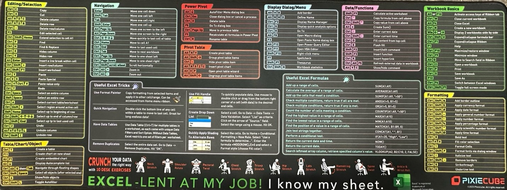
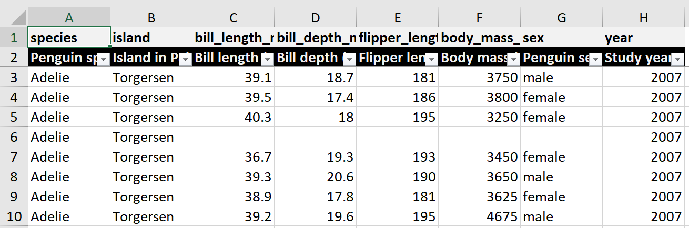
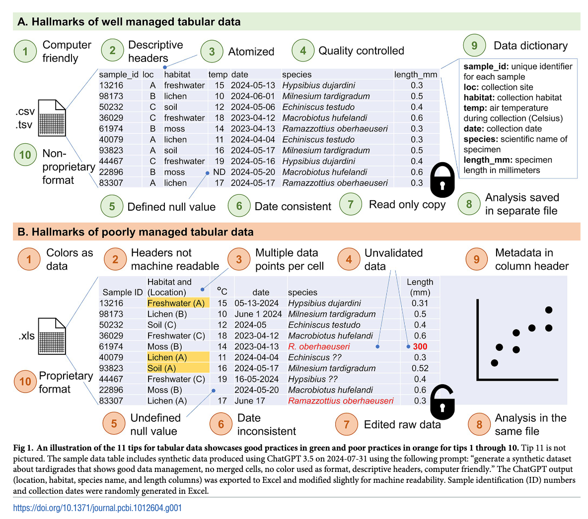
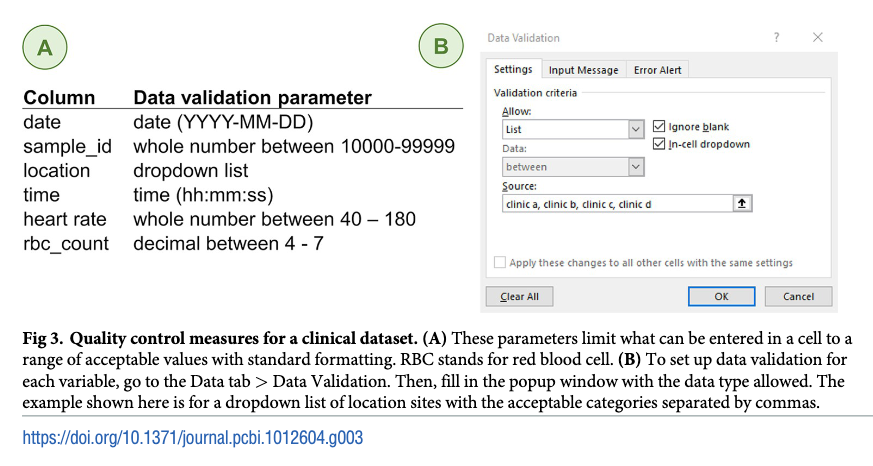

# Spreadsheets {#sec-spdsht .unnumbered}

## Misc {#sec-spdsht-misc .unnumbered}

-   Packages

    -   [{]{style="color: #990000"}[readxl](https://readxl.tidyverse.org/){style="color: #990000"}[}]{style="color: #990000"}
        -   Read: `read_excel("your_file.xlsx", range = "C1:E4", sheet = "sheet_name", n_max = 3)`
        -   Doesn't used Java, like [{]{style="color: #990000"}[xlsx](https://github.com/colearendt/xlsx){style="color: #990000"}[}]{style="color: #990000"}, which can be a pain if you don't have the correct Java runtime installed. Although there's [{rJavaEnv}]{style="color: #990000"} now to help that. (see [Misc \>\> R](misc.qmd#sec-misc-r){style="color: green"})
    -   [{]{style="color: #990000"}[openxlsx2](https://janmarvin.github.io/openxlsx2/){style="color: #990000"}[}]{style="color: #990000"} - A modern reinterpretation of [{openxlsx}]{style="color: #990000"}
    -   [{]{style="color: #990000"}[openxlsx2Extras](https://elipousson.github.io/openxlsx2Extras/){style="color: #990000"}[}]{style="color: #990000"} - Contains wrappers than extend features and convenience functions
    -   [{pandas}]{style="color: goldenrod"}
        -   Read: `pd.read_excel('your_file.xlsx, skiprows = 7, usecols = 'C:D')`
    -   [{]{style="color: goldenrod"}[openpyxl](https://openpyxl.readthedocs.io/en/stable/){style="color: goldenrod"}[}]{style="color: goldenrod"} - Read/write Excel 2010 xlsx/xlsm/xltx/xltm files
    -   [{]{style="color: #990000"}[splitr](https://cran.r-project.org/web/packages/splitr/index.html){style="color: #990000"}[}]{style="color: #990000"} - Provides tools for splitting large Excel worksheets into multiple smaller sheets based on a specified number of rows per chunk.
    -   [{]{style="color: #990000"}[tflmetaR](https://cran.r-project.org/web/packages/tflmetaR/index.html){style="color: #990000"}[}]{style="color: #990000"} - Provides functions to retrieve headers, titles, and footnotes from structured metadata sources
    -   [{]{style="color: #990000"}[tidyxl](https://nacnudus.github.io/tidyxl/){style="color: #990000"}[}]{style="color: #990000"} - Imports non-tabular data from Excel files into R. It exposes cell content, position, formatting and comments in a tidy structure for further manipulation, especially by the unpivotr package.
    -   [{]{style="color: #990000"}[unpivotr](https://nacnudus.github.io/unpivotr/){style="color: #990000"}[}]{style="color: #990000"} - Cleans nasty, formatted excel spreadsheets with such characteristics as:
        -   Multi-headered hydra; Headers anywhere but at the top of each column Non-text headers e.g. dates
        -   Meaningful comments; Other stuff around the table
        -   Several similar tables in one sheet; Nested HTML tables
        -   Meaningful formatting; Sentinel values Superscript symbols

-   Resources

    -   [Spreadsheet Munging Strategies](https://nacnudus.github.io/spreadsheet-munging-strategies/)
    -   [Generating Data Dictionary for Excel Files Using OpenPyxl and AI Agents](https://towardsdatascience.com/generating-data-dictionary-for-excel-files-using-openpyxl-and-ai-agents/)
    -   Slides:[Tackliing Formatted Tabular Data From Excel](https://jauntyjjs.github.io/useR-2024/#/title-slide)
        -   Shows how to manually clean so common issues with formatted spreadsheets

-   Cheatsheet\
    {.lightbox}

-   Issues with flat files (CSV, XPT, Excel, etc.) for data storage and usage for data analysis

    -   **Disconnected Flat Files**: Related datasets stored as separate files despite being inherently relational
    -   **Lost Audit Trails**: No automatic tracking of who changed what and when
    -   **Version Control Gaps**: Multiple dataset versions scattered across folders with unclear provenance
    -   **Reproducibility Issues**: Inability to recreate analyses from specific time points
    -   **Collaboration Friction**: Multiple analysts working with different versions of the same data
    -   **Compliance Challenges**: Difficulty demonstrating data integrity and audit trails for regulated industries

## Operations {#sec-spdsht-ops .unnumbered}

-   [{]{style="color: #990000"}[janitor::excel_numeric_to_date](https://sfirke.github.io/janitor/reference/excel_numeric_to_date.html){style="color: #990000"}[}]{style="color: #990000"} - Convert excel date formats into date formats

    -   [Example]{.ribbon-highlight} ([source](https://bsky.app/profile/bcrossman.bsky.social/post/3m5easgnszc2n)): `mutate(clean_date = coalesce(ymd(date_col), excel_numeric_to_date(date_col)))`

-   Some Excel files are binaries and in order to use `download.file`, you must set [mode = "wb"]{.arg-text}

    ``` r
    download.file(url, 
                  destfile = glue("{rprojroot::find_rstudio_root_file()}/data/cases-age.xlsx"), 
                  mode = "wb")
    ```

-   Create workbook from labelled columns ([source](https://www.pipinghotdata.com/posts/2022-09-13-the-case-for-variable-labels-in-r/))\
    {.lightbox width="532"}

    ``` r
    # devtools::install_github("pcctc/croquet")
    library(croquet)
    library(openxlsx)

    wb <- createWorkbook() |> 
      add_labelled_sheet(penguins_labelled)

    saveWorkbook(wb, "penguins_labelled.xlsx")
    ```

    -   Also see [R, Snippets \>\> Cleaning](r-snippets.qmd#sec-r-snippets-cleaning){style="color: green"} \>\> Create labelled columns

-   Save and view spreadsheet ([Thread](https://fosstodon.org/@kdm9@genomic.social/113129034469639913))

    ``` r
    kview = function(df) {
      # fn <- paste0(tempfile(), ".tsv")
      # write_tsv(df,
      #           fn,
      #           na = "")
      # system(sprintf("libreoffice --calc %s", fn))

      # fn <- paste0(tempfile(), ".csv")
      # write.csv(x = x, file = fn)
      # fs::file_show(fn)

      fn <- paste0(tempfile(), ".xlsx")
      writexl::write_xlsx(df, fn)
      system(sprintf("wslview %s", fn))
    }
    ```

-   Export dataframes as multiple tabs in a spreadsheet ([source](https://bsky.app/profile/cghlewis.bsky.social/post/3lmtumkdfis2i))

    ``` r
    shts_school <- 
      list(
        school_a = df_a_sch,
        school_b = df_b_sch,
        school_c = df_c_sch
      )
    openxlsx::write.xlsx(shts_school, file = "school-results.xlsx")
    ```

## Catastrophes {#sec-spdsht-cats .unnumbered}

-   [EuSPRIG Horror Stories Spreadsheet mistakes – news stories](https://eusprig.org/research-info/horror-stories/)
-   Industry [studies](https://www.igi-global.com/article/know-spreadsheet-errors/55750) show that 90 percent of spreadsheets containing more than 150 rows have at least one major mistake.
-   Releasing confidential information
    -   Irish police accidently handed out officers private information when sharing sheets with statistics due to a freedom of information request. ([link](https://arstechnica.com/science/2024/01/we-keep-making-the-same-mistakes-with-spreadsheets-despite-bad-consequences/?utm_brand=arstechnica&utm_social-type=owned&utm_source=mastodon&utm_medium=social))
    -   Thousands of Afghans have moved to the UK under a secret scheme which was set up after a British official inadvertently leaked their data, it can be revealed. ([link](https://www.bbc.com/news/articles/cvg8zy78787o))
        -   "He said it was as a result of a spreadsheet being emailed "outside of authorised government systems", which he described as a "serious departmental error" - though the Metropolitan Police decided a police investigation was not necessary."
-   Errors when combining sheets
    -   Wales dismissed anaesthesiologists after mistakenly deeming them "unappointable." Spreadsheets from different areas lacked standardization in formatting, naming conventions, and overall structure. To make matters worse, data was manually copied and pasted between various spreadsheets, a time-consuming and error-prone process. ([link](https://arstechnica.com/science/2024/01/we-keep-making-the-same-mistakes-with-spreadsheets-despite-bad-consequences/?utm_brand=arstechnica&utm_social-type=owned&utm_source=mastodon&utm_medium=social))
    -   When consolidating assets from different spreadsheets, the spreadsheet data was not “cleaned” and formatted properly. The Icelandic bank’s shares were subsequently undervalued by as much as £16 million. ([link](https://arstechnica.com/science/2024/01/we-keep-making-the-same-mistakes-with-spreadsheets-despite-bad-consequences/?utm_brand=arstechnica&utm_social-type=owned&utm_source=mastodon&utm_medium=social))
-   Data entry errors
    -   Cryto.com accidentally transferred \$10.5 million instead of \$100 into the account of an Australian customer due to an incorrect number being entered on a spreadsheet. ([link](https://arstechnica.com/science/2024/01/we-keep-making-the-same-mistakes-with-spreadsheets-despite-bad-consequences/?utm_brand=arstechnica&utm_social-type=owned&utm_source=mastodon&utm_medium=social))
    -   Norway’s \$1.5tn sovereign wealth fund lost \$92M, on an error relating to how it calculated its mandated benchmark. A person used the wrong date, December 1st instead of November 1st. ([link](https://www.ft.com/content/db864323-5b68-402b-8aa5-5c53a309acf1))

## Best Practices {#sec-spdsht-bprac .unnumbered}

-   [Better Spreadsheets](https://better-spreadsheets.netlify.app/) - Workshop materials covering Woo and Broman paper
-   [Simple tips for recording data in spreadsheets](https://statsepi.substack.com/p/simple-tips-for-recording-data-in) - Dahly's take on best practices
-   [Data organization in spreadsheets](https://peerj.com/preprints/3183/) (Woo and Broman) - See paper for the reasoning behind these
    -   Be consistent
        -   Spelling matters: “Weather” is obviously different to “Whether”.
        -   Case matters: “Rainy” is different to “rainy”.
        -   Space matters: “Day of Week” is different to “DayofWeek”.
    -   Write dates like YYYY-MM-DD
    -   Don't leave any cells empty
        -   Using a “NA” or even a hyphen in the cells with missing data makes it clear that the data are known to be missing rather than unintentionally left blank.
    -   Put just one thing in a cell
    -   Organize the data as a single rectangle (with subjects as rows and variables as columns, and with a single header row)
    -   Create a data dictionary
        -   This should at least include columns for:
            -   A description of the variable
            -   Units (if applicable)
        -   Other options
            -   Expected minimum and maximum values
            -   All possible categories
    -   Don't include calculations in the raw data files
    -   Don't use font color or highlighting as data
    -   Choose informative names for variables/columns
        -   Usually no more than 8-12 characters
        -   For variables that are naturally grouped, add a consistently formatted prefix or suffix which is separated from the main variable name with an underscore.
    -   Make backups
    -   Use data validation to avoid data entry errors
    -   Save the data in plain text files.
-   [Tips for data entry in Excel](https://cghlewis.com/blog/excel_entry/) (Lewis)
    -   See post for details on how do this stuff in Excel
    -   Adding data validation to improve data quality
        -   [Excel](https://support.microsoft.com/en-us/office/more-on-data-validation-f38dee73-9900-4ca6-9301-8a5f6e1f0c4c) and [Google Sheets](https://support.google.com/appsheet/answer/10107325?hl=en)
        -   Variables that should be numbers should only allow you to enter numbers. Further, there should be a rule that contains the range of numbers you can enter.
        -   Categorical variables that are recorded with text should only allow you to enter predefined text for each category. 
        -   Variables reflecting dates and times should only allow you to enter those using the exact same format. Again, some constraint on the range of acceptable dates or times can be helpful. 
    -   Using forms to improve data entry security
    -   Linking information across sheets to reduce redundancy
        -   Uses XLOOKUP to emulate primary/foreign key functionality in relational databases
    -   Double data entry to reduce errors
        -   A designated team member creates two identical entry forms. One person enters forms in the first entry screen, a different person enters forms in the second entry screen.
-   [Eleven quick tips for properly handling tabular data](https://journals.plos.org/ploscompbiol/article?id=10.1371/journal.pcbi.1012604)
    -   Dos and Don'ts\
        {.lightbox width="532"}
    -   Data Validation\
        {.lightbox width="532"}

## Transitioning from Spreadsheet to DB {#sec-spdsht-transspr}

-   Misc
    -   When you start to have multiple datasets or when you want to make use of several columns in one table and other columns in another table you should consider going the local database route.
    -   Use db "normalization" to figure out a schema
    -   Also see
        -   [Databases, Normalization](db-normalization.qmd#sec-db-norm){style="color:green"}
        -   [Databases, Warehouses \>\> Design a Warehouse](db-warehouses.qmd#sec-db-ware-dsgn){style="color: green"}
-   DB advantages over spreadsheets:
    -   Efficient analysis: Relational databases allow information to be retrieved quicker to then be analyzed with SQL (Structured Query Language), to then run queries.
        -   Once spreadsheets get large, they can lag or freeze when opening, editing, or performing simple analyses in them.
    -   Centralized data management: Since relational databases often require a certain type or format of data to be input into each column of a table, it's less likely that you'll end up with duplicate or inconsistent data.
    -   Scalability: If your business is experiencing high growth, this means that the database will expand, and a relational database can accommodate an increased volume of data.
-   Start documenting the spreadsheets
    -   File Names, File Paths
    -   Understand where values are coming from
        -   Source (e.g. department, store, sensor), Owner
    -   How rows of data are being generated
        -   Who/What is inputting the data
    -   How does each spreadsheet/notebooks/set of spreadsheets fit in the company's business model
        -   How are they being used and by whom
    -   Map the spreadsheets relationships to one another
        -   See [Databases, Warehouses \>\> Design a Warehouse](db-warehouses.qmd#sec-db-ware-dsgn){style="color: green"}
